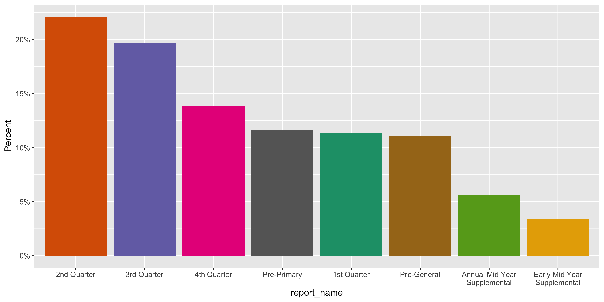
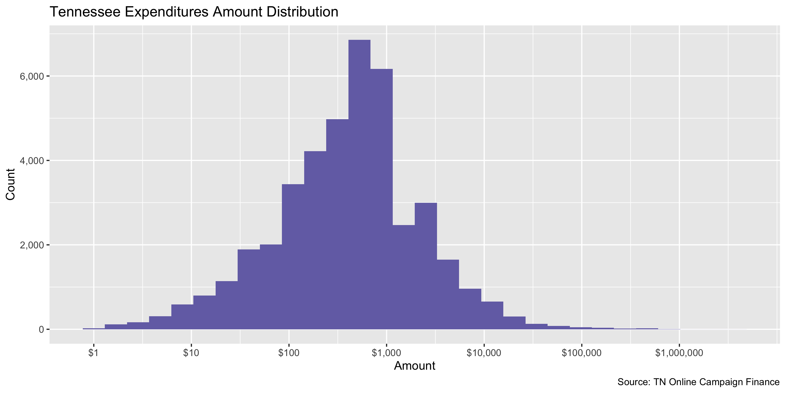
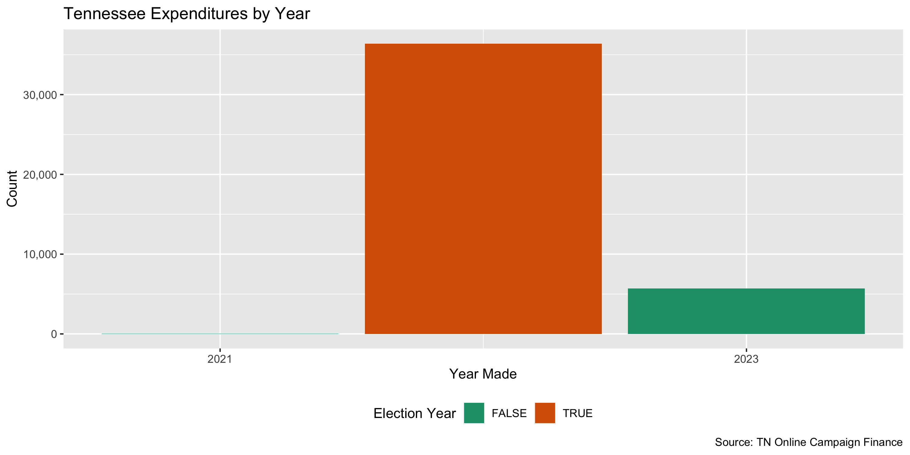

TN Expenditures
================
Kiernan Nicholls, Julia Ingram & Yanqi Xu
2023-09-17 16:33:43

- [Objectives](#objectives)
- [Packages](#packages)
- [Wrangle](#wrangle)
- [Address](#address-1)
- [Explore](#explore)
- [Conclude](#conclude)
- [Export](#export)
- [Upload](#upload)

<!-- Place comments regarding knitting here -->

## Objectives

This document describes the process used to complete the following
objectives:

1.  How many records are in the database?
2.  Check for duplicates
3.  Check ranges
4.  Is there anything blank or missing?
5.  Check for consistency issues
6.  Create a five-digit ZIP Code called `zip`
7.  Create a `year` field from the transaction date
8.  Make sure there is data on both parties to a transaction

## Packages

The following packages are needed to collect, manipulate, visualize,
analyze, and communicate these results. The `pacman` package will
facilitate their installation and attachment.

The `campfin` package will also have to be installed from GitHub. This
package contains functions custom made to help facilitate the processing
of campaign finance data.

``` r
if (!require("pacman")) {
  install.packages("pacman")
}

pacman::p_load(
  tidyverse,
  lubridate,
  janitor,
  campfin,
  aws.s3,
  refinr,
  scales,
  rvest,
  here,
  httr,
  cli,
  fs
)
```

This document should be run as part of the `R_campfin` project, which
lives as a sub-directory of the more general, language-agnostic
[`irworkshop/accountability_datacleaning`](https://github.com/irworkshop/accountability_datacleaning "TAP repo")
GitHub repository.

The `R_campfin` project uses the [RStudio
projects](https://support.rstudio.com/hc/en-us/articles/200526207-Using-Projects "Rproj")
feature and should be run as such. The project also uses the dynamic
`here::here()` tool for file paths relative to *your* machine.

``` r
# where does this document knit?
here::here()
#> [1] "/Users/yanqixu/code/accountability_datacleaning"
```

``` r
tn_dir <- dir_create(here("state","tn", "expends", "data", "raw"))
tn_csv <- dir_ls(tn_dir, glob = "*.csv")
tn_yrs <- as.numeric(unique(str_extract(tn_csv, "\\d{4}")))
```

### Import

Data is obtained from the [Tennessee Bureau of Ethics and Campaign
Finance (BECF)](https://www.tn.gov/tref.html).

Data can be searched on the [BECF
portal](https://apps.tn.gov/tncamp-app/public/ceresults.htm) by year and
downloaded locally.

The last update included 2000-2021, so we are going to include all
updates between then and July 15, 2023. The next update should replace
this one and include everything from 2022 on.

``` r
for (y in 2022:2023) {
  if (y %in% tn_yrs) {
    message("Files for year already saved")
    next
  }
  cli_h2("Year: {y}")
  # request data ------------------------------------------------------------

  # visit home page for session ID cookies
  search_home <- GET("https://apps.tn.gov/tncamp/public/cesearch.htm")

  sesh_id <- cookies(search_home)
  sesh_id <- setNames(sesh_id$value, sesh_id$name)

  # submit POST request for all FROM for year Y
  search_post <- POST(
    url = "https://apps.tn.gov/tncamp/public/cesearch.htm",
    set_cookies(sesh_id),
    body = list(
      searchType = "expenditures",
      toType = "both", # to both candidates and committees
      toCandidate = TRUE, # from all types
      toPac = TRUE,
      toOther = TRUE,
      electionYearSelection = "",
      yearSelection = y, # for given year
      recipientName = "", # no name filters
      contributorName = "",
      employer = "",
      occupation = "",
      zipCode = "",
      candName = "",
      vendorName = "",
      vendorZipCode = "",
      purpose = "",
      typeOf = "all",
      amountSelection = "equal",
      amountDollars = "",
      amountCents = "",
      typeField = TRUE, # add all available fields
      adjustmentField = TRUE,
      amountField = TRUE,
      dateField = TRUE,
      electionYearField = TRUE,
      reportNameField = TRUE,
      candidatePACNameField = TRUE,
      vendorNameField = TRUE,
      vendorAddressField = TRUE,
      purposeField = TRUE,
      candidateForField = TRUE,
      soField = TRUE,
      `_continue` = "Continue",
      `_continue` = "Search"
    )
  )


  # read search results -----------------------------------------------------
  search_get <- GET(
    url = "https://apps.tn.gov/tncamp/public/ceresults.htm",
    set_cookies(sesh_id)
  )

  search_list <- content(search_get)

  # find csv export link at bottom of page
  csv_link <- search_list %>%
    html_element(".exportlinks > a") %>%
    html_attr("href")

  csv_link <- str_c("https://apps.tn.gov", csv_link)

  # set initial loop numbers
  more_loop <- 1
  n_all <- 0

  # find initial number of results
  n_row <- parse_number(html_text(html_element(search_list, ".pagebanner")))
  n_all <- n_all + n_row
  cli_h3("First results: {n_row} results")

  # define first file name
  csv_path <- path(tn_dir, sprintf("tn_expend_%i-%i.csv", y, more_loop))

  # download the first list of results as CSV
  csv_get <- GET(csv_link, write_disk(csv_path), progress("down"))

  # check for the "More" button
  has_more <- !is.na(html_element(search_list, ".btn-blue"))

  while (has_more) {
    Sys.sleep(runif(1, 1, 3))
    cli_alert_warning("More records available")
    more_loop <- more_loop + 1 # increment loop number
    more_get <- GET( # follow the more button link
      url = "https://apps.tn.gov/tncamp/public/ceresultsnext.htm",
      set_cookies(sesh_id)
    )
    more_list <- content(more_get)

    # find number of more results found
    n_row <- parse_number(html_text(html_element(more_list, ".pagebanner")))
    n_all <- n_all + n_row
    cli_h3("More results page {more_loop}: {n_row} results")

    # create new path and save CSV file
    csv_path <- path(tn_dir, sprintf("tn_expend_%i-%i.csv", y, more_loop))
    csv_get <- GET(csv_link, write_disk(csv_path), progress("down"))

    # check for more button
    has_more <- !is.na(html_element(more_list, ".btn-blue"))
  }
  # finish when button disappears
  cli_alert_success("No more results this year")

  Sys.sleep(runif(1, 10, 30))
}
```

``` r
tn_csv <- dir_ls(tn_dir, glob = "*.csv")
```

### Read

We will first use `purrr::map()` to use `readxl::read_excel()` and
create a list of data frames. read together ———————————————————–

``` r
tne <- map_df(
  .x = tn_csv,
  .f = function(x) {
    with_edition(
      edition = 1,
      code = read_delim(
        file = x,
        delim = ",",
        escape_backslash = FALSE,
        escape_double = FALSE,
        col_types = cols(
          .default = col_character(),
          `Amount` = col_number(),
          # 09/0/2008, 55/21/2013, 06/31/2020
          # `Date` = col_date("%m/%d/%Y"),
          `Election Year` = col_integer()
        )
      )
    )
  }
)

tne <- clean_names(tne, case = "snake")
n_distinct(na.omit(tne$type)) == 3
#> [1] TRUE

bad_dates <- which(is.na(mdy(tne$date)) & !is.na(tne$date))
munge_dt <- str_replace(
  string = tne$date[bad_dates],
  pattern = "(\\d+)/(\\d+)/(\\d+)",
  replacement = "\\3-\\1-\\2"
)
```

### Date

fix dates with `lubridate`  
invalid dates with be removed

``` r
tne <- mutate(tne, across(date, mdy))
```

split address ———————————————————–

``` r
x3 <- tne %>%
  distinct(vendor_address) %>%
  separate(
    col = vendor_address,
    into = c("addr_city", "state_zip"),
    sep = "\\s,\\s(?=[^,]*,[^,]*$)",
    remove = FALSE,
    extra = "merge",
    fill = "left"
  ) %>%
  separate(
    col = state_zip,
    into = c("state", "zip"),
    sep = ",\\s(?=\\d)",
    extra = "merge",
    fill = "left"
  )

good_split <- filter(x3, state %in% valid_abb)
bad_split <- filter(x3, state %out% valid_abb)
```

fix split ————————————————————— mising something in the middle, move and
re-split

``` r
no_zip <- bad_split %>%
  filter(is.na(state) & is.na(addr_city) & str_detect(zip, "\\s\\w{2}$")) %>%
  select(-addr_city, -state) %>%
  separate(
    col = zip,
    into = c("addr_city", "state"),
    sep = "\\s?,\\s?(?=[^,]*$)",
    extra = "merge",
    fill = "right"
  )
```

remove fixed from bad

``` r
bad_split <- bad_split %>%
  filter(vendor_address %out% no_zip$vendor_address)
```

no zip, city-state moved to end, split-merge city into addr

``` r
no_zip <- bad_split %>%
  filter(!is.na(addr_city) & is.na(state) & str_detect(zip, "\\s\\w{2}$")) %>%
  separate(
    col = zip,
    into = c("city", "state"),
    sep = "\\s+,\\s"
  ) %>%
  unite(
    col = addr_city,
    ends_with("city"),
    sep = ", "
  ) %>%
  bind_rows(no_zip)

bad_split <- bad_split %>%
  filter(vendor_address %out% no_zip$vendor_address)
```

no state, addr moved to state, move to addr and remove state

``` r
no_state <- bad_split %>%
  filter(is.na(addr_city) & !is.na(state) & str_detect(zip, "^\\d{5,}")) %>%
  select(-addr_city) %>%
  rename(addr_city = state)

bad_split <- bad_split %>%
  filter(vendor_address %out% no_state$vendor_address)
```

combine everything and extract states

``` r
full_bad <- bad_split %>%
  filter(is.na(state) | nchar(state) != 2) %>%
  unite(
    -vendor_address,
    col = addr_city,
    sep = ", ",
    na.rm = TRUE
  ) %>%
  mutate(
    state = str_extract(addr_city, "^[A-Z]{2}$"),
    addr_city = na_if(str_remove(addr_city, "^[A-Z]{2}$"), "")
  )

bad_split <- bad_split %>%
  filter(vendor_address %out% full_bad$vendor_address)
```

remaining just have bad states in general

``` r
bad_split %>%
  count(state, sort = TRUE)
#> # A tibble: 0 × 2
#> # … with 2 variables: state <chr>, n <int>
```

recombine fixes and fill with empty cols

``` r
bad_fix <- bind_rows(no_zip, no_state, full_bad, bad_split)
bad_fix <- mutate(bad_fix, across(.fns = str_squish))

sample_n(bad_fix, 20)
#> # A tibble: 20 × 4
#>    vendor_address                                          addr_city                    state zip  
#>    <chr>                                                   <chr>                        <chr> <chr>
#>  1 1617 S. HIGHLAND AVENUE, JACKSON , TN                   1617 S. HIGHLAND AVENUE, JA… TN    <NA> 
#>  2 40 NAMAL , TEL AVIV, 6350671                            40 NAMAL, TEL AVIV, 6350671  <NA>  <NA> 
#>  3 404 JAMES ROBERTSON PARKWAY, NASHVILLE, 37243           404 JAMES ROBERTSON PARKWAY… <NA>  37243
#>  4 55 RUE DES FRANCS BOURGEOIS, PARIS, 75004               55 RUE DES FRANCS BOURGEOIS… <NA>  75004
#>  5 1 SKYVIEW DRIVE , FORTH WORTH, 76155                    1 SKYVIEW DRIVE, FORTH WORT… <NA>  <NA> 
#>  6 1800 LINDEN AVENUE, MEMPHIS, 38104                      1800 LINDEN AVENUE, MEMPHIS  <NA>  38104
#>  7 7205 KINGSTON PIKE, KNOXVILLE, 37934                    7205 KINGSTON PIKE, KNOXVIL… <NA>  37934
#>  8 6TH AVE NORTH, NASHVILLE , TN                           6TH AVE NORTH, NASHVILLE     TN    <NA> 
#>  9 5F CIRCULAR ROAD, MULTIAN, 60000                        5F CIRCULAR ROAD, MULTIAN    <NA>  60000
#> 10 119 S. MAIN, MEMPHIS , TN                               119 S. MAIN, MEMPHIS         TN    <NA> 
#> 11 HUDSONWEG 8, VENIO, 5928LW                              HUDSONWEG 8, VENIO, 5928LW   <NA>  <NA> 
#> 12 4100 CLOVER MEADOWS DRIVE, FRANKLIN, 37067              4100 CLOVER MEADOWS DRIVE, … <NA>  37067
#> 13 SURRY HILLS NSW, SYDNEY, 02000                          SURRY HILLS NSW, SYDNEY      <NA>  02000
#> 14 108 MID TOWN CT STE 203, HENDERSONVILLE, 37075          108 MID TOWN CT STE 203, HE… <NA>  37075
#> 15 219 DUFFERIN STREET, UNIT 6A, TORONTO, M6K 3J1          219 DUFFERIN STREET, UNIT 6… <NA>  <NA> 
#> 16 714 W MAIN ST, MURFREESBORO, 37129                      714 W MAIN ST, MURFREESBORO  <NA>  37129
#> 17 404 JAMES ROBERTSON PARKWAY SUITE 104, NASHVILLE, 37243 404 JAMES ROBERTSON PARKWAY… <NA>  37243
#> 18 AM LENWERK 13, BIEFIELD, 33609                          AM LENWERK 13, BIEFIELD      <NA>  33609
#> 19 800 CONNECTICUT AVENUE. CT 0685, NORWALK, 06854         800 CONNECTICUT AVENUE. CT … <NA>  06854
#> 20 1910 MADISON AVENUE #95, MEMPHIS, 38104                 1910 MADISON AVENUE #95, ME… <NA>  38104
```

recombine with good splits

``` r
tn_addr <- bind_rows(good_split, bad_fix)
tn_addr <- mutate(tn_addr, across(everything(), str_squish))
```

## Wrangle

We will wrangle the address to separte the city, zip and state fields.
\### ZIP trim zip codes

``` r
tn_addr <- tn_addr %>%
  mutate(across(zip, normal_zip)) %>%
  rename(zip_norm = zip)
```

### State

state already very good

``` r
prop_in(tn_addr$state, valid_state)
#> [1] 1
tn_addr <- rename(tn_addr, state_norm = state)
```

### Address

split address on last comma

``` r
tn_addr <- separate(
  data = tn_addr,
  col = addr_city,
  into = c("addr_sep", "city_sep"),
  sep = ",\\s?(?=[^,]*$)",
  remove = TRUE,
  extra = "merge",
  fill = "left"
)
```

### City

#### Normalize

normalize city

``` r
tn_city <- tn_addr %>%
  distinct(city_sep, state_norm, zip_norm) %>%
  mutate(
    city_norm = normal_city(
      city = city_sep,
      abbs = usps_city,
      states = c("TN", "DC"),
      na = invalid_city,
      na_rep = TRUE
    )
  )

tn_city <- tn_city %>%
  # match city against zip expect
  left_join(
    y = zipcodes,
    by = c(
      "state_norm" = "state",
      "zip_norm" = "zip"
    )
  ) %>%
  rename(city_match = city) %>%
  # swap with expect if similar
  mutate(
    match_abb = is_abbrev(city_norm, city_match),
    match_dist = str_dist(city_norm, city_match),
    city_swap = if_else(
      condition = !is.na(match_dist) & (match_abb | match_dist == 1),
      true = city_match,
      false = city_norm
    )
  ) %>%
  select(
    -city_match,
    -match_dist,
    -match_abb
  )
```

#### Refine

rejoin to address

``` r
tn_addr <- left_join(tn_addr, tn_city)

good_refine <- tn_addr %>%
  mutate(
    city_refine = city_swap %>%
      key_collision_merge() %>%
      n_gram_merge(numgram = 1)
  ) %>%
  filter(city_refine != city_swap) %>%
  inner_join(
    y = zipcodes,
    by = c(
      "city_refine" = "city",
      "state_norm" = "state",
      "zip_norm" = "zip"
    )
  )
```

add refined cities back

``` r
tn_addr <- tn_addr %>%
  left_join(good_refine, by = names(.)) %>%
  mutate(city_refine = coalesce(city_refine, city_swap))
```

## Address

normalize address with usps standard

``` r
tn_addr <- tn_addr %>%
  mutate(
    .keep = "unused",
    .before = city_sep,
    addr_norm = normal_address(
      address = addr_sep,
      abbs = usps_street,
      na = invalid_city,
      na_rep = TRUE
    )
  )

tn_addr <- distinct(tn_addr)
```

add back all split and cleaned addresses

``` r
tne <- left_join(
  x = tne,
  y = tn_addr,
  by = "vendor_address"
)

many_city <- c(valid_city, extra_city)
many_city <- c(many_city, "RESEARCH TRIANGLE PARK", "FARMINGTON HILLS")

progress_table(
  tne$city_sep,
  tne$city_norm,
  tne$city_swap,
  tne$city_refine,
  compare = many_city
)
#> # A tibble: 4 × 6
#>   stage           prop_in n_distinct prop_na n_out n_diff
#>   <chr>             <dbl>      <dbl>   <dbl> <dbl>  <dbl>
#> 1 tne$city_sep      0.979       1161  0.0383   837    227
#> 2 tne$city_norm     0.983       1136  0.0391   686    201
#> 3 tne$city_swap     0.994       1008  0.0391   237     66
#> 4 tne$city_refine   0.995       1002  0.0391   222     62
```

remove intermediary columns

``` r
tne <- tne %>%
  select(
    -city_sep,
    -city_norm,
    -city_swap
  ) %>%
  # consistent rename and reorder
  rename(city_norm = city_refine) %>%
  relocate(city_norm, .after = addr_norm) %>%
  rename_with(~str_replace(., "_norm", "_clean"))
```

## Explore

``` r
glimpse(tne)
#> Rows: 42,149
#> Columns: 16
#> $ type               <chr> NA, NA, NA, NA, NA, NA, NA, "Neither", "Neither", NA, "Neither", NA, N…
#> $ adj                <chr> "N", "N", "N", "N", "N", "N", "N", "N", "N", "N", "N", "N", "N", "N", …
#> $ amount             <dbl> 1000.00, 100.44, 163.00, 500.00, 325.00, 81.88, 500.00, 133.11, 75.85,…
#> $ date               <date> 2022-01-18, 2022-01-18, 2022-01-18, 2022-01-19, 2022-01-20, 2022-01-2…
#> $ election_year      <int> 2022, 2022, 2022, 2022, 2022, 2022, 2022, NA, NA, 2022, NA, 2022, 2022…
#> $ report_name        <chr> "1st Quarter", "1st Quarter", "1st Quarter", "1st Quarter", "1st Quart…
#> $ candidate_pac_name <chr> "BRIGGS, RICHARD", "DUNN, JAMES", "DUNN, JAMES", "DUNN, JAMES", "HULSE…
#> $ vendor_name        <chr> "VOR MEDIA", "NEWPORT PLAIN-TALK", "NEWPORT PLAIN-TALK", "SEVIER COUNT…
#> $ vendor_address     <chr> "P.O. BOX 58403, NASHVILLE , TN, 37205", "145 E BROADWAY, NEWPORT , TN…
#> $ purpose            <chr> "SOCIAL MEDIA CONSULTING", "ADVERTISING", "ADVERTISING", "LINCOLN DAY …
#> $ candidate_for      <chr> NA, NA, NA, NA, NA, NA, NA, NA, NA, NA, NA, NA, NA, NA, NA, NA, NA, NA…
#> $ s_o                <chr> NA, NA, NA, NA, NA, NA, NA, NA, NA, NA, NA, NA, NA, NA, NA, NA, NA, NA…
#> $ addr_clean         <chr> "PO BOX 58403", "145 E BROADWAY", "145 E BROADWAY", "125 COURT AVE", "…
#> $ city_clean         <chr> "NASHVILLE", "NEWPORT", "NEWPORT", "SEVIERVILLE", "KINGSPORT", "GOODLE…
#> $ state_clean        <chr> "TN", "TN", "TN", "TN", "TN", "TN", "TN", NA, "TN", "TN", "TN", "TN", …
#> $ zip_clean          <chr> "37205", "37821", "37821", "37862", "37664", "37072", "37205", NA, "37…
```

### Missing

flag NA values

``` r
col_stats(tne, count_na)
#> # A tibble: 16 × 4
#>    col                class      n        p
#>    <chr>              <chr>  <int>    <dbl>
#>  1 type               <chr>  30211 0.717   
#>  2 adj                <chr>      0 0       
#>  3 amount             <dbl>      0 0       
#>  4 date               <date>    67 0.00159 
#>  5 election_year      <int>  18608 0.441   
#>  6 report_name        <chr>      0 0       
#>  7 candidate_pac_name <chr>      0 0       
#>  8 vendor_name        <chr>     12 0.000285
#>  9 vendor_address     <chr>     18 0.000427
#> 10 purpose            <chr>      0 0       
#> 11 candidate_for      <chr>  41297 0.980   
#> 12 s_o                <chr>  41414 0.983   
#> 13 addr_clean         <chr>   1655 0.0393  
#> 14 city_clean         <chr>   1648 0.0391  
#> 15 state_clean        <chr>   1732 0.0411  
#> 16 zip_clean          <chr>   1684 0.0400
key_vars <- c("date", "candidate_pac_name", "amount", "vendor_name")
tne <- flag_na(tne, all_of(key_vars))
sum(tne$na_flag)
#> [1] 79
tne %>%
  filter(na_flag) %>%
  select(all_of(key_vars)) %>%
  sample_n(10)
#> # A tibble: 10 × 4
#>    date       candidate_pac_name                  amount vendor_name                    
#>    <date>     <chr>                                <dbl> <chr>                          
#>  1 2022-07-11 HELTON, ESTHER                       1000  <NA>                           
#>  2 NA         JMS PAC                              1000  STEVENS, JOHN                  
#>  3 NA         CHANGE TN                             398. AT&T                           
#>  4 2022-06-30 GENERAL MOTORS COMPANY PAC (GMPAC) 497746. <NA>                           
#>  5 NA         HODGES, JASON                        1215. WILCOX, EMILY                  
#>  6 NA         WHITE COUNTY DEMOCRATIC PARTY         517  PAPER FILE - REGISTRY TO KEY   
#>  7 NA         ATKINS US HOLDINGS, INC. PAC        12000  NON TENN EXPENSE               
#>  8 NA         HEARPAC                               100  TN REGISTRY OF ELECTION FINANCE
#>  9 NA         MARSH, PAT                            366. MURFREESBORO WINE AND SPIRITS  
#> 10 NA         HODGES, JASON                         750  LEVERETT, RASHIDA
```

### Categorical

count distinct values

``` r
col_stats(tne, n_distinct)
#> # A tibble: 17 × 4
#>    col                class      n         p
#>    <chr>              <chr>  <int>     <dbl>
#>  1 type               <chr>      4 0.0000949
#>  2 adj                <chr>      2 0.0000475
#>  3 amount             <dbl>  12700 0.301    
#>  4 date               <date>   563 0.0134   
#>  5 election_year      <int>     13 0.000308 
#>  6 report_name        <chr>     10 0.000237 
#>  7 candidate_pac_name <chr>   1129 0.0268   
#>  8 vendor_name        <chr>  11492 0.273    
#>  9 vendor_address     <chr>  14034 0.333    
#> 10 purpose            <chr>   3608 0.0856   
#> 11 candidate_for      <chr>    161 0.00382  
#> 12 s_o                <chr>      3 0.0000712
#> 13 addr_clean         <chr>  11476 0.272    
#> 14 city_clean         <chr>   1002 0.0238   
#> 15 state_clean        <chr>     53 0.00126  
#> 16 zip_clean          <chr>   1807 0.0429   
#> 17 na_flag            <lgl>      2 0.0000475
```

count/plot discrete

``` r
count(tne, type)
#> # A tibble: 4 × 2
#>   type            n
#>   <chr>       <int>
#> 1 InKind        157
#> 2 Independent   735
#> 3 Neither     11046
#> 4 <NA>        30211
count(tne, adj)
#> # A tibble: 2 × 2
#>   adj       n
#>   <chr> <int>
#> 1 N     41354
#> 2 Y       795
explore_plot(tne, report_name) + scale_x_wrap()
```

<!-- -->

flag duplicate values

``` r
tne <- flag_dupes(tne, everything())
mean(tne$dupe_flag)
#> [1] 0.00837505
tne %>%
  filter(dupe_flag) %>%
  select(all_of(key_vars)) %>%
  arrange(candidate_pac_name)
#> # A tibble: 353 × 4
#>    date       candidate_pac_name                            amount vendor_name              
#>    <date>     <chr>                                          <dbl> <chr>                    
#>  1 2022-08-25 ADAMS AND REESE PAC                             2500 VAUGHAN, KEVIN           
#>  2 2022-08-25 ADAMS AND REESE PAC                             2500 VAUGHAN, KEVIN           
#>  3 2022-08-31 ASBESTOS WORKERS LOCAL 90 PAC                    500 UNIVERSITY OF MEMPHIS    
#>  4 2022-08-31 ASBESTOS WORKERS LOCAL 90 PAC                    500 UNIVERSITY OF MEMPHIS    
#>  5 2022-08-31 ASBESTOS WORKERS LOCAL 90 PAC                    500 ARKANSAS STATE UNIVERSITY
#>  6 2022-08-31 ASBESTOS WORKERS LOCAL 90 PAC                    500 UNIVERSITY OF MEMPHIS    
#>  7 2022-08-31 ASBESTOS WORKERS LOCAL 90 PAC                    500 ARKANSAS STATE UNIVERSITY
#>  8 2022-11-10 ASSN BUILDERS & CONTRACTORS - MID. TN CHAPTER    500 POWELL, JASON            
#>  9 2022-11-10 ASSN BUILDERS & CONTRACTORS - MID. TN CHAPTER    500 POWELL, JASON            
#> 10 2022-05-17 BAILEY, PAUL                                     330 CROSSVILLE CHRONICLE     
#> # … with 343 more rows
```

### Continuous

#### Amounts

``` r
summary(tne$amount)
#>    Min. 1st Qu.  Median    Mean 3rd Qu.    Max. 
#>       0     142     500    2277    1000 3778587
sum(tne$amount <= 0)
#> [1] 4
```

min and max to and from same people?

``` r
glimpse(tne[c(which.max(tne$amount), which.min(tne$amount)), ])
#> Rows: 2
#> Columns: 18
#> $ type               <chr> "Neither", "Neither"
#> $ adj                <chr> "N", "N"
#> $ amount             <dbl> 3778587, 0
#> $ date               <date> 2022-10-28, 2022-07-01
#> $ election_year      <int> NA, NA
#> $ report_name        <chr> "Pre-General", "Pre-Primary"
#> $ candidate_pac_name <chr> "INTL UNION OF PAINTERS & ALLIED TRADES PAC - TN", "ASSN GENERAL CONTR…
#> $ vendor_name        <chr> "IUPAT POLITICAL ACTION COMMITTEE", "HALL, MARK"
#> $ vendor_address     <chr> "7234 PARKWAY DR., HANOVER , MD, 21076", "2504 HENDERSON AVENUE, CLEVE…
#> $ purpose            <chr> "TRANSFER TO FEDERAL PAC", "CONTRIBUTION"
#> $ candidate_for      <chr> NA, NA
#> $ s_o                <chr> NA, NA
#> $ addr_clean         <chr> "7234 PARKWAY DR", "2504 HENDERSON AVE"
#> $ city_clean         <chr> "HANOVER", "CLEVELAND"
#> $ state_clean        <chr> "MD", "TN"
#> $ zip_clean          <chr> "21076", "37312"
#> $ na_flag            <lgl> FALSE, FALSE
#> $ dupe_flag          <lgl> FALSE, FALSE

tne %>%
  filter(amount >= 1) %>%
  ggplot(aes(amount)) +
  geom_histogram(fill = dark2["purple"], bins = 30) +
  scale_y_continuous(labels = scales::comma) +
  scale_x_continuous(
    breaks = c(1 %o% 10^(0:6)),
    labels = scales::dollar,
    trans = "log10"
  ) +
  labs(
    title = "Tennessee Expenditures Amount Distribution",
    caption = "Source: TN Online Campaign Finance",
    x = "Amount",
    y = "Count"
  )
```

<!-- --> \### Dates We will create a
`year` variable from the transaction date, and plot the distribution.

``` r
tne <- mutate(tne, year = year(date))

min(tne$date, na.rm = TRUE)
#> [1] "2021-07-13"
sum(tne$year < 2000, na.rm = TRUE)
#> [1] 0
max(tne$date, na.rm = TRUE)
#> [1] "2023-07-14"
sum(tne$date > today(), na.rm = TRUE)
#> [1] 0

tne %>%
  filter(between(year, min(tne$year, na.rm = T), max(tne$year, na.rm = T))) %>%
  count(year) %>%
  mutate(even = is_even(year)) %>%
  ggplot(aes(x = year, y = n)) +
  geom_col(aes(fill = even)) +
  scale_fill_brewer(palette = "Dark2") +
  scale_y_continuous(labels = scales::comma) +
  scale_x_continuous(breaks = seq(min(tne$year, na.rm = T), max(tne$year, na.rm = T), by = 2)) +
  theme(legend.position = "bottom") +
  labs(
    title = "Tennessee Expenditures by Year",
    caption = "Source: TN Online Campaign Finance",
    fill = "Election Year",
    x = "Year Made",
    y = "Count"
  )
```

<!-- -->

``` r
tne$date <- as.character(tne$date)
tne$date[bad_dates] <- munge_dt
```

## Conclude

``` r
glimpse(sample_n(tne, 1000))
#> Rows: 1,000
#> Columns: 19
#> $ type               <chr> "Neither", NA, NA, "Neither", "Neither", NA, NA, NA, NA, NA, NA, NA, "…
#> $ adj                <chr> "N", "N", "N", "N", "N", "N", "N", "N", "N", "N", "N", "N", "N", "N", …
#> $ amount             <dbl> 1000.00, 60.43, 1000.00, 43.75, 5000.00, 200.00, 250.00, 139.98, 55.00…
#> $ date               <chr> "2022-08-02", NA, "2022-06-20", "2023-04-19", "2022-06-29", "2022-02-0…
#> $ election_year      <int> NA, 2022, NA, NA, NA, 2022, 2022, 2022, 2022, 2022, 2022, 2022, NA, 20…
#> $ report_name        <chr> "3rd Quarter", "2nd Quarter", "2nd Quarter", "Annual Mid Year Suppleme…
#> $ candidate_pac_name <chr> "PB PAC", "FLOYD, MICHAEL G.", "TENNESSEE MEDICAL ASSOCIATION\x92S PAC…
#> $ vendor_name        <chr> "RANDOLPH, R STEVEN", "LOWE'S", "LEATHERWOOD, TOM", "BRITTANY PAIGE DE…
#> $ vendor_address     <chr> "435 W MAIN STREET, COOKEVILLE , TN, 38506", "HIGHWAY 64, BARTLETT , T…
#> $ purpose            <chr> "CONTRIBUTION", "SIGNS", "CONTRIBUTION", "DOOR HANGER DESIGN", "CANDID…
#> $ candidate_for      <chr> NA, NA, NA, NA, NA, NA, NA, NA, NA, NA, NA, NA, "CARDOZA-MOORE, LAURIE…
#> $ s_o                <chr> NA, NA, NA, NA, NA, NA, NA, NA, NA, NA, NA, NA, "S", NA, NA, NA, NA, "…
#> $ addr_clean         <chr> "435 W MAIN ST", "HIGHWAY 64", "5940 GRIFFIN RD", "BEST EFFORT", "228 …
#> $ city_clean         <chr> "COOKEVILLE", "BARTLETT", "ARLINGTON", "CHATTANOOGA", "ALEXANDRIA", "T…
#> $ state_clean        <chr> "TN", "TN", "TN", "TN", "VA", "TN", "TN", "AZ", "TN", "MN", "TN", "TN"…
#> $ zip_clean          <chr> "38506", "38133", "38002", "37402", "22314", "38260", "37311", "85260"…
#> $ na_flag            <lgl> FALSE, TRUE, FALSE, FALSE, FALSE, FALSE, FALSE, FALSE, FALSE, FALSE, F…
#> $ dupe_flag          <lgl> FALSE, FALSE, FALSE, FALSE, FALSE, FALSE, FALSE, FALSE, FALSE, FALSE, …
#> $ year               <dbl> 2022, NA, 2022, 2023, 2022, 2022, 2022, 2022, 2022, 2022, 2022, 2022, …
```

1.  There are 42,149 records in the database.
2.  There are 353 duplicate records in the database.
3.  The range and distribution of `amount` and `date` seem reasonable.
4.  There are 79 records missing key variables.
5.  Consistency in geographic data has been improved with
    `campfin::normal_*()`.
6.  The 4-digit `year` variable has been created with
    `lubridate::year()`.

## Export

Now the file can be saved on disk for upload to the Accountability
server. We will name the object using a date range of the records
included.

``` r
clean_dir <- dir_create(here("state","tn", "expends", "data", "clean"))
clean_path <- path(clean_dir, "tn_expends_2022-20230714.csv")
write_csv(tne, clean_path, na = "")
(clean_size <- file_size(clean_path))
#> 7.82M
```

## Upload

``` r
aws_path <- path("csv", basename(clean_path))
if (!object_exists(aws_path, "publicaccountability")) {
  put_object(
    file = clean_path,
    object = aws_path,
    bucket = "publicaccountability",
    acl = "public-read",
    show_progress = TRUE,
    multipart = TRUE
  )
}
aws_head <- head_object(aws_path, "publicaccountability")
(aws_size <- as_fs_bytes(attr(aws_head, "content-length")))
unname(aws_size == clean_size)
```
