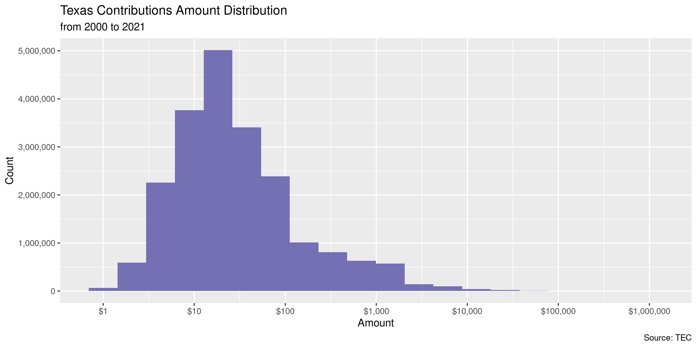
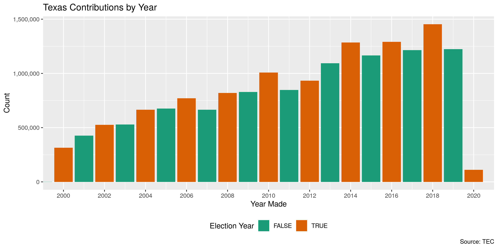
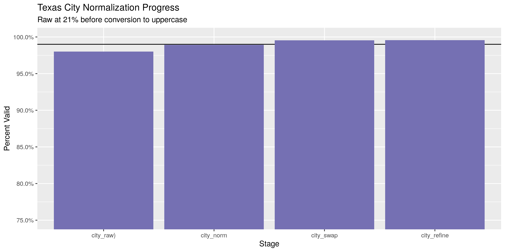
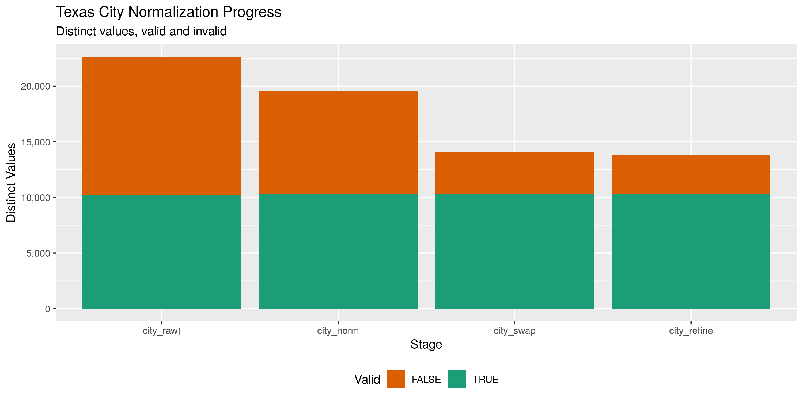

Texas Contributions
================
Kiernan Nicholls
2021-09-07 10:28:50

-   [Project](#project)
-   [Objectives](#objectives)
-   [Packages](#packages)
-   [Data](#data)
    -   [Download](#download)
    -   [Unzip](#unzip)
    -   [Read](#read)
-   [Trim](#trim)
-   [Explore](#explore)
    -   [Missing](#missing)
    -   [Duplicate](#duplicate)
    -   [Categorical](#categorical)
    -   [Amounts](#amounts)
    -   [Dates](#dates)
-   [Wrangle](#wrangle)
    -   [ZIP](#zip)
    -   [State](#state)
    -   [City](#city)
-   [Conclude](#conclude)
-   [Export](#export)
-   [Upload](#upload)

<!-- Place comments regarding knitting here -->

## Project

The Accountability Project is an effort to cut across data silos and
give journalists, policy professionals, activists, and the public at
large a simple way to search across huge volumes of public data about
people and organizations.

Our goal is to standardizing public data on a few key fields by thinking
of each dataset row as a transaction. For each transaction there should
be (at least) 3 variables:

1.  All **parties** to a transaction.
2.  The **date** of the transaction.
3.  The **amount** of money involved.

## Objectives

This document describes the process used to complete the following
objectives:

1.  How many records are in the database?
2.  Check for entirely duplicated records.
3.  Check ranges of continuous variables.
4.  Is there anything blank or missing?
5.  Check for consistency issues.
6.  Create a five-digit ZIP Code called `zip`.
7.  Create a `year` field from the transaction date.
8.  Make sure there is data on both parties to a transaction.

## Packages

The following packages are needed to collect, manipulate, visualize,
analyze, and communicate these results. The `pacman` package will
facilitate their installation and attachment.

The IRW’s `campfin` package will also have to be installed from GitHub.
This package contains functions custom made to help facilitate the
processing of campaign finance data.

``` r
if (!require("pacman")) install.packages("pacman")
pacman::p_load_gh("irworkshop/campfin")
pacman::p_load(
  tidyverse, # data manipulation
  lubridate, # datetime strings
  gluedown, # printing markdown
  jsonlite, # convert json table
  janitor, # clean data frames
  campfin, # custom irw tools
  aws.s3, # aws cloud storage
  refinr, # cluster & merge
  scales, # format strings
  knitr, # knit documents
  vroom, # fast reading
  rvest, # scrape html
  glue, # code strings
  here, # project paths
  httr, # http requests
  fs # local storage 
)
```

This document should be run as part of the `R_campfin` project, which
lives as a sub-directory of the more general, language-agnostic
[`irworkshop/accountability_datacleaning`](https://github.com/irworkshop/accountability_datacleaning)
GitHub repository.

The `R_campfin` project uses the [RStudio
projects](https://support.rstudio.com/hc/en-us/articles/200526207-Using-Projects)
feature and should be run as such. The project also uses the dynamic
`here::here()` tool for file paths relative to *your* machine.

``` r
# where does this document knit?
here::here()
#> [1] "/home/kiernan/Documents/accountability_datacleaning/R_tap"
```

## Data

Data is obtained from the [Texas Ethics Commission
(TEC)](https://www.ethics.state.tx.us/search/cf/). According to [a TEC
brochure](https://www.ethics.state.tx.us/data/about/Bethic.pdf):

> Statutory duties of the Ethics Commission are in Chapter 571 of the
> Government Code. The agency is responsible for administering these
> laws: (1) Title 15, Election Code, concerning political contributions
> and expenditures, and political advertising…

> The Ethics Commission serves as a repository of required disclosure
> statements for state officials, candidates, political committees,
> lobbyists, and certain district and county judicial officers.

Data is ontained from the [Campaign Finance section of the TEC
website](https://www.ethics.state.tx.us/search/cf/). The entire database
can be downloaded as [a ZIP
archive](https://www.ethics.state.tx.us/data/search/cf/TEC_CF_CSV.zip).
The contents of that ZIP and the layout of the files within are outlined
in the
[`CFS-ReadMe.txt`](https://www.ethics.state.tx.us/data/search/cf/CFS-ReadMe.txt)
file.

> This zip package contains detailed information from campaign finance
> reports filed electronically with the Texas Ethics Commission
> beginning July 1, 2000. Flat File Architecture Record Listing –
> Generated 06/11/2016 12:38:08 PM

``` r
readme <- read_lines("https://www.ethics.state.tx.us/data/search/cf/CFS-ReadMe.txt")
```

At the top of this file is a table of contents.

| record\_name     | file\_contents                                     | file\_name\_s                        |
|:-----------------|:---------------------------------------------------|:-------------------------------------|
| AssetData        | Assets - Schedule M                                | `assets.csv`                         |
| CandidateData    | Direct Campaign Expenditure Candidates             | `cand.csv`                           |
| ContributionData | Contributions - Schedules A/C                      | `contribs_##.csv`, `cont_ss.cs...`   |
| CoverSheet1Data  | Cover Sheet 1 - Cover sheet information and totals | `cover.csv`, `cover_ss.csv`, `co...` |
| CoverSheet2Data  | Cover Sheet 2 - Notices received by candidates/…   | `notices.csv`                        |
| CoverSheet3Data  | Cover Sheet 3 - Committee purpose                  | `purpose.csv`                        |
| CreditData       | Credits - Schedule K                               | `credits.csv`                        |
| DebtData         | Debts - Schedule L                                 | `debts.csv`                          |
| ExpendData       | Expenditures - Schedules F/G/H/I                   | `expend_##.csv`, `expn_t.csv`        |
| ExpendCategory   | Expenditure category codes                         | `expn_catg.csv`                      |
| FilerData        | Filer index                                        | `filers.csv`                         |
| FinalData        | Final reports                                      | `final.csv`                          |
| LoanData         | Loans - Schedule E                                 | `loans.csv`                          |
| PledgeData       | Pledges - Schedule B                               | `pledges.csv`, `pldg_ss.csv`, `p...` |
| SpacData         | Index of Specific-purpose committees               | `spacs.csv`                          |
| TravelData       | Travel outside the State of Texas - Schedule T     | `travel.csv`                         |

From this table, we know the “ContributionData” record
(`contribs_##.csv`) contains the data we want.

> Contributions - Schedules A/C - Contributions from special session and
> special pre-election (formerly Telegram) reports are stored in the
> file cont\_ss and cont\_t. These records are kept separate from the
> contribs files to avoid creating duplicates, because they are supposed
> to be re-reported on the next regular campaign finance report. Files:
> `contribs_##.csv`, `cont_ss.csv`, `cont_t.csv`

| number | field\_name                        | type       | mask          | len | description                                                       |
|:-------|:-----------------------------------|:-----------|:--------------|:----|:------------------------------------------------------------------|
| 01     | `record_type`                      | String     | NA            | 20  | Record type code - always RCPT                                    |
| 02     | `form_type_cd`                     | String     | NA            | 20  | TEC form used                                                     |
| 03     | `sched_form_type_cd`               | String     | NA            | 20  | TEC Schedule Used                                                 |
| 04     | `report_info_ident`                | Long       | 00000000000   | 11  | Unique report \#                                                  |
| 05     | `received_dt`                      | Date       | yyyyMMdd      | 8   | Date report received by TEC                                       |
| 06     | `info_only_flag`                   | String     | NA            | 1   | Superseded by other report                                        |
| 07     | `filer_ident`                      | String     | NA            | 100 | Filer account \#                                                  |
| 08     | `filer_type_cd`                    | String     | NA            | 30  | Type of filer                                                     |
| 09     | `filer_name`                       | String     | NA            | 200 | Filer name                                                        |
| 10     | `contribution_info_id`             | Long       | 00000000000   | 11  | Contribution unique identifier                                    |
| 11     | `contribution_dt`                  | Date       | yyyyMMdd      | 08  | Contribution date                                                 |
| 12     | `contribution_amount`              | BigDecimal | 0000000000.00 | 12  | Contribution amount                                               |
| 13     | `contribution_descr`               | String     | NA            | 100 | Contribution description                                          |
| 14     | `itemize_flag`                     | String     | NA            | 01  | Y indicates that the contribution is itemized                     |
| 15     | `travel_flag`                      | String     | NA            | 01  | Y indicates that the contribution has associated travel           |
| 16     | `contributor_persent_type_cd`      | String     | NA            | 30  | Type of contributor name data - INDIVIDUAL or ENTITY              |
| 17     | `contributor_name_organization`    | String     | NA            | 100 | For ENTITY, the contributor organization name                     |
| 18     | `contributor_name_last`            | String     | NA            | 100 | For INDIVIDUAL, the contributor last name                         |
| 19     | `contributor_name_suffix_cd`       | String     | NA            | 30  | For INDIVIDUAL, the contributor name suffix (e.g. JR, MD, II)     |
| 20     | `contributor_name_first`           | String     | NA            | 45  | For INDIVIDUAL, the contributor first name                        |
| 21     | `contributor_name_prefix_cd`       | String     | NA            | 30  | For INDIVIDUAL, the contributor name prefix (e.g. MR, MRS, MS)    |
| 22     | `contributor_name_short`           | String     | NA            | 25  | For INDIVIDUAL, the contributor short name (nickname)             |
| 23     | `contributor_street_city`          | String     | NA            | 30  | Contributor street address - city                                 |
| 24     | `contributor_street_state_cd`      | String     | NA            | 02  | Contributor street address - state code (e.g. TX, CA) - for       |
| 25     | `contributor_street_county_cd`     | String     | NA            | 05  | Contributor street address - Texas county                         |
| 26     | `contributor_street_country_cd`    | String     | NA            | 03  | Contributor street address - country (e.g. USA, UMI, MEX, CAN)    |
| 27     | `contributor_street_postal_code`   | String     | NA            | 20  | Contributor street address - postal code - for USA addresses only |
| 28     | `contributor_street_region`        | String     | NA            | 30  | Contributor street address - region for country other than USA    |
| 29     | `contributor_employer`             | String     | NA            | 60  | Contributor employer                                              |
| 30     | `contributor_occupation`           | String     | NA            | 60  | Contributor occupation                                            |
| 31     | `contributor_job_title`            | String     | NA            | 60  | Contributor job title                                             |
| 32     | `contributor_pac_fein`             | String     | NA            | 12  | FEC ID of out-of-state PAC contributor                            |
| 33     | `contributor_oos_pac_flag`         | String     | NA            | 01  | Indicates if contributor is an out-of-state PAC                   |
| 34     | `contributor_spouse_law_firm_name` | String     | NA            | 60  | Contributor spouse law firm name                                  |
| 35     | `contributor_parent1law_firm_name` | String     | NA            | 60  | Contributor parent \#1 law firm name                              |
| 36     | `contributor_parent2law_firm_name` | String     | NA            | 60  | Contributor parent \#2 law firm name                              |

### Download

``` r
raw_dir <- dir_create(here("tx", "contribs", "data", "raw"))
zip_url <- "https://www.ethics.state.tx.us/data/search/cf/TEC_CF_CSV.zip"
zip_path <- path(raw_dir, basename(zip_url))
```

The ZIP file is fairly large, so check the file size before downloading.

``` r
# size of file
(zip_size <- url_file_size(zip_url))
#> 637M
```

If the file hasn’t been downloaded yet, do so now.

``` r
if (!file_exists(zip_path)) {
  download.file(zip_url, zip_path)
}
```

### Unzip

There are 84 CSV files inside the ZIP archive. We can list the content
and extract only those pertaining to contributions.

``` r
(zip_contents <- 
  unzip(zip_path, list = TRUE) %>% 
  as_tibble() %>% 
  clean_names() %>% 
  mutate(
    length = as_fs_bytes(length),
    date = as_date(date)
  ))
#> # A tibble: 84 × 3
#>    name                 length date      
#>    <chr>           <fs::bytes> <date>    
#>  1 ReadMe.txt          130.01K 2021-09-02
#>  2 assets.csv          378.54K 2021-09-02
#>  3 cand.csv             40.43M 2021-09-02
#>  4 cont_ss.csv          16.54M 2021-09-02
#>  5 cont_t.csv            5.19M 2021-09-02
#>  6 contribs_01.csv      98.67M 2021-09-02
#>  7 contribs_02.csv     106.78M 2021-09-02
#>  8 contribs_03.csv     114.16M 2021-09-02
#>  9 contribs_04.csv     107.83M 2021-09-02
#> 10 contribs_05.csv      98.69M 2021-09-02
#> # … with 74 more rows

zip_contribs <- str_subset(zip_contents$name, "contribs_\\d{2}")
length(zip_contribs)
#> [1] 52
```

If the files haven’t been extracted, we can do so now. There are 52
contribution files to extract.

``` r
if (!all(file_exists(path(raw_dir, zip_contribs)))) {
  unzip(
    zipfile = zip_path,
    files = zip_contribs,
    exdir = raw_dir
  )
}

raw_paths <- path(raw_dir, zip_contribs)
```

### Read

The 52 files can be read into a single data frame. We will consult the
`CFS-ReadMe.txt` file for the column types.

``` r
txc <- read_delim(
  file = raw_paths,
  delim = ",",
  escape_backslash = FALSE,
  escape_double = FALSE,
  col_types = cols(
    .default = col_character(),
    reportInfoIdent = col_integer(),
    receivedDt = col_date("%Y%m%d"),
    contributionInfoId = col_integer(),
    contributionDt = col_date("%Y%m%d"),
    contributionAmount = col_double()
  )
)
```

``` r
txc <- clean_names(txc, case = "snake")
```

To ensure the file has been read correctly, we can check that a
categorical variable has very few distinct values.

``` r
n_distinct(txc$record_type)
#> [1] 1
```

``` r
yes_no <- function(x) x == "Y"
txc <- txc %>% 
  mutate(across(ends_with("_flag"), yes_no))
```

## Trim

Trim unused columns for memory space. Rejoin after the clean file is
saved.

``` r
txc <- txc %>% 
  select(
    filer_ident,
    filer_name,
    contribution_info_id,
    contribution_dt,
    contribution_amount,
    contributor_name_organization,
    contributor_name_last,
    contributor_name_first,
    contributor_street_city,
    contributor_street_state_cd,
    contributor_street_postal_code
  )
```

## Explore

``` r
comma(nrow(txc))
#> [1] "21,616,428"
```

``` r
glimpse(txc[1:20, ])
#> Rows: 20
#> Columns: 11
#> $ filer_ident                    <chr> "00010883", "00010883", "00010883", "00010883", "00010883"…
#> $ filer_name                     <chr> "El Paso Energy Corp. PAC", "EL PASO CORPORATION PAC", "El…
#> $ contribution_info_id           <int> 100000001, 100000002, 100000003, 100000004, 100000005, 100…
#> $ contribution_dt                <date> 2000-05-30, 2001-12-28, 2000-06-14, 2001-07-19, 2000-05-3…
#> $ contribution_amount            <dbl> 90.00, 105.00, 90.00, 1500.00, 20.84, 105.00, 20.84, 104.1…
#> $ contributor_name_organization  <chr> NA, NA, NA, NA, NA, NA, NA, NA, NA, NA, NA, NA, NA, NA, NA…
#> $ contributor_name_last          <chr> "LYTAL", "MURRAY", "LYTAL", "ALPERIN", "MACDOUGALL", "MURR…
#> $ contributor_name_first         <chr> "JAMES H.", "STEVEN M", "JAMES H.", "JANICE", "KATHERINE H…
#> $ contributor_street_city        <chr> "HOUSTON", "PINEHURST", "HOUSTON", "WHEATON", "HOUSTON", "…
#> $ contributor_street_state_cd    <chr> "TX", "TX", "TX", "MD", "TX", "TX", "TX", "TX", "TX", "TX"…
#> $ contributor_street_postal_code <chr> "77024", "77362", "77024", "20902", "77024", "77362", "770…
tail(txc)
#> # A tibble: 6 × 11
#>   filer_ident filer_name       contribution_inf… contribution_dt contribution_am… contributor_name…
#>   <chr>       <chr>                        <int> <date>                     <dbl> <chr>            
#> 1 00016041    Texas Society O…         125734257 2021-08-16                   100 Barry            
#> 2 00016041    Texas Society O…         125734258 2021-08-19                    25 Birdwell         
#> 3 00016041    Texas Society O…         125734259 2021-08-20                   100 Sigety           
#> 4 00016041    Texas Society O…         125734260 2021-08-18                   100 Acevedo          
#> 5 00016041    Texas Society O…         125734261 2021-08-16                   100 Lisle            
#> 6 00085060    Texans Defend T…         125734262 2021-06-24                    20 <NA>             
#> # … with 5 more variables: contributor_name_last <chr>, contributor_name_first <chr>,
#> #   contributor_street_city <chr>, contributor_street_state_cd <chr>,
#> #   contributor_street_postal_code <chr>
```

### Missing

``` r
col_stats(txc, count_na)
```

``` r
key_vars <- c(
  "contribution_dt",
  "contributor_name_first",
  "contributor_name_last",
  "contribution_amount",
  "filer_name"
)
```

``` r
txc <- txc %>% 
  mutate(
    contributor_name_any = coalesce(
      contributor_name_organization,
      contributor_name_last,
      contributor_name_first
    )
  ) %>% 
  flag_na(
    contribution_dt,
    contributor_name_any,
    contribution_amount,
    filer_name
  ) %>% 
  select(-contributor_name_any)

sum(txc$na_flag)
#> [1] 28734
```

``` r
txc %>% 
  filter(na_flag) %>% 
  select(all_of(key_vars))
#> # A tibble: 28,734 × 5
#>    contribution_dt contributor_name_first contributor_name_last contribution_amount filer_name
#>    <date>          <chr>                  <chr>                               <dbl> <chr>     
#>  1 2007-04-01      <NA>                   <NA>                                 75   <NA>      
#>  2 2007-03-29      Chad R                 Shaw                                 58   <NA>      
#>  3 2007-04-12      Craig V                Richardson                           83.3 <NA>      
#>  4 2007-04-12      Thomas L               Price                                40   <NA>      
#>  5 2007-04-12      Oney D                 Temple                               50   <NA>      
#>  6 2007-04-12      Bryan W                Neskora                              65.2 <NA>      
#>  7 2007-04-12      Susan B                Ortenstone                           62.5 <NA>      
#>  8 2007-04-12      Kym N                  Olson                                75   <NA>      
#>  9 2007-04-12      Gene T                 Waguespack                           80   <NA>      
#> 10 2007-04-12      Thomas P               Morgan                              110   <NA>      
#> # … with 28,724 more rows
```

### Duplicate

``` r
dupe_file <- here("tx", "contribs", "data", "dupes.txt")
if (!file_exists(dupe_file)) {
  # save copy to disc
  tmp <- file_temp(ext = "rds")
  write_rds(txc, file = tmp)
  file_size(tmp)
  # split file into chunks
  tx_id <- split(txc$contribution_info_id, txc$received_dt)
  txs <- txc %>%
    select(-contribution_info_id) %>% 
    group_split(received_dt)
  # remove from memory
  if (file_exists(tmp)) {
    rm(txc)
    Sys.sleep(5)
    flush_memory(2)
  }
  pb <- txtProgressBar(max = length(txs), style = 3)
  for (i in seq_along(txs)) {
    # check dupes from both ends
    if (nrow(txs[[i]]) > 1) {
      d1 <- duplicated(txs[[i]], fromLast = FALSE)
      d2 <- duplicated(txs[[i]], fromLast = TRUE)
      dupe_vec <- d1 | d2
      rm(d1, d2)
      # append dupe id to file
      if (any(dupe_vec)) {
        write_lines(
          x = tx_id[[i]][dupe_vec], 
          file = dupe_file, 
          append = file_exists(dupe_file)
        )
      }
      rm(dupe_vec)
    }
    txs[[i]] <- NA
    tx_id[[i]] <- NA
    if (i %% 100 == 0) {
      Sys.sleep(2)
      flush_memory(2)
    }
    setTxtProgressBar(pb, i)
  }
  rm(txs, tx_id)
  Sys.sleep(5)
  flush_memory(2)
  txc <- read_rds(tmp)
}
```

``` r
tx_dupes <- tibble(
  contribution_info_id = as.integer(read_lines(dupe_file)), 
  dupe_flag = TRUE
)
```

``` r
txc <- left_join(txc, tx_dupes, by = "contribution_info_id")
txc <- mutate(txc, dupe_flag = !is.na(dupe_flag))
```

``` r
mean(txc$dupe_flag)
#> [1] 0.02335182
```

``` r
txc %>% 
  filter(dupe_flag) %>% 
  select(contribution_info_id, all_of(key_vars)) %>% 
  arrange(contribution_dt)
#> # A tibble: 504,783 × 6
#>    contribution_inf… contribution_dt contributor_nam… contributor_nam… contribution_am… filer_name 
#>                <int> <date>          <chr>            <chr>                       <dbl> <chr>      
#>  1         107024322 2000-01-28      Jim              Karr                           40 United Ser…
#>  2         107024324 2000-01-28      Jim              Karr                           40 United Ser…
#>  3         107024336 2000-01-28      Ted              Smith                          40 United Ser…
#>  4         107024338 2000-01-28      Ted              Smith                          40 United Ser…
#>  5         107024376 2000-01-28      Don              Davidson                       40 United Ser…
#>  6         107024378 2000-01-28      Don              Davidson                       40 United Ser…
#>  7         107024633 2000-01-28      Emile            Peroyea                        40 United Ser…
#>  8         107024635 2000-01-28      Emile            Peroyea                        40 United Ser…
#>  9         107024655 2000-01-28      James S.         Agostini                       40 United Ser…
#> 10         107024657 2000-01-28      James S.         Agostini                       40 United Ser…
#> # … with 504,773 more rows
```

### Categorical

``` r
col_stats(txc, n_distinct)
```

### Amounts

0.37% of contributions have a `contribution_amount` less than or equal
to zero.

``` r
summary(txc$contribution_amount)
#>     Min.  1st Qu.   Median     Mean  3rd Qu.     Max. 
#>     -325       10       24      228       62 16996410
percent(mean(txc$contribution_amount <= 0), 0.01)
#> [1] "0.37%"
```

<!-- -->

### Dates

We can create a new `contribution_yr` variable from `contribution_dt`.

``` r
txc <- mutate(txc, contribution_yr = year(contribution_dt))
```

The `contribution_dt` column is very clean, with almost no dates out of
the expected range.

``` r
count_na(txc$contribution_dt)
#> [1] 17
min(txc$contribution_dt, na.rm = TRUE)
#> [1] "1994-10-07"
sum(txc$contribution_yr < 2000, na.rm = TRUE)
#> [1] 266
max(txc$contribution_dt, na.rm = TRUE)
#> [1] "2021-08-25"
sum(txc$contribution_dt > today(), na.rm = TRUE)
#> [1] 0
```

<!-- -->

## Wrangle

To improve the searchability of the database, we will perform some
consistent, confident string normalization. For geographic variables
like city names and ZIP codes, the corresponding `campfin::normal_*()`
functions are tailor made to facilitate this process.

For this database, there are no street addresses.

### ZIP

For ZIP codes, the `campfin::normal_zip()` function will attempt to
create valid *five* digit codes by removing the ZIP+4 suffix and
returning leading zeroes dropped by other programs like Microsoft Excel.

``` r
txc <- txc %>% 
  mutate(
    zip_norm = normal_zip(
      zip = contributor_street_postal_code,
      na_rep = TRUE
    )
  )
```

``` r
progress_table(
  txc$contributor_street_postal_code,
  txc$zip_norm,
  compare = valid_zip
)
#> # A tibble: 2 × 6
#>   stage                              prop_in n_distinct prop_na   n_out n_diff
#>   <chr>                                <dbl>      <dbl>   <dbl>   <dbl>  <dbl>
#> 1 txc$contributor_street_postal_code   0.663     529524 0.00108 7271101 504865
#> 2 txc$zip_norm                         0.998      29970 0.00127   50220   3963
```

### State

Valid two digit state abbreviations can be made using the
`campfin::normal_state()` function.

``` r
st_norm <- txc %>% 
  distinct(contributor_street_state_cd) %>% 
  mutate(
    state_norm = normal_state(
      state = contributor_street_state_cd,
      abbreviate = TRUE,
      na_rep = TRUE,
      valid = NULL
    )
  )
```

``` r
txc <- left_join(txc, st_norm, by = "contributor_street_state_cd")
rm(st_norm)
```

``` r
txc %>% 
  filter(contributor_street_state_cd != state_norm) %>% 
  count(contributor_street_state_cd, state_norm, sort = TRUE)
#> # A tibble: 79 × 3
#>    contributor_street_state_cd state_norm     n
#>    <chr>                       <chr>      <int>
#>  1 Tx                          TX         11984
#>  2 tx                          TX           367
#>  3 Te                          TE           102
#>  4 Fl                          FL            94
#>  5 Ok                          OK            61
#>  6 ca                          CA            35
#>  7 tX                          TX            33
#>  8 Ca                          CA            30
#>  9 ny                          NY            26
#> 10 va                          VA            24
#> # … with 69 more rows
```

``` r
progress_table(
  txc$contributor_street_state_cd,
  txc$state_norm,
  compare = valid_state
)
#> # A tibble: 2 × 6
#>   stage                           prop_in n_distinct  prop_na n_out n_diff
#>   <chr>                             <dbl>      <dbl>    <dbl> <dbl>  <dbl>
#> 1 txc$contributor_street_state_cd   0.999        179 0.000751 17069    120
#> 2 txc$state_norm                    1.00          91 0.000897  1014     33
```

### City

Cities are the most difficult geographic variable to normalize, simply
due to the wide variety of valid cities and formats.

#### Normal

The `campfin::normal_city()` function is a good start, again converting
case, removing punctuation, but *expanding* USPS abbreviations. We can
also remove `invalid_city` values.

``` r
norm_city <- txc %>% 
  distinct(contributor_street_city, state_norm, zip_norm) %>% 
  mutate(
    city_norm = normal_city(
      city = contributor_street_city, 
      abbs = usps_city,
      states = c("TX", "DC", "TEXAS"),
      na = invalid_city,
      na_rep = TRUE
    )
  )
```

#### Swap

We can further improve normalization by comparing our normalized value
against the *expected* value for that record’s state abbreviation and
ZIP code. If the normalized value is either an abbreviation for or very
similar to the expected value, we can confidently swap those two.

``` r
norm_city <- norm_city %>% 
  left_join(
    y = zipcodes,
    by = c(
      "state_norm" = "state",
      "zip_norm" = "zip"
    )
  ) %>% 
  rename(city_match = city) %>% 
  mutate(
    match_abb = is_abbrev(city_norm, city_match),
    match_dist = str_dist(city_norm, city_match),
    city_swap = if_else(
      condition = !is.na(match_dist) & (match_abb | match_dist == 1),
      true = city_match,
      false = city_norm
    )
  ) %>% 
  select(
    -city_match,
    -match_dist,
    -match_abb
  ) %>% 
  distinct()
```

``` r
txc <- left_join(
  x = txc,
  y = norm_city,
  by = c(
    "contributor_street_city", 
    "state_norm", 
    "zip_norm"
  )
)
rm(norm_city)
```

#### Refine

The [OpenRefine](https://openrefine.org/) algorithms can be used to
group similar strings and replace the less common versions with their
most common counterpart. This can greatly reduce inconsistency, but with
low confidence; we will only keep any refined strings that have a valid
city/state/ZIP combination.

``` r
good_refine <- txc %>% 
  mutate(
    city_refine = city_swap %>% 
      key_collision_merge() %>% 
      n_gram_merge(numgram = 1)
  ) %>% 
  filter(city_refine != city_swap) %>% 
  inner_join(
    y = zipcodes,
    by = c(
      "city_refine" = "city",
      "state_norm" = "state",
      "zip_norm" = "zip"
    )
  )
```

    #> # A tibble: 487 × 5
    #>    state_norm zip_norm city_swap           city_refine              n
    #>    <chr>      <chr>    <chr>               <chr>                <int>
    #>  1 SC         29406    NORTH CHARLESTON    CHARLESTON             223
    #>  2 SC         29419    NORTH CHARLESTON    CHARLESTON              92
    #>  3 GA         31405    SAVAHHAN            SAVANNAH                64
    #>  4 TX         78259    SAN ANONTIO         SAN ANTONIO             47
    #>  5 TX         77008    HOUSTONHOUSTON      HOUSTON                 39
    #>  6 CA         94583    SAN ROMAN           SAN RAMON               35
    #>  7 TX         77720    BEAMOUNT            BEAUMONT                28
    #>  8 TX         76180    NORTH RICHARD HILLS NORTH RICHLAND HILLS    25
    #>  9 TX         75243    DALLAS DALLAS       DALLAS                  24
    #> 10 TX         76844    GOLDWAITHE          GOLDTHWAITE             24
    #> # … with 477 more rows

Then we can join the refined values back to the database.

``` r
txc <- txc %>% 
  left_join(good_refine, by = names(.)) %>% 
  mutate(city_refine = coalesce(city_refine, city_swap))
```

#### Check

We can use the `campfin::check_city()` function to pass the remaining
unknown `city_refine` values (and their `state_norm`) to the Google
Geocode API. The function returns the name of the city or locality which
most associated with those values.

This is an easy way to both check for typos and check whether an unknown
`city_refine` value is actually a completely acceptable neighborhood,
census designated place, or some other locality not found in our
`valid_city` vector from our `zipcodes` database.

First, we’ll filter out any known valid city and aggregate the remaining
records by their city and state. Then, we will only query those unknown
cities which appear at least ten times.

``` r
many_city <- c(valid_city, extra_city)
tac_out <- txc %>% 
  filter(city_refine %out% many_city) %>% 
  count(city_refine, state_norm, sort = TRUE) %>% 
  drop_na() %>% 
  filter(n > 1) %>% 
  head(200)
```

Passing these values to `campfin::check_city()` with `purrr::pmap_dfr()`
will return a single tibble of the rows returned by each city/state
combination.

First, we’ll check to see if the API query has already been done and a
file exist on disk. If such a file exists, we can read it using
`readr::read_csv()`. If not, the query will be sent and the file will be
written using `readr::write_csv()`.

``` r
check_file <- here("tx", "contribs", "data", "api_check.csv")
if (file_exists(check_file)) {
  check <- read_csv(
    file = check_file
  )
} else {
  check <- pmap_dfr(
    .l = list(
      tac_out$city_refine, 
      tac_out$state_norm
    ), 
    .f = check_city, 
    key = Sys.getenv("GEOCODE_KEY"), 
    guess = TRUE
  ) %>% 
    mutate(guess = coalesce(guess_city, guess_place)) %>% 
    select(-guess_city, -guess_place)
  write_csv(
    x = check,
    path = check_file
  )
}
```

Any city/state combination with a `check_city_flag` equal to `TRUE`
returned a matching city string from the API, indicating this
combination is valid enough to be ignored.

``` r
valid_locality <- check$guess[check$check_city_flag]
```

Then we can perform some simple comparisons between the queried city and
the returned city. If they are extremely similar, we can accept those
returned locality strings and add them to our list of accepted
additional localities.

``` r
valid_locality <- check %>% 
  filter(!check_city_flag) %>% 
  mutate(
    abb = is_abbrev(original_city, guess),
    dist = str_dist(original_city, guess)
  ) %>%
  filter(abb | dist <= 3) %>% 
  pull(guess) %>% 
  append(valid_locality)
```

#### Progress

| stage                                       | prop\_in | n\_distinct | prop\_na | n\_out | n\_diff |
|:--------------------------------------------|---------:|------------:|---------:|-------:|--------:|
| `str_to_upper(txc$contributor_street_city)` |   0.9824 |       27729 |   0.0010 | 380298 |   15049 |
| `txc$city_norm`                             |   0.9908 |       24203 |   0.0011 | 198571 |   11487 |
| `txc$city_swap`                             |   0.9973 |       17661 |   0.0011 |  57284 |    4940 |
| `txc$city_refine`                           |   0.9974 |       17287 |   0.0011 |  55881 |    4566 |

You can see how the percentage of valid values increased with each
stage.

<!-- -->

More importantly, the number of distinct values decreased each stage. We
were able to confidently change many distinct invalid values to their
valid equivalent.

<!-- -->

## Conclude

``` r
txc <- txc %>% 
  select(
    -city_norm,
    -city_swap,
    city_clean = city_refine
  ) %>% 
  rename_all(~str_replace(., "_norm", "_clean")) %>% 
  rename_all(~str_remove(., "_raw")) %>% 
  relocate(city_clean, state_clean, zip_clean, .before = last_col())
```

``` r
glimpse(sample_n(txc, 20))
#> Rows: 20
#> Columns: 17
#> $ filer_ident                    <chr> "00015604", "00016847", "00055117", "00084976", "00080131"…
#> $ filer_name                     <chr> "Houston Police Officers Union PAC", "United Services Auto…
#> $ contribution_info_id           <int> 124975830, 112733132, 114259968, 122575218, 115728686, 124…
#> $ contribution_dt                <date> 2021-05-07, 2015-04-23, 2016-06-17, 2020-10-13, 2016-10-2…
#> $ contribution_amount            <dbl> 5.00, 8.00, 1.00, 20.00, 200.00, 5.56, 3.00, 26.72, 10.00,…
#> $ contributor_name_organization  <chr> NA, NA, NA, NA, NA, NA, NA, NA, NA, NA, NA, NA, NA, NA, NA…
#> $ contributor_name_last          <chr> "ZETINO RODRIGUEZ", "Scalf", "JACKSON", "Bradley", "cummin…
#> $ contributor_name_first         <chr> "WILMAR", "Jason", "MARSHALL", "Heber", "don & loveta", "A…
#> $ contributor_street_city        <chr> "HOUSTON", "San Antonio", "HOUSTON", "Blanchester", "windc…
#> $ contributor_street_state_cd    <chr> "TX", "TX", "TX", "OH", "TX", "MA", "TX", "TX", "TX", "OK"…
#> $ contributor_street_postal_code <chr> "77002", "782311715", "77043", "45107", "78239", "02129", …
#> $ na_flag                        <lgl> FALSE, FALSE, FALSE, FALSE, FALSE, FALSE, FALSE, FALSE, FA…
#> $ dupe_flag                      <lgl> FALSE, FALSE, FALSE, FALSE, FALSE, FALSE, FALSE, FALSE, FA…
#> $ contribution_yr                <dbl> 2021, 2015, 2016, 2020, 2016, 2020, 2020, 2006, 2009, 2011…
#> $ city_clean                     <chr> "HOUSTON", "SAN ANTONIO", "HOUSTON", "BLANCHESTER", "WINDC…
#> $ state_clean                    <chr> "TX", "TX", "TX", "OH", "TX", "MA", "TX", "TX", "TX", "OK"…
#> $ zip_clean                      <chr> "77002", "78231", "77043", "45107", "78239", "02129", "782…
```

1.  There are 21,616,428 records in the database.
2.  The range and distribution of `amount` and `date` seem reasonable.
3.  There are 28,734 records missing key variables.
4.  Consistency in geographic data has been improved with
    `campfin::normal_*()`.
5.  The 4-digit year variable has been created with `lubridate::year()`.

## Export

Now the file can be saved on disk for upload to the Accountability
server.

``` r
clean_dir <- dir_create(here("tx", "contribs", "data", "clean"))
clean_path <- path(clean_dir, "tx_contribs_2000-20210902.csv")
write_csv(txc, clean_path, na = "")
(clean_size <- file_size(clean_path))
#> 2.91G
```

## Upload

We can use the `aws.s3::put_object()` to upload the text file to the IRW
server.

``` r
aws_path <- path("csv", basename(clean_path))
if (!object_exists(aws_path, "publicaccountability")) {
  put_object(
    file = clean_path,
    object = aws_path, 
    bucket = "publicaccountability",
    acl = "public-read",
    show_progress = TRUE,
    multipart = TRUE
  )
}
aws_head <- head_object(aws_path, "publicaccountability")
(aws_size <- as_fs_bytes(attr(aws_head, "content-length")))
unname(aws_size == clean_size)
```
