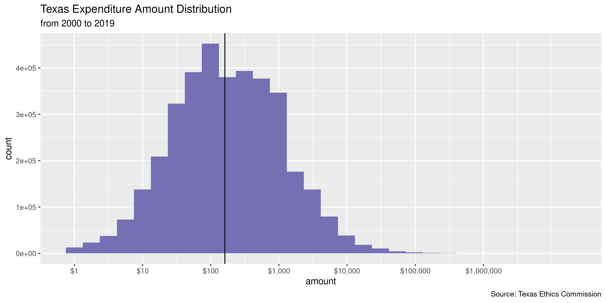
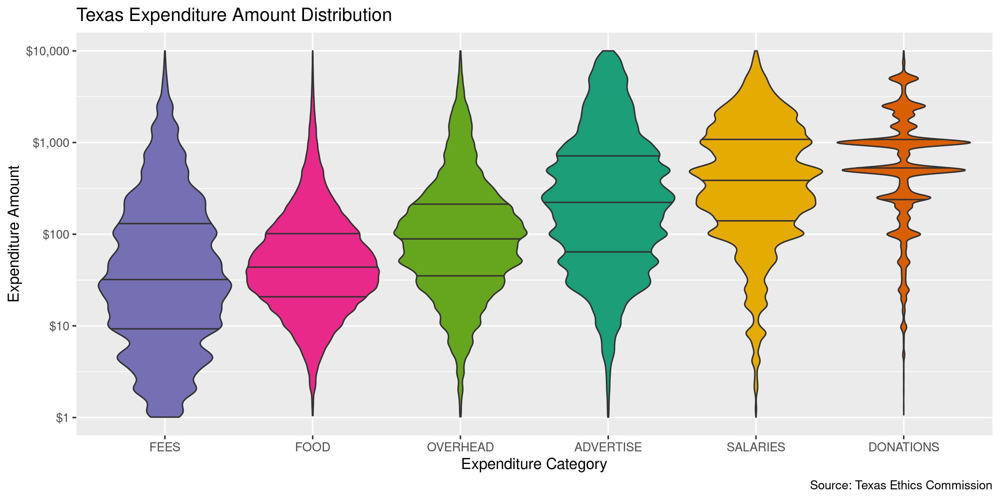
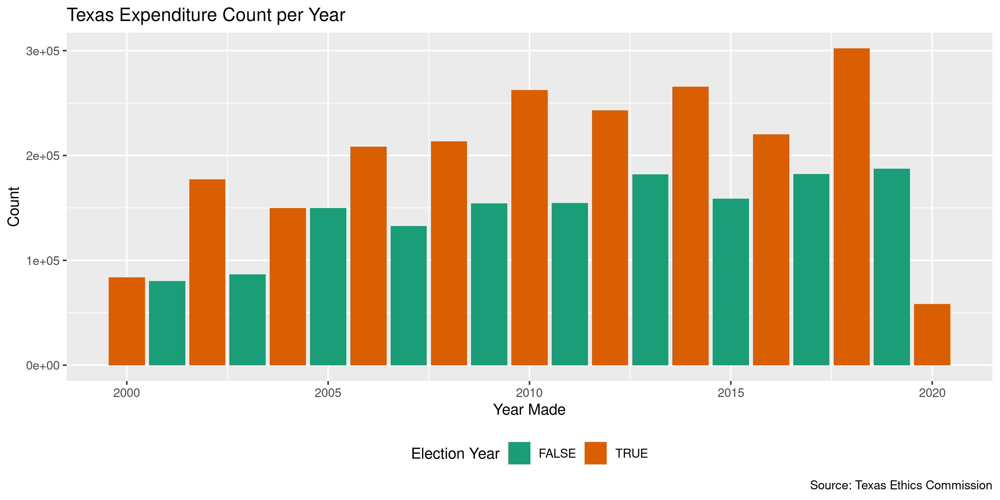
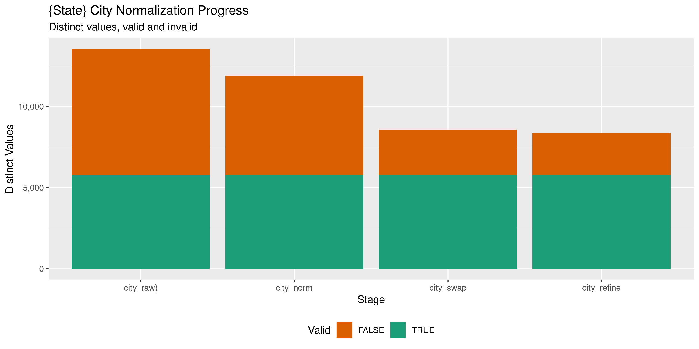

Texas Expenditures
================
Kiernan Nicholls & Yanqi Xu
2023-05-27 23:35:23

- <a href="#project" id="toc-project">Project</a>
- <a href="#objectives" id="toc-objectives">Objectives</a>
- <a href="#packages" id="toc-packages">Packages</a>
- <a href="#data" id="toc-data">Data</a>
- <a href="#explore" id="toc-explore">Explore</a>
- <a href="#wrangle" id="toc-wrangle">Wrangle</a>
- <a href="#conclude" id="toc-conclude">Conclude</a>
- <a href="#export" id="toc-export">Export</a>
- <a href="#upload" id="toc-upload">Upload</a>

<!-- Place comments regarding knitting here -->

## Project

The Accountability Project is an effort to cut across data silos and
give journalists, policy professionals, activists, and the public at
large a simple way to search across huge volumes of public data about
people and organizations.

Our goal is to standardizing public data on a few key fields by thinking
of each dataset row as a transaction. For each transaction there should
be (at least) 3 variables:

1.  All **parties** to a transaction.
2.  The **date** of the transaction.
3.  The **amount** of money involved.

## Objectives

This document describes the process used to complete the following
objectives:

1.  How many records are in the database?
2.  Check for entirely duplicated records.
3.  Check ranges of continuous variables.
4.  Is there anything blank or missing?
5.  Check for consistency issues.
6.  Create a five-digit ZIP Code called `zip`.
7.  Create a `year` field from the transaction date.
8.  Make sure there is data on both parties to a transaction.

## Packages

The following packages are needed to collect, manipulate, visualize,
analyze, and communicate these results. The `pacman` package will
facilitate their installation and attachment.

The IRW’s `campfin` package will also have to be installed from GitHub.
This package contains functions custom made to help facilitate the
processing of campaign finance data.

``` r
if (!require("pacman")) install.packages("pacman")
pacman::p_load_gh("irworkshop/campfin")
pacman::p_load(
  tidyverse, # data manipulation
  lubridate, # datetime strings
  gluedown, # printing markdown
  janitor, # clean data frames
  batman, # convert to logical
  refinr, # cluster and merge
  scales, # format strings
  knitr, # knit documents
  vroom, # read files fast
  rvest, # html scraping
  glue, # combine strings
  here, # relative paths
  httr, # http requests
  fs # local storage 
)
```

This document should be run as part of the `R_campfin` project, which
lives as a sub-directory of the more general, language-agnostic
[`irworkshop/accountability_datacleaning`](https://github.com/irworkshop/accountability_datacleaning)
GitHub repository.

The `R_campfin` project uses the [RStudio
projects](https://support.rstudio.com/hc/en-us/articles/200526207-Using-Projects)
feature and should be run as such. The project also uses the dynamic
`here::here()` tool for file paths relative to *your* machine.

``` r
# where does this document knit?
here::here()
#> [1] "/Users/yanqixu/code/accountability_datacleaning"
```

## Data

Data is obtained from the [Texas Ethics Commission
(TEC)](https://www.ethics.state.tx.us/search/cf/). According to [a TEC
brochure](https://www.ethics.state.tx.us/data/about/Bethic.pdf),

> tatutory duties of the Ethics Commission are in Chapter 571 of the
> Government Code. The agency is responsible for administering these
> laws: (1) Title 15, Election Code, concerning political contributions
> and expenditures, and political advertising…

> The Ethics Commission serves as a repository of required disclosure
> statements for state officials, candidates,political committees,
> lobbyists, and certain district and county judicial officers.

Data is obtained from the [Campaign Finance section of the TEC
website](https://www.ethics.state.tx.us/search/cf/). An entire database
can be downloaded as [a ZIP
file](https://www.ethics.state.tx.us/data/search/cf/TEC_CF_CSV.zip). The
contents of that ZIP and the layout of the files within are outlined in
the [`CFS-ReadMe.txt`
file](https://www.ethics.state.tx.us/data/search/cf/CFS-ReadMe.txt).

> This zip package contains detailed information from campaign finance
> reports filed electronically with the Texas Ethics Commission
> beginning July 1, 2000. Flat File Architecture Record Listing –
> Generated 06/11/2016 12:38:08 PM

``` r
readme_url <- "https://www.ethics.state.tx.us/data/search/cf/CFS-ReadMe.txt"
readme <- read_lines(here("state","tx", "expends", "CFS-ReadMe.txt"))
```

At the top of this file is a table of contents.

``` r
read_fwf(readme[seq(13, 47, 2)][-c(1,2)] %>% I()) %>% 
  select(-c(3,5)) %>% 
  rename(record_name = X1, file_content=X2, file_name = X4) %>% 
  kable()
```

| record_name      | file_content                                          | file_name                                  |
|:-----------------|:------------------------------------------------------|:-------------------------------------------|
| AssetData        | Assets - Schedule M                                   | assets.csv                                 |
| CandidateData    | Direct Campaign Expenditure Candidates                | cand.csv                                   |
| ContributionData | Contributions - Schedules A/C                         | contribs\_##.csv, cont_ss.csv, cont_t.csv, |
| CoverSheet1Data  | Cover Sheet 1 - Cover sheet information and totals    | cover.csv, cover_ss.csv, cover_t.csv       |
| CoverSheet2Data  | Cover Sheet 2 - Notices received by candidates/office | notices.csv                                |
| CoverSheet3Data  | Cover Sheet 3 - Committee purpose                     | purpose.csv                                |
| CreditData       | Credits - Schedule K                                  | credits.csv                                |
| DebtData         | Debts - Schedule L                                    | debts.csv                                  |
| ExpendData       | Expenditures - Schedules F/G/H/I                      | expend\_##.csv, expn_t.csv                 |
| ExpendCategory   | Expenditure category codes                            | expn_catg.csv                              |
| FilerData        | Filer index                                           | filers.csv                                 |
| FinalData        | Final reports                                         | final.csv                                  |
| LoanData         | Loans - Schedule E                                    | loans.csv                                  |
| PledgeData       | Pledges - Schedule B                                  | pledges.csv, pldg_ss.csv, pldg_t.csv       |
| SpacData         | Index of Specific-purpose committees                  | spacs.csv                                  |
| TravelData       | Travel outside the State of Texas - Schedule T        | travel.csv                                 |

From this table, we know the ExpendData record (`contribs_##.csv`)
contains the data we want.

> Expenditures - Schedules F/G/H/I - Expenditures from special
> pre-election (formerly Telegram) reports are stored in the file
> `expn_t`. They are kept separate from the expends file to avoid
> creating duplicates, because they are supposed to be re-reported on
> the next regular campaign finance report.

| Pos | Field                      | Type       | Mask          | Len | Description                                                                |
|----:|:---------------------------|:-----------|:--------------|----:|:---------------------------------------------------------------------------|
|   1 | `record_type`              | String     |               |  20 | Record type code - always EXPN                                             |
|   2 | `form_type_cd`             | String     |               |  20 | TEC form used                                                              |
|   3 | `sched_form_type_cd`       | String     |               |  20 | TEC Schedule Used                                                          |
|   4 | `report_info_ident`        | Long       | 00000000000   |  11 | Unique report \#                                                           |
|   5 | `received_dt`              | Date       | yyyyMMdd      |   8 | Date report received by TEC                                                |
|   6 | `info_only_flag`           | String     |               |   1 | Superseded by other report                                                 |
|   7 | `filer_ident`              | String     |               | 100 | Filer account \#                                                           |
|   8 | `filer_type_cd`            | String     |               |  30 | Type of filer                                                              |
|   9 | `filer_name`               | String     |               | 200 | Filer name                                                                 |
|  10 | `expend_info_id`           | Long       | 00000000000   |  11 | Expenditure unique identifier                                              |
|  11 | `expend_dt`                | Date       | yyyyMMdd      |   8 | Expenditure date                                                           |
|  12 | `expend_amount`            | BigDecimal | 0000000000.00 |  12 | Expenditure amount                                                         |
|  13 | `expend_descr`             | String     |               | 100 | Expenditure description                                                    |
|  14 | `expend_cat_cd`            | String     |               |  30 | Expenditure category code                                                  |
|  15 | `expend_cat_descr`         | String     |               | 100 | Expenditure category description                                           |
|  16 | `itemize_flag`             | String     |               |   1 | Y indicates that the expenditure is itemized                               |
|  17 | `travel_flag`              | String     |               |   1 | Y indicates that the expenditure has associated travel                     |
|  18 | `political_expend_cd`      | String     |               |  30 | Political expenditure indicator                                            |
|  19 | `reimburse_intended_flag`  | String     |               |   1 | Reimbursement intended indicator                                           |
|  20 | `src_corp_contrib_flag`    | String     |               |   1 | Expenditure from corporate funds indicator                                 |
|  21 | `capital_livingexp_flag`   | String     |               |   1 | Austin living expense indicator                                            |
|  22 | `payee_persent_type_cd`    | String     |               |  30 | Type of payee name data - INDIVIDUAL or ENTITY                             |
|  23 | `payee_name_organization`  | String     |               | 100 | For ENTITY, the payee organization name                                    |
|  24 | `payee_name_last`          | String     |               | 100 | For INDIVIDUAL, the payee last name                                        |
|  25 | `payee_name_suffix_cd`     | String     |               |  30 | For INDIVIDUAL, the payee name suffix (e.g. JR, MD, II)                    |
|  26 | `payee_name_first`         | String     |               |  45 | For INDIVIDUAL, the payee first name                                       |
|  27 | `payee_name_prefix_cd`     | String     |               |  30 | For INDIVIDUAL, the payee name prefix (e.g. MR, MRS, MS)                   |
|  28 | `payee_name_short`         | String     |               |  25 | For INDIVIDUAL, the payee short name (nickname)                            |
|  29 | `payee_street_addr1`       | String     |               |  55 | Payee street address - line 1                                              |
|  30 | `payee_street_addr2`       | String     |               |  55 | Payee street address - line 2                                              |
|  31 | `payee_street_city`        | String     |               |  30 | Payee street address - city                                                |
|  32 | `payee_street_state_cd`    | String     |               |   2 | Payee street address - state code (e.g. TX, CA) - for country=USA/UMI only |
|  33 | `payee_street_county_cd`   | String     |               |   5 | Payee street address - Texas county                                        |
|  34 | `payee_street_country_cd`  | String     |               |   3 | Payee street address - country (e.g. USA, UMI, MEX, CAN)                   |
|  35 | `payee_street_postal_code` | String     |               |  20 | Payee street address - postal code - for USA addresses only                |
|  36 | `payee_street_region`      | String     |               |  30 | Payee street address - region for country other than USA                   |

The ExpendCategory record is a small table explaining the expenditure
category codes used.

| Pos | Field                        | Type   | Mask | Len | Description                      |
|----:|:-----------------------------|:-------|:-----|----:|:---------------------------------|
|   1 | `record_type`                | String |      |  20 | Record type code - always EXCAT  |
|   2 | `expend_category_code_value` | String |      |  30 | Expenditure category code        |
|   3 | `expend_category_code_label` | String |      | 100 | Expenditure category description |

### Download

The data was accessed on May 27, 2023 and included updates through May
16, 2023.

``` r
raw_dir <- dir_create(here("state","tx", "expends", "data", "raw"))
zip_url <- "https://www.ethics.state.tx.us/data/search/cf/TEC_CF_CSV.zip"
zip_file <- path(raw_dir, basename(zip_url))
```

If the file hasn’t been downloaded yet, do so now.

``` r
if (!file_exists(zip_file)) {
  download.file(
    url = zip_url, 
    destfile = zip_file,
    method = "curl"
  )
}
```

### Extract

There are 113 CSV files inside the ZIP archive.

``` r
zip_contents <- 
  unzip(zip_file, list = TRUE) %>% 
  as_tibble(.name_repair = make_clean_names) %>%
  mutate(across(length, as_fs_bytes)) %>% 
  filter(str_detect(name, "expend_\\d{2}"))
```

``` r
zip_expends <- str_subset(zip_contents$name, "expend_\\d{2}.csv")
```

If the files haven’t been extracted, we can do so now.

``` r
zip_expends <- as_fs_path(unzip(
  zipfile = zip_file,
  files = zip_expends,
  exdir = raw_dir
))
```

### Read

The TEC provides a helpful [record layout
key](https://www.ethics.state.tx.us/data/search/cf/CampaignFinanceCSVFileFormat.pdf)
describing the structure of their flat files. We can use the details in
this key to properly read the files into R.

> The CSV file contains comma-delimited records –one line per record.
> Each record consists of fields separated by commas.The following
> characters constitute the permitted list. The space characterand
> commaarenotin this list. `! @ # $ % * -_ + : ; . / 0-9 A-Z a-z`

> If a raw data field contains any character other than these permitted
> characters, then the field is surrounded by double-quotesin the CSV.
> Space is notin the above list–meaning that data containing spaces will
> be double-quoted. Raw field data containing double-quotes will have
> doubled double-quotes in the CSV encoding.In both raw dataand CSV
> encoding, new lines are represented with the escape notation `\n`.

We can use this information as the arguments to `vroom::vroom()` and
read all 8 files at once into a single data frame.

``` r
txe <- vroom(
  file = zip_expends,
  .name_repair = make_clean_names,
  na = c("", "NA", "N/A", "UNKNOWN"),
  delim = ",",
  col_names = TRUE,
  escape_double = TRUE,
  escape_backslash = FALSE,
  num_threads = 1,
  locale = locale(tz = "US/Central"),
  col_types = cols(
    .default = col_character(),
    receivedDt = col_date("%Y%m%d"),
    expendDt = col_date("%Y%m%d"),
    expendAmount = col_double()
  )
)
```

## Explore

``` r
glimpse(txe)
#> Rows: 4,355,908
#> Columns: 34
#> $ form               <chr> "MPAC", "MPAC", "MPAC", "MPAC", "MPAC", "MPAC", "MPAC", "MPAC", "MPAC"…
#> $ schedule           <chr> "F1", "F1", "F1", "F1", "F1", "F1", "F1", "F1", "F1", "F1", "F1", "F1"…
#> $ report_id          <chr> "157773", "323134", "157773", "311114", "157773", "235729", "207492", …
#> $ received           <chr> "20001012", "20061101", "20001012", "20060601", "20001012", "20040102"…
#> $ info_flag          <lgl> FALSE, FALSE, FALSE, FALSE, FALSE, FALSE, FALSE, FALSE, FALSE, FALSE, …
#> $ filer_id           <chr> "00010883", "00010883", "00010883", "00010883", "00010883", "00010883"…
#> $ filer_type         <chr> "MPAC", "MPAC", "MPAC", "MPAC", "MPAC", "MPAC", "MPAC", "MPAC", "MPAC"…
#> $ filer              <chr> "THE EL PASO ENERGY CORPORATION PAC", "El Paso Corporation PAC", "THE …
#> $ id                 <dbl> 1e+08, 1e+08, 1e+08, 1e+08, 1e+08, 1e+08, 1e+08, 1e+08, 1e+08, 1e+08, …
#> $ date               <chr> "20000914", "20061010", "20000912", "20060502", "20000901", "20031217"…
#> $ amount             <chr> "1000.00", "1000.00", "500.00", "1000.00", "2500.00", "250.00", "1000.…
#> $ describe           <chr> "CONTRIBUTION TO POLITICAL COMMITTEE", "Desc:Direct Contribution", "CO…
#> $ category           <chr> NA, NA, NA, NA, NA, NA, NA, NA, NA, NA, NA, NA, NA, NA, NA, NA, NA, NA…
#> $ description        <chr> NA, NA, NA, NA, NA, NA, NA, NA, NA, NA, NA, NA, NA, NA, NA, NA, NA, NA…
#> $ itemize_flag       <lgl> TRUE, TRUE, TRUE, TRUE, TRUE, TRUE, TRUE, TRUE, TRUE, TRUE, TRUE, TRUE…
#> $ travel_flag        <lgl> FALSE, FALSE, FALSE, FALSE, FALSE, FALSE, FALSE, FALSE, FALSE, FALSE, …
#> $ politics_flag      <lgl> TRUE, TRUE, TRUE, TRUE, TRUE, TRUE, TRUE, TRUE, TRUE, TRUE, TRUE, TRUE…
#> $ reimburse_flag     <lgl> FALSE, FALSE, FALSE, FALSE, FALSE, FALSE, FALSE, FALSE, FALSE, FALSE, …
#> $ corp_flag          <lgl> FALSE, FALSE, FALSE, FALSE, FALSE, FALSE, FALSE, FALSE, FALSE, FALSE, …
#> $ liveexp_flag       <lgl> FALSE, FALSE, FALSE, FALSE, FALSE, FALSE, FALSE, FALSE, FALSE, FALSE, …
#> $ payee_type         <chr> "ENTITY", "ENTITY", "ENTITY", "ENTITY", "ENTITY", "ENTITY", "ENTITY", …
#> $ vendor             <chr> "WARREN CHISUM CAMPAIGN", "Alaskans For Don Young", "GARNET COLEMAN CA…
#> $ last               <chr> NA, NA, NA, NA, NA, NA, NA, NA, NA, NA, NA, NA, NA, NA, NA, NA, "RICHA…
#> $ suffix             <chr> NA, NA, NA, NA, NA, NA, NA, NA, NA, NA, NA, NA, NA, NA, NA, NA, "III",…
#> $ first              <chr> NA, NA, NA, NA, NA, NA, NA, NA, NA, NA, NA, NA, NA, NA, NA, NA, "JOEL"…
#> $ prefix             <chr> NA, NA, NA, NA, NA, NA, NA, NA, NA, NA, NA, NA, NA, NA, NA, NA, NA, NA…
#> $ addr1              <chr> "P.O. BOX 1512", "2504 Fairbanks Street", "P. O. BOX 88140", "1331 H S…
#> $ addr2              <chr> NA, NA, NA, NA, NA, NA, NA, NA, NA, "Suite A", NA, "104 Hume Avenue", …
#> $ city               <chr> "PAMPA", "Anchorage", "HOUSTON", "Washington", "HOUSTON", "WACO", "VIC…
#> $ state              <chr> "TX", "AK", "TX", "DC", "TX", "TX", "TX", "LA", "TX", "DC", "TX", "VA"…
#> $ zip                <chr> "79066-1512", "99503", "77288", "20005", "77098", "76702", "77402", "7…
#> $ region             <chr> NA, NA, NA, NA, NA, NA, NA, NA, NA, NA, NA, NA, NA, NA, NA, NA, NA, NA…
#> $ credit_card_issuer <chr> NA, NA, NA, NA, NA, NA, NA, NA, NA, NA, NA, NA, NA, NA, NA, NA, NA, NA…
#> $ repayment_dt       <chr> NA, NA, NA, NA, NA, NA, NA, NA, NA, NA, NA, NA, NA, NA, NA, NA, NA, NA…
tail(txe)
#> # A tibble: 6 × 34
#>   form  schedule report…¹ recei…² info_…³ filer…⁴ filer…⁵ filer     id date  amount descr…⁶ categ…⁷
#>   <chr> <chr>    <chr>    <chr>   <lgl>   <chr>   <chr>   <chr>  <dbl> <chr> <chr>  <chr>   <chr>  
#> 1 CEC   F1       1009046… 202305… FALSE   000551… CEC     Nuec… 1.05e8 2022… 18.48  "Merch… FEES   
#> 2 CEC   F1       1009046… 202305… FALSE   000551… CEC     Nuec… 1.05e8 2022… 123.38 "Merch… FEES   
#> 3 CEC   F1       1009046… 202305… FALSE   000551… CEC     Nuec… 1.05e8 2022… 7.15   "Merch… FEES   
#> 4 CEC   F1       1009046… 202305… FALSE   000551… CEC     Nuec… 1.05e8 2022… 2.78   "Merch… FEES   
#> 5 CEC   F1       1009046… 202305… FALSE   000551… CEC     Nuec… 1.05e8 2022… 14.15  "Merch… FEES   
#> 6 CEC   F1       1009028… 202305… FALSE   000551… CEC     Nuec… 1.05e8 2022… 350.15 "Merch… FEES   
#> # … with 21 more variables: description <chr>, itemize_flag <lgl>, travel_flag <lgl>,
#> #   politics_flag <lgl>, reimburse_flag <lgl>, corp_flag <lgl>, liveexp_flag <lgl>,
#> #   payee_type <chr>, vendor <chr>, last <chr>, suffix <chr>, first <chr>, prefix <chr>,
#> #   addr1 <chr>, addr2 <chr>, city <chr>, state <chr>, zip <chr>, region <chr>,
#> #   credit_card_issuer <chr>, repayment_dt <chr>, and abbreviated variable names ¹​report_id,
#> #   ²​received, ³​info_flag, ⁴​filer_id, ⁵​filer_type, ⁶​describe, ⁷​category
```

### Missing

Columns vary in their degree of missing values.

``` r
col_stats(txe, count_na)
#> # A tibble: 34 × 4
#>    col                class       n        p
#>    <chr>              <chr>   <int>    <dbl>
#>  1 form               <chr>       0 0       
#>  2 schedule           <chr>       0 0       
#>  3 report_id          <chr>       0 0       
#>  4 received           <chr>     520 0.000119
#>  5 info_flag          <lgl>       0 0       
#>  6 filer_id           <chr>       0 0       
#>  7 filer_type         <chr>       0 0       
#>  8 filer              <chr>     559 0.000128
#>  9 id                 <dbl>       0 0       
#> 10 date               <chr>   21293 0.00489 
#> 11 amount             <chr>   21286 0.00489 
#> 12 describe           <chr>   25173 0.00578 
#> 13 category           <chr> 1582020 0.363   
#> 14 description        <chr> 4231240 0.971   
#> 15 itemize_flag       <lgl>       0 0       
#> 16 travel_flag        <lgl>       0 0       
#> 17 politics_flag      <lgl> 1003220 0.230   
#> 18 reimburse_flag     <lgl>     529 0.000121
#> 19 corp_flag          <lgl>   15410 0.00354 
#> 20 liveexp_flag       <lgl>  644505 0.148   
#> 21 payee_type         <chr>   20092 0.00461 
#> 22 vendor             <chr>  941201 0.216   
#> 23 last               <chr> 3433850 0.788   
#> 24 suffix             <chr> 4345708 0.998   
#> 25 first              <chr> 3437480 0.789   
#> 26 prefix             <chr> 4087944 0.938   
#> 27 addr1              <chr>   63546 0.0146  
#> 28 addr2              <chr> 3940060 0.905   
#> 29 city               <chr>   43543 0.0100  
#> 30 state              <chr>   34101 0.00783 
#> 31 zip                <chr>   59260 0.0136  
#> 32 region             <chr> 4353231 0.999   
#> 33 credit_card_issuer <chr> 4351884 0.999   
#> 34 repayment_dt       <chr> 4355908 1
```

We can use `campfin::flag_na()` to create a new `na_flag` variable to
identify any record missing one of the values needed to identify the
transaction.

We will have to create a temporary single variable with names for both
individual and entity payees.

``` r
txe <- txe %>%
  mutate(payee = coalesce(last, vendor)) %>% 
  flag_na(payee, date, amount, filer) %>% 
  select(-payee)
```

``` r
percent(mean(txe$na_flag), 0.01)
#> [1] "0.50%"
```

``` r
txe %>% 
  filter(na_flag) %>% 
  select(last, vendor, date, amount, filer) %>% 
  distinct() %>% 
  sample_frac()
#> # A tibble: 1,690 × 5
#>    last  vendor                               date     amount  filer                               
#>    <chr> <chr>                                <chr>    <chr>   <chr>                               
#>  1 <NA>  <NA>                                 <NA>     <NA>    Grimes County Republican Party      
#>  2 <NA>  <NA>                                 20080513 100.00  GREEN PARTY OF TEXAS                
#>  3 <NA>  <NA>                                 <NA>     <NA>    Corpus Christi Police Officers' Ass…
#>  4 <NA>  <NA>                                 <NA>     <NA>    Mitchell, Monte M. (Dr.)            
#>  5 <NA>  <NA>                                 <NA>     <NA>    Baytown Fire Fighters Political Act…
#>  6 <NA>  U--Haul Moving & Storage             <NA>     <NA>    Turner, Scott (The Honorable)       
#>  7 <NA>  Dewhurst Campaign Committee          20080929 1000.00 <NA>                                
#>  8 <NA>  JW Marriott San Antonio Hill Country <NA>     <NA>    Price IV, Walter T. (The Honorable) 
#>  9 <NA>  Starbucks                            <NA>     <NA>    Parker IV, Nathaniel W. (The Honora…
#> 10 <NA>  <NA>                                 <NA>     <NA>    Texas Vote Environment              
#> # … with 1,680 more rows
```

### Duplicates

We can also create a new `dupe_flag` variable to identify any record
which is duplicated at least once across all variables.

``` r
d1 <- duplicated(select(txe, -id), fromLast = FALSE)
d2 <- duplicated(select(txe, -id), fromLast = TRUE)
txe <- mutate(txe, dupe_flag = d1 | d2)
percent(mean(txe$dupe_flag), 0.01)
rm(d1, d2); flush_memory()
```

``` r
dupe_file <- here("state","tx", "expends", "dupes.txt")
```

``` r
txe %>% select(id,dupe_flag) %>% filter(dupe_flag) %>% write_csv(dupe_file, na="")
```

``` r
dupes <- read_csv(
  file = dupe_file,
  col_types = cols(
    id = col_double(),
    dupe_flag = col_logical()
  )
)
comma(nrow(dupes))
#> [1] "137,351"
```

``` r
txe <- left_join(txe, dupes, by = "id")
txe <- mutate(txe, dupe_flag = !is.na(dupe_flag))
percent(mean(txe$dupe_flag), 0.01)
#> [1] "3.15%"
```

``` r
txe %>% 
  filter(dupe_flag) %>% 
  select(last, vendor, date, amount, filer)
#> # A tibble: 137,351 × 5
#>    last    vendor                                 date     amount  filer                       
#>    <chr>   <chr>                                  <chr>    <chr>   <chr>                       
#>  1 <NA>    Mike Ross for Congress                 20071018 5000.00 El Paso Corporation PAC     
#>  2 <NA>    Mike Ross for Congress                 20071018 5000.00 El Paso Corporation PAC     
#>  3 <NA>    Democratic Congressional Campaign Cmte 20061221 5000.00 El Paso Corporation PAC     
#>  4 <NA>    Democratic Congressional Campaign Cmte 20061221 5000.00 El Paso Corporation PAC     
#>  5 Patrick <NA>                                   20140520 5000.00 Texas Chiropractic Assn. PAC
#>  6 Patrick <NA>                                   20140520 5000.00 Texas Chiropractic Assn. PAC
#>  7 <NA>    Dell Financial Services                20090520 28.62   Texas Democratic Party      
#>  8 <NA>    Dell Financial Services                20090520 28.62   Texas Democratic Party      
#>  9 <NA>    IBEW Building                          20120906 3831.09 Texas Democratic Party      
#> 10 <NA>    IBEW Building                          20120906 3831.09 Texas Democratic Party      
#> # … with 137,341 more rows
```

Much of these duplicate variables are also missing values

``` r
percent(mean(txe$na_flag[txe$dupe_flag]), 0.01)
#> [1] "14.57%"
```

``` r
txe %>% 
  filter(dupe_flag) %>% 
  select(last, vendor, date, amount, filer) %>% 
  col_stats(count_na)
#> # A tibble: 5 × 4
#>   col    class      n         p
#>   <chr>  <chr>  <int>     <dbl>
#> 1 last   <chr> 121157 0.882    
#> 2 vendor <chr>  35819 0.261    
#> 3 date   <chr>  20011 0.146    
#> 4 amount <chr>  20011 0.146    
#> 5 filer  <chr>      2 0.0000146
```

### Categorical

``` r
col_stats(txe, n_distinct)
#> # A tibble: 36 × 4
#>    col                class       n           p
#>    <chr>              <chr>   <int>       <dbl>
#>  1 form               <chr>      27 0.00000620 
#>  2 schedule           <chr>      12 0.00000275 
#>  3 report_id          <chr>  177459 0.0407     
#>  4 received           <chr>    6955 0.00160    
#>  5 info_flag          <lgl>       2 0.000000459
#>  6 filer_id           <chr>    9547 0.00219    
#>  7 filer_type         <chr>      14 0.00000321 
#>  8 filer              <chr>   15292 0.00351    
#>  9 id                 <dbl> 4355908 1          
#> 10 date               <chr>    8569 0.00197    
#> 11 amount             <chr>  245214 0.0563     
#> 12 describe           <chr>  877414 0.201      
#> 13 category           <chr>      21 0.00000482 
#> 14 description        <chr>   21336 0.00490    
#> 15 itemize_flag       <lgl>       1 0.000000230
#> 16 travel_flag        <lgl>       2 0.000000459
#> 17 politics_flag      <lgl>       3 0.000000689
#> 18 reimburse_flag     <lgl>       3 0.000000689
#> 19 corp_flag          <lgl>       3 0.000000689
#> 20 liveexp_flag       <lgl>       3 0.000000689
#> 21 payee_type         <chr>       3 0.000000689
#> 22 vendor             <chr>  347306 0.0797     
#> 23 last               <chr>   49686 0.0114     
#> 24 suffix             <chr>      36 0.00000826 
#> 25 first              <chr>   31611 0.00726    
#> 26 prefix             <chr>      33 0.00000758 
#> 27 addr1              <chr>  595552 0.137      
#> 28 addr2              <chr>   32079 0.00736    
#> 29 city               <chr>   18509 0.00425    
#> 30 state              <chr>     100 0.0000230  
#> 31 zip                <chr>   54501 0.0125     
#> 32 region             <chr>     276 0.0000634  
#> 33 credit_card_issuer <chr>      22 0.00000505 
#> 34 repayment_dt       <chr>       1 0.000000230
#> 35 na_flag            <lgl>       2 0.000000459
#> 36 dupe_flag          <lgl>       2 0.000000459
```

<!-- --><!-- --><!-- -->

``` r
txe %>% 
  select(ends_with("_flag")) %>% 
  map_dbl(mean) %>% 
  enframe(
    name = "lgl_var",
    value = "prop_true"
  ) %>% 
  kable(digits = 2)
```

| lgl_var        | prop_true |
|:---------------|----------:|
| info_flag      |      0.15 |
| itemize_flag   |      1.00 |
| travel_flag    |      0.00 |
| politics_flag  |        NA |
| reimburse_flag |        NA |
| corp_flag      |        NA |
| liveexp_flag   |        NA |
| na_flag        |      0.01 |
| dupe_flag      |      0.03 |

### Amounts

``` r
txe <- txe %>% mutate(amount = as.numeric(amount))
```

The `amount` value ranges from a -\$5,000 minimum to \$21,069,022, with
only 15 records having a value less than \$0.

``` r
noquote(map_chr(summary(txe$amount), dollar))
#>        Min.     1st Qu.      Median        Mean     3rd Qu.        Max.        NA's 
#>     -$5,000      $45.22     $162.13   $1,419.03     $595.22 $21,069,022     $21,286
sum(txe$amount <= 0, na.rm = TRUE)
#> [1] 419
```

The logarithm of `expend_amount` is normally distributed around the
median value of .

<!-- -->

We can explore the distribution and range of `expend_amount` by
expenditure category and filer type to better understand how Texans are
spending money during different kinds of campaigns.

<!-- -->

<!-- -->

### Dates

To better explore and search the database, we will create a `year`
variable from `date` using `lubridate::year()`

``` r
txe <- txe %>% mutate(date = as.Date(date, format = "%Y%m%d"))
txe <- mutate(txe, year = year(date))
```

The date range is fairly clean, with 0 values after 2023-05-27 and only
91 before the year 2000.

``` r
percent(prop_na(txe$date), 0.01)
#> [1] "0.49%"
min(txe$date, na.rm = TRUE)
#> [1] "1994-10-01"
sum(txe$year < 2000, na.rm = TRUE)
#> [1] 91
max(txe$date, na.rm = TRUE)
#> [1] "2023-05-11"
sum(txe$date > today(), na.rm = TRUE)
#> [1] 0
```

We can see that the few expenditures in 1994 and 1999 seem to be
outliers, with the vast majority of expenditures coming from 2000
through 2019. We will flag these records.

``` r
count(txe, year, sort = FALSE) %>% print(n = 23)
#> # A tibble: 27 × 2
#>     year      n
#>    <dbl>  <int>
#>  1  1994     14
#>  2  1999     77
#>  3  2000  83695
#>  4  2001  80415
#>  5  2002 177322
#>  6  2003  86667
#>  7  2004 149801
#>  8  2005 150066
#>  9  2006 208488
#> 10  2007 132657
#> 11  2008 213552
#> 12  2009 154416
#> 13  2010 262524
#> 14  2011 154846
#> 15  2012 243062
#> 16  2013 182058
#> 17  2014 265936
#> 18  2015 159022
#> 19  2016 220335
#> 20  2017 182534
#> 21  2018 302818
#> 22  2019 190212
#> 23  2020 248693
#> # … with 4 more rows
```

<!-- -->

<!-- -->

## Wrangle

To improve the searchability of the database, we will perform some
consistent, confident string normalization. For geographic variables
like city names and ZIP codes, the corresponding `campfin::normal_*()`
functions are tailor made to facilitate this process.

### Address

For the street `addr1` and `addr2` variables, the
`campfin::normal_address()` function will force consistence case, remove
punctuation, and abbreviate official USPS suffixes.

``` r
txe <- txe %>% 
  unite(
    col = addr_full,
    starts_with("addr"),
    sep = " ",
    remove = FALSE,
    na.rm = TRUE
  ) %>% 
  mutate(
    addr_norm = normal_address(
      address = addr_full,
      abbs = usps_street,
      na_rep = TRUE
    )
  ) %>% 
  select(-addr_full)
```

``` r
txe %>% 
  select(starts_with("addr")) %>% 
  distinct() %>% 
  sample_n(10)
#> # A tibble: 10 × 3
#>    addr1                      addr2 addr_norm                 
#>    <chr>                      <chr> <chr>                     
#>  1 13 Olive Street            <NA>  13 OLIVE ST               
#>  2 6021 Ronchamps             <NA>  6021 RONCHAMPS            
#>  3 3611 Cooper                <NA>  3611 COOPER               
#>  4 6505 High Brook Drive      <NA>  6505 HIGH BROOK DR        
#>  5 18482 Kuykendahl           # 132 18482 KUYKENDAHL # 132    
#>  6 823 CONGRESS AVE.          <NA>  823 CONGRESS AVE          
#>  7 9902 Diego Springs Dr.     <NA>  9902 DIEGO SPRINGS DR     
#>  8 7312 Maplecrest Dr.        <NA>  7312 MAPLECREST DR        
#>  9 6121 W Park Blvd Ste FC103 <NA>  6121 W PARK BLVD STE FC103
#> 10 1800 ELM                   <NA>  1800 ELM
```

### ZIP

For ZIP codes, the `campfin::normal_zip()` function will attempt to
create valid *five* digit codes by removing the ZIP+4 suffix and
returning leading zeroes dropped by other programs like Microsoft Excel.

``` r
txe <- txe %>% 
  mutate(
    zip_norm = normal_zip(
      zip = zip,
      na_rep = TRUE
    )
  )
```

``` r
progress_table(
  txe$zip,
  txe$zip_norm,
  compare = valid_zip
)
#> # A tibble: 2 × 6
#>   stage        prop_in n_distinct prop_na  n_out n_diff
#>   <chr>          <dbl>      <dbl>   <dbl>  <dbl>  <dbl>
#> 1 txe$zip        0.895      54501  0.0136 450103  39764
#> 2 txe$zip_norm   0.995      18159  0.0145  20172   2829
```

### State

Valid two digit state abbreviations can be made using the
`campfin::normal_state()` function.

``` r
txe <- txe %>% 
  mutate(
    state_norm = normal_state(
      state = state,
      abbreviate = TRUE,
      na_rep = TRUE,
      valid = valid_state
    )
  )
```

``` r
txe %>% 
  filter(state != state_norm) %>% 
  count(state, state_norm, sort = TRUE)
#> # A tibble: 32 × 3
#>    state state_norm     n
#>    <chr> <chr>      <int>
#>  1 Tx    TX          6420
#>  2 tx    TX           213
#>  3 Ca    CA           113
#>  4 Il    IL            34
#>  5 Mo    MO            33
#>  6 Va    VA            21
#>  7 Fl    FL            13
#>  8 Ct    CT             8
#>  9 Wi    WI             8
#> 10 Oh    OH             7
#> # … with 22 more rows
```

``` r
progress_table(
  txe$state,
  txe$state_norm,
  compare = valid_state
)
#> # A tibble: 2 × 6
#>   stage          prop_in n_distinct prop_na n_out n_diff
#>   <chr>            <dbl>      <dbl>   <dbl> <dbl>  <dbl>
#> 1 txe$state        0.998        100 0.00783  8833     42
#> 2 txe$state_norm   1             59 0.00827     0      1
```

### City

Cities are the most difficult geographic variable to normalize, simply
due to the wide variety of valid cities and formats.

#### Normal

The `campfin::normal_city()` function is a good start, again converting
case, removing punctuation, but *expanding* USPS abbreviations. We can
also remove `invalid_city` values.

``` r
txe <- txe %>% 
  mutate(
    city_norm = normal_city(
      city = city, 
      abbs = usps_city,
      states = c("TX", "DC", "TEXAS"),
      na = invalid_city,
      na_rep = TRUE
    )
  )
```

#### Swap

We can further improve normalization by comparing our normalized value
against the *expected* value for that record’s state abbreviation and
ZIP code. If the normalized value is either an abbreviation for or very
similar to the expected value, we can confidently swap those two.

``` r
txe <- txe %>% 
  rename(city_raw = city) %>% 
  left_join(
    y = zipcodes,
    by = c(
      "state_norm" = "state",
      "zip_norm" = "zip"
    )
  ) %>% 
  rename(city_match = city) %>% 
  mutate(
    match_abb = is_abbrev(city_norm, city_match),
    match_dist = str_dist(city_norm, city_match),
    city_swap = if_else(
      condition = !is.na(match_dist) & (match_abb | match_dist == 1),
      true = city_match,
      false = city_norm
    )
  ) %>% 
  select(
    -city_match,
    -match_dist,
    -match_abb
  )
```

#### Refine

The [OpenRefine](https://openrefine.org/) algorithms can be used to
group similar strings and replace the less common versions with their
most common counterpart. This can greatly reduce inconsistency, but with
low confidence; we will only keep any refined strings that have a valid
city/state/zip combination.

``` r
good_refine <- txe %>% 
  mutate(
    city_refine = city_swap %>% 
      key_collision_merge() %>% 
      n_gram_merge(numgram = 1)
  ) %>% 
  filter(city_refine != city_swap) %>% 
  inner_join(
    y = zipcodes,
    by = c(
      "city_refine" = "city",
      "state_norm" = "state",
      "zip_norm" = "zip"
    )
  )
```

    #> # A tibble: 283 × 5
    #>    state_norm zip_norm city_swap     city_refine       n
    #>    <chr>      <chr>    <chr>         <chr>         <int>
    #>  1 AZ         85072    PHENIOX       PHOENIX         125
    #>  2 IL         60197    CORAL STREAM  CAROL STREAM     78
    #>  3 CA         94103    SAN FRANSCICO SAN FRANCISCO    74
    #>  4 CA         94105    SAN FRANSICO  SAN FRANCISCO    65
    #>  5 TX         75098    WILEY         WYLIE            63
    #>  6 NM         87190    ALBURQUEQUE   ALBUQUERQUE      52
    #>  7 TX         76844    GOLDWAITHE    GOLDTHWAITE      45
    #>  8 AZ         85072    PHENOIX       PHOENIX          43
    #>  9 CA         94128    SAN FRANSICO  SAN FRANCISCO    38
    #> 10 CA         94107    SAN FRANSICO  SAN FRANCISCO    33
    #> # … with 273 more rows

Then we can join the refined values back to the database.

``` r
txe <- txe %>% 
  left_join(good_refine) %>% 
  mutate(city_refine = coalesce(city_refine, city_swap))
```

#### Progress

| stage                                                                        | prop_in | n_distinct | prop_na | n_out | n_diff |
|:-----------------------------------------------------------------------------|--------:|-----------:|--------:|------:|-------:|
| str_to_upper(txe$city_raw) | 0.979| 14050| 0.01| 91385| 7707| |txe$city_norm |   0.984 |      13225 |    0.01 | 69606 |   6865 |
| txe$city_swap | 0.994| 9515| 0.01| 25390| 3163| |txe$city_refine             |   0.994 |       9300 |    0.01 | 24048 |   2950 |

You can see how the percentage of valid values increased with each
stage.

<!-- -->

More importantly, the number of distinct values decreased each stage. We
were able to confidently change many distinct invalid values to their
valid equivalent.

<!-- -->

## Conclude

Before exporting, we can remove the intermediary normalization columns
and rename all added variables with the `_clean` suffix.

``` r
txe <- txe %>% 
  select(
    -city_norm,
    -city_swap,
    city_clean = city_refine
  ) %>% 
  rename_all(~str_replace(., "_norm", "_clean")) %>% 
  rename_all(~str_remove(., "_raw"))
```

``` r
glimpse(sample_n(txe, 20))
#> Rows: 20
#> Columns: 41
#> $ form               <chr> "GPAC", "COH", "MPAC", "CORPAC", "COH", "GPAC", "CORCOH", "GPAC", "COH…
#> $ schedule           <chr> "F1", "F1", "F1", "F1", "F1", "F1", "F1", "F1", "G", "F1", "F1", "F1",…
#> $ report_id          <chr> "100814689", "254969", "100798255", "438083", "478435", "232741", "422…
#> $ received           <chr> "20210702", "20040715", "20201005", "20100114", "20110118", "20031027"…
#> $ info_flag          <lgl> FALSE, TRUE, FALSE, FALSE, TRUE, FALSE, TRUE, TRUE, FALSE, FALSE, FALS…
#> $ filer_id           <chr> "00058757", "00033299", "00011832", "00015809", "00066290", "00015670"…
#> $ filer_type         <chr> "GPAC", "COH", "MPAC", "GPAC", "COH", "GPAC", "COH", "GPAC", "COH", "G…
#> $ filer              <chr> "Cy-Fair Republican Women PAC", "Estes, Craig L.", "Texas Chiropractic…
#> $ id                 <dbl> 104449785, 101155357, 104301573, 100214779, 102355535, 100134855, 1010…
#> $ date               <date> 2021-04-13, 2004-01-13, 2020-09-09, 2008-09-15, 2010-12-27, 2003-10-2…
#> $ amount             <dbl> 1.02, 897.46, 500.00, 84.00, 950.00, 137.00, 31.10, 250.00, 50.88, 192…
#> $ describe           <chr> "Mother's day theme", "Printing", "Consulting Lobbyists", "Invitations…
#> $ category           <chr> "EVENT", NA, "CONSULT", NA, "OVERHEAD", NA, NA, "DONATIONS", "FOOD", "…
#> $ description        <chr> NA, NA, NA, NA, NA, NA, NA, NA, NA, NA, NA, NA, NA, NA, NA, NA, NA, NA…
#> $ itemize_flag       <lgl> TRUE, TRUE, TRUE, TRUE, TRUE, TRUE, TRUE, TRUE, TRUE, TRUE, TRUE, TRUE…
#> $ travel_flag        <lgl> FALSE, FALSE, FALSE, FALSE, FALSE, FALSE, FALSE, FALSE, FALSE, FALSE, …
#> $ politics_flag      <lgl> NA, TRUE, NA, TRUE, TRUE, TRUE, TRUE, TRUE, TRUE, TRUE, NA, TRUE, TRUE…
#> $ reimburse_flag     <lgl> FALSE, FALSE, FALSE, FALSE, FALSE, FALSE, FALSE, FALSE, FALSE, FALSE, …
#> $ corp_flag          <lgl> FALSE, FALSE, FALSE, FALSE, FALSE, FALSE, FALSE, FALSE, FALSE, FALSE, …
#> $ liveexp_flag       <lgl> FALSE, FALSE, FALSE, FALSE, FALSE, FALSE, FALSE, FALSE, FALSE, FALSE, …
#> $ payee_type         <chr> "ENTITY", "ENTITY", "ENTITY", "ENTITY", "INDIVIDUAL", "INDIVIDUAL", "E…
#> $ vendor             <chr> "Walmart", "Humphrey Printing Co.", "Statecraft LLC", "U S Postmaster"…
#> $ last               <chr> NA, NA, NA, NA, "Dawson", "Lopez", NA, "Price Campaign", NA, NA, NA, N…
#> $ suffix             <chr> NA, NA, NA, NA, NA, NA, NA, NA, NA, NA, NA, NA, NA, NA, NA, NA, NA, NA…
#> $ first              <chr> NA, NA, NA, NA, "Robert", "Chris", NA, "Walter T. (Four)", NA, NA, NA,…
#> $ prefix             <chr> NA, NA, NA, NA, NA, NA, NA, NA, NA, NA, NA, NA, NA, NA, "MR", NA, NA, …
#> $ addr1              <chr> "26270 Hwy 290", "1602 Midwestern Parkway", "1907 Cypress Creek Rd. Su…
#> $ addr2              <chr> NA, NA, NA, NA, NA, NA, NA, NA, NA, NA, "Suite L17", "SUITE 105", NA, …
#> $ city               <chr> "Cypress", "Wichita Falls", "Cedar Park", "Austin", "Austin", "Houston…
#> $ state              <chr> "TX", "TX", "TX", "TX", "TX", "TX", "TX", "TX", "TX", "TX", "TX", "TX"…
#> $ zip                <chr> "77429", "76302", "78613", "78701", "78757", "77009", "79905", "79109-…
#> $ region             <chr> NA, NA, NA, NA, NA, NA, NA, NA, NA, NA, NA, NA, NA, NA, NA, NA, NA, NA…
#> $ credit_card_issuer <chr> NA, NA, NA, NA, NA, NA, NA, NA, NA, NA, NA, NA, NA, NA, NA, NA, NA, NA…
#> $ repayment_dt       <chr> NA, NA, NA, NA, NA, NA, NA, NA, NA, NA, NA, NA, NA, NA, NA, NA, NA, NA…
#> $ na_flag            <lgl> FALSE, FALSE, FALSE, FALSE, FALSE, FALSE, FALSE, FALSE, FALSE, FALSE, …
#> $ dupe_flag          <lgl> FALSE, FALSE, FALSE, FALSE, FALSE, FALSE, FALSE, FALSE, FALSE, FALSE, …
#> $ year               <dbl> 2021, 2004, 2020, 2008, 2010, 2003, 2008, 2012, 2012, 2014, 2019, 2019…
#> $ addr_clean         <chr> "26270 HWY 290", "1602 MIDWESTERN PKWY", "1907 CYPRESS CREEK RD SUITE …
#> $ zip_clean          <chr> "77429", "76302", "78613", "78701", "78757", "77009", "79905", "79109"…
#> $ state_clean        <chr> "TX", "TX", "TX", "TX", "TX", "TX", "TX", "TX", "TX", "TX", "TX", "TX"…
#> $ city_clean         <chr> "CYPRESS", "WICHITA FALLS", "CEDAR PARK", "AUSTIN", "AUSTIN", "HOUSTON…
```

1.  There are 4,355,908 records in the database.
2.  There are 137,351 duplicate records in the database.
3.  The range and distribution of `amount` and `date` seem reasonable.
4.  There are 21,939 records missing key variables.
5.  Consistency in geographic data has been improved with
    `campfin::normal_*()`.
6.  The 4-digit `year` variable has been created with
    `lubridate::year()`.

## Export

Now the file can be saved on disk for upload to the Accountability
server.

``` r
clean_dir <- dir_create(here("state","tx", "expends", "data", "clean"))
clean_path <- path(clean_dir, "tx_expends_clean.csv")
write_csv(txe, clean_path, na = "")
file_size(clean_path)
#> 1.17G
file_encoding(clean_path) %>% 
  mutate(across(path, path.abbrev))
#> # A tibble: 1 × 3
#>   path                                                                                mime  charset
#>   <fs::path>                                                                          <chr> <chr>  
#> 1 …/code/accountability_datacleaning/state/tx/expends/data/clean/tx_expends_clean.csv <NA>  <NA>
```

## Upload

Using the [duckr](https://github.com/kiernann/duckr) R package, we can
wrap around the [duck](https://duck.sh/) command line tool to upload the
file to the IRW server.

``` r
# remotes::install_github("kiernann/duckr")
s3_dir <- "s3:/publicaccountability/csv/"
s3_path <- path(s3_dir, basename(clean_path))
if (require(duckr)) {
  duckr::duck_upload(clean_path, s3_path)
}
```
