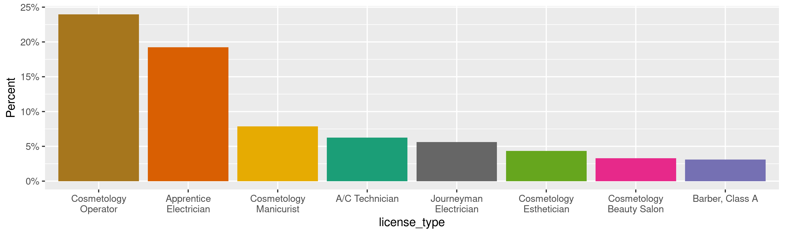
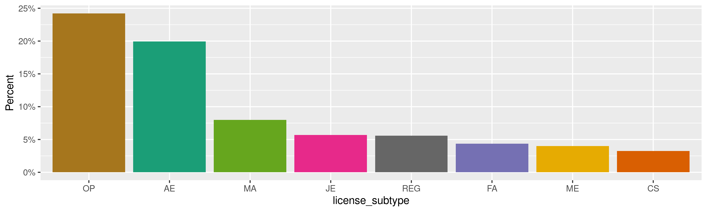
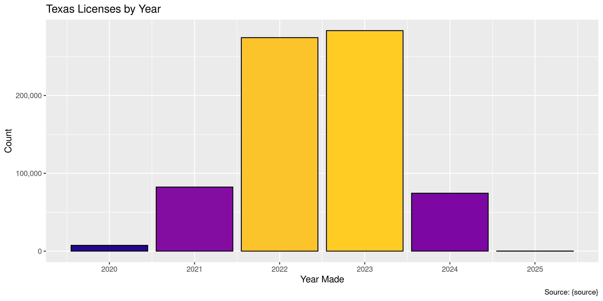
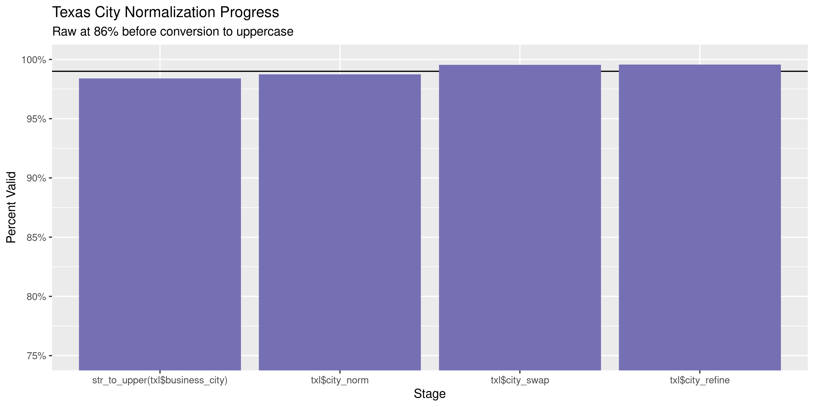
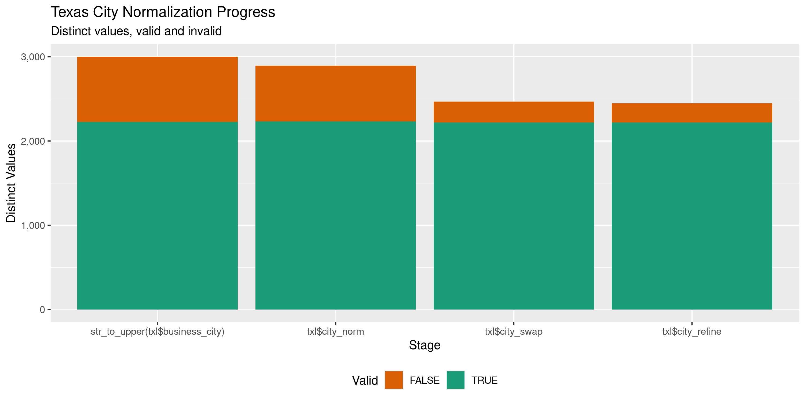

Texas Licenses
================
Kiernan Nicholls
Wed May 18 16:17:53 2022

-   <a href="#project" id="toc-project">Project</a>
-   <a href="#objectives" id="toc-objectives">Objectives</a>
-   <a href="#packages" id="toc-packages">Packages</a>
-   <a href="#source" id="toc-source">Source</a>
-   <a href="#download" id="toc-download">Download</a>
-   <a href="#read" id="toc-read">Read</a>
-   <a href="#explore" id="toc-explore">Explore</a>
    -   <a href="#missing" id="toc-missing">Missing</a>
    -   <a href="#duplicates" id="toc-duplicates">Duplicates</a>
    -   <a href="#categorical" id="toc-categorical">Categorical</a>
    -   <a href="#dates" id="toc-dates">Dates</a>
-   <a href="#wrangle" id="toc-wrangle">Wrangle</a>
    -   <a href="#address" id="toc-address">Address</a>
    -   <a href="#zip" id="toc-zip">ZIP</a>
    -   <a href="#state" id="toc-state">State</a>
    -   <a href="#city" id="toc-city">City</a>
-   <a href="#conclude" id="toc-conclude">Conclude</a>
-   <a href="#export" id="toc-export">Export</a>
-   <a href="#upload" id="toc-upload">Upload</a>

<!-- Place comments regarding knitting here -->

## Project

The Accountability Project is an effort to cut across data silos and
give journalists, policy professionals, activists, and the public at
large a simple way to search across huge volumes of public data about
people and organizations.

Our goal is to standardize public data on a few key fields by thinking
of each dataset row as a transaction. For each transaction there should
be (at least) 3 variables:

1.  All **parties** to a transaction.
2.  The **date** of the transaction.
3.  The **amount** of money involved.

## Objectives

This document describes the process used to complete the following
objectives:

1.  How many records are in the database?
2.  Check for entirely duplicated records.
3.  Check ranges of continuous variables.
4.  Is there anything blank or missing?
5.  Check for consistency issues.
6.  Create a five-digit ZIP Code called `zip`.
7.  Create a `year` field from the transaction date.
8.  Make sure there is data on both parties to a transaction.

## Packages

The following packages are needed to collect, manipulate, visualize,
analyze, and communicate these results. The `pacman` package will
facilitate their installation and attachment.

``` r
if (!require("pacman")) {
  install.packages("pacman")
}
pacman::p_load(
  tidyverse, # data manipulation
  lubridate, # datetime strings
  gluedown, # printing markdown
  janitor, # clean data frames
  campfin, # custom irw tools
  aws.s3, # aws cloud storage
  refinr, # cluster & merge
  scales, # format strings
  knitr, # knit documents
  vroom, # fast reading
  rvest, # scrape html
  glue, # code strings
  here, # project paths
  httr, # http requests
  fs # local storage 
)
```

This diary was run using `campfin` version 1.0.8.9300.

``` r
packageVersion("campfin")
#> [1] '1.0.8.9300'
```

This document should be run as part of the `R_tap` project, which lives
as a sub-directory of the more general, language-agnostic
[`irworkshop/accountability_datacleaning`](https://github.com/irworkshop/accountability_datacleaning)
GitHub repository.

The `R_tap` project uses the [RStudio
projects](https://support.rstudio.com/hc/en-us/articles/200526207-Using-Projects)
feature and should be run as such. The project also uses the dynamic
`here::here()` tool for file paths relative to *your* machine.

``` r
# where does this document knit?
here::i_am("state/tx/licenses/docs/tx_licenses_diary.Rmd")
```

## Source

We can download state licenses and certifications from the website of
the Texas [Department of Licensing &
Regulation](https://www.tdlr.texas.gov/LicenseSearch/licfile.asp).

> The files are updated everyday and saved in CSV (Comma delimited)
> format. These files should be saved to your own computer. Due to the
> size of these files, **it is not recommended** to click on the links
> and read them in your browser window . **Right click on the link and
> then choose “Save As…” or “Save Target As…”**. The files may be
> re-opened as ASCII text files, Excel files, or imported into most
> database tables.

``` r
md_order(md_code(lrformat[2:20]))
#> 01. `LICENSE TYPE`
#> 02. `LICENSE NUMBER`
#> 03. `LICENSE EXPIRATION DATE`
#> 04. `COUNTY`
#> 05. `NAME`
#> 06. `MAILING ADDRESS LINE1`
#> 07. `MAILING ADDRESS LINE2`
#> 08. `MAILING ADDRESS CITY, STATE ZIP`
#> 09. `PHONE NUMBER`
#> 10. `BUSINESS NAME`
#> 11. `BUSINESS ADDRESS-LINE1`
#> 12. `BUSINESS ADDRESS-LINE2`
#> 13. `BUSINESS CITY, STATE ZIP"`
#> 14. `BUSINESS COUNTY CODE`
#> 15. `BUSINESS COUNTY`
#> 16. `BUSINESS ZIP`
#> 17. `BUSINESS PHONE`
#> 18. `LICENSE SUBTYPE`
#> 19. `CONTINUING EDUCATION FLAG`
```

## Download

``` r
raw_url <- "https://www.tdlr.texas.gov/dbproduction2/ltlicfile.csv"
raw_dir <- dir_create(here("state", "ct", "licenses", "data", "raw"))
raw_csv <- path(raw_dir, basename(raw_url))
```

``` r
if (!file_exists(raw_csv)) {
  download.file(raw_url, raw_csv, method = "curl")
}
```

## Read

``` r
txl <- read_delim(
  file = raw_csv,
  delim = ",",
  escape_backslash = FALSE,
  escape_double = FALSE,
  locale = locale(date_format = "%m/%d/%Y"),
  col_names = c(lrformat[2:20], "UNKOWN DATE"),
  col_types = cols(
    .default = col_character(),
    `LICENSE EXPIRATION DATE` = col_date()
  )
)
```

Reading this file produced 5,195 problems. All of these problems stem
from the presence of a 20th (unnamed) column.

``` r
tx_probs <- problems(txl)
tx_probs |> 
  count(col, expected, actual, sort = TRUE)
#> # A tibble: 2 × 4
#>     col expected        actual                      n
#>   <int> <chr>           <chr>                   <int>
#> 1    20 19 columns      20 columns               5194
#> 2     3 date in ISO8601 LICENSE EXPIRATION DATE     1
```

``` r
tmp_csv <- path(raw_dir, "fix.csv")
if (!file_exists(tmp_csv)) {
  tx_lines <- read_lines(raw_csv)
  length(tx_lines)
  tx_lines[-tx_probs$row] <- paste0(tx_lines[-tx_probs$row], ",\"\"")
  write_lines(tx_lines, tmp_csv)
  rm(tx_lines)
  flush_memory()
}
```

``` r
txl <- read_delim(
  file = tmp_csv,
  skip = 1, # skip the header row
  delim = ",",
  escape_backslash = FALSE,
  escape_double = FALSE,
  locale = locale(date_format = "%m/%d/%Y"),
  # use names from file format (with extra)
  col_names = c(lrformat[2:20], "UNKOWN DATE"),
  col_types = cols(
    .default = col_character(),
    `LICENSE EXPIRATION DATE` = col_date(),
    `UNKOWN DATE` = col_date()
  )
)
```

``` r
problems(txl)
#> # A tibble: 0 × 5
#> # … with 5 variables: row <int>, col <int>, expected <chr>, actual <chr>, file <chr>
```

``` r
txl <- clean_names(txl, case = "snake")
```

## Explore

There are 722,291 rows of 20 columns. Each record represents a single
license in the state of Texas.

``` r
glimpse(txl)
#> Rows: 722,291
#> Columns: 20
#> $ license_type                   <chr> "Associate Auctioneer", "Associate Auctioneer", "Associate Auctioneer", "Associ…
#> $ license_number                 <chr> "9849", "10526", "12352", "15291", "15650", "15676", "15698", "15835", "15936",…
#> $ license_expiration_date        <date> 2022-07-20, 2022-02-03, 2023-02-24, 2021-05-09, 2022-01-25, 2023-02-15, 2022-0…
#> $ county                         <chr> "FANNIN", "BOWIE", "WILBARGER", "BEE", "OUT OF STATE", "OUT OF STATE", "OUT OF …
#> $ name                           <chr> "WASHINGTON, LARRY TODD", "TRAVILLION, TRACY RAY", "CHAPMAN, HARRAL BLANE", "ST…
#> $ mailing_address_line1          <chr> NA, NA, NA, NA, NA, NA, NA, NA, NA, NA, NA, NA, NA, NA, NA, NA, NA, NA, NA, NA,…
#> $ mailing_address_line2          <chr> NA, NA, NA, NA, NA, NA, NA, NA, NA, NA, NA, NA, NA, NA, NA, NA, NA, NA, NA, NA,…
#> $ mailing_address_city_state_zip <chr> NA, NA, NA, NA, NA, NA, NA, NA, NA, NA, NA, NA, NA, NA, NA, NA, NA, NA, NA, NA,…
#> $ phone_number                   <chr> NA, NA, NA, NA, NA, NA, NA, NA, NA, NA, NA, NA, NA, NA, NA, NA, NA, NA, NA, NA,…
#> $ business_name                  <chr> "WASHINGTON, LARRY TODD", "TRAVILLION, TRACY RAY", "CHAPMAN, HARRAL BLANE", "ST…
#> $ business_address_line1         <chr> NA, NA, NA, NA, NA, NA, NA, NA, NA, NA, NA, NA, NA, NA, NA, NA, NA, NA, NA, NA,…
#> $ business_address_line2         <chr> NA, NA, NA, NA, NA, NA, NA, NA, NA, NA, NA, NA, NA, NA, NA, NA, NA, NA, NA, NA,…
#> $ business_city_state_zip        <chr> NA, NA, NA, NA, NA, NA, NA, NA, NA, NA, NA, NA, NA, NA, NA, NA, NA, NA, NA, NA,…
#> $ business_county_code           <chr> "0147", "0387", "0487", "0409", "0999", "0999", "0999", "0999", "0201", "0439",…
#> $ business_county                <chr> "FANNIN", "RED RIVER", "WILBARGER", "SAN PATRICIO", "OUT OF STATE", "OUT OF STA…
#> $ business_zip                   <chr> NA, NA, NA, NA, NA, NA, NA, NA, NA, NA, NA, NA, NA, NA, NA, NA, NA, NA, NA, NA,…
#> $ business_phone                 <chr> NA, NA, NA, NA, NA, NA, NA, NA, NA, NA, NA, NA, NA, NA, NA, NA, NA, NA, NA, NA,…
#> $ license_subtype                <chr> NA, NA, NA, NA, NA, NA, NA, NA, NA, NA, NA, NA, NA, NA, NA, NA, NA, NA, NA, NA,…
#> $ continuing_education_flag      <chr> "N", "N", "N", "N", "N", "N", "N", "N", "N", "N", "N", "N", "N", "N", "N", "N",…
#> $ unkown_date                    <date> NA, NA, NA, NA, NA, NA, NA, NA, NA, NA, NA, NA, NA, NA, NA, NA, NA, NA, NA, NA…
tail(txl)
#> # A tibble: 6 × 20
#>   license_type           license_number license_expirat… county name  mailing_address… mailing_address… mailing_address…
#>   <chr>                  <chr>          <date>           <chr>  <chr> <chr>            <chr>            <chr>           
#> 1 Water Well Driller/Pu… 61059          2023-04-11       BAILEY CASW… 1617 COUNTY ROA… <NA>             MULESHOE TX 793…
#> 2 Water Well Driller/Pu… 61073          2023-05-02       MONTG… GARR… 19079 LANGTRY DR <NA>             MAGNOLIA TX 773…
#> 3 Water Well Driller/Pu… 61089          2023-05-09       HOOD   REED… 5100 WATERBURY … <NA>             GRANBURY TX 760…
#> 4 Water Well Driller/Pu… 61090          2023-05-09       BEXAR  MEYE… 13111 LOOKOUT W… <NA>             SAN ANTONIO TX …
#> 5 Water Well Driller/Pu… 61094          2023-05-16       STARR  CRUZ… 1502 FM 2294     <NA>             DELMITA TX 7853…
#> 6 <NA>                   2220           2022-11-07       TRAVIS HAUT… <NA>             <NA>             <NA>            
#> # … with 12 more variables: phone_number <chr>, business_name <chr>, business_address_line1 <chr>,
#> #   business_address_line2 <chr>, business_city_state_zip <chr>, business_county_code <chr>, business_county <chr>,
#> #   business_zip <chr>, business_phone <chr>, license_subtype <chr>, continuing_education_flag <chr>,
#> #   unkown_date <date>
```

### Missing

Columns vary in their degree of missing values.

``` r
col_stats(txl, count_na)
#> # A tibble: 20 × 4
#>    col                            class       n          p
#>    <chr>                          <chr>   <int>      <dbl>
#>  1 license_type                   <chr>       1 0.00000138
#>  2 license_number                 <chr>       0 0         
#>  3 license_expiration_date        <date>      0 0         
#>  4 county                         <chr>    6251 0.00865   
#>  5 name                           <chr>       0 0         
#>  6 mailing_address_line1          <chr>  635294 0.880     
#>  7 mailing_address_line2          <chr>  720344 0.997     
#>  8 mailing_address_city_state_zip <chr>  635294 0.880     
#>  9 phone_number                   <chr>  719117 0.996     
#> 10 business_name                  <chr>      23 0.0000318 
#> 11 business_address_line1         <chr>  620000 0.858     
#> 12 business_address_line2         <chr>  708706 0.981     
#> 13 business_city_state_zip        <chr>  599637 0.830     
#> 14 business_county_code           <chr>    3406 0.00472   
#> 15 business_county                <chr>    3787 0.00524   
#> 16 business_zip                   <chr>  599526 0.830     
#> 17 business_phone                 <chr>  633504 0.877     
#> 18 license_subtype                <chr>    7626 0.0106    
#> 19 continuing_education_flag      <chr>    2873 0.00398   
#> 20 unkown_date                    <date> 717098 0.993
```

We can flag any record missing a key variable needed to identify a
transaction.

``` r
key_vars <- c("license_type", "license_expiration_date", "name", "business_name")
txl <- flag_na(txl, all_of(key_vars))
sum(txl$na_flag)
#> [1] 24
```

``` r
txl %>% 
  filter(na_flag) %>% 
  select(all_of(key_vars))
#> # A tibble: 24 × 4
#>    license_type   license_expiration_date name                     business_name
#>    <chr>          <date>                  <chr>                    <chr>        
#>  1 A/C Contractor 2022-09-16              SYKES, ROBIN DAVID       <NA>         
#>  2 A/C Contractor 2023-02-14              REDDELL, ERMET WASHBURN  <NA>         
#>  3 A/C Contractor 2023-04-28              CANALITO, MICHAEL ANDREW <NA>         
#>  4 A/C Contractor 2021-03-23              SLOCUMB, AMELIA MILLIE   <NA>         
#>  5 A/C Contractor 2022-12-27              KIRCHNER, DONALD KEITH   <NA>         
#>  6 A/C Contractor 2023-05-07              MARTIN, CHRISTOPHER JON  <NA>         
#>  7 A/C Contractor 2022-07-26              YARBOROUGH, ROLAND JR    <NA>         
#>  8 A/C Contractor 2023-05-01              KEY, IRA CLAY            <NA>         
#>  9 A/C Contractor 2022-01-21              SEYMOUR, STEVEN J        <NA>         
#> 10 A/C Contractor 2023-03-06              PEREZ, MARTIN            <NA>         
#> # … with 14 more rows
```

### Duplicates

We can also flag any record completely duplicated across every column.

``` r
txl <- flag_dupes(txl, -license_number)
sum(txl$dupe_flag)
#> [1] 130
```

``` r
txl %>% 
  filter(dupe_flag) %>% 
  select(all_of(key_vars)) %>% 
  arrange(license_expiration_date)
#> # A tibble: 130 × 4
#>    license_type           license_expiration_date name                    business_name          
#>    <chr>                  <date>                  <chr>                   <chr>                  
#>  1 Cos Mini Salon         2021-01-11              BROW AND WAX WIZARD LLC BROW AND WAX WIZARD LLC
#>  2 Cos Mini Salon         2021-01-11              BROW AND WAX WIZARD LLC BROW AND WAX WIZARD LLC
#>  3 Apprentice Electrician 2021-03-02              GONZALEZ, JOSE S        GONZALEZ, JOSE S       
#>  4 Apprentice Electrician 2021-03-02              GONZALEZ, JOSE S        GONZALEZ, JOSE S       
#>  5 Apprentice Electrician 2021-03-03              ACUNA, ALDO A           ACUNA, ALDO A          
#>  6 Apprentice Electrician 2021-03-03              ACUNA, ALDO A           ACUNA, ALDO A          
#>  7 Cos Mini Salon         2021-04-08              HERITAGE HAIR DESIGNS   HERITAGE HAIR DESIGNS  
#>  8 Cos Mini Salon         2021-04-08              HERITAGE HAIR DESIGNS   HERITAGE HAIR DESIGNS  
#>  9 Cos Mini Salon         2021-04-08              HERITAGE HAIR DESIGNS   HERITAGE HAIR DESIGNS  
#> 10 Cos Mini Salon         2021-04-08              HERITAGE HAIR DESIGNS   HERITAGE HAIR DESIGNS  
#> # … with 120 more rows
```

### Categorical

``` r
col_stats(txl, n_distinct)
#> # A tibble: 22 × 4
#>    col                            class       n          p
#>    <chr>                          <chr>   <int>      <dbl>
#>  1 license_type                   <chr>     113 0.000156  
#>  2 license_number                 <chr>  637080 0.882     
#>  3 license_expiration_date        <date>   1483 0.00205   
#>  4 county                         <chr>     256 0.000354  
#>  5 name                           <chr>  628284 0.870     
#>  6 mailing_address_line1          <chr>   70976 0.0983    
#>  7 mailing_address_line2          <chr>    1370 0.00190   
#>  8 mailing_address_city_state_zip <chr>   68865 0.0953    
#>  9 phone_number                   <chr>    2710 0.00375   
#> 10 business_name                  <chr>  631024 0.874     
#> 11 business_address_line1         <chr>   77667 0.108     
#> 12 business_address_line2         <chr>    3852 0.00533   
#> 13 business_city_state_zip        <chr>   24223 0.0335    
#> 14 business_county_code           <chr>     390 0.000540  
#> 15 business_county                <chr>     256 0.000354  
#> 16 business_zip                   <chr>    3676 0.00509   
#> 17 business_phone                 <chr>   76677 0.106     
#> 18 license_subtype                <chr>     172 0.000238  
#> 19 continuing_education_flag      <chr>       3 0.00000415
#> 20 unkown_date                    <date>    895 0.00124   
#> 21 na_flag                        <lgl>       2 0.00000277
#> 22 dupe_flag                      <lgl>       2 0.00000277
```

<!-- --><!-- -->

### Dates

We can add the calendar year from `date` with `lubridate::year()`

``` r
txl <- mutate(txl, license_expiration_year = year(license_expiration_date))
```

``` r
min(txl$license_expiration_date)
#> [1] "1900-01-01"
sum(txl$license_expiration_year < 2000)
#> [1] 356
max(txl$license_expiration_date)
#> [1] "2922-08-22"
mean(txl$license_expiration_date > today())
#> [1] 0.8104739
```

<!-- -->

## Wrangle

Most

Most licensees are missing any geographic variables.

``` r
prop_na(txl$business_address_line1)
#> [1] 0.8583798
prop_na(txl$business_city_state_zip)
#> [1] 0.8301876
```

To improve the searchability of the database, we will perform some
consistent, confident string normalization. For geographic variables
like city names and ZIP codes, the corresponding `campfin::normal_*()`
functions are tailor made to facilitate this process.

``` r
txl <- txl %>% 
  select(-business_zip) %>% 
  extract(
    col = business_city_state_zip,
    into = c("business_city", "business_state", "business_zip"),
    regex = "(.*)\\s(\\w{2})\\s(.*)$",
    remove = FALSE
  )
```

``` r
bad_split <- which(
  !is.na(txl$business_city_state_zip) & is.na(txl$business_city)
)
txl$business_city[bad_split] <- word(txl$business_city_state_zip[bad_split], 1)
```

### Address

For the street `addresss` variable, the `campfin::normal_address()`
function will force consistence case, remove punctuation, and abbreviate
official USPS suffixes.

``` r
addr_norm <- txl %>% 
  distinct(business_address_line1, business_address_line2) %>% 
  mutate(
    address_norm1 = normal_address(
      address = business_address_line1,
      abbs = usps_street,
      na_rep = TRUE
    ),
    address_norm2 = normal_address(
      address = business_address_line2,
      abbs = usps_street,
      na_rep = TRUE,
      abb_end = FALSE
    )
  ) %>% 
  unite(
    col = address_norm,
    starts_with("address_norm"),
    sep = " ",
    remove = TRUE,
    na.rm = TRUE
  ) %>% 
  mutate(across(address_norm, na_if, ""))
```

``` r
addr_norm
#> # A tibble: 78,945 × 3
#>    business_address_line1    business_address_line2 address_norm                              
#>    <chr>                     <chr>                  <chr>                                     
#>  1 <NA>                      <NA>                   <NA>                                      
#>  2 8705 DAWNRIDGE CIRCLE     <NA>                   8705 DAWNRIDGE CIR                        
#>  3 11506 WARD RD             <NA>                   11506 WARD RD                             
#>  4 9715 BURNET RD            SUITE 100              9715 BURNET RD STE 100                    
#>  5 2209 B RUTLAND DR STE 100 <NA>                   2209 B RUTLAND DR STE 100                 
#>  6 2455 PACES FERRY RD       C11 LICENSE MANAGEMENT 2455 PACES FERRY RD C11 LICENSE MANAGEMENT
#>  7 102 W MAIN STREET         <NA>                   102 W MAIN ST                             
#>  8 11123 N AVENUE D          <NA>                   11123 N AVENUE D                          
#>  9 956 LOCKHART DR           <NA>                   956 LOCKHART DR                           
#> 10 1023 WALNUT ST            <NA>                   1023 WALNUT ST                            
#> # … with 78,935 more rows
```

``` r
txl <- left_join(txl, addr_norm)
```

### ZIP

For ZIP codes, the `campfin::normal_zip()` function will attempt to
create valid *five* digit codes by removing the ZIP+4 suffix and
returning leading zeroes dropped by other programs like Microsoft Excel.

``` r
txl <- txl %>% 
  mutate(
    zip_norm = normal_zip(
      zip = business_zip,
      na_rep = TRUE
    )
  )
```

``` r
progress_table(
  txl$business_zip,
  txl$zip_norm,
  compare = valid_zip
)
#> # A tibble: 2 × 6
#>   stage            prop_in n_distinct prop_na n_out n_diff
#>   <chr>              <dbl>      <dbl>   <dbl> <dbl>  <dbl>
#> 1 txl$business_zip   0.808      21109   0.830 23504  18551
#> 2 txl$zip_norm       0.998       3676   0.830   209    151
```

### State

``` r
prop_in(txl$business_state, valid_state)
#> [1] 1
```

``` r
txl %>% 
  count(business_state, sort = TRUE) %>% 
  add_prop(sum = TRUE)
#> # A tibble: 50 × 3
#>    business_state      n     p
#>    <chr>           <int> <dbl>
#>  1 <NA>           599646 0.830
#>  2 TX             120222 0.997
#>  3 FL                287 0.997
#>  4 LA                246 0.997
#>  5 CA                168 0.998
#>  6 OK                152 0.998
#>  7 NM                151 0.998
#>  8 AR                119 0.998
#>  9 IL                 95 0.998
#> 10 GA                 84 0.998
#> # … with 40 more rows
```

### City

Cities are the most difficult geographic variable to normalize, simply
due to the wide variety of valid cities and formats.

#### Normal

The `campfin::normal_city()` function is a good start, again converting
case, removing punctuation, but *expanding* USPS abbreviations. We can
also remove `invalid_city` values.

``` r
norm_city <- txl %>% 
  distinct(business_city, business_state, zip_norm) %>% 
  mutate(
    city_norm = normal_city(
      city = business_city, 
      abbs = usps_city,
      states = c("TX", "DC", "TEXAS"),
      na = invalid_city,
      na_rep = TRUE
    )
  )
```

#### Swap

We can further improve normalization by comparing our normalized value
against the *expected* value for that record’s state abbreviation and
ZIP code. If the normalized value is either an abbreviation for or very
similar to the expected value, we can confidently swap those two.

``` r
norm_city <- norm_city %>% 
  rename(city_raw = business_city) %>% 
  left_join(
    y = zipcodes,
    by = c(
      "business_state" = "state",
      "zip_norm" = "zip"
    )
  ) %>% 
  rename(city_match = city) %>% 
  mutate(
    match_abb = is_abbrev(city_norm, city_match),
    match_dist = str_dist(city_norm, city_match),
    city_swap = if_else(
      condition = !is.na(match_dist) & (match_abb | match_dist == 1),
      true = city_match,
      false = city_norm
    )
  ) %>% 
  select(
    -city_match,
    -match_dist,
    -match_abb
  )
```

``` r
txl <- left_join(
  x = txl,
  y = norm_city,
  by = c(
    "business_city" = "city_raw", 
    "business_state", 
    "zip_norm"
  )
)
```

#### Refine

The [OpenRefine](https://openrefine.org/) algorithms can be used to
group similar strings and replace the less common versions with their
most common counterpart. This can greatly reduce inconsistency, but with
low confidence; we will only keep any refined strings that have a valid
city/state/zip combination.

``` r
good_refine <- txl %>% 
  mutate(
    city_refine = city_swap %>% 
      key_collision_merge() %>% 
      n_gram_merge(numgram = 1)
  ) %>% 
  filter(city_refine != city_swap) %>% 
  inner_join(
    y = zipcodes,
    by = c(
      "city_refine" = "city",
      "business_state" = "state",
      "zip_norm" = "zip"
    )
  )
```

    #> # A tibble: 22 × 5
    #>    business_state zip_norm city_swap     city_refine       n
    #>    <chr>          <chr>    <chr>         <chr>         <int>
    #>  1 TX             78250    SAN ANTIONO   SAN ANTONIO       3
    #>  2 TX             75051    GRAND PRARIER GRAND PRAIRIE     1
    #>  3 TX             75052    GRAND PRIAIRE GRAND PRAIRIE     1
    #>  4 TX             75070    MCMCKINNEY    MCKINNEY          1
    #>  5 TX             75098    WILEY         WYLIE             1
    #>  6 TX             75454    MELLISA       MELISSA           1
    #>  7 TX             75965    NAGCODOCHES   NACOGDOCHES       1
    #>  8 TX             76010    ARLINGTONON   ARLINGTON         1
    #>  9 TX             76063    MANFIELDS     MANSFIELD         1
    #> 10 TX             76063    MANSFLIED     MANSFIELD         1
    #> # … with 12 more rows

Then we can join the refined values back to the database.

``` r
txl <- txl %>% 
  left_join(good_refine) %>% 
  mutate(city_refine = coalesce(city_refine, city_swap))
```

#### Progress

Our goal for normalization was to increase the proportion of city values
known to be valid and reduce the total distinct values by correcting
misspellings.

| stage                             | prop_in | n_distinct | prop_na | n_out | n_diff |
|:----------------------------------|--------:|-----------:|--------:|------:|-------:|
| `str_to_upper(txl$business_city)` |   0.984 |       3001 |    0.83 |  1974 |    773 |
| `txl$city_norm`                   |   0.987 |       2894 |    0.83 |  1545 |    661 |
| `txl$city_swap`                   |   0.995 |       2470 |    0.83 |   558 |    250 |
| `txl$city_refine`                 |   0.996 |       2449 |    0.83 |   535 |    230 |

You can see how the percentage of valid values increased with each
stage.

<!-- -->

More importantly, the number of distinct values decreased each stage. We
were able to confidently change many distinct invalid values to their
valid equivalent.

<!-- -->

Before exporting, we can remove the intermediary normalization columns
and rename all added variables with the `_clean` suffix.

``` r
txl <- txl %>% 
  select(
    -city_norm,
    -city_swap,
    city_clean = city_refine
  ) %>% 
  rename_all(~str_replace(., "_norm", "_clean")) %>% 
  rename_all(~str_remove(., "_raw")) %>% 
  relocate(address_clean, city_clean, .before = zip_clean)
```

## Conclude

``` r
glimpse(sample_n(txl, 1000))
#> Rows: 1,000
#> Columns: 28
#> $ license_type                   <chr> "Apprentice Electrician", "Cosmetology Beauty Salon", "Tow Truck Operator (Inci…
#> $ license_number                 <chr> "408543", "664055", "47772", "43741", "1612961", "530849", "271531", "1206159",…
#> $ license_expiration_date        <date> 2021-03-24, 2023-11-30, 2020-11-26, 2022-08-31, 2022-11-02, 2022-03-17, 2023-1…
#> $ county                         <chr> "WILLIAMSON", "LIPSCOMB", "HARRIS", "OUT OF STATE", "NACOGDOCHES", "DENTON", "O…
#> $ name                           <chr> "BRYANT, RAEKWON D", "OLIVIA'S BEAUTY SHOP", "CARRIER, KINDALL ROCKELL", "REES,…
#> $ mailing_address_line1          <chr> NA, "51 KIOWA ST", NA, NA, NA, NA, NA, NA, NA, NA, NA, NA, NA, "PO BOX 1727", N…
#> $ mailing_address_line2          <chr> NA, NA, NA, NA, NA, NA, NA, NA, NA, NA, NA, NA, NA, NA, NA, NA, NA, NA, NA, NA,…
#> $ mailing_address_city_state_zip <chr> NA, "BOOKER TX 79005-6009", NA, NA, NA, NA, NA, NA, NA, NA, NA, NA, NA, "BRECKE…
#> $ phone_number                   <chr> NA, NA, NA, NA, NA, NA, NA, NA, NA, NA, NA, NA, NA, NA, NA, NA, NA, NA, NA, NA,…
#> $ business_name                  <chr> "BRYANT, RAEKWON D", "OLIVIA'S BEAUTY SHOP", "CARRIER, KINDALL ROCKELL", "REES,…
#> $ business_address_line1         <chr> NA, "GATEWOOD TO KIOWA STREET", NA, NA, NA, NA, "101 E BROADWAY ST", NA, NA, NA…
#> $ business_address_line2         <chr> NA, NA, NA, NA, NA, NA, NA, NA, NA, NA, NA, NA, NA, NA, NA, NA, NA, NA, NA, "ST…
#> $ business_city_state_zip        <chr> NA, "BOOKER TX 79005", "HUMBLE TX 77338", NA, NA, NA, "Andrews TX 79714", NA, N…
#> $ business_city                  <chr> NA, "BOOKER", "HUMBLE", NA, NA, NA, "Andrews", NA, NA, NA, NA, NA, NA, "BRECKEN…
#> $ business_state                 <chr> NA, "TX", "TX", NA, NA, NA, "TX", NA, NA, NA, NA, NA, NA, "TX", NA, NA, NA, NA,…
#> $ business_zip                   <chr> NA, "79005", "77338", NA, NA, NA, "79714", NA, NA, NA, NA, NA, NA, "76424", NA,…
#> $ business_county_code           <chr> "0491", "0295", "0201", "0999", "0347", "0121", "0003", "0029", "0201", "0491",…
#> $ business_county                <chr> "WILLIAMSON", "LIPSCOMB", "HARRIS", "OUT OF STATE", "NACOGDOCHES", "DENTON", "A…
#> $ business_phone                 <chr> NA, "8065844064", NA, NA, NA, NA, NA, NA, NA, NA, NA, NA, NA, "2545590449", NA,…
#> $ license_subtype                <chr> "AE", "CS", "IM", "CS CONTESTANT", "OP", "AE", "Device", "MA", "OP", "ME", "MA"…
#> $ continuing_education_flag      <chr> "N", "N", "N", "N", "N", "N", "N", "N", "N", "N", "N", "N", "N", "N", "N", "N",…
#> $ unkown_date                    <date> NA, NA, NA, NA, NA, NA, NA, NA, NA, NA, NA, NA, NA, NA, NA, NA, NA, NA, NA, NA…
#> $ na_flag                        <lgl> FALSE, FALSE, FALSE, FALSE, FALSE, FALSE, FALSE, FALSE, FALSE, FALSE, FALSE, FA…
#> $ dupe_flag                      <lgl> FALSE, FALSE, FALSE, FALSE, FALSE, FALSE, FALSE, FALSE, FALSE, FALSE, FALSE, FA…
#> $ license_expiration_year        <dbl> 2021, 2023, 2020, 2022, 2022, 2022, 2023, 2023, 2023, 2023, 2023, 2022, 2022, 2…
#> $ address_clean                  <chr> NA, "GATEWOOD TO KIOWA ST", NA, NA, NA, NA, "101 E BROADWAY ST", NA, NA, NA, NA…
#> $ city_clean                     <chr> NA, "BOOKER", "HUMBLE", NA, NA, NA, "ANDREWS", NA, NA, NA, NA, NA, NA, "BRECKEN…
#> $ zip_clean                      <chr> NA, "79005", "77338", NA, NA, NA, "79714", NA, NA, NA, NA, NA, NA, "76424", NA,…
```

1.  There are 722,291 records in the database.
2.  There are 130 duplicate records in the database.
3.  The range and distribution of `amount` and `date` seem reasonable.
4.  There are 24 records missing key variables.
5.  Consistency in geographic data has been improved with
    `campfin::normal_*()`.
6.  The 4-digit `year` variable has been created with
    `lubridate::year()`.

## Export

Now the file can be saved on disk for upload to the Accountability
server. We will name the object using a date range of the records
included.

``` r
clean_dir <- dir_create(here("state", "tx", "licenses", "data", "clean"))
clean_csv <- path(clean_dir, glue("tx_licenses_2018-20220516.csv"))
clean_rds <- path_ext_set(clean_csv, "rds")
basename(clean_csv)
#> [1] "tx_licenses_2018-20220516.csv"
```

``` r
write_csv(txl, clean_csv, na = "")
write_rds(txl, clean_rds, compress = "xz")
(clean_size <- file_size(clean_csv))
#> 110M
```

## Upload

We can use the `aws.s3::put_object()` to upload the text file to the IRW
server.

``` r
aws_key <- path("csv", basename(clean_csv))
if (!object_exists(aws_key, "publicaccountability")) {
  put_object(
    file = clean_csv,
    object = aws_key, 
    bucket = "publicaccountability",
    acl = "public-read",
    show_progress = TRUE,
    multipart = TRUE
  )
}
aws_head <- head_object(aws_key, "publicaccountability")
(aws_size <- as_fs_bytes(attr(aws_head, "content-length")))
unname(aws_size == clean_size)
```
