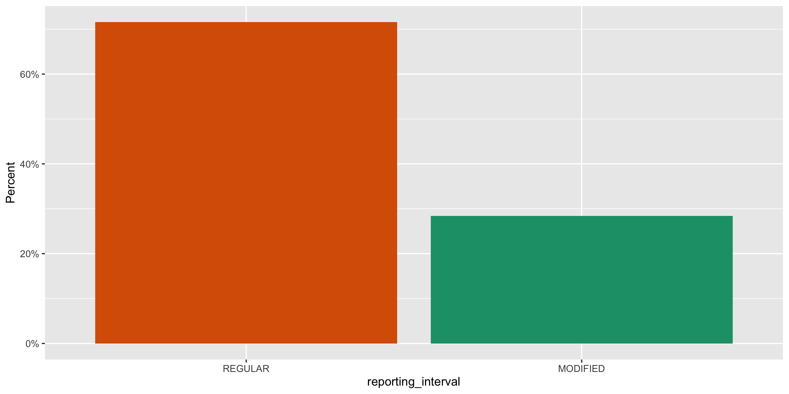
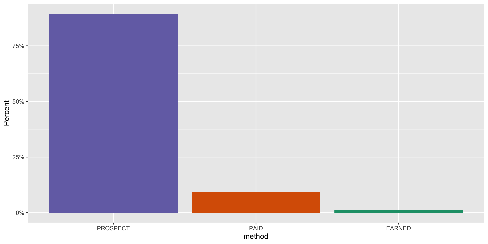
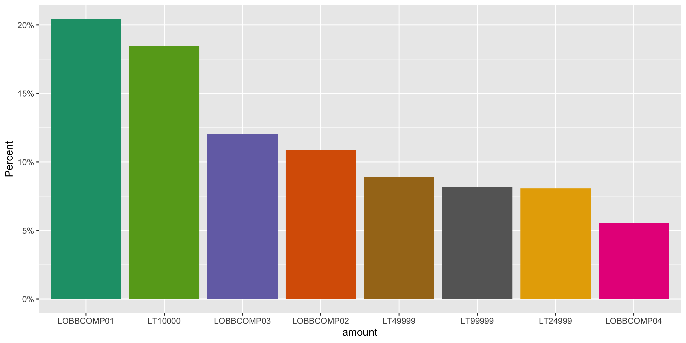

Texas Lobbying
================
Kiernan Nicholls & Yanqi Xu
2023-08-04 22:19:40

- [Project](#project)
- [Objectives](#objectives)
- [Packages](#packages)
- [Data](#data)
- [Import](#import)
- [Explore](#explore)
- [Wrangle](#wrangle)
- [Conclude](#conclude)
- [Export](#export)

<!-- Place comments regarding knitting here -->

## Project

The Accountability Project is an effort to cut across data silos and
give journalists, policy professionals, activists, and the public at
large a simple way to search across huge volumes of public data about
people and organizations.

Our goal is to standardizing public data on a few key fields by thinking
of each dataset row as a transaction. For each transaction there should
be (at least) 3 variables:

1.  All **parties** to a transaction.
2.  The **date** of the transaction.
3.  The **amount** of money involved.

## Objectives

This document describes the process used to complete the following
objectives:

1.  How many records are in the database?
2.  Check for entirely duplicated records.
3.  Check ranges of continuous variables.
4.  Is there anything blank or missing?
5.  Check for consistency issues.
6.  Create a five-digit ZIP Code called `zip`.
7.  Create a `year` field from the transaction date.
8.  Make sure there is data on both parties to a transaction.

## Packages

The following packages are needed to collect, manipulate, visualize,
analyze, and communicate these results. The `pacman` package will
facilitate their installation and attachment.

The IRW’s `campfin` package will also have to be installed from GitHub.
This package contains functions custom made to help facilitate the
processing of campaign finance data.

``` r
if (!require("pacman")) install.packages("pacman")
pacman::p_load_gh("irworkshop/campfin")
pacman::p_load(
  tidyverse, # data manipulation
  lubridate, # datetime strings
  magrittr, # pipe operators
  janitor, # dataframe clean
  refinr, # cluster and merge
  readxl, # read excel files
  scales, # format strings
  knitr, # knit documents
  vroom, # read files fast
  glue, # combine strings
  here, # relative storage
  fs # search storage 
)
```

This document should be run as part of the `R_campfin` project, which
lives as a sub-directory of the more general, language-agnostic
[`irworkshop/accountability_datacleaning`](https://github.com/irworkshop/accountability_datacleaning)
GitHub repository.

The `R_campfin` project uses the [RStudio
projects](https://support.rstudio.com/hc/en-us/articles/200526207-Using-Projects)
feature and should be run as such. The project also uses the dynamic
`here::here()` tool for file paths relative to *your* machine.

``` r
# where does this document knit?
here::here()
#> [1] "/Users/yanqixu/code/accountability_datacleaning"
```

## Data

The data can be obtained from the [Texas Ethics
Commission](https://www.ethics.state.tx.us/data/search/lobby/). The
download page lists data files from 2001 and on. Since the older files
are in a format relatively hard to wrangle. We here include only
lobbying records from 2016 on. The 2023 file was updated on 2023-08-04.

## Import

### Download

``` r
raw_dir <- dir_create(here("state","tx", "lobby", "data", "raw"))
```

``` r
txl_urls <- c(
  "https://www.ethics.state.tx.us/data/search/lobby/2016/2016LobbyistGroupByLobbyist.nopag.xlsx",
  "https://www.ethics.state.tx.us/data/search/lobby/2017/2017LobbyistGroupByLobbyist.xlsx",
  glue("https://www.ethics.state.tx.us/data/search/lobby/{2018:2023}/{2018:2023}LobbyGroupByLobbyist.xlsx")
)

if (!all_files_new(raw_dir)) {
  for (xlsx_url in txl_urls) {
    download.file(
      url = xlsx_url,
      destfile = path(raw_dir, basename(xlsx_url))
    )
  }
}
```

### Read

``` r
txl <- map_df(
  .x = dir_ls(raw_dir), 
  .f = read_excel,
  col_types = "text"
)

txl <- txl %>% 
  clean_names("snake") %>% 
  rename(
    lob_id = filer_id,
    lob_name = filer_name,
    lob_biz = business,
    lob_addr1 = addr_1_4,
    lob_addr2 = addr_2_5,
    lob_city = city_6,
    lob_state = state_7,
    lob_zip = zip_8,
    pri_name = client_name,
    pri_addr1 = addr_1_10,
    pri_addr2 = addr_2_11,
    pri_city = city_12,
    pri_state = state_13,
    pri_zip = zip_14
  )
```

``` r
txl <- mutate_at(txl, vars(begin, stop), ~parse_date(., "%m/%d/%Y"))
txl <- mutate_at(txl, vars(lob_name), ~str_remove(., "\\s\\(.*\\)$"))
```

## Explore

``` r
head(txl)
#> # A tibble: 6 × 20
#>   lob_id lob_name   lob_biz lob_a…¹ lob_a…² lob_c…³ lob_s…⁴ lob_zip pri_n…⁵ pri_a…⁶ pri_a…⁷ pri_c…⁸
#>   <chr>  <chr>      <chr>   <chr>   <chr>   <chr>   <chr>   <chr>   <chr>   <chr>   <chr>   <chr>  
#> 1 70358  Abbott, S… Attorn… 1108 L… Suite … Austin  TX      78701   Allen … 3200 S… Suite … Houston
#> 2 70358  Abbott, S… Attorn… 1108 L… Suite … Austin  TX      78701   Harris… 1980 P… Suite … Houston
#> 3 52844  Abel, Dou… health… 1515 H… <NA>    Houston TX      77004   Harris… 1515 H… <NA>    Houston
#> 4 10044  Acevedo, … Manage… 1001 C… <NA>    Austin  TX      78701   Anadar… 1201 L… <NA>    The Wo…
#> 5 53651  Acevedo, … <NA>    1122 C… Suite … Austin  TX      78701   Beacon… 200 St… <NA>    Boston 
#> 6 53651  Acevedo, … <NA>    1122 C… Suite … Austin  TX      78701   Capito… 3705 M… <NA>    Austin 
#> # … with 8 more variables: pri_state <chr>, pri_zip <chr>, reporting_interval <chr>, begin <date>,
#> #   stop <date>, method <chr>, amount <chr>, exact <chr>, and abbreviated variable names
#> #   ¹​lob_addr1, ²​lob_addr2, ³​lob_city, ⁴​lob_state, ⁵​pri_name, ⁶​pri_addr1, ⁷​pri_addr2, ⁸​pri_city
tail(txl)
#> # A tibble: 6 × 20
#>   lob_id lob_name   lob_biz lob_a…¹ lob_a…² lob_c…³ lob_s…⁴ lob_zip pri_n…⁵ pri_a…⁶ pri_a…⁷ pri_c…⁸
#>   <chr>  <chr>      <chr>   <chr>   <chr>   <chr>   <chr>   <chr>   <chr>   <chr>   <chr>   <chr>  
#> 1 86099  Zaykowski… "Corpo… 816 Co… <NA>    Austin  TX      78701   Drax    Drax P… <NA>    Selby  
#> 2 86099  Zaykowski… "Corpo… 816 Co… <NA>    Austin  TX      78701   McGuir… 816 Co… Suite … Ausitn 
#> 3 81396  Zeller, L… "Blue … 1001 E… <NA>    Richar… TX      75082   BlueCr… 1001 E… <NA>    Richar…
#> 4 56328  Zent, Lar… "Execu… 1616 R… <NA>    Austin  TX      78701-… <NA>    <NA>    <NA>    <NA>   
#> 5 70726  Zimmer Cr… "Lobby… 2211 A… #24     Houston TX      77057   Brazos… 1759 N… <NA>    Bryan  
#> 6 86033  Zinsmeist… "Direc… 1001 C… <NA>    Austin  TX      78701   Charte… 601 Ma… <NA>    Washin…
#> # … with 8 more variables: pri_state <chr>, pri_zip <chr>, reporting_interval <chr>, begin <date>,
#> #   stop <date>, method <chr>, amount <chr>, exact <chr>, and abbreviated variable names
#> #   ¹​lob_addr1, ²​lob_addr2, ³​lob_city, ⁴​lob_state, ⁵​pri_name, ⁶​pri_addr1, ⁷​pri_addr2, ⁸​pri_city
glimpse(sample_n(txl, 20))
#> Rows: 20
#> Columns: 20
#> $ lob_id             <chr> "80980", "84874", "51002", "63990", "13737", "50826", "37179", "60698"…
#> $ lob_name           <chr> "Ford, Crystal", "Mazuca, Anne", "Haley, Anthony", "Spilman, Johanna",…
#> $ lob_biz            <chr> "Public Policy Advisor", "Consultant", "HMWK, LLC", "Employee of NFIB"…
#> $ lob_addr1          <chr> "600 Congress Ave., Ste 2200", "919 Congress Ave., Ste. 510", "1212 Gu…
#> $ lob_addr2          <chr> NA, NA, "Ste. 1003", NA, NA, NA, NA, "Ste 940", NA, "Suite 900", NA, N…
#> $ lob_city           <chr> "Austin", "Austin", "Austin", "Austin", "Austin", "Austin", "Austin", …
#> $ lob_state          <chr> "TX", "TX", "TX", "TX", "TX", "TX", "TX", "TX", "TX", "TX", "TX", "TX"…
#> $ lob_zip            <chr> "78701", "78701", "78701", "78701", "78701", "78767", "78701", "78701"…
#> $ pri_name           <chr> "Crown Castle International Corp.", "Secure Democracy", "Adelanto Heal…
#> $ pri_addr1          <chr> "1220 Augusta Dr. Ste 600", "611 Pennsylvania Ave., SE #143", "401 W. …
#> $ pri_addr2          <chr> NA, NA, "Suite 840", NA, NA, NA, NA, NA, NA, "Bldg B", NA, NA, NA, NA,…
#> $ pri_city           <chr> "Houston", "Washington", "Austin", "Austin", "Santa Monica", "Weatherf…
#> $ pri_state          <chr> "TX", "DC", "TX", "TX", "CA", "TX", "TX", "NV", "TX", "CA", "TX", "NY"…
#> $ pri_zip            <chr> "77057", "20003", "78701-4078", "78701", "90405", "76086", "77477", "8…
#> $ reporting_interval <chr> "REGULAR", "REGULAR", "MODIFIED", "REGULAR", "REGULAR", "MODIFIED", "R…
#> $ begin              <date> 2018-01-08, 2021-01-13, 2022-12-08, 2019-01-03, 2020-10-13, 2022-04-2…
#> $ stop               <date> 2018-12-31, 2021-12-31, 2022-12-31, 2019-12-31, 2020-12-31, 2022-12-3…
#> $ method             <chr> "PROSPECT", "PROSPECT", "PROSPECT", "PAID", "PROSPECT", "PROSPECT", "P…
#> $ amount             <chr> "LT24999", "LOBBCOMP03", "LOBBCOMP03", "LT149999", "LOBBCOMP02", "LOBB…
#> $ exact              <chr> NA, NA, NA, NA, NA, NA, NA, NA, NA, NA, NA, NA, NA, NA, NA, NA, NA, NA…
```

### Missing

``` r
col_stats(txl, count_na)
#> # A tibble: 20 × 4
#>    col                class      n         p
#>    <chr>              <chr>  <int>     <dbl>
#>  1 lob_id             <chr>      0 0        
#>  2 lob_name           <chr>      0 0        
#>  3 lob_biz            <chr>   7783 0.113    
#>  4 lob_addr1          <chr>      7 0.000102 
#>  5 lob_addr2          <chr>  39881 0.580    
#>  6 lob_city           <chr>      7 0.000102 
#>  7 lob_state          <chr>      6 0.0000873
#>  8 lob_zip            <chr>      7 0.000102 
#>  9 pri_name           <chr>    857 0.0125   
#> 10 pri_addr1          <chr>   1018 0.0148   
#> 11 pri_addr2          <chr>  50329 0.732    
#> 12 pri_city           <chr>   1019 0.0148   
#> 13 pri_state          <chr>   1043 0.0152   
#> 14 pri_zip            <chr>   1040 0.0151   
#> 15 reporting_interval <chr>   1541 0.0224   
#> 16 begin              <date>   870 0.0127   
#> 17 stop               <date>   869 0.0126   
#> 18 method             <chr>    868 0.0126   
#> 19 amount             <chr>    867 0.0126   
#> 20 exact              <chr>  68177 0.992
```

``` r
txl <- txl %>% flag_na(lob_name, pri_name)
percent(mean(txl$na_flag), 0.1)
#> [1] "1.2%"
```

``` r
txl %>% 
  filter(na_flag) %>% 
  select(lob_name, pri_name) %>% 
  sample_frac()
#> # A tibble: 857 × 2
#>    lob_name                 pri_name
#>    <chr>                    <chr>   
#>  1 Migliaro, Alyse          <NA>    
#>  2 Ballew, Joel D.          <NA>    
#>  3 Thompson III, John David <NA>    
#>  4 Rotkoff, Jeffre W.       <NA>    
#>  5 Tomascik, Tracy          <NA>    
#>  6 Burner, Burnie           <NA>    
#>  7 PGIM, Inc.               <NA>    
#>  8 Boutilier, Bruce         <NA>    
#>  9 Newell, Stephanie M.     <NA>    
#> 10 Adair, Bobby Glenn       <NA>    
#> # … with 847 more rows
```

### Duplicates

Most of the duplicate rows come from a repeated single variable and
missing identifying variables (like the date). We will flag them
nonetheless.

``` r
txl <- flag_dupes(txl, everything(), .check = TRUE)
percent(mean(txl$dupe_flag), 0.1)
#> [1] "3.8%"
```

``` r
txl %>% 
  filter(dupe_flag) %>% 
  select(lob_name, pri_name, begin, stop, na_flag) %>% 
  arrange(lob_name)
#> # A tibble: 2,621 × 5
#>    lob_name          pri_name begin  stop   na_flag
#>    <chr>             <chr>    <date> <date> <lgl>  
#>  1 Aguilar, Leonard  <NA>     NA     NA     TRUE   
#>  2 Aguilar, Leonard  <NA>     NA     NA     TRUE   
#>  3 Aguilar, Leonard  <NA>     NA     NA     TRUE   
#>  4 Aguilar, Leonard  <NA>     NA     NA     TRUE   
#>  5 Akins, Dwain A.   <NA>     NA     NA     TRUE   
#>  6 Akins, Dwain A.   <NA>     NA     NA     TRUE   
#>  7 Aleman, Steven R. <NA>     NA     NA     TRUE   
#>  8 Aleman, Steven R. <NA>     NA     NA     TRUE   
#>  9 Aleman, Steven R. <NA>     NA     NA     TRUE   
#> 10 Aleman, Steven R. <NA>     NA     NA     TRUE   
#> # … with 2,611 more rows
```

### Categorical

``` r
col_stats(txl, n_distinct)
#> # A tibble: 22 × 4
#>    col                class      n         p
#>    <chr>              <chr>  <int>     <dbl>
#>  1 lob_id             <chr>   3349 0.0487   
#>  2 lob_name           <chr>   3410 0.0496   
#>  3 lob_biz            <chr>   1980 0.0288   
#>  4 lob_addr1          <chr>   2995 0.0436   
#>  5 lob_addr2          <chr>    836 0.0122   
#>  6 lob_city           <chr>    341 0.00496  
#>  7 lob_state          <chr>     39 0.000567 
#>  8 lob_zip            <chr>    817 0.0119   
#>  9 pri_name           <chr>   9765 0.142    
#> 10 pri_addr1          <chr>  10718 0.156    
#> 11 pri_addr2          <chr>   1511 0.0220   
#> 12 pri_city           <chr>   1351 0.0197   
#> 13 pri_state          <chr>     50 0.000727 
#> 14 pri_zip            <chr>   2857 0.0416   
#> 15 reporting_interval <chr>      3 0.0000436
#> 16 begin              <date>  1964 0.0286   
#> 17 stop               <date>  1159 0.0169   
#> 18 method             <chr>      4 0.0000582
#> 19 amount             <chr>     36 0.000524 
#> 20 exact              <chr>     14 0.000204 
#> 21 na_flag            <lgl>      2 0.0000291
#> 22 dupe_flag          <lgl>      2 0.0000291
```

<!-- --><!-- --><!-- -->

## Wrangle

To improve the searchability of the database, we will perform some
consistent, confident string normalization. For geographic variables
like city names and ZIP codes, the corresponding `campfin::normal_*()`
functions are tailor made to facilitate this process.

We will also add a single year variable.

``` r
txl <- mutate(txl, year = year(begin))
```

### Address

For the street `addresss` variable, the `campfin::normal_address()`
function will force consistence case, remove punctuation, and abbreviate
official USPS suffixes.

``` r
txl <- txl %>% 
  unite(
    col = lob_addr,
    starts_with("lob_addr"),
    sep = " ",
    remove = FALSE,
    na.rm = TRUE
  ) %>% 
  mutate(
    lob_addr_norm = normal_address(
      address = lob_addr,
      abbs = usps_street,
      na_rep = TRUE
    )
  ) %>% 
  select(-lob_addr)
```

``` r
txl <- txl %>% 
  unite(
    col = pri_addr,
    starts_with("pri_addr"),
    sep = " ",
    remove = FALSE,
    na.rm = TRUE
  ) %>% 
  mutate(
    pri_addr_norm = normal_address(
      address = pri_addr,
      abbs = usps_street,
      na_rep = TRUE
    )
  ) %>% 
  select(-pri_addr)
```

``` r
txl %>% 
  select(contains("lob_addr")) %>% 
  distinct() %>% 
  sample_n(10)
#> # A tibble: 10 × 3
#>    lob_addr1                          lob_addr2                lob_addr_norm                       
#>    <chr>                              <chr>                    <chr>                               
#>  1 200 E. Nopal                       Suite 203                200 E NOPAL SUITE 203               
#>  2 700 Lavaca Street                  Suite 1400               700 LAVACA STREET SUITE 1400        
#>  3 1111 West 6th Street               Bldg. B, Suite 400       1111 WEST 6TH STREET BLDG B SUITE 4…
#>  4 Dallas-Fort Worth Hospital Council 300 Decker Dr., Ste. 300 DALLASFORT WORTH HOSPITAL COUNCIL 3…
#>  5 1111 Bagby, Sky Lobby 2            <NA>                     1111 BAGBY SKY LOBBY 2              
#>  6 6608 Weslayan Street               <NA>                     6608 WESLAYAN ST                    
#>  7 7020 Easy Wind Dr. Ste. 200        <NA>                     7020 EASY WIND DR STE 200           
#>  8 13001 Bridgeview Ct.               <NA>                     13001 BRIDGEVIEW CT                 
#>  9 12506 Fallen Tower Lane            <NA>                     12506 FALLEN TOWER LN               
#> 10 1001 Noble Energy Way              <NA>                     1001 NOBLE ENERGY WAY
```

### ZIP

For ZIP codes, the `campfin::normal_zip()` function will attempt to
create valid *five* digit codes by removing the ZIP+4 suffix and
returning leading zeroes dropped by other programs like Microsoft Excel.

``` r
txl <- mutate_at(
  .tbl = txl,
  .vars = vars(ends_with("zip")),
  .funs = list(norm = normal_zip),
  na_rep = TRUE
)
```

``` r
progress_table(
  txl$lob_zip,
  txl$lob_zip_norm,  
  txl$pri_zip,
  txl$pri_zip_norm,
  compare = valid_zip
)
#> # A tibble: 4 × 6
#>   stage            prop_in n_distinct  prop_na n_out n_diff
#>   <chr>              <dbl>      <dbl>    <dbl> <dbl>  <dbl>
#> 1 txl$lob_zip        0.957        817 0.000102  2980    183
#> 2 txl$lob_zip_norm   1.00         665 0.000102    29      6
#> 3 txl$pri_zip        0.937       2857 0.0151    4286    647
#> 4 txl$pri_zip_norm   0.997       2365 0.0154     184     62
```

### State

``` r
prop_in(txl$lob_state, valid_state)
#> [1] 1
prop_in(txl$pri_state, valid_state)
#> [1] 1
```

### City

Cities are the most difficult geographic variable to normalize, simply
due to the wide variety of valid cities and formats.

#### Normal

The `campfin::normal_city()` function is a good start, again converting
case, removing punctuation, but *expanding* USPS abbreviations. We can
also remove `invalid_city` values.

``` r
txl <- mutate_at(
  .tbl = txl,
  .vars = vars(ends_with("city")),
  .funs = list(norm = normal_city),
  abbs = usps_city,
  states = c("TX", "DC", "TEXAS"),
  na = invalid_city,
  na_rep = TRUE
)
```

#### Swap

We can further improve normalization by comparing our normalized value
against the *expected* value for that record’s state abbreviation and
ZIP code. If the normalized value is either an abbreviation for or very
similar to the expected value, we can confidently swap those two.

``` r
txl <- txl %>% 
  left_join(
    y = zipcodes,
    by = c(
      "lob_state" = "state",
      "lob_zip_norm" = "zip"
    )
  ) %>% 
  rename(city_match = city) %>% 
  mutate(
    match_abb = is_abbrev(lob_city_norm, city_match),
    match_dist = str_dist(lob_city_norm, city_match),
    lob_city_swap = if_else(
      condition = !is.na(match_dist) & (match_abb | match_dist == 1),
      true = city_match,
      false = lob_city_norm
    )
  ) %>% 
  select(
    -city_match,
    -match_dist,
    -match_abb
  )
```

``` r
txl <- txl %>% 
  left_join(
    y = zipcodes,
    by = c(
      "pri_state" = "state",
      "pri_zip_norm" = "zip"
    )
  ) %>% 
  rename(city_match = city) %>% 
  mutate(
    match_abb = is_abbrev(pri_city_norm, city_match),
    match_dist = str_dist(pri_city_norm, city_match),
    pri_city_swap = if_else(
      condition = !is.na(match_dist) & (match_abb | match_dist == 1),
      true = city_match,
      false = pri_city_norm
    )
  ) %>% 
  select(
    -city_match,
    -match_dist,
    -match_abb
  )
```

#### Progress

    #> # A tibble: 6 × 6
    #>   stage                      prop_in n_distinct  prop_na n_out n_diff
    #>   <chr>                        <dbl>      <dbl>    <dbl> <dbl>  <dbl>
    #> 1 str_to_upper(txl$lob_city)   0.998        320 0.000102   104     23
    #> 2 txl$lob_city_norm            0.999        318 0.000102    75     20
    #> 3 txl$lob_city_swap            0.999        310 0.000102    50     11
    #> 4 str_to_upper(txl$pri_city)   0.983       1278 0.0148    1150    192
    #> 5 txl$pri_city_norm            0.986       1265 0.0148     955    177
    #> 6 txl$pri_city_swap            0.994       1157 0.0148     378     68

## Conclude

``` r
txl <- txl %>% 
  select(
    -lob_city_norm,
    -pri_city_norm,
  ) %>% 
  rename_all(~str_replace(., "_(norm|swap)", "_clean"))
```

``` r
glimpse(sample_n(txl, 20))
#> Rows: 20
#> Columns: 29
#> $ lob_id             <chr> "13768", "83262", "70459", "82898", "82941", "56925", "30094", "40995"…
#> $ lob_name           <chr> "Goodell Polan, Deborah", "Barnes, Kelly", "Smith, Sharon", "Norman, S…
#> $ lob_biz            <chr> "Attorney", "consulting", "Attorney", "McGuireWoods Consulting", "San …
#> $ lob_addr1          <chr> "P.O. Box 50272", "823 Congress Ave., Ste. 900", "100 Congress Ave., S…
#> $ lob_addr2          <chr> NA, NA, NA, NA, NA, "Ste. 200", "Suite 900", NA, NA, "Suite 1500", "Su…
#> $ lob_city           <chr> "Austin", "Austin", "Austin", "Austin", "San Angelo", "Austin", "Austi…
#> $ lob_state          <chr> "TX", "TX", "TX", "TX", "TX", "TX", "TX", "TX", "TX", "TX", "TX", "CA"…
#> $ lob_zip            <chr> "78763", "78701", "78701", "78701", "76903", "78701", "78701", "79105"…
#> $ pri_name           <chr> "Mariner Finance, LLC", "Saturn Jets, LLC", "Travis County Municipal U…
#> $ pri_addr1          <chr> "8211 Town Center Drive", "7815 Karl May Drive", "c/o Armbrust & Brown…
#> $ pri_addr2          <chr> NA, NA, "100 Congress Ave., Ste. 1300", NA, NA, NA, NA, "Suite 500", "…
#> $ pri_city           <chr> "Baltimore", "Waco", "Austin", "Arlington", "San Angelo", "Oakville", …
#> $ pri_state          <chr> "MD", "TX", "TX", "TX", "TX", NA, "ME", "TX", "TX", "TX", "MD", "CA", …
#> $ pri_zip            <chr> "21236", "76708", "78701", "76010", "76904", "L6J2X1", "02481", "78701…
#> $ reporting_interval <chr> "REGULAR", "REGULAR", "MODIFIED", NA, NA, "REGULAR", "REGULAR", "MODIF…
#> $ begin              <date> 2017-12-11, 2020-01-31, 2019-01-01, 2019-01-10, 2019-01-03, 2021-03-2…
#> $ stop               <date> 2017-12-31, 2020-12-31, 2019-12-31, 2019-12-31, 2019-11-30, 2021-12-3…
#> $ method             <chr> "PAID", "PROSPECT", "PAID", "PROSPECT", "PROSPECT", "PROSPECT", "PROSP…
#> $ amount             <chr> "LT10000", "LOBBCOMP01", "LT10000", "LT10000", "EQZERO", "LOBBCOMP03",…
#> $ exact              <chr> NA, NA, NA, NA, NA, NA, NA, NA, NA, NA, NA, NA, NA, NA, NA, NA, NA, NA…
#> $ na_flag            <lgl> FALSE, FALSE, FALSE, FALSE, FALSE, FALSE, FALSE, FALSE, FALSE, FALSE, …
#> $ dupe_flag          <lgl> FALSE, FALSE, FALSE, FALSE, FALSE, FALSE, FALSE, FALSE, FALSE, TRUE, F…
#> $ year               <dbl> 2017, 2020, 2019, 2019, 2019, 2021, 2023, 2017, 2022, 2018, 2018, 2023…
#> $ lob_addr_clean     <chr> "PO BOX 50272", "823 CONGRESS AVE STE 900", "100 CONGRESS AVE STE 1300…
#> $ pri_addr_clean     <chr> "8211 TOWN CENTER DR", "7815 KARL MAY DR", "C/O ARMBRUST BROWN PLLC 10…
#> $ lob_zip_clean      <chr> "78763", "78701", "78701", "78701", "76903", "78701", "78701", "79105"…
#> $ pri_zip_clean      <chr> "21236", "76708", "78701", "76010", "76904", "621", "02481", "78701", …
#> $ lob_city_clean     <chr> "AUSTIN", "AUSTIN", "AUSTIN", "AUSTIN", "SAN ANGELO", "AUSTIN", "AUSTI…
#> $ pri_city_clean     <chr> "BALTIMORE", "WACO", "AUSTIN", "ARLINGTON", "SAN ANGELO", "OAKVILLE", …
```

1.  There are 68,752 records in the database.
2.  There are 2,621 duplicate records in the database.
3.  There are 857 records missing ….
4.  Consistency in geographic data has been improved with
    `campfin::normal_*()`.
5.  The 4-digit `year` variable has been created with
    `lubridate::year()`.

## Export

``` r
clean_dir <- dir_create(here("state","tx", "lobby", "data", "clean"))
```

``` r
write_csv(
  x = txl,
  path = path(clean_dir, "tx_lobby_reg_2016-2023.csv"),
  na = ""
)
```
