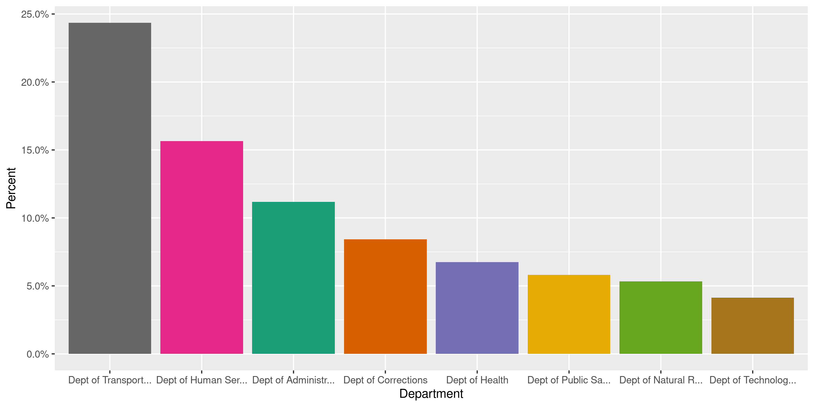
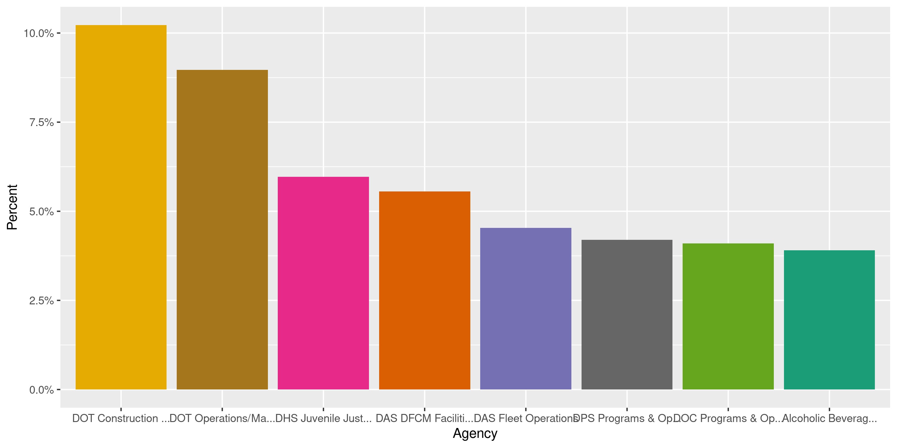
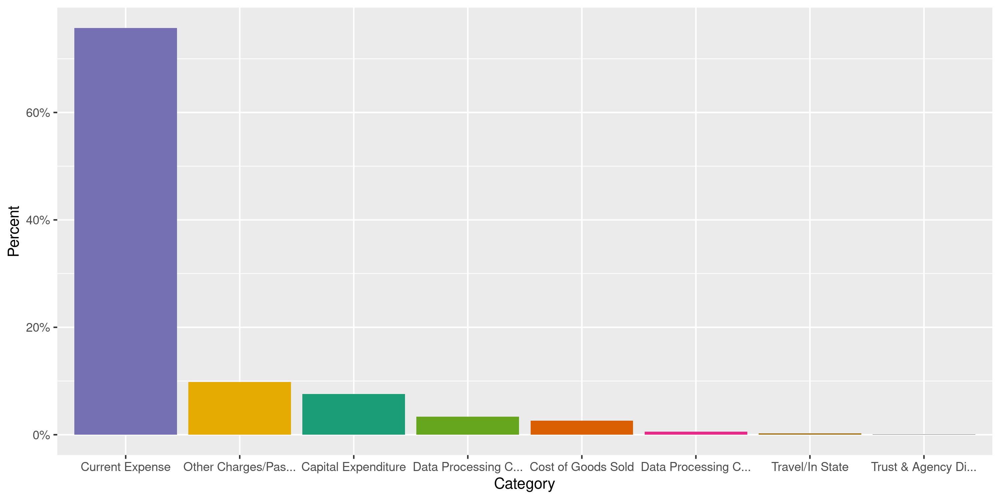
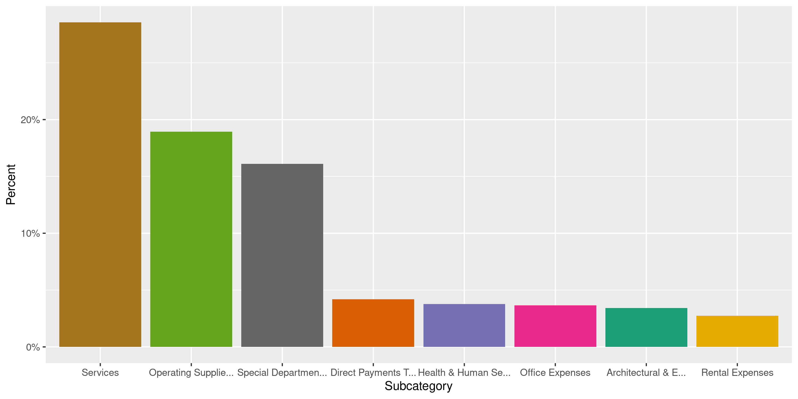
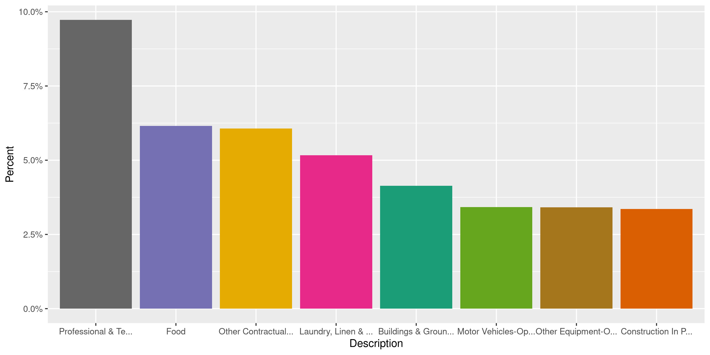
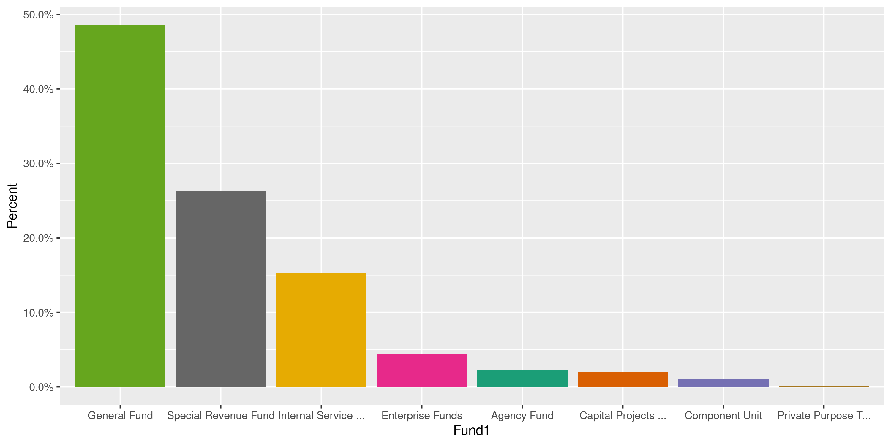
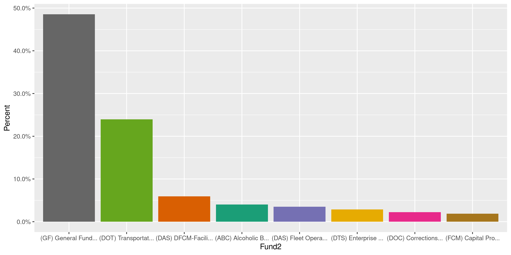
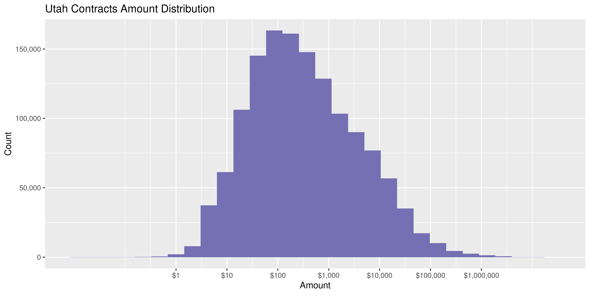
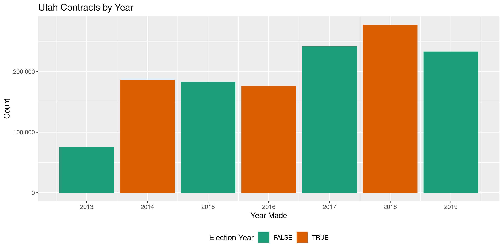

Utah Contracts
================
Kiernan Nicholls
2020-06-19 11:25:25

  - [Project](#project)
  - [Objectives](#objectives)
  - [Packages](#packages)
  - [Data](#data)
  - [Read](#read)
  - [Explore](#explore)
  - [Wrangle](#wrangle)
  - [Conclude](#conclude)
  - [Export](#export)
  - [Upload](#upload)
  - [Dictionary](#dictionary)

<!-- Place comments regarding knitting here -->

## Project

The Accountability Project is an effort to cut across data silos and
give journalists, policy professionals, activists, and the public at
large a simple way to search across huge volumes of public data about
people and organizations.

Our goal is to standardizing public data on a few key fields by thinking
of each dataset row as a transaction. For each transaction there should
be (at least) 3 variables:

1.  All **parties** to a transaction.
2.  The **date** of the transaction.
3.  The **amount** of money involved.

## Objectives

This document describes the process used to complete the following
objectives:

1.  How many records are in the database?
2.  Check for entirely duplicated records.
3.  Check ranges of continuous variables.
4.  Is there anything blank or missing?
5.  Check for consistency issues.
6.  Create a five-digit ZIP Code called `zip`.
7.  Create a `year` field from the transaction date.
8.  Make sure there is data on both parties to a transaction.

## Packages

The following packages are needed to collect, manipulate, visualize,
analyze, and communicate these results. The `pacman` package will
facilitate their installation and attachment.

The IRW’s `campfin` package will also have to be installed from GitHub.
This package contains functions custom made to help facilitate the
processing of campaign finance data.

``` r
if (!require("pacman")) install.packages("pacman")
pacman::p_load_gh("irworkshop/campfin")
pacman::p_load(
  tidyverse, # data manipulation
  lubridate, # datetime strings
  gluedown, # printing markdown
  magrittr, # pipe operators
  janitor, # clean data frames
  refinr, # cluster and merge
  scales, # format strings
  knitr, # knit documents
  vroom, # read files fast
  rvest, # html scraping
  glue, # combine strings
  here, # relative paths
  httr, # http requests
  fs # local storage 
)
```

This document should be run as part of the `R_campfin` project, which
lives as a sub-directory of the more general, language-agnostic
[`irworkshop/accountability_datacleaning`](https://github.com/irworkshop/accountability_datacleaning)
GitHub repository.

The `R_campfin` project uses the [RStudio
projects](https://support.rstudio.com/hc/en-us/articles/200526207-Using-Projects)
feature and should be run as such. The project also uses the dynamic
`here::here()` tool for file paths relative to *your* machine.

``` r
# where does this document knit?
here::here()
#> [1] "/home/kiernan/Code/accountability_datacleaning/R_campfin"
```

## Data

Contracts data can be obtained from the State of Utah [Division of
Purchasing and General Services](https://purchasing.utah.gov/) via the
state’s [Open Data portal](https://opendata.utah.gov). The file was
originally uploaded September 12, 2018 and last updated on December
15,  
2019\. The Open Data [data
file](https://opendata.utah.gov/dataset/Latest-6-Years/545s-5tnq) has
the cryptic title “Latest 6 Years” and no additional metadata.

After contacting the Division of Purchasing, it was explained that this
file actually contains almost all payments made by the state accounting
system, including biweekly payroll, jury duty compensation, etc.

## Read

The data file is large and must be downloaded before it can be read.

``` r
raw_dir <- dir_create(here("ut", "contracts", "data", "raw"))
raw_url <- "https://opendata.utah.gov/api/views/545s-5tnq/rows.tsv"
raw_path <- path(raw_dir, basename(raw_url))
```

``` r
if (!file_exists(raw_path)) {
  download.file(
    url = raw_url,
    destfile = raw_path
  )
}
file_size(raw_path)
#> 10.1G
```

Then the file can be read as a single, large data frame with
`vroom::vroom()`.

``` r
utc <- vroom(
  file = raw_path,
  delim = "\t",
  na = c("Not Applicable", "Not Provided", "NA", ""),
  .name_repair = make_clean_names,
  col_types = cols(
    .default = col_character(),
    FISCAL_PERIOD = col_integer(),
    CALC_posting_date = col_date("%m/%d/%Y %H:%M:%S %p"),
    CALC_FISCAL_PERIOD_DATE = col_date("%m/%d/%Y %H:%M:%S %p"),
    CALC_amount = col_double(),
    fiscal_year = col_integer(),
    type = col_integer()
  )
)
```

After reading the entire file, we can filter out any records not
directly related to contracts using the `contract_name` and
`vendor_name` values. After this filter, most rows are removed and we
are left only with valid contracts, most of which have a `vendor_name`.

``` r
nrow(utc)
#> [1] 29160793
utc <- filter(utc, !is.na(contract_name))
count(utc, vendor_name, sort = TRUE)
#> # A tibble: 8,115 x 2
#>    vendor_name                        n
#>    <chr>                          <int>
#>  1 NICHOLAS  &  COMPANY           55952
#>  2 W W GRAINGER INC               44336
#>  3 OFFICE DEPOT BSD INC           38577
#>  4 WCEC ENGINEERS INC             34909
#>  5 <NA>                           32168
#>  6 Superior Service Transport Inc 29528
#>  7 SKAGGS COMPANIES INC           21925
#>  8 ENTERPRISE RENT A CAR          20166
#>  9 VERIZON WIRELESS               20118
#> 10 G & K SERVICES INC             18345
#> # … with 8,105 more rows
nrow(utc)
#> [1] 1373119
```

## Explore

``` r
glimpse(utc)
#> Rows: 1,373,119
#> Columns: 21
#> $ id              <chr> "556564211", "556564213", "556564304", "556564306", "556564312", "556564…
#> $ date            <date> 2017-05-04, 2017-05-04, 2017-05-04, 2017-05-04, 2017-05-04, 2017-05-04,…
#> $ amount          <dbl> 9.82, 135.18, 836.09, 11513.91, 13.38, 560.00, 7718.49, 183.97, 7178.61,…
#> $ fiscal_period   <int> 11, 11, 11, 11, 11, 11, 11, 11, 11, 11, 11, 11, 11, 11, 11, 11, 11, 11, …
#> $ batch_id        <chr> "45586", "45586", "45586", "45586", "45586", "45586", "45586", "45586", …
#> $ fiscal_year     <int> 2017, 2017, 2017, 2017, 2017, 2017, 2017, 2017, 2017, 2017, 2017, 2017, …
#> $ entity_trans_id <chr> "PRC810176500000000599-1111", "PRC810176500000000599-1111", "PRC81017650…
#> $ description     <chr> "Traffic Management Systems", "Traffic Management Systems", "Traffic Man…
#> $ ref_id          <chr> "DO810170411000015602-111", "DO810170411000015602-111", "DO8101704030000…
#> $ type            <int> 1, 1, 1, 1, 1, 1, 1, 1, 1, 1, 1, 1, 1, 1, 1, 1, 1, 1, 1, 1, 1, 1, 1, 1, …
#> $ contract_name   <chr> "810; Wesco", "810; Wesco", "To Provide 336 Trafic Control Cabinets & Co…
#> $ contract_number <chr> "139505", "139505", "139687", "139687", "MA142", "149554", "MA1822", "MA…
#> $ department      <chr> "Dept of Transportation", "Dept of Transportation", "Dept of Transportat…
#> $ agency          <chr> "DOT Construction Management", "DOT Construction Management", "DOT Const…
#> $ division        <chr> "DOT Federal Construction - New", "DOT Federal Construction - New", "DOT…
#> $ category        <chr> "Capital Expenditure", "Capital Expenditure", "Capital Expenditure", "Ca…
#> $ subcategory     <chr> "Infrastructures", "Infrastructures", "Infrastructures", "Infrastructure…
#> $ fund1           <chr> "Special Revenue Fund", "Special Revenue Fund", "Special Revenue Fund", …
#> $ fund2           <chr> "(DOT) Transportation Fund Unrestricted", "(DOT) Transportation Fund Unr…
#> $ vendor_id       <chr> "507591", "507591", "475297", "475297", "376773", "672731", "452727", "4…
#> $ vendor_name     <chr> "WESCO DISTRIBUTION INC", "WESCO DISTRIBUTION INC", "ECONOLITE CONTROL P…
tail(utc)
#> # A tibble: 6 x 21
#>   id    date       amount fiscal_period batch_id fiscal_year entity_trans_id description ref_id
#>   <chr> <date>      <dbl>         <int> <chr>          <int> <chr>           <chr>       <chr> 
#> 1 5565… 2017-05-04 2.34e2            11 45586           2017 PRC41017000000… Clothing &… DO410…
#> 2 5565… 2017-05-04 7.00e1            11 45586           2017 PRC41017000000… Clothing &… DO410…
#> 3 5565… 2017-05-04 3.24e5            11 45586           2017 PRC55017000000… Infrastruc… -00   
#> 4 5565… 2017-05-04 2.01e2            11 45586           2017 PRC81017650000… Traffic Ma… DO810…
#> 5 5565… 2017-05-04 2.77e3            11 45586           2017 PRC81017650000… Traffic Ma… DO810…
#> 6 5565… 2017-05-04 1.25e2            11 45586           2017 PRC41017000000… Clothing &… DO410…
#> # … with 12 more variables: type <int>, contract_name <chr>, contract_number <chr>,
#> #   department <chr>, agency <chr>, division <chr>, category <chr>, subcategory <chr>,
#> #   fund1 <chr>, fund2 <chr>, vendor_id <chr>, vendor_name <chr>
```

### Missing

After this filter, we are left with very few records missing any key
values.

``` r
col_stats(utc, count_na)
#> # A tibble: 21 x 4
#>    col             class      n      p
#>    <chr>           <chr>  <int>  <dbl>
#>  1 id              <chr>      0 0     
#>  2 date            <date>     0 0     
#>  3 amount          <dbl>      0 0     
#>  4 fiscal_period   <int>      0 0     
#>  5 batch_id        <chr>      0 0     
#>  6 fiscal_year     <int>      0 0     
#>  7 entity_trans_id <chr>      0 0     
#>  8 description     <chr>      0 0     
#>  9 ref_id          <chr>  88261 0.0643
#> 10 type            <int>      0 0     
#> 11 contract_name   <chr>      0 0     
#> 12 contract_number <chr>      0 0     
#> 13 department      <chr>      0 0     
#> 14 agency          <chr>      0 0     
#> 15 division        <chr>      0 0     
#> 16 category        <chr>      0 0     
#> 17 subcategory     <chr>      0 0     
#> 18 fund1           <chr>      0 0     
#> 19 fund2           <chr>      0 0     
#> 20 vendor_id       <chr>      0 0     
#> 21 vendor_name     <chr>  32168 0.0234
```

### Duplicates

Flagging duplicates in a file this size requires breaking the data frame
into chunks and writing the duplicate rows to a local file.

``` r
dupe_file <- file_temp(ext = "txt")
n <- 1e5 # rows per chunk
nr <- nrow(utc)
# split file into chunks
uts <- utc %>% 
  select(-ends_with("id")) %>% 
  split(rep(1:ceiling(nr/n), each = n, length.out = nr))
pb <- txtProgressBar(0, length(uts), style = 3)
#>   |                                                                                                 |                                                                                         |   0%
for (i in seq_along(uts)) {
  # check dupes from both ends
  d <- as.integer(duplicated(uts[[i]], fromLast = TRUE))
  # append to disk
  write_lines(d, dupe_file, append = TRUE)
  uts[[i]] <- NA
  setTxtProgressBar(pb, i)
  Sys.sleep(10)
  flush_memory()
}
#>   |                                                                                                 |======                                                                                   |   7%  |                                                                                                 |=============                                                                            |  14%  |                                                                                                 |===================                                                                      |  21%  |                                                                                                 |=========================                                                                |  29%  |                                                                                                 |================================                                                         |  36%  |                                                                                                 |======================================                                                   |  43%  |                                                                                                 |============================================                                             |  50%  |                                                                                                 |===================================================                                      |  57%  |                                                                                                 |=========================================================                                |  64%  |                                                                                                 |================================================================                         |  71%  |                                                                                                 |======================================================================                   |  79%  |                                                                                                 |============================================================================             |  86%  |                                                                                                 |===================================================================================      |  93%  |                                                                                                 |=========================================================================================| 100%
rm(uts)
```

This local file can be read, checked, and added as a new variable if
needed.

``` r
dupes <- as.logical(as.integer(read_lines(dupe_file)))
percent(mean(dupes), 0.1)
#> [1] "13.8%"
utc <- mutate(utc, dupe_flag = dupes)
utc %>% 
  filter(dupe_flag) %>% 
  select(id, date, agency, amount, vendor_name) %>% 
  arrange(date)
#> # A tibble: 189,189 x 5
#>    id       date       agency                            amount vendor_name                        
#>    <chr>    <date>     <chr>                              <dbl> <chr>                              
#>  1 2242711… 2013-07-01 DOH Executive Director             6873. R & R INDUSTRIAL PARK LC           
#>  2 2242716… 2013-07-01 DOH Executive Director             6873. R & R INDUSTRIAL PARK LC           
#>  3 2242716… 2013-07-01 DOH Executive Director             6873. R & R INDUSTRIAL PARK LC           
#>  4 2242711… 2013-07-01 DOH Executive Director             6873. R & R INDUSTRIAL PARK LC           
#>  5 2242716… 2013-07-01 DOH Executive Director             6873. R & R INDUSTRIAL PARK LC           
#>  6 2242776… 2013-07-02 DNR DWR Cooperative Environment…   2000. BUREAU OF LAND MANAGEMENT ATTN STA…
#>  7 2242713… 2013-07-08 DOH Medicaid Mandatory Services    1800  CADURX INC                         
#>  8 2242839… 2013-07-09 DPS Driver License Division        2609. WORTHINGTON LEAVITT INVESTMENT LLC 
#>  9 2242895… 2013-07-10 DAS Risk Management              126723. MORETON & COMPANY                  
#> 10 2242895… 2013-07-10 DAS Risk Management               37500  MORETON & COMPANY                  
#> # … with 189,179 more rows
rm(dupes)
```

A fairly significant amount of these rows are seemingly duplicated at
least once across every (non-id) variable.

### Categorical

There are a handful of categorical values who’s distribution can be
explored.

``` r
col_stats(utc, n_distinct)
#> # A tibble: 22 x 4
#>    col             class        n           p
#>    <chr>           <chr>    <int>       <dbl>
#>  1 id              <chr>  1373119 1          
#>  2 date            <date>    1741 0.00127    
#>  3 amount          <dbl>   344168 0.251      
#>  4 fiscal_period   <int>       13 0.00000947 
#>  5 batch_id        <chr>       92 0.0000670  
#>  6 fiscal_year     <int>        7 0.00000510 
#>  7 entity_trans_id <chr>  1303205 0.949      
#>  8 description     <chr>      371 0.000270   
#>  9 ref_id          <chr>   193004 0.141      
#> 10 type            <int>        1 0.000000728
#> 11 contract_name   <chr>    39846 0.0290     
#> 12 contract_number <chr>    33742 0.0246     
#> 13 department      <chr>       39 0.0000284  
#> 14 agency          <chr>      243 0.000177   
#> 15 division        <chr>      848 0.000618   
#> 16 category        <chr>       10 0.00000728 
#> 17 subcategory     <chr>       43 0.0000313  
#> 18 fund1           <chr>        8 0.00000583 
#> 19 fund2           <chr>      111 0.0000808  
#> 20 vendor_id       <chr>    10101 0.00736    
#> 21 vendor_name     <chr>     8115 0.00591    
#> 22 dupe_flag       <lgl>        2 0.00000146
```

<!-- --><!-- --><!-- --><!-- --><!-- --><!-- --><!-- -->

### Amounts

We should also check the distribution of contract `amount` values.

``` r
noquote(map_chr(summary(utc$amount), dollar))
#>        Min.     1st Qu.      Median        Mean     3rd Qu.        Max. 
#> -$7,181,703      $50.97     $244.47   $9,509.14   $1,671.20 $21,500,000
```

A significant amount of the `amount` values are negative.

``` r
percent(mean(utc$amount < 0), 0.1)
#> [1] "0.9%"
```

Most of the negative values are from purchasing cards. Negative values
sometimes represent corrections or deletions. We will leave them as-is.

``` r
utc %>% 
  filter(amount < 0) %>%
  count(description, sort = TRUE) %>% 
  add_prop()
#> # A tibble: 157 x 3
#>    description                                                   n      p
#>    <chr>                                                     <int>  <dbl>
#>  1 Motor Vehicles-Operating Supplies, Maintenance & Repairs   2050 0.167 
#>  2 Other Equipment-Operating Supplies, Maintenance & Repairs  1132 0.0921
#>  3 Buildings & Grounds-Operating Supplies, Maint & Repairs     948 0.0771
#>  4 Rental of Equipment-Except Data Processing & Photocopy      782 0.0636
#>  5 Food                                                        692 0.0563
#>  6 Office Supplies                                             685 0.0557
#>  7 Internal Service Fund-Unchanged Merchandise for Resale      618 0.0503
#>  8 Laundry, Linen & Dry Cleaning Services                      419 0.0341
#>  9 Clothing & Uniforms                                         407 0.0331
#> 10 Wireless Communication Service                              406 0.0330
#> # … with 147 more rows
```

The amounts are logarithmically-normally distributed with reasonable
ranges.

<!-- -->

Here are the smallest and largest contracts:

``` r
glimpse(utc[which.max(utc$amount), ])
#> Rows: 1
#> Columns: 22
#> $ id              <chr> "493281065"
#> $ date            <date> 2016-06-30
#> $ amount          <dbl> 21500000
#> $ fiscal_period   <int> 12
#> $ batch_id        <chr> "38473"
#> $ fiscal_year     <int> 2016
#> $ entity_trans_id <chr> "PRC063690000000000298-1111"
#> $ description     <chr> "Special Grants"
#> $ ref_id          <chr> "-00"
#> $ type            <int> 1
#> $ contract_name   <chr> "063 LEGISLATURE APPROVAL BLDG HAFB PERSONNELMIDA"
#> $ contract_number <chr> "161806"
#> $ department      <chr> "Governor's Office of Economic Development"
#> $ agency          <chr> "GOV ED Pass Through"
#> $ division        <chr> "GOV ED Pass Through"
#> $ category        <chr> "Other Charges/Pass Through"
#> $ subcategory     <chr> "Direct Payments To Other Government Units"
#> $ fund1           <chr> "General Fund"
#> $ fund2           <chr> "(GF) General Fund Unrestricted"
#> $ vendor_id       <chr> "519033"
#> $ vendor_name     <chr> "MILITARY INSTALLATION DEVELOPMENT AUTHORITY"
#> $ dupe_flag       <lgl> FALSE
glimpse(utc[which.min(utc$amount), ])
#> Rows: 1
#> Columns: 22
#> $ id              <chr> "593531977"
#> $ date            <date> 2018-02-27
#> $ amount          <dbl> -7181703
#> $ fiscal_period   <int> 8
#> $ batch_id        <chr> "50234"
#> $ fiscal_year     <int> 2018
#> $ entity_trans_id <chr> "PRC400185000000001234-1111"
#> $ description     <chr> "Professional & Technical Services-Non-medical"
#> $ ref_id          <chr> "-10"
#> $ type            <int> 1
#> $ contract_name   <chr> "400   Waterford Institute, Inc.   (Amd #9)"
#> $ contract_number <chr> "096300"
#> $ department      <chr> "Utah State Board of Education"
#> $ agency          <chr> "PED Initiative Programs"
#> $ division        <chr> "PED Upstart Early Childhood Education"
#> $ category        <chr> "Current Expense"
#> $ subcategory     <chr> "Services"
#> $ fund1           <chr> "Special Revenue Fund"
#> $ fund2           <chr> "(PED) Education Fund"
#> $ vendor_id       <chr> "476065"
#> $ vendor_name     <chr> "Waterford Institute, Inc."
#> $ dupe_flag       <lgl> FALSE
```

### Dates

We can add the calendar year from `date` with `lubridate::year()`

``` r
utc <- mutate(utc, year = year(date))
```

The date range is very clean.

``` r
min(utc$date)
#> [1] "2013-07-01"
sum(utc$year < 2013)
#> [1] 0
max(utc$date)
#> [1] "2019-11-05"
sum(utc$date > today())
#> [1] 0
```

The number of contracts/payments per year is very consistent.

<!-- -->

## Wrangle

There are no geographic variables, but we can manually add “UT” for all
state agencies.

``` r
utc <- mutate(utc, state = "UT", .before = agency)
```

## Conclude

1.  There are 1,373,119 records in the database.
2.  There are 189,189 duplicate records in the database.
3.  The range and distribution of `amount` and `date` seem reasonable.
4.  There are 0 records missing key variables.
5.  There are no geographic variables to normalize, `state` was added.
6.  The 4-digit `year` variable has been created with
    `lubridate::year()`.

## Export

Now the file can be saved on disk for upload to the Accountability
server.

``` r
clean_dir <- dir_create(here("ut", "contracts", "data", "clean"))
clean_path <- path(clean_dir, "ut_contracts_clean.csv")
vroom_write(utc, clean_path, na = "", delim = ",")
file_size(clean_path)
#> 490M
file_encoding(clean_path)
#> # A tibble: 1 x 3
#>   path                                                                        mime          charset
#>   <fs::path>                                                                  <chr>         <chr>  
#> 1 /home/kiernan/Code/accountability_datacleaning/R_campfin/ut/contracts/data… application/… us-asc…
```

## Upload

Using the [duckr](https://github.com/kiernann/duckr) R package, we can
wrap around the [duck](https://duck.sh/) command line tool to upload the
file to the IRW server.

``` r
# remotes::install_github("kiernann/duckr")
s3_dir <- "s3:/publicaccountability/csv/"
s3_path <- path(s3_dir, basename(clean_path))
if (require(duckr)) {
  duckr::duck_upload(clean_path, s3_path)
}
```

## Dictionary

The following table describes the variables in our final exported file:

|Column            |Type        |Definition                               |
|:-----------------|:-----------|:----------------------------------------|
|`id`              |`double`    |Unique contract/payment ID               |
|`date`            |`double`    |Date contract posted                     |
|`amount`          |`double`    |Contrat paid out amount                  |
|`fiscal_period`   |`double`    |Fiscal period (month)                    |
|`batch_id`        |`double`    |Fiscal batch order                       |
|`fiscal_year`     |`double`    |Fiscal year ordered                      |
|`entity_trans_id` |`character` |Semi-unique transaction ID               |
|`description`     |`character` |Transasction description                 |
|`ref_id`          |`character` |Reference ID                             |
|`type`            |`double`    |Contract type (all 1)                    |
|`contract_name`   |`character` |Contract name                            |
|`contract_number` |`character` |Contract number                          |
|`department`      |`character` |Spending department (`org1`)             |
|`state`           |`character` |Spending state (all UT)                  |
|`agency`          |`character` |Spending agency (`org2`)                 |
|`division`        |`character` |Spending division/use (`org3`)           |
|`category`        |`character` |Contract category (`cat1`)               |
|`subcategory`     |`character` |Contract subcategory (`cat2`)            |
|`fund1`           |`character` |Contract fund source (`fund1`)           |
|`fund2`           |`character` |Contract fund secondary source (`fund2`) |
|`vendor_id`       |`double`    |Unique vendor ID                         |
|`vendor_name`     |`character` |Vendor name                              |
|`dupe_flag`       |`logical`   |Flag indicating duplicate record         |
|`year`            |`double`    |Calendar year spent                      |
