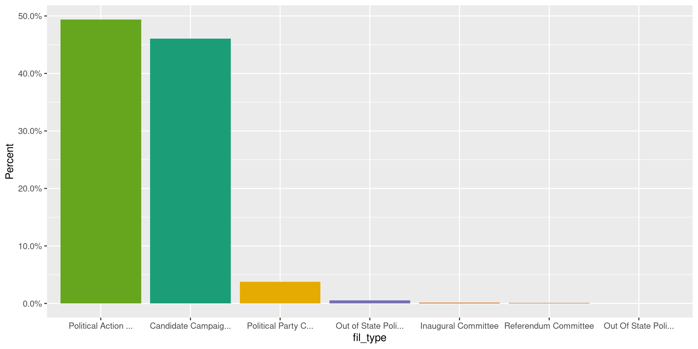

Virginia Contributions
================
Kiernan Nicholls
2020-10-19 14:03:43

  - [Project](#project)
  - [Objectives](#objectives)
  - [Packages](#packages)
  - [Data](#data)
  - [Download](#download)
  - [Read](#read)
  - [Join](#join)
  - [Explore](#explore)
  - [Missing](#missing)
  - [Wrangle](#wrangle)
  - [Conclude](#conclude)
  - [Export](#export)
  - [Upload](#upload)
  - [Dictionary](#dictionary)

<!-- Place comments regarding knitting here -->

## Project

The Accountability Project is an effort to cut across data silos and
give journalists, policy professionals, activists, and the public at
large a simple way to search across huge volumes of public data about
people and organizations.

Our goal is to standardizing public data on a few key fields by thinking
of each dataset row as a transaction. For each transaction there should
be (at least) 3 variables:

1.  All **parties** to a transaction.
2.  The **date** of the transaction.
3.  The **amount** of money involved.

## Objectives

This document describes the process used to complete the following
objectives:

1.  How many records are in the database?
2.  Check for entirely duplicated records.
3.  Check ranges of continuous variables.
4.  Is there anything blank or missing?
5.  Check for consistency issues.
6.  Create a five-digit ZIP Code called `zip`.
7.  Create a `year` field from the transaction date.
8.  Make sure there is data on both parties to a transaction.

## Packages

The following packages are needed to collect, manipulate, visualize,
analyze, and communicate these results. The `pacman` package will
facilitate their installation and attachment.

The IRW’s `campfin` package will also have to be installed from GitHub.
This package contains functions custom made to help facilitate the
processing of campaign finance data.

``` r
if (!require("pacman")) install.packages("pacman")
pacman::p_load_gh("irworkshop/campfin")
pacman::p_load(
  tidyverse, # data manipulation
  lubridate, # datetime strings
  gluedown, # print markdown
  magrittr, # pipe operators
  janitor, # dataframe clean
  refinr, # cluster and merge
  aws.s3, # aws cloud storage
  scales, # format strings
  knitr, # knit documents
  vroom, # read files fast
  rvest, # read html pages
  glue, # combine strings
  here, # relative storage
  fs # search storage 
)
```

This document should be run as part of the `R_campfin` project, which
lives as a sub-directory of the more general, language-agnostic
[`irworkshop/accountability_datacleaning`](https://github.com/irworkshop/accountability_datacleaning)
GitHub repository.

The `R_campfin` project uses the [RStudio
projects](https://support.rstudio.com/hc/en-us/articles/200526207-Using-Projects)
feature and should be run as such. The project also uses the dynamic
`here::here()` tool for file paths relative to *your* machine.

``` r
# where does this document knit?
here::here()
#> [1] "/home/kiernan/Code/tap/R_campfin"
```

## Data

Data is obtained from the Virginia [Department of Elections
(DOE)](https://www.elections.virginia.gov/index.html) State Board of
Elections (SBE).

> The State Board of Elections is the regulatory board for the
> Department of Elections. It is authorized to prescribe standard forms
> for voter registration and elections, and to supervise, coordinate,
> and adopt regulations governing the work of local electoral boards,
> registrars, and officers of election.

The SBE has candidates and committees file ten types of reports:

| Schedule                      | Description                                                                    |
| :---------------------------- | :----------------------------------------------------------------------------- |
| Schedule A                    | Direct Contributions over $100 Use to report contributions exceeding $100. S…  |
| Schedule B                    | In-Kind Contributions over $100 Use to report contributions of services rend…  |
| Schedule C                    | Rebates, Refunds and Interest Use to report receipts of refunds, rebates int…  |
| Schedule D                    | Itemization of Expenditures Use to report all expenditures incurred by a co…   |
| Schedule E                    | Itemization of Loans Use to report the itemization of all loans received and…  |
| Schedule F                    | Debts Remaining Unpaid Use to itemize any outstanding debt that remains outs…  |
| Schedule G                    | Statement of Funds Contributions, receipts, expenditures and loans that have…  |
| Schedule H                    | Summary of Receipts and Disbursements Contributions, receipts, expenditures …  |
| Schedule I                    | Surplus Funds Paid Out Use to report the disposition of surplus funds.Sched…   |
| Designated Expenditure Report | For each designated contribution received by the campaign committee from a po… |

We are interested in schedule’s A and B.

## Download

The data itself is hosted on an SBE server and organized in monthly
directories.

``` r
sbe_url <- "https://apps.elections.virginia.gov/SBE_CSV/CF/"
sbe_list <- read_html(sbe_url)
```

|datetime            |dir                                                               |
|:-------------------|:-----------------------------------------------------------------|
|2017-06-27 13:47:00 |[2012_03](https://apps.elections.virginia.gov/SBE_CSV/CF/2012_03) |
|2017-06-27 13:47:00 |[2012_04](https://apps.elections.virginia.gov/SBE_CSV/CF/2012_04) |
|2017-06-27 13:47:00 |[2012_05](https://apps.elections.virginia.gov/SBE_CSV/CF/2012_05) |
|2017-06-27 13:47:00 |[2012_06](https://apps.elections.virginia.gov/SBE_CSV/CF/2012_06) |
|2017-06-27 13:47:00 |[2012_07](https://apps.elections.virginia.gov/SBE_CSV/CF/2012_07) |
|2017-06-27 13:47:00 |[2012_08](https://apps.elections.virginia.gov/SBE_CSV/CF/2012_08) |
|2017-06-27 13:47:00 |[2012_09](https://apps.elections.virginia.gov/SBE_CSV/CF/2012_09) |
|2017-06-27 13:47:00 |[2012_10](https://apps.elections.virginia.gov/SBE_CSV/CF/2012_10) |
|2017-06-27 13:47:00 |[2012_11](https://apps.elections.virginia.gov/SBE_CSV/CF/2012_11) |
|2017-06-27 13:47:00 |[2012_12](https://apps.elections.virginia.gov/SBE_CSV/CF/2012_12) |
|2017-06-27 13:47:00 |[2013_01](https://apps.elections.virginia.gov/SBE_CSV/CF/2013_01) |
|2017-06-27 13:47:00 |[2013_02](https://apps.elections.virginia.gov/SBE_CSV/CF/2013_02) |
|2017-06-27 13:47:00 |[2013_03](https://apps.elections.virginia.gov/SBE_CSV/CF/2013_03) |
|2017-06-27 13:47:00 |[2013_04](https://apps.elections.virginia.gov/SBE_CSV/CF/2013_04) |
|2017-06-27 13:47:00 |[2013_05](https://apps.elections.virginia.gov/SBE_CSV/CF/2013_05) |
|2017-06-27 13:47:00 |[2013_06](https://apps.elections.virginia.gov/SBE_CSV/CF/2013_06) |
|2017-06-27 13:47:00 |[2013_07](https://apps.elections.virginia.gov/SBE_CSV/CF/2013_07) |
|2017-06-27 13:47:00 |[2013_08](https://apps.elections.virginia.gov/SBE_CSV/CF/2013_08) |
|2017-06-27 13:47:00 |[2013_09](https://apps.elections.virginia.gov/SBE_CSV/CF/2013_09) |
|2017-06-27 13:47:00 |[2013_10](https://apps.elections.virginia.gov/SBE_CSV/CF/2013_10) |
|2017-06-27 13:47:00 |[2013_11](https://apps.elections.virginia.gov/SBE_CSV/CF/2013_11) |
|2017-06-27 13:47:00 |[2013_12](https://apps.elections.virginia.gov/SBE_CSV/CF/2013_12) |
|2017-06-27 13:47:00 |[2014_01](https://apps.elections.virginia.gov/SBE_CSV/CF/2014_01) |
|2017-06-27 13:47:00 |[2014_02](https://apps.elections.virginia.gov/SBE_CSV/CF/2014_02) |
|2017-06-27 13:47:00 |[2014_03](https://apps.elections.virginia.gov/SBE_CSV/CF/2014_03) |
|2017-06-27 13:47:00 |[2014_04](https://apps.elections.virginia.gov/SBE_CSV/CF/2014_04) |
|2017-06-27 13:47:00 |[2014_05](https://apps.elections.virginia.gov/SBE_CSV/CF/2014_05) |
|2017-06-27 13:47:00 |[2014_06](https://apps.elections.virginia.gov/SBE_CSV/CF/2014_06) |
|2017-06-27 13:47:00 |[2014_07](https://apps.elections.virginia.gov/SBE_CSV/CF/2014_07) |
|2017-06-27 13:47:00 |[2014_08](https://apps.elections.virginia.gov/SBE_CSV/CF/2014_08) |
|2017-06-27 13:47:00 |[2014_09](https://apps.elections.virginia.gov/SBE_CSV/CF/2014_09) |
|2017-06-27 13:47:00 |[2014_10](https://apps.elections.virginia.gov/SBE_CSV/CF/2014_10) |
|2017-06-27 13:47:00 |[2014_11](https://apps.elections.virginia.gov/SBE_CSV/CF/2014_11) |
|2017-06-27 13:47:00 |[2014_12](https://apps.elections.virginia.gov/SBE_CSV/CF/2014_12) |
|2017-06-27 13:47:00 |[2015_01](https://apps.elections.virginia.gov/SBE_CSV/CF/2015_01) |
|2017-06-27 13:47:00 |[2015_02](https://apps.elections.virginia.gov/SBE_CSV/CF/2015_02) |
|2017-06-27 13:47:00 |[2015_03](https://apps.elections.virginia.gov/SBE_CSV/CF/2015_03) |
|2017-06-27 13:47:00 |[2015_04](https://apps.elections.virginia.gov/SBE_CSV/CF/2015_04) |
|2017-06-27 13:47:00 |[2015_05](https://apps.elections.virginia.gov/SBE_CSV/CF/2015_05) |
|2017-06-27 13:47:00 |[2015_06](https://apps.elections.virginia.gov/SBE_CSV/CF/2015_06) |
|2017-06-27 13:47:00 |[2015_07](https://apps.elections.virginia.gov/SBE_CSV/CF/2015_07) |
|2017-06-27 13:46:00 |[2015_08](https://apps.elections.virginia.gov/SBE_CSV/CF/2015_08) |
|2017-06-27 13:46:00 |[2015_09](https://apps.elections.virginia.gov/SBE_CSV/CF/2015_09) |
|2017-06-27 13:46:00 |[2015_10](https://apps.elections.virginia.gov/SBE_CSV/CF/2015_10) |
|2017-06-27 13:46:00 |[2015_11](https://apps.elections.virginia.gov/SBE_CSV/CF/2015_11) |
|2017-06-27 13:46:00 |[2015_12](https://apps.elections.virginia.gov/SBE_CSV/CF/2015_12) |
|2017-06-27 13:46:00 |[2016_01](https://apps.elections.virginia.gov/SBE_CSV/CF/2016_01) |
|2017-06-27 13:46:00 |[2016_02](https://apps.elections.virginia.gov/SBE_CSV/CF/2016_02) |
|2017-06-27 13:46:00 |[2016_03](https://apps.elections.virginia.gov/SBE_CSV/CF/2016_03) |
|2017-06-27 13:47:00 |[2016_04](https://apps.elections.virginia.gov/SBE_CSV/CF/2016_04) |
|2017-06-27 13:47:00 |[2016_05](https://apps.elections.virginia.gov/SBE_CSV/CF/2016_05) |
|2017-06-27 13:47:00 |[2016_06](https://apps.elections.virginia.gov/SBE_CSV/CF/2016_06) |
|2017-06-27 13:46:00 |[2016_07](https://apps.elections.virginia.gov/SBE_CSV/CF/2016_07) |
|2017-06-27 13:46:00 |[2016_08](https://apps.elections.virginia.gov/SBE_CSV/CF/2016_08) |
|2017-06-27 13:46:00 |[2016_09](https://apps.elections.virginia.gov/SBE_CSV/CF/2016_09) |
|2017-06-27 13:46:00 |[2016_10](https://apps.elections.virginia.gov/SBE_CSV/CF/2016_10) |
|2017-06-27 13:46:00 |[2016_11](https://apps.elections.virginia.gov/SBE_CSV/CF/2016_11) |
|2017-06-27 13:46:00 |[2016_12](https://apps.elections.virginia.gov/SBE_CSV/CF/2016_12) |
|2017-06-27 13:46:00 |[2017_01](https://apps.elections.virginia.gov/SBE_CSV/CF/2017_01) |
|2017-06-27 13:46:00 |[2017_02](https://apps.elections.virginia.gov/SBE_CSV/CF/2017_02) |
|2017-06-27 13:46:00 |[2017_03](https://apps.elections.virginia.gov/SBE_CSV/CF/2017_03) |
|2017-06-27 13:46:00 |[2017_04](https://apps.elections.virginia.gov/SBE_CSV/CF/2017_04) |
|2017-06-27 13:46:00 |[2017_05](https://apps.elections.virginia.gov/SBE_CSV/CF/2017_05) |
|2017-06-27 13:46:00 |[2017_06](https://apps.elections.virginia.gov/SBE_CSV/CF/2017_06) |
|2017-07-04 00:07:00 |[2017_07](https://apps.elections.virginia.gov/SBE_CSV/CF/2017_07) |
|2017-08-01 17:17:00 |[2017_08](https://apps.elections.virginia.gov/SBE_CSV/CF/2017_08) |
|2017-09-16 09:07:00 |[2017_09](https://apps.elections.virginia.gov/SBE_CSV/CF/2017_09) |
|2017-10-01 17:24:00 |[2017_10](https://apps.elections.virginia.gov/SBE_CSV/CF/2017_10) |
|2017-11-01 17:19:00 |[2017_11](https://apps.elections.virginia.gov/SBE_CSV/CF/2017_11) |
|2017-12-01 18:21:00 |[2017_12](https://apps.elections.virginia.gov/SBE_CSV/CF/2017_12) |
|2018-01-01 18:33:00 |[2018_01](https://apps.elections.virginia.gov/SBE_CSV/CF/2018_01) |
|2018-02-01 18:15:00 |[2018_02](https://apps.elections.virginia.gov/SBE_CSV/CF/2018_02) |
|2018-03-02 01:06:00 |[2018_03](https://apps.elections.virginia.gov/SBE_CSV/CF/2018_03) |
|2018-04-01 17:15:00 |[2018_04](https://apps.elections.virginia.gov/SBE_CSV/CF/2018_04) |
|2018-05-01 17:16:00 |[2018_05](https://apps.elections.virginia.gov/SBE_CSV/CF/2018_05) |
|2018-06-01 17:15:00 |[2018_06](https://apps.elections.virginia.gov/SBE_CSV/CF/2018_06) |
|2018-07-01 17:16:00 |[2018_07](https://apps.elections.virginia.gov/SBE_CSV/CF/2018_07) |
|2018-08-01 17:16:00 |[2018_08](https://apps.elections.virginia.gov/SBE_CSV/CF/2018_08) |
|2018-09-01 17:16:00 |[2018_09](https://apps.elections.virginia.gov/SBE_CSV/CF/2018_09) |
|2018-10-01 17:16:00 |[2018_10](https://apps.elections.virginia.gov/SBE_CSV/CF/2018_10) |
|2018-11-01 17:15:00 |[2018_11](https://apps.elections.virginia.gov/SBE_CSV/CF/2018_11) |
|2018-12-01 18:15:00 |[2018_12](https://apps.elections.virginia.gov/SBE_CSV/CF/2018_12) |
|2019-01-01 18:15:00 |[2019_01](https://apps.elections.virginia.gov/SBE_CSV/CF/2019_01) |
|2019-02-01 18:15:00 |[2019_02](https://apps.elections.virginia.gov/SBE_CSV/CF/2019_02) |
|2019-03-01 18:16:00 |[2019_03](https://apps.elections.virginia.gov/SBE_CSV/CF/2019_03) |
|2019-04-01 17:15:00 |[2019_04](https://apps.elections.virginia.gov/SBE_CSV/CF/2019_04) |
|2019-05-01 17:15:00 |[2019_05](https://apps.elections.virginia.gov/SBE_CSV/CF/2019_05) |
|2019-06-01 17:15:00 |[2019_06](https://apps.elections.virginia.gov/SBE_CSV/CF/2019_06) |
|2019-07-09 10:30:00 |[2019_07](https://apps.elections.virginia.gov/SBE_CSV/CF/2019_07) |
|2019-08-01 17:15:00 |[2019_08](https://apps.elections.virginia.gov/SBE_CSV/CF/2019_08) |
|2019-09-01 17:15:00 |[2019_09](https://apps.elections.virginia.gov/SBE_CSV/CF/2019_09) |
|2019-10-01 17:15:00 |[2019_10](https://apps.elections.virginia.gov/SBE_CSV/CF/2019_10) |
|2019-11-01 17:15:00 |[2019_11](https://apps.elections.virginia.gov/SBE_CSV/CF/2019_11) |
|2019-12-01 18:15:00 |[2019_12](https://apps.elections.virginia.gov/SBE_CSV/CF/2019_12) |
|2020-01-01 18:15:00 |[2020_01](https://apps.elections.virginia.gov/SBE_CSV/CF/2020_01) |
|2020-02-01 18:15:00 |[2020_02](https://apps.elections.virginia.gov/SBE_CSV/CF/2020_02) |
|2020-03-02 18:15:00 |[2020_03](https://apps.elections.virginia.gov/SBE_CSV/CF/2020_03) |
|2020-04-01 17:15:00 |[2020_04](https://apps.elections.virginia.gov/SBE_CSV/CF/2020_04) |
|2020-05-01 17:15:00 |[2020_05](https://apps.elections.virginia.gov/SBE_CSV/CF/2020_05) |
|2020-06-01 17:15:00 |[2020_06](https://apps.elections.virginia.gov/SBE_CSV/CF/2020_06) |
|2020-07-01 17:15:00 |[2020_07](https://apps.elections.virginia.gov/SBE_CSV/CF/2020_07) |
|2020-08-01 17:15:00 |[2020_08](https://apps.elections.virginia.gov/SBE_CSV/CF/2020_08) |
|2020-09-01 17:15:00 |[2020_09](https://apps.elections.virginia.gov/SBE_CSV/CF/2020_09) |
|2020-10-01 17:15:00 |[2020_10](https://apps.elections.virginia.gov/SBE_CSV/CF/2020_10) |

From this list of directories, we can extract each `<href>` HTML tag.
These tags provide the directory names.

``` r
raw_dir <- dir_create(here("va", "contribs", "data", "raw"))
sbe_base <- "https://apps.elections.virginia.gov"
sbe_dirs <- sbe_list %>% 
  html_nodes("a") %>% 
  html_attr("href") %>% 
  str_subset("\\d_")
```

    #> * `/SBE_CSV/CF/2020_05/`
    #> * `/SBE_CSV/CF/2020_06/`
    #> * `/SBE_CSV/CF/2020_07/`
    #> * `/SBE_CSV/CF/2020_08/`
    #> * `/SBE_CSV/CF/2020_09/`
    #> * `/SBE_CSV/CF/2020_10/`

Then we can navigate to each of these directories and look for file
names containing “ScheduleA” or “ScheduleB” (these file names are
somewhat inconsistent).

We also want all of the `Report.csv` files for each month, these files
contain the information on the reports filed by the committees which
contains the contributions.

``` r
sbe_names <- character()
for (dir in sbe_dirs) {
  sbe_names <- sbe_base %>% 
    str_c(dir) %>% 
    read_html() %>% 
    html_nodes("a") %>% 
    html_attr("href") %>% 
    str_subset("(Schedule(A|B))|Report") %>% 
    append(sbe_names)
}
```

    #> * `/SBE_CSV/CF/2012_04/Report.csv`
    #> * `/SBE_CSV/CF/2012_04/ScheduleA.csv`
    #> * `/SBE_CSV/CF/2012_04/ScheduleB.csv`
    #> * `/SBE_CSV/CF/2012_03/Report.csv`
    #> * `/SBE_CSV/CF/2012_03/ScheduleA.csv`
    #> * `/SBE_CSV/CF/2012_03/ScheduleB.csv`

Using these server paths, we can build local paths to save each file to.

``` r
raw_urls <- str_c(sbe_base, sbe_names)
raw_names <- basename(str_replace(raw_urls, "/(?=[^/]*$)", "_"))
raw_paths <- path(raw_dir, raw_names)
```

    #> * `/va/contribs/data/raw/2012_04_Report.csv`
    #> * `/va/contribs/data/raw/2012_04_ScheduleA.csv`
    #> * `/va/contribs/data/raw/2012_04_ScheduleB.csv`
    #> * `/va/contribs/data/raw/2012_03_Report.csv`
    #> * `/va/contribs/data/raw/2012_03_ScheduleA.csv`
    #> * `/va/contribs/data/raw/2012_03_ScheduleB.csv`

If these paths don’t already exist, we can download them now. Each file
needs to be read so that erroneous double quotations can be removed
using regular expressions.

``` r
for (i in seq_along(raw_urls)) {
  if (file_exists(raw_paths[i])) {
    next("file already downloaded")
  } else {
    download.file(raw_urls[i], raw_paths[i])
    x <- read_lines(raw_paths[i])
    if (str_starts(x[1], "#")) {
      next("file already fixed")
    } else {
      x <- str_replace_all(x, "(?<!^|,|\r\n)\"(?!,|\r\n|$)", "'")
      x <- c("### file fixed", x)
      write_lines(x, raw_paths[i])
    }
  }
}
```

## Read

We can now read all of the schedule A and B files into a single
dataframe.

``` r
sched_paths <- str_subset(raw_paths, "Schedule")
```

``` r
vac <- map_df(
  .x = sched_paths,
  .f = read_delim,
  .id = "source_file",
  delim = ",",
  comment = "###",
  escape_backslash = FALSE, 
  escape_double = FALSE,
  col_types = cols(
    .default = col_character(),
    IsIndividual = col_logical(),
    TransactionDate = col_character(),
    Amount = col_double(),
    TotalToDate = col_double()
  )
)
```

We can also identify the source file for each record.

``` r
vac$source_file <- basename(sched_paths[as.integer(vac$source_file)])
vac <- relocate(vac, source_file, .after = last_col())
```

The `date` column is a mix of `%m/%d/%Y` and `%Y-%m-%d` formats.

``` r
vac_mdy <- str_which(vac$date, "^\\d{2}/")
vac$date[vac_mdy] <- as.character(mdy(vac$date[vac_mdy]))
vac$date <- parse_datetime(vac$date)
```

Each contribution has a unique ID number for either schedule A or B. We
can create a single shared ID column.

``` r
vac <- vac %>% 
  mutate(con_id = coalesce(sched_a, sched_b)) %>% 
  select(-sched_a, -sched_b)
```

## Join

Each contribution is reported by the committee to which is was made. The
information on those reports, including who filed them and when, is
contained in a separate file every month.

``` r
rpt_paths <- str_subset(raw_paths, "Report")
```

``` r
rpt <- map_df(
  .x = rpt_paths,
  .f = read_delim,
  .id = "source_file",
  delim = ",",
  comment = "###",
  col_types = cols(
    .default = col_character(),
    IsStateWide = col_logical(),
    IsGeneralAssembly = col_logical(),
    IsLocal = col_logical(),
    FilingDate = col_datetime(),
    StartDate = col_datetime(),
    EndDate = col_datetime(),
    IsFinalReport = col_logical(),
    AmendmentCount = col_integer(),
    ElectionCycleStartDate = col_datetime(),
    ElectionCycleEndDate = col_datetime(),
    BalanceLastReportingPeriod = col_double(),
    NoActivity = col_logical(),
    DateOfReferendum = col_datetime(),
    SubmittedDate = col_datetime(),
    DueDate = col_datetime(),
    IsXmlUpload = col_logical()
  )
)
```

``` r
rpt$source_file <- basename(rpt_paths[as.integer(rpt$source_file)])
rpt <- relocate(rpt, source_file, .after = last_col())
```

The information on these reports can then be joined using the report ID.

``` r
vac <- left_join(
  x = vac, y = rpt,
  by = "rpt_id",
  suffix = c("_con", "_fil")
)
```

We identify the columns common to both by either being from a
contributor (`con_*`) or the filer (`fil_*`).

``` r
vac <- rename_prefix(
  df = vac,
  suffix = c("_con", "_fil")
)
```

## Explore

There are 1,970,514 columns and 57 columns.

``` r
glimpse(vac)
#> Rows: 1,970,514
#> Columns: 57
#> $ rpt_id          <chr> "218533", "218534", "218540", "218540", "218540", "218540", "218540", "2…
#> $ fil_id          <chr> "697144", "710678", "2438", "29321", "29429", "168466", "168466", "16846…
#> $ first_name      <chr> NA, NA, NA, NA, NA, "James", "James", "James", NA, NA, NA, NA, NA, NA, N…
#> $ middle_name     <chr> NA, NA, NA, NA, NA, "Keith", "Keith", "Keith", NA, NA, NA, NA, NA, NA, N…
#> $ last_name       <chr> "Rush Street Gaming, LLC", "Action Now Initiative, LLC", "Dynamic Mobile…
#> $ prefix          <chr> NA, NA, NA, NA, NA, NA, NA, NA, NA, NA, NA, NA, NA, NA, NA, NA, NA, NA, …
#> $ suffix          <chr> NA, NA, NA, NA, NA, NA, NA, NA, NA, NA, NA, NA, NA, NA, NA, NA, NA, NA, …
#> $ emp_name        <chr> NA, NA, NA, NA, NA, "VHCA/VCAL", "VHCA/VCAL", "VHCA/VCAL", NA, NA, NA, N…
#> $ occupation      <chr> "Gaming", "Political Advocacy", "Radiology Company", "Attorney", "Financ…
#> $ emp_place       <chr> "Chicago, IL", "Houston, Texas", "Richmond, Va", "Richmond, VA.", "Colum…
#> $ con_addr1       <chr> "900 N. Michigan Avenue", "Action Now Initiative, LLC", "7004 West Frank…
#> $ con_addr2       <chr> "Suite 1600", "Suite 1800", NA, NA, "16th Floor", "2112", "2112", "2112"…
#> $ con_city        <chr> "Chicago", "Houston", "Richmond", "Richmond", "Columbus", "Richmond", "R…
#> $ con_state       <chr> "IL", "TX", "VA", "VA", "OH", "VA", "VA", "VA", "VA", "SC", "NC", "VA", …
#> $ con_zip         <chr> "60611", "77027", "23226", "23255", "43215", "23227", "23227", "23227", …
#> $ is_individual   <lgl> FALSE, FALSE, FALSE, FALSE, FALSE, TRUE, TRUE, TRUE, FALSE, FALSE, FALSE…
#> $ date            <dttm> 2020-09-30, 2020-09-30, 2020-08-17, 2020-08-27, 2020-08-27, 2020-07-22,…
#> $ amount          <dbl> 140000.00, 250000.00, 3500.00, 1000.00, 500.00, 62.50, 62.50, 62.50, 100…
#> $ total           <dbl> 0.00, 0.00, 3500.00, 1000.00, 500.00, 437.50, 500.00, 562.50, 1000.00, 5…
#> $ valuation       <chr> NA, NA, NA, NA, NA, NA, NA, NA, NA, NA, NA, NA, NA, NA, NA, NA, NA, NA, …
#> $ product         <chr> NA, NA, NA, NA, NA, NA, NA, NA, NA, NA, NA, NA, NA, NA, NA, NA, NA, NA, …
#> $ con_source_file <chr> "2020_10_ScheduleA.csv", "2020_10_ScheduleA.csv", "2020_10_ScheduleA.csv…
#> $ con_id          <chr> "5405128", "5405129", "5405189", "5405190", "5405191", "5405192", "54051…
#> $ fil_code        <chr> "RC-20-00001", "RC-20-00003", "PAC-12-00080", "PAC-12-00080", "PAC-12-00…
#> $ fil_name        <chr> "Vote Yes Portsmouth", "FairMapsVirginia", "Virginia Health Care Associa…
#> $ fil_type        <chr> "Referendum Committee", "Referendum Committee", "Political Action Commit…
#> $ cand_name       <chr> NA, NA, NA, NA, NA, NA, NA, NA, NA, NA, NA, NA, NA, NA, NA, NA, NA, NA, …
#> $ is_stwide       <lgl> FALSE, FALSE, FALSE, FALSE, FALSE, FALSE, FALSE, FALSE, FALSE, FALSE, FA…
#> $ is_assembly     <lgl> FALSE, FALSE, FALSE, FALSE, FALSE, FALSE, FALSE, FALSE, FALSE, FALSE, FA…
#> $ is_local        <lgl> FALSE, FALSE, FALSE, FALSE, FALSE, FALSE, FALSE, FALSE, FALSE, FALSE, FA…
#> $ party           <chr> NA, NA, NA, NA, NA, NA, NA, NA, NA, NA, NA, NA, NA, NA, NA, NA, NA, NA, …
#> $ report_year     <chr> "2020", "2020", "2020", "2020", "2020", "2020", "2020", "2020", "2020", …
#> $ filing_date     <dttm> 2020-10-01 01:40:50, 2020-10-01 02:05:39, 2020-10-01 08:29:08, 2020-10-…
#> $ start_date      <dttm> 2020-09-30, 2020-09-30, 2020-07-01, 2020-07-01, 2020-07-01, 2020-07-01,…
#> $ end_date        <dttm> 2020-09-30, 2020-09-30, 2020-09-30, 2020-09-30, 2020-09-30, 2020-09-30,…
#> $ fil_addr1       <chr> "Post Office Box 7254", "313 E. Broad Street", "2112 West Laburnum Ave",…
#> $ fil_addr2       <chr> NA, NA, "206", "206", "206", "206", "206", "206", "206", "206", "206", "…
#> $ fil_city        <chr> "Portsmouth", "Richmond", "Richmond", "Richmond", "Richmond", "Richmond"…
#> $ fil_state       <chr> "VA", "VA", "VA", "VA", "VA", "VA", "VA", "VA", "VA", "VA", "VA", "VA", …
#> $ fil_zip         <chr> "23707", "23219", "23227", "23227", "23227", "23227", "23227", "23227", …
#> $ filing_type     <chr> "Large Contribution Report", "Large Contribution Report", "Report", "Rep…
#> $ is_final        <lgl> FALSE, FALSE, FALSE, FALSE, FALSE, FALSE, FALSE, FALSE, FALSE, FALSE, FA…
#> $ is_amend        <chr> "False", "False", "False", "False", "False", "False", "False", "False", …
#> $ amend_count     <int> 0, 0, 0, 0, 0, 0, 0, 0, 0, 0, 0, 0, 0, 0, 0, 0, 0, 0, 0, 0, 0, 0, 0, 0, …
#> $ fil_phone       <chr> NA, "8049373299", "804-212-1694", "804-212-1694", "804-212-1694", "804-2…
#> $ fil_email       <chr> "josephwaymack@yahoo.com", "katherine.rennolds@gmail.com", "brad.kallus@…
#> $ election_cycle  <chr> "11/03/2020", "11/03/2020", NA, NA, NA, NA, NA, NA, NA, NA, NA, NA, NA, …
#> $ elect_start     <dttm> 2020-01-01, 2020-01-01, 2020-01-01, 2020-01-01, 2020-01-01, 2020-01-01,…
#> $ elect_end       <dttm> 2020-12-31, 2020-12-31, 2020-12-31, 2020-12-31, 2020-12-31, 2020-12-31,…
#> $ office          <chr> NA, NA, NA, NA, NA, NA, NA, NA, NA, NA, NA, NA, NA, NA, NA, NA, NA, NA, …
#> $ district        <chr> NA, NA, NA, NA, NA, NA, NA, NA, NA, NA, NA, NA, NA, NA, NA, NA, NA, NA, …
#> $ no_activity     <lgl> FALSE, FALSE, FALSE, FALSE, FALSE, FALSE, FALSE, FALSE, FALSE, FALSE, FA…
#> $ referendum_date <dttm> 2020-11-03, 2020-11-03, NA, NA, NA, NA, NA, NA, NA, NA, NA, NA, NA, NA,…
#> $ submitted_date  <dttm> 2020-10-05 10:52:02, 2020-10-01 02:05:51, 2020-10-01 08:30:46, 2020-10-…
#> $ account_id      <chr> "{176F2899-5CFE-43C7-8D18-49D213C6420A}", "{2069AF02-1792-4422-9F35-C016…
#> $ due_date        <dttm> 2020-10-05 23:59:00, 2020-10-05 23:59:00, 2020-10-15 23:59:59, 2020-10-…
#> $ fil_source_file <chr> "2020_10_Report.csv", "2020_10_Report.csv", "2020_10_Report.csv", "2020_…
tail(vac)
#> # A tibble: 6 x 57
#>   rpt_id fil_id first_name middle_name last_name prefix suffix emp_name occupation emp_place
#>   <chr>  <chr>  <chr>      <chr>       <chr>     <chr>  <chr>  <chr>    <chr>      <chr>    
#> 1 55     2265   Jim        <NA>        Huber     <NA>   <NA>   Self     Web Devel… Leesburg…
#> 2 55     2514   David      <NA>        Ramadan   <NA>   <NA>   Virginia Delegate   Richmond…
#> 3 55     2601   Mark       <NA>        Sell      <NA>   <NA>   None     IT Manager None     
#> 4 55     2265   Jim        <NA>        Huber     <NA>   <NA>   Self     Web Devel… Leesburg…
#> 5 55     2265   Jim        <NA>        Huber     <NA>   <NA>   Self     Web Devel… Leesburg…
#> 6 55     2558   Jim        <NA>        Huber     <NA>   <NA>   Self     Web Devel… Leesburg…
#> # … with 47 more variables: con_addr1 <chr>, con_addr2 <chr>, con_city <chr>, con_state <chr>,
#> #   con_zip <chr>, is_individual <lgl>, date <dttm>, amount <dbl>, total <dbl>, valuation <chr>,
#> #   product <chr>, con_source_file <chr>, con_id <chr>, fil_code <chr>, fil_name <chr>,
#> #   fil_type <chr>, cand_name <chr>, is_stwide <lgl>, is_assembly <lgl>, is_local <lgl>,
#> #   party <chr>, report_year <chr>, filing_date <dttm>, start_date <dttm>, end_date <dttm>,
#> #   fil_addr1 <chr>, fil_addr2 <chr>, fil_city <chr>, fil_state <chr>, fil_zip <chr>,
#> #   filing_type <chr>, is_final <lgl>, is_amend <chr>, amend_count <int>, fil_phone <chr>,
#> #   fil_email <chr>, election_cycle <chr>, elect_start <dttm>, elect_end <dttm>, office <chr>,
#> #   district <chr>, no_activity <lgl>, referendum_date <dttm>, submitted_date <dttm>,
#> #   account_id <chr>, due_date <dttm>, fil_source_file <chr>
```

## Missing

Columns vary in their degree of missing values.

``` r
col_stats(vac, count_na)
#> # A tibble: 57 x 4
#>    col             class        n          p
#>    <chr>           <chr>    <int>      <dbl>
#>  1 rpt_id          <chr>        0 0         
#>  2 fil_id          <chr>  1355042 0.688     
#>  3 first_name      <chr>   300219 0.152     
#>  4 middle_name     <chr>  1593010 0.808     
#>  5 last_name       <chr>        8 0.00000406
#>  6 prefix          <chr>  1773366 0.900     
#>  7 suffix          <chr>  1932058 0.980     
#>  8 emp_name        <chr>   309875 0.157     
#>  9 occupation      <chr>    14282 0.00725   
#> 10 emp_place       <chr>    22570 0.0115    
#> 11 con_addr1       <chr>      548 0.000278  
#> 12 con_addr2       <chr>  1791712 0.909     
#> 13 con_city        <chr>      185 0.0000939 
#> 14 con_state       <chr>    87433 0.0444    
#> 15 con_zip         <chr>     2719 0.00138   
#> 16 is_individual   <lgl>        0 0         
#> 17 date            <dttm>       0 0         
#> 18 amount          <dbl>        0 0         
#> 19 total           <dbl>        0 0         
#> 20 valuation       <chr>  1907102 0.968     
#> 21 product         <chr>  1907438 0.968     
#> 22 con_source_file <chr>        0 0         
#> 23 con_id          <chr>        0 0         
#> 24 fil_code        <chr>        0 0         
#> 25 fil_name        <chr>        0 0         
#> 26 fil_type        <chr>        0 0         
#> 27 cand_name       <chr>  1064090 0.540     
#> 28 is_stwide       <lgl>        0 0         
#> 29 is_assembly     <lgl>        0 0         
#> 30 is_local        <lgl>        0 0         
#> 31 party           <chr>  1026270 0.521     
#> 32 report_year     <chr>        0 0         
#> 33 filing_date     <dttm>       0 0         
#> 34 start_date      <dttm>       0 0         
#> 35 end_date        <dttm>       0 0         
#> 36 fil_addr1       <chr>      126 0.0000639 
#> 37 fil_addr2       <chr>  1819737 0.923     
#> 38 fil_city        <chr>        0 0         
#> 39 fil_state       <chr>        0 0         
#> 40 fil_zip         <chr>      126 0.0000639 
#> 41 filing_type     <chr>        0 0         
#> 42 is_final        <lgl>        0 0         
#> 43 is_amend        <chr>        0 0         
#> 44 amend_count     <int>        0 0         
#> 45 fil_phone       <chr>   100488 0.0510    
#> 46 fil_email       <chr>    41953 0.0213    
#> 47 election_cycle  <chr>  1062562 0.539     
#> 48 elect_start     <dttm>       0 0         
#> 49 elect_end       <dttm>       0 0         
#> 50 office          <chr>  1106740 0.562     
#> 51 district        <chr>  1236233 0.627     
#> 52 no_activity     <lgl>        0 0         
#> 53 referendum_date <dttm> 1959652 0.994     
#> 54 submitted_date  <dttm>       0 0         
#> 55 account_id      <chr>        0 0         
#> 56 due_date        <dttm>       0 0         
#> 57 fil_source_file <chr>        0 0
```

We can flag any record missing a key variable, like a date or name,
needed to identify a transaction and all of it’s parties.

``` r
key_vars <- c("con_name", "date", "amount", "fil_name")
vac <- vac %>% 
  unite(
    col = con_name,
    prefix, first_name, middle_name, last_name, suffix,
    sep = " ",
    na.rm = TRUE,
    remove = FALSE
  ) %>% 
  mutate(across(where(is_character), na_if, "")) %>% 
  relocate(con_name, .after = last_col()) %>% 
  flag_na(all_of(key_vars))
```

There are 7 records missing a key variable.

``` r
sum(vac$na_flag)
#> [1] 7
vac %>% 
  filter(na_flag) %>% 
  select(all_of(key_vars))
#> # A tibble: 7 x 4
#>   con_name date                amount fil_name        
#>   <chr>    <dttm>               <dbl> <chr>           
#> 1 <NA>     2019-03-27 00:00:00   784. Friends of Singh
#> 2 <NA>     2017-11-04 00:00:00    25  ActBlue Virginia
#> 3 <NA>     2017-08-23 00:00:00    15  ActBlue Virginia
#> 4 <NA>     2017-09-27 00:00:00    16  ActBlue Virginia
#> 5 <NA>     2017-04-28 00:00:00    25  ActBlue Virginia
#> 6 <NA>     2017-02-28 00:00:00    25  ActBlue Virginia
#> 7 <NA>     2016-09-20 00:00:00    20  ActBlue Virginia
```

### Duplicates

We can flag any record duplicated at least once, aside from the
supposedly unique contribution ID.

``` r
dupe_file <- path(dirname(raw_dir), "dupes.csv")
if (file_exists(dupe_file)) {
  dupes <- read_csv(
    file = dupe_file,
    col_types = cols(
      rpt_id = col_character(),
      con_id = col_character()
    )
  )
  vac <- left_join(vac, dupes)
} else {
  d1 <- duplicated(select(vac, -con_id), fromLast = FALSE)
  flush_memory()
  d2 <- duplicated(select(vac, -con_id), fromLast = TRUE)
  flush_memory()
  vac <- mutate(vac, dupe_flag = d1 | d2)
  rm(d1, d2)
}
```

``` r
percent(mean(vac$dupe_flag), 0.01)
#> [1] NA
```

``` r
vac %>% 
  filter(dupe_flag) %>% 
  select(all_of(key_vars)) %>% 
  arrange(date, con_name)
#> # A tibble: 14,493 x 4
#>    con_name     date                amount fil_name                
#>    <chr>        <dttm>               <dbl> <chr>                   
#>  1 MICHEL KING  2012-01-09 00:00:00   250  ActBlue Virginia        
#>  2 MICHEL KING  2012-01-09 00:00:00   100  ActBlue Virginia        
#>  3 MICHEL KING  2012-01-09 00:00:00   250  ActBlue Virginia        
#>  4 MICHEL KING  2012-01-09 00:00:00   100  ActBlue Virginia        
#>  5 MICHEL KING  2012-01-09 00:00:00   250  ActBlue Virginia        
#>  6 MICHEL KING  2012-01-09 00:00:00   100  ActBlue Virginia        
#>  7 Anthony Peay 2012-01-10 00:00:00   106. Virginia Bankers BankPAC
#>  8 Anthony Peay 2012-01-10 00:00:00   106. Virginia Bankers BankPAC
#>  9 Cary Ayers   2012-01-10 00:00:00   120  Virginia Bankers BankPAC
#> 10 Cary Ayers   2012-01-10 00:00:00   120  Virginia Bankers BankPAC
#> # … with 14,483 more rows
```

### Categorical

``` r
col_stats(vac, n_distinct)
#> # A tibble: 60 x 4
#>    col             class        n          p
#>    <chr>           <chr>    <int>      <dbl>
#>  1 rpt_id          <chr>    54592 0.0277    
#>  2 fil_id          <chr>   208497 0.106     
#>  3 first_name      <chr>    38257 0.0194    
#>  4 middle_name     <chr>     9258 0.00470   
#>  5 last_name       <chr>   159715 0.0811    
#>  6 prefix          <chr>      266 0.000135  
#>  7 suffix          <chr>      275 0.000140  
#>  8 emp_name        <chr>   154183 0.0782    
#>  9 occupation      <chr>    73781 0.0374    
#> 10 emp_place       <chr>    39233 0.0199    
#> 11 con_addr1       <chr>   456612 0.232     
#> 12 con_addr2       <chr>    10549 0.00535   
#> 13 con_city        <chr>    20636 0.0105    
#> 14 con_state       <chr>       63 0.0000320 
#> 15 con_zip         <chr>    94295 0.0479    
#> 16 is_individual   <lgl>        2 0.00000101
#> 17 date            <dttm>    3298 0.00167   
#> 18 amount          <dbl>    27415 0.0139    
#> 19 total           <dbl>    65644 0.0333    
#> 20 valuation       <chr>        5 0.00000254
#> 21 product         <chr>    14780 0.00750   
#> 22 con_source_file <chr>      208 0.000106  
#> 23 con_id          <chr>  1958117 0.994     
#> 24 fil_code        <chr>     4305 0.00218   
#> 25 fil_name        <chr>     4384 0.00222   
#> 26 fil_type        <chr>        7 0.00000355
#> 27 cand_name       <chr>     3362 0.00171   
#> 28 is_stwide       <lgl>        2 0.00000101
#> 29 is_assembly     <lgl>        2 0.00000101
#> 30 is_local        <lgl>        2 0.00000101
#> 31 party           <chr>       10 0.00000507
#> 32 report_year     <chr>       10 0.00000507
#> 33 filing_date     <dttm>   54587 0.0277    
#> 34 start_date      <dttm>    2325 0.00118   
#> 35 end_date        <dttm>    2238 0.00114   
#> 36 fil_addr1       <chr>     4504 0.00229   
#> 37 fil_addr2       <chr>      414 0.000210  
#> 38 fil_city        <chr>      604 0.000307  
#> 39 fil_state       <chr>       25 0.0000127 
#> 40 fil_zip         <chr>      873 0.000443  
#> 41 filing_type     <chr>        2 0.00000101
#> 42 is_final        <lgl>        2 0.00000101
#> 43 is_amend        <chr>        2 0.00000101
#> 44 amend_count     <int>       20 0.0000101 
#> 45 fil_phone       <chr>     4232 0.00215   
#> 46 fil_email       <chr>     4529 0.00230   
#> 47 election_cycle  <chr>       70 0.0000355 
#> 48 elect_start     <dttm>      16 0.00000812
#> 49 elect_end       <dttm>      16 0.00000812
#> 50 office          <chr>      272 0.000138  
#> 51 district        <chr>      631 0.000320  
#> 52 no_activity     <lgl>        2 0.00000101
#> 53 referendum_date <dttm>      23 0.0000117 
#> 54 submitted_date  <dttm>   54591 0.0277    
#> 55 account_id      <chr>     4306 0.00219   
#> 56 due_date        <dttm>    2477 0.00126   
#> 57 fil_source_file <chr>      104 0.0000528 
#> 58 con_name        <chr>   448002 0.227     
#> 59 na_flag         <lgl>        2 0.00000101
#> 60 dupe_flag       <lgl>        2 0.00000101
```

<!-- --><!-- --><!-- --><!-- -->

### Amounts

``` r
summary(vac$amount)
#>    Min. 1st Qu.  Median    Mean 3rd Qu.    Max. 
#>       0      25     100     916     250 5000000
mean(vac$amount <= 0)
#> [1] 0.0001233181
```

<!-- -->

#### Dates

``` r
vac <- mutate(vac, year = year(date))
```

``` r
min(vac$date)
#> [1] "2009-09-30 UTC"
sum(vac$year < 2000)
#> [1] 0
max(vac$date)
#> [1] "2029-10-29 UTC"
sum(vac$date > today())
#> [1] 1
```

<!-- -->

There are 54,030 records with a `year` value of 2009, which is before
the lowest date of 2012 we would expect.

All of these records came from the same two reports made in January and
April of 2014. An exact same number of records from each report.

``` r
vac %>% 
  filter(year == 2009) %>% 
  count(rpt_id, con_source_file, fil_source_file, sort = TRUE)
#> # A tibble: 2 x 4
#>   rpt_id con_source_file       fil_source_file        n
#>   <chr>  <chr>                 <chr>              <int>
#> 1 35026  2014_01_ScheduleA.csv 2014_01_Report.csv 27015
#> 2 38962  2014_04_ScheduleA.csv 2014_04_Report.csv 27015
```

These transactions were made in 2009 and weren’t reported until 2014.

``` r
vac %>% 
  filter(year == 2009) %>% 
  count(date, filing_date, sort = TRUE)
#> # A tibble: 184 x 3
#>    date                filing_date             n
#>    <dttm>              <dttm>              <int>
#>  1 2009-11-05 00:00:00 2014-01-09 17:23:20  2210
#>  2 2009-11-05 00:00:00 2014-04-14 15:37:51  2210
#>  3 2009-10-23 00:00:00 2014-01-09 17:23:20  1627
#>  4 2009-10-23 00:00:00 2014-04-14 15:37:51  1627
#>  5 2009-11-07 00:00:00 2014-01-09 17:23:20  1588
#>  6 2009-11-07 00:00:00 2014-04-14 15:37:51  1588
#>  7 2009-11-21 00:00:00 2014-01-09 17:23:20  1141
#>  8 2009-11-21 00:00:00 2014-04-14 15:37:51  1141
#>  9 2009-11-02 00:00:00 2014-01-09 17:23:20  1115
#> 10 2009-11-02 00:00:00 2014-04-14 15:37:51  1115
#> # … with 174 more rows
```

## Wrangle

To improve the searchability of the database, we will perform some
consistent, confident string normalization. For geographic variables
like city names and ZIP codes, the corresponding `campfin::normal_*()`
functions are tailor made to facilitate this process.

### Address

For the street `*_addr` variables, the `campfin::normal_address()`
function will force consistence case, remove punctuation, and abbreviate
official USPS suffixes.

We will create separate tables of unique, normalized addresses.

``` r
con_addr_norm <- vac %>% 
  select(starts_with("con_addr")) %>% 
  distinct() %>% 
  unite(
    col = con_addr_full,
    everything(),
    sep = " ",
    remove = FALSE,
    na.rm = TRUE
  ) %>% 
  mutate(
    con_addr_norm = normal_address(
      address = con_addr_full,
      abbs = usps_street,
      na_rep = TRUE
    )
  ) %>% 
  select(-con_addr_full)
```

    #> # A tibble: 471,978 x 3
    #>    con_addr1                              con_addr2  con_addr_norm                     
    #>    <chr>                                  <chr>      <chr>                             
    #>  1 900 N. Michigan Avenue                 Suite 1600 900 N MICHIGAN AVE STE 1600       
    #>  2 Action Now Initiative, LLC             Suite 1800 ACTION NOW INITIATIVE LLC STE 1800
    #>  3 7004 West Franklin Street              <NA>       7004 W FRANKLIN ST                
    #>  4 PO Box 72050                           <NA>       PO BOX 72050                      
    #>  5 65 East State Street                   16th Floor 65 E STATE ST 16 TH FL            
    #>  6 2112 W Laburnum Ave                    2112       2112 W LABURNUM AVE 2112          
    #>  7 One James Center, 901 East Cary Street <NA>       ONE JAMES CTR 901 E CARY ST       
    #>  8 536 Old Howell Rd                      <NA>       536 OLD HOWELL RD                 
    #>  9 4022 Stirrup Circle Drive              <NA>       4022 STIRRUP CIR DR               
    #> 10 901 East Bird Street                   Suite 500  901 E BIRD ST STE 500             
    #> # … with 471,968 more rows

This table can be joined to the original contributions.

``` r
vac <- left_join(vac, con_addr_norm)
```

This process is repeated for filer addresses, of which there are far
fewer.

``` r
fil_addr_norm <- vac %>% 
  select(starts_with("fil_addr")) %>% 
  distinct() %>% 
  unite(
    col = fil_addr_full,
    everything(),
    sep = " ",
    remove = FALSE,
    na.rm = TRUE
  ) %>% 
  mutate(
    fil_addr_norm = normal_address(
      address = fil_addr_full,
      abbs = usps_street,
      na_rep = TRUE
    )
  ) %>% 
  select(-fil_addr_full)
```

``` r
vac <- left_join(vac, fil_addr_norm)
```

``` r
vac %>% 
  select(contains("addr")) %>% 
  distinct() %>% 
  sample_n(10)
#> # A tibble: 10 x 6
#>    con_addr1              con_addr2 fil_addr1        fil_addr2 con_addr_norm        fil_addr_norm  
#>    <chr>                  <chr>     <chr>            <chr>     <chr>                <chr>          
#>  1 600 SOMERSET AVE.      <NA>      9431 Goldfield   <NA>      600 SOMERSET AVE     9431 GOLDFIELD 
#>  2 1710 40th St N         <NA>      2757 N Nelson St <NA>      1710 40 TH ST N      2757 N NELSON …
#>  3 P.O.BOX 7952           <NA>      9431 Goldfield   <NA>      PO BOX 7952          9431 GOLDFIELD 
#>  4 PSC 78 BOX 3355        <NA>      9431 Goldfield   <NA>      PSC 78 BOX 3355      9431 GOLDFIELD 
#>  5 2809 University Ter NW <NA>      PO Box 5971      <NA>      2809 UNIVERSITY TER… PO BOX 5971    
#>  6 5814 WESTCHESTER ST    <NA>      1625 N Edison St <NA>      5814 WESTCHESTER ST  1625 N EDISON …
#>  7 309 S HANSON ST        <NA>      9431 Goldfield   <NA>      309 S HANSON ST      9431 GOLDFIELD 
#>  8 524 VISTA DEL MAR DRI… <NA>      9431 Goldfield   <NA>      524 VIS DEL MAR DR   9431 GOLDFIELD 
#>  9 1332 LAVETA TERRACE    <NA>      9431 Goldfield   <NA>      1332 LAVETA TER      9431 GOLDFIELD 
#> 10 6 WEST HILLSIDE AVENUE <NA>      9431 Goldfield   <NA>      6 W HILLSIDE AVE     9431 GOLDFIELD
```

### ZIP

For ZIP codes, the `campfin::normal_zip()` function will attempt to
create valid *five* digit codes by removing the ZIP+4 suffix and
returning leading zeroes dropped by other programs like Microsoft Excel.

``` r
vac <- mutate(
  vac, across(
    .cols = ends_with("zip"),
    .fns = list(norm = normal_zip),
    na_rep = TRUE
  )
)
```

``` r
progress_table(
  vac$con_zip,
  vac$con_zip_norm,
  vac$fil_zip,
  vac$fil_zip_norm,
  compare = valid_zip
)
#> # A tibble: 4 x 6
#>   stage        prop_in n_distinct   prop_na  n_out n_diff
#>   <chr>          <dbl>      <dbl>     <dbl>  <dbl>  <dbl>
#> 1 con_zip        0.694      94295 0.00138   603019  77450
#> 2 con_zip_norm   0.998      18979 0.00187     4155   1244
#> 3 fil_zip        0.970        873 0.0000639  59008    210
#> 4 fil_zip_norm   1.00         681 0.0000639    313      9
```

### State

The state variables do not need to be normalized.

``` r
prop_in(vac$con_state, valid_state)
#> [1] 0.9999448
prop_in(vac$fil_state, valid_state)
#> [1] 0.9973469
```

### City

Cities are the most difficult geographic variable to normalize, simply
due to the wide variety of valid cities and formats.

#### Normal

The `campfin::normal_city()` function is a good start, again converting
case, removing punctuation, but *expanding* USPS abbreviations. We can
also remove `invalid_city` values.

``` r
vac <- mutate(
  vac, across(
    .cols = ends_with("city"),
    .fns = list(norm = normal_city),
    abbs = usps_city,
    states = c("VA", "DC", "VIRGINIA"),
    na = invalid_city,
    na_rep = TRUE
  )
)
```

#### Swap

We can further improve normalization by comparing our normalized value
against the *expected* value for that record’s state abbreviation and
ZIP code. If the normalized value is either an abbreviation for or very
similar to the expected value, we can confidently swap those two.

``` r
con_city_swap <- vac %>% 
  count(
    con_city_norm, 
    con_state, 
    con_zip_norm,
    sort = TRUE
  ) %>% 
  left_join(
    y = zipcodes,
    by = c(
      "con_state" = "state",
      "con_zip_norm" = "zip"
    )
  ) %>% 
  rename(city_match = city) %>% 
  mutate(
    match_abb = is_abbrev(con_city_norm, city_match),
    match_dist = str_dist(con_city_norm, city_match),
    con_city_swap = if_else(
      condition = !is.na(match_dist) & match_abb | match_dist == 1,
      true = city_match,
      false = con_city_norm
    )
  ) %>% 
  select(
    -city_match,
    -match_dist,
    -match_abb,
    -n
  )
```

    #> # A tibble: 3,898 x 4
    #>    con_city_norm con_state con_zip_norm con_city_swap      
    #>    <chr>         <chr>     <chr>        <chr>              
    #>  1 MC LEAN       VA        22101        MCLEAN             
    #>  2 MC LEAN       VA        22102        MCLEAN             
    #>  3 VA BEACH      VA        23451        VIRGINIA BEACH     
    #>  4 VALLEY        NY        11581        VALLEY STREAM      
    #>  5 NEWTON        MA        02459        NEWTON CENTER      
    #>  6 AMELIA        VA        23002        AMELIA COURT HOUSE 
    #>  7 VA BEACH      VA        23454        VIRGINIA BEACH     
    #>  8 MC DOWELL     VA        24458        MCDOWELL           
    #>  9 CHINCOTEAGUE  VA        23336        CHINCOTEAGUE ISLAND
    #> 10 MANSSAS       VA        20111        MANASSAS           
    #> # … with 3,888 more rows

``` r
vac <- left_join(vac, con_city_swap)
```

Repeat the process for the filer cities.

``` r
fil_city_swap <- vac %>% 
  count(
    fil_city_norm, 
    fil_state, 
    fil_zip_norm,
    sort = TRUE
  ) %>% 
  left_join(
    y = zipcodes,
    by = c(
      "fil_state" = "state",
      "fil_zip_norm" = "zip"
    )
  ) %>% 
  rename(city_match = city) %>% 
  mutate(
    match_abb = is_abbrev(fil_city_norm, city_match),
    match_dist = str_dist(fil_city_norm, city_match),
    fil_city_swap = if_else(
      condition = !is.na(match_dist) & match_abb | match_dist == 1,
      true = city_match,
      false = fil_city_norm
    )
  ) %>% 
  select(
    -city_match,
    -match_dist,
    -match_abb,
    -n
  )
```

    #> # A tibble: 41 x 4
    #>    fil_city_norm fil_state fil_zip_norm fil_city_swap  
    #>    <chr>         <chr>     <chr>        <chr>          
    #>  1 HMAPTON       VA        23666        HAMPTON        
    #>  2 MC LEAN       VA        22101        MCLEAN         
    #>  3 FAIRFAX       VA        22039        FAIRFAX STATION
    #>  4 DUMFIRES      VA        22026        DUMFRIES       
    #>  5 WASHINGON     DC        20003        WASHINGTON     
    #>  6 VA BEACH      VA        23451        VIRGINIA BEACH 
    #>  7 RICHOMND      VA        23235        RICHMOND       
    #>  8 VIRGINIA      VA        23453        VIRGINIA BEACH 
    #>  9 NEWPPORT NEWS VA        23602        NEWPORT NEWS   
    #> 10 PURCELLIVILLE VA        20134        PURCELLVILLE   
    #> # … with 31 more rows

``` r
vac <- left_join(vac, fil_city_swap)
```

#### Refine

The [OpenRefine](https://openrefine.org/) algorithms can be used to
group similar strings and replace the less common versions with their
most common counterpart. This can greatly reduce inconsistency, but with
low confidence; we will only keep any refined strings that have a valid
city/state/zip combination.

``` r
good_refine <- vac %>% 
  mutate(
    con_city_refine = con_city_swap %>% 
      key_collision_merge() %>% 
      n_gram_merge(numgram = 1)
  ) %>% 
  filter(con_city_refine != con_city_swap) %>% 
  inner_join(
    y = zipcodes,
    by = c(
      "con_city_refine" = "city",
      "con_state" = "state",
      "con_zip_norm" = "zip"
    )
  )
```

    #> [1] 464
    #> # A tibble: 178 x 5
    #>    con_state con_zip_norm con_city_swap          con_city_refine     n
    #>    <chr>     <chr>        <chr>                  <chr>           <int>
    #>  1 NY        11733        SETAUKET               EAST SETAUKET      28
    #>  2 VA        22180        VIENNA VA              VIENNA             19
    #>  3 VA        22401        FREDERCISKBURG         FREDERICKSBURG     19
    #>  4 OH        45206        CINCINATTI             CINCINNATI         17
    #>  5 MN        55317        CHANHASSENCHANHASSEN   CHANHASSEN         14
    #>  6 NY        11733        SETAUKET EAST SETAUKET EAST SETAUKET      13
    #>  7 VA        20106        AMMISVILLE             AMISSVILLE         13
    #>  8 VA        24112        MARTINSVILLE VA        MARTINSVILLE       12
    #>  9 VA        22901        CHARLOTTESVILLE VA     CHARLOTTESVILLE    10
    #> 10 VA        22980        WAWAYNESBORO           WAYNESBORO         10
    #> # … with 168 more rows

Then we can join the refined values back to the database.

``` r
vac <- vac %>% 
  left_join(good_refine, by = names(.)) %>% 
  mutate(con_city_refine = coalesce(con_city_refine, con_city_swap))
```

#### Progress

| stage             | prop\_in | n\_distinct | prop\_na | n\_out | n\_diff |
| :---------------- | -------: | ----------: | -------: | -----: | ------: |
| con\_city)        |    0.979 |       15276 |     0.00 |  40859 |    6543 |
| con\_city\_norm   |    0.986 |       13920 |     0.00 |  27793 |    5137 |
| con\_city\_swap   |    0.995 |        9704 |     0.05 |  10046 |    1456 |
| con\_city\_refine |    0.995 |        9543 |     0.05 |   9596 |    1296 |

| stage           | prop\_in | n\_distinct | prop\_na | n\_out | n\_diff |
| :-------------- | -------: | ----------: | -------: | -----: | ------: |
| fil\_city)      |    0.994 |         503 |    0.000 |  12058 |      60 |
| fil\_city\_norm |    0.997 |         494 |    0.000 |   5288 |      49 |
| fil\_city\_swap |    0.999 |         454 |    0.003 |   1593 |      16 |

You can see how the percentage of valid values increased with each
stage.

<!-- -->

More importantly, the number of distinct values decreased each stage. We
were able to confidently change many distinct invalid values to their
valid equivalent.

<!-- -->

## Conclude

``` r
vac <- vac %>% 
  select(
    -con_city_norm,
    -con_city_swap,
    con_city_clean = con_city_refine
  ) %>% 
    select(
    -fil_city_norm,
    fil_city_clean = fil_city_swap
  ) %>% 
  rename_all(~str_replace(., "_norm", "_clean"))
```

``` r
glimpse(sample_n(vac, 100))
#> Rows: 100
#> Columns: 67
#> $ rpt_id          <chr> "38962", "119243", "73819", "29626", "127427", "132009", "124582", "1192…
#> $ fil_id          <chr> NA, NA, NA, "145561", "440446", NA, NA, NA, NA, "228851", "148", "504538…
#> $ first_name      <chr> "JUDY", "LAWRENCE", "Heidi", NA, "Reginald", "Terri", "TERESA", "JOSEPH"…
#> $ middle_name     <chr> NA, NA, "Joan", NA, "Earl", "H", NA, NA, "J", "I.", "R", NA, NA, NA, NA,…
#> $ last_name       <chr> "STREPELIS", "WANG", "Ackerman", "Republican Party of Virginia", "Johnso…
#> $ prefix          <chr> NA, NA, "Ms.", NA, NA, NA, NA, NA, NA, NA, NA, NA, NA, NA, NA, NA, NA, N…
#> $ suffix          <chr> NA, NA, NA, NA, NA, NA, NA, NA, NA, NA, NA, NA, NA, NA, NA, NA, NA, NA, …
#> $ emp_name        <chr> "NONE", "SAPIENTRAZORFISH", "Retired", NA, NA, "BB&T", "NOT EMPLOYED", "…
#> $ occupation      <chr> "NOT EMPLOYED", "COPYWRITER", "Attorney", "Political Action Committee", …
#> $ emp_place       <chr> "MIDLOTHIAN VA", "BOSTON MA", "Alexandria VA", "Richmond, VA", NA, "Ches…
#> $ con_addr1       <chr> "3326 SHALLOWFORD TRACE", "73 GORE STREET", "6636 South Kings Hwy", "115…
#> $ con_addr2       <chr> NA, NA, NA, NA, NA, NA, NA, NA, NA, NA, NA, NA, NA, NA, NA, NA, NA, NA, …
#> $ con_city        <chr> "MIDLOTHIAN", "CAMBRIDGE", "Alexandria", "Richmond", "Henrico", "North C…
#> $ con_state       <chr> "VA", "MA", "VA", "VA", "VA", "VA", "VA", "FL", "VA", "VA", "VA", "VA", …
#> $ con_zip         <chr> "23112", "2141", "22306", "23219", "23231", "23237-4138", "23235", "3495…
#> $ is_individual   <lgl> TRUE, TRUE, TRUE, FALSE, TRUE, TRUE, TRUE, TRUE, TRUE, TRUE, TRUE, TRUE,…
#> $ date            <dttm> 2009-10-15, 2017-05-31, 2015-09-02, 2013-10-07, 2017-10-19, 2017-11-30,…
#> $ amount          <dbl> 25.0, 27.0, 150.0, 3726.0, 250.0, 10.0, 25.0, 5.0, 12.0, 1000.0, 17.0, 4…
#> $ total           <dbl> 25.00, 27.00, 150.00, 3726.00, 250.00, 220.00, 25.00, 5.00, 152.00, 3000…
#> $ valuation       <chr> NA, NA, NA, "Actual Cost", NA, NA, NA, NA, NA, NA, NA, "Actual Cost", NA…
#> $ product         <chr> NA, NA, NA, "Vendor payment for direct mail", NA, NA, NA, NA, NA, NA, NA…
#> $ con_source_file <chr> "2014_04_ScheduleA.csv", "2017_07_ScheduleA.csv", "2015_10_ScheduleA.csv…
#> $ con_id          <chr> "949362", "2818808", "1675986", "33135", "3245016", "3352444", "3135678"…
#> $ fil_code        <chr> "PAC-12-00545", "PAC-12-00545", "CC-12-01059", "CC-13-00003", "CC-16-001…
#> $ fil_name        <chr> "ActBlue Virginia", "ActBlue Virginia", "Sickles For Delegate", "Friends…
#> $ fil_type        <chr> "Political Action Committee", "Political Action Committee", "Candidate C…
#> $ cand_name       <chr> NA, NA, "Hon. Mark David Sickles", "Mr. Colin D Stolle", "Jill  Vogel", …
#> $ is_stwide       <lgl> FALSE, FALSE, FALSE, FALSE, TRUE, FALSE, FALSE, FALSE, FALSE, FALSE, FAL…
#> $ is_assembly     <lgl> FALSE, FALSE, TRUE, FALSE, FALSE, FALSE, FALSE, FALSE, FALSE, TRUE, FALS…
#> $ is_local        <lgl> FALSE, FALSE, FALSE, TRUE, FALSE, FALSE, FALSE, FALSE, FALSE, FALSE, FAL…
#> $ party           <chr> NA, NA, "Democratic", "Republican", "Republican", NA, NA, NA, NA, "Repub…
#> $ report_year     <chr> "2014", "2017", "2015", "2013", "2017", "2017", "2017", "2017", "2014", …
#> $ filing_date     <dttm> 2014-04-14 15:37:51, 2017-07-17 17:08:09, 2015-10-14 11:24:49, 2013-10-…
#> $ start_date      <dttm> 2014-01-01, 2017-04-01, 2015-09-01, 2013-10-01, 2017-10-01, 2017-10-01,…
#> $ end_date        <dttm> 2014-03-31, 2017-06-30, 2015-09-30, 2013-10-23, 2017-10-26, 2017-12-31,…
#> $ fil_addr1       <chr> "9431 Goldfield", "9431 Goldfield", "PO Box 10628", "P.O. Box 56564", "4…
#> $ fil_addr2       <chr> NA, NA, NA, NA, "Suite 100", NA, NA, NA, NA, NA, NA, NA, NA, NA, NA, NA,…
#> $ fil_city        <chr> "Burke", "Burke", "Franconia", "Virginia Beach", "Warrenton", "Winston S…
#> $ fil_state       <chr> "VA", "VA", "VA", "VA", "VA", "NC", "VA", "VA", "VA", "VA", "VA", "VA", …
#> $ fil_zip         <chr> "22015", "22015", "22310", "23456", "20186", "27102", "22015", "22015", …
#> $ filing_type     <chr> "Report", "Report", "Report", "Report", "Report", "Report", "Report", "R…
#> $ is_final        <lgl> FALSE, FALSE, FALSE, FALSE, FALSE, FALSE, FALSE, FALSE, FALSE, FALSE, FA…
#> $ is_amend        <chr> "False", "False", "False", "True", "False", "False", "False", "False", "…
#> $ amend_count     <int> 0, 0, 0, 2, 0, 0, 0, 0, 0, 0, 0, 0, 0, 0, 0, 0, 0, 0, 0, 0, 0, 0, 0, 1, …
#> $ fil_phone       <chr> "617 517-7600", "617 517-7600", "(703) 922-6440", "7577391660", NA, "336…
#> $ fil_email       <chr> "treasurer@actblue.com", "treasurer@actblue.com", "info@marksickles.com"…
#> $ election_cycle  <chr> NA, NA, "11/2015", "11/2013", "11/2017", NA, NA, NA, NA, "11/2019", NA, …
#> $ elect_start     <dttm> 2014-01-01, 2017-01-01, 2014-01-01, 2010-01-01, 2014-01-01, 2017-01-01,…
#> $ elect_end       <dttm> 2014-12-31, 2017-12-31, 2015-12-31, 2013-12-31, 2017-12-31, 2017-12-31,…
#> $ office          <chr> NA, NA, "House of Delegates", "Commonwealth's Attorney", "Lieutenant Gov…
#> $ district        <chr> NA, NA, "43", NA, NA, NA, NA, NA, NA, "State Senate - 12th District", NA…
#> $ no_activity     <lgl> FALSE, FALSE, FALSE, FALSE, FALSE, FALSE, FALSE, FALSE, FALSE, FALSE, FA…
#> $ referendum_date <dttm> NA, NA, NA, NA, NA, NA, NA, NA, NA, NA, NA, NA, NA, NA, NA, NA, NA, NA,…
#> $ submitted_date  <dttm> 2014-04-14 15:45:07, 2017-07-17 18:13:02, 2015-10-14 11:30:00, 2013-10-…
#> $ account_id      <chr> "{76FAFFED-0784-E111-9BED-984BE103F032}", "{76FAFFED-0784-E111-9BED-984B…
#> $ due_date        <dttm> 2014-04-16 03:59:00, 2017-07-18 03:59:00, 2015-10-16 03:59:00, 2013-10-…
#> $ fil_source_file <chr> "2014_04_Report.csv", "2017_07_Report.csv", "2015_10_Report.csv", "2013_…
#> $ con_name        <chr> "JUDY STREPELIS", "LAWRENCE WANG", "Ms. Heidi Joan Ackerman", "Republica…
#> $ na_flag         <lgl> FALSE, FALSE, FALSE, FALSE, FALSE, FALSE, FALSE, FALSE, FALSE, FALSE, FA…
#> $ dupe_flag       <lgl> NA, NA, NA, NA, NA, NA, NA, NA, NA, NA, NA, NA, NA, NA, NA, NA, NA, NA, …
#> $ year            <dbl> 2009, 2017, 2015, 2013, 2017, 2017, 2017, 2017, 2014, 2018, 2016, 2019, …
#> $ con_addr_clean  <chr> "3326 SHALLOWFORD TRCE", "73 GORE ST", "6636 S KINGS HWY", "115 E GRACE …
#> $ fil_addr_clean  <chr> "9431 GOLDFIELD", "9431 GOLDFIELD", "PO BOX 10628", "PO BOX 56564", "45 …
#> $ con_zip_clean   <chr> "23112", "02141", "22306", "23219", "23231", "23237", "23235", "34951", …
#> $ fil_zip_clean   <chr> "22015", "22015", "22310", "23456", "20186", "27102", "22015", "22015", …
#> $ fil_city_clean  <chr> "BURKE", "BURKE", "FRANCONIA", "VIRGINIA BEACH", "WARRENTON", "WINSTON S…
#> $ con_city_clean  <chr> "MIDLOTHIAN", "CAMBRIDGE", "ALEXANDRIA", "RICHMOND", "HENRICO", "NORTH C…
```

1.  There are 1,970,514 records in the database.
2.  There are NA duplicate records in the database.
3.  The range and distribution of `amount` and `date` seem reasonable.
4.  There are 7 records missing key variables.
5.  Consistency in geographic data has been improved with
    `campfin::normal_*()`.
6.  The 4-digit `year` variable has been created with
    `lubridate::year()`.

## Export

Now the file can be saved on disk for upload to the Accountability
server.

``` r
clean_dir <- dir_create(here("va", "contribs", "data", "clean"))
clean_path <- path(clean_dir, "va_contribs_clean.csv")
write_csv(vac, clean_path, na = "")
(clean_size <- file_size(clean_path))
#> 1.28G
file_encoding(clean_path) %>% 
  mutate(across(path, path.abbrev))
#> # A tibble: 1 x 3
#>   path                                           mime            charset 
#>   <chr>                                          <chr>           <chr>   
#> 1 ~/va/contribs/data/clean/va_contribs_clean.csv application/csv us-ascii
```

## Upload

We can use the `aws.s3::put_object()` to upload the text file to the IRW
server.

``` r
s3_path <- path("csv", basename(clean_path))
if (!object_exists(s3_path, "publicaccountability")) {
  put_object(
    file = clean_path,
    object = s3_path, 
    bucket = "publicaccountability",
    acl = "public-read",
    show_progress = TRUE,
    multipart = TRUE
  )
}
s3_head <- head_object(s3_path, "publicaccountability")
(s3_size <- as_fs_bytes(attr(s3_head, "content-length")))
unname(s3_size == clean_size)
```

## Dictionary

The following table describes the variables in our final exported file:

| Column            | Type        | Definition                              |
| :---------------- | :---------- | :-------------------------------------- |
| `rpt_id`          | `character` | Filed report ID number                  |
| `fil_id`          | `character` | Unique Filer ID                         |
| `first_name`      | `character` | Contributor first name                  |
| `middle_name`     | `character` | Contributor middle name                 |
| `last_name`       | `character` | Contributor last name                   |
| `prefix`          | `character` | Contributor name prefix                 |
| `suffix`          | `character` | Contributor name suffix                 |
| `emp_name`        | `character` | Contributor employer name               |
| `occupation`      | `character` | Contributor occipation                  |
| `emp_place`       | `character` | Employer location                       |
| `con_addr1`       | `character` | Contributor street address              |
| `con_addr2`       | `character` | Contributor secondary address           |
| `con_city`        | `character` | Contributor city name                   |
| `con_state`       | `character` | Contributor state abbreviation          |
| `con_zip`         | `character` | Contributor ZIP+4 code                  |
| `is_individual`   | `logical`   | Flag for individual contributor         |
| `date`            | `double`    | Date contribution was made              |
| `amount`          | `double`    | Amount of contribution or correction    |
| `total`           | `double`    | Total amount contributed to date        |
| `valuation`       | `character` | In-kind contribution valuation method   |
| `product`         | `character` | In-kind contribution product            |
| `con_source_file` | `character` | Contribution source file name           |
| `con_id`          | `character` | **Unique** contribution ID              |
| `fil_code`        | `character` | **Unique** filer code                   |
| `fil_name`        | `character` | Filing committee name                   |
| `fil_type`        | `character` | Filing committee type                   |
| `cand_name`       | `character` | Candidate name                          |
| `is_stwide`       | `logical`   | Flag for statewide race                 |
| `is_assembly`     | `logical`   | Flag for general assembly race          |
| `is_local`        | `logical`   | Flag for local race                     |
| `party`           | `character` | Candidate political party               |
| `report_year`     | `character` | Reporting year                          |
| `filing_date`     | `double`    | Date report filed                       |
| `start_date`      | `double`    | Date reporting period began             |
| `end_date`        | `double`    | Date reporting period ended             |
| `fil_addr1`       | `character` | Committee street address                |
| `fil_addr2`       | `character` | Committee secondary address             |
| `fil_city`        | `character` | Committee city name                     |
| `fil_state`       | `character` | Committee state abbreviation            |
| `fil_zip`         | `character` | Committee ZIP+4 code                    |
| `filing_type`     | `character` | Type of report filed                    |
| `is_final`        | `logical`   | Flag for final election report          |
| `is_amend`        | `character` | Flag for amended report                 |
| `amend_count`     | `integer`   | Amended report version count            |
| `fil_phone`       | `character` | Filer phone number                      |
| `fil_email`       | `character` | Filer email address                     |
| `election_cycle`  | `character` | Election cycle date/month               |
| `elect_start`     | `double`    | Date election began                     |
| `elect_end`       | `double`    | Date election ended                     |
| `office`          | `character` | Office sought by receiving candidate    |
| `district`        | `character` | District in which election held         |
| `no_activity`     | `logical`   | Flag for no activity reported           |
| `referendum_date` | `double`    | Date referendum held                    |
| `submitted_date`  | `double`    | Date report filed                       |
| `account_id`      | `character` | Unique account ID hash of filer         |
| `due_date`        | `double`    | Date report due with state              |
| `fil_source_file` | `character` | Report source file name                 |
| `con_name`        | `character` | Combined full contributor name          |
| `na_flag`         | `logical`   | Flag for missing date, amount, or name  |
| `dupe_flag`       | `logical`   | Flag for completely duplicated record   |
| `year`            | `double`    | Calendar year of contribution date      |
| `con_addr_clean`  | `character` | Normalized contributor combined address |
| `fil_addr_clean`  | `character` | Normalized committee combined address   |
| `con_zip_clean`   | `character` | Normalized contributor 5-digit ZIP code |
| `fil_zip_clean`   | `character` | Normalized committee 5-digit ZIP code   |
| `fil_city_clean`  | `character` | Normalized contributor city name        |
| `con_city_clean`  | `character` | Normalized committee city name          |
