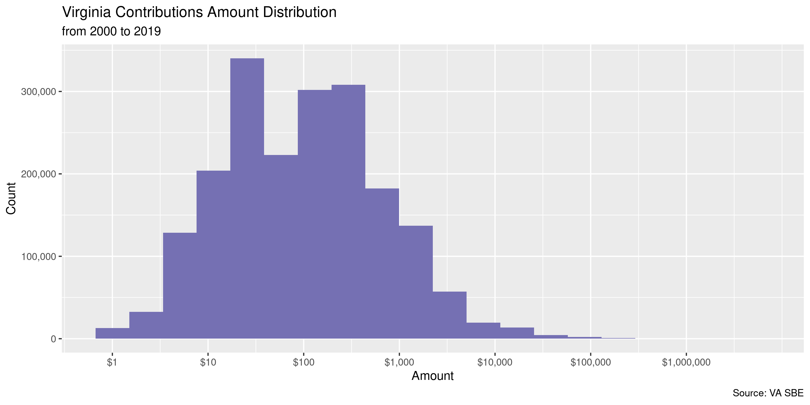

Virginia Contributions
================
Kiernan Nicholls & Yanqi Xu
2023-03-16 00:41:15

- <a href="#project" id="toc-project">Project</a>
- <a href="#objectives" id="toc-objectives">Objectives</a>
- <a href="#packages" id="toc-packages">Packages</a>
- <a href="#data" id="toc-data">Data</a>
- <a href="#download" id="toc-download">Download</a>
- <a href="#read" id="toc-read">Read</a>
- <a href="#duplicates" id="toc-duplicates">Duplicates</a>
- <a href="#join" id="toc-join">Join</a>
- <a href="#explore" id="toc-explore">Explore</a>
- <a href="#missing" id="toc-missing">Missing</a>
- <a href="#wrangle" id="toc-wrangle">Wrangle</a>
- <a href="#conclude" id="toc-conclude">Conclude</a>
- <a href="#export" id="toc-export">Export</a>
- <a href="#upload" id="toc-upload">Upload</a>
- <a href="#dictionary" id="toc-dictionary">Dictionary</a>

<!-- Place comments regarding knitting here -->

## Project

The Accountability Project is an effort to cut across data silos and
give journalists, policy professionals, activists, and the public at
large a simple way to search across huge volumes of public data about
people and organizations.

Our goal is to standardizing public data on a few key fields by thinking
of each dataset row as a transaction. For each transaction there should
be (at least) 3 variables:

1.  All **parties** to a transaction.
2.  The **date** of the transaction.
3.  The **amount** of money involved.

## Objectives

This document describes the process used to complete the following
objectives:

1.  How many records are in the database?
2.  Check for entirely duplicated records.
3.  Check ranges of continuous variables.
4.  Is there anything blank or missing?
5.  Check for consistency issues.
6.  Create a five-digit ZIP Code called `zip`.
7.  Create a `year` field from the transaction date.
8.  Make sure there is data on both parties to a transaction.

## Packages

The following packages are needed to collect, manipulate, visualize,
analyze, and communicate these results. The `pacman` package will
facilitate their installation and attachment.

The IRW’s `campfin` package will also have to be installed from GitHub.
This package contains functions custom made to help facilitate the
processing of campaign finance data.

``` r
if (!require("pacman")) install.packages("pacman")
pacman::p_load_gh("irworkshop/campfin")
pacman::p_load(
  tidyverse, # data manipulation
  lubridate, # datetime strings
  gluedown, # print markdown
  magrittr, # pipe operators
  janitor, # dataframe clean
  refinr, # cluster and merge
  aws.s3, # aws cloud storage
  scales, # format strings
  knitr, # knit documents
  vroom, # read files fast
  rvest, # read html pages
  glue, # combine strings
  here, # relative storage
  fs # search storage 
)
```

This document should be run as part of the `R_campfin` project, which
lives as a sub-directory of the more general, language-agnostic
[`irworkshop/accountability_datacleaning`](https://github.com/irworkshop/accountability_datacleaning)
GitHub repository.

The `R_campfin` project uses the [RStudio
projects](https://support.rstudio.com/hc/en-us/articles/200526207-Using-Projects)
feature and should be run as such. The project also uses the dynamic
`here::here()` tool for file paths relative to *your* machine.

``` r
# where does this document knit?
here::here()
#> [1] "/Users/yanqixu/code/accountability_datacleaning"
```

## Data

Data is obtained from the Virginia [Department of Elections
(DOE)](https://www.elections.virginia.gov/index.html) State Board of
Elections (SBE).

> The State Board of Elections is the regulatory board for the
> Department of Elections. It is authorized to prescribe standard forms
> for voter registration and elections, and to supervise, coordinate,
> and adopt regulations governing the work of local electoral boards,
> registrars, and officers of election.

The SBE has candidates and committees file ten types of reports:

| Schedule                      | Description                                                                      |
|:------------------------------|:---------------------------------------------------------------------------------|
| Schedule A                    | Direct Contributions over \$100 Use to report contributions exceeding \$100. Sc… |
| Schedule B                    | In-Kind Contributions over \$100 Use to report contributions of services rende…  |
| Schedule C                    | Rebates, Refunds and Interest Use to report receipts of refunds, rebates inte…   |
| Schedule D                    | Itemization of Expenditures Use to report all expenditures incurred by a com…    |
| Schedule E                    | Itemization of Loans Use to report the itemization of all loans received and/…   |
| Schedule F                    | Debts Remaining Unpaid Use to itemize any outstanding debt that remains outst…   |
| Schedule G                    | Statement of Funds Contributions, receipts, expenditures and loans that have …   |
| Schedule H                    | Summary of Receipts and Disbursements Contributions, receipts, expenditures a…   |
| Schedule I                    | Surplus Funds Paid Out Use to report the disposition of surplus funds.Schedu…    |
| Designated Expenditure Report | For each designated contribution received by the campaign committee from a po…   |

We are interested in schedule’s A and B.

## Download

The data itself is hosted on an SBE server and organized in monthly
directories.

``` r
library(polite)
sbe_url <- "https://apps.elections.virginia.gov/SBE_CSV/CF/"
#sbe_list <- read_html(sbe_url)
sbe_session <- bow(sbe_url, force = T)
sbe_list <- scrape(sbe_session)
```

We’ll grab everything from `2020_11` to `2023_02`. The next update
should start with `2023-03`.

From this list of directories, we can extract each `< href>` HTML tag.
These tags provide the directory names.

``` r
raw_dir <- dir_create(here("state","va", "contribs", "data", "raw"))
sbe_base <- "https://apps.elections.virginia.gov"
```

``` r
update_start <- "2020/10/1"
update_end <- "2023/2/1"
```

Then we can navigate to each of these directories and look for file
names containing “ScheduleA” or “ScheduleB” (these file names are
somewhat inconsistent).

We also want all of the `Report.csv` files for each month, these files
contain the information on the reports filed by the committees which
contains the contributions.

``` r
sbe_names <- character()
for (dir in sbe_dirs) {
  sbe_names <- 
    bow(dir, force = T) %>% 
    scrape() %>% 
    html_nodes("a") %>% 
    html_attr("href") %>% 
    str_subset("(Schedule(A|B))") %>% 
    append(sbe_names)
}
```

Using these server paths, we can build local paths to save each file to.

``` r
raw_urls <- str_c(sbe_base, sbe_names)
raw_names <- basename(str_replace(raw_urls, "/(?=[^/]*$)", "_"))
raw_paths <- path(raw_dir, raw_names)
```

If these paths don’t already exist, we can download them now. Each file
needs to be read so that erroneous double quotations can be removed
using regular expressions.

``` r
library(httr)
for (i in seq_along(raw_urls)) {
  wait = 1
  if (file_exists(raw_paths[i])) {
    next("file already downloaded")
  } else {
    httr::GET(raw_urls[i],user_agent("Mozilla/5.0"), write_disk(raw_paths[i]))
    x <- read_lines(raw_paths[i])
    if (str_starts(x[1], "#")) {
      next("file already fixed")
    } else {
      x <- str_replace_all(x, "(?<!^|,|\r\n)\"(?!,|\r\n|$)", "'")
      x <- c("### file fixed", x)
      write_lines(x, raw_paths[i])
      Sys.sleep(time = wait)
    }
  }
}
```

## Read

We can now read all of the schedule A and B files into a single
dataframe.

``` r
#sched_paths <- str_subset(raw_paths, "Schedule")
sched_paths <- dir_ls(raw_dir, regexp= ".+Schedule.+")
```

``` r
vac <- map_df(
  .x = sched_paths,
  .f = read_delim,
  .id = "source_file",
  delim = ",",
  comment = "###",
  escape_backslash = FALSE, 
  escape_double = FALSE,
  col_types = cols(
    .default = col_character(),
    IsIndividual = col_logical(),
    TransactionDate = col_character(),
    Amount = col_double(),
    TotalToDate = col_double()
  )
)
```

We can also identify the source file for each record.

``` r
vac$source_file <- basename(vac$source_file)
vac <- relocate(vac, source_file, .after = last_col())
```

The `date` column is a mix of `%m/%d/%Y` and `%Y-%m-%d` formats.

``` r
vac_mdy <- str_which(vac$date, "^\\d{2}/")
vac$date[vac_mdy] <- as.character(mdy(vac$date[vac_mdy]))
vac$date <- parse_datetime(vac$date) %>% as_date()

#vac %>% mutate(across(contains("date"), parse_date)
```

Each contribution has a unique ID number for either schedule A or B. We
can create a single shared ID column.

``` r
vac <- vac %>% 
  mutate(con_id = coalesce(sched_a, sched_b)) %>% 
  select(-sched_a, -sched_b)
```

## Duplicates

We can flag any record duplicated at least once, aside from the
supposedly unique contribution ID.

``` r
dupe_file <- path(dirname(raw_dir), "dupes.csv")
if (file_exists(dupe_file)) {
  vac <- read_csv(
    file = dupe_file,
    col_types = cols(
      rpt_id = col_character(),
      con_id = col_character()
    )
  )
  #vac <- left_join(vac, dupes)
} else {
vac <- flag_dupes(vac, -con_id)
vac %>% write_csv(path(dirname(raw_dir), "dupes.csv"))
}
```

``` r
percent(mean(vac$dupe_flag), 0.01)
#> [1] "1.18%"
```

``` r
vac %>% 
  filter(dupe_flag) %>% 
  #select(all_of(key_vars)) %>% 
  arrange(date) %>% glimpse()
#> Rows: 19,063
#> Columns: 24
#> $ rpt_id        <chr> "302206", "302206", "302283", "302283", "302283", "302283", "294836", "2948…
#> $ fil_id        <chr> NA, NA, NA, NA, NA, NA, NA, NA, NA, NA, NA, NA, NA, NA, NA, NA, NA, NA, NA,…
#> $ first_name    <chr> "Lavern", "Lavern", "Diane", "Diane", "Barbara/Vashonta", "Barbara/Vashonta…
#> $ middle_name   <chr> "J.", "J.", NA, NA, NA, NA, NA, NA, NA, NA, "V", "V", "Montgomery", "Montgo…
#> $ last_name     <chr> "Chatman", "Chatman", "Crawford-Batt", "Crawford-Batt", "Roach", "Roach", "…
#> $ prefix        <chr> "Ms.", "Ms.", "Ms.", "Ms.", NA, NA, NA, NA, "Mr.", "Mr.", "Mr.", "Mr.", NA,…
#> $ suffix        <chr> NA, NA, NA, NA, NA, NA, NA, NA, NA, NA, NA, NA, NA, NA, NA, NA, NA, NA, NA,…
#> $ emp_name      <chr> "EDJ Associates", "EDJ Associates", "Retired", "Retired", "BJ's Wholesale",…
#> $ occupation    <chr> "Vice President Business Development", "Vice President Business Development…
#> $ emp_place     <chr> "Alexandria VA", "Alexandria VA", "Alexandria VA", "Alexandria VA", "Alexan…
#> $ addr1         <chr> "307 Yoakum Pkwy", "307 Yoakum Pkwy", "3201 Landover St", "3201 Landover St…
#> $ addr2         <chr> "Apt 1426", "Apt 1426", "Apt 301", "Apt 301", NA, NA, NA, NA, NA, NA, NA, N…
#> $ city          <chr> "Alexandria", "Alexandria", "Alexandria", "Alexandria", "Alexandria", "Alex…
#> $ state         <chr> "VA", "VA", "VA", "VA", "VA", "VA", "VA", "VA", "VA", "VA", "VA", "VA", "VA…
#> $ zip           <chr> "22304-4037", "22304-4037", "22305-1909", "22305-1909", "22303-1141", "2230…
#> $ is_individual <lgl> TRUE, TRUE, TRUE, TRUE, TRUE, TRUE, TRUE, TRUE, TRUE, TRUE, TRUE, TRUE, TRU…
#> $ date          <date> 2008-11-09, 2008-11-09, 2011-05-03, 2011-05-03, 2011-10-30, 2011-10-30, 20…
#> $ amount        <dbl> 250, 250, 35, 35, 75, 75, 50, 50, 250, 250, 500, 500, 250, 250, 100, 100, 1…
#> $ total         <dbl> 500.00, 500.00, 170.00, 170.00, 150.00, 150.00, 250.00, 250.00, 500.00, 500…
#> $ valuation     <chr> NA, NA, NA, NA, NA, NA, NA, NA, NA, NA, NA, NA, "FairMarketValue", "FairMar…
#> $ product       <chr> NA, NA, NA, NA, NA, NA, NA, NA, NA, NA, NA, NA, "rent and office expenses",…
#> $ source_file   <chr> "2022_12_ScheduleA.csv", "2022_12_ScheduleA.csv", "2022_12_ScheduleA.csv", …
#> $ con_id        <chr> "9463223", "9463224", "9464133", "9464134", "9464203", "9464204", "9353732"…
#> $ dupe_flag     <lgl> TRUE, TRUE, TRUE, TRUE, TRUE, TRUE, TRUE, TRUE, TRUE, TRUE, TRUE, TRUE, TRU…
```

## Join

Each contribution is reported by the committee to which is was made. The
information on those reports, including who filed them and when, is
contained in a separate file every month.

``` r
rpt_paths <- dir_ls(here("state","va", "expends", "data", "raw", "meta"))
#rpt_paths <- str_subset(raw_paths, "Report")
```

``` r
rpt <- map_df(
  .x = rpt_paths,
  .f = read_delim,
  .id = "source_file",
  delim = ",",
  comment = "###",
  col_types = cols(
    .default = col_character(),
    IsStateWide = col_logical(),
    IsGeneralAssembly = col_logical(),
    IsLocal = col_logical(),
    FilingDate = col_datetime(),
    StartDate = col_datetime(),
    EndDate = col_datetime(),
    IsFinalReport = col_logical(),
    AmendmentCount = col_integer(),
    ElectionCycleStartDate = col_datetime(),
    ElectionCycleEndDate = col_datetime(),
    BalanceLastReportingPeriod = col_double(),
    NoActivity = col_logical(),
    DateOfReferendum = col_datetime(),
    SubmittedDate = col_datetime(),
    DueDate = col_datetime(),
    IsXmlUpload = col_logical()
  )
)
```

``` r
#rpt$source_file <- basename(rpt_paths[as.integer(rpt$source_file)])
rpt$source_file <- basename(rpt$source_file)
rpt <- relocate(rpt, source_file, .after = last_col())
```

The information on these reports can then be joined using the report ID.

``` r
vac <- left_join(
  x = vac, y = rpt,
  by = "rpt_id",
  suffix = c("_con", "_fil")
)
```

We identify the columns common to both by either being from a
contributor (`con_*`) or the filer (`fil_*`).

``` r
vac <- rename_prefix(
  df = vac,
  suffix = c("_con", "_fil")
)
```

## Explore

There are 1,620,252 columns and 58 columns.

``` r
glimpse(vac)
#> Rows: 1,620,252
#> Columns: 58
#> $ rpt_id          <chr> "215398", "215398", "215399", "215399", "215399", "215399", "215399", "21…
#> $ fil_id          <chr> "566840", "567308", "586240", "586255", "586255", "586258", "586267", "58…
#> $ first_name      <chr> "Theresa", "William", "Arthur", "Rebecca", "Rebecca", "Myron", "Barbara",…
#> $ middle_name     <chr> NA, NA, NA, NA, NA, NA, NA, NA, NA, NA, NA, NA, "PETER", NA, NA, "SONJIA"…
#> $ last_name       <chr> "Stearns", "Ackerman", "Cornfeld", "Daly", "Daly", "Gray", "Bennett", "Ch…
#> $ prefix          <chr> NA, NA, NA, NA, NA, NA, NA, NA, NA, NA, NA, NA, NA, NA, NA, NA, NA, NA, N…
#> $ suffix          <chr> NA, NA, NA, NA, NA, NA, NA, NA, NA, NA, NA, NA, NA, NA, NA, NA, NA, NA, N…
#> $ emp_name        <chr> "CRNA-JD", "unknown", "ABC Properties", "NOT EMPLOYED", "NOT EMPLOYED", "…
#> $ occupation      <chr> "CRNA-JD", "unknown", "Real Estate", "NOT EMPLOYED", "NOT EMPLOYED", "NOT…
#> $ emp_place       <chr> "St Louis,  MO", "unknown", "New York, New York", "NOT EMPLOYED", "NOT EM…
#> $ con_addr1       <chr> "St Louis,  MO", "12361 Henderson Rd", "152 W. 57th St.", "3100 Bacon Sch…
#> $ con_addr2       <chr> NA, NA, NA, NA, NA, NA, "#521", NA, NA, NA, NA, NA, NA, NA, NA, NA, "STE …
#> $ con_city        <chr> "St Louis", "Clifton", "New York", "Saxe", "Saxe", "Charlotte", "Arlingto…
#> $ con_state       <chr> "MO", "VA", "NY", "VA", "VA", "NC", "VA", "NC", "VA", "VA", "VA", "VA", "…
#> $ con_zip         <chr> "63112", "20124", "10019", "23967", "23967", "28226", "22204", "23937", "…
#> $ is_individual   <lgl> TRUE, TRUE, TRUE, TRUE, TRUE, TRUE, TRUE, FALSE, TRUE, TRUE, TRUE, TRUE, …
#> $ date            <date> 2019-05-06, 2019-05-23, 2019-06-05, 2019-06-01, 2019-06-06, 2019-06-12, …
#> $ amount          <dbl> 100, 104, 250, 147, 10, 200, 250, 250, 100, 100, 50, 50, 500, 2000, 250, …
#> $ total           <dbl> 200, 104, 250, 147, 157, 200, 250, 250, 200, 200, 125, 175, 500, 2000, 25…
#> $ valuation       <chr> NA, NA, NA, NA, NA, NA, NA, NA, NA, NA, NA, NA, NA, NA, NA, NA, NA, NA, N…
#> $ product         <chr> NA, NA, NA, NA, NA, NA, NA, NA, NA, NA, NA, NA, NA, NA, NA, NA, NA, NA, N…
#> $ con_source_file <chr> "2020_11_ScheduleA.csv", "2020_11_ScheduleA.csv", "2020_11_ScheduleA.csv"…
#> $ con_id          <chr> "5372334", "5372335", "5372336", "5372337", "5372338", "5372339", "537234…
#> $ dupe_flag       <lgl> FALSE, FALSE, FALSE, FALSE, FALSE, FALSE, FALSE, FALSE, FALSE, FALSE, FAL…
#> $ fil_code        <chr> "CC-19-00343", "CC-19-00343", "CC-19-00343", "CC-19-00343", "CC-19-00343"…
#> $ fil_name        <chr> "Friends of Virginia", "Friends of Virginia", "Friends of Virginia", "Fri…
#> $ fil_type        <chr> "Candidate Campaign Committee", "Candidate Campaign Committee", "Candidat…
#> $ cand_name       <chr> "Virginia M Smith", "Virginia M Smith", "Virginia M Smith", "Virginia M S…
#> $ is_stwide       <lgl> FALSE, FALSE, FALSE, FALSE, FALSE, FALSE, FALSE, FALSE, FALSE, FALSE, FAL…
#> $ is_assembly     <lgl> FALSE, FALSE, FALSE, FALSE, FALSE, FALSE, FALSE, FALSE, FALSE, FALSE, FAL…
#> $ is_local        <lgl> TRUE, TRUE, TRUE, TRUE, TRUE, TRUE, TRUE, TRUE, TRUE, TRUE, TRUE, TRUE, T…
#> $ party           <chr> "Democratic", "Democratic", "Democratic", "Democratic", "Democratic", "De…
#> $ report_year     <chr> "2019", "2019", "2019", "2019", "2019", "2019", "2019", "2019", "2019", "…
#> $ filing_date     <dttm> 2020-07-21 09:38:49, 2020-07-21 09:38:49, 2020-07-21 09:40:18, 2020-07-2…
#> $ start_date      <dttm> 2019-04-01, 2019-04-01, 2019-05-31, 2019-05-31, 2019-05-31, 2019-05-31, …
#> $ end_date        <dttm> 2019-05-30, 2019-05-30, 2019-06-30, 2019-06-30, 2019-06-30, 2019-06-30, …
#> $ fil_addr1       <chr> "P.O. Box 734", "P.O. Box 734", "P.O. Box 734", "P.O. Box 734", "P.O. Box…
#> $ fil_addr2       <chr> NA, NA, NA, NA, NA, NA, NA, NA, NA, NA, NA, NA, NA, NA, NA, NA, NA, NA, N…
#> $ fil_city        <chr> "North Prince George", "North Prince George", "North Prince George", "Nor…
#> $ fil_state       <chr> "VA", "VA", "VA", "VA", "VA", "VA", "VA", "VA", "VA", "VA", "VA", "VA", "…
#> $ fil_zip         <chr> "23875", "23875", "23875", "23875", "23875", "23875", "23875", "23875", "…
#> $ filing_type     <chr> "Report", "Report", "Report", "Report", "Report", "Report", "Report", "Re…
#> $ is_final        <lgl> FALSE, FALSE, FALSE, FALSE, FALSE, FALSE, FALSE, FALSE, FALSE, FALSE, FAL…
#> $ is_amend        <chr> "True", "True", "True", "True", "True", "True", "True", "True", "True", "…
#> $ amend_count     <int> 2, 2, 2, 2, 2, 2, 2, 2, 2, 3, 3, 3, 3, 3, 3, 3, 3, 3, 3, 3, 3, 3, 3, 3, 3…
#> $ fil_phone       <chr> "8043809495", "8043809495", "8043809495", "8043809495", "8043809495", "80…
#> $ fil_email       <chr> "Svirginia100@gmail.com", "Svirginia100@gmail.com", "Svirginia100@gmail.c…
#> $ election_cycle  <chr> "11/2019", "11/2019", "11/2019", "11/2019", "11/2019", "11/2019", "11/201…
#> $ elect_start     <dttm> 2016-01-01, 2016-01-01, 2016-01-01, 2016-01-01, 2016-01-01, 2016-01-01, …
#> $ elect_end       <dttm> 2019-12-31, 2019-12-31, 2019-12-31, 2019-12-31, 2019-12-31, 2019-12-31, …
#> $ office          <chr> "Member Senate Of Virginia", "Member Senate Of Virginia", "Member Senate …
#> $ district        <chr> "State Senate - 15th District", "State Senate - 15th District", "State Se…
#> $ no_activity     <lgl> FALSE, FALSE, FALSE, FALSE, FALSE, FALSE, FALSE, FALSE, FALSE, FALSE, FAL…
#> $ referendum_date <dttm> NA, NA, NA, NA, NA, NA, NA, NA, NA, NA, NA, NA, NA, NA, NA, NA, NA, NA, …
#> $ submitted_date  <dttm> 2020-11-02 18:32:27, 2020-11-02 18:32:27, 2020-11-02 18:32:44, 2020-11-0…
#> $ account_id      <chr> "{25F611E0-1A44-E911-9F1A-984BE103F032}", "{25F611E0-1A44-E911-9F1A-984BE…
#> $ due_date        <dttm> 2019-06-03 23:59:00, 2019-06-03 23:59:00, 2019-07-15 23:59:00, 2019-07-1…
#> $ fil_source_file <chr> "2020_11_Report.csv", "2020_11_Report.csv", "2020_11_Report.csv", "2020_1…
tail(vac)
#> # A tibble: 6 × 58
#>   rpt_id fil_id first_name middle_n…¹ last_…² prefix suffix emp_n…³ occup…⁴ emp_p…⁵ con_a…⁶ con_a…⁷
#>   <chr>  <chr>  <chr>      <chr>      <chr>   <chr>  <chr>  <chr>   <chr>   <chr>   <chr>   <chr>  
#> 1 312277 235667 <NA>       <NA>       Virgin… <NA>   <NA>   <NA>    PAC     Richmo… 17 E C… <NA>   
#> 2 312277 702533 <NA>       <NA>       Two Ca… <NA>   <NA>   <NA>    Govern… Richmo… 1205 E… Suite …
#> 3 312282 702533 <NA>       <NA>       Two Ca… <NA>   <NA>   <NA>    Govern… Richmo… 1205 E… Suite …
#> 4 312338 891052 <NA>       <NA>       Cigar … <NA>   <NA>   <NA>    Lobbyi… Richmo… Broad … <NA>   
#> 5 312349 968338 Draper     <NA>       Carlton <NA>   <NA>   Southe… Projec… Mechan… 69 Ken… <NA>   
#> 6 312349 969959 Draper     <NA>       Carlton <NA>   <NA>   Southe… Projec… Mechan… 69 Ken… <NA>   
#> # … with 46 more variables: con_city <chr>, con_state <chr>, con_zip <chr>, is_individual <lgl>,
#> #   date <date>, amount <dbl>, total <dbl>, valuation <chr>, product <chr>, con_source_file <chr>,
#> #   con_id <chr>, dupe_flag <lgl>, fil_code <chr>, fil_name <chr>, fil_type <chr>,
#> #   cand_name <chr>, is_stwide <lgl>, is_assembly <lgl>, is_local <lgl>, party <chr>,
#> #   report_year <chr>, filing_date <dttm>, start_date <dttm>, end_date <dttm>, fil_addr1 <chr>,
#> #   fil_addr2 <chr>, fil_city <chr>, fil_state <chr>, fil_zip <chr>, filing_type <chr>,
#> #   is_final <lgl>, is_amend <chr>, amend_count <int>, fil_phone <chr>, fil_email <chr>, …
```

## Missing

Columns vary in their degree of missing values.

``` r
col_stats(vac, count_na)
#> # A tibble: 58 × 4
#>    col             class        n          p
#>    <chr>           <chr>    <int>      <dbl>
#>  1 rpt_id          <chr>        0 0         
#>  2 fil_id          <chr>  1419188 0.876     
#>  3 first_name      <chr>    91509 0.0565    
#>  4 middle_name     <chr>  1456503 0.899     
#>  5 last_name       <chr>        3 0.00000185
#>  6 prefix          <chr>  1552385 0.958     
#>  7 suffix          <chr>  1606892 0.992     
#>  8 emp_name        <chr>    95013 0.0586    
#>  9 occupation      <chr>     5846 0.00361   
#> 10 emp_place       <chr>     7640 0.00472   
#> 11 con_addr1       <chr>       64 0.0000395 
#> 12 con_addr2       <chr>  1542460 0.952     
#> 13 con_city        <chr>       29 0.0000179 
#> 14 con_state       <chr>   141567 0.0874    
#> 15 con_zip         <chr>       39 0.0000241 
#> 16 is_individual   <lgl>        0 0         
#> 17 date            <date>       0 0         
#> 18 amount          <dbl>        0 0         
#> 19 total           <dbl>        0 0         
#> 20 valuation       <chr>  1602728 0.989     
#> 21 product         <chr>  1602929 0.989     
#> 22 con_source_file <chr>        0 0         
#> 23 con_id          <chr>        0 0         
#> 24 dupe_flag       <lgl>        0 0         
#> 25 fil_code        <chr>        0 0         
#> 26 fil_name        <chr>        0 0         
#> 27 fil_type        <chr>        0 0         
#> 28 cand_name       <chr>  1005395 0.621     
#> 29 is_stwide       <lgl>        0 0         
#> 30 is_assembly     <lgl>        0 0         
#> 31 is_local        <lgl>        0 0         
#> 32 party           <chr>  1005394 0.621     
#> 33 report_year     <chr>        0 0         
#> 34 filing_date     <dttm>       0 0         
#> 35 start_date      <dttm>       0 0         
#> 36 end_date        <dttm>       0 0         
#> 37 fil_addr1       <chr>     3897 0.00241   
#> 38 fil_addr2       <chr>  1569184 0.968     
#> 39 fil_city        <chr>     3897 0.00241   
#> 40 fil_state       <chr>        0 0         
#> 41 fil_zip         <chr>     3897 0.00241   
#> 42 filing_type     <chr>        0 0         
#> 43 is_final        <lgl>        0 0         
#> 44 is_amend        <chr>        0 0         
#> 45 amend_count     <int>        0 0         
#> 46 fil_phone       <chr>    43136 0.0266    
#> 47 fil_email       <chr>    18297 0.0113    
#> 48 election_cycle  <chr>  1004934 0.620     
#> 49 elect_start     <dttm>       0 0         
#> 50 elect_end       <dttm>       0 0         
#> 51 office          <chr>  1013847 0.626     
#> 52 district        <chr>  1267080 0.782     
#> 53 no_activity     <lgl>        0 0         
#> 54 referendum_date <dttm> 1617012 0.998     
#> 55 submitted_date  <dttm>       0 0         
#> 56 account_id      <chr>        0 0         
#> 57 due_date        <dttm>       0 0         
#> 58 fil_source_file <chr>        0 0
```

We can flag any record missing a key variable, like a date or name,
needed to identify a transaction and all of it’s parties.

``` r
key_vars <- c("con_name", "date", "amount", "fil_name")
vac <- vac %>% 
  unite(
    col = con_name,
    prefix, first_name, middle_name, last_name, suffix,
    sep = " ",
    na.rm = TRUE,
    remove = FALSE
  ) %>% 
  mutate(across(where(is_character), na_if, "")) %>% 
  relocate(con_name, .after = last_col()) %>% 
  flag_na(all_of(key_vars))
```

There are 3 records missing a key variable.

``` r
sum(vac$na_flag)
#> [1] 3
vac %>% 
  filter(na_flag) %>% 
  select(all_of(key_vars))
#> # A tibble: 3 × 4
#>   con_name date       amount fil_name               
#>   <chr>    <date>      <dbl> <chr>                  
#> 1 <NA>     2022-09-20     50 Stephanie For Lynchburg
#> 2 <NA>     2022-11-01     25 Stephanie For Lynchburg
#> 3 <NA>     2022-11-02    100 Stephanie For Lynchburg
```

### Categorical

``` r
col_stats(vac, n_distinct)
#> # A tibble: 60 × 4
#>    col             class        n          p
#>    <chr>           <chr>    <int>      <dbl>
#>  1 rpt_id          <chr>    21720 0.0134    
#>  2 fil_id          <chr>    85374 0.0527    
#>  3 first_name      <chr>    37071 0.0229    
#>  4 middle_name     <chr>     7790 0.00481   
#>  5 last_name       <chr>   151691 0.0936    
#>  6 prefix          <chr>      169 0.000104  
#>  7 suffix          <chr>      135 0.0000833 
#>  8 emp_name        <chr>   119710 0.0739    
#>  9 occupation      <chr>    50790 0.0313    
#> 10 emp_place       <chr>    40492 0.0250    
#> 11 con_addr1       <chr>   480621 0.297     
#> 12 con_addr2       <chr>     6489 0.00400   
#> 13 con_city        <chr>    23361 0.0144    
#> 14 con_state       <chr>       62 0.0000383 
#> 15 con_zip         <chr>    93659 0.0578    
#> 16 is_individual   <lgl>        2 0.00000123
#> 17 date            <date>    3392 0.00209   
#> 18 amount          <dbl>    12411 0.00766   
#> 19 total           <dbl>    35829 0.0221    
#> 20 valuation       <chr>        5 0.00000309
#> 21 product         <chr>     4606 0.00284   
#> 22 con_source_file <chr>       56 0.0000346 
#> 23 con_id          <chr>  1620252 1         
#> 24 dupe_flag       <lgl>        2 0.00000123
#> 25 fil_code        <chr>     2517 0.00155   
#> 26 fil_name        <chr>     2534 0.00156   
#> 27 fil_type        <chr>        7 0.00000432
#> 28 cand_name       <chr>     1944 0.00120   
#> 29 is_stwide       <lgl>        2 0.00000123
#> 30 is_assembly     <lgl>        2 0.00000123
#> 31 is_local        <lgl>        2 0.00000123
#> 32 party           <chr>       10 0.00000617
#> 33 report_year     <chr>       17 0.0000105 
#> 34 filing_date     <dttm>   21719 0.0134    
#> 35 start_date      <dttm>    1028 0.000634  
#> 36 end_date        <dttm>     926 0.000572  
#> 37 fil_addr1       <chr>     2479 0.00153   
#> 38 fil_addr2       <chr>      266 0.000164  
#> 39 fil_city        <chr>      478 0.000295  
#> 40 fil_state       <chr>       14 0.00000864
#> 41 fil_zip         <chr>      662 0.000409  
#> 42 filing_type     <chr>        2 0.00000123
#> 43 is_final        <lgl>        2 0.00000123
#> 44 is_amend        <chr>        2 0.00000123
#> 45 amend_count     <int>       13 0.00000802
#> 46 fil_phone       <chr>     2252 0.00139   
#> 47 fil_email       <chr>     2443 0.00151   
#> 48 election_cycle  <chr>       41 0.0000253 
#> 49 elect_start     <dttm>      16 0.00000988
#> 50 elect_end       <dttm>      17 0.0000105 
#> 51 office          <chr>      150 0.0000926 
#> 52 district        <chr>      608 0.000375  
#> 53 no_activity     <lgl>        2 0.00000123
#> 54 referendum_date <dttm>       7 0.00000432
#> 55 submitted_date  <dttm>   21720 0.0134    
#> 56 account_id      <chr>     2517 0.00155   
#> 57 due_date        <dttm>     861 0.000531  
#> 58 fil_source_file <chr>       28 0.0000173 
#> 59 con_name        <chr>   443142 0.274     
#> 60 na_flag         <lgl>        2 0.00000123
```

<!-- --><!-- --><!-- --><!-- -->

### Amounts

``` r
summary(vac$amount)
#>     Min.  1st Qu.   Median     Mean  3rd Qu.     Max. 
#>        0       12       25      816      100 95648796
mean(vac$amount <= 0)
#> [1] 2.530471e-05
```

<!-- -->

#### Dates

``` r
vac <- mutate(vac, year = year(date))
```

``` r
min(vac$date)
#> [1] "2008-08-29"
sum(vac$year < 2000)
#> [1] 0
max(vac$date)
#> [1] "2024-08-17"
sum(vac$date > today())
#> [1] 4
```

<!-- -->

## Wrangle

To improve the searchability of the database, we will perform some
consistent, confident string normalization. For geographic variables
like city names and ZIP codes, the corresponding `campfin::normal_*()`
functions are tailor made to facilitate this process.

### Address

For the street `*_addr` variables, the `campfin::normal_address()`
function will force consistence case, remove punctuation, and abbreviate
official USPS suffixes.

We will create separate tables of unique, normalized addresses.

``` r
con_addr_norm <- vac %>% 
  select(starts_with("con_addr")) %>% 
  distinct() %>% 
  unite(
    col = con_addr_full,
    everything(),
    sep = " ",
    remove = FALSE,
    na.rm = TRUE
  ) %>% 
  mutate(
    con_addr_norm = normal_address(
      address = con_addr_full,
      abbs = usps_street,
      na_rep = TRUE
    )
  ) %>% 
  select(-con_addr_full)
```

    #> # A tibble: 487,187 × 3
    #>    con_addr1            con_addr2 con_addr_norm          
    #>    <chr>                <chr>     <chr>                  
    #>  1 St Louis,  MO        <NA>      ST LOUIS MO            
    #>  2 12361 Henderson Rd   <NA>      12361 HENDERSON RD     
    #>  3 152 W. 57th St.      <NA>      152 W 57TH ST          
    #>  4 3100 Bacon School Rd <NA>      3100 BACON SCHOOL RD   
    #>  5 4705 Whetstone Ct    <NA>      4705 WHETSTONE CT      
    #>  6 5550 Columbia Pike   #521      5550 COLUMBIA PIKE #521
    #>  7 PO BOX 444           <NA>      PO BOX 444             
    #>  8 PO BOX 734           <NA>      PO BOX 734             
    #>  9 10463 Jordan Parkway <NA>      10463 JORDAN PKWY      
    #> 10 204 Forrest Drive    <NA>      204 FORREST DR         
    #> # … with 487,177 more rows

This table can be joined to the original contributions.

``` r
vac <- left_join(vac, con_addr_norm)
```

This process is repeated for filer addresses, of which there are far
fewer.

``` r
fil_addr_norm <- vac %>% 
  select(starts_with("fil_addr")) %>% 
  distinct() %>% 
  unite(
    col = fil_addr_full,
    everything(),
    sep = " ",
    remove = FALSE,
    na.rm = TRUE
  ) %>% 
  mutate(
    fil_addr_norm = normal_address(
      address = fil_addr_full,
      abbs = usps_street,
      na_rep = TRUE
    )
  ) %>% 
  select(-fil_addr_full)
```

``` r
vac <- left_join(vac, fil_addr_norm)
```

``` r
vac %>% 
  select(contains("addr")) %>% 
  distinct() %>% 
  sample_n(10)
#> # A tibble: 10 × 6
#>    con_addr1                   con_addr2 fil_addr1           fil_addr2 con_addr_norm        fil_a…¹
#>    <chr>                       <chr>     <chr>               <chr>     <chr>                <chr>  
#>  1 12612 Pleasant Prospect Rd  <NA>      PO Box 2306         <NA>      12612 PLEASANT PROS… PO BOX…
#>  2 7104 Danford Place          <NA>      5302 Rich Ct.       <NA>      7104 DANFORD PL      5302 R…
#>  3 5706 GUTHRIE PLACE          <NA>      9431 Goldfield      <NA>      5706 GUTHRIE PL      9431 G…
#>  4 406 HAWKINS ISLAND DRIVE    <NA>      9431 Goldfield      <NA>      406 HAWKINS ISLAND … 9431 G…
#>  5 2669 FANIEUL HALL CT.       <NA>      9431 Goldfield      <NA>      2669 FANIEUL HALL CT 9431 G…
#>  6 4310 GLENVIEW AVENUE        <NA>      9431 Goldfield      <NA>      4310 GLENVIEW AVE    9431 G…
#>  7 20022 APPLEDOWRE CIRCLE #34 <NA>      9431 Goldfield      <NA>      20022 APPLEDOWRE CI… 9431 G…
#>  8 11601 MONTANA AVE #6        <NA>      9431 Goldfield      <NA>      11601 MONTANA AVE #6 9431 G…
#>  9 3151 Rutrough Road          <NA>      4222 Fortuna Center 659       3151 RUTROUGH RD     4222 F…
#> 10 1916 SAN PEDRO DR NE        <NA>      9431 Goldfield      <NA>      1916 SAN PEDRO DR NE 9431 G…
#> # … with abbreviated variable name ¹​fil_addr_norm
```

### ZIP

For ZIP codes, the `campfin::normal_zip()` function will attempt to
create valid *five* digit codes by removing the ZIP+4 suffix and
returning leading zeroes dropped by other programs like Microsoft Excel.

``` r
vac <- mutate(
  vac, across(
    .cols = ends_with("zip"),
    .fns = list(norm = normal_zip),
    na_rep = TRUE
  )
)
```

``` r
progress_table(
  vac$con_zip,
  vac$con_zip_norm,
  vac$fil_zip,
  vac$fil_zip_norm,
  compare = valid_zip
)
#> # A tibble: 4 × 6
#>   stage            prop_in n_distinct   prop_na  n_out n_diff
#>   <chr>              <dbl>      <dbl>     <dbl>  <dbl>  <dbl>
#> 1 vac$con_zip        0.782      93659 0.0000241 352694  73544
#> 2 vac$con_zip_norm   0.991      23233 0.000212   14734   2719
#> 3 vac$fil_zip        0.990        662 0.00241    16545     92
#> 4 vac$fil_zip_norm   1.00         583 0.00241        3      3
```

### State

The state variables do not need to be normalized.

``` r
prop_in(vac$con_state, valid_state)
#> [1] 0.9999615
prop_in(vac$fil_state, valid_state)
#> [1] 0.9997741
```

### City

Cities are the most difficult geographic variable to normalize, simply
due to the wide variety of valid cities and formats.

#### Normal

The `campfin::normal_city()` function is a good start, again converting
case, removing punctuation, but *expanding* USPS abbreviations. We can
also remove `invalid_city` values.

``` r
vac <- mutate(
  vac, across(
    .cols = ends_with("city"),
    .fns = list(norm = normal_city),
    abbs = usps_city,
    states = c("VA", "DC", "VIRGINIA"),
    na = invalid_city,
    na_rep = TRUE
  )
)
```

#### Swap

We can further improve normalization by comparing our normalized value
against the *expected* value for that record’s state abbreviation and
ZIP code. If the normalized value is either an abbreviation for or very
similar to the expected value, we can confidently swap those two.

``` r
con_city_swap <- vac %>% 
  count(
    con_city_norm, 
    con_state, 
    con_zip_norm,
    sort = TRUE
  ) %>% 
  left_join(
    y = zipcodes,
    by = c(
      "con_state" = "state",
      "con_zip_norm" = "zip"
    )
  ) %>% 
  rename(city_match = city) %>% 
  mutate(
    match_abb = is_abbrev(con_city_norm, city_match),
    match_dist = str_dist(con_city_norm, city_match),
    con_city_swap = if_else(
      condition = !is.na(match_dist) & match_abb | match_dist == 1,
      true = city_match,
      false = con_city_norm
    )
  ) %>% 
  select(
    -city_match,
    -match_dist,
    -match_abb,
    -n
  )
```

    #> # A tibble: 3,412 × 4
    #>    con_city_norm con_state con_zip_norm con_city_swap      
    #>    <chr>         <chr>     <chr>        <chr>              
    #>  1 MC LEAN       VA        22101        MCLEAN             
    #>  2 MC LEAN       VA        22102        MCLEAN             
    #>  3 NEWTON        MA        02459        NEWTON CENTER      
    #>  4 VA BEACH      VA        23451        VIRGINIA BEACH     
    #>  5 VA BEACH      VA        23456        VIRGINIA BEACH     
    #>  6 WELLESLEY     MA        02481        WELLESLEY HILLS    
    #>  7 COEUR DALENE  ID        83815        COEUR D ALENE      
    #>  8 ST AUGUSTINE  FL        32084        SAINT AUGUSTINE    
    #>  9 CHINCOTEAGUE  VA        23336        CHINCOTEAGUE ISLAND
    #> 10 VA BEACH      VA        23454        VIRGINIA BEACH     
    #> # … with 3,402 more rows

``` r
vac <- left_join(vac, con_city_swap)
```

Repeat the process for the filer cities.

``` r
fil_city_swap <- vac %>% 
  count(
    fil_city_norm, 
    fil_state, 
    fil_zip_norm,
    sort = TRUE
  ) %>% 
  left_join(
    y = zipcodes,
    by = c(
      "fil_state" = "state",
      "fil_zip_norm" = "zip"
    )
  ) %>% 
  rename(city_match = city) %>% 
  mutate(
    match_abb = is_abbrev(fil_city_norm, city_match),
    match_dist = str_dist(fil_city_norm, city_match),
    fil_city_swap = if_else(
      condition = !is.na(match_dist) & match_abb | match_dist == 1,
      true = city_match,
      false = fil_city_norm
    )
  ) %>% 
  select(
    -city_match,
    -match_dist,
    -match_abb,
    -n
  )
```

    #> # A tibble: 22 × 4
    #>    fil_city_norm fil_state fil_zip_norm fil_city_swap  
    #>    <chr>         <chr>     <chr>        <chr>          
    #>  1 FAIRFAX       VA        22039        FAIRFAX STATION
    #>  2 HMAPTON       VA        23666        HAMPTON        
    #>  3 VA BEACH      VA        23451        VIRGINIA BEACH 
    #>  4 FAIRFIEDL     VA        24435        FAIRFIELD      
    #>  5 CHESEAPEAKE   VA        23320        CHESAPEAKE     
    #>  6 VA BEACH      VA        23454        VIRGINIA BEACH 
    #>  7 BAYSE         VA        22810        BASYE          
    #>  8 VA BEACH      VA        23453        VIRGINIA BEACH 
    #>  9 ALEXNDRIA     VA        22314        ALEXANDRIA     
    #> 10 CLEARBROOK    VA        22624        CLEAR BROOK    
    #> # … with 12 more rows

``` r
vac <- left_join(vac, fil_city_swap)
```

#### Refine

The [OpenRefine](https://openrefine.org/) algorithms can be used to
group similar strings and replace the less common versions with their
most common counterpart. This can greatly reduce inconsistency, but with
low confidence; we will only keep any refined strings that have a valid
city/state/zip combination.

``` r
good_refine <- vac %>% 
  mutate(
    con_city_refine = con_city_swap %>% 
      key_collision_merge() %>% 
      n_gram_merge(numgram = 1)
  ) %>% 
  filter(con_city_refine != con_city_swap) %>% 
  inner_join(
    y = zipcodes,
    by = c(
      "con_city_refine" = "city",
      "con_state" = "state",
      "con_zip_norm" = "zip"
    )
  )
```

    #> [1] 396
    #> # A tibble: 162 × 5
    #>    con_state con_zip_norm con_city_swap       con_city_refine     n
    #>    <chr>     <chr>        <chr>               <chr>           <int>
    #>  1 VA        22180        VIENNA VA           VIENNA             44
    #>  2 NV        89410        GARDNERVILLE NEVADA GARDNERVILLE       23
    #>  3 VA        20143        CATHARPINCATHARPIN  CATHARPIN          16
    #>  4 NY        11201        BROOKLYN|NY         BROOKLYN           15
    #>  5 PA        17402        YORKYORK            YORK               13
    #>  6 VA        23220        RICHMONDRICHMOND    RICHMOND           13
    #>  7 MA        02144        SOMMERSVILLE        SOMERVILLE         10
    #>  8 CO        80014        AURORA CO           AURORA              9
    #>  9 OR        97103        ASTORIA OR          ASTORIA             9
    #> 10 SC        29406        NORTH CHARLESTON    CHARLESTON          8
    #> # … with 152 more rows

Then we can join the refined values back to the database.

``` r
vac <- vac %>% 
  left_join(good_refine, by = names(.)) %>% 
  mutate(con_city_refine = coalesce(con_city_refine, con_city_swap))
```

#### Progress

| stage                                                                             | prop_in | n_distinct | prop_na | n_out | n_diff |
|:----------------------------------------------------------------------------------|--------:|-----------:|--------:|------:|-------:|
| str_to_upper(vac$con_city) | 0.976| 17320| 0.000| 39025| 6985| |vac$con_city_norm |   0.981 |      15785 |   0.000 | 31541 |   5419 |
| vac$con_city_swap | 0.992| 11637| 0.097| 11195| 1817| |vac$con_city_refine        |   0.993 |      11498 |   0.097 | 10808 |   1678 |

| stage                                                                        | prop_in | n_distinct | prop_na | n_out | n_diff |
|:-----------------------------------------------------------------------------|--------:|-----------:|--------:|------:|-------:|
| str_to_upper(vac$fil_city) | 0.998| 405| 0.002| 3536| 45| |vac$fil_city_norm |   0.999 |        396 |   0.002 |  2151 |     34 |
| vac\$fil_city_swap                                                           |   0.999 |        378 |   0.004 |   993 |     18 |

You can see how the percentage of valid values increased with each
stage.

<!-- -->

More importantly, the number of distinct values decreased each stage. We
were able to confidently change many distinct invalid values to their
valid equivalent.

<!-- -->

## Conclude

``` r
vac <- vac %>% 
  select(
    -con_city_norm,
    -con_city_swap,
    con_city_clean = con_city_refine
  ) %>% 
    select(
    -fil_city_norm,
    fil_city_clean = fil_city_swap
  ) %>% 
  rename_all(~str_replace(., "_norm", "_clean"))
```

``` r
glimpse(sample_n(vac, 100))
#> Rows: 100
#> Columns: 67
#> $ rpt_id          <chr> "276299", "271682", "274118", "280399", "306645", "271592", "280399", "26…
#> $ fil_id          <chr> NA, NA, NA, NA, "776447", NA, NA, NA, NA, NA, NA, NA, NA, NA, NA, NA, NA,…
#> $ first_name      <chr> "Paul", "Stephen", "MARTIN", "WILLIAM", "Junious", "william", "JOHN", "Jo…
#> $ middle_name     <chr> NA, NA, NA, NA, NA, NA, NA, NA, "E", "D.", NA, NA, NA, NA, NA, NA, NA, "M…
#> $ last_name       <chr> "Fischer", "Riederer", "HALL", "MILLIRON", "Mays", "breer", "EDEN", "Scan…
#> $ prefix          <chr> NA, NA, NA, NA, NA, NA, NA, NA, NA, NA, NA, NA, NA, NA, NA, NA, NA, NA, N…
#> $ suffix          <chr> NA, NA, NA, NA, NA, NA, NA, NA, NA, NA, NA, NA, NA, NA, NA, NA, NA, NA, N…
#> $ emp_name        <chr> "Retired", "Retired", "MUFC", "ROBERT MORRIS UNIVERSITY", "seeking", "Not…
#> $ occupation      <chr> "Retired", "Retired", "MUFC", "CUSTODIAL WORKER", "seeking", "Not Employe…
#> $ emp_place       <chr> "Arlington,VA", "Manchester Center,VT", "ARLINGTON VA", "BADEN PA", "seek…
#> $ con_addr1       <chr> "340 N Edison St", "168 East Branch Farms", "100 S ABERDEEN ST", "417 DIP…
#> $ con_addr2       <chr> NA, NA, NA, NA, NA, NA, NA, NA, NA, NA, NA, NA, NA, NA, NA, "Apt 2", NA, …
#> $ con_city        <chr> "Arlington", "Manchester Center", "ARLINGTON", "BADEN", "seeking", "Washi…
#> $ con_state       <chr> "VA", "VT", "VA", "PA", "VA", "DC", "TX", "VA", "AZ", "VA", "CA", "NH", "…
#> $ con_zip         <chr> "22203", "05255", "22204", "15005-1715", "00000", "20008-1040", "75227", …
#> $ is_individual   <lgl> TRUE, TRUE, TRUE, TRUE, TRUE, TRUE, TRUE, TRUE, TRUE, TRUE, TRUE, TRUE, T…
#> $ date            <date> 2021-09-16, 2021-11-01, 2021-09-26, 2021-10-03, 2022-11-21, 2021-10-27, …
#> $ amount          <dbl> 10.00, 5.00, 10.00, 50.00, 17.75, 125.00, 5.00, 500.00, 5.00, 300.00, 100…
#> $ total           <dbl> 181.00, 110.00, 20.00, 50.00, 195.25, 125.00, 15.00, 500.00, 5.00, 300.00…
#> $ valuation       <chr> NA, NA, NA, NA, NA, NA, NA, NA, NA, NA, NA, NA, NA, NA, NA, NA, NA, NA, N…
#> $ product         <chr> NA, NA, NA, NA, NA, NA, NA, NA, NA, NA, NA, NA, NA, NA, NA, NA, NA, NA, N…
#> $ con_source_file <chr> "2022_01_ScheduleA.csv", "2021_12_ScheduleA.csv", "2022_01_ScheduleA.csv"…
#> $ con_id          <chr> "8599699", "7447635", "7682981", "8790227", "9553598", "7382775", "905348…
#> $ dupe_flag       <lgl> FALSE, FALSE, FALSE, FALSE, FALSE, FALSE, FALSE, FALSE, FALSE, FALSE, FAL…
#> $ fil_code        <chr> "CC-21-00082", "CC-21-00082", "PAC-12-00545", "PAC-12-00545", "PAC-17-006…
#> $ fil_name        <chr> "Youngkin for Governor, Inc.", "Youngkin for Governor, Inc.", "ActBlue Vi…
#> $ fil_type        <chr> "Candidate Campaign Committee", "Candidate Campaign Committee", "Politica…
#> $ cand_name       <chr> "Mr. Glenn Allen Youngkin", "Mr. Glenn Allen Youngkin", NA, NA, NA, "Gov.…
#> $ is_stwide       <lgl> TRUE, TRUE, FALSE, FALSE, FALSE, TRUE, FALSE, TRUE, FALSE, TRUE, TRUE, FA…
#> $ is_assembly     <lgl> FALSE, FALSE, FALSE, FALSE, FALSE, FALSE, FALSE, FALSE, FALSE, FALSE, FAL…
#> $ is_local        <lgl> FALSE, FALSE, FALSE, FALSE, FALSE, FALSE, FALSE, FALSE, FALSE, FALSE, FAL…
#> $ party           <chr> "Republican", "Republican", NA, NA, NA, "Democratic", NA, "Republican", N…
#> $ report_year     <chr> "2021", "2021", "2021", "2022", "2022", "2021", "2022", "2021", "2021", "…
#> $ filing_date     <dttm> 2022-01-14 15:00:11, 2021-12-02 18:11:13, 2022-01-07 13:04:15, 2022-03-0…
#> $ start_date      <dttm> 2021-09-01, 2021-10-22, 2021-07-01, 2021-10-01, 2022-10-01, 2021-10-22, …
#> $ end_date        <dttm> 2021-09-30, 2021-11-25, 2021-09-30, 2021-12-31, 2022-12-31, 2021-11-25, …
#> $ fil_addr1       <chr> "PO Box 3950", "PO Box 3950", "9431 Goldfield", "9431 Goldfield", "P.O. B…
#> $ fil_addr2       <chr> NA, NA, NA, NA, NA, NA, NA, NA, NA, NA, NA, NA, NA, NA, NA, NA, NA, "SUIT…
#> $ fil_city        <chr> "Merrifield", "Merrifield", "Burke", "Burke", "Lovettsville", "Arlington"…
#> $ fil_state       <chr> "VA", "VA", "VA", "VA", "VA", "VA", "VA", "VA", "VA", "VA", "VA", "VA", "…
#> $ fil_zip         <chr> "22116", "22116", "22015", "22015", "20180", "22215", "22015", "22116", "…
#> $ filing_type     <chr> "Report", "Report", "Report", "Report", "Report", "Report", "Report", "Re…
#> $ is_final        <lgl> FALSE, FALSE, FALSE, FALSE, FALSE, FALSE, FALSE, FALSE, FALSE, FALSE, FAL…
#> $ is_amend        <chr> "True", "False", "False", "False", "False", "False", "False", "True", "Fa…
#> $ amend_count     <int> 3, 0, 0, 0, 0, 0, 0, 3, 0, 1, 1, 0, 0, 0, 0, 0, 0, 0, 0, 0, 0, 0, 0, 0, 0…
#> $ fil_phone       <chr> "(571) 286-1930", "(571) 286-1930", "617 517-7600", "617 517-7600", NA, "…
#> $ fil_email       <chr> "info@youngkinforgovernor.com", "info@youngkinforgovernor.com", "treasure…
#> $ election_cycle  <chr> "11/2021", "11/2021", NA, NA, NA, "11/2021", NA, "11/2021", NA, "11/2021"…
#> $ elect_start     <dttm> 2018-01-01, 2018-01-01, 2021-01-01, 2021-01-01, 2022-01-01, 2018-01-01, …
#> $ elect_end       <dttm> 2021-12-31, 2021-12-31, 2021-12-31, 2021-12-31, 2022-12-31, 2021-12-31, …
#> $ office          <chr> "Governor", "Governor", NA, NA, NA, "Governor", NA, "Governor", NA, "Gove…
#> $ district        <chr> NA, NA, NA, NA, NA, "00", NA, NA, NA, NA, NA, NA, NA, NA, NA, "00", NA, N…
#> $ no_activity     <lgl> FALSE, FALSE, FALSE, FALSE, FALSE, FALSE, FALSE, FALSE, FALSE, FALSE, FAL…
#> $ referendum_date <dttm> NA, NA, NA, NA, NA, NA, NA, NA, NA, NA, NA, NA, NA, NA, NA, NA, NA, NA, …
#> $ submitted_date  <dttm> 2022-01-18 17:11:19, 2021-12-02 19:59:41, 2022-01-07 14:09:08, 2022-03-0…
#> $ account_id      <chr> "{3F72510A-5026-4F1F-BCD6-2339F134B348}", "{3F72510A-5026-4F1F-BCD6-2339F…
#> $ due_date        <dttm> 2021-10-15 23:59:59, 2021-12-02 23:59:59, 2021-10-15 23:59:59, 2022-01-1…
#> $ fil_source_file <chr> "2022_01_Report.csv", "2021_12_Report.csv", "2022_01_Report.csv", "2022_0…
#> $ con_name        <chr> "Paul Fischer", "Stephen Riederer", "MARTIN HALL", "WILLIAM MILLIRON", "J…
#> $ na_flag         <lgl> FALSE, FALSE, FALSE, FALSE, FALSE, FALSE, FALSE, FALSE, FALSE, FALSE, FAL…
#> $ year            <dbl> 2021, 2021, 2021, 2021, 2022, 2021, 2021, 2021, 2021, 2021, 2021, 2022, 2…
#> $ con_addr_clean  <chr> "340 N EDISON ST", "168 EAST BRANCH FARMS", "100 S ABERDEEN ST", "417 DIP…
#> $ fil_addr_clean  <chr> "PO BOX 3950", "PO BOX 3950", "9431 GOLDFIELD", "9431 GOLDFIELD", "PO BOX…
#> $ con_zip_clean   <chr> "22203", "05255", "22204", "15005", NA, "20008", "75227", "22101", "85747…
#> $ fil_zip_clean   <chr> "22116", "22116", "22015", "22015", "20180", "22215", "22015", "22116", "…
#> $ fil_city_clean  <chr> "MERRIFIELD", "MERRIFIELD", "BURKE", "BURKE", "LOVETTSVILLE", "ARLINGTON"…
#> $ con_city_clean  <chr> "ARLINGTON", "MANCHESTER CENTER", "ARLINGTON", "BADEN", NA, "WASHINGTON",…
```

1.  There are 1,620,252 records in the database.
2.  There are 19,063 duplicate records in the database.
3.  The range and distribution of `amount` and `date` seem reasonable.
4.  There are 3 records missing key variables.
5.  Consistency in geographic data has been improved with
    `campfin::normal_*()`.
6.  The 4-digit `year` variable has been created with
    `lubridate::year()`.

## Export

Now the file can be saved on disk for upload to the Accountability
server.

``` r
clean_dir <- dir_create(here("state","va", "contribs", "data", "clean"))
clean_path <- path(clean_dir, "va_contribs_clean.csv")
write_csv(vac, clean_path, na = "")
(clean_size <- file_size(clean_path))
#> 1.01G
file_encoding(clean_path) %>% 
  mutate(across(path, path.abbrev))
#> # A tibble: 1 × 3
#>   path                                                                                mime  charset
#>   <fs::path>                                                                          <chr> <chr>  
#> 1 …ode/accountability_datacleaning/state/va/contribs/data/clean/va_contribs_clean.csv <NA>  <NA>
```

## Upload

We can use the `aws.s3::put_object()` to upload the text file to the IRW
server.

``` r
s3_path <- path("csv", basename(clean_path))
if (!object_exists(s3_path, "publicaccountability")) {
  put_object(
    file = clean_path,
    object = s3_path, 
    bucket = "publicaccountability",
    acl = "public-read",
    show_progress = TRUE,
    multipart = TRUE
  )
}
s3_head <- head_object(s3_path, "publicaccountability")
(s3_size <- as_fs_bytes(attr(s3_head, "content-length")))
unname(s3_size == clean_size)
```

## Dictionary

The following table describes the variables in our final exported file:

| Column            | Type        | Definition                              |
|:------------------|:------------|:----------------------------------------|
| `rpt_id`          | `character` | Filed report ID number                  |
| `fil_id`          | `character` | Unique Filer ID                         |
| `first_name`      | `character` | Contributor first name                  |
| `middle_name`     | `character` | Contributor middle name                 |
| `last_name`       | `character` | Contributor last name                   |
| `prefix`          | `character` | Contributor name prefix                 |
| `suffix`          | `character` | Contributor name suffix                 |
| `emp_name`        | `character` | Contributor employer name               |
| `occupation`      | `character` | Contributor occipation                  |
| `emp_place`       | `character` | Employer location                       |
| `con_addr1`       | `character` | Contributor street address              |
| `con_addr2`       | `character` | Contributor secondary address           |
| `con_city`        | `character` | Contributor city name                   |
| `con_state`       | `character` | Contributor state abbreviation          |
| `con_zip`         | `character` | Contributor ZIP+4 code                  |
| `is_individual`   | `logical`   | Flag for individual contributor         |
| `date`            | `double`    | Date contribution was made              |
| `amount`          | `double`    | Amount of contribution or correction    |
| `total`           | `double`    | Total amount contributed to date        |
| `valuation`       | `character` | In-kind contribution valuation method   |
| `product`         | `character` | In-kind contribution product            |
| `con_source_file` | `character` | Contribution source file name           |
| `con_id`          | `character` | **Unique** contribution ID              |
| `dupe_flag`       | `logical`   | **Unique** filer code                   |
| `fil_code`        | `character` | Filing committee name                   |
| `fil_name`        | `character` | Filing committee type                   |
| `fil_type`        | `character` | Candidate name                          |
| `cand_name`       | `character` | Flag for statewide race                 |
| `is_stwide`       | `logical`   | Flag for general assembly race          |
| `is_assembly`     | `logical`   | Flag for local race                     |
| `is_local`        | `logical`   | Candidate political party               |
| `party`           | `character` | Reporting year                          |
| `report_year`     | `character` | Date report filed                       |
| `filing_date`     | `double`    | Date reporting period began             |
| `start_date`      | `double`    | Date reporting period ended             |
| `end_date`        | `double`    | Committee street address                |
| `fil_addr1`       | `character` | Committee secondary address             |
| `fil_addr2`       | `character` | Committee city name                     |
| `fil_city`        | `character` | Committee state abbreviation            |
| `fil_state`       | `character` | Committee ZIP+4 code                    |
| `fil_zip`         | `character` | Type of report filed                    |
| `filing_type`     | `character` | Flag for final election report          |
| `is_final`        | `logical`   | Flag for amended report                 |
| `is_amend`        | `character` | Amended report version count            |
| `amend_count`     | `integer`   | Filer phone number                      |
| `fil_phone`       | `character` | Filer email address                     |
| `fil_email`       | `character` | Election cycle date/month               |
| `election_cycle`  | `character` | Date election began                     |
| `elect_start`     | `double`    | Date election ended                     |
| `elect_end`       | `double`    | Office sought by receiving candidate    |
| `office`          | `character` | District in which election held         |
| `district`        | `character` | Flag for no activity reported           |
| `no_activity`     | `logical`   | Date referendum held                    |
| `referendum_date` | `double`    | Date report filed                       |
| `submitted_date`  | `double`    | Unique account ID hash of filer         |
| `account_id`      | `character` | Date report due with state              |
| `due_date`        | `double`    | Report source file name                 |
| `fil_source_file` | `character` | Combined full contributor name          |
| `con_name`        | `character` | Flag for missing date, amount, or name  |
| `na_flag`         | `logical`   | Flag for completely duplicated record   |
| `year`            | `double`    | Calendar year of contribution date      |
| `con_addr_clean`  | `character` | Normalized contributor combined address |
| `fil_addr_clean`  | `character` | Normalized committee combined address   |
| `con_zip_clean`   | `character` | Normalized contributor 5-digit ZIP code |
| `fil_zip_clean`   | `character` | Normalized committee 5-digit ZIP code   |
| `fil_city_clean`  | `character` | Normalized contributor city name        |
| `con_city_clean`  | `character` | Normalized committee city name          |
