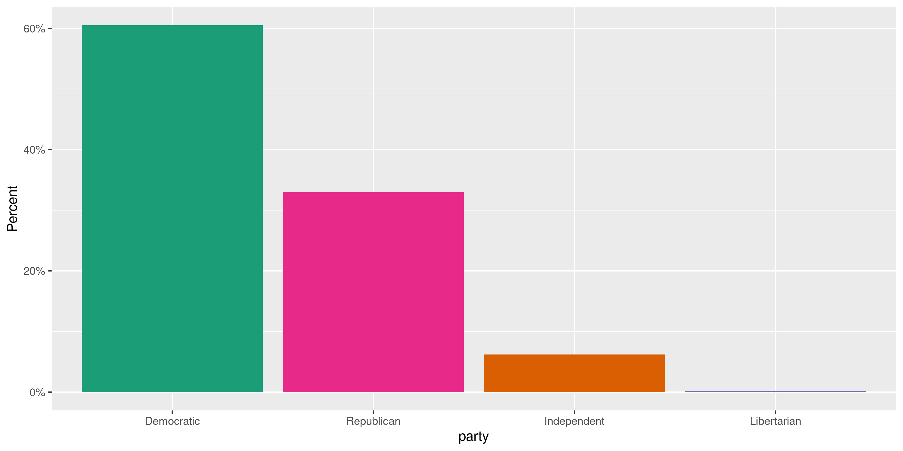
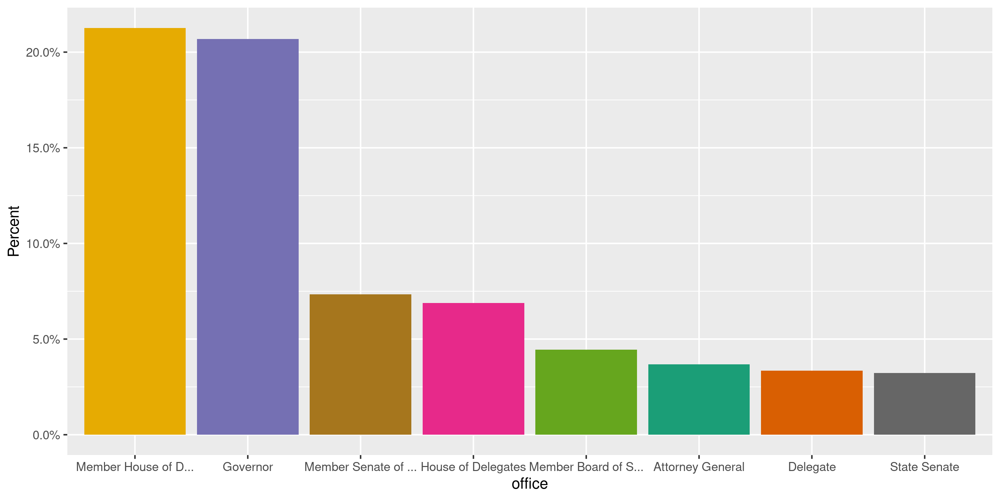
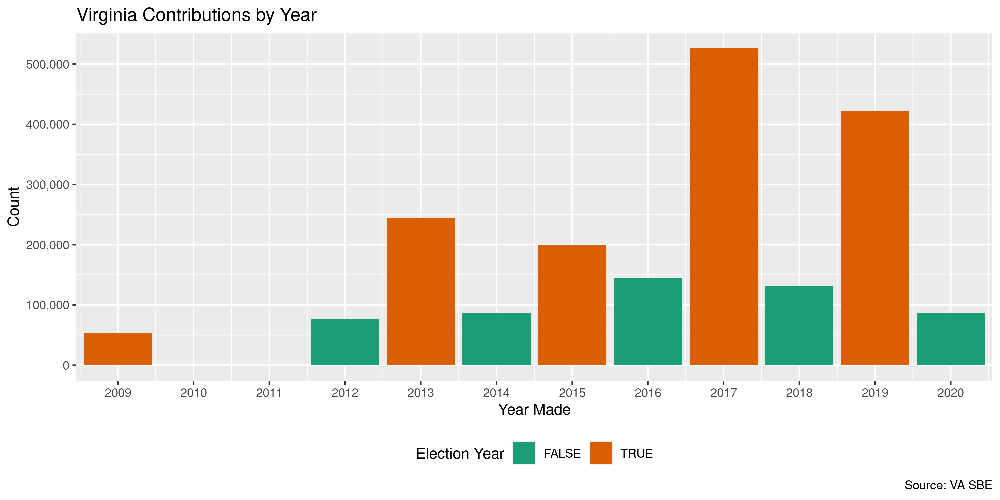

Virginia Contributions
================
Kiernan Nicholls
2022-10-22 15:11:43

-   <a href="#project" id="toc-project">Project</a>
-   <a href="#objectives" id="toc-objectives">Objectives</a>
-   <a href="#packages" id="toc-packages">Packages</a>
-   <a href="#data" id="toc-data">Data</a>
-   <a href="#download" id="toc-download">Download</a>
-   <a href="#read" id="toc-read">Read</a>
-   <a href="#join" id="toc-join">Join</a>
-   <a href="#explore" id="toc-explore">Explore</a>
-   <a href="#missing" id="toc-missing">Missing</a>
-   <a href="#wrangle" id="toc-wrangle">Wrangle</a>
-   <a href="#conclude" id="toc-conclude">Conclude</a>
-   <a href="#export" id="toc-export">Export</a>
-   <a href="#upload" id="toc-upload">Upload</a>
-   <a href="#dictionary" id="toc-dictionary">Dictionary</a>

<!-- Place comments regarding knitting here -->

## Project

The Accountability Project is an effort to cut across data silos and
give journalists, policy professionals, activists, and the public at
large a simple way to search across huge volumes of public data about
people and organizations.

Our goal is to standardizing public data on a few key fields by thinking
of each dataset row as a transaction. For each transaction there should
be (at least) 3 variables:

1.  All **parties** to a transaction.
2.  The **date** of the transaction.
3.  The **amount** of money involved.

## Objectives

This document describes the process used to complete the following
objectives:

1.  How many records are in the database?
2.  Check for entirely duplicated records.
3.  Check ranges of continuous variables.
4.  Is there anything blank or missing?
5.  Check for consistency issues.
6.  Create a five-digit ZIP Code called `zip`.
7.  Create a `year` field from the transaction date.
8.  Make sure there is data on both parties to a transaction.

## Packages

The following packages are needed to collect, manipulate, visualize,
analyze, and communicate these results. The `pacman` package will
facilitate their installation and attachment.

The IRW’s `campfin` package will also have to be installed from GitHub.
This package contains functions custom made to help facilitate the
processing of campaign finance data.

``` r
if (!require("pacman")) install.packages("pacman")
pacman::p_load_gh("irworkshop/campfin")
pacman::p_load(
  tidyverse, # data manipulation
  lubridate, # datetime strings
  gluedown, # print markdown
  magrittr, # pipe operators
  janitor, # dataframe clean
  refinr, # cluster and merge
  aws.s3, # aws cloud storage
  scales, # format strings
  knitr, # knit documents
  vroom, # read files fast
  rvest, # read html pages
  glue, # combine strings
  here, # relative storage
  fs # search storage 
)
```

This document should be run as part of the `R_campfin` project, which
lives as a sub-directory of the more general, language-agnostic
[`irworkshop/accountability_datacleaning`](https://github.com/irworkshop/accountability_datacleaning)
GitHub repository.

The `R_campfin` project uses the [RStudio
projects](https://support.rstudio.com/hc/en-us/articles/200526207-Using-Projects)
feature and should be run as such. The project also uses the dynamic
`here::here()` tool for file paths relative to *your* machine.

``` r
# where does this document knit?
here::here()
#> [1] "/Users/yanqixu/code/accountability_datacleaning"
```

## Data

Data is obtained from the Virginia [Department of Elections
(DOE)](https://www.elections.virginia.gov/index.html) State Board of
Elections (SBE).

> The State Board of Elections is the regulatory board for the
> Department of Elections. It is authorized to prescribe standard forms
> for voter registration and elections, and to supervise, coordinate,
> and adopt regulations governing the work of local electoral boards,
> registrars, and officers of election.

The SBE has candidates and committees file ten types of reports:

| Schedule                      | Description                                                                     |
|:------------------------------|:--------------------------------------------------------------------------------|
| Schedule A                    | Direct Contributions over \$100 Use to report contributions exceeding \$100. S… |
| Schedule B                    | In-Kind Contributions over \$100 Use to report contributions of services rend…  |
| Schedule C                    | Rebates, Refunds and Interest Use to report receipts of refunds, rebates int…   |
| Schedule D                    | Itemization of Expenditures Use to report all expenditures incurred by a co…    |
| Schedule E                    | Itemization of Loans Use to report the itemization of all loans received and…   |
| Schedule F                    | Debts Remaining Unpaid Use to itemize any outstanding debt that remains outs…   |
| Schedule G                    | Statement of Funds Contributions, receipts, expenditures and loans that have…   |
| Schedule H                    | Summary of Receipts and Disbursements Contributions, receipts, expenditures …   |
| Schedule I                    | Surplus Funds Paid Out Use to report the disposition of surplus funds.Sched…    |
| Designated Expenditure Report | For each designated contribution received by the campaign committee from a po…  |

We are interested in schedule’s A and B.

## Download

The data itself is hosted on an SBE server and organized in monthly
directories.

``` r
library(polite)
sbe_url <- "https://apps.elections.virginia.gov/SBE_CSV/CF/"
#sbe_list <- read_html(sbe_url)
sbe_session <- bow(sbe_url, force = T)
sbe_list <- scrape(sbe_session)
```

Our last update covered everything prior to Oct, 2020, so we’ll start
from `2020_11` to `2022-10`. It appears that the full month of Oct, 2022
was included in the report.

From this list of directories, we can extract each `<href>` HTML tag.
These tags provide the directory names.

``` r
raw_dir <- dir_create(here("state","va", "contribs", "data", "raw"))
sbe_base <- "https://apps.elections.virginia.gov"
```

``` r
update_start <- "2020/11/1"
update_end <- "2022/10/1"
sbe_table <- sbe_table %>% filter(datetime >= ymd(update_start) & datetime <= ymd(update_end))
# sbe_dirs <- sbe_list %>%
#   html_nodes("a") %>%
#   html_attr("href") %>%
#   str_subset("\\d_")

sbe_dirs <-  paste0(
        "https://apps.elections.virginia.gov/SBE_CSV/CF/", 
        sbe_table$dir, "/"
      )
```

    #> * `https://apps.elections.virginia.gov/SBE_CSV/CF/2022_04/`
    #> * `https://apps.elections.virginia.gov/SBE_CSV/CF/2022_05/`
    #> * `https://apps.elections.virginia.gov/SBE_CSV/CF/2022_06/`
    #> * `https://apps.elections.virginia.gov/SBE_CSV/CF/2022_07/`
    #> * `https://apps.elections.virginia.gov/SBE_CSV/CF/2022_08/`
    #> * `https://apps.elections.virginia.gov/SBE_CSV/CF/2022_09/`

Then we can navigate to each of these directories and look for file
names containing “ScheduleA” or “ScheduleB” (these file names are
somewhat inconsistent).

We also want all of the `Report.csv` files for each month, these files
contain the information on the reports filed by the committees which
contains the contributions.

``` r
sbe_names <- character()
for (dir in sbe_dirs) {
  sbe_names <- 
    bow(dir, force = T) %>% 
    scrape() %>% 
    html_nodes("a") %>% 
    html_attr("href") %>% 
    str_subset("(Schedule(A|B))|Report") %>% 
    append(sbe_names)
}
```

    #> * `/SBE_CSV/CF/2020_12/Report.csv`
    #> * `/SBE_CSV/CF/2020_12/ScheduleA.csv`
    #> * `/SBE_CSV/CF/2020_12/ScheduleB.csv`
    #> * `/SBE_CSV/CF/2020_11/Report.csv`
    #> * `/SBE_CSV/CF/2020_11/ScheduleA.csv`
    #> * `/SBE_CSV/CF/2020_11/ScheduleB.csv`

Using these server paths, we can build local paths to save each file to.

``` r
raw_urls <- str_c(sbe_base, sbe_names)
raw_names <- basename(str_replace(raw_urls, "/(?=[^/]*$)", "_"))
raw_paths <- path(raw_dir, raw_names)
```

    #> * `/va/contribs/data/raw/2020_12_Report.csv`
    #> * `/va/contribs/data/raw/2020_12_ScheduleA.csv`
    #> * `/va/contribs/data/raw/2020_12_ScheduleB.csv`
    #> * `/va/contribs/data/raw/2020_11_Report.csv`
    #> * `/va/contribs/data/raw/2020_11_ScheduleA.csv`
    #> * `/va/contribs/data/raw/2020_11_ScheduleB.csv`

If these paths don’t already exist, we can download them now. Each file
needs to be read so that erroneous double quotations can be removed
using regular expressions.

``` r
library(httr)
for (i in seq_along(raw_urls)) {
  wait = 1
  if (file_exists(raw_paths[i])) {
    next("file already downloaded")
  } else {
    httr::GET(raw_urls[i],user_agent("Mozilla/5.0"), write_disk(raw_paths[i]))
    x <- read_lines(raw_paths[i])
    if (str_starts(x[1], "#")) {
      next("file already fixed")
    } else {
      x <- str_replace_all(x, "(?<!^|,|\r\n)\"(?!,|\r\n|$)", "'")
      x <- c("### file fixed", x)
      write_lines(x, raw_paths[i])
      Sys.sleep(time = wait)
    }
  }
}
```

## Read

We can now read all of the schedule A and B files into a single
dataframe.

``` r
sched_paths <- str_subset(raw_paths, "Schedule")
```

``` r
vac <- map_df(
  .x = sched_paths,
  .f = read_delim,
  .id = "source_file",
  delim = ",",
  comment = "###",
  escape_backslash = FALSE, 
  escape_double = FALSE,
  col_types = cols(
    .default = col_character(),
    IsIndividual = col_logical(),
    TransactionDate = col_character(),
    Amount = col_double(),
    TotalToDate = col_double()
  )
)
```

We can also identify the source file for each record.

``` r
vac$source_file <- basename(sched_paths[as.integer(vac$source_file)])
vac <- relocate(vac, source_file, .after = last_col())
```

The `date` column is a mix of `%m/%d/%Y` and `%Y-%m-%d` formats.

``` r
vac_mdy <- str_which(vac$date, "^\\d{2}/")
vac$date[vac_mdy] <- as.character(mdy(vac$date[vac_mdy]))
vac$date <- parse_datetime(vac$date)
```

Each contribution has a unique ID number for either schedule A or B. We
can create a single shared ID column.

``` r
vac <- vac %>% 
  mutate(con_id = coalesce(sched_a, sched_b)) %>% 
  select(-sched_a, -sched_b)
```

## Join

Each contribution is reported by the committee to which is was made. The
information on those reports, including who filed them and when, is
contained in a separate file every month.

``` r
rpt_paths <- str_subset(raw_paths, "Report")
```

``` r
rpt <- map_df(
  .x = rpt_paths,
  .f = read_delim,
  .id = "source_file",
  delim = ",",
  comment = "###",
  col_types = cols(
    .default = col_character(),
    IsStateWide = col_logical(),
    IsGeneralAssembly = col_logical(),
    IsLocal = col_logical(),
    FilingDate = col_datetime(),
    StartDate = col_datetime(),
    EndDate = col_datetime(),
    IsFinalReport = col_logical(),
    AmendmentCount = col_integer(),
    ElectionCycleStartDate = col_datetime(),
    ElectionCycleEndDate = col_datetime(),
    BalanceLastReportingPeriod = col_double(),
    NoActivity = col_logical(),
    DateOfReferendum = col_datetime(),
    SubmittedDate = col_datetime(),
    DueDate = col_datetime(),
    IsXmlUpload = col_logical()
  )
)
```

``` r
rpt$source_file <- basename(rpt_paths[as.integer(rpt$source_file)])
rpt <- relocate(rpt, source_file, .after = last_col())
```

The information on these reports can then be joined using the report ID.

``` r
vac <- left_join(
  x = vac, y = rpt,
  by = "rpt_id",
  suffix = c("_con", "_fil")
)
```

We identify the columns common to both by either being from a
contributor (`con_*`) or the filer (`fil_*`).

``` r
vac <- rename_prefix(
  df = vac,
  suffix = c("_con", "_fil")
)
```

## Explore

There are 1,478,180 columns and 57 columns.

``` r
glimpse(vac)
#> Rows: 1,478,180
#> Columns: 57
#> $ rpt_id          <chr> "295025", "295027", "295027", "295027", "295027", "295027", "295027", "29…
#> $ fil_id          <chr> "923588", "901829", "906895", "912850", "916262", "920778", "920780", "92…
#> $ first_name      <chr> "MaryJane", "Robert", NA, "Christine", "Christopher", "Merritt", "Donald"…
#> $ middle_name     <chr> NA, NA, NA, NA, NA, NA, NA, NA, "L", NA, NA, NA, NA, NA, NA, NA, NA, NA, …
#> $ last_name       <chr> "Tousignant-Dolan", "Hess", "Winchester Republican Committee", "Windle", …
#> $ prefix          <chr> NA, NA, NA, NA, NA, NA, NA, NA, "Mrs", "Mr.", NA, NA, NA, NA, NA, NA, NA,…
#> $ suffix          <chr> NA, NA, NA, NA, NA, NA, NA, NA, NA, NA, NA, NA, NA, NA, NA, NA, NA, NA, N…
#> $ emp_name        <chr> NA, "Retired", NA, "National Association of Realtors", "Melco", "Peraton"…
#> $ occupation      <chr> "Retired", "Retired", "Political", "Realtor", "Architect", "Systems Engin…
#> $ emp_place       <chr> NA, "Retired", "Winchester, Va", "Washington, District of Columbia", "Win…
#> $ con_addr1       <chr> "611Heritage Circle", "429 Castleman Dr.", "P.O. Box 4282", "36202 Silcot…
#> $ con_addr2       <chr> NA, NA, NA, NA, "Suite A", NA, NA, NA, NA, NA, NA, NA, NA, NA, NA, NA, NA…
#> $ con_city        <chr> "Lynchburg", "Winchester", "Winchester", "Purcellville,", "Winchester", "…
#> $ con_state       <chr> "VA", "VA", "VA", "VA", "VA", "VA", "PA", "VA", "TX", "VA", "NJ", "NJ", "…
#> $ con_zip         <chr> "24503", "22601", "22604-4282", "20132", "22601", "22624", "17022", "2260…
#> $ is_individual   <lgl> TRUE, TRUE, FALSE, TRUE, TRUE, TRUE, TRUE, TRUE, TRUE, TRUE, TRUE, TRUE, …
#> $ date            <dttm> 2022-08-31, 2022-08-18, 2022-08-24, 2022-07-09, 2022-07-14, 2022-08-04, …
#> $ amount          <dbl> 1000, 250, 700, 300, 250, 250, 302, 250, 300, 75, 100, 320, 195, 5000, 18…
#> $ total           <dbl> 0.00, 350.00, 900.00, 300.00, 250.00, 250.00, 302.00, 250.00, 300.00, 107…
#> $ valuation       <chr> NA, NA, NA, NA, NA, NA, NA, NA, NA, NA, NA, NA, NA, NA, NA, NA, NA, NA, N…
#> $ product         <chr> NA, NA, NA, NA, NA, NA, NA, NA, NA, NA, NA, NA, NA, NA, NA, NA, NA, NA, N…
#> $ con_source_file <chr> "2022_09_ScheduleA.csv", "2022_09_ScheduleA.csv", "2022_09_ScheduleA.csv"…
#> $ con_id          <chr> "9356644", "9356652", "9356653", "9356654", "9356655", "9356656", "935665…
#> $ fil_code        <chr> "CC-22-00522", "CC-22-00272", "CC-22-00272", "CC-22-00272", "CC-22-00272"…
#> $ fil_name        <chr> "Treney Tweedy for Council", "DeAngelis for City Council", "DeAngelis for…
#> $ fil_type        <chr> "Candidate Campaign Committee", "Candidate Campaign Committee", "Candidat…
#> $ cand_name       <chr> "Treney L Tweedy", "Emily Rose  DeAngelis", "Emily Rose  DeAngelis", "Emi…
#> $ is_stwide       <lgl> FALSE, FALSE, FALSE, FALSE, FALSE, FALSE, FALSE, FALSE, FALSE, FALSE, FAL…
#> $ is_assembly     <lgl> FALSE, FALSE, FALSE, FALSE, FALSE, FALSE, FALSE, FALSE, FALSE, FALSE, FAL…
#> $ is_local        <lgl> TRUE, TRUE, TRUE, TRUE, TRUE, TRUE, TRUE, TRUE, TRUE, TRUE, TRUE, TRUE, T…
#> $ party           <chr> "Independent", "Republican", "Republican", "Republican", "Republican", "R…
#> $ report_year     <chr> "2022", "2022", "2022", "2022", "2022", "2022", "2022", "2022", "2022", "…
#> $ filing_date     <dttm> 2022-09-01 01:08:45, 2022-09-01 07:24:43, 2022-09-01 07:24:43, 2022-09-0…
#> $ start_date      <dttm> 2022-08-31, 2022-07-01, 2022-07-01, 2022-07-01, 2022-07-01, 2022-07-01, …
#> $ end_date        <dttm> 2022-08-31, 2022-08-31, 2022-08-31, 2022-08-31, 2022-08-31, 2022-08-31, …
#> $ fil_addr1       <chr> "P.O. Box 6283", "700 Woodland Ave", "700 Woodland Ave", "700 Woodland Av…
#> $ fil_addr2       <chr> NA, NA, NA, NA, NA, NA, NA, NA, NA, NA, NA, NA, NA, NA, NA, NA, NA, NA, N…
#> $ fil_city        <chr> "Lynchburg", "Winchester", "Winchester", "Winchester", "Winchester", "Win…
#> $ fil_state       <chr> "VA", "VA", "VA", "VA", "VA", "VA", "VA", "VA", "VA", "VA", "VA", "VA", "…
#> $ fil_zip         <chr> "24502-6283", "22601", "22601", "22601", "22601", "22601", "22601", "2260…
#> $ filing_type     <chr> "Large Contribution Report", "Report", "Report", "Report", "Report", "Rep…
#> $ is_final        <lgl> FALSE, FALSE, FALSE, FALSE, FALSE, FALSE, FALSE, FALSE, FALSE, FALSE, FAL…
#> $ is_amend        <chr> "False", "False", "False", "False", "False", "False", "False", "False", "…
#> $ amend_count     <int> 0, 0, 0, 0, 0, 0, 0, 0, 0, 0, 0, 0, 0, 0, 0, 0, 0, 0, 0, 0, 0, 0, 0, 0, 0…
#> $ fil_phone       <chr> "434-401-4545", "2153503216", "2153503216", "2153503216", "2153503216", "…
#> $ fil_email       <chr> "treneytweedy@gmail.com", "Electemily2@gmail.com", "Electemily2@gmail.com…
#> $ election_cycle  <chr> "11/2022", "11/2022", "11/2022", "11/2022", "11/2022", "11/2022", "11/202…
#> $ elect_start     <dttm> 2019-01-01, 2019-01-01, 2019-01-01, 2019-01-01, 2019-01-01, 2019-01-01, …
#> $ elect_end       <dttm> 2022-12-31, 2022-12-31, 2022-12-31, 2022-12-31, 2022-12-31, 2022-12-31, …
#> $ office          <chr> "Member City Council - At Large", "Member City Council", "Member City Cou…
#> $ district        <chr> NA, "Election - Second Ward", "Election - Second Ward", "Election - Secon…
#> $ no_activity     <lgl> FALSE, FALSE, FALSE, FALSE, FALSE, FALSE, FALSE, FALSE, FALSE, FALSE, FAL…
#> $ referendum_date <dttm> NA, NA, NA, NA, NA, NA, NA, NA, NA, NA, NA, NA, NA, NA, NA, NA, NA, NA, …
#> $ submitted_date  <dttm> 2022-09-01 01:09:13, 2022-09-01 08:00:53, 2022-09-01 08:00:53, 2022-09-0…
#> $ account_id      <chr> "{8B1C4536-E1AB-4F58-8095-41D6913FD8E4}", "{8AA8834C-9341-4B01-A45B-233DA…
#> $ due_date        <dttm> 2022-09-01 23:59:59, 2022-09-15 23:59:59, 2022-09-15 23:59:59, 2022-09-1…
#> $ fil_source_file <chr> "2022_09_Report.csv", "2022_09_Report.csv", "2022_09_Report.csv", "2022_0…
tail(vac)
#> # A tibble: 6 × 57
#>   rpt_id fil_id first_name middle_n…¹ last_…² prefix suffix emp_n…³ occup…⁴ emp_p…⁵ con_a…⁶ con_a…⁷
#>   <chr>  <chr>  <chr>      <chr>      <chr>   <chr>  <chr>  <chr>   <chr>   <chr>   <chr>   <chr>  
#> 1 223835 <NA>   Jody       <NA>       Wagner  <NA>   <NA>   Jody's… CEO     Norfol… 7106 O… <NA>   
#> 2 223835 <NA>   Jody       <NA>       Wagner  <NA>   <NA>   Jody's… CEO     Norfol… 7106 O… <NA>   
#> 3 223835 <NA>   Jody       <NA>       Wagner  <NA>   <NA>   Jody's… CEO     Norfol… 7106 O… <NA>   
#> 4 223835 <NA>   Jody       <NA>       Wagner  <NA>   <NA>   Jody's… CEO     Norfol… 7106 O… <NA>   
#> 5 223835 <NA>   Jody       <NA>       Wagner  <NA>   <NA>   Jody's… CEO     Norfol… 7106 O… <NA>   
#> 6 223845 584215 SCOTT      <NA>       TRAMME… <NA>   <NA>   X       RETIRED X       12640 … <NA>   
#> # … with 45 more variables: con_city <chr>, con_state <chr>, con_zip <chr>, is_individual <lgl>,
#> #   date <dttm>, amount <dbl>, total <dbl>, valuation <chr>, product <chr>, con_source_file <chr>,
#> #   con_id <chr>, fil_code <chr>, fil_name <chr>, fil_type <chr>, cand_name <chr>,
#> #   is_stwide <lgl>, is_assembly <lgl>, is_local <lgl>, party <chr>, report_year <chr>,
#> #   filing_date <dttm>, start_date <dttm>, end_date <dttm>, fil_addr1 <chr>, fil_addr2 <chr>,
#> #   fil_city <chr>, fil_state <chr>, fil_zip <chr>, filing_type <chr>, is_final <lgl>,
#> #   is_amend <chr>, amend_count <int>, fil_phone <chr>, fil_email <chr>, election_cycle <chr>, …
```

## Missing

Columns vary in their degree of missing values.

``` r
col_stats(vac, count_na)
#> # A tibble: 57 × 4
#>    col             class        n          p
#>    <chr>           <chr>    <int>      <dbl>
#>  1 rpt_id          <chr>        0 0         
#>  2 fil_id          <chr>  1320027 0.893     
#>  3 first_name      <chr>    72362 0.0490    
#>  4 middle_name     <chr>  1331411 0.901     
#>  5 last_name       <chr>        0 0         
#>  6 prefix          <chr>  1418468 0.960     
#>  7 suffix          <chr>  1466295 0.992     
#>  8 emp_name        <chr>    75633 0.0512    
#>  9 occupation      <chr>     4804 0.00325   
#> 10 emp_place       <chr>     6284 0.00425   
#> 11 con_addr1       <chr>       38 0.0000257 
#> 12 con_addr2       <chr>  1410652 0.954     
#> 13 con_city        <chr>       14 0.00000947
#> 14 con_state       <chr>   132483 0.0896    
#> 15 con_zip         <chr>       23 0.0000156 
#> 16 is_individual   <lgl>        0 0         
#> 17 date            <dttm>       0 0         
#> 18 amount          <dbl>        0 0         
#> 19 total           <dbl>        0 0         
#> 20 valuation       <chr>  1463403 0.990     
#> 21 product         <chr>  1463542 0.990     
#> 22 con_source_file <chr>        0 0         
#> 23 con_id          <chr>        0 0         
#> 24 fil_code        <chr>        0 0         
#> 25 fil_name        <chr>        0 0         
#> 26 fil_type        <chr>        0 0         
#> 27 cand_name       <chr>   909226 0.615     
#> 28 is_stwide       <lgl>        0 0         
#> 29 is_assembly     <lgl>        0 0         
#> 30 is_local        <lgl>        0 0         
#> 31 party           <chr>   909225 0.615     
#> 32 report_year     <chr>        0 0         
#> 33 filing_date     <dttm>       0 0         
#> 34 start_date      <dttm>       0 0         
#> 35 end_date        <dttm>       0 0         
#> 36 fil_addr1       <chr>     3897 0.00264   
#> 37 fil_addr2       <chr>  1435687 0.971     
#> 38 fil_city        <chr>     3897 0.00264   
#> 39 fil_state       <chr>        0 0         
#> 40 fil_zip         <chr>     3897 0.00264   
#> 41 filing_type     <chr>        0 0         
#> 42 is_final        <lgl>        0 0         
#> 43 is_amend        <chr>        0 0         
#> 44 amend_count     <int>        0 0         
#> 45 fil_phone       <chr>    34027 0.0230    
#> 46 fil_email       <chr>    13689 0.00926   
#> 47 election_cycle  <chr>   908767 0.615     
#> 48 elect_start     <dttm>       0 0         
#> 49 elect_end       <dttm>       0 0         
#> 50 office          <chr>   918413 0.621     
#> 51 district        <chr>  1164899 0.788     
#> 52 no_activity     <lgl>        0 0         
#> 53 referendum_date <dttm> 1475640 0.998     
#> 54 submitted_date  <dttm>       0 0         
#> 55 account_id      <chr>        0 0         
#> 56 due_date        <dttm>       0 0         
#> 57 fil_source_file <chr>        0 0
```

We can flag any record missing a key variable, like a date or name,
needed to identify a transaction and all of it’s parties.

``` r
key_vars <- c("con_name", "date", "amount", "fil_name")
vac <- vac %>% 
  unite(
    col = con_name,
    prefix, first_name, middle_name, last_name, suffix,
    sep = " ",
    na.rm = TRUE,
    remove = FALSE
  ) %>% 
  mutate(across(where(is_character), na_if, "")) %>% 
  relocate(con_name, .after = last_col()) %>% 
  flag_na(all_of(key_vars))
```

There are 0 records missing a key variable.

``` r
sum(vac$na_flag)
#> [1] 0
vac %>% 
  filter(na_flag) %>% 
  select(all_of(key_vars))
#> # A tibble: 0 × 4
#> # … with 4 variables: con_name <chr>, date <dttm>, amount <dbl>, fil_name <chr>
```

### Duplicates

We can flag any record duplicated at least once, aside from the
supposedly unique contribution ID.

``` r
dupe_file <- path(dirname(raw_dir), "dupes.csv")
if (file_exists(dupe_file)) {
  dupes <- read_csv(
    file = dupe_file,
    col_types = cols(
      rpt_id = col_character(),
      con_id = col_character()
    )
  )
  vac <- left_join(vac, dupes)
} else {
  d1 <- duplicated(select(vac, -con_id), fromLast = FALSE)
  flush_memory()
  d2 <- duplicated(select(vac, -con_id), fromLast = TRUE)
  flush_memory()
  vac <- mutate(vac, dupe_flag = d1 | d2)
  rm(d1, d2)
}
```

``` r
percent(mean(vac$dupe_flag), 0.01)
#> [1] "1.23%"
```

``` r
vac %>% 
  filter(dupe_flag) %>% 
  select(all_of(key_vars)) %>% 
  arrange(date, con_name)
#> # A tibble: 18,166 × 4
#>    con_name                date                amount fil_name                 
#>    <chr>                   <dttm>               <dbl> <chr>                    
#>  1 Bonnie Klakowicz        2015-09-30 00:00:00     50 George Barker for Senate 
#>  2 Bonnie Klakowicz        2015-09-30 00:00:00     50 George Barker for Senate 
#>  3 Mr. Alfred McKenney     2016-08-30 00:00:00    250 Friends of Monty Mason   
#>  4 Mr. Alfred McKenney     2016-08-30 00:00:00    250 Friends of Monty Mason   
#>  5 Mr. Clyde V Croswell    2017-05-15 00:00:00    500 Friends of Wendy Gooditis
#>  6 Mr. Clyde V Croswell    2017-05-15 00:00:00    500 Friends of Wendy Gooditis
#>  7 Taylor Montgomery Mason 2017-05-31 00:00:00    250 Friends of Monty Mason   
#>  8 Taylor Montgomery Mason 2017-05-31 00:00:00    250 Friends of Monty Mason   
#>  9 Suzanne Liggett         2017-08-15 00:00:00    100 Friends of Wendy Gooditis
#> 10 Suzanne Liggett         2017-08-15 00:00:00    100 Friends of Wendy Gooditis
#> # … with 18,156 more rows
```

### Categorical

``` r
col_stats(vac, n_distinct)
#> # A tibble: 60 × 4
#>    col             class        n           p
#>    <chr>           <chr>    <int>       <dbl>
#>  1 rpt_id          <chr>    17347 0.0117     
#>  2 fil_id          <chr>    70747 0.0479     
#>  3 first_name      <chr>    35251 0.0238     
#>  4 middle_name     <chr>     7310 0.00495    
#>  5 last_name       <chr>   144160 0.0975     
#>  6 prefix          <chr>      152 0.000103   
#>  7 suffix          <chr>      124 0.0000839  
#>  8 emp_name        <chr>   111145 0.0752     
#>  9 occupation      <chr>    47030 0.0318     
#> 10 emp_place       <chr>    38712 0.0262     
#> 11 con_addr1       <chr>   451093 0.305      
#> 12 con_addr2       <chr>     6036 0.00408    
#> 13 con_city        <chr>    22636 0.0153     
#> 14 con_state       <chr>       62 0.0000419  
#> 15 con_zip         <chr>    89408 0.0605     
#> 16 is_individual   <lgl>        2 0.00000135 
#> 17 date            <dttm>    2791 0.00189    
#> 18 amount          <dbl>    10857 0.00734    
#> 19 total           <dbl>    32253 0.0218     
#> 20 valuation       <chr>        5 0.00000338 
#> 21 product         <chr>     3729 0.00252    
#> 22 con_source_file <chr>       46 0.0000311  
#> 23 con_id          <chr>  1478180 1          
#> 24 fil_code        <chr>     2228 0.00151    
#> 25 fil_name        <chr>     2246 0.00152    
#> 26 fil_type        <chr>        7 0.00000474 
#> 27 cand_name       <chr>     1697 0.00115    
#> 28 is_stwide       <lgl>        2 0.00000135 
#> 29 is_assembly     <lgl>        2 0.00000135 
#> 30 is_local        <lgl>        2 0.00000135 
#> 31 party           <chr>       10 0.00000677 
#> 32 report_year     <chr>       13 0.00000879 
#> 33 filing_date     <dttm>   17346 0.0117     
#> 34 start_date      <dttm>     865 0.000585   
#> 35 end_date        <dttm>     781 0.000528   
#> 36 fil_addr1       <chr>     2180 0.00147    
#> 37 fil_addr2       <chr>      239 0.000162   
#> 38 fil_city        <chr>      430 0.000291   
#> 39 fil_state       <chr>       13 0.00000879 
#> 40 fil_zip         <chr>      619 0.000419   
#> 41 filing_type     <chr>        2 0.00000135 
#> 42 is_final        <lgl>        2 0.00000135 
#> 43 is_amend        <chr>        2 0.00000135 
#> 44 amend_count     <int>       13 0.00000879 
#> 45 fil_phone       <chr>     1975 0.00134    
#> 46 fil_email       <chr>     2138 0.00145    
#> 47 election_cycle  <chr>       37 0.0000250  
#> 48 elect_start     <dttm>      15 0.0000101  
#> 49 elect_end       <dttm>      15 0.0000101  
#> 50 office          <chr>      132 0.0000893  
#> 51 district        <chr>      560 0.000379   
#> 52 no_activity     <lgl>        2 0.00000135 
#> 53 referendum_date <dttm>       7 0.00000474 
#> 54 submitted_date  <dttm>   17347 0.0117     
#> 55 account_id      <chr>     2228 0.00151    
#> 56 due_date        <dttm>     739 0.000500   
#> 57 fil_source_file <chr>       23 0.0000156  
#> 58 con_name        <chr>   417467 0.282      
#> 59 na_flag         <lgl>        1 0.000000677
#> 60 dupe_flag       <lgl>        2 0.00000135
```

<!-- --><!-- --><!-- --><!-- -->

### Amounts

``` r
summary(vac$amount)
#>     Min.  1st Qu.   Median     Mean  3rd Qu.     Max. 
#>        0       12       25      676      100 78945623
mean(vac$amount <= 0)
#> [1] 2.70603e-05
```

<!-- -->

#### Dates

``` r
vac <- mutate(vac, year = year(date))
```

``` r
min(vac$date)
#> [1] "2012-01-12 UTC"
sum(vac$year < 2000)
#> [1] 0
max(vac$date)
#> [1] "2024-08-17 UTC"
sum(vac$date > today())
#> [1] 4
```

<!-- -->

There are 0 records with a `year` value of 2009, which is before the
lowest date of 2012 we would expect.

All of these records came from the same two reports made in January and
April of 2014. An exact same number of records from each report.

``` r
vac %>% 
  filter(year == 2009) %>% 
  count(rpt_id, con_source_file, fil_source_file, sort = TRUE)
#> # A tibble: 0 × 4
#> # … with 4 variables: rpt_id <chr>, con_source_file <chr>, fil_source_file <chr>, n <int>
```

These transactions were made in 2009 and weren’t reported until 2014.

``` r
vac %>% 
  filter(year == 2009) %>% 
  count(date, filing_date, sort = TRUE)
#> # A tibble: 0 × 3
#> # … with 3 variables: date <dttm>, filing_date <dttm>, n <int>
```

## Wrangle

To improve the searchability of the database, we will perform some
consistent, confident string normalization. For geographic variables
like city names and ZIP codes, the corresponding `campfin::normal_*()`
functions are tailor made to facilitate this process.

### Address

For the street `*_addr` variables, the `campfin::normal_address()`
function will force consistence case, remove punctuation, and abbreviate
official USPS suffixes.

We will create separate tables of unique, normalized addresses.

``` r
con_addr_norm <- vac %>% 
  select(starts_with("con_addr")) %>% 
  distinct() %>% 
  unite(
    col = con_addr_full,
    everything(),
    sep = " ",
    remove = FALSE,
    na.rm = TRUE
  ) %>% 
  mutate(
    con_addr_norm = normal_address(
      address = con_addr_full,
      abbs = usps_street,
      na_rep = TRUE
    )
  ) %>% 
  select(-con_addr_full)
```

    #> # A tibble: 456,762 × 3
    #>    con_addr1                  con_addr2 con_addr_norm                
    #>    <chr>                      <chr>     <chr>                        
    #>  1 611Heritage Circle         <NA>      611HERITAGE CIR              
    #>  2 429 Castleman Dr.          <NA>      429 CASTLEMAN DR             
    #>  3 P.O. Box 4282              <NA>      PO BOX 4282                  
    #>  4 36202 Silcott Meadow Place <NA>      36202 SILCOTT MEADOW PLACE   
    #>  5 609 Cedar Creek Grade      Suite A   609 CEDAR CREEK GRADE SUITE A
    #>  6 122 Clearview Drive        <NA>      122 CLEARVIEW DR             
    #>  7 91 Timber Villa            <NA>      91 TIMBER VILLA              
    #>  8 702 Battle Ave             <NA>      702 BATTLE AVE               
    #>  9 10150 Copeland Place       <NA>      10150 COPELAND PLACE         
    #> 10 1504 Kings Hwy             <NA>      1504 KINGS HWY               
    #> # … with 456,752 more rows

This table can be joined to the original contributions.

``` r
vac <- left_join(vac, con_addr_norm)
```

This process is repeated for filer addresses, of which there are far
fewer.

``` r
fil_addr_norm <- vac %>% 
  select(starts_with("fil_addr")) %>% 
  distinct() %>% 
  unite(
    col = fil_addr_full,
    everything(),
    sep = " ",
    remove = FALSE,
    na.rm = TRUE
  ) %>% 
  mutate(
    fil_addr_norm = normal_address(
      address = fil_addr_full,
      abbs = usps_street,
      na_rep = TRUE
    )
  ) %>% 
  select(-fil_addr_full)
```

``` r
vac <- left_join(vac, fil_addr_norm)
```

``` r
vac %>% 
  select(contains("addr")) %>% 
  distinct() %>% 
  sample_n(10)
#> # A tibble: 10 × 6
#>    con_addr1                    con_addr2 fil_addr1      fil_addr2 con_addr_norm            fil_a…¹
#>    <chr>                        <chr>     <chr>          <chr>     <chr>                    <chr>  
#>  1 224 COLON AVE                <NA>      9431 Goldfield <NA>      224 COLON AVE            9431 G…
#>  2 102 LANTERN CIR              <NA>      9431 Goldfield <NA>      102 LANTERN CIR          9431 G…
#>  3 3602 S IRONWOOD DR; APT 220W <NA>      9431 Goldfield <NA>      3602 S IRONWOOD DR APT … 9431 G…
#>  4 165 WEST END AVE APT 10F     <NA>      9431 Goldfield <NA>      165 WEST END AVE APT 10F 9431 G…
#>  5 7719 Rio Grande Blvd NW      <NA>      PO Box 26112   <NA>      7719 RIO GRANDE BLVD NW  PO BOX…
#>  6 13400 Amy Way                <NA>      PO Box 31408   <NA>      13400 AMY WAY            PO BOX…
#>  7 958 DALE ST                  <NA>      9431 Goldfield <NA>      958 DALE ST              9431 G…
#>  8 3017 E BERYL AVE             <NA>      9431 Goldfield <NA>      3017 E BERYL AVE         9431 G…
#>  9 311 Edwin Lane NE            <NA>      PO Box 3950    <NA>      311 EDWIN LANE NE        PO BOX…
#> 10 PO Box 501                   <NA>      PO Box 3950    <NA>      PO BOX 501               PO BOX…
#> # … with abbreviated variable name ¹​fil_addr_norm
```

### ZIP

For ZIP codes, the `campfin::normal_zip()` function will attempt to
create valid *five* digit codes by removing the ZIP+4 suffix and
returning leading zeroes dropped by other programs like Microsoft Excel.

``` r
vac <- mutate(
  vac, across(
    .cols = ends_with("zip"),
    .fns = list(norm = normal_zip),
    na_rep = TRUE
  )
)
```

``` r
progress_table(
  vac$con_zip,
  vac$con_zip_norm,
  vac$fil_zip,
  vac$fil_zip_norm,
  compare = valid_zip
)
#> # A tibble: 4 × 6
#>   stage            prop_in n_distinct   prop_na  n_out n_diff
#>   <chr>              <dbl>      <dbl>     <dbl>  <dbl>  <dbl>
#> 1 vac$con_zip        0.782      89408 0.0000156 322245  69608
#> 2 vac$con_zip_norm   0.990      22842 0.000177   14350   2627
#> 3 vac$fil_zip        0.990        619 0.00264    14530     80
#> 4 vac$fil_zip_norm   1.00         551 0.00264        3      3
```

### State

The state variables do not need to be normalized.

``` r
prop_in(vac$con_state, valid_state)
#> [1] 0.999968
prop_in(vac$fil_state, valid_state)
#> [1] 0.9997605
```

### City

Cities are the most difficult geographic variable to normalize, simply
due to the wide variety of valid cities and formats.

#### Normal

The `campfin::normal_city()` function is a good start, again converting
case, removing punctuation, but *expanding* USPS abbreviations. We can
also remove `invalid_city` values.

``` r
vac <- mutate(
  vac, across(
    .cols = ends_with("city"),
    .fns = list(norm = normal_city),
    abbs = usps_city,
    states = c("VA", "DC", "VIRGINIA"),
    na = invalid_city,
    na_rep = TRUE
  )
)
```

#### Swap

We can further improve normalization by comparing our normalized value
against the *expected* value for that record’s state abbreviation and
ZIP code. If the normalized value is either an abbreviation for or very
similar to the expected value, we can confidently swap those two.

``` r
con_city_swap <- vac %>% 
  count(
    con_city_norm, 
    con_state, 
    con_zip_norm,
    sort = TRUE
  ) %>% 
  left_join(
    y = zipcodes,
    by = c(
      "con_state" = "state",
      "con_zip_norm" = "zip"
    )
  ) %>% 
  rename(city_match = city) %>% 
  mutate(
    match_abb = is_abbrev(con_city_norm, city_match),
    match_dist = str_dist(con_city_norm, city_match),
    con_city_swap = if_else(
      condition = !is.na(match_dist) & match_abb | match_dist == 1,
      true = city_match,
      false = con_city_norm
    )
  ) %>% 
  select(
    -city_match,
    -match_dist,
    -match_abb,
    -n
  )
```

    #> # A tibble: 3,168 × 4
    #>    con_city_norm con_state con_zip_norm con_city_swap      
    #>    <chr>         <chr>     <chr>        <chr>              
    #>  1 MC LEAN       VA        22101        MCLEAN             
    #>  2 MC LEAN       VA        22102        MCLEAN             
    #>  3 NEWTON        MA        02459        NEWTON CENTER      
    #>  4 VA BEACH      VA        23451        VIRGINIA BEACH     
    #>  5 WELLESLEY     MA        02481        WELLESLEY HILLS    
    #>  6 VA BEACH      VA        23456        VIRGINIA BEACH     
    #>  7 COEUR DALENE  ID        83815        COEUR D ALENE      
    #>  8 ST AUGUSTINE  FL        32084        SAINT AUGUSTINE    
    #>  9 CHINCOTEAGUE  VA        23336        CHINCOTEAGUE ISLAND
    #> 10 VA BEACH      VA        23454        VIRGINIA BEACH     
    #> # … with 3,158 more rows

``` r
vac <- left_join(vac, con_city_swap)
```

Repeat the process for the filer cities.

``` r
fil_city_swap <- vac %>% 
  count(
    fil_city_norm, 
    fil_state, 
    fil_zip_norm,
    sort = TRUE
  ) %>% 
  left_join(
    y = zipcodes,
    by = c(
      "fil_state" = "state",
      "fil_zip_norm" = "zip"
    )
  ) %>% 
  rename(city_match = city) %>% 
  mutate(
    match_abb = is_abbrev(fil_city_norm, city_match),
    match_dist = str_dist(fil_city_norm, city_match),
    fil_city_swap = if_else(
      condition = !is.na(match_dist) & match_abb | match_dist == 1,
      true = city_match,
      false = fil_city_norm
    )
  ) %>% 
  select(
    -city_match,
    -match_dist,
    -match_abb,
    -n
  )
```

    #> # A tibble: 19 × 4
    #>    fil_city_norm fil_state fil_zip_norm fil_city_swap      
    #>    <chr>         <chr>     <chr>        <chr>              
    #>  1 FAIRFAX       VA        22039        FAIRFAX STATION    
    #>  2 HMAPTON       VA        23666        HAMPTON            
    #>  3 VA BEACH      VA        23451        VIRGINIA BEACH     
    #>  4 CHESEAPEAKE   VA        23320        CHESAPEAKE         
    #>  5 BAYSE         VA        22810        BASYE              
    #>  6 ALEXNDRIA     VA        22314        ALEXANDRIA         
    #>  7 CLEARBROOK    VA        22624        CLEAR BROOK        
    #>  8 WILIAMSBURG   VA        23187        WILLIAMSBURG       
    #>  9 VA BEACH      VA        23454        VIRGINIA BEACH     
    #> 10 MC LEAN       VA        22101        MCLEAN             
    #> 11 VA BEACH      VA        23453        VIRGINIA BEACH     
    #> 12 SPERRYVILLEQ  VA        22740        SPERRYVILLE        
    #> 13 AMELIA        VA        23002        AMELIA COURT HOUSE 
    #> 14 NEWPPORT NEWS VA        23602        NEWPORT NEWS       
    #> 15 SPOTSLVANIA   VA        22553        SPOTSYLVANIA       
    #> 16 ANANNDALE     VA        22003        ANNANDALE          
    #> 17 CHINCOTEAGUE  VA        23336        CHINCOTEAGUE ISLAND
    #> 18 MANAKINSABOT  VA        23103        MANAKIN SABOT      
    #> 19 RICHMNOND     VA        23218        RICHMOND

``` r
vac <- left_join(vac, fil_city_swap)
```

#### Refine

The [OpenRefine](https://openrefine.org/) algorithms can be used to
group similar strings and replace the less common versions with their
most common counterpart. This can greatly reduce inconsistency, but with
low confidence; we will only keep any refined strings that have a valid
city/state/zip combination.

``` r
good_refine <- vac %>% 
  mutate(
    con_city_refine = con_city_swap %>% 
      key_collision_merge() %>% 
      n_gram_merge(numgram = 1)
  ) %>% 
  filter(con_city_refine != con_city_swap) %>% 
  inner_join(
    y = zipcodes,
    by = c(
      "con_city_refine" = "city",
      "con_state" = "state",
      "con_zip_norm" = "zip"
    )
  )
```

    #> [1] 339
    #> # A tibble: 146 × 5
    #>    con_state con_zip_norm con_city_swap       con_city_refine     n
    #>    <chr>     <chr>        <chr>               <chr>           <int>
    #>  1 VA        22180        VIENNA VA           VIENNA             40
    #>  2 NV        89410        GARDNERVILLE NEVADA GARDNERVILLE       20
    #>  3 PA        17402        YORKYORK            YORK               13
    #>  4 VA        23220        RICHMONDRICHMOND    RICHMOND           13
    #>  5 MA        02144        SOMMERSVILLE        SOMERVILLE         10
    #>  6 CO        80014        AURORA CO           AURORA              9
    #>  7 OR        97103        ASTORIA OR          ASTORIA             9
    #>  8 SC        29406        NORTH CHARLESTON    CHARLESTON          8
    #>  9 VA        22901        CHARLOTTESVILLE VA  CHARLOTTESVILLE     8
    #> 10 NY        10022        NEW YORK NY         NEW YORK            7
    #> # … with 136 more rows

Then we can join the refined values back to the database.

``` r
vac <- vac %>% 
  left_join(good_refine, by = names(.)) %>% 
  mutate(con_city_refine = coalesce(con_city_refine, con_city_swap))
```

#### Progress

| stage                                                                             | prop_in | n_distinct | prop_na | n_out | n_diff |
|:----------------------------------------------------------------------------------|--------:|-----------:|--------:|------:|-------:|
| str_to_upper(vac$con_city) | 0.976| 16755| 0.000| 35249| 6562| |vac$con_city_norm |   0.981 |      15310 |   0.000 | 28559 |   5088 |
| vac$con_city_swap | 0.992| 11367| 0.099| 10073| 1695| |vac$con_city_refine        |   0.993 |      11242 |   0.099 |  9743 |   1570 |

| stage                                                                        | prop_in | n_distinct | prop_na | n_out | n_diff |
|:-----------------------------------------------------------------------------|--------:|-----------:|--------:|------:|-------:|
| str_to_upper(vac$fil_city) | 0.998| 368| 0.003| 2739| 34| |vac$fil_city_norm |   0.999 |        362 |   0.003 |  1556 |     26 |
| vac\$fil_city_swap                                                           |   0.999 |        346 |   0.004 |   810 |     12 |

You can see how the percentage of valid values increased with each
stage.

<!-- -->

More importantly, the number of distinct values decreased each stage. We
were able to confidently change many distinct invalid values to their
valid equivalent.

<!-- -->

## Conclude

``` r
vac <- vac %>% 
  select(
    -con_city_norm,
    -con_city_swap,
    con_city_clean = con_city_refine
  ) %>% 
    select(
    -fil_city_norm,
    fil_city_clean = fil_city_swap
  ) %>% 
  rename_all(~str_replace(., "_norm", "_clean"))
```

``` r
glimpse(sample_n(vac, 100))
#> Rows: 100
#> Columns: 67
#> $ rpt_id          <chr> "226901", "226891", "260033", "226901", "256785", "274118", "272937", "25…
#> $ fil_id          <chr> NA, NA, NA, NA, NA, NA, NA, "789975", NA, NA, NA, NA, NA, NA, NA, NA, "80…
#> $ first_name      <chr> "ZACHARY", "SHAWNA", NA, "KIMBERLY", "JOHN", "ELIZABETH", "Joe", "Kevin",…
#> $ middle_name     <chr> NA, NA, NA, NA, NA, NA, NA, NA, NA, NA, NA, NA, NA, NA, NA, NA, NA, NA, N…
#> $ last_name       <chr> "PRUCKOWSKI", "LOMONACO", "Parazonium P.C.", "WOLFE", "TEMPLER", "LOWER-B…
#> $ prefix          <chr> NA, NA, NA, NA, NA, NA, NA, NA, NA, NA, NA, NA, NA, NA, NA, NA, NA, NA, N…
#> $ suffix          <chr> NA, NA, NA, NA, NA, NA, NA, NA, NA, NA, NA, NA, NA, NA, NA, NA, NA, NA, N…
#> $ emp_name        <chr> "VERTICAL APPLICATIONS", "NEWPORT NEWS PUBLIC LIBRARY", NA, "UNIVERSITY O…
#> $ occupation      <chr> "IT CONTRACTOR", "OUTREACH COORDINATOR", "Law Firm", "LIBRARIAN", "SOFTWA…
#> $ emp_place       <chr> "BROADLANDS VA", "NEWPORT NEWS VA", "Virginia Beach,VA", "RICHMOND VA", "…
#> $ con_addr1       <chr> "125G CLUBHOUSE DR. SW; APT 6", "3516 SPENCE RD", "1112 Laskin Road", "28…
#> $ con_addr2       <chr> NA, NA, NA, NA, NA, NA, NA, NA, NA, NA, NA, NA, NA, NA, NA, NA, NA, NA, N…
#> $ con_city        <chr> "LEESBURG", "PORTSMOUTH", "Virginia Beach", "RICHMOND", "RESTON", "FALLS …
#> $ con_state       <chr> "VA", "VA", "VA", "VA", "VA", "VA", "VA", "VA", "WA", "DC", NA, "VA", "VA…
#> $ con_zip         <chr> "20175", "23703", "23451", "23222", "20190-4629", "22041", "23235-2724", …
#> $ is_individual   <lgl> TRUE, TRUE, FALSE, TRUE, TRUE, TRUE, TRUE, TRUE, TRUE, TRUE, TRUE, TRUE, …
#> $ date            <dttm> 2020-09-30, 2020-06-11, 2021-09-28, 2020-09-30, 2021-05-17, 2021-09-30, …
#> $ amount          <dbl> 25.0, 25.0, 3000.0, 25.0, 25.0, 250.0, 50.0, 50.0, 50.0, 100.0, 5.0, 100.…
#> $ total           <dbl> 1200.0, 25.0, 3000.0, 75.0, 100.0, 2050.0, 353.0, 250.0, 50.0, 100.0, 5.0…
#> $ valuation       <chr> NA, NA, NA, NA, NA, NA, NA, NA, NA, NA, NA, NA, NA, NA, NA, NA, NA, NA, N…
#> $ product         <chr> NA, NA, NA, NA, NA, NA, NA, NA, NA, NA, NA, NA, NA, NA, NA, NA, NA, NA, N…
#> $ con_source_file <chr> "2021_01_ScheduleA.csv", "2021_01_ScheduleA.csv", "2021_10_ScheduleA.csv"…
#> $ con_id          <chr> "5584452", "5549917", "6780082", "5584928", "6450849", "7705162", "749267…
#> $ fil_code        <chr> "PAC-12-00545", "PAC-12-00545", "CC-21-00082", "PAC-12-00545", "PAC-12-00…
#> $ fil_name        <chr> "ActBlue Virginia", "ActBlue Virginia", "Youngkin for Governor, Inc.", "A…
#> $ fil_type        <chr> "Political Action Committee", "Political Action Committee", "Candidate Ca…
#> $ cand_name       <chr> NA, NA, "Mr. Glenn Allen Youngkin", NA, NA, NA, "Gov. Terrance Richard Mc…
#> $ is_stwide       <lgl> FALSE, FALSE, TRUE, FALSE, FALSE, FALSE, TRUE, TRUE, FALSE, FALSE, FALSE,…
#> $ is_assembly     <lgl> FALSE, FALSE, FALSE, FALSE, FALSE, FALSE, FALSE, FALSE, FALSE, FALSE, FAL…
#> $ is_local        <lgl> FALSE, FALSE, FALSE, FALSE, FALSE, FALSE, FALSE, FALSE, FALSE, FALSE, FAL…
#> $ party           <chr> NA, NA, "Republican", NA, NA, NA, "Democratic", "Republican", NA, NA, NA,…
#> $ report_year     <chr> "2020", "2020", "2021", "2020", "2021", "2021", "2021", "2021", "2021", "…
#> $ filing_date     <dttm> 2021-01-05 15:20:33, 2021-01-05 14:56:50, 2021-10-15 19:11:39, 2021-01-0…
#> $ start_date      <dttm> 2020-07-01, 2020-04-01, 2021-09-01, 2020-07-01, 2021-04-01, 2021-07-01, …
#> $ end_date        <dttm> 2020-09-30, 2020-06-30, 2021-09-30, 2020-09-30, 2021-06-30, 2021-09-30, …
#> $ fil_addr1       <chr> "9431 Goldfield", "9431 Goldfield", "PO Box 3950", "9431 Goldfield", "943…
#> $ fil_addr2       <chr> NA, NA, NA, NA, NA, NA, NA, NA, NA, NA, NA, NA, NA, NA, NA, NA, NA, NA, N…
#> $ fil_city        <chr> "Burke", "Burke", "Merrifield", "Burke", "Burke", "Burke", "Arlington", "…
#> $ fil_state       <chr> "VA", "VA", "VA", "VA", "VA", "VA", "VA", "VA", "VA", "VA", "VA", "VA", "…
#> $ fil_zip         <chr> "22015", "22015", "22116", "22015", "22015", "22015", "22215", "22656", "…
#> $ filing_type     <chr> "Report", "Report", "Report", "Report", "Report", "Report", "Report", "Re…
#> $ is_final        <lgl> FALSE, FALSE, FALSE, FALSE, FALSE, FALSE, FALSE, FALSE, FALSE, FALSE, FAL…
#> $ is_amend        <chr> "True", "True", "False", "True", "False", "False", "True", "False", "Fals…
#> $ amend_count     <int> 1, 1, 0, 1, 0, 0, 1, 0, 0, 0, 0, 1, 0, 0, 1, 0, 0, 0, 0, 0, 0, 0, 0, 0, 0…
#> $ fil_phone       <chr> "617 517-7600", "617 517-7600", "(571) 286-1930", "617 517-7600", "617 51…
#> $ fil_email       <chr> "treasurer@actblue.com", "treasurer@actblue.com", "info@youngkinforgovern…
#> $ election_cycle  <chr> NA, NA, "11/2021", NA, NA, NA, "11/2021", "11/2021", NA, NA, NA, "11/2021…
#> $ elect_start     <dttm> 2020-01-01, 2020-01-01, 2018-01-01, 2020-01-01, 2021-01-01, 2021-01-01, …
#> $ elect_end       <dttm> 2020-12-31, 2020-12-31, 2021-12-31, 2020-12-31, 2021-12-31, 2021-12-31, …
#> $ office          <chr> NA, NA, "Governor", NA, NA, NA, "Governor", "Lieutenant Governor", NA, NA…
#> $ district        <chr> NA, NA, NA, NA, NA, NA, "00", NA, NA, NA, NA, NA, NA, NA, NA, NA, NA, NA,…
#> $ no_activity     <lgl> FALSE, FALSE, FALSE, FALSE, FALSE, FALSE, FALSE, FALSE, FALSE, FALSE, FAL…
#> $ referendum_date <dttm> NA, NA, NA, NA, NA, NA, NA, NA, NA, NA, NA, NA, NA, NA, NA, NA, NA, NA, …
#> $ submitted_date  <dttm> 2021-01-05 15:44:39, 2021-01-05 15:04:51, 2021-10-15 19:56:36, 2021-01-0…
#> $ account_id      <chr> "{76FAFFED-0784-E111-9BED-984BE103F032}", "{76FAFFED-0784-E111-9BED-984BE…
#> $ due_date        <dttm> 2020-10-15 23:59:00, 2020-07-15 23:59:00, 2021-10-15 23:59:59, 2020-10-1…
#> $ fil_source_file <chr> "2021_01_Report.csv", "2021_01_Report.csv", "2021_10_Report.csv", "2021_0…
#> $ con_name        <chr> "ZACHARY PRUCKOWSKI", "SHAWNA LOMONACO", "Parazonium P.C.", "KIMBERLY WOL…
#> $ na_flag         <lgl> FALSE, FALSE, FALSE, FALSE, FALSE, FALSE, FALSE, FALSE, FALSE, FALSE, FAL…
#> $ dupe_flag       <lgl> FALSE, FALSE, FALSE, FALSE, FALSE, FALSE, FALSE, FALSE, FALSE, FALSE, FAL…
#> $ year            <dbl> 2020, 2020, 2021, 2020, 2021, 2021, 2021, 2021, 2021, 2021, 2021, 2021, 2…
#> $ con_addr_clean  <chr> "125G CLUBHOUSE DR SW APT 6", "3516 SPENCE RD", "1112 LASKIN RD", "2804 H…
#> $ fil_addr_clean  <chr> "9431 GOLDFIELD", "9431 GOLDFIELD", "PO BOX 3950", "9431 GOLDFIELD", "943…
#> $ con_zip_clean   <chr> "20175", "23703", "23451", "23222", "20190", "22041", "23235", "23111", "…
#> $ fil_zip_clean   <chr> "22015", "22015", "22116", "22015", "22015", "22015", "22215", "22656", "…
#> $ fil_city_clean  <chr> "BURKE", "BURKE", "MERRIFIELD", "BURKE", "BURKE", "BURKE", "ARLINGTON", "…
#> $ con_city_clean  <chr> "LEESBURG", "PORTSMOUTH", "VIRGINIA BEACH", "RICHMOND", "RESTON", "FALLS …
```

1.  There are 1,478,180 records in the database.
2.  There are 18,166 duplicate records in the database.
3.  The range and distribution of `amount` and `date` seem reasonable.
4.  There are 0 records missing key variables.
5.  Consistency in geographic data has been improved with
    `campfin::normal_*()`.
6.  The 4-digit `year` variable has been created with
    `lubridate::year()`.

## Export

Now the file can be saved on disk for upload to the Accountability
server.

``` r
clean_dir <- dir_create(here("state","va", "contribs", "data", "clean"))
clean_path <- path(clean_dir, "va_contribs_clean.csv")
write_csv(vac, clean_path, na = "")
(clean_size <- file_size(clean_path))
#> 961M
file_encoding(clean_path) %>% 
  mutate(across(path, path.abbrev))
#> # A tibble: 1 × 3
#>   path                                                                                mime  charset
#>   <fs::path>                                                                          <chr> <chr>  
#> 1 …ode/accountability_datacleaning/state/va/contribs/data/clean/va_contribs_clean.csv <NA>  <NA>
```

## Upload

We can use the `aws.s3::put_object()` to upload the text file to the IRW
server.

``` r
s3_path <- path("csv", basename(clean_path))
if (!object_exists(s3_path, "publicaccountability")) {
  put_object(
    file = clean_path,
    object = s3_path, 
    bucket = "publicaccountability",
    acl = "public-read",
    show_progress = TRUE,
    multipart = TRUE
  )
}
s3_head <- head_object(s3_path, "publicaccountability")
(s3_size <- as_fs_bytes(attr(s3_head, "content-length")))
unname(s3_size == clean_size)
```

## Dictionary

The following table describes the variables in our final exported file:

| Column            | Type        | Definition                              |
|:------------------|:------------|:----------------------------------------|
| `rpt_id`          | `character` | Filed report ID number                  |
| `fil_id`          | `character` | Unique Filer ID                         |
| `first_name`      | `character` | Contributor first name                  |
| `middle_name`     | `character` | Contributor middle name                 |
| `last_name`       | `character` | Contributor last name                   |
| `prefix`          | `character` | Contributor name prefix                 |
| `suffix`          | `character` | Contributor name suffix                 |
| `emp_name`        | `character` | Contributor employer name               |
| `occupation`      | `character` | Contributor occipation                  |
| `emp_place`       | `character` | Employer location                       |
| `con_addr1`       | `character` | Contributor street address              |
| `con_addr2`       | `character` | Contributor secondary address           |
| `con_city`        | `character` | Contributor city name                   |
| `con_state`       | `character` | Contributor state abbreviation          |
| `con_zip`         | `character` | Contributor ZIP+4 code                  |
| `is_individual`   | `logical`   | Flag for individual contributor         |
| `date`            | `double`    | Date contribution was made              |
| `amount`          | `double`    | Amount of contribution or correction    |
| `total`           | `double`    | Total amount contributed to date        |
| `valuation`       | `character` | In-kind contribution valuation method   |
| `product`         | `character` | In-kind contribution product            |
| `con_source_file` | `character` | Contribution source file name           |
| `con_id`          | `character` | **Unique** contribution ID              |
| `fil_code`        | `character` | **Unique** filer code                   |
| `fil_name`        | `character` | Filing committee name                   |
| `fil_type`        | `character` | Filing committee type                   |
| `cand_name`       | `character` | Candidate name                          |
| `is_stwide`       | `logical`   | Flag for statewide race                 |
| `is_assembly`     | `logical`   | Flag for general assembly race          |
| `is_local`        | `logical`   | Flag for local race                     |
| `party`           | `character` | Candidate political party               |
| `report_year`     | `character` | Reporting year                          |
| `filing_date`     | `double`    | Date report filed                       |
| `start_date`      | `double`    | Date reporting period began             |
| `end_date`        | `double`    | Date reporting period ended             |
| `fil_addr1`       | `character` | Committee street address                |
| `fil_addr2`       | `character` | Committee secondary address             |
| `fil_city`        | `character` | Committee city name                     |
| `fil_state`       | `character` | Committee state abbreviation            |
| `fil_zip`         | `character` | Committee ZIP+4 code                    |
| `filing_type`     | `character` | Type of report filed                    |
| `is_final`        | `logical`   | Flag for final election report          |
| `is_amend`        | `character` | Flag for amended report                 |
| `amend_count`     | `integer`   | Amended report version count            |
| `fil_phone`       | `character` | Filer phone number                      |
| `fil_email`       | `character` | Filer email address                     |
| `election_cycle`  | `character` | Election cycle date/month               |
| `elect_start`     | `double`    | Date election began                     |
| `elect_end`       | `double`    | Date election ended                     |
| `office`          | `character` | Office sought by receiving candidate    |
| `district`        | `character` | District in which election held         |
| `no_activity`     | `logical`   | Flag for no activity reported           |
| `referendum_date` | `double`    | Date referendum held                    |
| `submitted_date`  | `double`    | Date report filed                       |
| `account_id`      | `character` | Unique account ID hash of filer         |
| `due_date`        | `double`    | Date report due with state              |
| `fil_source_file` | `character` | Report source file name                 |
| `con_name`        | `character` | Combined full contributor name          |
| `na_flag`         | `logical`   | Flag for missing date, amount, or name  |
| `dupe_flag`       | `logical`   | Flag for completely duplicated record   |
| `year`            | `double`    | Calendar year of contribution date      |
| `con_addr_clean`  | `character` | Normalized contributor combined address |
| `fil_addr_clean`  | `character` | Normalized committee combined address   |
| `con_zip_clean`   | `character` | Normalized contributor 5-digit ZIP code |
| `fil_zip_clean`   | `character` | Normalized committee 5-digit ZIP code   |
| `fil_city_clean`  | `character` | Normalized contributor city name        |
| `con_city_clean`  | `character` | Normalized committee city name          |
