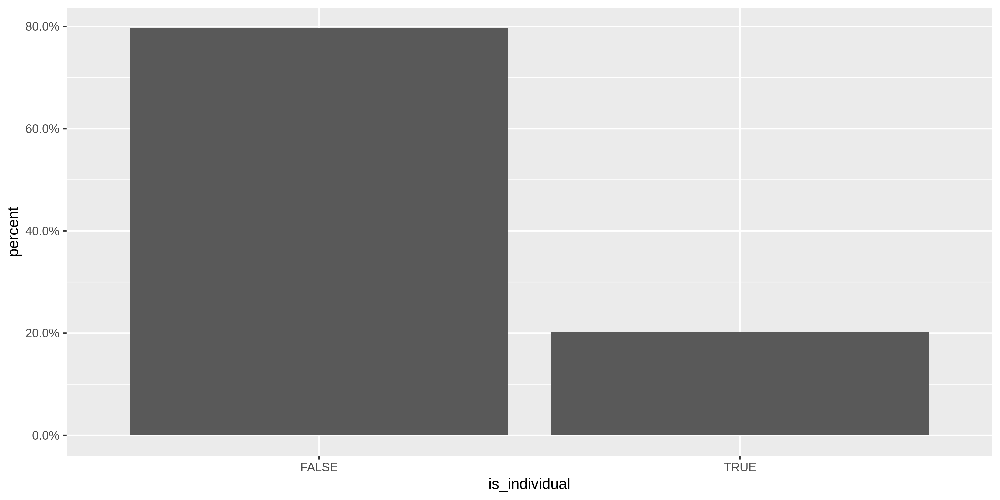
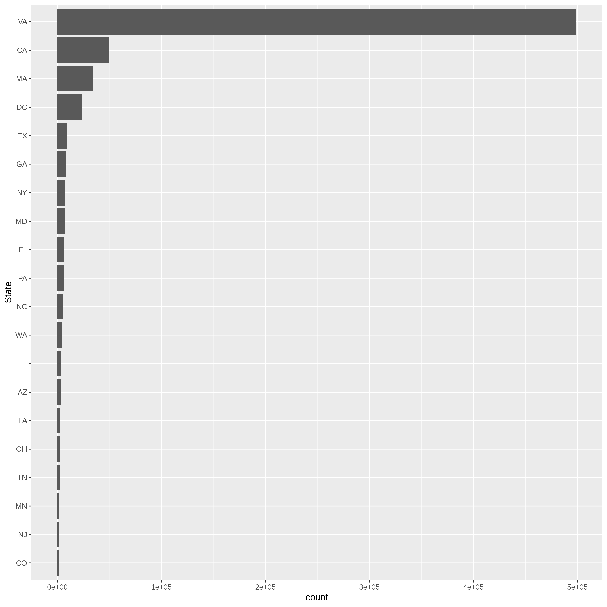
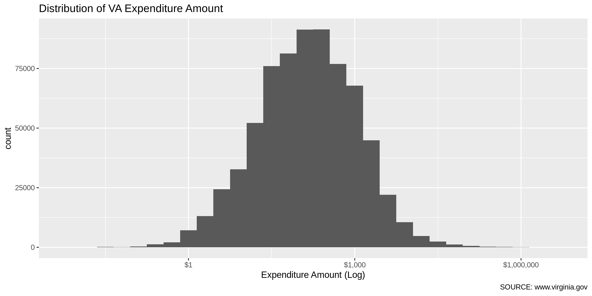
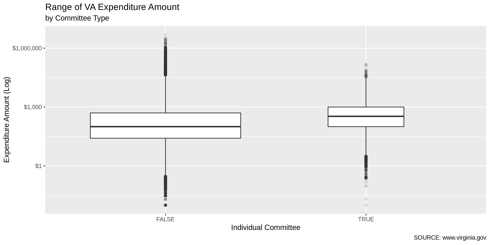
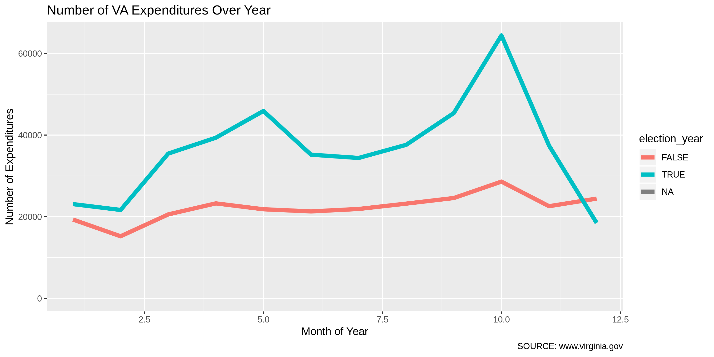

Virgina Expenditures Data Diary
================
Kiernan Nicholls
2022-11-05 14:00:10

-   <a href="#project" id="toc-project">Project</a>
-   <a href="#objectives" id="toc-objectives">Objectives</a>
-   <a href="#prerequisites" id="toc-prerequisites">Prerequisites</a>
-   <a href="#data" id="toc-data">Data</a>
-   <a href="#import" id="toc-import">Import</a>
-   <a href="#fix" id="toc-fix">Fix</a>
-   <a href="#explore" id="toc-explore">Explore</a>
-   <a href="#wrangle" id="toc-wrangle">Wrangle</a>
-   <a href="#export" id="toc-export">Export</a>

## Project

The Accountability Project is an effort to cut across data silos and
give journalists, policy professionals, activists, and the public at
large a simple way to search across huge volumes of public data about
people and organizations.

Our goal is to standardizing public data on a few key fields by thinking
of each dataset row as a transaction. For each transaction there should
be (at least) 3 variables:

1.  All **parties** to a transaction
2.  The **date** of the transaction
3.  The **amount** of money involved

## Objectives

This document describes the process used to complete the following
objectives:

1.  How many records are in the database?
2.  Check for duplicates
3.  Check ranges
4.  Is there anything blank or missing?
5.  Check for consistency issues
6.  Create a five-digit ZIP Code called `ZIP5`
7.  Create a `YEAR` field from the transaction date
8.  Make sure there is data on both parties to a transaction

## Prerequisites

The following packages are needed to collect, manipulate, visualize,
analyze, and communicate these results. The `pacman` package will
facilitate their installation and attachment.

``` r
pacman::p_load_gh("VerbalExpressions/RVerbalExpressions")
pacman::p_load_current_gh("irworkshop/campfin")
pacman::p_load(
  stringdist, # levenshtein value
  tidyverse, # data manipulation
  lubridate, # datetime strings
  tidytext, # text mining tools
  magrittr, # pipe opperators
  janitor, # dataframe clean
  zipcode, # clean & databse
  batman, # parse logicals
  refinr, # cluster & merge
  scales, #format strings
  rvest, # scrape website
  skimr, # summary stats
  vroom, # quickly read
  glue, # combine strings
  gluedown, #markdown
  here, # locate storage
  fs # search storage 
)
```

This document should be run as part of the `R_campfin` project, which
lives as a sub-directory of the more general, language-agnostic
[`irworkshop/accountability_datacleaning`](https://github.com/irworkshop/accountability_datacleaning "TAP repo")
GitHub repository.

The `R_campfin` project uses the [RStudio
projects](https://support.rstudio.com/hc/en-us/articles/200526207-Using-Projects "Rproj")
feature and should be run as such. The project also uses the dynamic
`here::here()` tool for file paths relative to *your* machine.

``` r
# where dfs this document knit?
here::here()
#> [1] "/Users/yanqixu/code/accountability_datacleaning"
```

## Data

Data is provided by the Virginia Department of Elections (ELECT). From
the campaign finance reporting home page, we can navigate to “Download
Campaign Finance Data” which takes us to the
[`SBE_CSV/CF/`](https://apps.elections.virginia.gov/SBE_CSV/CF/ "source")
subdirectory of the ELECT website.

On this page, there are additional subdirectories for each year from
1999 until 2012. There are additional subdirectories for each month from
January 2012 to June 2019.

The new update includes datasets from July 2019 to Nov. 2022.

Inside each subdirectory of `/SBE_CSV/CF/`, there are separate CSV files
for each form submitted by committees. Expenditure data is reported by
candidates and committees using “Schedule D” forms, as described by the
[ELECT
website](https://www.elections.virginia.gov/candidatepac-info/campaign-finance-disclosure-forms/index.html):

> Schedule D – Itemization of Expenditures Use to report all
> expenditures incurred by a committee.

From the [instructions on how to fill our Schedule D
forms](https://www.elections.virginia.gov/media/formswarehouse/Campaign-Finance/2018/CampaignFinance/Schedules/2014Schedule-D-Instructions.pdf "instructions"),
we know the following data is included:

1.  The full name of person or company paid and the complete mailing
    address of payee
2.  The description of the item or service purchased
3.  The name of the individual who authorized the expenditure
4.  The date the expense was incurred
5.  The amount of the expenditure

## Import

Schedule D bulk downloads are saved as CSV files, which can easily be
imported once downloaded.

### Download

In the yearly subdirectories (e.g., `/SBE_CSV/CF/2010/`), schedule D
data is separated into two files:

1.  `SBE_CSV/CF/2010/ScheduleD.csv` (5MB)
2.  `SBE_CSV/CF/2010/ScheduleD_PAC.csv` (115KB)

For years after 2011, the files are organized by month and are not
separated:

1.  `SBE_CSV/CF/2013_02/ScheduleD.csv`

We will start by downloading all the files separated by month from 2012
to 2019.

First we need to create the URLs for each year/month combination.

``` r
#sub_dirs <- unlist(map(2012:2019, str_c, str_pad(1:12, 2, side = "left", pad = "0"), sep = "_"))
sub_dirs <- unlist(map(2019:2022, str_c, str_pad(1:12, 2, side = "left", pad = "0"), sep = "_"))
exp_urls <- sort(glue("https://apps.elections.virginia.gov/SBE_CSV/CF/{sub_dirs}/ScheduleD.csv"))
exp_urls <- exp_urls[7:(length(sub_dirs)-1)]
head(exp_urls)
```

    #> https://apps.elections.virginia.gov/SBE_CSV/CF/2019_07/ScheduleD.csv
    #> https://apps.elections.virginia.gov/SBE_CSV/CF/2019_08/ScheduleD.csv
    #> https://apps.elections.virginia.gov/SBE_CSV/CF/2019_09/ScheduleD.csv
    #> https://apps.elections.virginia.gov/SBE_CSV/CF/2019_10/ScheduleD.csv
    #> https://apps.elections.virginia.gov/SBE_CSV/CF/2019_11/ScheduleD.csv
    #> https://apps.elections.virginia.gov/SBE_CSV/CF/2019_12/ScheduleD.csv

``` r
exp_urls %>% 
  tail() %>% 
  md_code() %>% 
  md_bullet()
```

    #> * `https://apps.elections.virginia.gov/SBE_CSV/CF/2022_06/ScheduleD.csv`
    #> * `https://apps.elections.virginia.gov/SBE_CSV/CF/2022_07/ScheduleD.csv`
    #> * `https://apps.elections.virginia.gov/SBE_CSV/CF/2022_08/ScheduleD.csv`
    #> * `https://apps.elections.virginia.gov/SBE_CSV/CF/2022_09/ScheduleD.csv`
    #> * `https://apps.elections.virginia.gov/SBE_CSV/CF/2022_10/ScheduleD.csv`
    #> * `https://apps.elections.virginia.gov/SBE_CSV/CF/2022_11/ScheduleD.csv`

Then we can download these files to our `/data/raw/single/` directory.

``` r
raw_dir <- here("state","va", "expends", "data", "raw", "single")
dir_create(raw_dir)

raw_names <- basename(str_replace(exp_urls, "/(?=[^/]*$)", "_"))
raw_paths <- path(raw_dir, raw_names)

# if (!all_files_new(dir_raw)) {
#   for (url in exp_urls {
#     download.file(
#       url = url,
#       destfile = str_c(
#         dir_raw,
#         url %>% 
#           str_extract("(\\d{4}_\\d{2})/ScheduleD.csv$") %>% 
#           str_replace_all("/", "_"),
#         sep = "/"
#       )
#     )
#   }
# }

for (i in seq_along(raw_paths)) {
  wait = 1
  if (file_exists(raw_paths[i])) {
    next("file already downloaded")
  } else {
    httr::GET(exp_urls[i],user_agent("Mozilla/5.0"), write_disk(raw_paths[i]))
    x <- read_lines(raw_paths[i])
    if (str_starts(x[1], "#")) {
      next("file already fixed")
    } else {
      x <- str_replace_all(x, "(?<!^|,|\r\n)\"(?!,|\r\n|$)", "'")
      x <- c("### file fixed", x)
      write_lines(x, raw_paths[i])
      Sys.sleep(time = wait)
    }
  }
}
```

## Fix

To properly read the file into R, we first have to do some simple string
processing to the text file.

``` r
raw_info <- dir_info(raw_dir)
fix_dir <- dir_create(path(dirname(raw_dir), "fix"))
fix_eval <- length(dir_ls(fix_dir)) != nrow(raw_info)
```

``` r
# for old format files
for (f in raw_info$path) {
  n <- path(fix_dir, str_c("FIX", basename(f), sep = "_"))
  x <- read_lines(f, skip = 1)
  for (i in rev(seq_along(x))) {
    y <- i - 1
    if (y == 0) {
      next() # skip first
    } else if (str_starts(x[i], "\"\\d+\",") | str_ends(x[y], "\"(Y|N)\"")) {
      next() # skip if good
    } else { # merge if bad
      x[y] <- str_c(x[y], x[i])
      x <- x[-i] # remove bad
    }
  }
  x <- str_remove(x, '(?<=")"(?!,)')
  write_lines(x, n)
  message(basename(n))
}
```

``` r
# new format files
for (f in raw_info$path[1:length(raw_info$path)]) {
  n <- path(fix_dir, str_c("FIX", basename(f), sep = "_"))
  x <- read_lines(f, skip = 1)
  for (i in rev(seq_along(x))) {
    if (str_starts(x[i], "\\d+,\\d+,")) {
      next() # skip if good
    } else { # merge if bad
      x[i - 1] <- str_c(x[i - 1], x[i])
      x <- x[-i] # remove bad
    }
  }
  write_lines(x, n)
  message(basename(n))
}
```

``` r
fix_info <- as_tibble(dir_info(fix_dir))
sum(fix_info$size)
```

    #> 103M

``` r
fix_info %>% 
  select(path, size, modification_time) %>% 
  mutate(across(path, basename))
```

    #> # A tibble: 41 × 3
    #>    path                             size modification_time  
    #>    <chr>                     <fs::bytes> <dttm>             
    #>  1 FIX_2019_07_ScheduleD.csv       5.71M 2022-11-02 22:04:13
    #>  2 FIX_2019_08_ScheduleD.csv       1.07M 2022-11-02 22:04:15
    #>  3 FIX_2019_09_ScheduleD.csv        4.7M 2022-11-02 22:04:18
    #>  4 FIX_2019_10_ScheduleD.csv       9.61M 2022-11-02 22:04:23
    #>  5 FIX_2019_11_ScheduleD.csv      798.2K 2022-11-02 22:04:23
    #>  6 FIX_2019_12_ScheduleD.csv       4.22M 2022-11-02 22:04:25
    #>  7 FIX_2020_01_ScheduleD.csv       5.57M 2022-11-02 22:04:28
    #>  8 FIX_2020_02_ScheduleD.csv      80.03K 2022-11-02 22:04:28
    #>  9 FIX_2020_03_ScheduleD.csv      191.3K 2022-11-02 22:04:29
    #> 10 FIX_2020_04_ScheduleD.csv       1.76M 2022-11-02 22:04:29
    #> # … with 31 more rows

### Read

Since all recent files are located in the same directory with the same
structure, we can read them all at once by using `purrr::map()` to apply
`readr::read_csv()` to each file in the directory, then binding each
file into a single data frame using `dplyr::bind_rows()`.

``` r
va <- 
  dir_ls(fix_dir, glob = "*.csv") %>% 
  map_dfr(
    read_delim,
    delim = ",",
    na = c("NA", "N/A", ""),
    escape_double = FALSE,
    col_types = cols(
      .default = col_character(),
      IsIndividual = col_logical(),
      TransactionDate = col_date("%m/%d/%Y"),
      Amount = col_double()
    )
  ) %>% 
  clean_names()
```

The older files, separated by payee type, have a different structure and
will have to be imported, explored, and cleaned seperated from the
recent files.

## Explore

There are 500936 records of 20 variables in the full database.

``` r
glimpse(sample_frac(va))
```

    #> Rows: 500,936
    #> Columns: 20
    #> $ schedule_d_id        <chr> "2561989", "3410925", "4014868", "3166613", "3651501", "3527791", "4…
    #> $ report_id            <chr> "170431", "249779", "299302", "231142", "264810", "256785", "298922"…
    #> $ committee_contact_id <chr> "25608", NA, "939331", "222267", "860487", NA, "188562", NA, "671271…
    #> $ first_name           <chr> NA, "Lucy", NA, NA, "Samuel", NA, NA, NA, NA, NA, NA, NA, "William",…
    #> $ middle_name          <chr> NA, NA, NA, NA, "E", NA, NA, NA, NA, NA, NA, NA, NA, NA, NA, NA, NA,…
    #> $ last_or_company_name <chr> "Lopez for Delegate", "Barrett", "SignRocket.com", "USPS - Cave Spri…
    #> $ prefix               <chr> NA, NA, NA, NA, NA, NA, NA, NA, NA, NA, NA, NA, NA, NA, NA, NA, NA, …
    #> $ suffix               <chr> NA, NA, NA, NA, NA, NA, NA, NA, NA, NA, NA, NA, NA, NA, NA, NA, NA, …
    #> $ address_line1        <chr> "P.O. Box 40366", "PO 2306", "340 Broadway Ave", "4069 Postal Drive"…
    #> $ address_line2        <chr> NA, NA, NA, NA, NA, NA, NA, NA, NA, NA, NA, NA, NA, NA, NA, NA, NA, …
    #> $ city                 <chr> "Arlington", "Arlington", "St. Paul Park", "Roanoke", "Appomattox", …
    #> $ state_code           <chr> "VA", "VA", "MN", "VA", "VA", "VA", "VA", "VA", "NJ", "OR", "MA", "C…
    #> $ zip_code             <chr> "22204", "22202", "55071", "24018", "24522", "23236", "22116", "2311…
    #> $ is_individual        <lgl> FALSE, TRUE, FALSE, FALSE, TRUE, FALSE, FALSE, FALSE, FALSE, FALSE, …
    #> $ transaction_date     <date> 2019-05-06, 2021-05-28, 2022-09-12, 2020-10-22, 2021-08-28, 2021-04…
    #> $ amount               <dbl> 500.00, 3288.13, 760.00, 143.00, 269.92, 59.32, 25.00, 18.00, 4996.8…
    #> $ authorizing_name     <chr> "Josh Levi", "KG", "Kim Bentley II", "David Suetterlein", "Dirt Chea…
    #> $ item_or_service      <chr> "Campaign Contribution", "Payroll", "Yard signs", "PO Box Rental", "…
    #> $ schedule_id          <chr> NA, NA, NA, NA, NA, NA, NA, NA, NA, NA, NA, NA, NA, NA, NA, NA, NA, …
    #> $ report_uid           <chr> "{BEE826B9-8CB8-CB2F-6B1F-1697298FBAAA}", "{8CD84033-9285-548F-C70A-…

### Distinct

The variables range in their degree of distinctness.

``` r
va %>% 
  map(n_distinct) %>% 
  unlist() %>% 
  enframe(name = "variable", value = "n_distinct") %>% 
  mutate(prop_distinct = round(n_distinct / nrow(va), 4))
```

    #> # A tibble: 20 × 3
    #>    variable             n_distinct prop_distinct
    #>    <chr>                     <int>         <dbl>
    #>  1 schedule_d_id            500936        1     
    #>  2 report_id                 27268        0.0544
    #>  3 committee_contact_id      86443        0.173 
    #>  4 first_name                 6182        0.0123
    #>  5 middle_name                 756        0.0015
    #>  6 last_or_company_name      45105        0.09  
    #>  7 prefix                        1        0     
    #>  8 suffix                        1        0     
    #>  9 address_line1             57688        0.115 
    #> 10 address_line2              3616        0.0072
    #> 11 city                       5158        0.0103
    #> 12 state_code                   58        0.0001
    #> 13 zip_code                  14639        0.0292
    #> 14 is_individual                 2        0     
    #> 15 transaction_date           3480        0.0069
    #> 16 amount                    66213        0.132 
    #> 17 authorizing_name           8671        0.0173
    #> 18 item_or_service           59645        0.119 
    #> 19 schedule_id                  11        0     
    #> 20 report_uid                21418        0.0428

We can explore the distribution of the least distinct values with
`ggplot2::geom_bar()`.

<!-- -->

Or, filter the data and explore the most frequent discrete data.

<!-- -->

The `item_or_service` variable is an open-ended text field, so we can
only analyze it by frequency or word tokens.

``` r
va %>% 
  unnest_tokens(word, item_or_service) %>% 
  mutate(word = str_to_lower(word)) %>%
  count(word, sort = TRUE) %>% 
  anti_join(stop_words) %>% 
  head(20) %>% 
  ggplot() + 
  geom_col(aes(reorder(word, n), n)) +
  coord_flip() +
  labs(x = "Word", y = "count")
```

<!-- -->

### Missing

The variables also vary in their degree of values that are `NA`
(missing).

``` r
va %>% 
  map(function(var) sum(is.na(var))) %>% 
  unlist() %>% 
  enframe(name = "variable", value = "n_na") %>% 
  mutate(prop_na = n_na / nrow(va))
```

    #> # A tibble: 20 × 3
    #>    variable               n_na   prop_na
    #>    <chr>                 <int>     <dbl>
    #>  1 schedule_d_id             0 0        
    #>  2 report_id                 0 0        
    #>  3 committee_contact_id 202797 0.405    
    #>  4 first_name           416238 0.831    
    #>  5 middle_name          489426 0.977    
    #>  6 last_or_company_name     11 0.0000220
    #>  7 prefix               500936 1        
    #>  8 suffix               500936 1        
    #>  9 address_line1           980 0.00196  
    #> 10 address_line2        421764 0.842    
    #> 11 city                    627 0.00125  
    #> 12 state_code             1901 0.00379  
    #> 13 zip_code                618 0.00123  
    #> 14 is_individual             0 0        
    #> 15 transaction_date          0 0        
    #> 16 amount                    0 0        
    #> 17 authorizing_name      47993 0.0958   
    #> 18 item_or_service        1485 0.00296  
    #> 19 schedule_id          500921 1.00     
    #> 20 report_uid                0 0

### Duplicates

We can use `janitor::get_dupes()` to create a table only including
records that are completely duplicated across every row, aside from the
uniqe `schedule_d_id` variable.

``` r
va_dupes <- va %>% 
  select(-schedule_d_id) %>% 
  get_dupes() %>% 
  distinct() %>% 
  mutate(dupe_flag = TRUE)
```

There are 4743 distinct duplicated records in this database, covering
12868 total records. It’s entirely possible that two expenditures can be
made by the same committee, to the same payeee, of the same amount, on
the same day, for the same purpose. However, we will flag these records
with `dupe_flag` nonetheless.

``` r
va_dupes %>% 
  tabyl(item_or_service) %>%
  as_tibble() %>% 
  arrange(desc(n)) %>% 
  mutate(cum_percent = cumsum(percent))
```

    #> # A tibble: 666 × 5
    #>    item_or_service                 n percent valid_percent cum_percent
    #>    <chr>                       <int>   <dbl>         <dbl>       <dbl>
    #>  1 Contribution Fee              943  0.199         0.199        0.199
    #>  2 Contribution Refund           229  0.0483        0.0483       0.247
    #>  3 Refund to Contributor         199  0.0420        0.0420       0.289
    #>  4 Processing Fee                193  0.0407        0.0407       0.330
    #>  5 Contribution processing fee   151  0.0318        0.0319       0.362
    #>  6 Processing fee                145  0.0306        0.0306       0.392
    #>  7 Fee                           117  0.0247        0.0247       0.417
    #>  8 Wire Fee                      105  0.0221        0.0222       0.439
    #>  9 Bank Fee                      103  0.0217        0.0217       0.461
    #> 10 Advertising                    66  0.0139        0.0139       0.475
    #> # … with 656 more rows

``` r
va <- va %>%
  left_join(va_dupes) %>% 
  mutate(dupe_flag = !is.na(dupe_flag))
```

### Ranges

It’s important to ensure the ranges for continuous variables makes
sense; that there aren’t any old or future dates or trillion dollar
expenditures. We can explore these variables with `ggplot2::ggplot()`
functions and `base::summary()`.

#### Amounts

The expenditure `amount` variable contains the USD value of the
expenditure and can reasonably reach millions of dollars. This dataset
contains 0 records with an `amount` value less than zero, which
sometimes indicate expenditure correction filings. There are however 6
records with an `amount` value *of* zero.

``` r
summary(va$amount)
```

    #>      Min.   1st Qu.    Median      Mean   3rd Qu.      Max. 
    #>       0.0      25.0     120.1    2071.5     614.2 3078578.5

``` r
va %>% filter(amount == max(amount, na.rm = TRUE)) %>% glimpse()
```

    #> Rows: 1
    #> Columns: 22
    #> $ schedule_d_id        <chr> "3607640"
    #> $ report_id            <chr> "262144"
    #> $ committee_contact_id <chr> NA
    #> $ first_name           <chr> NA
    #> $ middle_name          <chr> NA
    #> $ last_or_company_name <chr> "Grassroots Media LLC"
    #> $ prefix               <chr> NA
    #> $ suffix               <chr> NA
    #> $ address_line1        <chr> "2 Bala Blaza"
    #> $ address_line2        <chr> "Ste 300"
    #> $ city                 <chr> "Bala Cynwyd"
    #> $ state_code           <chr> "PA"
    #> $ zip_code             <chr> "19004"
    #> $ is_individual        <lgl> FALSE
    #> $ transaction_date     <date> 2021-10-21
    #> $ amount               <dbl> 3078578
    #> $ authorizing_name     <chr> "Lillie Louise Lucas"
    #> $ item_or_service      <chr> "Media Buy"
    #> $ schedule_id          <chr> NA
    #> $ report_uid           <chr> "{995FA0DA-EBC4-934C-2D45-D4C7004FC35D}"
    #> $ dupe_count           <int> NA
    #> $ dupe_flag            <lgl> FALSE

We can visually explore the distribution and range of `amount` values
using `ggplot2::geom_histogram()` and `ggplot2::geom_boxplot()`.

Expenditures have a Log-normal distribution, with the vast majority of
expenditures around the mean of \$1,385.

``` r
va %>% 
  select(amount) %>% 
  mutate(oom = 10^(ceiling(log10(amount)))) %>% 
  count(oom) %>% 
  arrange(oom) %>%
  mutate(oom = as.ordered(oom)) %>% 
  ggplot() +
  geom_col(aes(oom, n)) +
  labs(
    title = "Distribution of VA Expenditures by Amount Order of Magnitude",
    x = "Order of Magnitude",
    y = "Count"
  )
```

<!-- -->

<!-- -->

We will have to transformt he x-axis logarithmically to find patterns in
the distribution.

<!-- -->

We can use `ggplot2::facet_wrap()` to explore that distribution for both
individual (candidate) committees and more general issue committees.

<!-- -->

<!-- -->

<!-- -->

### Dates

The quasi-continuous variable `transaction_date` should also be explored
for a reasonable range. There are no expenditures made before 2012-01-03
and 3 expenditures reported as being made in the future.

``` r
summary(va$transaction_date)
#>         Min.      1st Qu.       Median         Mean      3rd Qu.         Max. 
#> "2012-01-03" "2019-09-30" "2020-11-12" "2020-08-14" "2021-08-31" "2022-12-31"
```

<!-- -->

<!-- -->

## Wrangle

To improve the searchability of the data on the TAP website, we will
endeavor to normalize character strings, correct misspellings, flag
undisambiguatable values. Original variables will remain immutable, all
records will be preserved, and manipulated versions of each variable
take the form `*_clean`.

### Year

Create a `transaction_year` variable from `transaction_date` using
`lubridate::year()` after parsing the character string earlier with
`readr::col_date()`.

``` r
va <- va %>% mutate(transaction_year = year(transaction_date))
```

### Address

The `address` variable should be minimally cleaned by removing
punctuation and fixing white-space.

``` r
str_normalize <- function(string) {
  string %>% 
    str_to_upper() %>% 
    str_replace("-", " ") %>% 
    str_remove_all(rx_punctuation()) %>% 
    str_trim() %>% 
    str_squish() %>% 
    na_if("") %>% 
    na_if("NA")
}
```

``` rclean_address1
va <- va %>% 
  mutate(
    address1_clean = str_normalize(address_line1),
    address2_clean = str_normalize(address_line2)
  )

va %>% 
  filter(address_line1 != address1_clean) %>%
  select(address_line1, address1_clean) %>% 
  sample_n(10)
```

### Zipcode

``` r
va <- va %>% 
  mutate(
    zip_clean = zip_code %>% 
      str_remove_all(rx_whitespace()) %>%
      str_remove_all(rx_digit(inverse = TRUE)) %>% 
      str_pad(width = 5, pad = "0") %>% 
      str_sub(1, 5) %>%
      na_if("00000") %>% 
      na_if("11111") %>% 
      na_if("99999") %>% 
      na_if("")
  )
```

### State

Using comprehensive list of state abbreviations in the Zipcodes
database, we can isolate invalid `state` values and manually correct
them.

``` r
valid_state <- c(unique(campfin::zipcodes$state), "AB", "BC", "MB", "NB", "NS", "ON", "PE", "QC", "SK")
length(valid_state)
#> [1] 71
setdiff(valid_state, state.abb)
#>  [1] "PR" "VI" "AE" "DC" "AA" "AP" "AS" "GU" "PW" "FM" "MP" "MH" "AB" "BC" "MB" "NB" "NS" "ON" "PE"
#> [20] "QC" "SK"
```

``` r
setdiff(va$state_code, valid_state)
#> [1] NA
va <- va %>% mutate(state_clean = state_code %>% str_replace("New York", "NY"))
```

### City

``` r
valid_city <- unique(campfin::zipcodes$city)
n_distinct(va$city)
#> [1] 5158
mean(va$city %in% campfin::zipcodes$city)
#> [1] 0.102011
```

Cleaning city values is the most complicated. This process involves four
steps:

1.  Prepare raw city values by removing invalid data and reducing
    inconsistencies
2.  Match prepared city values with the *actual* city name of that
    record’s ZIP code
3.  swap prepared city values with the ZIP code match *if* only 1 edit
    is needed
4.  Refine swapped city values with key collision and n-gram
    fingerprints

#### Normalize

We will use the `prep_city()` function in the `/R` directory to
normalize the strings, remove some common `NA` values, and lop
abbreviations off the end of the string.

``` r
va <- va %>%
  mutate(
    city_norm = normal_city(
      city = city,
      na = invalid_city,,
      states = c("VA", "VIRGINIA", "MA", "DC", "TX")
    ) %>% 
      str_replace("^VA\\b", "VIRGINIA")
  )

n_distinct(va$city_norm)
#> [1] 3851
```

#### Match

To disambiguate the city values, we will look at the *expected* city
name for a given ZIP code. We can calculate the edit distance between
each original value and the expected value.

``` r
va <- va %>%
  left_join(
    zipcodes,
    by = c(
      "state_clean" = "state",
      "zip_clean" = "zip"
    )
  ) %>%
  rename(city = city.x, city_match = city.y) %>%
  mutate(match_dist = stringdist(city_norm, city_match))
```

``` r
summary(va$match_dist)
```

    #>    Min. 1st Qu.  Median    Mean 3rd Qu.    Max.    NA's 
    #>   0.000   0.000   0.000   0.432   0.000  35.000    9803

``` r
va %>% 
  count(perf_match = match_dist == 0) %>% 
  mutate(p = n/sum(n))
```

    #> # A tibble: 3 × 3
    #>   perf_match      n      p
    #>   <lgl>       <int>  <dbl>
    #> 1 FALSE       31087 0.0621
    #> 2 TRUE       460046 0.918 
    #> 3 NA           9803 0.0196

``` r
va %>% 
    filter(match_dist == 1) %>% 
    count(city_norm, city_match, sort = TRUE)
```

    #> # A tibble: 659 × 3
    #>    city_norm     city_match        n
    #>    <chr>         <chr>         <int>
    #>  1 SOMMERVILLE   SOMERVILLE      604
    #>  2 SAN FRANSISCO SAN FRANCISCO   496
    #>  3 CENTERVILLE   CENTREVILLE     251
    #>  4 MENIO PARK    MENLO PARK      212
    #>  5 MC LEAN       MCLEAN          147
    #>  6 MENLOW PARK   MENLO PARK      128
    #>  7 SOMERVBILLE   SOMERVILLE       99
    #>  8 WINSTONSALEM  WINSTON SALEM    89
    #>  9 SAN JOE       SAN JOSE         88
    #> 10 MOUTAIN VIEW  MOUNTAIN VIEW    81
    #> # … with 649 more rows

#### Swap

If the edit distance is less than or equal to two, we can fairly safely
use the actual, expected value instead of the original value.

``` r
va <- va %>% 
  mutate(
    city_swap = if_else(
      condition = match_dist <= 2, 
      true = city_match, 
      false = city_norm
    )
  )

n_distinct(va$city_swap)
#> [1] 2850
```

There are still 22344 records with a `city_swap` value not in our list
of valid city names. Many, if not most, of these values are actually
acceptable city names that are simply not in our list.

``` r
va %>% 
  filter(city_swap %out% valid_city) %>%
  count(city_swap, sort = TRUE)
```

    #> # A tibble: 476 × 2
    #>    city_swap              n
    #>    <chr>              <int>
    #>  1 <NA>                9803
    #>  2 WEST SOMERVILLE     3983
    #>  3 NORTH CHESTERFIELD  1821
    #>  4 DALE CITY            400
    #>  5 MANASSAS PARK        367
    #>  6 FAIRLAWN             348
    #>  7 POTOMAC FALLS        316
    #>  8 CHESTERBROOK         299
    #>  9 SOUTH RIDING         271
    #> 10 ST PAUL PARK         213
    #> # … with 466 more rows

#### Refine

We can use the OpenRefine clustering algorithms to further cluster and
merge similar values. We will create a new table of these refined
values.

``` r
va_refined <- va %>%
  filter(match_dist != 1) %>% 
  mutate(
    city_refine = if_else(
      condition = match_dist > 2,
      true = city_swap %>% 
        key_collision_merge() %>% 
        n_gram_merge(),
      false = city_swap
    )
  ) %>% 
  filter(city_refine != city_swap) %>% 
  rename(city_raw = city) %>% 
  select(
    schedule_d_id,
    state_clean,
    zip_clean,
    city_raw,
    city_norm,
    city_match,
    city_swap,
    city_refine
  )
```

#### Review

The algorithms rely on comparing the relative frequencies of two similar
values, rather than a list of *actual* values. This can cause some
accidential changes to be made.

``` r
va_refined %>% 
  select(-schedule_d_id) %>%
  distinct()
```

    #> # A tibble: 39 × 7
    #>    state_clean zip_clean city_raw         city_norm       city_match       city_swap       city_r…¹
    #>    <chr>       <chr>     <chr>            <chr>           <chr>            <chr>           <chr>   
    #>  1 NY          14445     E Rochester      E ROCHESTER     EAST ROCHESTER   E ROCHESTER     ROCHEST…
    #>  2 VA          22103     McClean          MCCLEAN         WEST MCLEAN      MCCLEAN         MCLEAN  
    #>  3 VA          23860     N Prince George  N PRINCE GEORGE HOPEWELL         N PRINCE GEORGE PRINCE …
    #>  4 VA          23860     N. Prince George N PRINCE GEORGE HOPEWELL         N PRINCE GEORGE PRINCE …
    #>  5 VA          22201     Washingtong DC   WASHINGTONG     ARLINGTON        WASHINGTONG     WASHING…
    #>  6 VA          20111     Mansassas Park   MANSASSAS PARK  MANASSAS         MANSASSAS PARK  MANASSA…
    #>  7 VA          23834     S  Chesterfield  S CHESTERFIELD  COLONIAL HEIGHTS S CHESTERFIELD  CHESTER…
    #>  8 VA          23803     S Chesterfield   S CHESTERFIELD  PETERSBURG       S CHESTERFIELD  CHESTER…
    #>  9 VA          23860     n. Prince George N PRINCE GEORGE HOPEWELL         N PRINCE GEORGE PRINCE …
    #> 10 VA          23803     S. Chesterfield  S CHESTERFIELD  PETERSBURG       S CHESTERFIELD  CHESTER…
    #> # … with 29 more rows, and abbreviated variable name ¹​city_refine

``` r
va_refined %>% 
  count(state_clean, city_refine, sort = TRUE)
```

    #> # A tibble: 34 × 3
    #>    state_clean city_refine             n
    #>    <chr>       <chr>               <int>
    #>  1 MA          SOMERVILLE             37
    #>  2 VA          CHESTERFIELD           24
    #>  3 NY          ROCHESTER              17
    #>  4 VA          PRINCE GEORGE          16
    #>  5 CA          MENLO PARK CA          14
    #>  6 MN          BLOOMINGTON            11
    #>  7 VA          WILSON                  7
    #>  8 CA          SAN JOSE CALIFORNIA     5
    #>  9 VA          BAILEYS CROSSROADS      4
    #> 10 FL          NEWPORT                 2
    #> # … with 24 more rows

``` r
cva_refined <- va_refined %>% 
  inner_join(
    zipcodes,
    by = c(
      "city_refine" = "city",
      "state_clean" = "state"
    )
  ) %>% 
  select(schedule_d_id, city_refine)
```

#### Join

``` r
va <- va %>% 
  left_join(va_refined) %>% 
  mutate(
    city_clean = if_else(
      condition = is.na(city_refine),
      true = city_swap,
      false = city_refine
    )
  )
```

#### Progress

Our goal for normalization was to increase the proportion of city values
known to be valid and reduce the total distinct values by correcting
misspellings.

| stage                                                           | prop_in | n_distinct | prop_na | n_out | n_diff |
|:----------------------------------------------------------------|--------:|-----------:|--------:|------:|-------:|
| toupper(va$city_raw) | 0.065| 38| 1.000| 157| 34| |va$city_norm |   0.979 |       3851 |   0.003 | 10437 |   1255 |
| va$city_swap | 0.992| 2850| 0.020| 3820| 374| |va$city_refine   |   0.845 |         34 |   1.000 |    26 |      7 |

You can see how the percentage of valid values increased with each
stage.

<!-- -->

More importantly, the number of distinct values decreased each stage. We
were able to confidently change many distinct invalid values to their
valid equivalent.

<!-- -->

## Export

``` r
proc_dir <- here("state","va", "expends", "data", "processed")
dir_create(proc_dir)

va %>% 
  select(
    -address_line1,
    -address_line2,
    -zip_code,
    -state_code,
    -city,
    -city_norm,
    -city_match,
    -match_dist
  ) %>% 
  write_csv(
    na = "",
    path = str_c(proc_dir, "va_expends_clean_201907-202211.csv", sep = "/")
  )
```
