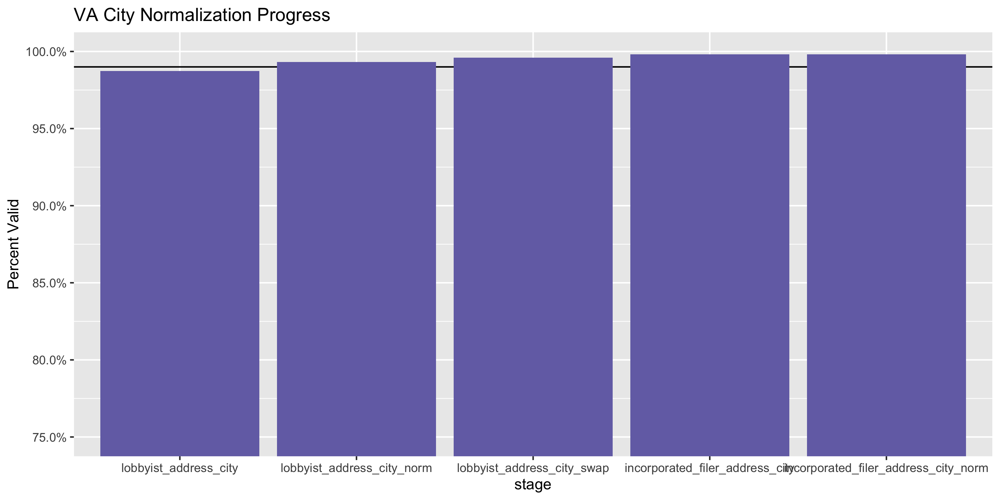
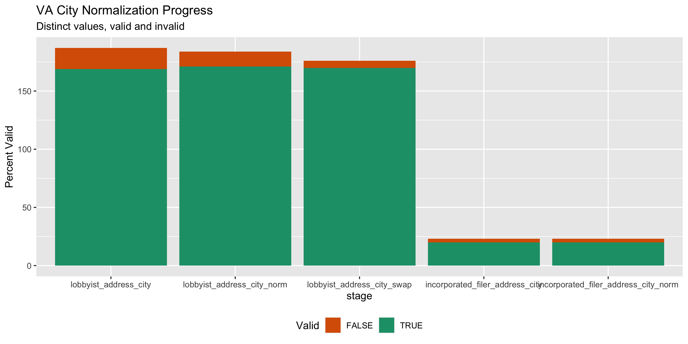

Virginia Lobbying Diary
================
Yanqi Xu
2020-07-12 15:12:32

  - [Project](#project)
  - [Objectives](#objectives)
  - [Packages](#packages)
  - [Data](#data)
  - [Import](#import)
  - [Explore](#explore)
  - [Wrangle](#wrangle)
  - [Conclude](#conclude)
  - [Export](#export)

<!-- Place comments regarding knitting here -->

## Project

The Accountability Project is an effort to cut across data silos and
give journalists, policy professionals, activists, and the public at
large a simple way to search across huge volumes of public data about
people and organizations.

Our goal is to standardizing public data on a few key fields by thinking
of each dataset row as a transaction. For each transaction there should
be (at least) 3 variables:

1.  All **parties** to a transaction.
2.  The **date** of the transaction.
3.  The **amount** of money involved.

## Objectives

This document describes the process used to complete the following
objectives:

1.  How many records are in the database?
2.  Check for entirely duplicated records.
3.  Check ranges of continuous variables.
4.  Is there anything blank or missing?
5.  Check for consistency issues.
6.  Create a five-digit ZIP Code called `zip`.
7.  Create a `year` field from the transaction date.
8.  Make sure there is data on both parties to a transaction.

## Packages

The following packages are needed to collect, manipulate, visualize,
analyze, and communicate these results. The `pacman` package will
facilitate their installation and attachment.

The IRW’s `campfin` package will also have to be installed from GitHub.
This package contains functions custom made to help facilitate the
processing of campaign finance data.

``` r
if (!require("pacman")) install.packages("pacman")
pacman::p_load_current_gh("irworkshop/campfin")
pacman::p_load(
  readxl, # read excel files
  rvest, # used to scrape website and get html elements
  tidyverse, # data manipulation
  stringdist, # calculate distances between strings
  lubridate, # datetime strings
  magrittr, # pipe opperators
  janitor, # dataframe clean
  refinr, # cluster and merge
  scales, # format strings
  knitr, # knit documents
  vroom, # read files fast
  httr, # http queries
  glue, # combine strings
  here, # relative storage
  fs # search storage 
)
```

This document should be run as part of the `R_campfin` project, which
lives as a sub-directory of the more general, language-agnostic
[`irworkshop/accountability_datacleaning`](https://github.com/irworkshop/accountability_datacleaning)
GitHub repository.

The `R_campfin` project uses the [Rstudio
projects](https://support.rstudio.com/hc/en-us/articles/200526207-Using-Projects "Rproj")
feature and should be run as such. The project also uses the dynamic
`here::here()` tool for file paths relative to *your* machine.

``` r
# where does this document knit?
here::here()
#> [1] "/Users/yanqixu/code/accountability_datacleaning/R_campfin"
```

## Data

Lobbyist data is obtained via a public record request from the [Virginia
Conflict of Interest and Ethics Advisory
Council](https://www.commonwealth.virginia.gov/va-government/lobbyists/)
on April 2 (2016-2017) and 24 (2018-2019) of 2020.

The Commonwealth’s [Disclosure Information Guide](guide) explains the
different schedules and reporting requirements.

This data diary handles processing of the lobbyist compensation and
expenditure data.

## Import

### Setting up Raw Data Directory

``` r
raw_dir <- dir_create(here("va", "lobby", "data", "raw"))
```

### Read

``` r
valr <- dir_ls(raw_dir, regexp = "Lobbyist Disclosures") %>% map_df(read_xlsx) %>% 
  clean_names()
```

## Explore

``` r
head(valr)
#> # A tibble: 6 x 79
#>   name  lobbying_year lobbyist principal disclosure_form… disclosure_fili… disclosure_stat…
#>   <chr> <chr>         <chr>    <chr>     <chr>            <lgl>            <chr>           
#> 1 REG2… Lobbying Yea… Christo… Virginia… Approved         NA               Approved        
#> 2 REG2… Lobbying Yea… Katheri… Dollar T… Approved         NA               Approved        
#> 3 REG2… Lobbying Yea… Mark Hi… Richmond… Approved         NA               Approved        
#> 4 REG2… Lobbying Yea… Mark Hi… Psychiat… Approved         NA               Approved        
#> 5 REG2… Lobbying Yea… Josie M… New Virg… Approved         NA               Approved        
#> 6 REG2… Lobbying Yea… Madelin… The Comm… Approved         NA               Approved        
#> # … with 72 more variables: filing_individual_for_incorporated_filing <chr>, filingtype <chr>,
#> #   form_received_date <dttm>, incorporated_filer_address_city <chr>,
#> #   incorporated_filer_address_line_1 <chr>, incorporated_filer_address_line_2 <chr>,
#> #   incorporated_filer_address_state <chr>, incorporated_filer_email <chr>,
#> #   incorporated_filer_first_name <chr>, incorporated_filer_last_name <chr>,
#> #   incorporated_filer_middle_name <chr>, incorporated_filer_phone <chr>,
#> #   incorporated_filer_suffix <chr>, incorportated_filer_address_zip <chr>,
#> #   itemized_entertainment_expense <dbl>, itemized_gift_expense <dbl>,
#> #   itemized_other_expense <dbl>, lobbying_firm_compensation_amount <dbl>,
#> #   lobbyist_activities <chr>, lobbyist_address_city <chr>, lobbyist_address_line_1 <chr>,
#> #   lobbyist_address_line_2 <chr>, lobbyist_address_state <chr>, lobbyist_address_zip <chr>,
#> #   lobbyist_compensation <chr>, lobbyist_compensation_amount <dbl>,
#> #   lobbyist_compensation_explanation <lgl>, lobbyist_electronic_signature_capture_date <dttm>,
#> #   lobbyist_electronic_signature_name <chr>, lobbyist_email <chr>, lobbyist_first_name <chr>,
#> #   lobbyist_job_title <chr>, lobbyist_last_name <chr>, lobbyist_middle_name <chr>,
#> #   lobbyist_organization <chr>, lobbyist_phone <chr>, lobbyist_suffix <chr>,
#> #   modified_by_delegate <chr>, original_signature_date <dttm>,
#> #   other_lobbyists_representing_principal <chr>, principal_authorizing_officer <chr>,
#> #   principal_authorizing_officer_address_line_1 <chr>,
#> #   principal_authorizing_officer_address_line_2 <chr>,
#> #   principal_authorizing_officer_address_state <chr>,
#> #   principal_authorizing_officer_address_zip <chr>, principal_authorizing_officer_email <chr>,
#> #   principal_authorizing_officer_first_name <chr>, principal_authorizing_officer_last_name <chr>,
#> #   principal_authorizing_officer_middle_name <chr>, principal_authorizing_officer_phone <chr>,
#> #   principal_authorizing_officer_suffix <chr>,
#> #   principal_electronic_signature_capture_date <dttm>, principal_electronic_signature_name <chr>,
#> #   principal_name <chr>, principal_waved_signature <chr>, registration_form <chr>,
#> #   total_communications_expense <dbl>, total_entertainment_expense <dbl>, total_expense <dbl>,
#> #   total_gift_expense <dbl>, total_honoraria_expense <dbl>,
#> #   total_lobbyist_compensation_expense <dbl>, total_office_expense <dbl>,
#> #   total_other_expense <dbl>, total_personal_living_and_traveling_expense <dbl>,
#> #   using_attached_schedules <chr>, web_user_will_attach_schedule_a <chr>,
#> #   web_user_will_attach_schedule_b <chr>, web_user_will_attach_schedule_c <chr>,
#> #   do_not_modify_disclosure <chr>, do_not_modify_row_checksum <chr>,
#> #   do_not_modify_modified_on <dttm>
tail(valr)
#> # A tibble: 6 x 79
#>   name  lobbying_year lobbyist principal disclosure_form… disclosure_fili… disclosure_stat…
#>   <chr> <chr>         <chr>    <chr>     <chr>            <lgl>            <chr>           
#> 1 2018… Lobbying Yea… William… Washingt… Approved         NA               Approved        
#> 2 2018… Lobbying Yea… William… Dominion… Approved         NA               Approved        
#> 3 2018… Lobbying Yea… William… Calpine … Approved         NA               Approved        
#> 4 2018… Lobbying Yea… William… Virginia… Approved         NA               Approved        
#> 5 2018… Lobbying Yea… Wilmer … Virginia… Approved         NA               Approved        
#> 6 2018… Lobbying Yea… Zachary… The Natu… Approved         NA               Approved        
#> # … with 72 more variables: filing_individual_for_incorporated_filing <chr>, filingtype <chr>,
#> #   form_received_date <dttm>, incorporated_filer_address_city <chr>,
#> #   incorporated_filer_address_line_1 <chr>, incorporated_filer_address_line_2 <chr>,
#> #   incorporated_filer_address_state <chr>, incorporated_filer_email <chr>,
#> #   incorporated_filer_first_name <chr>, incorporated_filer_last_name <chr>,
#> #   incorporated_filer_middle_name <chr>, incorporated_filer_phone <chr>,
#> #   incorporated_filer_suffix <chr>, incorportated_filer_address_zip <chr>,
#> #   itemized_entertainment_expense <dbl>, itemized_gift_expense <dbl>,
#> #   itemized_other_expense <dbl>, lobbying_firm_compensation_amount <dbl>,
#> #   lobbyist_activities <chr>, lobbyist_address_city <chr>, lobbyist_address_line_1 <chr>,
#> #   lobbyist_address_line_2 <chr>, lobbyist_address_state <chr>, lobbyist_address_zip <chr>,
#> #   lobbyist_compensation <chr>, lobbyist_compensation_amount <dbl>,
#> #   lobbyist_compensation_explanation <lgl>, lobbyist_electronic_signature_capture_date <dttm>,
#> #   lobbyist_electronic_signature_name <chr>, lobbyist_email <chr>, lobbyist_first_name <chr>,
#> #   lobbyist_job_title <chr>, lobbyist_last_name <chr>, lobbyist_middle_name <chr>,
#> #   lobbyist_organization <chr>, lobbyist_phone <chr>, lobbyist_suffix <chr>,
#> #   modified_by_delegate <chr>, original_signature_date <dttm>,
#> #   other_lobbyists_representing_principal <chr>, principal_authorizing_officer <chr>,
#> #   principal_authorizing_officer_address_line_1 <chr>,
#> #   principal_authorizing_officer_address_line_2 <chr>,
#> #   principal_authorizing_officer_address_state <chr>,
#> #   principal_authorizing_officer_address_zip <chr>, principal_authorizing_officer_email <chr>,
#> #   principal_authorizing_officer_first_name <chr>, principal_authorizing_officer_last_name <chr>,
#> #   principal_authorizing_officer_middle_name <chr>, principal_authorizing_officer_phone <chr>,
#> #   principal_authorizing_officer_suffix <chr>,
#> #   principal_electronic_signature_capture_date <dttm>, principal_electronic_signature_name <chr>,
#> #   principal_name <chr>, principal_waved_signature <chr>, registration_form <chr>,
#> #   total_communications_expense <dbl>, total_entertainment_expense <dbl>, total_expense <dbl>,
#> #   total_gift_expense <dbl>, total_honoraria_expense <dbl>,
#> #   total_lobbyist_compensation_expense <dbl>, total_office_expense <dbl>,
#> #   total_other_expense <dbl>, total_personal_living_and_traveling_expense <dbl>,
#> #   using_attached_schedules <chr>, web_user_will_attach_schedule_a <chr>,
#> #   web_user_will_attach_schedule_b <chr>, web_user_will_attach_schedule_c <chr>,
#> #   do_not_modify_disclosure <chr>, do_not_modify_row_checksum <chr>,
#> #   do_not_modify_modified_on <dttm>
glimpse(sample_n(valr, 20))
#> Rows: 20
#> Columns: 79
#> $ name                                         <chr> "2018-2019NicoleBarrancoVolkswagen Group of…
#> $ lobbying_year                                <chr> "Lobbying Year 2018-2019", "Lobbying Year 2…
#> $ lobbyist                                     <chr> "Nicole Barranco", "David Hallock", "Andrew…
#> $ principal                                    <chr> "Volkswagen Group of America, Inc", "InnovA…
#> $ disclosure_form_status                       <chr> "Approved", "Approved", "Approved", "Approv…
#> $ disclosure_filing_period                     <lgl> NA, NA, NA, NA, NA, NA, NA, NA, NA, NA, NA,…
#> $ disclosure_status                            <chr> "Approved", "Approved", "Approved", "Approv…
#> $ filing_individual_for_incorporated_filing    <chr> NA, NA, NA, NA, NA, "Robert Jordan", NA, "C…
#> $ filingtype                                   <chr> "myself", "myselfothers", "myself", "myself…
#> $ form_received_date                           <dttm> 2019-06-24, 2019-06-24, 2019-07-01, 2017-0…
#> $ incorporated_filer_address_city              <chr> NA, NA, NA, NA, NA, "Richmond", NA, "Richmo…
#> $ incorporated_filer_address_line_1            <chr> NA, NA, NA, NA, NA, "1011 E Main Street", N…
#> $ incorporated_filer_address_line_2            <chr> NA, NA, NA, NA, NA, "Suite 400", NA, NA, "S…
#> $ incorporated_filer_address_state             <chr> NA, NA, NA, NA, NA, "VA", NA, "VA", "VA", N…
#> $ incorporated_filer_email                     <chr> NA, NA, NA, NA, NA, "rjordan@advantusstrate…
#> $ incorporated_filer_first_name                <chr> NA, NA, NA, NA, NA, "R.", NA, "Clark", "Jef…
#> $ incorporated_filer_last_name                 <chr> NA, NA, NA, NA, NA, "Jordan", NA, "Lewis", …
#> $ incorporated_filer_middle_name               <chr> NA, NA, NA, NA, NA, NA, NA, "H", NA, NA, NA…
#> $ incorporated_filer_phone                     <chr> NA, NA, NA, NA, NA, "804-228-4506", NA, "80…
#> $ incorporated_filer_suffix                    <chr> NA, NA, NA, NA, NA, NA, NA, NA, NA, NA, NA,…
#> $ incorportated_filer_address_zip              <chr> NA, NA, NA, NA, NA, "23219", NA, "23218-112…
#> $ itemized_entertainment_expense               <dbl> 0.0, 0.0, 0.0, 0.0, 0.0, NA, 0.0, NA, NA, 0…
#> $ itemized_gift_expense                        <dbl> 0, 0, 0, 0, 0, NA, 0, NA, NA, 0, 0, NA, NA,…
#> $ itemized_other_expense                       <dbl> NA, NA, NA, NA, NA, NA, NA, NA, NA, NA, NA,…
#> $ lobbying_firm_compensation_amount            <dbl> NA, 11250, NA, 7400, NA, 0, NA, 0, 0, 0, 0,…
#> $ lobbyist_activities                          <chr> "HB 2143 - Air bags; counterfeit or nonfunc…
#> $ lobbyist_address_city                        <chr> "Washington", "Richmond", "Richmond", "Rich…
#> $ lobbyist_address_line_1                      <chr> "601 Pennsylvania Ave. NW", "1205 East Main…
#> $ lobbyist_address_line_2                      <chr> "Suite 740", "Unit 1E", "Apt. 231", NA, NA,…
#> $ lobbyist_address_state                       <chr> "DC", "VA", "VA", "VA", "DC", "VA", "VA", "…
#> $ lobbyist_address_zip                         <chr> "20004", "23219", "23220", "23219", "20001"…
#> $ lobbyist_compensation                        <chr> "Employed", "Retained", "Employed", "Retain…
#> $ lobbyist_compensation_amount                 <dbl> 907.28, NA, 2875.00, 0.00, 34358.28, 0.00, …
#> $ lobbyist_compensation_explanation            <lgl> NA, NA, NA, NA, NA, NA, NA, NA, NA, NA, NA,…
#> $ lobbyist_electronic_signature_capture_date   <dttm> 2019-06-24, 2019-05-28, 2019-07-01, 2017-0…
#> $ lobbyist_electronic_signature_name           <chr> "Nicole Barranco", "David Hallock", "Andrew…
#> $ lobbyist_email                               <chr> "Nicole.Barranco@vw.com", "david@2capconsul…
#> $ lobbyist_first_name                          <chr> "Nicole", "David", "Andrew", "Davis", "Mica…
#> $ lobbyist_job_title                           <chr> "Director, State Government Relations", NA,…
#> $ lobbyist_last_name                           <chr> "Barranco", "Hallock", "Kirkner", "Rennolds…
#> $ lobbyist_middle_name                         <chr> NA, NA, NA, "C.", NA, "L", NA, "W", NA, "R"…
#> $ lobbyist_organization                        <chr> NA, NA, NA, NA, NA, NA, NA, NA, NA, NA, NA,…
#> $ lobbyist_phone                               <chr> "2028991003", "8045030192", "540-440-0360",…
#> $ lobbyist_suffix                              <chr> NA, NA, NA, NA, NA, NA, NA, NA, NA, NA, NA,…
#> $ modified_by_delegate                         <chr> NA, NA, NA, NA, NA, NA, NA, NA, NA, NA, NA,…
#> $ original_signature_date                      <dttm> 2019-06-24, 2019-05-28, 2019-07-01, 2017-0…
#> $ other_lobbyists_representing_principal       <chr> NA, "Devon Cabot", NA, "Tyler Bishop,Kassie…
#> $ principal_authorizing_officer                <chr> "Anna Schneider", "Cindi Jones", "Julie Har…
#> $ principal_authorizing_officer_address_line_1 <chr> "601 Pennsylvania Ave. NW", "8950 E. Lowry …
#> $ principal_authorizing_officer_address_line_2 <chr> "Suite 740", NA, NA, NA, "Suite 1200S", NA,…
#> $ principal_authorizing_officer_address_state  <chr> "DC", "CO", "IN", "MD", "IL", "VA", "VA", "…
#> $ principal_authorizing_officer_address_zip    <chr> "20004", "80230", "46268", "20706", "60631"…
#> $ principal_authorizing_officer_email          <chr> "anna.schneider@vw.com", "cjones@myinnovage…
#> $ principal_authorizing_officer_first_name     <chr> "Anna", "Cindi", "Julie", "Thomas", "Paul",…
#> $ principal_authorizing_officer_last_name      <chr> "Schneider", "Jones", "Harrison", "Bouchard…
#> $ principal_authorizing_officer_middle_name    <chr> NA, NA, NA, NA, "C", "Thomas", NA, "M.", NA…
#> $ principal_authorizing_officer_phone          <chr> "2028991001", "844-704-9613", "3178755250",…
#> $ principal_authorizing_officer_suffix         <chr> NA, NA, NA, NA, "Jr", NA, NA, NA, NA, NA, N…
#> $ principal_electronic_signature_capture_date  <dttm> 2018-05-02, 2019-06-24, 2019-06-27, 2016-1…
#> $ principal_electronic_signature_name          <chr> "Anna Schneider", "Cindi Jones", "Julie Har…
#> $ principal_name                               <chr> "Volkswagen Group of America, Inc", "InnovA…
#> $ principal_waved_signature                    <chr> "Yes", "Yes", "Yes", "Yes", "No", "Yes", "Y…
#> $ registration_form                            <chr> "2018-2019NicoleBarrancoVolkswagen Group of…
#> $ total_communications_expense                 <dbl> 0, 0, 0, 0, 0, 0, 0, NA, 0, 0, 0, NA, 0, 0,…
#> $ total_entertainment_expense                  <dbl> 0, 0, 0, 0, 0, 0, 0, NA, 0, 0, 0, NA, 0, 0,…
#> $ total_expense                                <dbl> 384.61, 11250.00, 27.56, 7400.00, 0.00, 0.0…
#> $ total_gift_expense                           <dbl> 0, 0, 0, 0, 0, 0, 0, NA, 0, 0, 0, NA, 0, 32…
#> $ total_honoraria_expense                      <dbl> 0, 0, 0, 0, 0, 0, 0, NA, 0, 0, 0, NA, 0, 0,…
#> $ total_lobbyist_compensation_expense          <dbl> 0, 11250, 0, 7400, 0, 0, 0, NA, 0, 0, 0, NA…
#> $ total_office_expense                         <dbl> NA, NA, NA, 0, NA, 0, NA, NA, 0, 0, 0, NA, …
#> $ total_other_expense                          <dbl> 0, 0, 0, 0, 0, 0, 0, NA, 0, 0, 0, NA, 0, 0,…
#> $ total_personal_living_and_traveling_expense  <dbl> 384.61, 0.00, 27.56, 0.00, 0.00, 0.00, 0.00…
#> $ using_attached_schedules                     <chr> "No", "No", "No", "No", "No", "No", "No", "…
#> $ web_user_will_attach_schedule_a              <chr> "No", "No", "No", "No", "No", "No", "No", "…
#> $ web_user_will_attach_schedule_b              <chr> "No", "No", "No", "No", "No", "No", "No", "…
#> $ web_user_will_attach_schedule_c              <chr> "No", "No", "No", "No", "No", "No", "No", "…
#> $ do_not_modify_disclosure                     <chr> "dcb5ec49-a94d-e811-9422-005056ad573b", "7d…
#> $ do_not_modify_row_checksum                   <chr> "74OznDm7xs+6vGvDlcgMBYuqnNp6GyUZEiNbjLlKLg…
#> $ do_not_modify_modified_on                    <dttm> 2019-06-24 18:23:50, 2019-06-24 12:19:06, …
```

### Missing

``` r
col_stats(valr, count_na)
#> # A tibble: 79 x 4
#>    col                                          class      n        p
#>    <chr>                                        <chr>  <int>    <dbl>
#>  1 name                                         <chr>      0 0       
#>  2 lobbying_year                                <chr>      0 0       
#>  3 lobbyist                                     <chr>      0 0       
#>  4 principal                                    <chr>      0 0       
#>  5 disclosure_form_status                       <chr>      0 0       
#>  6 disclosure_filing_period                     <lgl>   4673 1       
#>  7 disclosure_status                            <chr>      0 0       
#>  8 filing_individual_for_incorporated_filing    <chr>   3027 0.648   
#>  9 filingtype                                   <chr>     10 0.00214 
#> 10 form_received_date                           <dttm>    36 0.00770 
#> 11 incorporated_filer_address_city              <chr>   3029 0.648   
#> 12 incorporated_filer_address_line_1            <chr>   3030 0.648   
#> 13 incorporated_filer_address_line_2            <chr>   4010 0.858   
#> 14 incorporated_filer_address_state             <chr>   3029 0.648   
#> 15 incorporated_filer_email                     <chr>   3029 0.648   
#> 16 incorporated_filer_first_name                <chr>   3029 0.648   
#> 17 incorporated_filer_last_name                 <chr>   3029 0.648   
#> 18 incorporated_filer_middle_name               <chr>   4091 0.875   
#> 19 incorporated_filer_phone                     <chr>   3029 0.648   
#> 20 incorporated_filer_suffix                    <chr>   4573 0.979   
#> 21 incorportated_filer_address_zip              <chr>   3029 0.648   
#> 22 itemized_entertainment_expense               <dbl>   1636 0.350   
#> 23 itemized_gift_expense                        <dbl>   1639 0.351   
#> 24 itemized_other_expense                       <dbl>   4670 0.999   
#> 25 lobbying_firm_compensation_amount            <dbl>    825 0.177   
#> 26 lobbyist_activities                          <chr>     16 0.00342 
#> 27 lobbyist_address_city                        <chr>      0 0       
#> 28 lobbyist_address_line_1                      <chr>      0 0       
#> 29 lobbyist_address_line_2                      <chr>   2708 0.579   
#> 30 lobbyist_address_state                       <chr>      0 0       
#> 31 lobbyist_address_zip                         <chr>      0 0       
#> 32 lobbyist_compensation                        <chr>      0 0       
#> 33 lobbyist_compensation_amount                 <dbl>   2262 0.484   
#> 34 lobbyist_compensation_explanation            <lgl>   4673 1       
#> 35 lobbyist_electronic_signature_capture_date   <dttm>     1 0.000214
#> 36 lobbyist_electronic_signature_name           <chr>     17 0.00364 
#> 37 lobbyist_email                               <chr>      1 0.000214
#> 38 lobbyist_first_name                          <chr>      0 0       
#> 39 lobbyist_job_title                           <chr>   3448 0.738   
#> 40 lobbyist_last_name                           <chr>      0 0       
#> 41 lobbyist_middle_name                         <chr>   2654 0.568   
#> 42 lobbyist_organization                        <chr>   4667 0.999   
#> 43 lobbyist_phone                               <chr>      5 0.00107 
#> 44 lobbyist_suffix                              <chr>   4366 0.934   
#> 45 modified_by_delegate                         <chr>   4635 0.992   
#> 46 original_signature_date                      <dttm>     1 0.000214
#> 47 other_lobbyists_representing_principal       <chr>   3710 0.794   
#> 48 principal_authorizing_officer                <chr>      1 0.000214
#> 49 principal_authorizing_officer_address_line_1 <chr>      1 0.000214
#> 50 principal_authorizing_officer_address_line_2 <chr>   2998 0.642   
#> 51 principal_authorizing_officer_address_state  <chr>      2 0.000428
#> 52 principal_authorizing_officer_address_zip    <chr>      3 0.000642
#> 53 principal_authorizing_officer_email          <chr>     18 0.00385 
#> 54 principal_authorizing_officer_first_name     <chr>      1 0.000214
#> 55 principal_authorizing_officer_last_name      <chr>      1 0.000214
#> 56 principal_authorizing_officer_middle_name    <chr>   3622 0.775   
#> 57 principal_authorizing_officer_phone          <chr>    131 0.0280  
#> 58 principal_authorizing_officer_suffix         <chr>   4553 0.974   
#> 59 principal_electronic_signature_capture_date  <dttm>    36 0.00770 
#> 60 principal_electronic_signature_name          <chr>     37 0.00792 
#> 61 principal_name                               <chr>     12 0.00257 
#> 62 principal_waved_signature                    <chr>      0 0       
#> 63 registration_form                            <chr>      0 0       
#> 64 total_communications_expense                 <dbl>   1059 0.227   
#> 65 total_entertainment_expense                  <dbl>   1059 0.227   
#> 66 total_expense                                <dbl>   1059 0.227   
#> 67 total_gift_expense                           <dbl>   1059 0.227   
#> 68 total_honoraria_expense                      <dbl>   1059 0.227   
#> 69 total_lobbyist_compensation_expense          <dbl>   1059 0.227   
#> 70 total_office_expense                         <dbl>   3117 0.667   
#> 71 total_other_expense                          <dbl>   1059 0.227   
#> 72 total_personal_living_and_traveling_expense  <dbl>   1059 0.227   
#> 73 using_attached_schedules                     <chr>      0 0       
#> 74 web_user_will_attach_schedule_a              <chr>      0 0       
#> 75 web_user_will_attach_schedule_b              <chr>      0 0       
#> 76 web_user_will_attach_schedule_c              <chr>      0 0       
#> 77 do_not_modify_disclosure                     <chr>   2178 0.466   
#> 78 do_not_modify_row_checksum                   <chr>   2178 0.466   
#> 79 do_not_modify_modified_on                    <dttm>  2178 0.466
```

We will use `campfin::flag_na()` to create a column `na_flag` to
highlight records missing a `client` and `lobbyist_compensation_amount`.

``` r
valr <- valr %>% 
  flag_na(principal_name, lobbyist_compensation_amount)
```

### Duplicates

There’s no duplicate records found.

``` r
valr <- flag_dupes(valr, dplyr::everything())
```

### Continuous

All the amount columns are character columns that contain special
characters like “$” and “,”.We will turn them into numeric columns.

``` r
valr <- valr %>% 
  mutate_if(is.character, str_to_upper)
```

``` r
valr%>% 
  group_by(lobbyist_first_name, lobbyist_last_name) %>% 
  summarize(med = median(lobbyist_compensation_amount)) %>% 
  arrange(desc(med)) %>% 
  head(10) %>% 
  ggplot(aes(x = reorder(str_c(lobbyist_first_name, lobbyist_last_name, sep = " "),med),
         y = med)) +
  geom_col(fill = RColorBrewer::brewer.pal(3, "Dark2")[3]) +
  theme(legend.position = "none") +
  scale_x_discrete(labels = wrap_format(15)) +
  scale_y_continuous(labels = dollar) +
  coord_flip() +
  theme_minimal() +
  labs(
    title = "Top 10 highest-paid lobbyists",
    subtitle = "(Measued by median compensation)",
    caption = "Source: Virginia Conflict of Interest and Ethics Advisory Council",
    x = "median expenses",
    y = 'dollar'
  )
```

<!-- -->

## Wrangle

To improve the searchability of the database, we will perform some
consistent, confident string normalization. For geographic variables
like city names and ZIP codes, the corresponding `campfin::normal_*()`
functions are taylor made to facilitate this process.

### Phone

We can normalize the phone numbers.

``` r
valr <- valr %>% 
      mutate_at(.vars = vars(ends_with('phone')), .funs = list(norm = ~ normal_phone(.)))
```

### Address

For the street `addresss` variable, the `campfin::normal_address()`
function will force consistence case, remove punctuation, and
abbreviation official USPS suffixes.

``` r
valr <- valr %>% 
    # combine street addr
  unite(
    col = lobbyist_address,
    starts_with("lobbyist_address_line"),
    sep = " ",
    remove = FALSE,
    na.rm = TRUE
  ) %>% 
    unite(
    col =  principal_authorizing_officer_address,
    starts_with("principal_authorizing_officer_address_line"),
    sep = " ",
    remove = FALSE,
    na.rm = TRUE
  ) %>% 
  unite(
    col = incorporated_filer_address,
    starts_with("incorporated_filer_address_line"),
    sep = " ",
    remove = FALSE,
    na.rm = TRUE
  )
  # normalize combined addr
valr <- valr %>% 
    mutate_at(.vars = vars(ends_with('address')), .funs = list(norm = ~ normal_address(.,abbs = usps_street,
      na_rep = TRUE))) %>% 
  select(-ends_with("address"))
```

### ZIP

For ZIP codes, the `campfin::normal_zip()` function will attempt to
create valied *five* digit codes by removing the ZIP+4 suffix and
returning leading zeroes dropped by other programs like Microsoft Excel.

``` r
valr <- valr %>% 
    mutate_at(.vars = vars(ends_with('zip')), 
              .funs = list(norm = ~ normal_zip(.))) %>% 
  rename_at( vars(ends_with( "zip_norm") ), list( ~ gsub("zip_norm", "zip5",.)))
```

``` r
kable(valr %>% 
  progress_table(
  valr$lobbyist_address_zip,
  valr$lobbyist_address_zip5,
  valr$incorportated_filer_address_zip,
  valr$incorportated_filer_address_zip5,
  valr$principal_authorizing_officer_address_zip,
  valr$principal_authorizing_officer_address_zip5,
  compare = valid_zip
))
```

| stage                                          |  prop\_in | n\_distinct |  prop\_na | n\_out | n\_diff |
| :--------------------------------------------- | --------: | ----------: | --------: | -----: | ------: |
| .                                              | 0.0000000 |        4673 | 0.3014040 |     89 |      89 |
| lobbyist\_address\_zip                         | 0.9180398 |         333 | 0.0000000 |    383 |      37 |
| lobbyist\_address\_zip5                        | 0.9967901 |         306 | 0.0000000 |     15 |       3 |
| incorportated\_filer\_address\_zip             | 0.8795620 |          43 | 0.6481917 |    198 |       7 |
| incorportated\_filer\_address\_zip5            | 1.0000000 |          38 | 0.6481917 |      0 |       1 |
| principal\_authorizing\_officer\_address\_zip  | 0.9627409 |         725 | 0.0006420 |    174 |      72 |
| principal\_authorizing\_officer\_address\_zip5 | 0.9980728 |         674 | 0.0006420 |      9 |       7 |

### City

Cities are the most difficult geographic variable to normalize, simply
due to the wide variety of valid cities and formats.

#### Normal

The `campfin::normal_city()` function is a good start, again converting
case, removing punctuation, but *expanding* USPS abbreviations. We can
also remove `invalid_city` values.

The current data file lacks the `city` field for
`principa_authorizing_officer`, so we are unable to normalize that
field.

``` r
prop_in(valr$lobbyist_address_city, valid_city, na.rm = T)
#> [1] 0.9805264

valr <- valr %>% 
  mutate_at(.vars = vars(ends_with('city')), .funs = list(norm = ~ normal_city(.,abbs = usps_city,
                                                                               states = usps_state,
                                                                               na = invalid_city,
                                                                               na_rep = TRUE)))
prop_in(valr$lobbyist_address_city_norm, valid_city, na.rm = T)
#> [1] 0.9822384
```

#### Swap

We can further improve normalization by comparing our normalized value
against the *expected* value for that record’s state abbreviation and
ZIP code. If the normalized value is either an abbreviation for or very
similar to the expected value, we can confidently swap those two.

``` r
valr <- valr %>% 
  left_join(
    y = zipcodes,
    by = c(
      "lobbyist_address_state" = "state",
      "lobbyist_address_zip5" = "zip"
    )
  ) %>% 
  rename(lobbyist_address_city_match = city) %>% 
  mutate(
    match_abb = is_abbrev(lobbyist_address_city_norm, lobbyist_address_city_match),
    match_dist = str_dist(lobbyist_address_city_norm, lobbyist_address_city_match),
    lobbyist_address_city_swap = if_else(
      condition = !is.na(match_dist) & match_abb | match_dist == 1,
      true = lobbyist_address_city_match,
      false = lobbyist_address_city_norm
    )
  ) %>% 
  select(
    -lobbyist_address_city_match,
    -match_dist,
    -match_abb
  )
```

After the two normalization steps, the percentage of valid cities is at
100%. \#\#\#\# Progress

| stage                                    | prop\_in | n\_distinct | prop\_na | n\_out | n\_diff |
| :--------------------------------------- | -------: | ----------: | -------: | -----: | ------: |
| lobbyist\_address\_city                  |    0.987 |         187 |    0.000 |     59 |      18 |
| lobbyist\_address\_city\_norm            |    0.993 |         184 |    0.000 |     32 |      13 |
| lobbyist\_address\_city\_swap            |    0.996 |         176 |    0.004 |     19 |       6 |
| incorporated\_filer\_address\_city       |    0.998 |          23 |    0.648 |      3 |       3 |
| incorporated\_filer\_address\_city\_norm |    0.998 |          23 |    0.648 |      3 |       3 |

You can see how the percentage of valid values increased with each
stage.

<!-- -->

More importantly, the number of distinct values decreased each stage. We
were able to confidently change many distinct invalid values to their
valid equivalrnt.

``` r
progress %>% 
  select(
    stage, 
    all = n_distinct,
    bad = n_diff
  ) %>% 
  mutate(good = all - bad) %>% 
  pivot_longer(c("good", "bad")) %>% 
  mutate(name = name == "good") %>% 
  ggplot(aes(x = stage, y = value)) +
  geom_col(aes(fill = name)) +
  scale_fill_brewer(palette = "Dark2", direction = -1) +
  scale_y_continuous(labels = comma) +
  theme(legend.position = "bottom") +
  labs(
    title = "VA City Normalization Progress",
    subtitle = "Distinct values, valid and invalid",
    x = "stage",
    y = "Percent Valid",
    fill = "Valid"
  )
```

<!-- -->

## Conclude

``` r
glimpse(sample_n(valr, 20))
#> Rows: 20
#> Columns: 92
#> $ name                                         <chr> "2016-2017_REGINALDJONES_METROPOLITANWASHIN…
#> $ lobbying_year                                <chr> "LOBBYING YEAR 2016-2017", "LOBBYING YEAR 2…
#> $ lobbyist                                     <chr> "REGINALD JONES", "JULIA HAMMOND", "KELLY C…
#> $ principal                                    <chr> "METROPOLITAN WASHINGTON AIRPORTS AUTHORITY…
#> $ disclosure_form_status                       <chr> "APPROVED", "APPROVED", "APPROVED", "APPROV…
#> $ disclosure_filing_period                     <lgl> NA, NA, NA, NA, NA, NA, NA, NA, NA, NA, NA,…
#> $ disclosure_status                            <chr> "APPROVED", "APPROVED", "APPROVED", "APPROV…
#> $ filing_individual_for_incorporated_filing    <chr> NA, "THOMAS LISK", "ROBERT RAWLINGS", "CHAR…
#> $ filingtype                                   <chr> "MYSELFOTHERS", "INCORPORATED", "INCORPORAT…
#> $ form_received_date                           <dttm> 2017-06-30, 2017-06-27, 2017-06-26, 2019-0…
#> $ incorporated_filer_address_city              <chr> NA, "RICHMOND", "RICHMOND", "RICHMOND", NA,…
#> $ incorporated_filer_address_line_1            <chr> NA, "919 E. MAIN STREET, STE. 1300", "PO BO…
#> $ incorporated_filer_address_line_2            <chr> NA, NA, NA, "SUITE 103", NA, NA, NA, NA, NA…
#> $ incorporated_filer_address_state             <chr> NA, "VA", "VA", "VA", NA, NA, NA, "VA", "VA…
#> $ incorporated_filer_email                     <chr> NA, "TLISK@ECKERTSEAMANS.COM", "BRAWLINGS@V…
#> $ incorporated_filer_first_name                <chr> NA, "THOMAS", "ROBERT", "CHARLES J.", NA, N…
#> $ incorporated_filer_last_name                 <chr> NA, "LISK", "RAWLINGS", "DAVIS, III", NA, N…
#> $ incorporated_filer_middle_name               <chr> NA, "A.", "BRENT", NA, NA, NA, NA, NA, NA, …
#> $ incorporated_filer_phone                     <chr> NA, "8047887740", "804-965-1228", "804-782-…
#> $ incorporated_filer_suffix                    <chr> NA, NA, NA, NA, NA, NA, NA, NA, NA, NA, NA,…
#> $ incorportated_filer_address_zip              <chr> NA, "23219", "23294-1394", "23225", NA, NA,…
#> $ itemized_entertainment_expense               <dbl> 0.00, NA, NA, NA, 0.00, 0.00, 0.00, NA, NA,…
#> $ itemized_gift_expense                        <dbl> 0.00, NA, NA, NA, 0.00, 132.68, 0.00, NA, N…
#> $ itemized_other_expense                       <dbl> NA, NA, NA, NA, NA, NA, NA, NA, NA, NA, NA,…
#> $ lobbying_firm_compensation_amount            <dbl> 40000, 0, 0, 0, 1565, 500, NA, 0, 0, 45726,…
#> $ lobbyist_activities                          <chr> "MATTERS PERTAINING TO REAGAN NATIONAL (DCA…
#> $ lobbyist_address_city                        <chr> "RICHMOND", "RICHMOND", "RICHMOND", "N. CHE…
#> $ lobbyist_address_line_1                      <chr> "P.O. BOX 1320", "919 E. MAIN ST., STE. 130…
#> $ lobbyist_address_line_2                      <chr> NA, NA, NA, "SUITE 103", NA, "SUITE 110", N…
#> $ lobbyist_address_state                       <chr> "VA", "VA", "VA", "VA", "VA", "VA", "VA", "…
#> $ lobbyist_address_zip                         <chr> "23218-1320", "23219", "23294", "23225", "2…
#> $ lobbyist_compensation                        <chr> "RETAINED", "RETAINED", "EMPLOYED", "RETAIN…
#> $ lobbyist_compensation_amount                 <dbl> 0.00, 0.00, 0.00, NA, NA, NA, 3007.61, 0.00…
#> $ lobbyist_compensation_explanation            <lgl> NA, NA, NA, NA, NA, NA, NA, NA, NA, NA, NA,…
#> $ lobbyist_electronic_signature_capture_date   <dttm> 2017-05-19, 2017-06-27, 2017-06-26, 2019-0…
#> $ lobbyist_electronic_signature_name           <chr> "REGINALD JONES", "JULIA HAMMOND", "KELLY C…
#> $ lobbyist_email                               <chr> "RJONES@WILLIAMSMULLEN.COM", "JHAMMOND@ECKE…
#> $ lobbyist_first_name                          <chr> "REGINALD", "JULIA", "KELLY", "SARAH", "AIM…
#> $ lobbyist_job_title                           <chr> NA, NA, "DIRECTOR OF COMMUNITY & MEMBER ENG…
#> $ lobbyist_last_name                           <chr> "JONES", "HAMMOND", "CANNON", "WRIGHT", "SE…
#> $ lobbyist_middle_name                         <chr> "N.", "C.", "MARGARET", "ASHLEY", NA, "P", …
#> $ lobbyist_organization                        <chr> NA, NA, NA, NA, NA, NA, NA, NA, NA, NA, NA,…
#> $ lobbyist_phone                               <chr> "804.420.6468", "804-788-7740", "804-297-35…
#> $ lobbyist_suffix                              <chr> NA, NA, NA, NA, NA, NA, NA, "IV", NA, NA, N…
#> $ modified_by_delegate                         <chr> NA, NA, NA, NA, NA, NA, NA, NA, NA, NA, NA,…
#> $ original_signature_date                      <dttm> 2017-05-19, 2017-06-27, 2017-06-26, 2019-0…
#> $ other_lobbyists_representing_principal       <chr> "PATRICK CUSHING", NA, NA, NA, "LAUREN SCHM…
#> $ principal_authorizing_officer                <chr> "MICHAEL COOPER", "ERIC TERRY", "SEAN CONNA…
#> $ principal_authorizing_officer_address_line_1 <chr> "1 AVIATION CIRCLE, MA-14", "2101 LIBBIE AV…
#> $ principal_authorizing_officer_address_line_2 <chr> NA, NA, NA, NA, NA, NA, NA, NA, NA, NA, "SU…
#> $ principal_authorizing_officer_address_state  <chr> "DC", "VA", "VA", "VA", "VA", "VA", "VA", "…
#> $ principal_authorizing_officer_address_zip    <chr> "20001", "23230", "23294", "23230", "22031"…
#> $ principal_authorizing_officer_email          <chr> "MICHAEL.COOPER@MWAA.COM", "ERIC@VHTA.ORG",…
#> $ principal_authorizing_officer_first_name     <chr> "MICHAEL", "ERIC", "SEAN", "JOHN", "DARCY",…
#> $ principal_authorizing_officer_last_name      <chr> "COOPER", "TERRY", "CONNAUGHTON", "RAINEY",…
#> $ principal_authorizing_officer_middle_name    <chr> "J.", NA, NA, "S.", NA, NA, NA, "VAN NESS",…
#> $ principal_authorizing_officer_phone          <chr> "703-417-8787", "8042883065", "804-965-1352…
#> $ principal_authorizing_officer_suffix         <chr> NA, NA, NA, "JR.", NA, NA, NA, NA, NA, NA, …
#> $ principal_electronic_signature_capture_date  <dttm> 2017-06-30, 2017-01-09, 2017-06-26, 2019-0…
#> $ principal_electronic_signature_name          <chr> "MICHAEL COOPER", "ERIC TERRY", "SEAN CONNA…
#> $ principal_name                               <chr> "METROPOLITAN WASHINGTON AIRPORTS AUTHORITY…
#> $ principal_waved_signature                    <chr> "YES", "YES", "YES", "YES", "NO", "YES", "N…
#> $ registration_form                            <chr> "REG20160509143442_LOBBYINGYEAR2016-2017_RE…
#> $ total_communications_expense                 <dbl> 0, 0, 0, NA, 0, 0, 0, 0, NA, 0, NA, 0, NA, …
#> $ total_entertainment_expense                  <dbl> 0.00, 0.00, 0.00, NA, 0.00, 0.00, 0.00, 0.0…
#> $ total_expense                                <dbl> 40000.00, 0.00, 0.00, NA, 1565.00, 632.68, …
#> $ total_gift_expense                           <dbl> 0.00, 0.00, 0.00, NA, 0.00, 132.68, 0.00, 0…
#> $ total_honoraria_expense                      <dbl> 0, 0, 0, NA, 0, 0, 0, 0, NA, 0, NA, 0, NA, …
#> $ total_lobbyist_compensation_expense          <dbl> 40000, 0, 0, NA, 1565, 500, 0, 0, NA, 45726…
#> $ total_office_expense                         <dbl> 0, 0, 0, NA, NA, NA, NA, 0, NA, NA, NA, 0, …
#> $ total_other_expense                          <dbl> 0.00, 0.00, 0.00, NA, 0.00, 0.00, 0.00, 0.0…
#> $ total_personal_living_and_traveling_expense  <dbl> 0.00, 0.00, 0.00, NA, 0.00, 0.00, 0.00, 0.0…
#> $ using_attached_schedules                     <chr> "NO", "NO", "NO", "NO", "NO", "NO", "NO", "…
#> $ web_user_will_attach_schedule_a              <chr> "NO", "NO", "NO", "NO", "NO", "NO", "NO", "…
#> $ web_user_will_attach_schedule_b              <chr> "NO", "NO", "NO", "NO", "NO", "YES", "NO", …
#> $ web_user_will_attach_schedule_c              <chr> "NO", "NO", "NO", "NO", "NO", "NO", "NO", "…
#> $ do_not_modify_disclosure                     <chr> NA, NA, NA, "960FC10D-F94E-E811-9423-005056…
#> $ do_not_modify_row_checksum                   <chr> NA, NA, NA, "8VDAWY3H6SBX8NV7ZZETW2UZ2HW4EC…
#> $ do_not_modify_modified_on                    <dttm> NA, NA, NA, 2019-06-26 18:14:53, 2019-06-3…
#> $ na_flag                                      <lgl> FALSE, FALSE, FALSE, TRUE, TRUE, TRUE, FALS…
#> $ incorporated_filer_phone_norm                <chr> NA, "(804) 788-7740", "(804) 965-1228", "(8…
#> $ lobbyist_phone_norm                          <chr> "(804) 420-6468", "(804) 788-7740", "(804) …
#> $ principal_authorizing_officer_phone_norm     <chr> "(703) 417-8787", "(804) 288-3065", "(804) …
#> $ incorporated_filer_address_norm              <chr> NA, "919 E MAIN ST STE 1300", "PO BOX 31394…
#> $ lobbyist_address_norm                        <chr> "PO BOX 1320", "919 E MAIN ST STE 1300", "P…
#> $ principal_authorizing_officer_address_norm   <chr> "1 AVIATION CIR MA 14", "2101 LIBBIE AVE", …
#> $ incorportated_filer_address_zip5             <chr> NA, "23219", "23294", "23225", NA, NA, NA, …
#> $ lobbyist_address_zip5                        <chr> "23218", "23219", "23294", "23225", "23219"…
#> $ principal_authorizing_officer_address_zip5   <chr> "20001", "23230", "23294", "23230", "22031"…
#> $ incorporated_filer_address_city_norm         <chr> NA, "RICHMOND", "RICHMOND", "RICHMOND", NA,…
#> $ lobbyist_address_city_norm                   <chr> "RICHMOND", "RICHMOND", "RICHMOND", "NORTH …
#> $ lobbyist_address_city_swap                   <chr> "RICHMOND", "RICHMOND", "RICHMOND", "NORTH …
```

1.  There are 4673 records in the database.
2.  There’s no duplicate record in the database.
3.  The range and distribution of `amount` and `date` seem reasonable.
4.  There are 2265 records missing either recipient or date.
5.  Consistency in goegraphic data has been improved with
    `campfin::normal_*()`.

## Export

``` r
clean_dir <- dir_create(here("va", "lobby", "data", "processed","exp"))
```

``` r
write_csv(
  x = valr %>% rename(lobbyist_address_city_clean = lobbyist_address_city_swap),
  path = path(clean_dir, "va_lob_clean.csv"),
  na = ""
)
```
