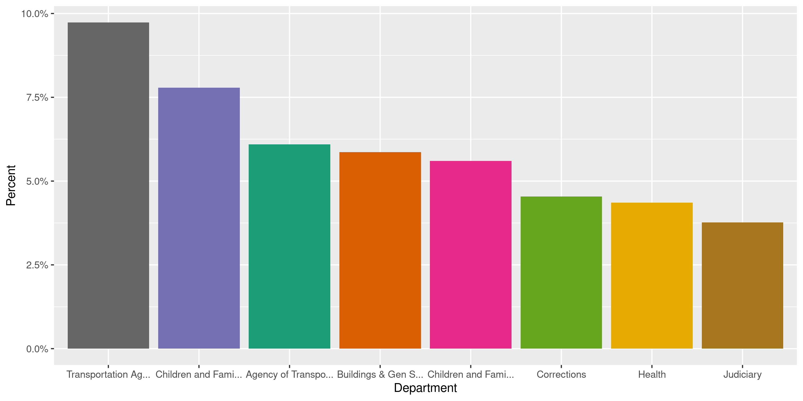
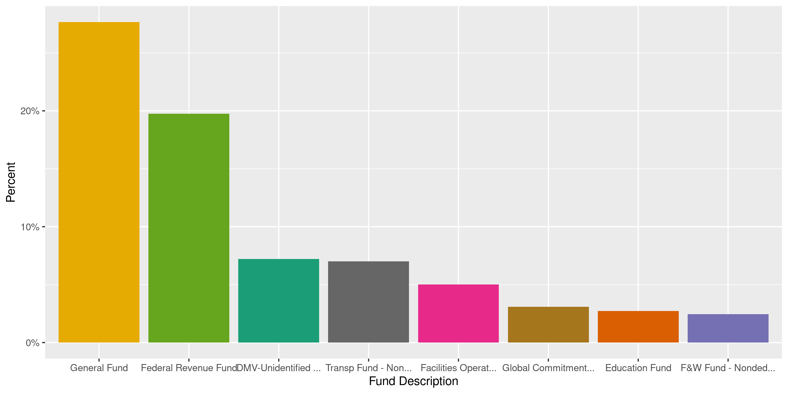
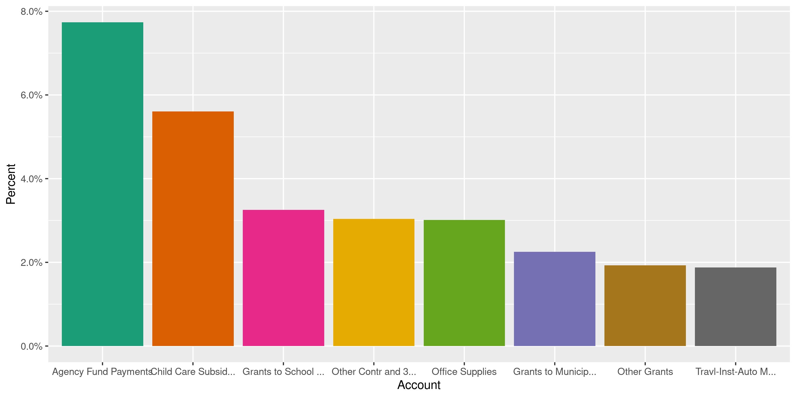
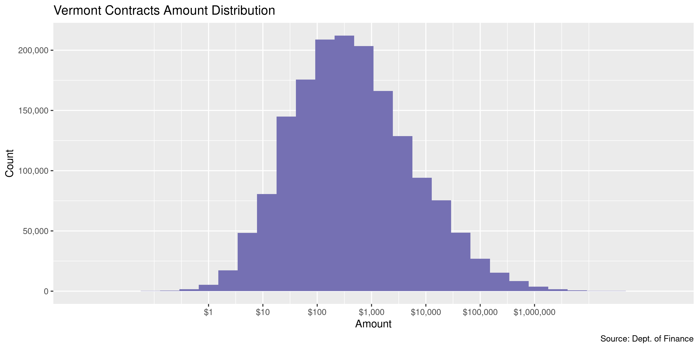
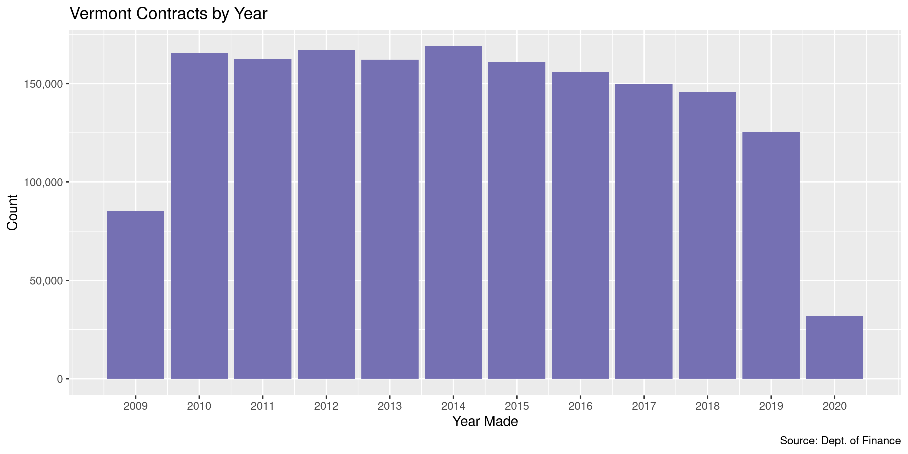
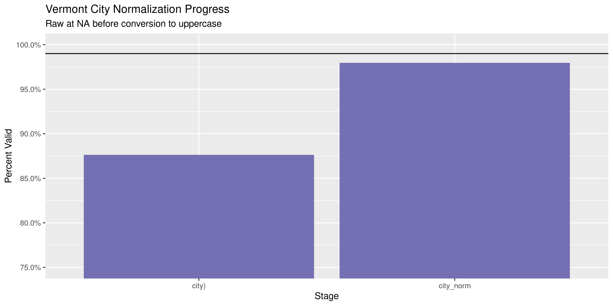

Vermont Contracts
================
Kiernan Nicholls
2023-02-16 14:20:48

- <a href="#project" id="toc-project">Project</a>
- <a href="#objectives" id="toc-objectives">Objectives</a>
- <a href="#packages" id="toc-packages">Packages</a>
- <a href="#data" id="toc-data">Data</a>
- <a href="#download" id="toc-download">Download</a>
- <a href="#read" id="toc-read">Read</a>
- <a href="#explore" id="toc-explore">Explore</a>
- <a href="#state" id="toc-state">State</a>
- <a href="#city" id="toc-city">City</a>
- <a href="#conclude" id="toc-conclude">Conclude</a>
- <a href="#update" id="toc-update">Update</a>
- <a href="#export" id="toc-export">Export</a>
- <a href="#upload" id="toc-upload">Upload</a>
- <a href="#dictionary" id="toc-dictionary">Dictionary</a>

<!-- Place comments regarding knitting here -->

## Project

The Accountability Project is an effort to cut across data silos and
give journalists, policy professionals, activists, and the public at
large a simple way to search across huge volumes of public data about
people and organizations.

Our goal is to standardizing public data on a few key fields by thinking
of each dataset row as a transaction. For each transaction there should
be (at least) 3 variables:

1.  All **parties** to a transaction.
2.  The **date** of the transaction.
3.  The **amount** of money involved.

## Objectives

This document describes the process used to complete the following
objectives:

1.  How many records are in the database?
2.  Check for entirely duplicated records.
3.  Check ranges of continuous variables.
4.  Is there anything blank or missing?
5.  Check for consistency issues.
6.  Create a five-digit ZIP Code called `zip`.
7.  Create a `year` field from the transaction date.
8.  Make sure there is data on both parties to a transaction.

## Packages

The following packages are needed to collect, manipulate, visualize,
analyze, and communicate these results. The `pacman` package will
facilitate their installation and attachment.

The IRW’s `campfin` package will also have to be installed from GitHub.
This package contains functions custom made to help facilitate the
processing of campaign finance data.

``` r
if (!require("pacman")) install.packages("pacman")
pacman::p_load_gh("irworkshop/campfin")
pacman::p_load(
  tidyverse, # data manipulation
  lubridate, # datetime strings
  gluedown, # printing markdown
  magrittr, # pipe operators
  janitor, # clean data frames
  aws.s3, # work with aws data
  refinr, # cluster and merge
  scales, # format strings
  knitr, # knit documents
  vroom, # read files fast
  rvest, # html scraping
  glue, # combine strings
  here, # relative paths
  httr, # http requests
  fs # local storage 
)
```

This document should be run as part of the `R_campfin` project, which
lives as a sub-directory of the more general, language-agnostic
[`irworkshop/accountability_datacleaning`](https://github.com/irworkshop/accountability_datacleaning)
GitHub repository.

The `R_campfin` project uses the [RStudio
projects](https://support.rstudio.com/hc/en-us/articles/200526207-Using-Projects)
feature and should be run as such. The project also uses the dynamic
`here::here()` tool for file paths relative to *your* machine.

``` r
# where does this document knit?
here::here()
#> [1] "/home/kiernan/Documents/accountability_datacleaning"
```

## Data

Contracts data can be obtained from the [Vermont Department of
Finance](http://finance.vermont.gov/), hosted on the state [Open Data
portal](https://data.vermont.gov/) under the title “Vermont Vendor
Payments” in the finance category. The data file was originally uploaded
on October 13, 2016 and was last updated May 15, 2020.

> The payments shown here are exclusive of direct payments to state
> employees for salaries, benefits, and, prior to May 2013, employee
> reimbursable expenses. The payments are also exclusive of any payments
> deemed confidential by state and/or federal statutes and rules, or the
> confidential nature of the recipients of certain payments, like direct
> program benefit payments. (Approximately 1% of all non-employee
> payments are excluded under these guidelines.)
>
> Payments are made through the VISION statewide financial system.
> Agencies and departments are responsible for entering their
> transactions into VISION. While VISION is the state’s principal
> financial system, it is not the sole financial system in use by the
> state.
>
> This data is not intended to be legal advice nor is it designed or
> intended to be relied upon as authoritative financial, investment, or
> professional advice. No entity affiliated with, employed by, or
> constituting part of the state of Vermont warrants, endorses, assures
> the accuracy of, or accepts liability for the content of any
> information on this site.

## Download

``` r
raw_url <- "https://data.vermont.gov/api/views/786x-sbp3/rows.tsv"
raw_dir <- dir_create(here("state", "vt", "contracts", "data", "raw"))
raw_tsv <- path(raw_dir, basename(raw_url))
```

``` r
if (!file_exists(raw_tsv)) {
  download.file(raw_url, raw_tsv)
}
```

## Read

``` r
vtc <- read_delim(
  file = raw_tsv,
  delim = "\t",
  name_repair = make_clean_names,
  locale = locale(date_format = "%m/%d/%Y"),
  col_types = cols(
    .default = col_character(),
    quarter_ending = col_date(),
    amount = col_number()
  )
)
```

## Explore

There are 2,066,890 rows of 14 columns.

``` r
glimpse(vtc)
#> Rows: 2,066,890
#> Columns: 14
#> $ quarter_ending      <date> 2019-12-31, 2019-12-31, 2019-12-31, 2019-12-31, 2019-12-31, 2019-12-…
#> $ department          <chr> "Vt Housing & Conserv Board", "Vt Housing & Conserv Board", "Vt Housi…
#> $ unit_no             <chr> "09150", "09150", "09150", "09150", "09150", "09150", "09150", "09150…
#> $ vendor_number       <chr> "0000002188", "0000375660", "0000043371", "0000042844", "0000160536",…
#> $ vendor              <chr> "Vermont Housing & Conservation Board", "Wagner Development Partners"…
#> $ city                <chr> "Montpelier", "Brattleboro", "Montpelier", "Burlington", "Montpelier"…
#> $ state               <chr> "VT", "VT", "VT", "VT", "VT", "VT", "VT", "VT", "VT", "VT", "VT", "VT…
#> $ dept_id_description <chr> "Trust", "VT REDI", "Trust", "Farm Viability-VHCB", "Farm Viability-V…
#> $ dept_id             <chr> "9150120000", "9150293000", "9150120000", "9150255000", "9150255000",…
#> $ amount              <dbl> 1075000.00, 4612.50, 112916.67, 17152.74, 4850.00, 1755.00, 26837.54,…
#> $ account             <chr> "Transfer Out - Component Units", "Other Direct Grant Expense", "Othe…
#> $ acct_no             <chr> "720010", "552990", "552990", "552990", "552990", "552990", "552990",…
#> $ fund_description    <chr> "Housing & Conserv Trust Fund", "Housing & Conserv Trust Fund", "Hous…
#> $ fund                <chr> "90610", "90610", "90610", "90610", "90610", "90610", "90630", "90610…
tail(vtc)
#> # A tibble: 6 × 14
#>   quarter_ending depart…¹ unit_no vendo…² vendor city  state dept_…³ dept_id amount account acct_no
#>   <date>         <chr>    <chr>   <chr>   <chr>  <chr> <chr> <chr>   <chr>    <dbl> <chr>   <chr>  
#> 1 2022-12-31     Vermont… 03420   000038… iPaya… Provo UT    Adm-Bu… 342001…  4200  Other … 519000 
#> 2 2022-12-31     Vermont… 03420   000038… iPaya… Provo UT    Adm-Bu… 342001…  1800  Other … 519000 
#> 3 2022-12-31     Defende… 02110   000040… mvjtr… Boze… MT    AC Add… 211001…    80  Interp… 507615 
#> 4 2022-12-31     Defende… 02110   000040… mvjtr… Boze… MT    AC Win… 211001…   100  Interp… 507615 
#> 5 2022-12-31     Vermont… 03420   000026… o2si … Char… SC    LSID L… 342002… 13739. Medica… 521810 
#> 6 2022-12-31     Agricul… 02200   000027… von T… Wait… VT    Ag Dev… 220003…     0  Other … 550500 
#> # … with 2 more variables: fund_description <chr>, fund <chr>, and abbreviated variable names
#> #   ¹​department, ²​vendor_number, ³​dept_id_description
```

### Missing

The columns vary in their degree of missing values, but none are missing
from the variables we need to identify transaction parties.

``` r
col_stats(vtc, count_na)
#> # A tibble: 14 × 4
#>    col                 class       n          p
#>    <chr>               <chr>   <int>      <dbl>
#>  1 quarter_ending      <date>      0 0         
#>  2 department          <chr>       0 0         
#>  3 unit_no             <chr>       0 0         
#>  4 vendor_number       <chr>       0 0         
#>  5 vendor              <chr>       0 0         
#>  6 city                <chr>  745822 0.361     
#>  7 state               <chr>      48 0.0000232 
#>  8 dept_id_description <chr>     537 0.000260  
#>  9 dept_id             <chr>       0 0         
#> 10 amount              <dbl>       0 0         
#> 11 account             <chr>       0 0         
#> 12 acct_no             <chr>       0 0         
#> 13 fund_description    <chr>       3 0.00000145
#> 14 fund                <chr>       0 0
```

``` r
key_vars <- c("quarter_ending", "department", "amount", "vendor")
vtc <- flag_na(vtc, all_of(key_vars))
if (sum(vtc$na_flag) == 0) {
  vtc <- select(vtc, -na_flag)
  message("No missing values, removing flag")
} else {
  vtc %>% 
    filter(na_flag) %>% 
    select(quarter_ending, vendor, amount, department)
}
```

### Duplicates

There are a number of records that are entirely duplicated across every
column. These records can be flagged with `campfin::flag_na()`.

``` r
vtc <- flag_dupes(vtc, everything())
sum(vtc$dupe_flag)
#> [1] 1493
```

These may be legitimate contracts/payments made on the same day for the
same amount, but they are flagged nonetheless.

``` r
vtc %>% 
  filter(dupe_flag) %>% 
  select(all_of(key_vars)) %>% 
  arrange(quarter_ending, vendor)
#> # A tibble: 1,493 × 4
#>    quarter_ending department                 amount vendor                      
#>    <date>         <chr>                       <dbl> <chr>                       
#>  1 2012-03-31     Education                   800   Winooski ID School District 
#>  2 2012-03-31     Education                   800   Winooski ID School District 
#>  3 2012-06-30     Vermont Veterans' Home       15.9 Patterson Medical Supply Inc
#>  4 2012-06-30     Vermont Veterans' Home       15.9 Patterson Medical Supply Inc
#>  5 2012-06-30     Judiciary                    24.4 Rounds,Tom                  
#>  6 2012-06-30     Judiciary                    24.4 Rounds,Tom                  
#>  7 2012-09-30     Judiciary                   236.  Addison Press Inc           
#>  8 2012-09-30     Judiciary                   236.  Addison Press Inc           
#>  9 2012-09-30     Environmental Conservation 1000   Blouin Brothers Oil         
#> 10 2012-09-30     Environmental Conservation 1000   Blouin Brothers Oil         
#> # … with 1,483 more rows
```

### Categorical

``` r
col_stats(vtc, n_distinct)
#> # A tibble: 15 × 4
#>    col                 class       n           p
#>    <chr>               <chr>   <int>       <dbl>
#>  1 quarter_ending      <date>     54 0.0000261  
#>  2 department          <chr>     116 0.0000561  
#>  3 unit_no             <chr>      74 0.0000358  
#>  4 vendor_number       <chr>   68056 0.0329     
#>  5 vendor              <chr>  214708 0.104      
#>  6 city                <chr>    8277 0.00400    
#>  7 state               <chr>      97 0.0000469  
#>  8 dept_id_description <chr>    3282 0.00159    
#>  9 dept_id             <chr>    3382 0.00164    
#> 10 amount              <dbl>  542008 0.262      
#> 11 account             <chr>    1159 0.000561   
#> 12 acct_no             <chr>    1130 0.000547   
#> 13 fund_description    <chr>     377 0.000182   
#> 14 fund                <chr>     375 0.000181   
#> 15 dupe_flag           <lgl>       2 0.000000968
```

<!-- --><!-- --><!-- -->

### Amounts

``` r
# fix floating point precision
vtc$amount <- round(vtc$amount, digits = 2)
```

A small percentage of `amount` values are less than or equal to zero,
but the range appears otherwise normal.

``` r
noquote(map_chr(summary(vtc$amount), dollar))
#>         Min.      1st Qu.       Median         Mean      3rd Qu.         Max. 
#>  -$2,880,183       $69.26      $390.16   $31,811.85       $2,500 $270,519,892
percent(mean(vtc$amount <= 0), 0.01)
#> [1] "0.91%"
```

These are the largest and smallest contract `amount` values:

``` r
glimpse(mutate(vtc[which.min(vtc$amount), ], across(amount, dollar)))
#> Rows: 1
#> Columns: 15
#> $ quarter_ending      <date> 2012-03-31
#> $ department          <chr> "Department of VT Health Access"
#> $ unit_no             <chr> "03410"
#> $ vendor_number       <chr> "0000279742"
#> $ vendor              <chr> "HP Enterprise Services LLC"
#> $ city                <chr> NA
#> $ state               <chr> "VT"
#> $ dept_id_description <chr> "DVHA-Programs-ST-Only Funded G"
#> $ dept_id             <chr> "3410017000"
#> $ amount              <chr> "-$2,880,183"
#> $ account             <chr> "Medical Services Grants"
#> $ acct_no             <chr> "604250"
#> $ fund_description    <chr> "General Fund"
#> $ fund                <chr> "10000"
#> $ dupe_flag           <lgl> FALSE
glimpse(mutate(vtc[which.max(vtc$amount), ], across(amount, dollar)))
#> Rows: 1
#> Columns: 15
#> $ quarter_ending      <date> 2022-12-31
#> $ department          <chr> "Vermont Health Access"
#> $ unit_no             <chr> "03410"
#> $ vendor_number       <chr> "0000395870"
#> $ vendor              <chr> "Gainwell Technologies, LLC"
#> $ city                <chr> "Conway"
#> $ state               <chr> "AR"
#> $ dept_id_description <chr> "DVHA-Medicaid Prog/Global Comm"
#> $ dept_id             <chr> "3410015000"
#> $ amount              <chr> "$270,519,892"
#> $ account             <chr> "Medical Services Grants"
#> $ acct_no             <chr> "604250"
#> $ fund_description    <chr> "Global Commitment Fund"
#> $ fund                <chr> "20405"
#> $ dupe_flag           <lgl> FALSE
```

The distribution of `amount` values is log-normal, as we would expect.

<!-- -->

### Dates

We can add the calendar year from `date` with `lubridate::year()`

``` r
vtc <- mutate(vtc, year = year(quarter_ending))
```

``` r
min(vtc$quarter_ending)
#> [1] "2009-09-30"
sum(vtc$year < 2000)
#> [1] 0
max(vtc$quarter_ending)
#> [1] "2022-12-31"
sum(vtc$quarter_ending > today())
#> [1] 0
```

<!-- -->

## State

We can manually add the department state.

``` r
vtc <- mutate(vtc, dept_state = "VT", .after = department)
```

We can count the `state` abbreviation values that are not American or
Canadian.

``` r
vtc %>% 
  filter(state %out% valid_state) %>% 
  count(state, sort = TRUE) %>% 
  print(n = Inf)
#> # A tibble: 30 × 2
#>    state      n
#>    <chr>  <int>
#>  1 CD       221
#>  2 0        141
#>  3 <NA>      48
#>  4 BERKS     43
#>  5 NSW       33
#>  6 ZZ        33
#>  7 PQ        27
#>  8 BE        25
#>  9 KENT       9
#> 10 NF         6
#> 11 YY         4
#> 12 SURREY     3
#> 13 WILTS      3
#> 14 75         2
#> 15 CAMBS      2
#> 16 GT LON     2
#> 17 MDDSX      2
#> 18 SHROPS     2
#> 19 EN         1
#> 20 ESSEX      1
#> 21 GE         1
#> 22 IE         1
#> 23 N YORK     1
#> 24 NORFLK     1
#> 25 QLD        1
#> 26 SOMER      1
#> 27 SP         1
#> 28 VIC        1
#> 29 W GLAM     1
#> 30 WYORKS     1
```

Those records with the `state` value of “CD” are Canadian cities with
the proper state/province abbreviation in the `city` name value.

``` r
vtc %>% 
  filter(state == "CD") %>% 
  count(city, sort = TRUE)
#> # A tibble: 18 × 2
#>    city                 n
#>    <chr>            <int>
#>  1 <NA>               169
#>  2 FREDERICTON NB      22
#>  3 MILTON ON            7
#>  4 EDMONTON AB          4
#>  5 CHICOUTIMI           2
#>  6 NAPIERVILLE PQ       2
#>  7 ST JOSEPH PQ         2
#>  8 ST PAMPHILE PQ       2
#>  9 WINNIPEG MB          2
#> 10 CALGARY AB           1
#> 11 FREDERICTION NB      1
#> 12 PIKE RIVER PQ        1
#> 13 SAINT JACQUES NB     1
#> 14 SAINTE FOY QC        1
#> 15 SAINTE-JULIE PQ      1
#> 16 ST ADALBERT PQ       1
#> 17 ST GEDEON PQ         1
#> 18 ST JOHNS NF          1
```

``` r
vtc <- mutate(
  .data = vtc,
  state_norm = normal_state(
    state = state,
    abbreviate = TRUE,
    na_rep = TRUE,
    valid = valid_state
  )
)
```

``` r
progress_table(
  vtc$state, 
  vtc$state_norm,
  compare = valid_state
)
#> # A tibble: 2 × 6
#>   stage          prop_in n_distinct   prop_na n_out n_diff
#>   <chr>            <dbl>      <dbl>     <dbl> <dbl>  <dbl>
#> 1 vtc$state         1.00         97 0.0000232   570     30
#> 2 vtc$state_norm    1            68 0.000299      0      1
```

## City

Cities are the most difficult geographic variable to normalize, simply
due to the wide variety of valid cities and formats.

``` r
usps_city2 <- usps_city %>% 
  add_row(
    abb = "ST",
    full = "SAINT"
  )
```

#### Normal

The `campfin::normal_city()` function is a good start, again converting
case, removing punctuation, but *expanding* USPS abbreviations. We can
also remove `invalid_city` values.

``` r
vtc <- vtc %>% 
  mutate(
    city_norm = city %>% 
      str_replace("(?<=\\w)\\.(?=\\w)", " ") %>% 
      normal_city(
        abbs = usps_city2,
        states = c("VT", "DC", "VERMONT"),
        na = invalid_city,
        na_rep = TRUE
      )
  )
```

#### Progress

| stage                                                                     | prop_in | n_distinct | prop_na | n_out | n_diff |
|:--------------------------------------------------------------------------|--------:|-----------:|--------:|------:|-------:|
| str_to_upper(vtc$city) | 0.870| 6202| 0.361| 172250| 1523| |vtc$city_norm |   0.967 |       5822 |   0.361 | 43255 |   1024 |

You can see how the percentage of valid values increased with each
stage.

<!-- -->

More importantly, the number of distinct values decreased each stage. We
were able to confidently change many distinct invalid values to their
valid equivalent.

<!-- -->

## Conclude

Before exporting, we can remove the intermediary normalization columns
and rename all added variables with the `_clean` suffix.

``` r
vtc <- vtc %>% 
  rename_all(~str_replace(., "_norm", "_clean")) %>% 
  rename_all(~str_remove(., "_raw"))
```

``` r
glimpse(sample_n(vtc, 20))
#> Rows: 20
#> Columns: 19
#> $ quarter_ending      <date> 2016-12-31, 2012-03-31, 2012-09-30, 2015-09-30, 2021-12-31, 2016-03-…
#> $ department          <chr> "Children and Families", "Center of Crime Victims' Serv", "Forest, Pa…
#> $ dept_state          <chr> "VT", "VT", "VT", "VT", "VT", "VT", "VT", "VT", "VT", "VT", "VT", "VT…
#> $ unit_no             <chr> "03440", "02160", "06130", "03440", "08100", "02120", "01140", "01265…
#> $ vendor_number       <chr> "0000041573", "0000001983", "0000006619", "0000000650", "0000000017",…
#> $ vendor              <chr> "Addison County Sheriff's Dept", "Blue Cross/Blue Shield", "Northeast…
#> $ city                <chr> "Middlebury", NA, NA, "Burlington", "Barre", "Craftsbury", "Putney", …
#> $ state               <chr> "VT", "VT", "VT", "VT", "VT", "VT", "VT", "MA", "VT", "VT", "VT", "VT…
#> $ dept_id_description <chr> "CS/Waterbury", "CCVS-Administration", "Parks", "Burlington", "Progra…
#> $ dept_id             <chr> "3440040100", "2160010100", "6130030000", "3440020140", "8100001100",…
#> $ amount              <dbl> 800.00, 10132.84, 1000.00, 111664.40, 237578.63, 475.01, 168.48, 5796…
#> $ account             <chr> "Service of Papers", "Health Ins - Other", "Rubbish Removal", "Intens…
#> $ acct_no             <chr> "506240", "501520", "510210", "603260", "522800", "513200", "518300",…
#> $ fund_description    <chr> "Federal Revenue Fund", "Victims Compensation Fund", "State Forest Pa…
#> $ fund                <chr> "22005", "21145", "21270", "20405", "20135", "10000", "10000", "60100…
#> $ dupe_flag           <lgl> FALSE, FALSE, FALSE, FALSE, FALSE, FALSE, FALSE, FALSE, FALSE, FALSE,…
#> $ year                <dbl> 2016, 2012, 2012, 2015, 2021, 2016, 2015, 2011, 2019, 2016, 2011, 201…
#> $ state_clean         <chr> "VT", "VT", "VT", "VT", "VT", "VT", "VT", "MA", "VT", "VT", "VT", "VT…
#> $ city_clean          <chr> "MIDDLEBURY", NA, NA, "BURLINGTON", "BARRE", "CRAFTSBURY", "PUTNEY", …
```

1.  There are 2,066,890 records in the database.
2.  There are 1,493 duplicate records in the database.
3.  The range and distribution of `amount` and `date` seem reasonable.
4.  There are 0 records missing key variables.
5.  Consistency in geographic data has been improved with
    `campfin::normal_*()`.
6.  The 4-digit `year` variable has been created with
    `lubridate::year()`.

## Update

``` r
old_aws <- "csv/vt_contracts_clean.csv"
if (object_exists(old_aws, "publicaccountability")) {
  # get column types from new data
  col_types <- paste(str_sub(map_chr(vtc, class), end = 1), collapse = "")
  vtc_old <- s3read_using(
    FUN = read_csv,
    object = old_aws,
    bucket = "publicaccountability",
    col_types = col_types
  )
  
  # round double values for comparison
  vtc_old$amount <- round(vtc_old$amount, 2)
  
  nrow(vtc)
  
  vtc <- anti_join(
    x = vtc, 
    y = vtc_old,
    by = names(vtc)
  )
  
  nrow(vtc)
}
#> [1] 386722
```

## Export

Now the file can be saved on disk for upload to the Accountability
server. We will name the object using a date range of the records
included.

``` r
clean_dir <- dir_create(here("state", "vt", "contracts", "data", "clean"))
csv_ts <- "20200611-20230209"
clean_csv <- path(clean_dir, glue("vt_contracts_{csv_ts}.csv"))
clean_rds <- path_ext_set(clean_csv, "rds")
basename(clean_csv)
#> [1] "vt_contracts_20200611-20230209.csv"
```

``` r
write_csv(vtc, clean_csv, na = "")
write_rds(vtc, clean_rds, compress = "xz")
(clean_size <- file_size(clean_csv))
#> 78.2M
```

## Upload

We can use the `aws.s3::put_object()` to upload the text file to the IRW
server.

``` r
aws_key <- path("csv", basename(clean_csv))
if (!object_exists(aws_key, "publicaccountability")) {
  put_object(
    file = clean_csv,
    object = aws_key, 
    bucket = "publicaccountability",
    acl = "public-read",
    show_progress = TRUE,
    multipart = TRUE
  )
}
aws_head <- head_object(aws_key, "publicaccountability")
(aws_size <- as_fs_bytes(attr(aws_head, "content-length")))
unname(aws_size == clean_size)
```

## Dictionary

The following table describes the variables in our final exported file:

| Column                | Type        | Definition                       |
|:----------------------|:------------|:---------------------------------|
| `quarter_ending`      | `double`    | End date of fiscal quarter made  |
| `department`          | `character` | Spending department name         |
| `dept_state`          | `character` | Spending department state (VT)   |
| `unit_no`             | `character` | Department unit number           |
| `vendor_number`       | `character` | Unique vendor number             |
| `vendor`              | `character` | Full vendor name                 |
| `city`                | `character` | Vendor city                      |
| `state`               | `character` | Vendor state                     |
| `dept_id_description` | `character` | Department subdivision           |
| `dept_id`             | `character` | Department ID                    |
| `amount`              | `double`    | Contract/payment amount          |
| `account`             | `character` | Spending account                 |
| `acct_no`             | `character` | Source account number            |
| `fund_description`    | `character` | Fund name                        |
| `fund`                | `character` | Fund number                      |
| `dupe_flag`           | `logical`   | Flag indicating duplicate record |
| `year`                | `double`    | Fiscal quarter calendar year     |
| `state_clean`         | `character` | Normalized vendor state          |
| `city_clean`          | `character` | Normalized vendor city           |
