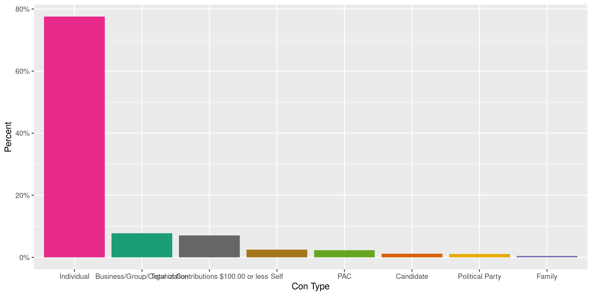
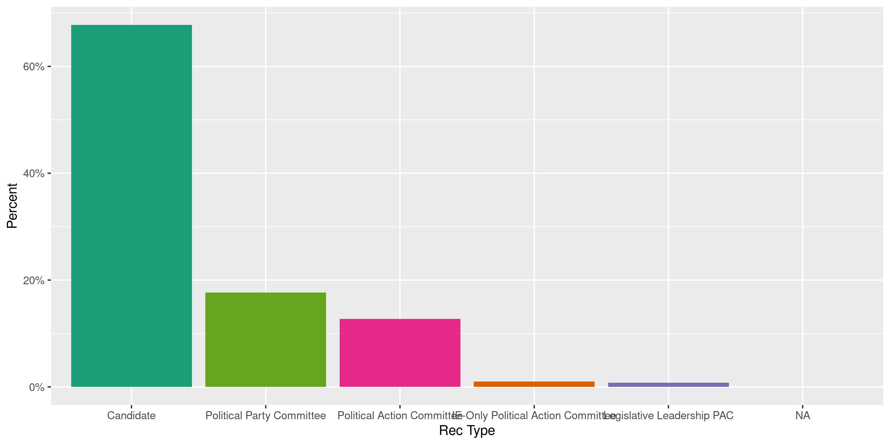
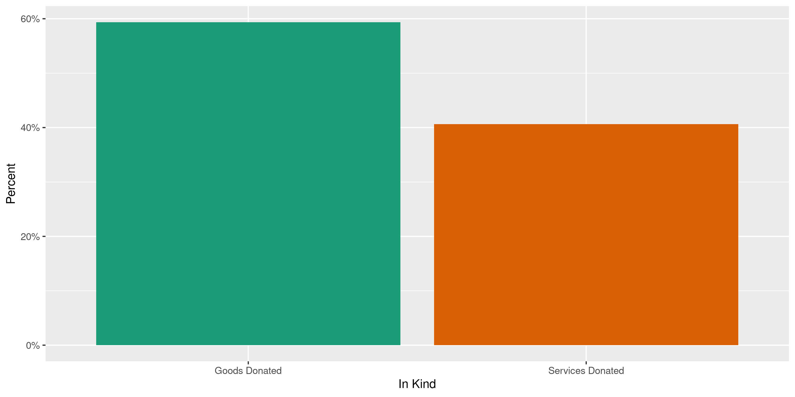
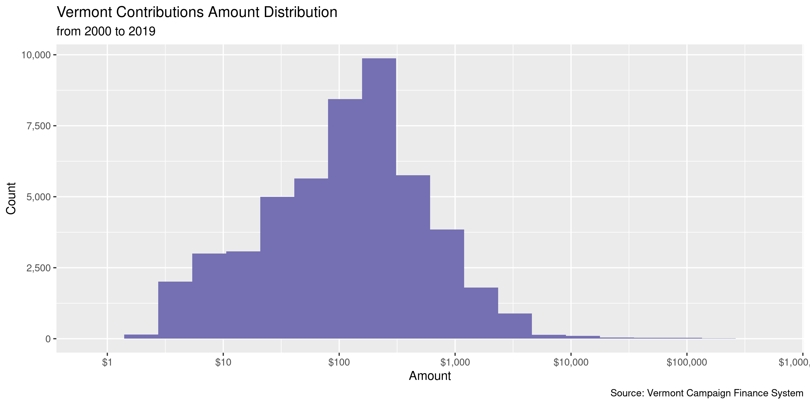
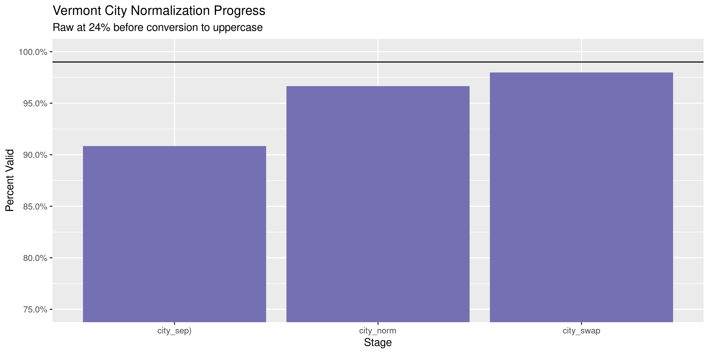
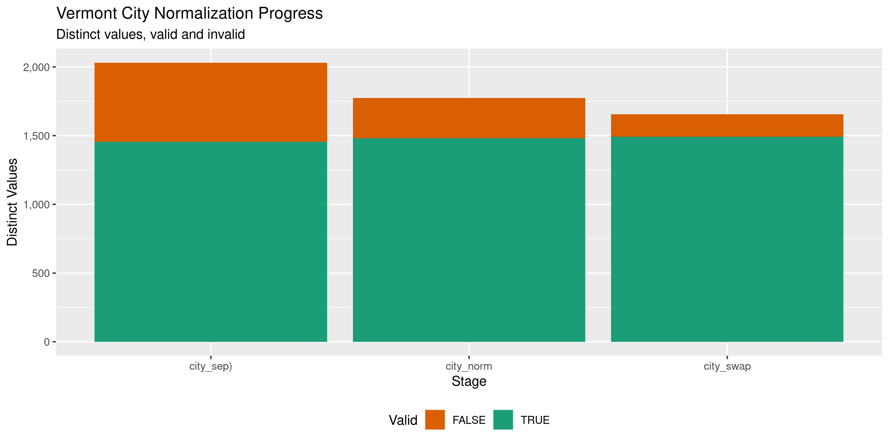

Vermont Contributions
================
Kiernan Nicholls & Aarushi Sahejpal
Sat Feb 18 17:10:56 2023

- <a href="#project" id="toc-project">Project</a>
- <a href="#objectives" id="toc-objectives">Objectives</a>
- <a href="#packages" id="toc-packages">Packages</a>
- <a href="#data" id="toc-data">Data</a>
- <a href="#download" id="toc-download">Download</a>
- <a href="#read" id="toc-read">Read</a>
- <a href="#explore" id="toc-explore">Explore</a>
  - <a href="#missing" id="toc-missing">Missing</a>
  - <a href="#duplicates" id="toc-duplicates">Duplicates</a>
  - <a href="#categorical" id="toc-categorical">Categorical</a>
  - <a href="#amounts" id="toc-amounts">Amounts</a>
  - <a href="#dates" id="toc-dates">Dates</a>
- <a href="#wrangle" id="toc-wrangle">Wrangle</a>
  - <a href="#zip" id="toc-zip">ZIP</a>
  - <a href="#state" id="toc-state">State</a>
  - <a href="#city" id="toc-city">City</a>
- <a href="#conclude" id="toc-conclude">Conclude</a>
- <a href="#export" id="toc-export">Export</a>
- <a href="#upload" id="toc-upload">Upload</a>

<!-- Place comments regarding knitting here -->

## Project

The Accountability Project is an effort to cut across data silos and
give journalists, policy professionals, activists, and the public at
large a simple way to search across huge volumes of public data about
people and organizations.

Our goal is to standardize public data on a few key fields by thinking
of each dataset row as a transaction. For each transaction there should
be (at least) 3 variables:

1.  All **parties** to a transaction.
2.  The **date** of the transaction.
3.  The **amount** of money involved.

## Objectives

This document describes the process used to complete the following
objectives:

1.  How many records are in the database?
2.  Check for entirely duplicated records.
3.  Check ranges of continuous variables.
4.  Is there anything blank or missing?
5.  Check for consistency issues.
6.  Create a five-digit ZIP Code called `zip`.
7.  Create a `year` field from the transaction date.
8.  Make sure there is data on both parties to a transaction.

## Packages

The following packages are needed to collect, manipulate, visualize,
analyze, and communicate these results. The `pacman` package will
facilitate their installation and attachment.

``` r
if (!require("pacman")) {
  install.packages("pacman")
}
pacman::p_load(
  tidyverse, # data manipulation
  lubridate, # datetime strings
  gluedown, # printing markdown
  janitor, # clean data frames
  campfin, # custom irw tools
  aws.s3, # aws cloud storage
  refinr, # cluster & merge
  scales, # format strings
  knitr, # knit documents
  vroom, # fast reading
  rvest, # scrape html
  glue, # code strings
  here, # project paths
  httr, # http requests
  fs # local storage 
)
```

This document should be run as part of the `R_campfin` project, which
lives as a sub-directory of the more general, language-agnostic
[`irworkshop/accountability_datacleaning`](https://github.com/irworkshop/accountability_datacleaning)
GitHub repository.

The `R_campfin` project uses the [RStudio
projects](https://support.rstudio.com/hc/en-us/articles/200526207-Using-Projects)
feature and should be run as such. The project also uses the dynamic
`here::here()` tool for file paths relative to *your* machine.

``` r
# where does this document knit?
here::i_am("vt/contribs/docs/vt_contribs_diary.Rmd")
```

## Data

Contribution data is available from the [Vermont Campaign Finance
System](https://campaignfinance.vermont.gov/) run by the Secretary of
State’s Elections Division. Contributions can be
[searched](https://campaignfinance.vermont.gov/Public/ReceiptsList) and
exported to a CSV file.

## Download

While [Vermont Campaign Finance
System](https://campaignfinance.vermont.gov/) indicates that information
surrounding contributions can be traced back to 1975, the earliest date
in the system where public information is available is 2014. We will
save this exported text file locally.

``` r
raw_dir <- here("vt", "contribs", "data", "raw")
setwd("/Volumes/TAP/accountability_datacleaning/vt/contribs/data/raw")
raw_csv <- path(raw_dir, "ViewContributionsList.csv")
has_raw <- !file_exists(raw_csv)
```

``` r
x <- read_lines(raw_csv)
x_top <- x[1]
x <- x[-1]
bad_nl <- which(str_starts(x, "\\d", negate = TRUE))
x[bad_nl - 1] <- paste0(x[bad_nl - 1], x[bad_nl])
x <- x[-bad_nl]
x <- str_remove(x, ",$")
x[length(x)] <- paste0(x[length(x)], ",,,,")
x <- c(x_top, x)
raw_fix <- file_temp(ext = "csv")
write_lines(x = x, file = raw_fix)
```

## Read

``` r
vtc <- read_delim( # 67,591
  file = raw_fix,
  delim = ",",
  trim_ws = TRUE,
  escape_backslash = FALSE,
  escape_double = FALSE,
  col_types = cols(
    .default = col_character(),
    `Transaction Date` = col_date("%m/%d/%Y %H:%M:%S %p"),
    `Reporting Period` = col_date("%m/%d/%Y %H:%M:%S %p"),
    `Amount` = col_double(),
    `Total Contribution Amount` = col_double()  )
)
```

``` r
problems(vtc)
#> # A tibble: 0 × 5
#> # … with 5 variables: row <int>, col <int>, expected <chr>, actual <chr>, file <chr>
```

To ensure the file was correctly read, we can count the distinct values
of a variable known to be discrete, like `Contributor Type`. If there
are no dates, addresses, etc in this column then every row has been
correctly parsed.

``` r
count(vtc, `Contributor Type`, sort = TRUE)
#> # A tibble: 11 × 2
#>    `Contributor Type`                         n
#>    <chr>                                  <int>
#>  1 Individual                             71259
#>  2 Total of Contributions $100.00 or less  6444
#>  3 Business/Group/Organization             5306
#>  4 Self                                    2468
#>  5 PAC                                     1904
#>  6 Candidate                                949
#>  7 Political Party                          846
#>  8 Family                                   233
#>  9 Legislative Leadership PAC                53
#> 10 IE-Only PAC                                8
#> 11 Public Question                            3
```

Finally, we will convert the column names to “snake” case.

``` r
vtc <- clean_names(vtc, case = "snake")
```

## Explore

There are 89,473 rows of 16 columns. Each record represents a single
contribution made from an individual or business to a political campaign
or committee.

``` r
glimpse(vtc)
#> Rows: 89,473
#> Columns: 16
#> $ transaction_date          <date> 2023-02-22, 2023-02-10, 2023-02-09, 2023-02-08, 2023-02-05, 2023-02-05, 2023-02-02,…
#> $ contributor_type          <chr> "Total of Contributions $100.00 or less", "Individual", "Candidate", "Individual", "…
#> $ contributor_name          <chr> "Anonymous", "Peters, Darrilyn", "Chalnick, Andrew", "Saferstein, Susan", "Cohen , I…
#> $ contributor_address       <chr> "Anonymous", "37 Old Schoolhouse Rd, South Burlington, VT 05403", "670 Nowland Farm …
#> $ receiving_registrant      <chr> "Chalnick, Andrew Todd", "Chalnick, Andrew Todd", "Chalnick, Andrew Todd", "Chalnick…
#> $ receiving_registrant_type <chr> "Candidate", "Candidate", "Candidate", "Candidate", "Candidate", "Candidate", "Candi…
#> $ office                    <chr> "City Councilor -", "City Councilor -", "City Councilor -", "City Councilor -", "Cit…
#> $ election_cycle            <chr> "2023 Annual Meeting (All Towns)", "2023 Annual Meeting (All Towns)", "2023 Annual M…
#> $ reporting_period          <date> 2023-02-25, 2023-02-25, 2023-02-25, 2023-02-25, 2023-02-25, 2023-02-25, 2023-02-05,…
#> $ contribution_type         <chr> "Contribution Count # :7", "Monetary", "Monetary", "Monetary", "Monetary", "Monetary…
#> $ amount                    <dbl> 520.17, 400.00, 1000.00, 150.00, 103.48, 250.00, 674.00, 2809.00, 150.00, 791.00, 90…
#> $ total_contribution_amount <dbl> 520.17, 500.00, 1000.00, 150.00, 103.48, 250.00, 674.00, 2809.00, 150.00, 791.00, 90…
#> $ comments                  <chr> NA, NA, NA, NA, NA, NA, NA, NA, NA, NA, "GiveButter", NA, NA, "Sent via Venmo", NA, …
#> $ in_kind_sub_category      <chr> NA, NA, NA, NA, NA, NA, NA, NA, NA, NA, NA, NA, NA, NA, NA, NA, NA, NA, NA, NA, NA, …
#> $ town_city                 <chr> "South Burlington", "South Burlington", "South Burlington", "S. Burlington", "El Gra…
#> $ town_state                <chr> "VT", "VT", "VT", "VT", "CA", "VT", "VT", "VT", "VT", "RI", "NY", "VT", "VT", "VT", …
tail(vtc)
#> # A tibble: 6 × 16
#>   transaction…¹ contr…² contr…³ contr…⁴ recei…⁵ recei…⁶ office elect…⁷ reportin…⁸ contr…⁹ amount total…˟ comme…˟ in_ki…˟
#>   <date>        <chr>   <chr>   <chr>   <chr>   <chr>   <chr>  <chr>   <date>     <chr>    <dbl>   <dbl> <chr>   <chr>  
#> 1 2014-05-29    Indivi… Lockwo… 73 Tab… Weinbe… Candid… Mayor… 2015 A… 2015-02-01 Moneta…   250     250  <NA>    <NA>   
#> 2 2014-05-29    Indivi… Kittre… 331 Be… Weinbe… Candid… Mayor… 2015 A… 2015-02-01 Moneta…   250     250  <NA>    <NA>   
#> 3 2014-05-01    Self    Cisar,… 86 Pin… Cisar,… Candid… State… 2014 G… 2014-10-15 Moneta…   148.   1264. <NA>    <NA>   
#> 4 2014-02-26    Indivi… Sherwa… 19746 … Weinbe… Candid… Mayor… 2015 A… 2015-02-01 Moneta…  1000    1000  <NA>    <NA>   
#> 5 2014-02-26    Indivi… Sherwa… 19746 … Weinbe… Candid… Mayor… 2015 A… 2015-02-01 Moneta…  1000    1000  <NA>    <NA>   
#> 6 2014-01-23    Indivi… Bruhn,… 60 Bar… Weinbe… Candid… Mayor… 2015 A… 2015-02-01 Moneta…   250     250  <NA>    <NA>   
#> # … with 2 more variables: town_city <chr>, town_state <chr>, and abbreviated variable names ¹​transaction_date,
#> #   ²​contributor_type, ³​contributor_name, ⁴​contributor_address, ⁵​receiving_registrant, ⁶​receiving_registrant_type,
#> #   ⁷​election_cycle, ⁸​reporting_period, ⁹​contribution_type, ˟​total_contribution_amount, ˟​comments,
#> #   ˟​in_kind_sub_category
```

### Missing

Columns vary in their degree of missing values.

``` r
col_stats(vtc, count_na)
#> # A tibble: 16 × 4
#>    col                       class      n     p
#>    <chr>                     <chr>  <int> <dbl>
#>  1 transaction_date          <date>     0 0    
#>  2 contributor_type          <chr>      0 0    
#>  3 contributor_name          <chr>      0 0    
#>  4 contributor_address       <chr>      0 0    
#>  5 receiving_registrant      <chr>      0 0    
#>  6 receiving_registrant_type <chr>      0 0    
#>  7 office                    <chr>  30702 0.343
#>  8 election_cycle            <chr>      0 0    
#>  9 reporting_period          <date>     0 0    
#> 10 contribution_type         <chr>      0 0    
#> 11 amount                    <dbl>      0 0    
#> 12 total_contribution_amount <dbl>      0 0    
#> 13 comments                  <chr>  80846 0.904
#> 14 in_kind_sub_category      <chr>  86729 0.969
#> 15 town_city                 <chr>  25421 0.284
#> 16 town_state                <chr>  20548 0.230
```

We can flag any record missing a key variable needed to identify a
transaction.

``` r
key_vars <- c("transaction_date", "contributor_name", 
              "amount", "receiving_registrant")
vtc <- flag_na(vtc, all_of(key_vars))
sum(vtc$na_flag)
#> [1] 0
```

There are 0 records missing a key variable.

``` r
if (sum(vtc$na_flag) == 0) {
  # remove if none exist
  vtc <- select(vtc, -na_flag)
}
```

### Duplicates

We can also flag any record completely duplicated across every column.

``` r
vtc <- flag_dupes(vtc, everything())
sum(vtc$dupe_flag)
#> [1] 1464
```

1.6% of rows are duplicated at once.

``` r
vtc %>% 
  filter(dupe_flag) %>% 
  select(all_of(key_vars)) %>% 
  arrange(transaction_date)
#> # A tibble: 1,464 × 4
#>    transaction_date contributor_name  amount receiving_registrant                              
#>    <date>           <chr>              <dbl> <chr>                                             
#>  1 2014-08-13       Fletcher, Darcy       20 Vermont-NEA Fund for Children and Public Education
#>  2 2014-08-13       Fletcher, Darcy       20 Vermont-NEA Fund for Children and Public Education
#>  3 2014-08-13       Fletcher, Darcy       20 Vermont-NEA Fund for Children and Public Education
#>  4 2014-08-13       Fletcher, Darcy       20 Vermont-NEA Fund for Children and Public Education
#>  5 2014-08-13       Fletcher, Darcy       20 Vermont-NEA Fund for Children and Public Education
#>  6 2014-08-13       Fletcher, Darcy       20 Vermont-NEA Fund for Children and Public Education
#>  7 2014-08-19       Wamble, Louis        100 Morris, Kiah                                      
#>  8 2014-08-19       Wamble, Louis        100 Morris, Kiah                                      
#>  9 2014-09-29       Richmond, Douglas    100 Feliciano, Dan                                    
#> 10 2014-09-29       Richmond, Douglas    100 Feliciano, Dan                                    
#> # … with 1,454 more rows
```

### Categorical

``` r
col_stats(vtc, n_distinct)
#> # A tibble: 17 × 4
#>    col                       class      n         p
#>    <chr>                     <chr>  <int>     <dbl>
#>  1 transaction_date          <date>  3011 0.0337   
#>  2 contributor_type          <chr>     11 0.000123 
#>  3 contributor_name          <chr>  22255 0.249    
#>  4 contributor_address       <chr>  23488 0.263    
#>  5 receiving_registrant      <chr>   1219 0.0136   
#>  6 receiving_registrant_type <chr>      5 0.0000559
#>  7 office                    <chr>    188 0.00210  
#>  8 election_cycle            <chr>     29 0.000324 
#>  9 reporting_period          <date>   121 0.00135  
#> 10 contribution_type         <chr>    292 0.00326  
#> 11 amount                    <dbl>   4550 0.0509   
#> 12 total_contribution_amount <dbl>   4042 0.0452   
#> 13 comments                  <chr>   4811 0.0538   
#> 14 in_kind_sub_category      <chr>      3 0.0000335
#> 15 town_city                 <chr>   2467 0.0276   
#> 16 town_state                <chr>     55 0.000615 
#> 17 dupe_flag                 <lgl>      2 0.0000224
```

<!-- --><!-- --><!-- --><!-- --><!-- -->

### Amounts

``` r
summary(vtc$amount)
#>    Min. 1st Qu.  Median    Mean 3rd Qu.    Max. 
#>       0      25     100     473     250  400000
mean(vtc$amount <= 0)
#> [1] 0
```

These are the records with the minimum and maximum amounts.

``` r
glimpse(vtc[c(which.max(vtc$amount), which.min(vtc$amount)), ])
#> Rows: 2
#> Columns: 17
#> $ transaction_date          <date> 2016-10-28, 2022-03-30
#> $ contributor_type          <chr> "Business/Group/Organization", "Total of Contributions $100.00 or less"
#> $ contributor_name          <chr> "REPUBLICAN GOVERNORS ASSOCIATION", "Anonymous"
#> $ contributor_address       <chr> "1747 PENN. AVE. NW STE. 250, WASHINGTON, DC 20006", "Anonymous"
#> $ receiving_registrant      <chr> "A Stronger Vermont", "Drury, Roger"
#> $ receiving_registrant_type <chr> "IE-Only Political Action Committee", "Candidate"
#> $ office                    <chr> NA, "School Director - Essex Westford"
#> $ election_cycle            <chr> "2016 General", "2022 Essex Town School Board (Essex)"
#> $ reporting_period          <date> 2016-11-04, 2022-04-02
#> $ contribution_type         <chr> "Monetary", "Contribution Count # :1"
#> $ amount                    <dbl> 4e+05, 1e-02
#> $ total_contribution_amount <dbl> 3.019e+06, 1.000e-02
#> $ comments                  <chr> "CONTRIBUTION", "I have not spent any money to date"
#> $ in_kind_sub_category      <chr> NA, NA
#> $ town_city                 <chr> NA, "Essex"
#> $ town_state                <chr> NA, "VT"
#> $ dupe_flag                 <lgl> FALSE, FALSE
```

<!-- -->

### Dates

We can add the calendar year from `date` with `lubridate::year()`

``` r
vtc <- mutate(vtc, transaction_year = year(transaction_date))
```

``` r
min(vtc$transaction_date)
#> [1] "2014-01-23"
sum(vtc$transaction_year < 2014)
#> [1] 0
max(vtc$transaction_date)
#> [1] "2023-02-22"
sum(vtc$transaction_date > today())
#> [1] 1
```

<!-- -->

## Wrangle

To improve the searchability of the database, we will perform some
consistent, confident string normalization. For geographic variables
like city names and ZIP codes, the corresponding `campfin::normal_*()`
functions are tailor made to facilitate this process.

First, we notice that the vast majority of the existing `town_city` and
`town_state` variables are missing.

``` r
prop_na(vtc$town_city)
#> [1] 0.2841192
prop_na(vtc$town_state)
#> [1] 0.2296559
vtc %>% 
  select(contributor_address, town_city, town_state) %>% 
  filter(!is.na(town_city) & !is.na(town_state))
#> # A tibble: 63,945 × 3
#>    contributor_address                               town_city        town_state
#>    <chr>                                             <chr>            <chr>     
#>  1 Anonymous                                         South Burlington VT        
#>  2 37 Old Schoolhouse Rd, South Burlington, VT 05403 South Burlington VT        
#>  3 670 Nowland Farm Rd, South Burlington, VT 05403   South Burlington VT        
#>  4 36 Pheasant Way, S. Burlington, VT 05403          S. Burlington    VT        
#>  5 PO Box 1724, El Granada, CA 94018                 El Granada       CA        
#>  6 64 Shea Dr, S. BURLINGTON, VT 05403               S. BURLINGTON    VT        
#>  7 Anonymous                                         Burlington       VT        
#>  8 Anonymous                                         MILTON           VT        
#>  9 Anonymous                                         Providence       RI        
#> 10 Anonymous                                         Brooklyn         NY        
#> # … with 63,935 more rows
```

However, the city and state values are present in the full contributor
address line, which can be split into it’s components with
`tidyr::separate()`.

``` r
vtc <- vtc %>% 
  mutate(address_tmp = na_if(contributor_address, "Anonymous")) %>% 
  separate(
    col = address_tmp,
    into = c(glue("addr{1:10}"), "city_sep", "state_zip"),
    sep = "\\s?,\\s",
    remove = TRUE,
    fill = "left",
    extra = "merge"
  ) %>% 
  mutate(
    across(
      starts_with("addr"),
      normal_address,
      abbs = usps_street,
      na_rep = TRUE
    )
  ) %>% 
  unite(
    starts_with("addr"),
    col = addr_norm,
    sep = " ",
    remove = TRUE,
    na.rm = TRUE
  ) %>% 
  mutate(across(addr_norm, na_if, "")) %>% 
  separate(
    col = state_zip,
    into = c("state_sep", "zip_sep"),
    sep = "\\s(?=\\d)",
    remove = TRUE
  ) %>% 
  mutate(
    city_sep = coalesce(city_sep, town_city),
    state_sep = coalesce(state_sep, town_state)
  ) %>% 
  relocate(ends_with("_sep"), .after = last_col())
```

``` r
vtc %>% 
  select(contributor_address, ends_with("_sep")) %>% 
  filter(!is.na(contributor_address)) %>% 
  sample_n(10)
#> # A tibble: 10 × 4
#>    contributor_address                              city_sep         state_sep zip_sep   
#>    <chr>                                            <chr>            <chr>     <chr>     
#>  1 60 GROVE ST, BURLINGTON, VT 05401                BURLINGTON       VT        05401     
#>  2 PO Box 908, Stowe, VT 05672                      Stowe            VT        05672     
#>  3 3193 DANBY PAWLET RD, DANBY, VT 05739            DANBY            VT        05739     
#>  4 3515 OAK HILL RD, WILLISTON, VT 05495            WILLISTON        VT        05495     
#>  5 20 BENTLEY LN, JERICHO, VT 05465                 JERICHO          VT        05465     
#>  6 100 DeForest Rd., Burlington, VT 05401           Burlington       VT        05401     
#>  7 89 Old Woods Rd, Waterbury Center, VT 05677-8216 Waterbury Center VT        05677-8216
#>  8 115 MIDDLE RD, SWANTON, VT 05488                 SWANTON          VT        05488     
#>  9 243 Fernwood dr, Mendon, VT 05701                Mendon           VT        05701     
#> 10 45 Alfred Ter, Burlington, VT 05401              Burlington       VT        05401
```

### ZIP

For ZIP codes, the `campfin::normal_zip()` function will attempt to
create valid *five* digit codes by removing the ZIP+4 suffix and
returning leading zeroes dropped by other programs like Microsoft Excel.

``` r
vtc <- vtc %>% 
  mutate(
    zip_norm = normal_zip(
      zip = zip_sep,
      na_rep = TRUE
    )
  )
```

``` r
progress_table(
  vtc$zip_sep,
  vtc$zip_norm,
  compare = valid_zip
)
#> # A tibble: 2 × 6
#>   stage        prop_in n_distinct prop_na n_out n_diff
#>   <chr>          <dbl>      <dbl>   <dbl> <dbl>  <dbl>
#> 1 vtc$zip_sep    0.818       7295  0.0720 15099   4776
#> 2 vtc$zip_norm   0.997       3088  0.0724   210     98
```

### State

Valid two digit state abbreviations can be made using the
`campfin::normal_state()` function.

``` r
vtc <- vtc %>% 
  mutate(
    state_norm = normal_state(
      state = state_sep,
      abbreviate = TRUE,
      na_rep = TRUE,
      valid = valid_state
    )
  )
```

``` r
vtc %>% 
  filter(state_sep != state_norm) %>% 
  count(state_sep, state_norm, sort = TRUE)
#> # A tibble: 1 × 3
#>   state_sep state_norm     n
#>   <chr>     <chr>      <int>
#> 1 Vt        VT             1
```

``` r
progress_table(
  vtc$state_sep,
  vtc$state_norm,
  compare = valid_state
)
#> # A tibble: 2 × 6
#>   stage          prop_in n_distinct prop_na n_out n_diff
#>   <chr>            <dbl>      <dbl>   <dbl> <dbl>  <dbl>
#> 1 vtc$state_sep     1.00         57 0.00937     6      4
#> 2 vtc$state_norm    1            54 0.00942     0      1
```

### City

Cities are the most difficult geographic variable to normalize, simply
due to the wide variety of valid cities and formats.

#### Normal

The `campfin::normal_city()` function is a good start, again converting
case, removing punctuation, but *expanding* USPS abbreviations. We can
also remove `invalid_city` values.

``` r
norm_city <- vtc %>% 
  distinct(city_sep, state_norm, zip_norm) %>% 
  mutate(
    city_norm = normal_city(
      city = city_sep, 
      abbs = usps_city,
      states = c("NH", "DC", "NEW HAMPSHIRE"),
      na = invalid_city,
      na_rep = TRUE
    )
  )
```

#### Swap

We can further improve normalization by comparing our normalized value
against the *expected* value for that record’s state abbreviation and
ZIP code. If the normalized value is either an abbreviation for or very
similar to the expected value, we can confidently swap those two.

``` r
norm_city <- norm_city %>% 
  left_join(
    y = zipcodes,
    by = c(
      "state_norm" = "state",
      "zip_norm" = "zip"
    )
  ) %>% 
  rename(city_match = city) %>% 
  mutate(
    match_abb = is_abbrev(city_norm, city_match),
    match_dist = str_dist(city_norm, city_match),
    city_swap = if_else(
      condition = !is.na(match_dist) & (match_abb | match_dist == 1),
      true = city_match,
      false = city_norm
    )
  ) %>% 
  select(
    -city_match,
    -match_dist,
    -match_abb
  )
```

``` r
vtc <- left_join(vtc, norm_city, by = c("city_sep", "zip_norm", "state_norm"))
```

#### Refine

The [OpenRefine](https://openrefine.org/) algorithms can be used to
group similar strings and replace the less common versions with their
most common counterpart. This can greatly reduce inconsistency, but with
low confidence; we will only keep any refined strings that have a valid
city/state/zip combination.

``` r
good_refine <- vtc %>% 
  mutate(
    city_refine = city_swap %>% 
      key_collision_merge() %>% 
      n_gram_merge(numgram = 1)
  ) %>% 
  filter(city_refine != city_swap) %>% 
  inner_join(
    y = zipcodes,
    by = c(
      "city_refine" = "city",
      "state_norm" = "state",
      "zip_norm" = "zip"
    )
  )
```

    #> # A tibble: 4 × 5
    #>   state_norm zip_norm city_swap        city_refine          n
    #>   <chr>      <chr>    <chr>            <chr>            <int>
    #> 1 VT         05053    NORTH PROMFET    NORTH POMFRET        1
    #> 2 VT         05403    SOUTH BURLINGONT SOUTH BURLINGTON     1
    #> 3 VT         05458    GRAND ISLE RD    GRAND ISLE           1
    #> 4 VT         05736    RUTLAND CENTER   CENTER RUTLAND       1

Then we can join the refined values back to the database.

``` r
vtc <- vtc %>% 
  left_join(good_refine, by = names(.)) %>% 
  mutate(city_refine = coalesce(city_refine, city_swap))
```

#### Manual

``` r
many_city <- c(valid_city, extra_city)
vtc %>% 
  count(state_norm, city_refine, sort = TRUE) %>% 
  filter(city_refine %out% many_city)
#> # A tibble: 286 × 3
#>    state_norm city_refine          n
#>    <chr>      <chr>            <int>
#>  1 VT         <NA>               849
#>  2 <NA>       <NA>               836
#>  3 VT         WEYBRIDGE          221
#>  4 VT         GEORGIA            145
#>  5 VT         PANTON             102
#>  6 MA         NEEDHAM HEIGHTS     92
#>  7 VT         ST ALBANS           89
#>  8 VT         BARRE TOWN          81
#>  9 VT         WEST BRATTLEBORO    78
#> 10 VT         FERRISBURGH         76
#> # … with 276 more rows
```

``` r
many_city <- c(many_city, "WEYBRIDGE", "GEORGIA")
```

#### Progress

| stage                        | prop_in | n_distinct | prop_na | n_out | n_diff |
|:-----------------------------|--------:|-----------:|--------:|------:|-------:|
| `str_to_upper(vtc$city_sep)` |   0.926 |       2530 |   0.018 |  6497 |    652 |
| `vtc$city_norm`              |   0.948 |       2350 |   0.019 |  4558 |    460 |
| `vtc$city_swap`              |   0.981 |       2167 |   0.019 |  1661 |    265 |
| `vtc$city_refine`            |   0.981 |       2163 |   0.019 |  1657 |    261 |

You can see how the percentage of valid values increased with each
stage.

<!-- -->

More importantly, the number of distinct values decreased each stage. We
were able to confidently change many distinct invalid values to their
valid equivalent.

<!-- -->

Before exporting, we can remove the intermediary normalization columns
and rename all added variables with the `_clean` suffix.

``` r
vtc <- vtc %>% 
  select(
    -ends_with("_sep"),
    -city_norm,
    -city_swap,
    city_clean = city_refine
  ) %>% 
  rename_all(~str_replace(., "_norm", "_clean")) %>% 
  rename_all(~str_remove(., "_raw")) %>% 
  relocate(city_clean, state_clean, zip_clean, .after = addr_clean)
```

## Conclude

``` r
glimpse(sample_frac(vtc))
#> Rows: 89,473
#> Columns: 22
#> $ transaction_date          <date> 2016-10-26, 2016-11-01, 2016-09-01, 2022-10-17, 2020-09-10, 2022-01-13, 2022-09-18,…
#> $ contributor_type          <chr> "Individual", "Total of Contributions $100.00 or less", "Individual", "Individual", …
#> $ contributor_name          <chr> "Boyle, Timothy A.", "Anonymous", "Tobin, William J", "Vallee, Rodolphe", "Chicote, …
#> $ contributor_address       <chr> "9 School Street, Burlington, VT 05401", "Anonymous", "2665 Chelsea Road, Corinth, V…
#> $ receiving_registrant      <chr> "Vermont Political Awareness Committee", "Vermont Renewable Energy Political Action …
#> $ receiving_registrant_type <chr> "Political Action Committee", "Political Action Committee", "Political Action Commit…
#> $ office                    <chr> NA, NA, NA, "State Representative - Chittenden 10", NA, NA, "Lieutenant Governor", N…
#> $ election_cycle            <chr> "2016 General", "2016 General", "2016 General", "2022 General Election", "2020 Gener…
#> $ reporting_period          <date> 2016-11-04, 2016-11-04, 2016-10-01, 2022-11-04, 2020-10-01, 2022-03-15, 2022-10-01,…
#> $ contribution_type         <chr> "Monetary", "Contribution Count # :1", "Monetary", "Monetary", "Monetary", "Monetary…
#> $ amount                    <dbl> 2.00, 100.00, 4.00, 1050.00, 2.00, 10.00, 500.00, 5.00, 25.00, 200.00, 37.00, 5.00, …
#> $ total_contribution_amount <dbl> 210.00, 100.00, 160.00, 1050.00, 106.00, 267.00, 500.00, 120.00, 376.00, 200.00, 112…
#> $ comments                  <chr> NA, NA, NA, NA, NA, NA, NA, NA, NA, NA, NA, NA, "In-Kind Donation for Bennington Tow…
#> $ in_kind_sub_category      <chr> NA, NA, NA, NA, NA, NA, NA, NA, NA, NA, NA, NA, "Services Donated", NA, NA, NA, NA, …
#> $ town_city                 <chr> "Burlington", "Richmond", "Corinth", "Sheldon", "Bennington", "BURLINGTON", "Burling…
#> $ town_state                <chr> "VT", "VT", "VT", "SC", "VT", "VT", "VT", "VT", NA, "VT", "VT", "VT", "VT", "VT", "N…
#> $ dupe_flag                 <lgl> FALSE, FALSE, FALSE, FALSE, FALSE, FALSE, FALSE, FALSE, FALSE, FALSE, FALSE, FALSE, …
#> $ transaction_year          <dbl> 2016, 2016, 2016, 2022, 2020, 2022, 2022, 2021, 2016, 2022, 2016, 2017, 2022, 2018, …
#> $ addr_clean                <chr> "9 SCHOOL ST", NA, "2665 CHELSEA RD", "61 BRAYLS IS", "1887 MT ANTHONY RD", "82 GRAN…
#> $ city_clean                <chr> "BURLINGTON", "RICHMOND", "CORINTH", "SHELDON", "BENNINGTON", "BURLINGTON", "BURLING…
#> $ state_clean               <chr> "VT", "VT", "VT", "SC", "VT", "VT", "VT", "VT", "VT", "VT", "VT", "VT", "VT", "VT", …
#> $ zip_clean                 <chr> "05401", NA, "05039", "79941", "05201", "05401", "05401", "05408", "05672", "05401",…
```

1.  There are 89,473 records in the database.
2.  There are 1,464 duplicate records in the database.
3.  The range and distribution of `amount` and `date` seem reasonable.
4.  There are 0 records missing key variables.
5.  Consistency in geographic data has been improved with
    `campfin::normal_*()`.
6.  The 4-digit `year` variable has been created with
    `lubridate::year()`.

## Export

Now the file can be saved on disk for upload to the Accountability
server.

``` r
clean_dir <- dir_create(here("vt", "contribs", "data", "clean"))
clean_path <- path(clean_dir, "vt_contribs_clean.csv")
write_csv(vtc, clean_path, na = "")
(clean_size <- file_size(clean_path))
#> 20.4M
```

## Upload

We can use the `aws.s3::put_object()` to upload the text file to the IRW
server.

``` r
aws_path <- path("csv", basename(clean_path))
if (!object_exists(aws_path, "publicaccountability")) {
  put_object(
    file = clean_path,
    object = aws_path, 
    bucket = "publicaccountability",
    acl = "public-read",
    show_progress = TRUE,
    multipart = TRUE
  )
}
aws_head <- head_object(aws_path, "publicaccountability")
(aws_size <- as_fs_bytes(attr(aws_head, "content-length")))
unname(aws_size == clean_size)
```
