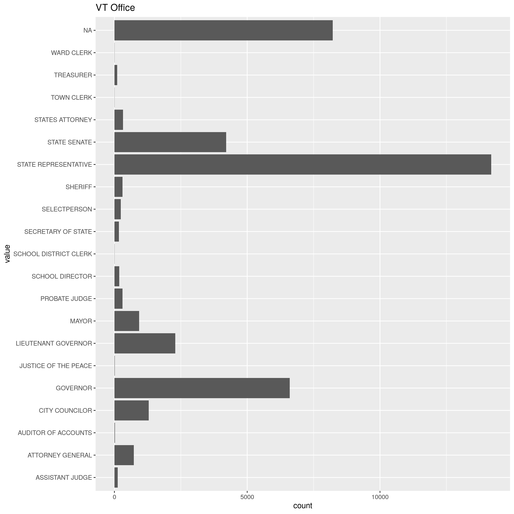
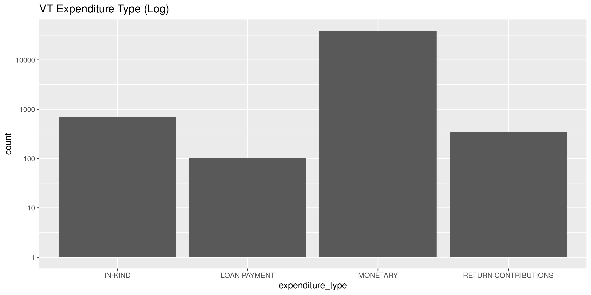
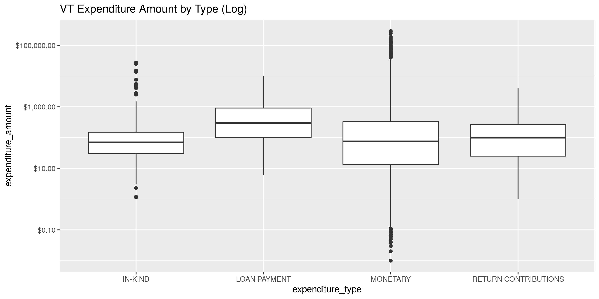
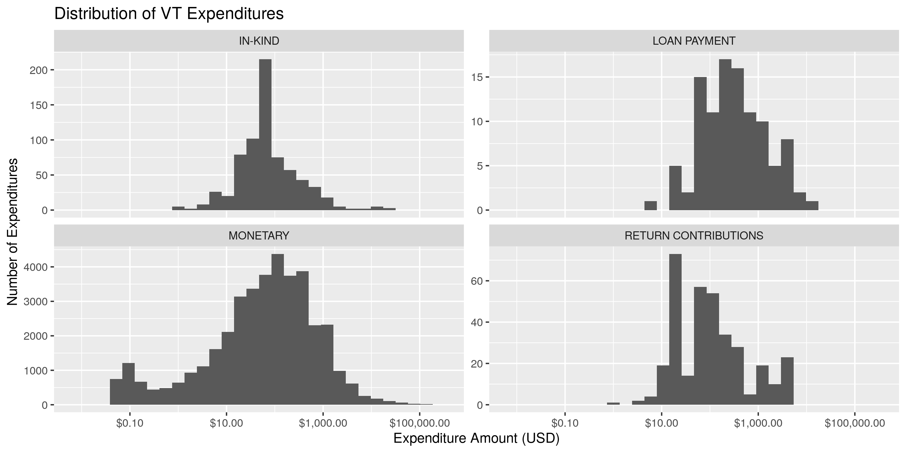
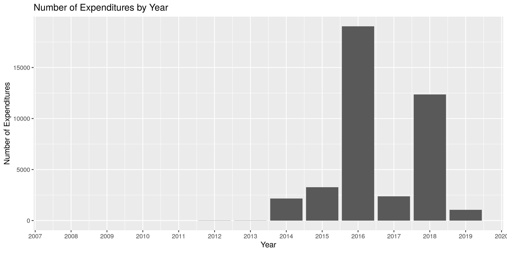
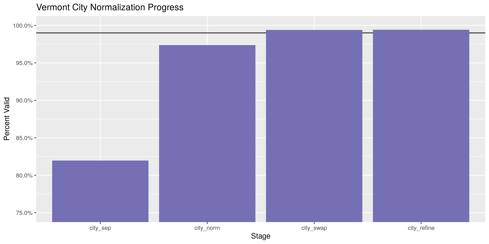
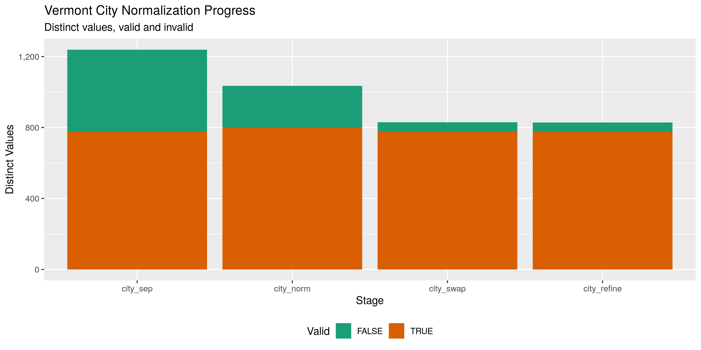

Vermont Expenditures
================
Kiernan Nicholls & Aarushi Sahejpal
2023-05-27 22:27:57

- <a href="#objectives" id="toc-objectives">Objectives</a>
- <a href="#packages" id="toc-packages">Packages</a>
- <a href="#data" id="toc-data">Data</a>
- <a href="#download" id="toc-download">Download</a>
- <a href="#read" id="toc-read">Read</a>
- <a href="#explore" id="toc-explore">Explore</a>
- <a href="#wrangle" id="toc-wrangle">Wrangle</a>
- <a href="#conclude" id="toc-conclude">Conclude</a>
- <a href="#export" id="toc-export">Export</a>

## Objectives

1.  How many records are in the database?
2.  Check for duplicates
3.  Check ranges
4.  Is there anything blank or missing?
5.  Check for consistency issues
6.  Create a five-digit ZIP Code called ZIP5
7.  Create a YEAR field from the transaction date
8.  For campaign donation data, make sure there is both a donor AND
    recipient

## Packages

The following packages are needed to collect, manipulate, visualize,
analyze, and communicate these results. The `pacman` package will
facilitate their installation and attachment.

``` r
if (!require("pacman")) install.packages("pacman")
pacman::p_load_gh("irworkshop/campfin")
pacman::p_load(
  snakecase, # change string case
  tidyverse, # data manipulation
  lubridate, # datetime strings
  tidytext, # text analysis
  magrittr, # pipe opperators
  janitor, # dataframe clean
  batman, # rep(NA, 8) Batman!
  refinr, # cluster and merge
  scales, # format strings
  knitr, # knit documents
  rvest, # scrape HTML pages
  vroom, # read files fast
  glue, # combine strings
  here, # relative storage
  httr, # http query
  fs # search storage 
)
```

This document should be run as part of the `R_campfin` project, which
lives as a sub-directory of the more general, language-agnostic
`irworkshop/accountability_datacleaning` [GitHub
repository](https://github.com/irworkshop/accountability_datacleaning).

The `R_campfin` project uses the [RStudio
projects](https://support.rstudio.com/hc/en-us/articles/200526207-Using-Projects)
feature and should be run as such. The project also uses the dynamic
[`here::here()`](https://github.com/jennybc/here_here) tool for file
paths relative to *your* machine.

``` r
# where was this document knit?
here::here()
#> [1] "/Volumes/TAP/accountability_datacleaning"
```

## Data

> Definition of Expenditure - 17 V.S.A. 2901(7)
>
> Expenditure means a payment, disbursement, distribution, advance
> deposit, loan, or gift of money, or anything of value paid or promised
> to be paid for the purpose of influencing an election, advocating a
> position on a public question, or supporting or opposing one or more
> candidates. As used in this chapter, expenditure shall not include any
> of the following:
>
> 1.  A personal loan of money to a candidate from a lending institution
>     made in the ordinary course of business;
> 2.  Services provided without compensation by individuals volunteering
>     their time on behalf of a candidate, political committee, or
>     political party;
> 3.  Unreimbursed travel expenses paid for by an individual for himself
>     or herself, who volunteers personal services to a candidate; or
> 4.  Unreimbursed campaign-related travel expenses, paid for by the
>     candidate or the candidates spouse.

## Download

Data can be downloaded from the [Vermont Campaign Finance
System](https://campaignfinance.vermont.gov/). Under the Expenditure
section, selection a transaction range that starts on Jan 1st, 1975 –
the earliest day in the digital system – and then till the present day.
We will save this exported text file locally.

## Read

``` r
raw_dir <- here("vt", "expends", "data", "raw")
dir_create(raw_dir)
```

``` r
raw_csv <- path(raw_dir, "ViewExpendituresList.csv")
has_raw <- !file_exists(raw_csv)
```

``` r
setwd("/Volumes/TAP/accountability_datacleaning/state/vt/expends/data/raw")
raw_csv <- read_csv("ViewExpenditureList.csv")
```

``` r
vt <- 
  here("vt", "expends", "data", "raw", "ViewExpenditureList.csv") %>% 
  read_csv(
    col_types = cols(
      .default = col_character(),
      `Transaction Date` = col_date("%m/%d/%Y %H:%M:%S %p"),
      `Reporting Period` = col_date("%m/%d/%Y %H:%M:%S %p"),
      `Expenditure Amount` = col_number()
    )
  ) %>% 
  clean_names() %>% 
  remove_empty("rows") %>% 
  mutate_if(is.character, str_to_upper) %>% 
  rownames_to_column("id")
```

## Explore

There are 71724 records of 15 variables in the full database.

``` r
glimpse(sample_frac(vt))
```

    #> Rows: 71,724
    #> Columns: 15
    #> $ id                  <chr> "51599", "43652", "50706", "56139", "66402", "30644", "70046", "41251…
    #> $ transaction_date    <date> 2016-10-06, 2018-03-14, 2016-10-17, 2016-09-14, 2015-12-23, 2019-10-…
    #> $ payee_type          <chr> "BUSINESS/GROUP/ORGANIZATION", "BUSINESS/GROUP/ORGANIZATION", "BUSINE…
    #> $ payee_name          <chr> "ACTBLUE-VT", "BIG LOTS", "JET SERVICE ENVELOPE COMPANY", "TROIANO, C…
    #> $ payee_address       <chr> "PO BOX 441146, SOMERVILLE, MA 02144", "1400 US ROUTE 302, BARRE, VT …
    #> $ registrant_name     <chr> "MCCORMACK, RICHARD J", "HERRING, LUCAS JAMES", "SCOTT, PHIL", "VERMO…
    #> $ registrant_type     <chr> "CANDIDATE", "CANDIDATE", "CANDIDATE", "POLITICAL ACTION COMMITTEE", …
    #> $ office              <chr> "STATE SENATE - WINDSOR", "MAYOR -", "GOVERNOR", NA, "ATTORNEY GENERA…
    #> $ election_cycle      <chr> "2016 GENERAL", "2018 ANNUAL MEETING (ALL TOWNS)", "2016 GENERAL", "2…
    #> $ reporting_period    <date> 2016-10-15, 2018-03-20, 2016-11-04, 2016-10-01, 2016-03-15, 2020-03-…
    #> $ expenditure_type    <chr> "MONETARY", "MONETARY", "MONETARY", "MONETARY", "MONETARY", "MONETARY…
    #> $ expenditure_purpose <chr> "ACTBLUE FEES", "GIFTS", "PRINTING - COPIES", "CONTRIBUTION TO REGIST…
    #> $ expenditure_amount  <dbl> 2.14, 14.82, 95.29, 700.00, 1539.42, 1.58, 1021.39, 20.00, 1085.79, 2…
    #> $ public_question     <chr> NA, NA, NA, NA, NA, NA, NA, NA, NA, NA, NA, NA, NA, NA, NA, NA, NA, N…
    #> $ comments            <chr> ",", "THANK YOU CARDS FOR CAMPAIGN VOLUNTEERS; CHECK #1005,", ",", ",…

### Distinct

The variables range in their degree of distinctness.

``` r
glimpse_fun(vt, n_distinct)
```

    #> # A tibble: 15 × 4
    #>    col                 type       n         p
    #>    <chr>               <chr>  <dbl>     <dbl>
    #>  1 id                  <chr>  71724 1        
    #>  2 transaction_date    <date>  3090 0.0431   
    #>  3 payee_type          <chr>     10 0.000139 
    #>  4 payee_name          <chr>  10659 0.149    
    #>  5 payee_address       <chr>  15226 0.212    
    #>  6 registrant_name     <chr>   1300 0.0181   
    #>  7 registrant_type     <chr>      7 0.0000976
    #>  8 office              <chr>    189 0.00264  
    #>  9 election_cycle      <chr>     32 0.000446 
    #> 10 reporting_period    <date>   132 0.00184  
    #> 11 expenditure_type    <chr>      4 0.0000558
    #> 12 expenditure_purpose <chr>     89 0.00124  
    #> 13 expenditure_amount  <dbl>  19581 0.273    
    #> 14 public_question     <chr>     23 0.000321 
    #> 15 comments            <chr>  12505 0.174

We can use `ggplot2::geom_bar()` to explore the distribution of these
least distinct nominal values.

<!-- -->

<!-- -->

<!-- -->

<!-- -->

<!-- -->

<!-- -->

### Duplicate

There are a significant number of duplicate records.

``` r
vt <- flag_dupes(vt, -id)
sum(vt$dupe_flag)
```

    #> [1] 4153

``` r
percent(mean(vt$dupe_flag))
```

    #> [1] "6%"

### Missing

The variables also vary in their degree of values that are `NA`
(missing). Note that 68 rows were removed using
`janitor::remove_empty()` during our initial reading of the file. The
remaining count of missing values in each variable can be found below:

``` r
glimpse_fun(vt, count_na)
```

    #> # A tibble: 16 × 4
    #>    col                 type       n        p
    #>    <chr>               <chr>  <dbl>    <dbl>
    #>  1 id                  <chr>      0 0       
    #>  2 transaction_date    <date>     0 0       
    #>  3 payee_type          <chr>      0 0       
    #>  4 payee_name          <chr>     57 0.000795
    #>  5 payee_address       <chr>      0 0       
    #>  6 registrant_name     <chr>      0 0       
    #>  7 registrant_type     <chr>      0 0       
    #>  8 office              <chr>  14789 0.206   
    #>  9 election_cycle      <chr>      0 0       
    #> 10 reporting_period    <date>     0 0       
    #> 11 expenditure_type    <chr>      0 0       
    #> 12 expenditure_purpose <chr>      0 0       
    #> 13 expenditure_amount  <dbl>      0 0       
    #> 14 public_question     <chr>  71352 0.995   
    #> 15 comments            <chr>      0 0       
    #> 16 dupe_flag           <lgl>      0 0

Most variables have zero `NA` values, aside from the supplemental
`public_question` and `comments` variables. `NA` values in the `office`
variable represent expenditures from non-candidate registrants.

``` r
vt %>% 
  group_by(registrant_type) %>% 
  summarise(n_na = sum(is.na(office)))
```

    #> # A tibble: 7 × 2
    #>   registrant_type                     n_na
    #>   <chr>                              <int>
    #> 1 CANDIDATE                              0
    #> 2 IE-ONLY POLITICAL ACTION COMMITTEE  2251
    #> 3 LEGISLATIVE LEADERSHIP PAC           601
    #> 4 POLITICAL ACTION COMMITTEE          5245
    #> 5 POLITICAL PARTY COMMITTEE           6177
    #> 6 PUBLIC MEDIA ACTIVITIES              142
    #> 7 PUBLIC QUESTION COMMITTEE            373

### Ranges

The range of continuous variables will need to be checked for data
integrity. There are only three quasi-continuous variables, the
`transaction_date`, `reporting_period`, and `expenditure_amount`.

The range for `trans_amount` seems reasonable enough.

``` r
summary(vt$expenditure_amount)
```

    #>     Min.  1st Qu.   Median     Mean  3rd Qu.     Max. 
    #>      0.0     15.1     75.0    611.0    322.4 372000.0

<!-- -->

``` r
summary(vt$transaction_date)
```

    #>         Min.      1st Qu.       Median         Mean      3rd Qu.         Max. 
    #> "2014-01-04" "2016-09-21" "2018-10-15" "2019-01-28" "2020-12-19" "2023-02-07"

``` r
vt <- mutate(vt, transaction_year = year(transaction_date))
```

``` r
vt %>% 
  group_by(transaction_year) %>% 
  ggplot(mapping = aes(transaction_year)) +
  geom_bar() +
  scale_x_continuous(breaks = seq(2014, 2023)) + 
  labs(
    title = "Number of Expenditures by Year",
    x = "Year",
    y = "Number of Expenditures"
  )
```

<!-- -->

For some reason, the reporting period for expenditures begin in 2014
despite our data spanning 2008 to 2019.

``` r
summary(vt$reporting_period)
```

    #>         Min.      1st Qu.       Median         Mean      3rd Qu.         Max. 
    #> "2014-08-18" "2016-10-01" "2018-11-02" "2019-03-09" "2021-01-31" "2023-02-25"

## Wrangle

We can split the `payee_address` variable into it’s base components in
new variables using a combination of `tidyr::separate()` and
`tidyr::unite()`.

``` r
vt <- vt %>% 
  separate(
    col = payee_address,
    into = c(glue("split_address{1:10}"), "city_sep", "state_zip"),
    sep = ",\\s",
    fill = "left",
    remove = FALSE,
  ) %>% 
  unite(
    starts_with("split_address"),
    col = "address_sep",
    sep = " ",
    na.rm = TRUE
  ) %>% 
  separate(
    col = state_zip,
    into = c("state_sep", "zip_sep"),
    sep = "\\s(?=\\d)"
  )
```

### Address

``` r
packageVersion("tidyr")
```

    #> [1] '1.3.0'

``` r
vt <- vt %>% 
  mutate(
    address_norm = normal_address(
      address = address_sep,
      abbs = usps_street,
      na_rep = TRUE
    )
  )
```

``` r
vt %>% 
  select(starts_with("address")) %>% 
  distinct() %>% 
  sample_frac()
```

    #> # A tibble: 12,881 × 2
    #>    address_sep                        address_norm                     
    #>    <chr>                              <chr>                            
    #>  1 800 HASKELL AVENUE                 800 HASKELL AVE                  
    #>  2 30 COTTAGE RD                      30 COTTAGE RD                    
    #>  3 82 ECONOMOU RD                     82 ECONOMOU RD                   
    #>  4 37 PLEASANT STREET                 37 PLEASANT ST                   
    #>  5 319 RUBY ROAD                      319 RUBY RD                      
    #>  6 1 ARROW DRIVE                      1 ARROW DR                       
    #>  7 137 MAPLE ST                       137 MAPLE ST                     
    #>  8 PO BOX 85                          PO BOX 85                        
    #>  9 PATCHEN RD                         PATCHEN RD                       
    #> 10 O'ROURKE MEDIA GRIP MEDIA REPORTER OROURKE MEDIA GRIP MEDIA REPORTER
    #> # ℹ 12,871 more rows

### ZIP

``` r
vt <- vt %>% 
  mutate(
    zip_norm = normal_zip(
      zip = zip_sep,
      na = c("", "NA"),
      na_rep = TRUE
    )
  )
```

``` r
progress_table(
  vt$zip_sep,
  vt$zip_norm,
  compare = valid_zip
)
```

    #> # A tibble: 2 × 6
    #>   stage       prop_in n_distinct prop_na n_out n_diff
    #>   <chr>         <dbl>      <dbl>   <dbl> <dbl>  <dbl>
    #> 1 vt$zip_sep    0.915       2656 0.00413  6052   1199
    #> 2 vt$zip_norm   0.996       1733 0.00514   283    103

### State

``` r
vt <- vt %>% 
  mutate(
    state_norm = normal_state(
      state = state_sep,
      abbreviate = TRUE,
      na_rep = TRUE,
      valid = valid_state
    )
  )
```

``` r
progress_table(
  vt$state_sep,
  vt$state_norm,
  compare = valid_state
)
```

    #> # A tibble: 2 × 6
    #>   stage         prop_in n_distinct prop_na n_out n_diff
    #>   <chr>           <dbl>      <dbl>   <dbl> <dbl>  <dbl>
    #> 1 vt$state_sep    0.998         70 0         132     18
    #> 2 vt$state_norm   1             53 0.00184     0      1

### City

``` r
vt <- vt %>% 
  mutate(
    city_norm = normal_city(
      city = city_sep, 
      na = invalid_city,
      na_rep = TRUE
    )
  )
```

``` r
vt <- vt %>% 
  left_join(
    y = zipcodes,
    by = c(
      "state_norm" = "state",
      "zip_norm" = "zip"
    )
  ) %>% 
  rename(city_match = city) %>% 
  mutate(
    match_abb = is_abbrev(city_norm, city_match),
    match_exp = is_abbrev(city_match, city_norm),
    match_dist = str_dist(city_norm, city_match),
    city_swap = if_else(
      condition = match_abb | match_exp | match_dist <= 2 | state_norm == city_norm,
      true = city_match,
      false = city_norm
    )
  )
```

``` r
good_refine <- vt %>% 
  filter(state_norm == "VT") %>% 
  mutate(
    city_refine = city_swap %>% 
      key_collision_merge() %>% 
      n_gram_merge(numgram = 1)
  ) %>% 
  filter(city_refine != city_swap) %>% 
  inner_join(
    y = zipcodes,
    by = c(
      "city_refine" = "city",
      "state_norm" = "state",
      "zip_norm" = "zip"
    )
  )
```

``` r
vt <- vt %>% 
  left_join(good_refine) %>% 
  mutate(city_refine = coalesce(city_refine, city_swap))
```

``` r
vt$city_refine[str_which(vt$city_refine, "^VENLO LW$")] <- NA
```

### Progress

To check our progress, we will expand out `valid_city` vector using a
list of towns taken directly from the
[vermont.gov](https://www.vermont.gov) website.

``` r
vt_city <- 
  read_html("https://www.vermont.gov/towns-and-Cities") %>% 
  html_node("select") %>% 
  html_nodes("option") %>% 
  html_text(trim = TRUE) 
```

``` r
many_city <- unique(c(valid_city, extra_city, vt_city))
```

``` r
vt %>% 
  filter(city_refine %out% many_city) %>% 
  count(state_norm, zip_norm, city_refine, city_match, sort = TRUE) %>% 
  drop_na(city_refine)
```

    #> # A tibble: 140 × 5
    #>    state_norm zip_norm city_refine        city_match       n
    #>    <chr>      <chr>    <chr>              <chr>        <int>
    #>  1 NJ         07726    "MANALAPAN"        ENGLISHTOWN     52
    #>  2 VT         05478    "GEORGIA"          SAINT ALBANS    44
    #>  3 MA         02144    "WEST SOMMERVILLE" SOMERVILLE      26
    #>  4 VT         05468    "GEORGIA"          MILTON          22
    #>  5 VT         05682    "NORTH MIDDLESEX"  WORCESTER       21
    #>  6 VT         05763    "NORTH CHITTENDEN" PITTSFORD       20
    #>  7 LA         70112    "SUITE "           NEW ORLEANS     16
    #>  8 VT         05602    "BELIN"            MONTPELIER      16
    #>  9 VT         05303    "WEST BRATTLEBORO" BRATTLEBORO     12
    #> 10 VT         05478    "ST ALBANS CITY"   SAINT ALBANS    11
    #> # ℹ 130 more rows

``` r
progress <- progress_table(
  vt$city_sep,
  vt$city_norm,
  vt$city_swap,
  vt$city_refine,
  compare = many_city
)

progress$stage <- as_factor(progress$stage)
```

| stage                                                        | prop_in | n_distinct | prop_na | n_out | n_diff |
|:-------------------------------------------------------------|--------:|-----------:|--------:|------:|-------:|
| vt$city_sep | 0.849| 1698| 0.000| 10802| 744| |vt$city_norm  |   0.924 |       1468 |   0.002 |  5423 |    504 |
| vt$city_swap | 0.992| 1072| 0.024| 536| 111| |vt$city_refine |   0.992 |       1069 |   0.024 |   529 |    108 |

You can see how the percentage of valid values increased with each
stage.

<!-- -->

More importantly, the number of distinct values decreased each stage. We
were able to confidently change many distinct invalid values to their
valid equivilent.

``` r
progress %>% 
  select(
    stage, 
    all = n_distinct,
    bad = n_diff
  ) %>% 
  mutate(good = all - bad) %>% 
  pivot_longer(c("good", "bad")) %>% 
  mutate(name = name == "good") %>% 
  ggplot(aes(x = stage, y = value)) +
  geom_col(aes(fill = name)) +
  scale_fill_brewer(palette = "Dark2") +
  scale_y_continuous(labels = comma) +
  theme(legend.position = "bottom") +
  labs(
    title = "Vermont City Normalization Progress",
    subtitle = "Distinct values, valid and invalid",
    x = "Stage",
    y = "Distinct Values",
    fill = "Valid"
  )
```

<!-- -->

## Conclude

1.  There are 71724 records in the database
2.  The 4153 duplicate records have been flagged with `dupe_flag`
3.  Ranges for continuous variables have been checked and make sense
4.  There are no important variables with blank or missing values
5.  Consistency issues have been fixed with the `stringr` package
6.  The geographic data has been `tidyr::separate()`’d and cleaned with
    `campfin::normal_*()`.
7.  The `transaction_year` variable has been extracted from
    `transaction_date` with `readr::col_date()` and `lubridate::year()`
8.  There is both a registrant and payee for every record.

## Export

``` r
proc_dir <- here("vt", "expends", "data", "processed")
dir_create(proc_dir)
```

``` r
vt <- vt %>% 
  select(
    -address_sep,
    -zip_sep,
    -state_sep,
    -city_sep,
    -city_norm,
    -city_match,
    -match_abb,
    -match_dist,
    -city_swap
  ) %>%
  rename(
    address_clean = address_norm,
    zip_clean = zip_norm,
    state_clean = state_norm,
    city_clean = city_refine
  )
```

``` r
vt %>% 
  write_csv(
    path = glue("{proc_dir}/vt_expends_20230520.csv"),
    na = ""
  )
```
