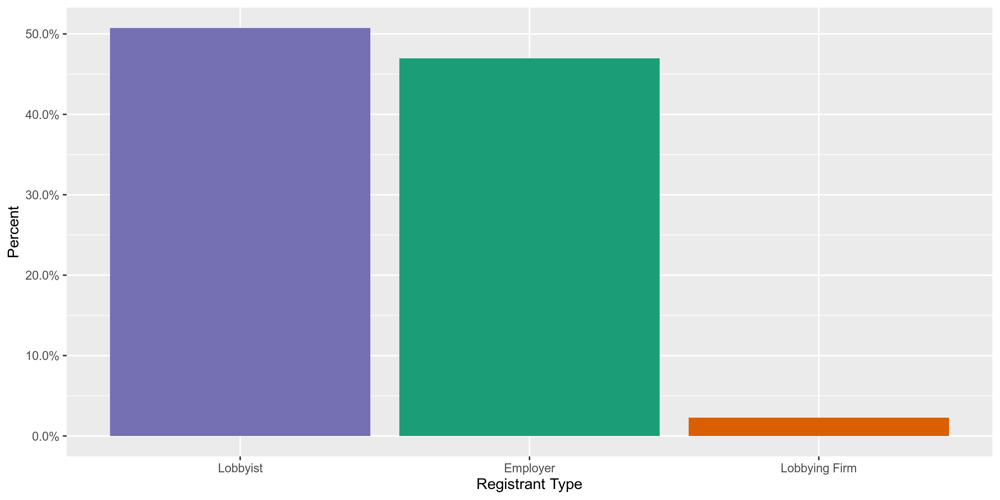

Vermont Lobbyists
================
Kiernan Nicholls
2019-10-02 12:54:07

  - [Project](#project)
  - [Objectives](#objectives)
  - [Packages](#packages)
  - [Data](#data)
  - [Import](#import)
  - [Explore](#explore)
  - [Conclude](#conclude)
  - [Export](#export)

<!-- Place comments regarding knitting here -->

## Project

The Accountability Project is an effort to cut across data silos and
give journalists, policy professionals, activists, and the public at
large a simple way to search across huge volumes of public data about
people and organizations.

Our goal is to standardizing public data on a few key fields by thinking
of each dataset row as a transaction. For each transaction there should
be (at least) 3 variables:

1.  All **parties** to a transaction
2.  The **date** of the transaction
3.  The **amount** of money involved

## Objectives

This document describes the process used to complete the following
objectives:

1.  How many records are in the database?
2.  Check for duplicates
3.  Check ranges
4.  Is there anything blank or missing?
5.  Check for consistency issues
6.  Create a five-digit ZIP Code called `ZIP5`
7.  Create a `YEAR` field from the transaction date
8.  Make sure there is data on both parties to a transaction

## Packages

The following packages are needed to collect, manipulate, visualize,
analyze, and communicate these results. The `pacman` package will
facilitate their installation and attachment.

The IRW’s `campfin` package will also have to be installed from GitHub.
This package contains functions custom made to help facilitate the
processing of campaign finance data.

``` r
if (!require("pacman")) install.packages("pacman")
pacman::p_load_gh("irworkshop/campfin")
pacman::p_load(
  RSelenium, # remote browser
  tidyverse, # data manipulation
  lubridate, # datetime strings
  magrittr, # pipe opperators
  janitor, # dataframe clean
  refinr, # cluster and merge
  scales, # format strings
  knitr, # knit documents
  vroom, # read files fast
  glue, # combine strings
  here, # relative storage
  fs # search storage 
)
```

This document should be run as part of the `R_campfin` project, which
lives as a sub-directory of the more general, language-agnostic
[`irworkshop/accountability_datacleaning`](https://github.com/irworkshop/accountability_datacleaning "TAP repo")
GitHub repository.

The `R_campfin` project uses the [RStudio
projects](https://support.rstudio.com/hc/en-us/articles/200526207-Using-Projects "Rproj")
feature and should be run as such. The project also uses the dynamic
`here::here()` tool for file paths relative to *your* machine.

``` r
# where does this document knit?
here::here()
#> [1] "/home/kiernan/R/accountability_datacleaning/R_campfin"
```

## Data

### About

### Variables

## Import

### Download

``` r
raw_dir <- here("vt", "lobbying", "data", "raw")
dir_create(raw_dir)
```

``` r
# open the driver with auto download options
remote_driver <- rsDriver(port = 4444L, browser = "firefox")

# navigate to the FL DOE download site
remote_browser <- remote_driver$client
remote_browser$navigate("https://lobbying.sec.state.vt.us/Public/SearchFiledReports")

# chose "All" from elections list
biennium_menu <- ""
remote_browser$findElement("xpath", biennium_menu)$clickElement()

# check report type boxes
checkboxes <- c("#chkDisclosure", "#chkTermination", "#chkRemoved", "#chkAdvertising")
for(box in checkboxes) {
  remote_browser$findElement("css", box)$clickElement()
}

# click search button
remote_browser$findElement("css", "#btnSearch")$clickElement()

# click csv export button
csv_button <- "td.bgfooter:nth-child(2) > a:nth-child(2) > img:nth-child(1)"
remote_browser$findElement("css", csv_button)$clickElement()

# close the browser and driver
remote_browser$close()
remote_driver$server$stop()
```

``` r
raw_file <- dir_ls(raw_dir)
```

### Read

``` r
usa_dttm <- "%m/%d/%Y %H:%M:%S %p"
vt <- read_csv(
  file = raw_file,
  col_types = cols(
    .default = col_character(),
    `Start Date` = col_date(usa_dttm),
    `End Date` = col_date(usa_dttm),
    `Filed Date` = col_date(usa_dttm),
    `Amended Date` = col_date(usa_dttm)
  )
)

vt <- vt %>% 
  clean_names("snake") %>% 
  remove_empty("cols")
```

## Explore

``` r
head(vt)
#> # A tibble: 6 x 8
#>   registrant_type registrant_name biennium start_date end_date   filed_date amended_date
#>   <chr>           <chr>           <chr>    <date>     <date>     <date>     <date>      
#> 1 Employer        Vermont Associ… 2015 - … 2015-01-01 2015-03-31 2015-01-09 NA          
#> 2 Lobbyist        Lynch, Nancy T  2015 - … 2015-01-01 2015-03-31 2015-01-15 NA          
#> 3 Lobbyist        Brownlie, Thom… 2015 - … 2015-01-01 2015-03-31 2015-01-23 NA          
#> 4 Lobbyist        Brownlie, Thom… 2015 - … 2015-01-01 2015-03-31 2015-01-23 NA          
#> 5 Employer        Pfizer Inc.     2015 - … 2015-01-01 2015-03-31 2015-01-23 NA          
#> 6 Employer        Vermont Pharma… 2015 - … 2015-01-01 2015-03-31 2015-01-25 NA          
#> # … with 1 more variable: filed_report_name <chr>
tail(vt)
#> # A tibble: 6 x 8
#>   registrant_type registrant_name biennium start_date end_date   filed_date amended_date
#>   <chr>           <chr>           <chr>    <date>     <date>     <date>     <date>      
#> 1 Employer        Gilead Science… 2019 - … 2019-09-01 2019-12-31 2019-10-01 NA          
#> 2 Employer        Weidmann Elect… 2019 - … 2019-09-01 2019-12-31 2019-10-01 NA          
#> 3 Employer        MTX Group, Inc. 2019 - … 2019-09-01 2019-12-31 2019-10-01 NA          
#> 4 Lobbying Firm   MMR, LLC        2019 - … 2019-09-01 2019-12-31 2019-10-01 NA          
#> 5 Lobbyist        Bruhn, Paul     2019 - … 2019-09-01 2019-12-31 2019-10-02 NA          
#> 6 Employer        Preservation T… 2019 - … 2019-09-01 2019-12-31 2019-10-02 NA          
#> # … with 1 more variable: filed_report_name <chr>
glimpse(sample_frac(vt))
#> Observations: 27,380
#> Variables: 8
#> $ registrant_type   <chr> "Lobbyist", "Lobbyist", "Lobbyist", "Employer", "Employer", "Lobbyist"…
#> $ registrant_name   <chr> "O'Callaghan, Jack", "Badalucco, Matthew", "Widmayer, Amber", "Delta D…
#> $ biennium          <chr> "2017 - 2018", "2017 - 2018", "2019 - 2020", "2017 - 2018", "2015 - 20…
#> $ start_date        <date> 2017-05-01, 2017-04-01, 2019-09-01, 2018-04-01, 2016-05-01, 2017-05-0…
#> $ end_date          <date> 2017-05-31, 2017-04-30, 2019-12-31, 2018-04-30, 2016-05-31, 2017-05-3…
#> $ filed_date        <date> 2017-06-15, 2017-05-15, 2019-10-01, 2018-05-14, 2016-06-10, 2017-06-1…
#> $ amended_date      <date> NA, NA, NA, NA, NA, NA, 2015-10-28, NA, NA, NA, NA, NA, NA, NA, NA, N…
#> $ filed_report_name <chr> "Disclosures June 15, 2017", "Disclosures May 15, 2017", "Removed 2019…
```

### Missing

``` r
glimpse_fun(vt, count_na)
#> # A tibble: 8 x 4
#>   col               type      n       p
#>   <chr>             <chr> <dbl>   <dbl>
#> 1 registrant_type   chr       0 0      
#> 2 registrant_name   chr       0 0      
#> 3 biennium          chr       0 0      
#> 4 start_date        date     30 0.00110
#> 5 end_date          date     30 0.00110
#> 6 filed_date        date      0 0      
#> 7 amended_date      date  26693 0.975  
#> 8 filed_report_name chr       0 0
```

``` r
vt <- flag_na(vt, -amended_date)
sum(vt$na_flag)
#> [1] 30
```

### Duplicates

``` r
vt <- flag_dupes(vt, everything())
sum(vt$dupe_flag)
#> [1] 52
```

``` r
filter(vt, dupe_flag)
#> # A tibble: 52 x 10
#>    registrant_type registrant_name biennium start_date end_date   filed_date amended_date
#>    <chr>           <chr>           <chr>    <date>     <date>     <date>     <date>      
#>  1 Employer        Vermont Busine… 2015 - … 2015-01-01 2015-03-31 2015-04-25 NA          
#>  2 Employer        Vermont Busine… 2015 - … 2015-04-01 2015-08-31 2015-09-15 NA          
#>  3 Employer        Community of V… 2015 - … 2015-09-01 2015-12-31 2015-10-12 NA          
#>  4 Employer        Healthfirst, I… 2015 - … 2015-09-01 2015-12-31 2015-10-12 NA          
#>  5 Employer        American Heart… 2015 - … 2015-09-01 2015-12-31 2015-10-12 NA          
#>  6 Employer        Vermont Chirop… 2015 - … 2015-09-01 2015-12-31 2015-10-12 NA          
#>  7 Employer        Vermont Associ… 2015 - … 2015-09-01 2015-12-31 2015-10-12 NA          
#>  8 Employer        Patient Choice… 2015 - … 2015-09-01 2015-12-31 2015-10-12 NA          
#>  9 Employer        Patient Choice… 2015 - … 2015-09-01 2015-12-31 2015-10-12 NA          
#> 10 Employer        Vermont Natura… 2015 - … 2015-09-01 2015-12-31 2015-11-24 NA          
#> # … with 42 more rows, and 3 more variables: filed_report_name <chr>, na_flag <lgl>,
#> #   dupe_flag <lgl>
```

### Categorical

``` r
glimpse_fun(vt, n_distinct)
#> # A tibble: 10 x 4
#>    col               type      n         p
#>    <chr>             <chr> <dbl>     <dbl>
#>  1 registrant_type   chr       3 0.000110 
#>  2 registrant_name   chr    1642 0.0600   
#>  3 biennium          chr       3 0.000110 
#>  4 start_date        date     32 0.00117  
#>  5 end_date          date     32 0.00117  
#>  6 filed_date        date    947 0.0346   
#>  7 amended_date      date    247 0.00902  
#>  8 filed_report_name chr      38 0.00139  
#>  9 na_flag           lgl       2 0.0000730
#> 10 dupe_flag         lgl       2 0.0000730
```

``` r
explore_plot(vt, registrant_type)
```

<!-- -->

#### Dates

``` r
vt <- mutate(vt, filed_year = year(filed_date))
```

``` r
min(vt$filed_date)
#> [1] "2015-01-09"
sum(vt$filed_year < 2000)
#> [1] 0
max(vt$filed_date)
#> [1] "2019-10-02"
sum(vt$filed_date > today())
#> [1] 0
```

## Conclude

1.  There are `nrow(vt)` records in the database.
2.  There are `sum(vt$dupe_flag)` duplicate records in the database.
3.  The range of `filed_date` is very reasonable.
4.  There are `sum(vt$na_flag)` records missing the `start_date` and
    `end_date`.
5.  The database does not contain any geographic data.
6.  The 4-digit `filed_year` variable has been created with
    `lubridate::year()`.

## Export

``` r
proc_dir <- here("vt", "lobbying", "data", "processed")
dir_create(proc_dir)
```

``` r
write_csv(
  x = vt,
  path = glue("{proc_dir}/vt_lobbyists_clean.csv"),
  na = ""
)
```
