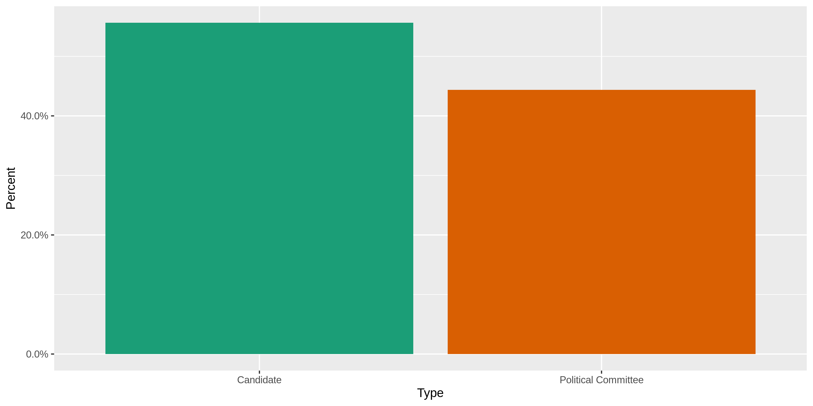
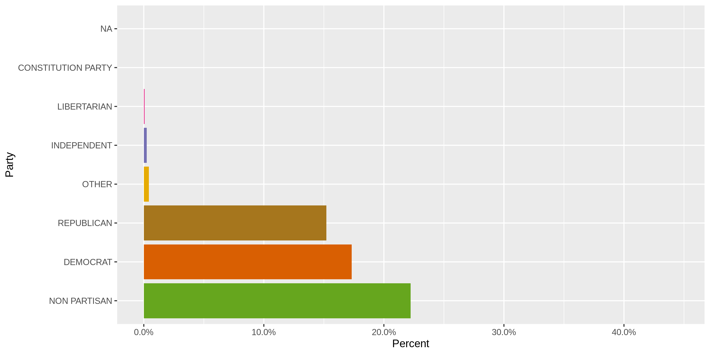
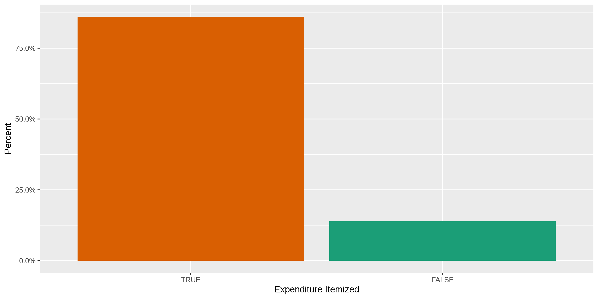
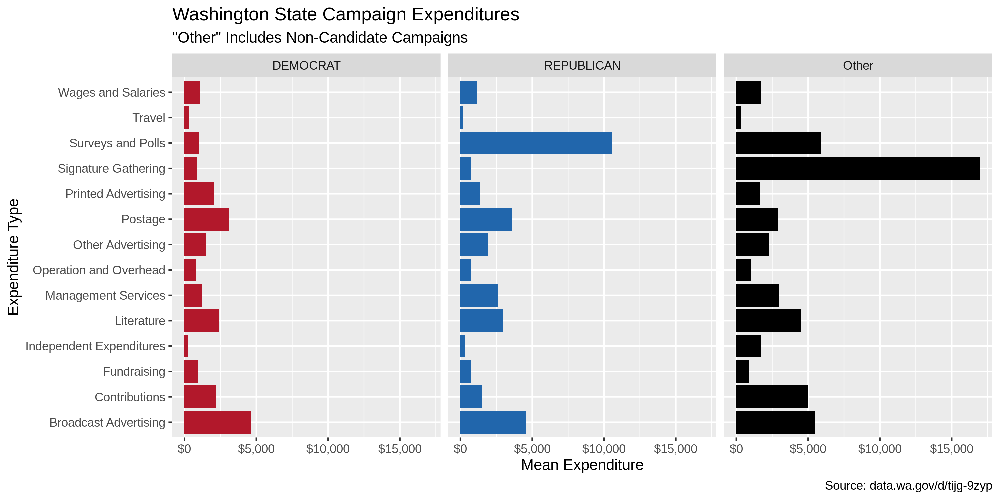
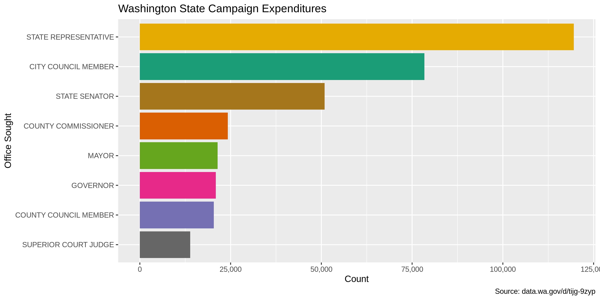
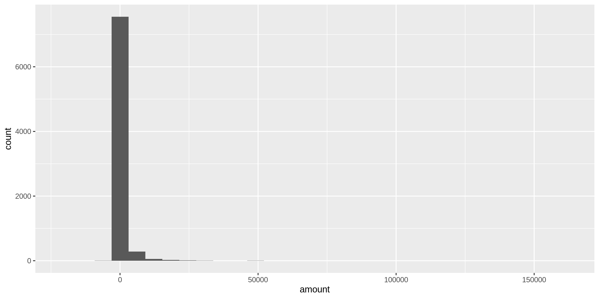
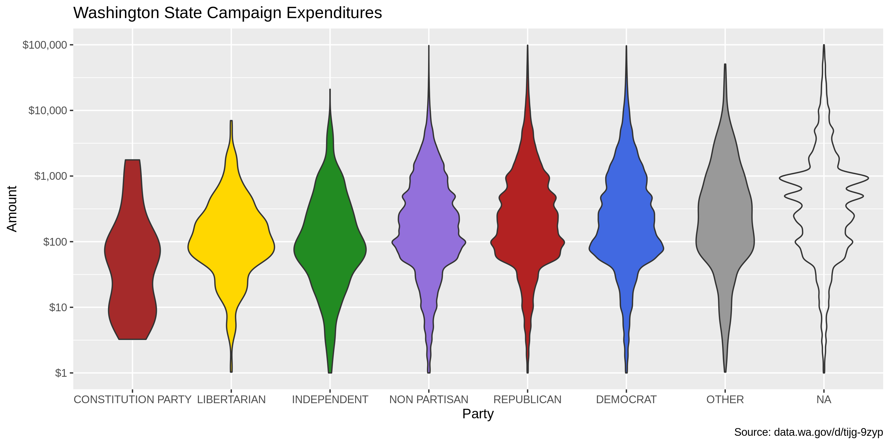
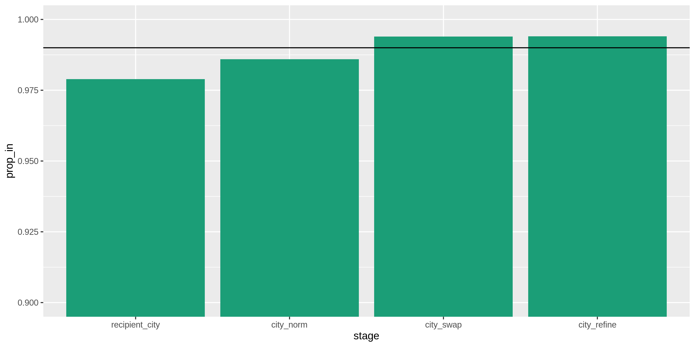

Data Diary
================
Kiernan Nicholls
2019-10-28 13:14:33

<!-- Place comments regarding knitting here -->

## Project

The Accountability Project is an effort to cut across data silos and
give journalists, policy professionals, activists, and the public at
large a simple way to search across huge volumes of public data about
people and organizations.

Our goal is to standardizing public data on a few key fields by thinking
of each dataset row as a transaction. For each transaction there should
be (at least) 3 variables:

1.  All **parties** to a transaction
2.  The **date** of the transaction
3.  The **amount** of money involved

## Objectives

This document describes the process used to complete the following
objectives:

1.  How many records are in the database?
2.  Check for duplicates
3.  Check ranges
4.  Is there anything blank or missing?
5.  Check for consistency issues
6.  Create a five-digit ZIP Code called `ZIP5`
7.  Create a `YEAR` field from the transaction date
8.  Make sure there is data on both parties to a transaction

## Packages

The following packages are needed to collect, manipulate, visualize,
analyze, and communicate these results. The `pacman` package will
facilitate their installation and attachment.

The IRW’s `campfin` package will also have to be installed from GitHub.
This package contains functions custom made to help facilitate the
processing of campaign finance data.

``` r
if (!require("pacman")) install.packages("pacman")
pacman::p_load_gh("irworkshop/campfin")
pacman::p_load(
  tidyverse, # data manipulation
  lubridate, # datetime strings
  magrittr, # pipe opperators
  janitor, # dataframe clean
  refinr, # cluster and merge
  scales, # format strings
  knitr, # knit documents
  vroom, # read files fast
  glue, # combine strings
  here, # relative storage
  fs # search storage 
)
```

This document should be run as part of the `R_campfin` project, which
lives as a sub-directory of the more general, language-agnostic
[`irworkshop/accountability_datacleaning`](https://github.com/irworkshop/accountability_datacleaning "TAP repo")
GitHub repository.

The `R_campfin` project uses the [RStudio
projects](https://support.rstudio.com/hc/en-us/articles/200526207-Using-Projects "Rproj")
feature and should be run as such. The project also uses the dynamic
`here::here()` tool for file paths relative to *your* machine.

``` r
# where does this document knit?
here::here()
#> [1] "/home/kiernan/R/accountability_datacleaning/R_campfin"
```

## Data

This dataset comes courtesy of the State of [Washington Public
Disclosure Commission](http://www.pdc.wa.gov), access through the
[data.wa.gov](https://data.wa.gov) portal.

The resource is named
`exenditures_by_candidates_and_political_committees` and covers the last
10 years of data with daily updates. Each records represents a single
“Expenditure by a campaign or committee.”

### About

> This dataset contains expenditures made by Washington State Candidates
> and Political Committees for the last 10 years as reported to the PDC
> on forms C3, C4, Schedule C and their electronic filing equivalents.
> 
> In-kind contributions are included in this data set as they are
> considered as both a contribution and expenditure. In-kind
> contributions are also included in the data set “Contributions to
> Candidates and Political Committees.”
> 
> For candidates, the number of years is determined by the year of the
> election, not necessarily the year the expenditure was reported. For
> political committees, the number of years is determined by the
> calendar year of the reporting period.
> 
> Candidates and political committees choosing to file under “mini
> reporting” are not included in this dataset. See WAC 390-16-105 for
> information regarding eligibility.
> 
> This dataset is a best-effort by the PDC to provide a complete set of
> records as described herewith and may contain incomplete or incorrect
> information. The PDC provides access to the original reports for the
> purpose of record verification.
> 
> Descriptions attached to this dataset do not constitute legal
> definitions; please consult RCW 42.17A and WAC Title 390 for legal
> definitions and additional information regarding political finance
> disclosure requirements.
> 
> CONDITION OF RELEASE: This publication constitutes a list of
> individuals prepared by the Washington State Public Disclosure
> Commission and may not be used for commercial purposes. This list is
> provided on the condition and with the understanding that the persons
> receiving it agree to this statutorily imposed limitation on its use.
> See RCW 42.56.070(9) and AGO 1975 No. 15.

### Variables

The [Data.WA API
page](https://dev.socrata.com/foundry/data.wa.gov/ukxb-bc7h) provides
definitions for the variables provided in this dataset.

`id`:

> PDC internal identifier that corresponds to a single expenditure
> record. When combined with the origin value, this number uniquely
> identifies a single row.

`report_number`:

> PDC identifier used for tracking the individual form C4 . Multiple
> expenditures will have the same report number when they were reported
> to the PDC at the same time. The report number is unique to the report
> it represents. When a report is amended, a new report number is
> assigned that supersedes the original version and the original report
> records are not included in this dataset.

`origin`:

> This field shows from which filed report-type the data originates.
> A/LE50 refers to non-itemized expenditures of $50 and less per
> expenditure. A/GT50 refers to itemized expenditures greater than $50
> per expenditure. A/LE50 and A/GT50 are both reported on schedule A of
> form C4
> 
> To view the different report types and forms browse
> to:<https://www.pdc.wa.gov/learn/forms>

`filer_id`:

> The unique id assigned to a candidate or political committee. The
> filer id is consistent across election years with the exception that
> an individual running for a second office in the same election year
> will receive a second filer id. There is no correlation between the
> two filer ids. For a candidate and single-election-year committee such
> as a ballot committee, the combination of filerid and electionyear
> uniquely identifies a campaign.

`type`:

> Indicates if this record is for a candidate or a political committee.
> In the case of a political committee, it may be either a continuing
> political committee, party committee or single election year
> committee.

`filer_name`:

> The candidate or committee name as reported on the form C1 candidate
> or committee registration form. The name will be consistent across all
> records for the same filer id and election year but may differ across
> years due to candidates or committees changing their name.

`id`:

> This field represents the first name, as reported by the filer. This
> field may appear blank if the name is not reported or if a filing
> entity has a single name, such as a PAC or other political committee.
> Note that this data appears as represented by the filer and may not be
> consistent from one reporting period to another.

`last_name`:

> This field represents the last name, as reported by the filer. The
> field may also contain the full name of a filing entity that is
> registered under one name, such as a PAC or other filing committee.
> Note that this data appears as represented by the filer and may not be
> consistent from one reporting period to another.

`office`:

> The office sought by the candidate. Does not apply to political
> committees.

`legislative_district`:

> The Washington State legislative district. This field only applies to
> candidates where the office is “state senator” or “state
> representative.”

`position`:

> The position associated with an office. This field typically applies
> to judicial and local office that have multiple positions or seats.
> This field does not apply to political committees.

`party`:

> The political party as declared by the candidate or committee on their
> form C1 registration. Contains only “Major parties” as recognized by
> Washington State law.

`ballot_number`:

> If the committee is a Statewide Ballot Initiative Committee a ballot
> number will appear once a ballot number is assigned by the Secretary
> of State. Local Ballot Initiatives will not have a ballot number. This
> field will contain a number only if the Secretary of State issues a
> number.

`for_or_against`:

> Ballot initiative committees are formed to either support or oppose an
> initiative. This field represents whether a committee “Supports” or
> “Opposes” a ballot initiative.

`jurisdiction_*`:

> The political jurisdiction associated with the office of a candidate.

> The county associated with the jurisdiction of a candidate.
> Multi-county jurisdictions as reported as the primary county. This
> field will be empty for political committees and when a candidate
> jurisdiction is statewide.

> The type of jurisdiction this office is: Statewide, Local, etc.

`election_year`:

> The election year in the case of candidates and single election
> committees. The reporting year in the case of continuing political
> committees.

`amount`:

> The amount of the expenditure or in-kind contribution. In-kind
> contributions are both a contribution and an expenditure and
> represented in both the contributions and expenditures data.

`itemized_or_non_itemized`:

> A record for an itemized expenditure represents a single expenditure.
> A record for a non-itemized expenditure represents one or more
> expenditures where the individual expenditures are less than the limit
> for itemized reporting. In this case the record is the aggregate total
> for the reporting period.

`expenditure_date`:

> The date that the expenditure was made or the in-kind contribution was
> received. See the metadata for the origin and amount field regarding
> in-kind contributions.

`code`:

> The type of expenditure. The values displayed are human readable
> equivalents of the type codes reported on the form C4 schedule A.
> Please refer to the form for a listing of all codes. Itemized
> expenditures are generally required to have either a code or a
> description but may be required to have both. Non-itemized
> expenditures do not have a description.

`recipient_name`:

> The name of the individual or vendor paid as reported. The names
> appearing here have not been normalized and the same entity may be
> represented by different names in the dataset. Non-itemized
> expenditures of $50 or less will have a recepient\_name of EXPENSES OF
> $50 OR LESS and origin of A/LE50, and all address fields will be
> empty.

`recipient_*`:

> The street address of the individual or vendor paid as reported.

> The city of the individual or vendor paid as reported.

> The state of the individual or vendor paid as reported.

> The zip code of the individual or vendor paid as reported.

`url`:

> A link to a PDF version of the original report as it was filed to the
> PDC.

`recipient_location`:

> The geocoded location of the individual or vendor paid as reported.
> The quality of the geocoded location is dependent on how many of the
> address fields are available and is calculated using a third-party
> service. The PDC has not verified the results of the geocoding. Please
> refer to the recipient\_name field for more information regarding
> address fields.

## Read

> The [Socrata Open Data API (SODA)](http://dev.socrata.com/) provides
> programmatic access to this dataset including the ability to filter,
> query, and aggregate data. For more more information, view the [API
> docs for this
> dataset](https://dev.socrata.com/foundry/data.wa.gov/ukxb-bc7h) or
> visit our [developer portal](http://dev.socrata.com/)

If an *recent* version of the file doesn’t exist locally, the
`RSocrata::read.socrate()` function can read the SODA dataset directly
from the API into R.

``` r
wa_filename <- here(
  "wa_expends", "data", "raw", 
  "exenditures_by_candidates_and_political_committees.csv"
)  
if (file.exists(wa_filename) & as_date(file.mtime(wa_filename)) == today()) {
  wa <- read_csv(
    file = wa_filename,
    col_types = cols(.default = col_character())
  )
  read_from_soda = FALSE
} else {
  wa <- as_tibble(read.socrata("https://data.wa.gov/resource/ukxb-bc7h.json"))
  read_from_soda = TRUE
}
wa$amount <- parse_number(wa$amount)
wa$election_year <- parse_number(wa$election_year)
wa$expenditure_date <- as_date(wa$expenditure_date)
```

If the file had to be downloaded from the SODA API, save a copy of the
raw data locally. Each `recipient_location.coordinates` value is a list
type, so they will have to be converted to character vectors before
being saved as a flat text file.

``` r
dir_create(here("wa_expends", "data", "raw"))
if (read_from_soda) {
  wa %>% 
    mutate(recipient_location.coordinates = as.character(recipient_location.coordinates)) %>% 
    write_csv(
      path = wa_filename,
      na = ""
    )
}
```

Before working with the data in R, some binary character type variables
will be converted to logical variables. The coordinates character string
will also be separated and converted to numeric latitude and longitude
variables.s

``` r
wa <- wa %>% 
  separate(
    col = recipient_location.coordinates,
    into = c("recipient_longitude", "recipient_latitude"),
    sep = ",\\s",
    remove = TRUE
  ) %>% 
  mutate(
    recipient_longitude = as.double(str_remove(recipient_longitude, "c\\(")),
    recipient_latitude = as.double(str_remove(recipient_latitude, "\\)")),
    expenditure_itemized = itemized_or_non_itemized == "Itemized",
    filer_supports = for_or_against == "For",
  ) %>% 
  select(
    -itemized_or_non_itemized,
    -for_or_against
  )
```

## Explore

There are 799775 records of 34 variables in the full database.

``` r
head(wa)
#> # A tibble: 6 x 34
#>   id    report_number origin filer_id type  filer_name first_name middle_initial last_name office
#>   <chr> <chr>         <chr>  <chr>    <chr> <chr>      <chr>      <chr>          <chr>     <chr> 
#> 1 7615… 100490476     A/GT50 MALIJ  … Cand… MALINOWSK… JAMES      H              MALINOWS… PUBLI…
#> 2 7615… 100490476     A/GT50 MALIJ  … Cand… MALINOWSK… JAMES      H              MALINOWS… PUBLI…
#> 3 7617… 100491167     A/GT50 NATIIO … Poli… NATL ASSN… <NA>       <NA>           NATL ASS… <NA>  
#> 4 7617… 100491167     A/GT50 NATIIO … Poli… NATL ASSN… <NA>       <NA>           NATL ASS… <NA>  
#> 5 7617… 100491167     A/GT50 NATIIO … Poli… NATL ASSN… <NA>       <NA>           NATL ASS… <NA>  
#> 6 7617… 100491167     A/GT50 NATIIO … Poli… NATL ASSN… <NA>       <NA>           NATL ASS… <NA>  
#> # … with 24 more variables: position <chr>, party <chr>, jurisdiction <chr>,
#> #   jurisdiction_county <chr>, jurisdiction_type <chr>, election_year <dbl>, amount <dbl>,
#> #   expenditure_date <date>, description <chr>, recipient_name <chr>, recipient_address <chr>,
#> #   recipient_city <chr>, recipient_state <chr>, recipient_zip <chr>, url_description <chr>,
#> #   url <chr>, recipient_location.type <chr>, recipient_longitude <dbl>, recipient_latitude <dbl>,
#> #   legislative_district <chr>, code <chr>, ballot_number <chr>, expenditure_itemized <lgl>,
#> #   filer_supports <lgl>
tail(wa)
#> # A tibble: 6 x 34
#>   id    report_number origin filer_id type  filer_name first_name middle_initial last_name office
#>   <chr> <chr>         <chr>  <chr>    <chr> <chr>      <chr>      <chr>          <chr>     <chr> 
#> 1 6566… 100940935     B.1    DELOC  … Cand… DELOSTRIN… CYNTHIA    <NA>           DELOSTRI… CITY …
#> 2 6566… 100940935     B.1    DELOC  … Cand… DELOSTRIN… CYNTHIA    <NA>           DELOSTRI… CITY …
#> 3 6566… 100940967     B.1    MARTA  … Cand… MARTINELL… ANTHONY    J              MARTINEL… CITY …
#> 4 6566… 100940967     B.1    MARTA  … Cand… MARTINELL… ANTHONY    J              MARTINEL… CITY …
#> 5 6566… 100940968     B.1    MARTA  … Cand… MARTINELL… ANTHONY    J              MARTINEL… CITY …
#> 6 6566… 100940969     B.1    MARTA  … Cand… MARTINELL… ANTHONY    J              MARTINEL… CITY …
#> # … with 24 more variables: position <chr>, party <chr>, jurisdiction <chr>,
#> #   jurisdiction_county <chr>, jurisdiction_type <chr>, election_year <dbl>, amount <dbl>,
#> #   expenditure_date <date>, description <chr>, recipient_name <chr>, recipient_address <chr>,
#> #   recipient_city <chr>, recipient_state <chr>, recipient_zip <chr>, url_description <chr>,
#> #   url <chr>, recipient_location.type <chr>, recipient_longitude <dbl>, recipient_latitude <dbl>,
#> #   legislative_district <chr>, code <chr>, ballot_number <chr>, expenditure_itemized <lgl>,
#> #   filer_supports <lgl>
glimpse(sample_frac(wa))
#> Observations: 799,775
#> Variables: 34
#> $ id                      <chr> "394578.expn", "1129207.expn", "5966748.rcpt", "1164073.expn", "…
#> $ report_number           <chr> "100256773", "100754654", "100845735", "100786566", "100433274",…
#> $ origin                  <chr> "A/GT50", "A/GT50", "B.1", "A/GT50", "A/GT50", "A/GT50", "A/GT50…
#> $ filer_id                <chr> "WASHID 144", "SATTD  166", "CLALDC 362", "OCKEA  019", "TURLW  …
#> $ type                    <chr> "Political Committee", "Candidate", "Political Committee", "Cand…
#> $ filer_name              <chr> "CONSUMER FIREWORKS SAFETY ASSN PAC", "SATTERBERG DANIEL T", "CL…
#> $ first_name              <chr> NA, "DANIEL", NA, "AMY", "WILLIAM", "BRIAN", NA, NA, NA, NA, NA,…
#> $ middle_initial          <chr> NA, "T", NA, "P", "E", "E", NA, NA, NA, NA, NA, "W", "C", NA, NA…
#> $ last_name               <chr> "CONSUMER FIREWORKS SAFETY ASSN PAC", "SATTERBERG", "CLALLAM CO …
#> $ office                  <chr> NA, "COUNTY PROSECUTOR", NA, "MAYOR", "CITY COUNCIL MEMBER", "ST…
#> $ position                <chr> NA, NA, NA, NA, "06", "02", NA, NA, NA, NA, NA, "01", NA, NA, NA…
#> $ party                   <chr> NA, "OTHER", NA, "NON PARTISAN", "NON PARTISAN", "DEMOCRAT", NA,…
#> $ jurisdiction            <chr> NA, "KING CO", NA, "CITY OF DUVALL", "CITY OF VANCOUVER", "LEG D…
#> $ jurisdiction_county     <chr> NA, "KING", NA, "KING", "CLARK", "COWLITZ", NA, NA, NA, NA, NA, …
#> $ jurisdiction_type       <chr> NA, "Local", NA, "Local", "Local", "Legislative", NA, NA, NA, NA…
#> $ election_year           <dbl> 2008, 2018, 2018, 2017, 2011, 2010, 2018, 2015, 2015, 2019, 2008…
#> $ amount                  <dbl> 1000.00, 4500.00, 70.00, 164.05, 20.80, 15000.00, 500.00, 180.99…
#> $ expenditure_date        <date> 2008-05-24, 2017-03-14, 2018-07-10, 2017-05-19, 2011-09-10, 201…
#> $ description             <chr> "APRIL 15, 2008, FUND-RAISER", "BREAKFAST KICKOFF", "BUTTONS AND…
#> $ recipient_name          <chr> "WASHINGTON STATE DEMOCRATIC CENTRAL COMMITTEE", "SHERATON SEATT…
#> $ recipient_address       <chr> "P O BOX 4027", "1400 6TH AVENUE", "1236 HOLLAND RD", "14524 MAI…
#> $ recipient_city          <chr> "SEATTLE", "SEATTLE", "SEQUIM", "DUVALL", "PORTLAND", "LONGVIEW"…
#> $ recipient_state         <chr> "WA", "WA", "WA", "WA", "OR", "WA", "WA", "DE", "IL", "TX", "WA"…
#> $ recipient_zip           <chr> "98194", "98101", "98382", "98019", "97202", "98632", "99338", "…
#> $ url_description         <chr> "View report", "View report", "View report", "View report", "Vie…
#> $ url                     <chr> "https://web.pdc.wa.gov/rptimg/default.aspx?batchnumber=10025677…
#> $ recipient_location.type <chr> "Point", "Point", "Point", "Point", "Point", "Point", "Point", N…
#> $ recipient_longitude     <dbl> -122.33206, -122.33351, -123.07327, -121.98660, -122.65001, -122…
#> $ recipient_latitude      <dbl> 47.60621, 47.61050, 48.10089, 47.73297, 45.46311, 46.15473, 46.1…
#> $ legislative_district    <chr> NA, NA, NA, NA, NA, "19", NA, NA, NA, NA, NA, "19", "12", NA, NA…
#> $ code                    <chr> NA, "Fundraising", "Independent Expenditures", NA, NA, NA, NA, N…
#> $ ballot_number           <chr> NA, NA, NA, NA, NA, NA, NA, NA, NA, NA, NA, NA, NA, NA, NA, NA, …
#> $ expenditure_itemized    <lgl> TRUE, TRUE, TRUE, TRUE, TRUE, TRUE, TRUE, TRUE, TRUE, TRUE, TRUE…
#> $ filer_supports          <lgl> NA, NA, NA, NA, NA, NA, NA, NA, NA, NA, NA, NA, NA, NA, NA, NA, …
```

### Distinct

The variables range in their degree of distinctness.

The `id` is 100% distinct and can be used to identify a unique
transaction.

``` r
glimpse_fun(wa, n_distinct)
#> # A tibble: 34 x 4
#>    col                     type       n          p
#>    <chr>                   <chr>  <dbl>      <dbl>
#>  1 id                      chr   799775 1         
#>  2 report_number           chr   113421 0.142     
#>  3 origin                  chr        6 0.00000750
#>  4 filer_id                chr     6162 0.00770   
#>  5 type                    chr        2 0.00000250
#>  6 filer_name              chr     6582 0.00823   
#>  7 first_name              chr     1202 0.00150   
#>  8 middle_initial          chr       28 0.0000350 
#>  9 last_name               chr     4937 0.00617   
#> 10 office                  chr       44 0.0000550 
#> 11 position                chr       72 0.0000900 
#> 12 party                   chr        8 0.0000100 
#> 13 jurisdiction            chr      541 0.000676  
#> 14 jurisdiction_county     chr       39 0.0000488 
#> 15 jurisdiction_type       chr        5 0.00000625
#> 16 election_year           dbl       18 0.0000225 
#> 17 amount                  dbl   120791 0.151     
#> 18 expenditure_date        date    5223 0.00653   
#> 19 description             chr   213776 0.267     
#> 20 recipient_name          chr   109402 0.137     
#> 21 recipient_address       chr   112864 0.141     
#> 22 recipient_city          chr     4059 0.00508   
#> 23 recipient_state         chr       74 0.0000925 
#> 24 recipient_zip           chr     5092 0.00637   
#> 25 url_description         chr        1 0.00000125
#> 26 url                     chr   113421 0.142     
#> 27 recipient_location.type chr        2 0.00000250
#> 28 recipient_longitude     dbl    46892 0.0586    
#> 29 recipient_latitude      dbl    46078 0.0576    
#> 30 legislative_district    chr       51 0.0000638 
#> 31 code                    chr       15 0.0000188 
#> 32 ballot_number           chr      104 0.000130  
#> 33 expenditure_itemized    lgl        2 0.00000250
#> 34 filer_supports          lgl        3 0.00000375
```

We can explore the distribution of the least distinct values with
`ggplot2::geom_bar()`.

<!-- -->

<!-- -->

<!-- -->

<!-- -->

<!-- -->

<!-- -->

<!-- -->

<!-- -->

### Missing

The variables also vary in their degree of values that are `NA`
(missing).

``` r
glimpse_fun(wa, count_na)
#> # A tibble: 34 x 4
#>    col                     type       n          p
#>    <chr>                   <chr>  <dbl>      <dbl>
#>  1 id                      chr        0 0         
#>  2 report_number           chr        0 0         
#>  3 origin                  chr        1 0.00000125
#>  4 filer_id                chr        0 0         
#>  5 type                    chr        0 0         
#>  6 filer_name              chr        0 0         
#>  7 first_name              chr   357574 0.447     
#>  8 middle_initial          chr   405713 0.507     
#>  9 last_name               chr      125 0.000156  
#> 10 office                  chr   354752 0.444     
#> 11 position                chr   520227 0.650     
#> 12 party                   chr   355834 0.445     
#> 13 jurisdiction            chr   336374 0.421     
#> 14 jurisdiction_county     chr   390918 0.489     
#> 15 jurisdiction_type       chr   354752 0.444     
#> 16 election_year           dbl        0 0         
#> 17 amount                  dbl        0 0         
#> 18 expenditure_date        date     351 0.000439  
#> 19 description             chr   114132 0.143     
#> 20 recipient_name          chr       21 0.0000263 
#> 21 recipient_address       chr   142205 0.178     
#> 22 recipient_city          chr   135631 0.170     
#> 23 recipient_state         chr   132215 0.165     
#> 24 recipient_zip           chr   139552 0.174     
#> 25 url_description         chr        0 0         
#> 26 url                     chr        0 0         
#> 27 recipient_location.type chr   164151 0.205     
#> 28 recipient_longitude     dbl   164151 0.205     
#> 29 recipient_latitude      dbl   164151 0.205     
#> 30 legislative_district    chr   629563 0.787     
#> 31 code                    chr   606469 0.758     
#> 32 ballot_number           chr   763310 0.954     
#> 33 expenditure_itemized    lgl        0 0         
#> 34 filer_supports          lgl   736163 0.920
```

We will flag any records with missing values in the key variables used
to identify an expenditure.

``` r
wa <- flag_na(wa, expenditure_date, recipient_name)
sum(wa$na_flag)
#> [1] 366
wa %>% 
  filter(na_flag) %>%
  sample_frac() %>% 
  select(
    na_flag,
    id, 
    report_number,
    filer_name,
    recipient_name,
    amount,
    expenditure_date
    )
#> # A tibble: 366 x 7
#>    na_flag id        report_number filer_name            recipient_name     amount expenditure_date
#>    <lgl>   <chr>     <chr>         <chr>                 <chr>               <dbl> <date>          
#>  1 TRUE    558876.e… 1001275686    GRIFFEY DANIEL G      Expenses of $50 o…     0  NA              
#>  2 TRUE    1038902.… 1001294941    28TH DIST REPUB LEG … Expenses of $50 o…     0  NA              
#>  3 TRUE    493835.e… 100267574     WA PUBLIC EMPLOYEES … Expenses of $50 o…     0  NA              
#>  4 TRUE    400050.e… 1001267848    LJUNGHAMMAR KEITH N   Expenses of $50 o…     0  NA              
#>  5 TRUE    1039327.… 1001295002    TRAVIS BRIAN M        Expenses of $50 o…     0  NA              
#>  6 TRUE    746783.e… 1001283872    GALE STEPHAN G        Expenses of $50 o…     0  NA              
#>  7 TRUE    535146.e… 1001273137    REYNOLDS ELIZABETH A  Expenses of $50 o…     0  NA              
#>  8 TRUE    493792.e… 100230501     WA PUBLIC EMPLOYEES … Expenses of $50 o…     0  NA              
#>  9 TRUE    778594.e… 1001284363    DAVIES MARK T         Expenses of $50 o…   195. NA              
#> 10 TRUE    760323.e… 1001284164    GALE STEPHAN G        Expenses of $50 o…   103. NA              
#> # … with 356 more rows
```

### Duplicates

Using `campfin::dupe_flag()` we can identify a number of rows that have
completely duplicated values, aside from the supposedly unique `id`
variable.

``` r
wa <- flag_dupes(wa, -id)
sum(wa$dupe_flag)
#> [1] 7960
percent(mean(wa$dupe_flag))
#> [1] "0.995%"
```

Most of these duplicate records have an `amount` value of zero, meaning
they are likely corrections to previous expenditures.

<!-- -->

### Ranges

The range of continuous variables will need to be checked for data
integrity. There are only two quasi-continuous variables, the `amount`
and `expenditure_date`

We can checl the distribution of continuous variables with
`ggplot2::geom_histogram()`

#### Transaction Amounts

The middle range for `amount` seems reasonable enough. 1.80% percent of
`amount` values are less than zero.

``` r
summary(wa$amount)
#>     Min.  1st Qu.   Median     Mean  3rd Qu.     Max. 
#> -2500000       53      192     1639      716  5000000
tabyl(wa$amount > 0)
#> # A tibble: 2 x 3
#>   `wa$amount > 0`      n percent
#>   <lgl>            <dbl>   <dbl>
#> 1 FALSE            77726  0.0972
#> 2 TRUE            722049  0.903
```

Most expenditures are for relatively little amount.

<!-- -->

<!-- -->

<!-- -->

Below are the smallest and largest expenditures.

``` r
glimpse(wa %>% filter(amount == min(amount, na.rm = T)))
#> Observations: 1
#> Variables: 36
#> $ id                      <chr> "23405.corr"
#> $ report_number           <chr> "100441590"
#> $ origin                  <chr> "C.2"
#> $ filer_id                <chr> "YES1183109"
#> $ type                    <chr> "Political Committee"
#> $ filer_name              <chr> "YES ON 1183 COALITION"
#> $ first_name              <chr> NA
#> $ middle_initial          <chr> NA
#> $ last_name               <chr> "YES ON 1183 COALITION"
#> $ office                  <chr> NA
#> $ position                <chr> NA
#> $ party                   <chr> NA
#> $ jurisdiction            <chr> NA
#> $ jurisdiction_county     <chr> NA
#> $ jurisdiction_type       <chr> NA
#> $ election_year           <dbl> 2011
#> $ amount                  <dbl> -2500000
#> $ expenditure_date        <date> 2011-10-17
#> $ description             <chr> "(Reported amount: 8,929,810.00; Corrected amount: 6,429,810.00)…
#> $ recipient_name          <chr> "CORRECTION TO EXPENDITURES"
#> $ recipient_address       <chr> NA
#> $ recipient_city          <chr> NA
#> $ recipient_state         <chr> NA
#> $ recipient_zip           <chr> NA
#> $ url_description         <chr> "View report"
#> $ url                     <chr> "https://web.pdc.wa.gov/rptimg/default.aspx?batchnumber=10044159…
#> $ recipient_location.type <chr> NA
#> $ recipient_longitude     <dbl> NA
#> $ recipient_latitude      <dbl> NA
#> $ legislative_district    <chr> NA
#> $ code                    <chr> NA
#> $ ballot_number           <chr> "1183"
#> $ expenditure_itemized    <lgl> TRUE
#> $ filer_supports          <lgl> TRUE
#> $ na_flag                 <lgl> FALSE
#> $ dupe_flag               <lgl> FALSE
glimpse(wa %>% filter(amount == max(amount, na.rm = T)))
#> Observations: 1
#> Variables: 36
#> $ id                      <chr> "1106020.expn"
#> $ report_number           <chr> "100736208"
#> $ origin                  <chr> "A/GT50"
#> $ filer_id                <chr> "GROCMA 005"
#> $ type                    <chr> "Political Committee"
#> $ filer_name              <chr> "GROCERY MANUFACTURERS ASSN AGAINST I-522"
#> $ first_name              <chr> NA
#> $ middle_initial          <chr> NA
#> $ last_name               <chr> "GROCERY MANUFACTURERS ASSN AGAINST I-522"
#> $ office                  <chr> NA
#> $ position                <chr> NA
#> $ party                   <chr> NA
#> $ jurisdiction            <chr> NA
#> $ jurisdiction_county     <chr> NA
#> $ jurisdiction_type       <chr> NA
#> $ election_year           <dbl> 2013
#> $ amount                  <dbl> 5e+06
#> $ expenditure_date        <date> 2013-09-27
#> $ description             <chr> "CONTRIBUTION"
#> $ recipient_name          <chr> "NO ON I-522 COMMITTEE"
#> $ recipient_address       <chr> "PO BOX 7325"
#> $ recipient_city          <chr> "OLYMPIA"
#> $ recipient_state         <chr> "WA"
#> $ recipient_zip           <chr> "98507"
#> $ url_description         <chr> "View report"
#> $ url                     <chr> "https://web.pdc.wa.gov/rptimg/default.aspx?batchnumber=10073620…
#> $ recipient_location.type <chr> "Point"
#> $ recipient_longitude     <dbl> -122.896
#> $ recipient_latitude      <dbl> 47.04087
#> $ legislative_district    <chr> NA
#> $ code                    <chr> NA
#> $ ballot_number           <chr> "522"
#> $ expenditure_itemized    <lgl> TRUE
#> $ filer_supports          <lgl> FALSE
#> $ na_flag                 <lgl> FALSE
#> $ dupe_flag               <lgl> FALSE
```

We can view the link provided in the `url` variable to see the smallest
expenditure is a correction to an expenditure to Costco previously
reported as $8,929,810 that should have been $6,429,810. Interestingly,
this same report shows a *contribution* from the same Costco for the
exact same amount with the exact same correction. There is no
description for the correction.

Using the `url` from the maximum report, the $5,000,000 expenditure has
“contribution” listed in the “Purpose of Expense” box with nothing put
in the spot for “Code” meant to identify the record as a contribution or
expenditure.

These two sample reports can be found as PDF files in the `data/`
directory.

### Transaction Dates

There are a number of records with incorrect `expenditure_date`
variables. There are no records with expenditures made in the future,
but there are a number of suspiciously old expenditures.

``` r
max(wa$expenditure_date, na.rm = TRUE)
#> [1] "2019-10-25"
sum(wa$expenditure_date > today(), na.rm = T)
#> [1] 0
```

PDC claims that the dataset covers the last 10 years of data, but there
are thousands of records older than that, with one from 1964. The report
containing that expenditure was filed in 2010 and can be found as PDF in
the `data/` directory. That one report is the only one with an
expenditure date before 2000, the rest appear to be correct dates simply
outside the expected time span.

``` r
min(wa$expenditure_date, na.rm = TRUE)
#> [1] "1964-06-11"
sum(year(wa$expenditure_date) < 2007, na.rm = TRUE)
#> [1] 2486
```

To better track expenditures in the TAP database, we will create a
`expenditure_year` variable from the previously parsed
`expenditure_date` using `lubridate::year()`.

``` r
wa <- wa %>% mutate(
  expenditure_year = year(expenditure_date),
  date_flag = is_less_than(expenditure_year, 2007)
)
```

<!-- -->

## Clean

### Address

The `recipient_address` variable will be minimally cleaned by removing
punctuation and fixing white-space.

``` r
wa <- wa %>% 
  mutate(
    address_norm = normal_address(
      address = recipient_address,
      add_abbs = usps_street,
      na_rep = TRUE
    )
  )
```

``` r
wa %>% 
  select(contains("address")) %>% 
  distinct() %>% 
  sample_frac()
#> # A tibble: 112,864 x 2
#>    recipient_address              address_norm                     
#>    <chr>                          <chr>                            
#>  1 17837 1ST AVENUE SOUTH         17837 1ST AVENUE SOUTH           
#>  2 4023 E SPRAGUE                 4023 EAST SPRAGUE                
#>  3 1110 N GRAND AVE               1110 NORTH GRAND AVENUE          
#>  4 2925 HARRISON AVE NW           2925 HARRISON AVENUE NORTHWEST   
#>  5 115 S 10TH AVE                 115 SOUTH 10TH AVENUE            
#>  6 5432 PARK PLACE LOOP SE        5432 PARK PLACE LOOP SOUTHEAST   
#>  7 1000 AURORA AVENUE, UNIT N-100 1000 AURORA AVENUE UNIT NORTH 100
#>  8 600 STEWART ST., #1510         600 STEWART STREET 1510          
#>  9 1525 209TH AVE NE              1525 209TH AVENUE NORTHEAST      
#> 10 6934 FAIRWAY LN SE             6934 FAIRWAY LANE SOUTHEAST      
#> # … with 112,854 more rows
```

### ZIP

``` r
wa <- wa %>% 
  mutate(
    zip_norm = normal_zip(
      zip = recipient_zip,
      na_rep = TRUE
    )
  )
```

``` r
wa %>% 
  select(contains("zip")) %>% 
  filter(zip_norm != recipient_zip)
#> # A tibble: 762 x 2
#>    recipient_zip zip_norm
#>    <chr>         <chr>   
#>  1 985           00985   
#>  2 7011          07011   
#>  3 7011          07011   
#>  4 7011          07011   
#>  5 3792          03792   
#>  6 992           00992   
#>  7 982           00982   
#>  8 9811          09811   
#>  9 9366          09366   
#> 10 3/11/         00311   
#> # … with 752 more rows
```

``` r
progress_table(
  wa$recipient_zip,
  wa$zip_norm,
  compare = valid_zip
)
#> # A tibble: 2 x 6
#>   stage         prop_in n_distinct prop_na n_out n_diff
#>   <chr>           <dbl>      <dbl>   <dbl> <dbl>  <dbl>
#> 1 recipient_zip   0.991       5092   0.174  6028    679
#> 2 zip_norm        0.997       5014   0.179  2220    539
```

### State

``` r
wa <- wa %>% 
  mutate(
    state_norm = normal_state(
      state = recipient_state,
      abbreviate = TRUE,
      na_rep = TRUE,
      valid = NULL
    )
  )
```

``` r
wa %>% 
  filter(state_norm %out% valid_state) %>% 
  count(state_norm, sort = TRUE)
#> # A tibble: 18 x 2
#>    state_norm      n
#>    <chr>       <int>
#>  1 <NA>       132222
#>  2 NB             45
#>  3 RE             11
#>  4 AB              8
#>  5 BC              8
#>  6 IS              3
#>  7 ON              3
#>  8 SA              2
#>  9 SH              2
#> 10 CN              1
#> 11 FR              1
#> 12 HR              1
#> 13 IR              1
#> 14 OT              1
#> 15 QA              1
#> 16 SW              1
#> 17 TE              1
#> 18 UK              1
```

``` r
progress_table(
  wa$recipient_state,
  wa$state_norm,
  compare = valid_state
)
#> # A tibble: 2 x 6
#>   stage           prop_in n_distinct prop_na n_out n_diff
#>   <chr>             <dbl>      <dbl>   <dbl> <dbl>  <dbl>
#> 1 recipient_state   1.000         74   0.165    98     21
#> 2 state_norm        1.000         71   0.165    91     18
```

### City

Cleaning city values is the most complicated. This process involves four
steps:

1.  Prepare raw city values by removing invalid data and reducing
    inconsistencies
2.  Match prepared city values with the *actual* city name of that
    record’s ZIP code
3.  Swap prepared city values with the ZIP code match *if* only 1 edit
    is needed
4.  Refine swapped city values with key collision and n-gram
    fingerprints

#### Normal

``` r
wa <- wa %>% 
  mutate(
    city_norm = normal_city(
      city = recipient_city,
      geo_abbs = usps_city,
      st_abbs = c("WA", "DC"),
      na = invalid_city,
      na_rep = TRUE
    )
  )
```

#### Swap

The second step will be to compare the new `city_norm` value to the
*actual* city value for that record’s `zip_norm` value. If the
`city_norm` is very similar to the expected city name for that ZIP code,
we can make that change.

``` r
wa <- wa %>% 
  left_join(
    y = zipcodes,
    by = c(
      "state_norm" = "state",
      "zip_norm" = "zip"
    )
  ) %>% 
  rename(city_match = city) %>% 
  mutate(
    match_abb = is_abbrev(city_norm, city_match),
    match_dist = str_dist(city_norm, city_match),
    city_swap = if_else(
      condition = match_abb | match_dist == 1,
      true = city_match,
      false = city_norm
    )
  )
```

#### Refine

``` r
wa_refine <- wa %>% 
  mutate(
    city_refine = city_swap %>% 
      key_collision_merge() %>% 
      n_gram_merge(numgram = 1)
  ) %>% 
  inner_join(
    y = zipcodes,
    by = c(
      "city_refine" = "city",
      "state_norm" = "state",
      "zip_norm" = "zip"
    )
  )
```

``` r
wa_refine %>% 
  filter(city_refine != city_swap) %>% 
  count(city_swap, city_refine, sort = TRUE)
#> # A tibble: 30 x 3
#>    city_swap          city_refine           n
#>    <chr>              <chr>             <int>
#>  1 CINCINATTI         CINCINNATI           19
#>  2 MULKITEO           MUKILTEO              9
#>  3 OLAOOA             OLALLA                9
#>  4 COUER DALENE       COEUR D ALENE         8
#>  5 SAN FRANSICO       SAN FRANCISCO         7
#>  6 NO CANTON          CANTON                4
#>  7 OKANGAON           OKANOGAN              3
#>  8 SPOAKEN            SPOKANE               3
#>  9 FREDRAL WAY        FEDERAL WAY           2
#> 10 MOUNT LAEK TERRACE MOUNTLAKE TERRACE     2
#> # … with 20 more rows
```

Then, we match these refined values to the original data. Use the
refined value where possible, otherwise use the swapped city value
(which is the prepared value or real value).

``` r
wa <- wa %>% 
  left_join(wa_refine) %>% 
  mutate(city_refine = coalesce(city_refine, city_swap))
```

#### Progress

``` r
wa %>% 
  filter(city_refine %out% valid_city) %>% 
  count(city_refine, state_norm, sort = TRUE) %>% 
  drop_na()
#> # A tibble: 462 x 3
#>    city_refine      state_norm     n
#>    <chr>            <chr>      <int>
#>  1 SPOKANE VALLEY   WA          3423
#>  2 TUKWILA          WA          2150
#>  3 BURIEN           WA          1733
#>  4 SEATAC           WA          1173
#>  5 CAMANO ISLAND    WA           863
#>  6 LAKE FOREST PARK WA           644
#>  7 NORMANDY PARK    WA           439
#>  8 SYMMES TOWNSHIP  OH           293
#>  9 FIRCREST         WA           261
#> 10 UNION GAP        WA           161
#> # … with 452 more rows
```

If we expand `valid_city` to include the *six* most common “invalid”
cities, we realize the vast majority of our cities have been properly
normalized.

``` r
other_cities <- most_common(wa$city_refine[which(wa$city_refine %out% valid_city)])
```

``` r
prog_table <- progress_table(
  wa$recipient_city,
  wa$city_norm,
  wa$city_swap,
  wa$city_refine,
  compare = c(valid_city, other_cities)
)
prog_table$stage <- as_factor(prog_table$stage)
```

``` r
kable(prog_table)
```

| stage           |  prop\_in | n\_distinct |  prop\_na | n\_out | n\_diff |
| :-------------- | --------: | ----------: | --------: | -----: | ------: |
| recipient\_city | 0.9788871 |        4059 | 0.1695864 |  14022 |    2041 |
| city\_norm      | 0.9859656 |        3734 | 0.1702854 |   9313 |    1704 |
| city\_swap      | 0.9939347 |        2464 | 0.1908662 |   3925 |     487 |
| city\_refine    | 0.9940707 |        2434 | 0.1908662 |   3837 |     457 |

``` r
prog_table %>% 
  ggplot(aes(x = stage, y = prop_in)) +
  geom_col(fill = RColorBrewer::brewer.pal(3, "Dark2")[1]) +
  geom_hline(yintercept = 0.99) +
  coord_cartesian(ylim = c(.9, 1))
```

<!-- -->

``` r
prog_table %>% 
  mutate(n_good = n_distinct - n_diff) %>% 
  rename(n_bad = n_diff) %>% 
  pivot_longer(cols = c(n_good, n_bad)) %>% 
  ggplot(aes(x = stage, y = value)) +
  geom_col(aes(fill = name)) +
  scale_fill_brewer(palette = "Set1")
```

<!-- -->

## Conclude

1.  There are 799775 records in the database
2.  There are 7960 records with duplicate filer, recipient, date, *and*
    amount (flagged with `dupe_flag`)
3.  The ranges for dates and amounts are reasonable
4.  Consistency in strings has been fixed with `city_prep()` and the
    `stringr` package
5.  The five-digit `zip_norm` variable has been created with
    `zipcode::clean.zipcode()`
6.  The `expenditure_year` variable has been created with
    `lubridate::year()`
7.  There are 21 records with missing `recipient_name` values and 351
    records with missing `expenditure_date` values (both flagged with
    the `na_flag`)

## Write

``` r
proc_dir <- here("wa", "expends", "data", "processed")
dir_create(proc_dir)
```

``` r
wa %>% 
  rename(
    address_clean = address_norm,
    zip_clean = zip_norm,
    state_clean = state_norm,
    city_clean = city_refine
  ) %>%
  select(
    -recipient_location.type,
    -city_norm,
    -city_match,
    -match_dist,
    -match_abb,
    -city_swap
  ) %>% 
  write_csv(
    path = glue("{proc_dir}/wa_expends_clean.csv"),
    na = ""
  )
```
