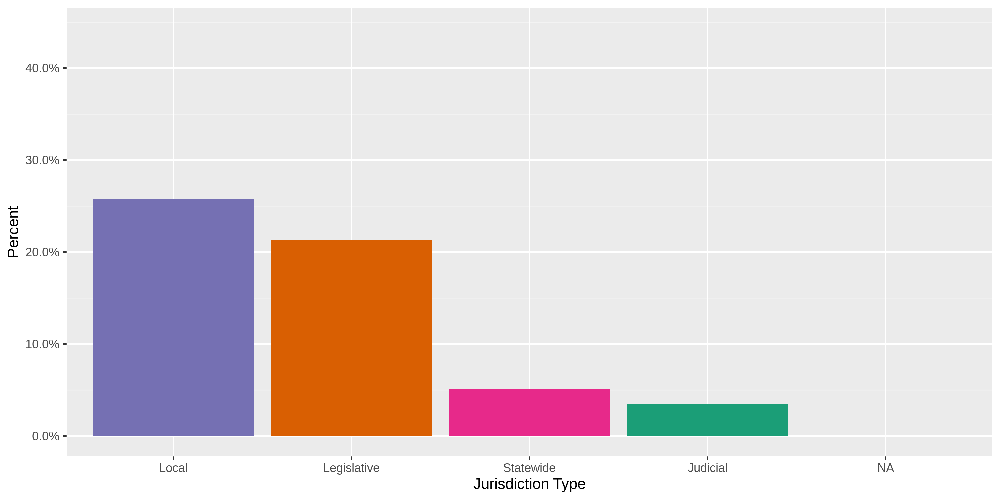
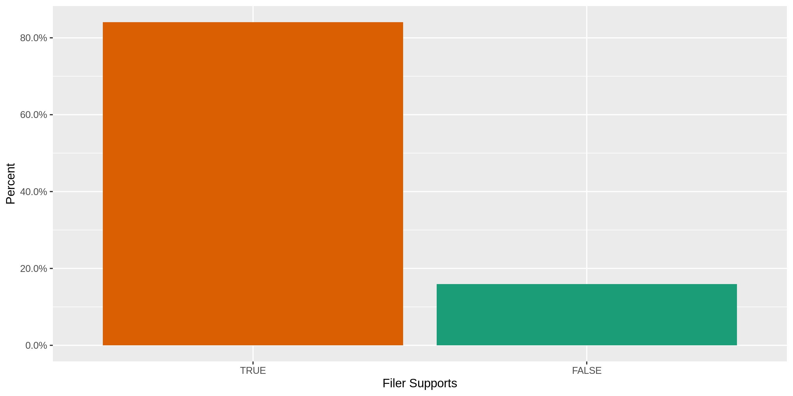
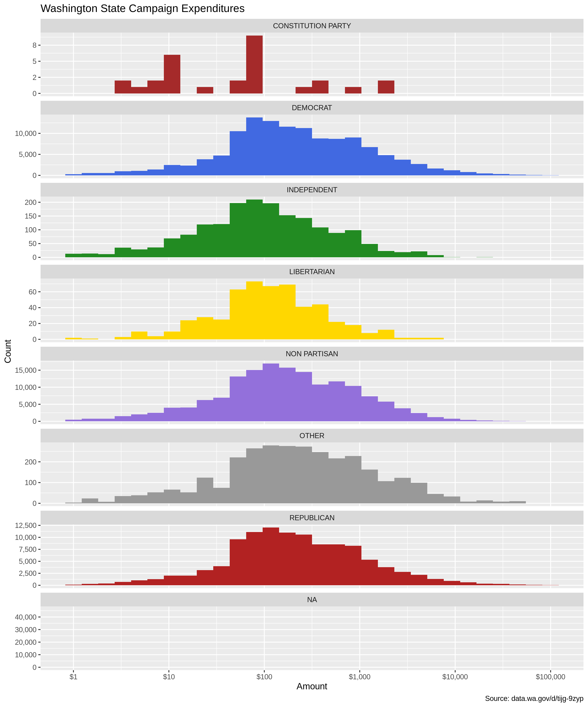
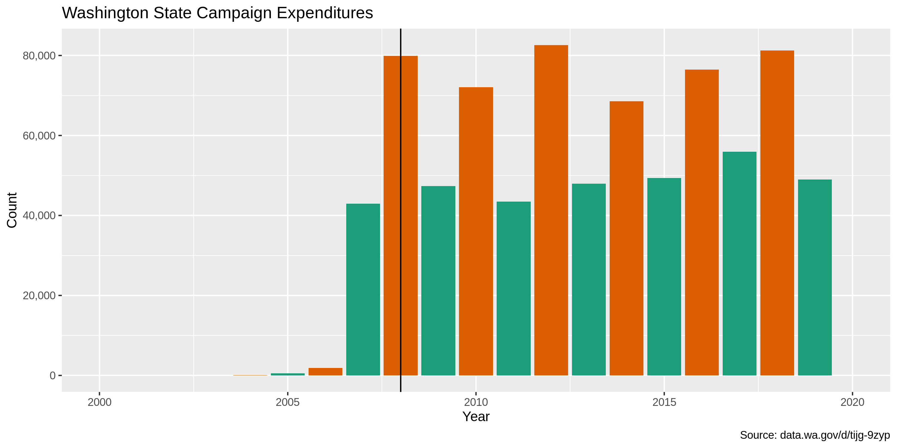
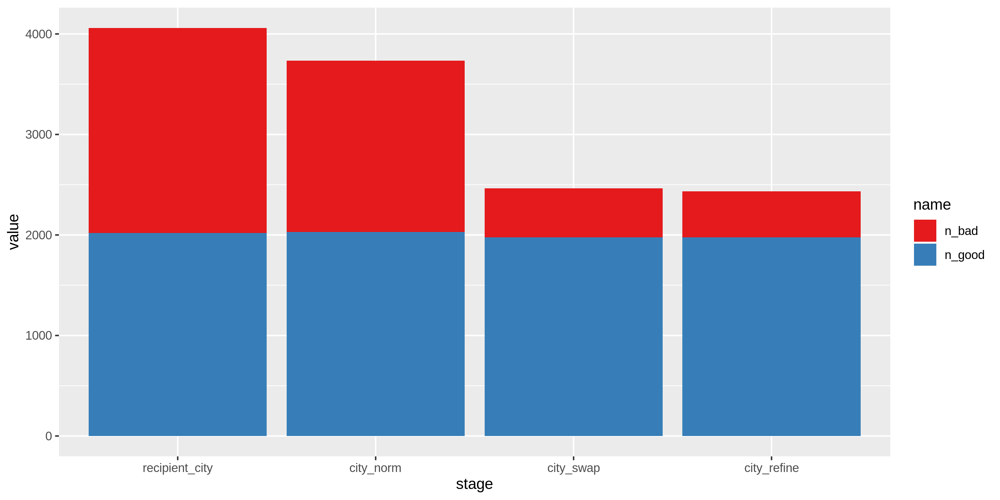

Washington Expenditures Data Diary
================
Kiernan Nicholls & Yanqi Xu
2022-12-26 14:31:55

-   <a href="#project" id="toc-project">Project</a>
-   <a href="#objectives" id="toc-objectives">Objectives</a>
-   <a href="#packages" id="toc-packages">Packages</a>
-   <a href="#data" id="toc-data">Data</a>
    -   <a href="#about" id="toc-about">About</a>
    -   <a href="#variables" id="toc-variables">Variables</a>
-   <a href="#read" id="toc-read">Read</a>
-   <a href="#explore" id="toc-explore">Explore</a>
    -   <a href="#distinct" id="toc-distinct">Distinct</a>
    -   <a href="#missing" id="toc-missing">Missing</a>
    -   <a href="#duplicates" id="toc-duplicates">Duplicates</a>
    -   <a href="#ranges" id="toc-ranges">Ranges</a>
    -   <a href="#transaction-dates" id="toc-transaction-dates">Transaction
        Dates</a>
-   <a href="#clean" id="toc-clean">Clean</a>
    -   <a href="#address" id="toc-address">Address</a>
    -   <a href="#zip" id="toc-zip">ZIP</a>
    -   <a href="#state" id="toc-state">State</a>
    -   <a href="#city" id="toc-city">City</a>
-   <a href="#conclude" id="toc-conclude">Conclude</a>
-   <a href="#write" id="toc-write">Write</a>

<!-- Place comments regarding knitting here -->

## Project

The Accountability Project is an effort to cut across data silos and
give journalists, policy professionals, activists, and the public at
large a simple way to search across huge volumes of public data about
people and organizations.

Our goal is to standardizing public data on a few key fields by thinking
of each dataset row as a transaction. For each transaction there should
be (at least) 3 variables:

1.  All **parties** to a transaction
2.  The **date** of the transaction
3.  The **amount** of money involved

## Objectives

This document describes the process used to complete the following
objectives:

1.  How many records are in the database?
2.  Check for duplicates
3.  Check ranges
4.  Is there anything blank or missing?
5.  Check for consistency issues
6.  Create a five-digit ZIP Code called `ZIP5`
7.  Create a `YEAR` field from the transaction date
8.  Make sure there is data on both parties to a transaction

## Packages

The following packages are needed to collect, manipulate, visualize,
analyze, and communicate these results. The `pacman` package will
facilitate their installation and attachment.

The IRW’s `campfin` package will also have to be installed from GitHub.
This package contains functions custom made to help facilitate the
processing of campaign finance data.

``` r
if (!require("pacman")) install.packages("pacman")
pacman::p_load_gh("irworkshop/campfin")
pacman::p_load(
  tidyverse, # data manipulation
  lubridate, # datetime strings
  magrittr, # pipe opperators
  janitor, # dataframe clean
  refinr, # cluster and merge
  RSocrata, # read SODA API
  scales, # format strings
  knitr, # knit documents
  vroom, # read files fast
  glue, # combine strings
  here, # relative storage
  fs # search storage 
)
```

This document should be run as part of the `R_campfin` project, which
lives as a sub-directory of the more general, language-agnostic
[`irworkshop/accountability_datacleaning`](https://github.com/irworkshop/accountability_datacleaning "TAP repo")
GitHub repository.

The `R_campfin` project uses the [RStudio
projects](https://support.rstudio.com/hc/en-us/articles/200526207-Using-Projects "Rproj")
feature and should be run as such. The project also uses the dynamic
`here::here()` tool for file paths relative to *your* machine.

``` r
# where does this document knit?
here::here()
#> [1] "/Users/yanqixu/code/accountability_datacleaning"
```

## Data

This dataset comes courtesy of the State of [Washington Public
Disclosure Commission](http://www.pdc.wa.gov), access through the
[data.wa.gov](https://data.wa.gov) portal.

The resource is named
`exenditures_by_candidates_and_political_committees` and covers the last
10 years of data with daily updates. Each records represents a single
“Expenditure by a campaign or committee.”

### About

> This dataset contains expenditures made by Washington State Candidates
> and Political Committees for the last 10 years as reported to the PDC
> on forms C3, C4, Schedule C and their electronic filing equivalents.
>
> In-kind contributions are included in this data set as they are
> considered as both a contribution and expenditure. In-kind
> contributions are also included in the data set “Contributions to
> Candidates and Political Committees.”
>
> For candidates, the number of years is determined by the year of the
> election, not necessarily the year the expenditure was reported. For
> political committees, the number of years is determined by the
> calendar year of the reporting period.
>
> Candidates and political committees choosing to file under “mini
> reporting” are not included in this dataset. See WAC 390-16-105 for
> information regarding eligibility.
>
> This dataset is a best-effort by the PDC to provide a complete set of
> records as described herewith and may contain incomplete or incorrect
> information. The PDC provides access to the original reports for the
> purpose of record verification.
>
> Descriptions attached to this dataset do not constitute legal
> definitions; please consult RCW 42.17A and WAC Title 390 for legal
> definitions and additional information regarding political finance
> disclosure requirements.
>
> CONDITION OF RELEASE: This publication constitutes a list of
> individuals prepared by the Washington State Public Disclosure
> Commission and may not be used for commercial purposes. This list is
> provided on the condition and with the understanding that the persons
> receiving it agree to this statutorily imposed limitation on its use.
> See RCW 42.56.070(9) and AGO 1975 No. 15.

### Variables

The [Data.WA API
page](https://dev.socrata.com/foundry/data.wa.gov/ukxb-bc7h) provides
definitions for the variables provided in this dataset.

`id`:

> PDC internal identifier that corresponds to a single expenditure
> record. When combined with the origin value, this number uniquely
> identifies a single row.

`report_number`:

> PDC identifier used for tracking the individual form C4 . Multiple
> expenditures will have the same report number when they were reported
> to the PDC at the same time. The report number is unique to the report
> it represents. When a report is amended, a new report number is
> assigned that supersedes the original version and the original report
> records are not included in this dataset.

`origin`:

> This field shows from which filed report-type the data originates.
> A/LE50 refers to non-itemized expenditures of \$50 and less per
> expenditure. A/GT50 refers to itemized expenditures greater than \$50
> per expenditure. A/LE50 and A/GT50 are both reported on schedule A of
> form C4
>
> To view the different report types and forms browse
> to:<https://www.pdc.wa.gov/learn/forms>

`filer_id`:

> The unique id assigned to a candidate or political committee. The
> filer id is consistent across election years with the exception that
> an individual running for a second office in the same election year
> will receive a second filer id. There is no correlation between the
> two filer ids. For a candidate and single-election-year committee such
> as a ballot committee, the combination of filerid and electionyear
> uniquely identifies a campaign.

`type`:

> Indicates if this record is for a candidate or a political committee.
> In the case of a political committee, it may be either a continuing
> political committee, party committee or single election year
> committee.

`filer_name`:

> The candidate or committee name as reported on the form C1 candidate
> or committee registration form. The name will be consistent across all
> records for the same filer id and election year but may differ across
> years due to candidates or committees changing their name.

`id`:

> This field represents the first name, as reported by the filer. This
> field may appear blank if the name is not reported or if a filing
> entity has a single name, such as a PAC or other political committee.
> Note that this data appears as represented by the filer and may not be
> consistent from one reporting period to another.

`last_name`:

> This field represents the last name, as reported by the filer. The
> field may also contain the full name of a filing entity that is
> registered under one name, such as a PAC or other filing committee.
> Note that this data appears as represented by the filer and may not be
> consistent from one reporting period to another.

`office`:

> The office sought by the candidate. Does not apply to political
> committees.

`legislative_district`:

> The Washington State legislative district. This field only applies to
> candidates where the office is “state senator” or “state
> representative.”

`position`:

> The position associated with an office. This field typically applies
> to judicial and local office that have multiple positions or seats.
> This field does not apply to political committees.

`party`:

> The political party as declared by the candidate or committee on their
> form C1 registration. Contains only “Major parties” as recognized by
> Washington State law.

`ballot_number`:

> If the committee is a Statewide Ballot Initiative Committee a ballot
> number will appear once a ballot number is assigned by the Secretary
> of State. Local Ballot Initiatives will not have a ballot number. This
> field will contain a number only if the Secretary of State issues a
> number.

`for_or_against`:

> Ballot initiative committees are formed to either support or oppose an
> initiative. This field represents whether a committee “Supports” or
> “Opposes” a ballot initiative.

`jurisdiction_*`:

> The political jurisdiction associated with the office of a candidate.

> The county associated with the jurisdiction of a candidate.
> Multi-county jurisdictions as reported as the primary county. This
> field will be empty for political committees and when a candidate
> jurisdiction is statewide.

> The type of jurisdiction this office is: Statewide, Local, etc.

`election_year`:

> The election year in the case of candidates and single election
> committees. The reporting year in the case of continuing political
> committees.

`amount`:

> The amount of the expenditure or in-kind contribution. In-kind
> contributions are both a contribution and an expenditure and
> represented in both the contributions and expenditures data.

`itemized_or_non_itemized`:

> A record for an itemized expenditure represents a single expenditure.
> A record for a non-itemized expenditure represents one or more
> expenditures where the individual expenditures are less than the limit
> for itemized reporting. In this case the record is the aggregate total
> for the reporting period.

`expenditure_date`:

> The date that the expenditure was made or the in-kind contribution was
> received. See the metadata for the origin and amount field regarding
> in-kind contributions.

`code`:

> The type of expenditure. The values displayed are human readable
> equivalents of the type codes reported on the form C4 schedule A.
> Please refer to the form for a listing of all codes. Itemized
> expenditures are generally required to have either a code or a
> description but may be required to have both. Non-itemized
> expenditures do not have a description.

`recipient_name`:

> The name of the individual or vendor paid as reported. The names
> appearing here have not been normalized and the same entity may be
> represented by different names in the dataset. Non-itemized
> expenditures of \$50 or less will have a recepient_name of EXPENSES OF
> \$50 OR LESS and origin of A/LE50, and all address fields will be
> empty.

`recipient_*`:

> The street address of the individual or vendor paid as reported.

> The city of the individual or vendor paid as reported.

> The state of the individual or vendor paid as reported.

> The zip code of the individual or vendor paid as reported.

`url`:

> A link to a PDF version of the original report as it was filed to the
> PDC.

`recipient_location`:

> The geocoded location of the individual or vendor paid as reported.
> The quality of the geocoded location is dependent on how many of the
> address fields are available and is calculated using a third-party
> service. The PDC has not verified the results of the geocoding. Please
> refer to the recipient_name field for more information regarding
> address fields.

## Read

> The [Socrata Open Data API (SODA)](http://dev.socrata.com/) provides
> programmatic access to this dataset including the ability to filter,
> query, and aggregate data. For more more information, view the [API
> docs for this
> dataset](https://dev.socrata.com/foundry/data.wa.gov/ukxb-bc7h) or
> visit our [developer portal](http://dev.socrata.com/)

If an *recent* version of the file doesn’t exist locally, the
`RSocrata::read.socrate()` function can read the SODA dataset directly
from the API into R.

``` r
wa_filename <- here(
  "state", "wa","expends", "data", "raw","wa_expends_download.csv")
if (file.exists(wa_filename) & as_date(file.mtime(wa_filename)) == today()) {
  wa <- read_csv(
    file = wa_filename,
    col_types = cols(.default = col_character())
  )
  read_from_soda = FALSE
} else {
  wa <- as_tibble(read.socrata("https://data.wa.gov/resource/ukxb-bc7h.json"))
  read_from_soda = TRUE
}
wa$amount <- parse_number(wa$amount)
wa$election_year <- parse_number(wa$election_year)
wa$expenditure_date <- as_date(wa$expenditure_date)
```

If the file had to be downloaded from the SODA API, save a copy of the
raw data locally. Each `recipient_location.coordinates` value is a list
type, so they will have to be converted to character vectors before
being saved as a flat text file.

``` r
#dir_create(here("wa_expends", "data", "raw"))
if (read_from_soda) {
  wa %>% 
    mutate(recipient_location.coordinates = as.character(recipient_location.coordinates)) %>% 
    write_csv(
      path = wa_filename,
      na = ""
    )
}
```

Before working with the data in R, some binary character type variables
will be converted to logical variables. The coordinates character string
will also be separated and converted to numeric latitude and longitude
variables.s

``` r
wa <- wa %>% 
  separate(
    col = recipient_location.coordinates,
    into = c("recipient_longitude", "recipient_latitude"),
    sep = ",\\s",
    remove = TRUE
  ) 
```

## Explore

There are 1028427 records of 30 variables in the full database.

``` r
head(wa)
#> # A tibble: 6 × 30
#>   id     repor…¹ origin commi…² filer…³ type  filer…⁴ office juris…⁵ juris…⁶ juris…⁷ elect…⁸ amount
#>   <chr>  <chr>   <chr>  <chr>   <chr>   <chr> <chr>   <chr>  <chr>   <chr>   <chr>     <dbl>  <dbl>
#> 1 45453  100956… A/LE50 24778   WILSJ … Cand… WILSON… COUNT… KING CO KING    Local      2023   50.9
#> 2 45455  100956… A/GT50 24778   WILSJ … Cand… WILSON… COUNT… KING CO KING    Local      2023  340  
#> 3 108940 100966… A/GT50 4175    CONSJ … Cand… James … COUNT… KING CO KING    Local      2021  143. 
#> 4 108941 100966… A/GT50 4175    CONSJ … Cand… James … COUNT… KING CO KING    Local      2021  604. 
#> 5 108943 100966… A/GT50 4175    CONSJ … Cand… James … COUNT… KING CO KING    Local      2021   55.0
#> 6 108945 100966… A/GT50 4175    CONSJ … Cand… James … COUNT… KING CO KING    Local      2021 2500  
#> # … with 17 more variables: itemized_or_non_itemized <chr>, expenditure_date <date>,
#> #   recipient_name <chr>, url <chr>, description <chr>, recipient_address <chr>,
#> #   recipient_city <chr>, recipient_state <chr>, recipient_zip <chr>,
#> #   recipient_location.type <chr>, recipient_location.coordinates <chr>, party <chr>,
#> #   position <chr>, legislative_district <chr>, code <chr>, ballot_number <chr>,
#> #   for_or_against <chr>, and abbreviated variable names ¹​report_number, ²​committee_id, ³​filer_id,
#> #   ⁴​filer_name, ⁵​jurisdiction, ⁶​jurisdiction_county, ⁷​jurisdiction_type, ⁸​election_year
tail(wa)
#> # A tibble: 6 × 30
#>   id     repor…¹ origin commi…² filer…³ type  filer…⁴ office juris…⁵ juris…⁶ juris…⁷ elect…⁸ amount
#>   <chr>  <chr>   <chr>  <chr>   <chr>   <chr> <chr>   <chr>  <chr>   <chr>   <chr>     <dbl>  <dbl>
#> 1 16863… 110130… A/GT50 20345   VOTEAH… Poli… WA HOU… <NA>   <NA>    <NA>    <NA>       2022   134.
#> 2 16863… 110130… B.1    20345   VOTEAH… Poli… WA HOU… <NA>   <NA>    <NA>    <NA>       2022   150 
#> 3 16863… 110130… A/GT50 20345   VOTEAH… Poli… WA HOU… <NA>   <NA>    <NA>    <NA>       2022     0 
#> 4 16863… 110130… A/GT50 20345   VOTEAH… Poli… WA HOU… <NA>   <NA>    <NA>    <NA>       2022   180 
#> 5 16863… 110130… A/GT50 20345   VOTEAH… Poli… WA HOU… <NA>   <NA>    <NA>    <NA>       2022   189.
#> 6 16863… 110130… A/GT50 20345   VOTEAH… Poli… WA HOU… <NA>   <NA>    <NA>    <NA>       2022   725 
#> # … with 17 more variables: itemized_or_non_itemized <chr>, expenditure_date <date>,
#> #   recipient_name <chr>, url <chr>, description <chr>, recipient_address <chr>,
#> #   recipient_city <chr>, recipient_state <chr>, recipient_zip <chr>,
#> #   recipient_location.type <chr>, recipient_location.coordinates <chr>, party <chr>,
#> #   position <chr>, legislative_district <chr>, code <chr>, ballot_number <chr>,
#> #   for_or_against <chr>, and abbreviated variable names ¹​report_number, ²​committee_id, ³​filer_id,
#> #   ⁴​filer_name, ⁵​jurisdiction, ⁶​jurisdiction_county, ⁷​jurisdiction_type, ⁸​election_year
glimpse(sample_frac(wa))
#> Rows: 1,028,427
#> Columns: 30
#> $ id                             <chr> "13466595", "9254665", "14286415", "14640401", "9749948", …
#> $ report_number                  <chr> "100271844", "100422480", "110003541", "110016518", "10044…
#> $ origin                         <chr> "A/GT50", "A/LE50", "A/GT50", "A/GT50", "A/GT50", "A/GT50"…
#> $ committee_id                   <chr> "20660", "11523", "20759", "4271", "19134", "8655", "16365…
#> $ filer_id                       <chr> "WASHCP 409", "LITZS  040", "WASTDCE104", "COWLRC 632", "S…
#> $ type                           <chr> "Political Committee", "Candidate", "Political Committee",…
#> $ filer_name                     <chr> "BROADBAND COMMUNICATIONS ASSOCIATION OF WA PAC (BCAW PAC)…
#> $ office                         <chr> NA, "STATE SENATOR", NA, NA, "STATE SENATOR", "STATE SENAT…
#> $ jurisdiction                   <chr> NA, "LEG DISTRICT 41 - SENATE", NA, NA, "LEG DISTRICT 20 -…
#> $ jurisdiction_county            <chr> NA, "KING", NA, NA, "LEWIS", "KING", NA, NA, NA, NA, "JEFF…
#> $ jurisdiction_type              <chr> NA, "Legislative", NA, NA, "Legislative", "Legislative", N…
#> $ election_year                  <dbl> 2008, 2012, 2020, 2021, 2012, 2018, 2020, 2012, 2020, 2018…
#> $ amount                         <dbl> 800.00, 0.00, 500.00, 2500.00, 99.12, 2100.00, 50.00, 1000…
#> $ itemized_or_non_itemized       <chr> "Itemized", "Non-itemized", "Itemized", "Itemized", "Itemi…
#> $ expenditure_date               <date> 2008-08-08, 2011-07-01, 2020-11-24, 2021-03-26, 2011-12-0…
#> $ recipient_name                 <chr> "PEOPLE FOR SCOTT WHITE", "EXPENSES OF $50 OR LESS", "2nd …
#> $ url                            <chr> "https://web.pdc.wa.gov/rptimg/default.aspx?repno=10027184…
#> $ description                    <chr> "CAMP CONTRIBUTION", NA, "Contribution", "Two months rent …
#> $ recipient_address              <chr> "PO BOX 25313", NA, "PO Box 181", "157 MCMILLAN DR.", "PO …
#> $ recipient_city                 <chr> "SEATTLE", NA, "Eatonville", "LONGVIEW", "MONROE", "LAKE S…
#> $ recipient_state                <chr> "WA", NA, "WA", "WA", "LA", "WA", "CA", "WA", "WA", "WA", …
#> $ recipient_zip                  <chr> "981652213", NA, "98328", "98632", "71211", "98126", "9135…
#> $ recipient_location.type        <chr> NA, NA, "Point", "Point", NA, NA, NA, NA, "Point", NA, NA,…
#> $ recipient_location.coordinates <chr> NA, NA, NA, NA, NA, NA, NA, NA, NA, NA, NA, NA, NA, NA, NA…
#> $ party                          <chr> NA, "REPUBLICAN", "DEMOCRATIC", "REPUBLICAN", "REPUBLICAN"…
#> $ position                       <chr> NA, NA, NA, NA, NA, NA, NA, NA, NA, NA, NA, "County Counci…
#> $ legislative_district           <chr> NA, "41", NA, NA, "20", "44", NA, NA, NA, NA, NA, NA, NA, …
#> $ code                           <chr> NA, NA, "Monetary contributions to PAC or candidate", NA, …
#> $ ballot_number                  <chr> NA, NA, NA, NA, NA, NA, NA, NA, NA, NA, NA, NA, NA, NA, NA…
#> $ for_or_against                 <chr> NA, NA, NA, NA, NA, NA, NA, NA, NA, "For", NA, NA, NA, NA,…
```

### Distinct

The variables range in their degree of distinctness.

The `id` is 100% distinct and can be used to identify a unique
transaction.

``` r
col_stats(wa, n_distinct)
#> # A tibble: 30 × 4
#>    col                            class        n           p
#>    <chr>                          <chr>    <int>       <dbl>
#>  1 id                             <chr>  1028427 1          
#>  2 report_number                  <chr>   148595 0.144      
#>  3 origin                         <chr>        6 0.00000583 
#>  4 committee_id                   <chr>    11044 0.0107     
#>  5 filer_id                       <chr>     7557 0.00735    
#>  6 type                           <chr>        2 0.00000194 
#>  7 filer_name                     <chr>     8885 0.00864    
#>  8 office                         <chr>       43 0.0000418  
#>  9 jurisdiction                   <chr>      580 0.000564   
#> 10 jurisdiction_county            <chr>       39 0.0000379  
#> 11 jurisdiction_type              <chr>        5 0.00000486 
#> 12 election_year                  <dbl>       20 0.0000194  
#> 13 amount                         <dbl>   144156 0.140      
#> 14 itemized_or_non_itemized       <chr>        2 0.00000194 
#> 15 expenditure_date               <date>    6373 0.00620    
#> 16 recipient_name                 <chr>   133664 0.130      
#> 17 url                            <chr>   148595 0.144      
#> 18 description                    <chr>   278802 0.271      
#> 19 recipient_address              <chr>   143425 0.139      
#> 20 recipient_city                 <chr>     6090 0.00592    
#> 21 recipient_state                <chr>      111 0.000108   
#> 22 recipient_zip                  <chr>    21652 0.0211     
#> 23 recipient_location.type        <chr>        2 0.00000194 
#> 24 recipient_location.coordinates <chr>        1 0.000000972
#> 25 party                          <chr>       12 0.0000117  
#> 26 position                       <chr>      208 0.000202   
#> 27 legislative_district           <chr>       50 0.0000486  
#> 28 code                           <chr>       36 0.0000350  
#> 29 ballot_number                  <chr>      130 0.000126   
#> 30 for_or_against                 <chr>        3 0.00000292
```

We can explore the distribution of the least distinct values with
`ggplot2::geom_bar()`.

<!-- -->

<!-- -->

<!-- -->

<!-- -->

<!-- -->

<!-- -->

<!-- -->

<!-- -->

### Missing

The variables also vary in their degree of values that are `NA`
(missing).

``` r
col_stats(wa, count_na)
#> # A tibble: 30 × 4
#>    col                            class        n         p
#>    <chr>                          <chr>    <int>     <dbl>
#>  1 id                             <chr>        0 0        
#>  2 report_number                  <chr>        0 0        
#>  3 origin                         <chr>        0 0        
#>  4 committee_id                   <chr>        0 0        
#>  5 filer_id                       <chr>        0 0        
#>  6 type                           <chr>        0 0        
#>  7 filer_name                     <chr>        0 0        
#>  8 office                         <chr>   448191 0.436    
#>  9 jurisdiction                   <chr>   420224 0.409    
#> 10 jurisdiction_county            <chr>   496567 0.483    
#> 11 jurisdiction_type              <chr>   433695 0.422    
#> 12 election_year                  <dbl>        0 0        
#> 13 amount                         <dbl>        0 0        
#> 14 itemized_or_non_itemized       <chr>        0 0        
#> 15 expenditure_date               <date>     356 0.000346 
#> 16 recipient_name                 <chr>       85 0.0000827
#> 17 url                            <chr>        0 0        
#> 18 description                    <chr>   156546 0.152    
#> 19 recipient_address              <chr>   180931 0.176    
#> 20 recipient_city                 <chr>   173635 0.169    
#> 21 recipient_state                <chr>   169157 0.164    
#> 22 recipient_zip                  <chr>   178048 0.173    
#> 23 recipient_location.type        <chr>   687183 0.668    
#> 24 recipient_location.coordinates <chr>  1028427 1        
#> 25 party                          <chr>   366437 0.356    
#> 26 position                       <chr>   903708 0.879    
#> 27 legislative_district           <chr>   805929 0.784    
#> 28 code                           <chr>   732061 0.712    
#> 29 ballot_number                  <chr>  1000313 0.973    
#> 30 for_or_against                 <chr>   981897 0.955
```

We will flag any records with missing values in the key variables used
to identify an expenditure.

``` r
wa <- flag_na(wa, expenditure_date, recipient_name)
sum(wa$na_flag)
#> [1] 434
wa %>% 
  filter(na_flag) %>%
  sample_frac() %>% 
  select(
    na_flag,
    id, 
    report_number,
    filer_name,
    recipient_name,
    amount,
    expenditure_date
    )
#> # A tibble: 434 × 7
#>    na_flag id       report_number filer_name                              recip…¹ amount expendit…²
#>    <lgl>   <chr>    <chr>         <chr>                                   <chr>    <dbl> <date>    
#>  1 TRUE    13484969 100287204     WASHINGTON EDUCATION ASSOCIATION POLIT… Expens…    0   NA        
#>  2 TRUE    11095849 1001276741    KLEIN LESLIE R                          Expens…  110   NA        
#>  3 TRUE    10927423 1001276537    FLYGARE ROGER G                         Expens…    0   NA        
#>  4 TRUE    13503440 100254548     WA PUBLIC EMPLOYEES ASSOCIATION/UFCW L… Expens…   55   NA        
#>  5 TRUE    9309078  100309199     MCKENNA ROBERT M (ROBERT MCKENNA)       <NA>     -35.5 2009-05-23
#>  6 TRUE    13592147 1001277367    WOOD ALEX W                             Expens…    0   NA        
#>  7 TRUE    5744912  1001295394    STUCKER SCOTT V (SCOTT STUCKER)         Expens…   10   NA        
#>  8 TRUE    11105544 1001275632    KRAINICK SHERRY L                       Expens…   50.2 NA        
#>  9 TRUE    11373499 1001275043    SENSIBLE WA                             Expens…  146.  NA        
#> 10 TRUE    11240903 1001277451    OLSEN JAMES M                           Expens…    0   NA        
#> # … with 424 more rows, and abbreviated variable names ¹​recipient_name, ²​expenditure_date
```

### Duplicates

Using `campfin::dupe_flag()` we can identify a number of rows that have
completely duplicated values, aside from the supposedly unique `id`
variable.

``` r
wa <- flag_dupes(wa, -id)
sum(wa$dupe_flag)
#> [1] 13298
percent(mean(wa$dupe_flag))
#> [1] "1%"
```

Most of these duplicate records have an `amount` value of zero, meaning
they are likely corrections to previous expenditures.

<!-- -->

### Ranges

The range of continuous variables will need to be checked for data
integrity. There are only two quasi-continuous variables, the `amount`
and `expenditure_date`

We can check the distribution of continuous variables with
`ggplot2::geom_histogram()`

#### Transaction Amounts

The middle range for `amount` seems reasonable enough. 3% percent of
`amount` values are less than zero.

``` r
summary(wa$amount)
#>     Min.  1st Qu.   Median     Mean  3rd Qu.     Max. 
#> -2500000       52      193     1607      750  5000000
tabyl(wa$amount > 0)
#> # A tibble: 2 × 3
#>   `wa$amount > 0`      n percent
#>   <lgl>            <int>   <dbl>
#> 1 FALSE           107198   0.104
#> 2 TRUE            921229   0.896
```

Most expenditures are for relatively little amount.

<!-- -->

<!-- -->

<!-- -->

Below are the smallest and largest expenditures.

``` r
glimpse(wa %>% filter(amount == min(amount, na.rm = T)))
#> Rows: 1
#> Columns: 32
#> $ id                             <chr> "10645097"
#> $ report_number                  <chr> "100441590"
#> $ origin                         <chr> "C.2"
#> $ committee_id                   <chr> "22059"
#> $ filer_id                       <chr> "YES1183109"
#> $ type                           <chr> "Political Committee"
#> $ filer_name                     <chr> "YES ON 1183 COALITION"
#> $ office                         <chr> NA
#> $ jurisdiction                   <chr> NA
#> $ jurisdiction_county            <chr> NA
#> $ jurisdiction_type              <chr> NA
#> $ election_year                  <dbl> 2011
#> $ amount                         <dbl> -2500000
#> $ itemized_or_non_itemized       <chr> "Itemized"
#> $ expenditure_date               <date> 2011-10-17
#> $ recipient_name                 <chr> "COSTCO"
#> $ url                            <chr> "https://web.pdc.wa.gov/rptimg/default.aspx?repno=10044159…
#> $ description                    <chr> "REFUND"
#> $ recipient_address              <chr> NA
#> $ recipient_city                 <chr> NA
#> $ recipient_state                <chr> NA
#> $ recipient_zip                  <chr> NA
#> $ recipient_location.type        <chr> NA
#> $ recipient_location.coordinates <chr> NA
#> $ party                          <chr> NA
#> $ position                       <chr> NA
#> $ legislative_district           <chr> NA
#> $ code                           <chr> NA
#> $ ballot_number                  <chr> NA
#> $ for_or_against                 <chr> NA
#> $ na_flag                        <lgl> FALSE
#> $ dupe_flag                      <lgl> FALSE
glimpse(wa %>% filter(amount == max(amount, na.rm = T)))
#> Rows: 1
#> Columns: 32
#> $ id                             <chr> "8078007"
#> $ report_number                  <chr> "100736208"
#> $ origin                         <chr> "A/GT50"
#> $ committee_id                   <chr> "7697"
#> $ filer_id                       <chr> "GROCMA 005"
#> $ type                           <chr> "Political Committee"
#> $ filer_name                     <chr> "GROCERY MANUFACTURERS ASSOCIATION AGAINST I-522"
#> $ office                         <chr> NA
#> $ jurisdiction                   <chr> NA
#> $ jurisdiction_county            <chr> NA
#> $ jurisdiction_type              <chr> NA
#> $ election_year                  <dbl> 2013
#> $ amount                         <dbl> 5e+06
#> $ itemized_or_non_itemized       <chr> "Itemized"
#> $ expenditure_date               <date> 2013-09-27
#> $ recipient_name                 <chr> "NO ON I-522 COMMITTEE"
#> $ url                            <chr> "https://web.pdc.wa.gov/rptimg/default.aspx?repno=10073620…
#> $ description                    <chr> "CONTRIBUTION"
#> $ recipient_address              <chr> "PO BOX 7325"
#> $ recipient_city                 <chr> "OLYMPIA"
#> $ recipient_state                <chr> "WA"
#> $ recipient_zip                  <chr> "98507"
#> $ recipient_location.type        <chr> NA
#> $ recipient_location.coordinates <chr> NA
#> $ party                          <chr> NA
#> $ position                       <chr> NA
#> $ legislative_district           <chr> NA
#> $ code                           <chr> NA
#> $ ballot_number                  <chr> "522"
#> $ for_or_against                 <chr> "Against"
#> $ na_flag                        <lgl> FALSE
#> $ dupe_flag                      <lgl> FALSE
```

We can view the link provided in the `url` variable to see the smallest
expenditure is a correction to an expenditure to Costco previously
reported as \$8,929,810 that should have been \$6,429,810.
Interestingly, this same report shows a *contribution* from the same
Costco for the exact same amount with the exact same correction. There
is no description for the correction.

Using the `url` from the maximum report, the \$5,000,000 expenditure has
“contribution” listed in the “Purpose of Expense” box with nothing put
in the spot for “Code” meant to identify the record as a contribution or
expenditure.

These two sample reports can be found as PDF files in the `data/`
directory.

### Transaction Dates

There are a number of records with incorrect `expenditure_date`
variables. There are no records with expenditures made in the future,
but there are a number of suspiciously old expenditures.

``` r
max(wa$expenditure_date, na.rm = TRUE)
#> [1] "2022-12-22"
sum(wa$expenditure_date > today(), na.rm = T)
#> [1] 0
```

PDC claims that the dataset covers the last 10 years of data, but there
are thousands of records older than that, with one from 1964. The report
containing that expenditure was filed in 2010 and can be found as PDF in
the `data/` directory. That one report is the only one with an
expenditure date before 2000, the rest appear to be correct dates simply
outside the expected time span.

``` r
min(wa$expenditure_date, na.rm = TRUE)
#> [1] "1964-06-11"
sum(year(wa$expenditure_date) < 2007, na.rm = TRUE)
#> [1] 2488
```

To better track expenditures in the TAP database, we will create a
`expenditure_year` variable from the previously parsed
`expenditure_date` using `lubridate::year()`.

``` r
wa <- wa %>% mutate(
  expenditure_year = year(expenditure_date),
  date_flag = is_less_than(expenditure_year, 2007)
)
```

<!-- -->

## Clean

### Address

The `recipient_address` variable will be minimally cleaned by removing
punctuation and fixing white-space.

``` r
wa <- wa %>% 
  mutate(
    address_norm = normal_address(
      address = recipient_address,
      abbs = usps_street,
      na_rep = TRUE
    )
  )
```

``` r
wa %>% 
  select(contains("address")) %>% 
  distinct() %>% 
  sample_frac()
#> # A tibble: 143,425 × 2
#>    recipient_address                address_norm                    
#>    <chr>                            <chr>                           
#>  1 920 5TH AVE SUITE 1900           920 5TH AVE SUITE 1900          
#>  2 3929 NE BELVOIR PL               3929 NE BELVOIR PL              
#>  3 1414  41ST AVENUE E              1414 41ST AVENUE E              
#>  4 2820 MARTINIQUE                  2820 MARTINIQUE                 
#>  5 C/O NMRFA NE 480 OLD BELFAIR HWY C/O NMRFA NE 480 OLD BELFAIR HWY
#>  6 P O BOX 599                      P O BOX 599                     
#>  7 1801 CONNECTICUT AVE NW          1801 CONNECTICUT AVE NW         
#>  8 8924 QUIL CEDA BOULEVARD         8924 QUIL CEDA BLVD             
#>  9 8801 N INDIAN TRAIL              8801 N INDIAN TRL               
#> 10 P.O. BOX 1460                    PO BOX 1460                     
#> # … with 143,415 more rows
```

### ZIP

``` r
wa <- wa %>% 
  mutate(
    zip_norm = normal_zip(
      zip = recipient_zip,
      na_rep = TRUE
    )
  )
```

``` r
wa %>% 
  select(contains("zip")) %>% 
  filter(zip_norm != recipient_zip)
#> # A tibble: 123,557 × 2
#>    recipient_zip zip_norm
#>    <chr>         <chr>   
#>  1 981249422     98124   
#>  2 981249422     98124   
#>  3 981249422     98124   
#>  4 981174844     98117   
#>  5 981093551     98109   
#>  6 981090100     98109   
#>  7 757851372     75785   
#>  8 980420042     98042   
#>  9 980118019     98011   
#> 10 986874031     98687   
#> # … with 123,547 more rows
```

``` r
progress_table(
  wa$recipient_zip,
  wa$zip_norm,
  compare = valid_zip
)
#> # A tibble: 2 × 6
#>   stage            prop_in n_distinct prop_na  n_out n_diff
#>   <chr>              <dbl>      <dbl>   <dbl>  <dbl>  <dbl>
#> 1 wa$recipient_zip   0.847      21652   0.173 129929  16642
#> 2 wa$zip_norm        0.996       6066   0.177   3295    771
```

### State

``` r
wa <- wa %>% 
  mutate(
    state_norm = normal_state(
      state = recipient_state,
      abbreviate = TRUE,
      na_rep = TRUE,
      valid = NULL
    )
  )
```

``` r
wa %>% 
  filter(state_norm %out% valid_state) %>% 
  count(state_norm, sort = TRUE)
#> # A tibble: 29 × 2
#>    state_norm      n
#>    <chr>       <int>
#>  1 <NA>       169282
#>  2 NB             45
#>  3 BC             11
#>  4 RE             11
#>  5 AB              8
#>  6 IS              8
#>  7 AU              6
#>  8 ON              5
#>  9 UK              5
#> 10 NS              4
#> # … with 19 more rows
```

``` r
progress_table(
  wa$recipient_state,
  wa$state_norm,
  compare = valid_state
)
#> # A tibble: 2 × 6
#>   stage              prop_in n_distinct prop_na n_out n_diff
#>   <chr>                <dbl>      <dbl>   <dbl> <dbl>  <dbl>
#> 1 wa$recipient_state   0.999        111   0.164   505     58
#> 2 wa$state_norm        1.00          83   0.165   133     29
```

### City

Cleaning city values is the most complicated. This process involves four
steps:

1.  Prepare raw city values by removing invalid data and reducing
    inconsistencies
2.  Match prepared city values with the *actual* city name of that
    record’s ZIP code
3.  Swap prepared city values with the ZIP code match *if* only 1 edit
    is needed
4.  Refine swapped city values with key collision and n-gram
    fingerprints

#### Normal

``` r
wa <- wa %>% 
  mutate(
    city_norm = normal_city(
      city = recipient_city,
      abbs = usps_city,
      states = c("WA", "DC"),
      na = invalid_city,
      na_rep = TRUE
    )
  )
```

#### Swap

The second step will be to compare the new `city_norm` value to the
*actual* city value for that record’s `zip_norm` value. If the
`city_norm` is very similar to the expected city name for that ZIP code,
we can make that change.

``` r
wa <- wa %>% 
  left_join(
    y = zipcodes,
    by = c(
      "state_norm" = "state",
      "zip_norm" = "zip"
    )
  ) %>% 
  rename(city_match = city) %>% 
  mutate(
    match_abb = is_abbrev(city_norm, city_match),
    match_dist = str_dist(city_norm, city_match),
    city_swap = if_else(
      condition = match_abb | match_dist == 1,
      true = city_match,
      false = city_norm
    )
  )
```

#### Refine

``` r
wa_refine <- wa %>% 
  mutate(
    city_refine = city_swap %>% 
      key_collision_merge() %>% 
      n_gram_merge(numgram = 1)
  ) %>% 
  inner_join(
    y = zipcodes,
    by = c(
      "city_refine" = "city",
      "state_norm" = "state",
      "zip_norm" = "zip"
    )
  )
```

``` r
wa_refine %>% 
  filter(city_refine != city_swap) %>% 
  count(city_swap, city_refine, sort = TRUE)
#> # A tibble: 45 × 3
#>    city_swap            city_refine       n
#>    <chr>                <chr>         <int>
#>  1 CINCINATTI           CINCINNATI       20
#>  2 COUER DALENE         COEUR D ALENE    11
#>  3 SAN FRANSICO         SAN FRANCISCO    10
#>  4 MULKITEO             MUKILTEO          9
#>  5 OLAOOA               OLALLA            9
#>  6 NO CANTON            CANTON            4
#>  7 SEDROWOOLLWY         SEDRO WOOLLEY     4
#>  8 WALMATH              WALTHAM           4
#>  9 NEWMAN LAKE NEWMAN L NEWMAN LAKE       3
#> 10 OKANGAON             OKANOGAN          3
#> # … with 35 more rows
```

Then, we match these refined values to the original data. Use the
refined value where possible, otherwise use the swapped city value
(which is the prepared value or real value).

``` r
wa <- wa %>% 
  left_join(wa_refine) %>% 
  mutate(city_refine = coalesce(city_refine, city_swap))
```

#### Progress

``` r
wa %>% 
  filter(city_refine %out% valid_city) %>% 
  count(city_refine, state_norm, sort = TRUE) %>% 
  drop_na()
#> # A tibble: 601 × 3
#>    city_refine      state_norm     n
#>    <chr>            <chr>      <int>
#>  1 SPOKANE VALLEY   WA          4734
#>  2 TUKWILA          WA          2972
#>  3 SEATAC           WA          2465
#>  4 BURIEN           WA          2313
#>  5 CAMANO ISLAND    WA          1058
#>  6 SYMMES TOWNSHIP  OH           938
#>  7 LAKE FOREST PARK WA           757
#>  8 NORMANDY PARK    WA           576
#>  9 FIRCREST         WA           306
#> 10 WEST SOMERVILLE  MA           206
#> # … with 591 more rows
```

If we expand `valid_city` to include the *six* most common “invalid”
cities, we realize the vast majority of our cities have been properly
normalized.

``` r
other_cities <- most_common(wa$city_refine[which(wa$city_refine %out% valid_city)])
```

``` r
prog_table <- progress_table(
  wa$recipient_city,
  wa$city_norm,
  wa$city_swap,
  wa$city_refine,
  compare = c(valid_city, other_cities)
)
prog_table$stage <- as_factor(prog_table$stage)
```

``` r
kable(prog_table)
```

| stage                                                                       |   prop_in | n_distinct |   prop_na | n_out | n_diff |
|:----------------------------------------------------------------------------|----------:|-----------:|----------:|------:|-------:|
| wa$recipient_city | 0.8755136| 6090| 0.1688355| 106410| 3897| |wa$city_norm | 0.9829162 |       4497 | 0.1694656 | 14592 |   2142 |
| wa$city_swap | 0.9932051| 2927| 0.1897587| 5662| 639| |wa$city_refine       | 0.9933491 |       2884 | 0.1897587 |  5542 |    596 |

``` r
prog_table %>% 
  ggplot(aes(x = stage, y = prop_in)) +
  geom_col(fill = RColorBrewer::brewer.pal(3, "Dark2")[1]) +
  geom_hline(yintercept = 0.99) +
  coord_cartesian(ylim = c(.9, 1))
```

<!-- -->

``` r
prog_table %>% 
  mutate(n_good = n_distinct - n_diff) %>% 
  rename(n_bad = n_diff) %>% 
  pivot_longer(cols = c(n_good, n_bad)) %>% 
  ggplot(aes(x = stage, y = value)) +
  geom_col(aes(fill = name)) +
  scale_fill_brewer(palette = "Set1")
```

<!-- -->

## Conclude

1.  There are 1028427 records in the database
2.  There are 13298 records with duplicate filer, recipient, date, *and*
    amount (flagged with `dupe_flag`)
3.  The ranges for dates and amounts are reasonable
4.  Consistency in strings has been fixed with `city_prep()` and the
    `stringr` package
5.  The five-digit `zip_norm` variable has been created with
    `zipcode::clean.zipcode()`
6.  The `expenditure_year` variable has been created with
    `lubridate::year()`
7.  There are 85 records with missing `recipient_name` values and 356
    records with missing `expenditure_date` values (both flagged with
    the `na_flag`)

## Write

``` r
proc_dir <- here("state","wa", "expends", "data", "processed")
dir_create(proc_dir)
```

``` r
wa %>% 
  rename(
    address_clean = address_norm,
    zip_clean = zip_norm,
    state_clean = state_norm,
    city_clean = city_refine
  ) %>%
  select(
    -recipient_location.type,
    -city_norm,
    -city_match,
    -match_dist,
    -match_abb,
    -city_swap
  ) %>% 
  write_csv(
    path = glue("{proc_dir}/wa_expends_clean.csv"),
    na = ""
  )
```
