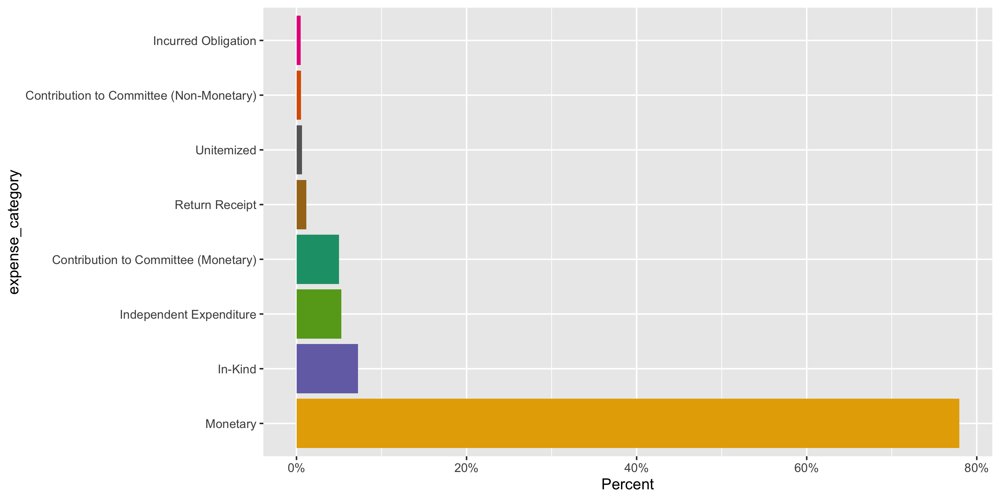
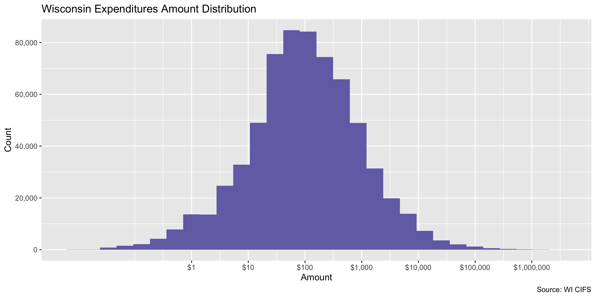
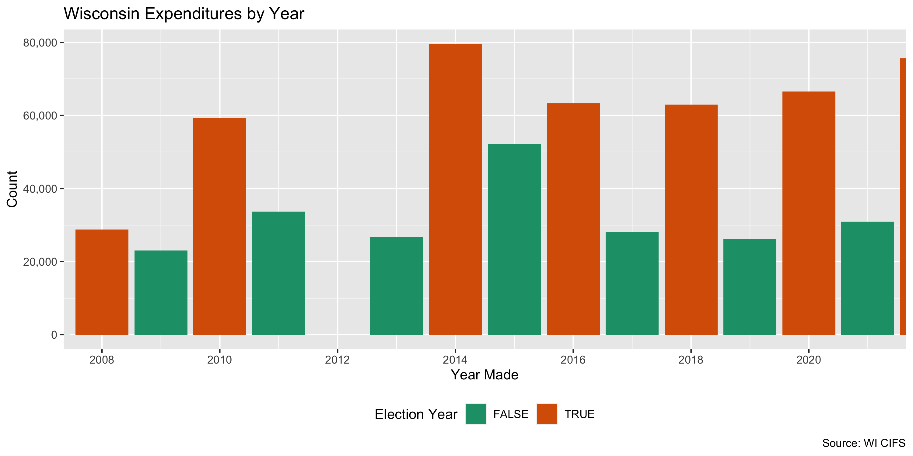
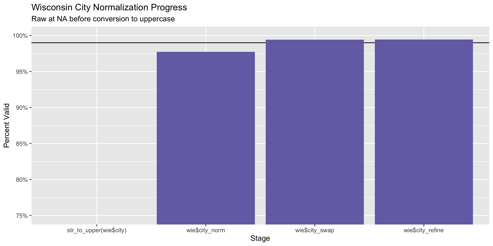
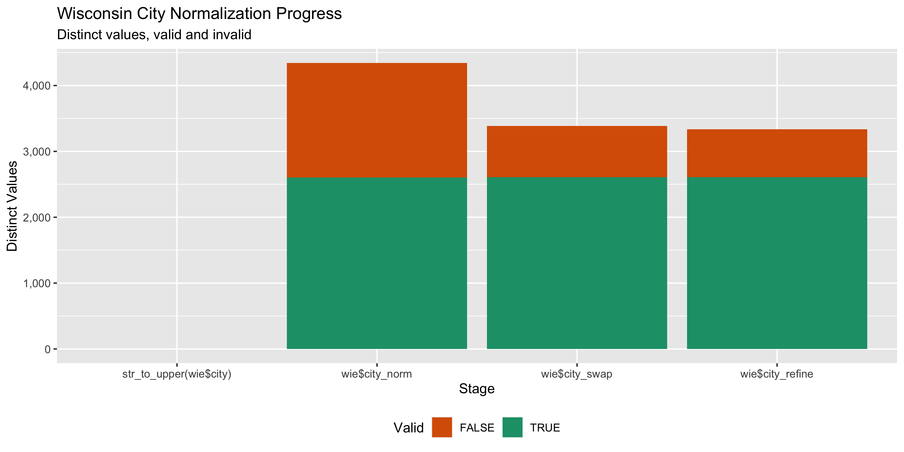

Wisconsin Expenditures
================
Yanqi Xu
2023-05-28 17:45:03

- <a href="#project" id="toc-project">Project</a>
- <a href="#objectives" id="toc-objectives">Objectives</a>
- <a href="#packages" id="toc-packages">Packages</a>
- <a href="#data" id="toc-data">Data</a>
- <a href="#download" id="toc-download">Download</a>
- <a href="#read" id="toc-read">Read</a>
- <a href="#explore" id="toc-explore">Explore</a>
- <a href="#wrangle" id="toc-wrangle">Wrangle</a>
- <a href="#conclude" id="toc-conclude">Conclude</a>
- <a href="#export" id="toc-export">Export</a>
- <a href="#upload" id="toc-upload">Upload</a>

<!-- Place comments regarding knitting here -->

## Project

The Accountability Project is an effort to cut across data silos and
give journalists, policy professionals, activists, and the public at
large a simple way to search across huge volumes of public data about
people and organizations.

Our goal is to standardizing public data on a few key fields by thinking
of each dataset row as a transaction. For each transaction there should
be (at least) 3 variables:

1.  All **parties** to a transaction.
2.  The **date** of the transaction.
3.  The **amount** of money involved.

## Objectives

This document describes the process used to complete the following
objectives:

1.  How many records are in the database?
2.  Check for entirely duplicated records.
3.  Check ranges of continuous variables.
4.  Is there anything blank or missing?
5.  Check for consistency issues.
6.  Create a five-digit ZIP Code called `zip`.
7.  Create a `year` field from the transaction date.
8.  Make sure there is data on both parties to a transaction.

## Packages

The following packages are needed to collect, manipulate, visualize,
analyze, and communicate these results. The `pacman` package will
facilitate their installation and attachment.

The IRW’s `campfin` package will also have to be installed from GitHub.
This package contains functions custom made to help facilitate the
processing of campaign finance data.

``` r
if (!require("pacman")) install.packages("pacman")
pacman::p_load_gh("irworkshop/campfin")
pacman::p_load(
  tidyverse, # data manipulation
  lubridate, # datetime strings
  gluedown, # print markdown
  magrittr, # pipe operators
  janitor, # dataframe clean
  refinr, # cluster and merge
  scales, # format strings
  knitr, # knit documents
  vroom, # read files fast
  glue, # combine strings
  here, # relative storage
  fs # search storage 
)
```

This document should be run as part of the `R_campfin` project, which
lives as a sub-directory of the more general, language-agnostic
[`irworkshop/accountability_datacleaning`](https://github.com/irworkshop/accountability_datacleaning)
GitHub repository.

The `R_campfin` project uses the [RStudio
projects](https://support.rstudio.com/hc/en-us/articles/200526207-Using-Projects)
feature and should be run as such. The project also uses the dynamic
`here::here()` tool for file paths relative to *your* machine.

``` r
# where does this document knit?
here::here()
#> [1] "/Users/yanqixu/code/accountability_datacleaning"
```

## Data

Data is from the Wisconsin Secretary of State’s Campaign Finance System
(CIFS).

> Wyoming’s Campaign Finance Information System (WYCFIS) exists to
> provide a mechanism for online filing of campaign finance information
> and to provide full disclosure to the public. This website contains
> detailed financial records and related information that candidates,
> committees, organizations and parties are required by law to disclose.

## Download

Using the CIFS [expenditures search
portal](https://cfis.wi.gov/Public/Registration.aspx?page=ReceiptList#),
we can run a search for all expenditures from “All Filing Periods” from
the dates 1980-01-01 to 2023-05-28. Those search results need to be
manually exported as the `ReceiptsList.csv` file. The data includes
updates till 2023-05-27. The next update should start 2023-05-28.

> To view expenditures made by a committee, go to the CFIS Home Page, on
> the left hand side, and click View Expenses. A pop up letting you know
> that this information cannot be used for solicitation purposes will
> appear – click Continue. Type in a payer in the field titled ID. Type
> in any additional information you would like to search for, including
> a name of a payer, payee or amount. To view all expenditures, remove
> the filing period by clicking, in the Filing Period Name field, and
> scroll all the way to the top and select All Filing Periods. Click
> Search and all of the expenditures fitting your search criteria will
> appear. If you would like to export these into Excel, scroll all the
> way to the bottom and on the right hand side, click the XLS icon.

Infuriatingly, the site only lets users export 65,000 records at a time.
Kiernan wrote a scrip that will use Selenium to open a remote browser,
submit a search for all expenditures and download the row-limited files
one by one. I adjusted the script for expenditures.

``` r
source(
  file = here("state","wi", "expends", "docs", "scrape_wi_expends.R")
)
```

The files are downloaded to the `scrape/` directory.

``` r
raw_dir <- dir_create(here("state","wi", "expends", "data", "scrape"))
raw_info <- as_tibble(dir_info(raw_dir))
sum(raw_info$size)
#> 133M
raw_info %>% 
  select(path, size, modification_time) %>% 
  mutate(across(path, basename))
#> # A tibble: 11 × 3
#>    path                                size modification_time  
#>    <chr>                        <fs::bytes> <dttm>             
#>  1 wi_expends_1-65000.csv            13.22M 2023-05-28 14:57:26
#>  2 wi_expends_130001-195000.csv      12.94M 2023-05-28 15:06:56
#>  3 wi_expends_195001-260000.csv      12.88M 2023-05-28 15:07:59
#>  4 wi_expends_260001-325000.csv      12.77M 2023-05-28 15:24:22
#>  5 wi_expends_325001-390000.csv      12.91M 2023-05-28 15:25:14
#>  6 wi_expends_390001-455000.csv      12.81M 2023-05-28 15:26:13
#>  7 wi_expends_455001-520000.csv      12.92M 2023-05-28 14:41:23
#>  8 wi_expends_520001-585000.csv       13.5M 2023-05-28 15:30:14
#>  9 wi_expends_585001-650000.csv      12.94M 2023-05-28 15:30:59
#> 10 wi_expends_650001-664843.csv       2.94M 2023-05-28 15:32:01
#> 11 wi_expends_65001-130000.csv       13.02M 2023-05-28 14:54:21
raw_csv <- raw_info$path
```

We should check the file names to ensure we were able to download every
batch of 65,000. If we count the distance between each of the sorted
numbers in the row ranges we should be left with only 1, 64999, and
however many are in the last range (the only one below 65,000).

``` r
row_range <- raw_csv %>% 
  str_extract(pattern = "(\\d+)-(\\d+)") %>% 
  str_split(pattern = "-") %>% 
  map(as.numeric) %>% 
  unlist() %>% 
  sort() 

sort(table(diff(row_range)))
#> 
#> 14842     1 64999 
#>     1    10    10
```

## Read

The files can be read into a single data frame with `read_delim()`.

``` r
wie <- read_delim( # 6,936,189
  file = raw_csv,
  delim = ",",
  escape_double = FALSE,
  escape_backslash = FALSE,
  col_types = cols(
    .default = col_character(),
    TransactionDate = col_date_mdy(),
    ContributionAmount = col_double(),
    ETHCFID = col_integer(),
    `72 Hr. Reports` = col_date_mdy(),
    SegregatedFundFlag = col_logical()
  )
)
```

We can check the number of rows against the total reported by our empty
search. We can also count the number of distinct values from a discrete
column.

``` r
nrow(wie) == 664843 # check col count
#> [1] TRUE
prop_na(wie[[length(wie)]]) # empty column
#> [1] 1
```

The file appears to have been read correctly. We just need to parse,
rename, and remove some of the columns.

``` r
raw_names <- names(wie)[-length(wie)]
```

``` r
wie <- wie %>% 
  clean_names("snake") %>% 
  select(-last_col()) # empty
```

## Explore

There are 664,843 rows of 24 columns. Each record represents a single
contribution from an individual to a political committee.

``` r
glimpse(wie)
#> Rows: 664,843
#> Columns: 24
#> $ registrant_name        <chr> "IBEW Local 494 PAC", "Tides Advocacy", "Tides Advocacy", "Tides A…
#> $ ethcfid                <int> 500778, 1200037, 1200037, 1200037, 1200037, 1200037, 1200037, 1200…
#> $ branch                 <chr> NA, NA, NA, NA, NA, NA, NA, NA, NA, NA, NA, NA, NA, NA, NA, NA, "S…
#> $ payee_name             <chr> "Tony for Wisconsin", "Base Builder", "Base Builder", "Base Builde…
#> $ transaction_date       <date> 2023-05-16, 2023-05-15, 2023-05-15, 2023-05-15, 2023-05-15, 2023-…
#> $ communication_date     <chr> NA, "03/27/2023", "03/27/2023", "03/27/2023", "03/27/2023", "03/27…
#> $ expense_purpose        <chr> "Contribution to Committee", "Wages - Campaign Staff", "Wages - Ca…
#> $ expense_category       <chr> "Monetary", "Independent Expenditure", "Independent Expenditure", …
#> $ filing_period_name     <chr> "July Continuing 2023", "8th Senate Post Election reporting period…
#> $ filing_fee_name        <chr> NA, NA, NA, NA, NA, NA, NA, NA, NA, NA, NA, NA, NA, NA, NA, NA, NA…
#> $ recount_name           <chr> NA, NA, NA, NA, NA, NA, NA, NA, NA, NA, NA, NA, NA, NA, NA, NA, NA…
#> $ recall_name            <chr> "    ", "    ", "    ", "    ", "    ", "    ", "    ", "    ", " …
#> $ referendum_name        <chr> NA, NA, NA, NA, NA, NA, NA, NA, NA, NA, NA, NA, NA, NA, NA, NA, NA…
#> $ ind_exp_candidate_name <chr> NA, "David Bowen for Milwaukee", "Erika for MPS", "Friends of Marv…
#> $ support_oppose         <chr> NA, "Support", "Support", "Support", "Support", "Support", "Suppor…
#> $ amount                 <chr> "5000.00", "19066.48", "4766.62", "4766.62", "4766.62", "4766.62",…
#> $ comment                <chr> NA, "canvassing", "canvassing", "canvassing", "canvassing", "canva…
#> $ x72_hr_reports         <date> 2023-05-16, NA, NA, NA, NA, NA, NA, NA, NA, NA, NA, NA, NA, NA, N…
#> $ payee_address_line1    <chr> "PO Box 1879", "3126 Oakland Ave", "3126 Oakland Ave", "3126 Oakla…
#> $ payee_address_line2    <chr> NA, NA, NA, NA, NA, NA, NA, NA, NA, NA, NA, NA, NA, NA, NA, NA, "P…
#> $ payee_city             <chr> "Madison", "Minneapolis", "Minneapolis", "Minneapolis", "Minneapol…
#> $ payee_state            <chr> "WI", "MN", "MN", "MN", "MN", "MN", "MN", "NY", "NY", "NY", "WI", …
#> $ zip                    <chr> "53701", "55407", "55407", "55407", "55407", "55407", "55407", "10…
#> $ segregated_fund_flag   <lgl> FALSE, FALSE, FALSE, FALSE, FALSE, FALSE, FALSE, FALSE, FALSE, FAL…
tail(wie)
#> # A tibble: 6 × 24
#>   regis…¹ ethcfid branch payee…² transact…³ commu…⁴ expen…⁵ expen…⁶ filin…⁷ filin…⁸ recou…⁹ recal…˟
#>   <chr>     <int> <chr>  <chr>   <date>     <chr>   <chr>   <chr>   <chr>   <chr>   <chr>   <chr>  
#> 1 NEA Ad… 1200047 <NA>   Get Th… 2020-10-19 10/19/… Phone … Indepe… Fall P… <NA>    <NA>    "    " 
#> 2 Voces … 1200019 <NA>   Bustos… 2020-10-19 10/20/… Media … Indepe… Januar… <NA>    <NA>    "    " 
#> 3 Voces … 1200019 <NA>   Bustos… 2020-10-19 10/20/… Media … Indepe… Januar… <NA>    <NA>    "    " 
#> 4 Voces … 1200019 <NA>   Bustos… 2020-10-19 10/20/… Media … Indepe… Januar… <NA>    <NA>    "    " 
#> 5 Voces … 1200019 <NA>   Bustos… 2020-10-19 10/20/… Media … Indepe… Januar… <NA>    <NA>    "    " 
#> 6 Voces … 1200019 <NA>   Bustos… 2020-10-19 10/20/… Media … Indepe… Januar… <NA>    <NA>    "    " 
#> # … with 12 more variables: referendum_name <chr>, ind_exp_candidate_name <chr>,
#> #   support_oppose <chr>, amount <chr>, comment <chr>, x72_hr_reports <date>,
#> #   payee_address_line1 <chr>, payee_address_line2 <chr>, payee_city <chr>, payee_state <chr>,
#> #   zip <chr>, segregated_fund_flag <lgl>, and abbreviated variable names ¹​registrant_name,
#> #   ²​payee_name, ³​transaction_date, ⁴​communication_date, ⁵​expense_purpose, ⁶​expense_category,
#> #   ⁷​filing_period_name, ⁸​filing_fee_name, ⁹​recount_name, ˟​recall_name
```

### Missing

Columns vary in their degree of missing values.

``` r
col_stats(wie, count_na)
#> # A tibble: 24 × 4
#>    col                    class       n          p
#>    <chr>                  <chr>   <int>      <dbl>
#>  1 registrant_name        <chr>       0 0         
#>  2 ethcfid                <int>       0 0         
#>  3 branch                 <chr>  322269 0.485     
#>  4 payee_name             <chr>       4 0.00000602
#>  5 transaction_date       <date>      0 0         
#>  6 communication_date     <chr>  650241 0.978     
#>  7 expense_purpose        <chr>   10879 0.0164    
#>  8 expense_category       <chr>       0 0         
#>  9 filing_period_name     <chr>       0 0         
#> 10 filing_fee_name        <chr>  664586 1.00      
#> 11 recount_name           <chr>  664374 0.999     
#> 12 recall_name            <chr>       0 0         
#> 13 referendum_name        <chr>  664766 1.00      
#> 14 ind_exp_candidate_name <chr>  629989 0.948     
#> 15 support_oppose         <chr>  628547 0.945     
#> 16 amount                 <chr>       0 0         
#> 17 comment                <chr>  446452 0.672     
#> 18 x72_hr_reports         <date> 649082 0.976     
#> 19 payee_address_line1    <chr>   41550 0.0625    
#> 20 payee_address_line2    <chr>  606977 0.913     
#> 21 payee_city             <chr>   32098 0.0483    
#> 22 payee_state            <chr>    7580 0.0114    
#> 23 zip                    <chr>   42888 0.0645    
#> 24 segregated_fund_flag   <lgl>       0 0
```

We can flag any record missing a key variable needed to identify a
transaction. These columns, “transaction_date”, “registrant_name”,
“payee_name”,“amount”, seem okay and not missing much info.

``` r
key_vars <- c("transaction_date", "registrant_name", 
              "payee_name","amount")
wie <- flag_na(wie, all_of(key_vars))
sum(wie$na_flag)
#> [1] 4
```

Very, very few records are missing the contributor name.

``` r
wie %>% 
  filter(na_flag) %>% 
  select(all_of(key_vars))
#> # A tibble: 4 × 4
#>   transaction_date registrant_name                      payee_name amount
#>   <date>           <chr>                                <chr>      <chr> 
#> 1 2009-01-22       Dodge County Democratic Party        <NA>       100.00
#> 2 2008-10-20       Waelti for Assembly                  <NA>       166.00
#> 3 2008-09-03       Democratic Party of Jefferson County <NA>       62.60 
#> 4 2008-08-17       Waelti for Assembly                  <NA>       167.00
```

### Duplicates

We can also flag any entirely duplicate rows. To keep memory usage low
with such a large data frame, we will split our data into a list and
check each element of the list. For each chunk, we will write the
duplicate `id` to a text file.

``` r
wie <- wie %>% 
  group_split(
    q = quarter(transaction_date),
    y = year(transaction_date),
    .keep = FALSE
  ) %>% 
  map_dfr(
    .f = function(x) {
      message(x$transaction_date[1])
      if (nrow(x) > 1) {
        x <- flag_dupes(x, everything(), .check = FALSE)
        if (runif(1) > 0.75) {
          flush_memory(1)
        }
      } else {
        x$dupe_flag <- FALSE
      }
      return(x)
    }
  )
```

23.4% of rows are duplicates.

``` r
wie %>% 
  filter(dupe_flag) %>% 
  select(key_vars) %>% 
  arrange(transaction_date)
#> # A tibble: 155,710 × 4
#>    transaction_date registrant_name                    payee_name             amount 
#>    <date>           <chr>                              <chr>                  <chr>  
#>  1 2004-03-30       Committee to Retain Judge Yamahiro "Yamahiro   Glenn H"   37.00  
#>  2 2004-03-30       Committee to Retain Judge Yamahiro "Yamahiro   Glenn H"   37.00  
#>  3 2004-04-22       Jardine for Wisconsin              "Jardine   Daniel G. " 100.00 
#>  4 2004-04-22       Jardine for Wisconsin              "Jardine   Daniel G. " 100.00 
#>  5 2005-09-15       Priebus for State Senate           "Priebus   Reince "    1000.00
#>  6 2005-09-15       Priebus for State Senate           "Priebus   Reince "    1000.00
#>  7 2006-12-27       Citizens for Zipperer              "Zipperer   Rich "     100.00 
#>  8 2006-12-27       Citizens for Zipperer              "Zipperer   Rich "     100.00 
#>  9 2006-12-27       Citizens for Zipperer              "Zipperer   Rich "     100.00 
#> 10 2008-07-01       Doyle for Wisconsin                "GMMB"                 2500.00
#> # … with 155,700 more rows
```

``` r
wie %>% 
  filter(dupe_flag) %>% 
  count(registrant_name, payee_name, transaction_date,
        sort = TRUE)
#> # A tibble: 59,820 × 4
#>    registrant_name              payee_name      transaction_date     n
#>    <chr>                        <chr>           <date>           <int>
#>  1 Emily Siegrist for Wisconsin ActBlue         2020-10-15         673
#>  2 Emily Siegrist for Wisconsin ActBlue         2020-10-26         462
#>  3 Emily Siegrist for Wisconsin ActBlue         2020-10-27         452
#>  4 Emily Siegrist for Wisconsin ActBlue         2020-10-22         390
#>  5 Emily Siegrist for Wisconsin ActBlue         2020-10-17         371
#>  6 Emily Siegrist for Wisconsin ActBlue         2020-10-21         360
#>  7 Emily Siegrist for Wisconsin ActBlue         2020-10-16         331
#>  8 Friends of Scott Walker      BMO Harris Bank 2015-03-16         312
#>  9 Emily Siegrist for Wisconsin ActBlue         2020-10-24         298
#> 10 Emily Siegrist for Wisconsin ActBlue         2020-10-25         286
#> # … with 59,810 more rows
```

### Categorical

``` r
col_stats(wie, n_distinct)
#> # A tibble: 26 × 4
#>    col                    class       n          p
#>    <chr>                  <chr>   <int>      <dbl>
#>  1 registrant_name        <chr>    3246 0.00488   
#>  2 ethcfid                <int>    3291 0.00495   
#>  3 branch                 <chr>     402 0.000605  
#>  4 payee_name             <chr>   94292 0.142     
#>  5 transaction_date       <date>   5171 0.00778   
#>  6 communication_date     <chr>     731 0.00110   
#>  7 expense_purpose        <chr>     105 0.000158  
#>  8 expense_category       <chr>      22 0.0000331 
#>  9 filing_period_name     <chr>     134 0.000202  
#> 10 filing_fee_name        <chr>     141 0.000212  
#> 11 recount_name           <chr>      11 0.0000165 
#> 12 recall_name            <chr>      20 0.0000301 
#> 13 referendum_name        <chr>       5 0.00000752
#> 14 ind_exp_candidate_name <chr>    1780 0.00268   
#> 15 support_oppose         <chr>       3 0.00000451
#> 16 amount                 <chr>   84598 0.127     
#> 17 comment                <chr>   80937 0.122     
#> 18 x72_hr_reports         <date>    781 0.00117   
#> 19 payee_address_line1    <chr>  104190 0.157     
#> 20 payee_address_line2    <chr>    4202 0.00632   
#> 21 payee_city             <chr>    6716 0.0101    
#> 22 payee_state            <chr>      56 0.0000842 
#> 23 zip                    <chr>   11092 0.0167    
#> 24 segregated_fund_flag   <lgl>       2 0.00000301
#> 25 na_flag                <lgl>       2 0.00000301
#> 26 dupe_flag              <lgl>       2 0.00000301
```

<!-- -->

### Amounts

``` r
wie$amount <- round(as.numeric(wie$amount), digits = 2)
```

``` r
summary(wie$amount)
#>    Min. 1st Qu.  Median    Mean 3rd Qu.    Max. 
#>       0      25     100    1726     469 3313957
mean(wie$amount <= 0)
#> [1] 0.0009957238
```

These are the records with the minimum and maximum amounts.

``` r
glimpse(wie[c(
  which.max(wie$amount), 
  which.min(wie$amount)
), ])
#> Rows: 2
#> Columns: 26
#> $ registrant_name        <chr> "ACC WISCONSIN 2022 PAC", "WI Realtors Assn"
#> $ ethcfid                <int> 1100136, 800029
#> $ branch                 <chr> NA, NA
#> $ payee_name             <chr> "PINPOINT MEDIA  LLC", "UnItemized"
#> $ transaction_date       <date> 2022-10-20, 2009-03-31
#> $ communication_date     <chr> "10/22/2022", NA
#> $ expense_purpose        <chr> "Media - TV", "Administrative Expenses "
#> $ expense_category       <chr> "Independent Expenditure", "Unitemized"
#> $ filing_period_name     <chr> "Fall Pre-Election 2022", "July Continuing 2009"
#> $ filing_fee_name        <chr> NA, NA
#> $ recount_name           <chr> NA, NA
#> $ recall_name            <chr> "    ", "    "
#> $ referendum_name        <chr> NA, NA
#> $ ind_exp_candidate_name <chr> "Evers   Tony ", NA
#> $ support_oppose         <chr> "Oppose", NA
#> $ amount                 <dbl> 3313957, 0
#> $ comment                <chr> "MEDIA PLACEMENT", NA
#> $ x72_hr_reports         <date> 2022-10-21, NA
#> $ payee_address_line1    <chr> "4501 FORD AVENUE", NA
#> $ payee_address_line2    <chr> "SUITE 1109", NA
#> $ payee_city             <chr> "ALEXANDRIA", NA
#> $ payee_state            <chr> "VA", "WI"
#> $ zip                    <chr> "22302", NA
#> $ segregated_fund_flag   <lgl> FALSE, FALSE
#> $ na_flag                <lgl> FALSE, FALSE
#> $ dupe_flag              <lgl> FALSE, FALSE
```

<!-- -->

### Dates

We can add the calendar year from `date` with `lubridate::year()`

``` r
wie <- mutate(wie, transaction_year = year(transaction_date))
```

``` r
min(wie$transaction_date)
#> [1] "1993-10-15"
sum(wie$transaction_year < 2008)
#> [1] 142
max(wie$transaction_date)
#> [1] "2023-05-16"
sum(wie$transaction_date > today())
#> [1] 0
```

<!-- -->

## Wrangle

To improve the searchability of the database, we will perform some
consistent, confident string normalization. For geographic variables
like city names and ZIP codes, the corresponding `campfin::normal_*()`
functions are tailor made to facilitate this process.

### Address

For the street `addresss` variable, the `campfin::normal_address()`
function will force consistence case, remove punctuation, and abbreviate
official USPS suffixes.

``` r
addr_norm <- wie %>% 
  distinct(payee_address_line1,payee_address_line2) %>% 
  mutate(
    across(
      contains("address_"),
      list(anorm = normal_address),
      abbs = usps_street,
      na_rep = TRUE
    )
  ) %>% 
  unite(
    col = address_norm,
    ends_with("_anorm"),
    sep = " ",
    remove = TRUE,
    na.rm = TRUE
  )
```

``` r
addr_norm
#> # A tibble: 107,559 × 3
#>    payee_address_line1 payee_address_line2 address_norm       
#>    <chr>               <chr>               <chr>              
#>  1 7545 Tree Lane #315 <NA>                7545 TREE LANE #315
#>  2 W1566A County rd S  <NA>                W1566A COUNTY RD S 
#>  3 9269 N Waverly Dr   <NA>                9269 N WAVERLY DR  
#>  4 2608 Main Street    <NA>                2608 MAIN ST       
#>  5 4903 Roigan Terrace <NA>                4903 ROIGAN TER    
#>  6 PO Box 101          <NA>                PO BOX 101         
#>  7 425 W Mohawk Trl    <NA>                425 W MOHAWK TRL   
#>  8 23604 75th St       <NA>                23604 75TH ST      
#>  9 PO Box 117          <NA>                PO BOX 117         
#> 10 1130 Ave H East     <NA>                1130 AVE H E       
#> # … with 107,549 more rows
```

``` r
wie <- left_join(wie, addr_norm, by = c("payee_address_line1","payee_address_line2"))
```

### ZIP

For ZIP codes, the `campfin::normal_zip()` function will attempt to
create valid *five* digit codes by removing the ZIP+4 suffix and
returning leading zeroes dropped by other programs like Microsoft Excel.

``` r
wie <- wie %>% 
  mutate(
    zip_norm = normal_zip(
      zip = zip,
      na_rep = TRUE
    )
  )
```

``` r
progress_table(
  wie$zip,
  wie$zip_norm,
  compare = valid_zip
)
#> # A tibble: 2 × 6
#>   stage        prop_in n_distinct prop_na n_out n_diff
#>   <chr>          <dbl>      <dbl>   <dbl> <dbl>  <dbl>
#> 1 wie$zip        0.935      11092  0.0645 40633   5978
#> 2 wie$zip_norm   0.996       5911  0.0649  2584    688
```

### State

``` r
wie$payee_state <- str_to_upper(wie$payee_state)
prop_in(wie$payee_state, valid_state)
#> [1] 1
```

### City

Cities are the most difficult geographic variable to normalize, simply
due to the wide variety of valid cities and formats.

#### Normal

The `campfin::normal_city()` function is a good start, again converting
case, removing punctuation, but *expanding* USPS abbreviations. We can
also remove `invalid_city` values.

``` r
norm_city <- wie %>% 
  distinct(payee_city, payee_state, zip_norm) %>% 
  mutate(
    city_norm = normal_city(
      city = payee_city, 
      abbs = usps_city,
      states = c("WI", "DC", "WISCONSIN"),
      na = invalid_city,
      na_rep = TRUE
    )
  )
```

#### Swap

We can further improve normalization by comparing our normalized value
against the *expected* value for that record’s state abbreviation and
ZIP code. If the normalized value is either an abbreviation for or very
similar to the expected value, we can confidently swap those two.

``` r
norm_city <- norm_city %>% 
  rename(city_raw = payee_city) %>% 
  left_join(
    y = zipcodes,
    by = c(
      "payee_state" = "state",
      "zip_norm" = "zip"
    )
  ) %>% 
  rename(city_match = city) %>% 
  mutate(
    match_abb = is_abbrev(city_norm, city_match),
    match_dist = str_dist(city_norm, city_match),
    city_swap = if_else(
      condition = !is.na(match_dist) & (match_abb | match_dist == 1),
      true = city_match,
      false = city_norm
    )
  ) %>% 
  select(
    -city_match,
    -match_dist,
    -match_abb
  )
```

``` r
wie <- left_join(
  x = wie,
  y = norm_city,
  by = c(
    "payee_city" = "city_raw", 
    "payee_state", 
    "zip_norm"
  )
)
```

#### Refine

The [OpenRefine](https://openrefine.org/) algorithms can be used to
group similar strings and replace the less common versions with their
most common counterpart. This can greatly reduce inconsistency, but with
low confidence; we will only keep any refined strings that have a valid
city/state/zip combination.

``` r
good_refine <- wie %>% 
  mutate(
    city_refine = city_swap %>% 
      key_collision_merge() %>% 
      n_gram_merge(numgram = 1)
  ) %>% 
  filter(city_refine != city_swap) %>% 
  inner_join(
    y = zipcodes,
    by = c(
      "city_refine" = "city",
      "payee_state" = "state",
      "zip_norm" = "zip"
    )
  )
```

    #> # A tibble: 74 × 5
    #>    payee_state zip_norm city_swap    city_refine       n
    #>    <chr>       <chr>    <chr>        <chr>         <int>
    #>  1 IL          60074    PALENTINE    PALATINE         17
    #>  2 IL          60094    PALENTINE    PALATINE         17
    #>  3 OH          45263    CINCINATTI   CINCINNATI       16
    #>  4 MA          02144    SOMMERSVILLE SOMERVILLE       14
    #>  5 IL          60055    PALENTINE    PALATINE         13
    #>  6 MA          02144    SOMMERVILE   SOMERVILLE       10
    #>  7 CA          94025    MENOLA PARK  MENLO PARK        9
    #>  8 CA          94104    SAN FRANSICO SAN FRANCISCO     9
    #>  9 OH          45999    CINCINATTI   CINCINNATI        8
    #> 10 WI          54751    MENOMINEE    MENOMONIE         6
    #> # … with 64 more rows

Then we can join the refined values back to the database.

``` r
good_refine <- distinct(good_refine)

wie <- wie %>% 
  left_join(good_refine, by = names(.)) %>% 
  mutate(city_refine = coalesce(city_refine, city_swap))
```

#### Progress

Our goal for normalization was to increase the proportion of city values
known to be valid and reduce the total distinct values by correcting
misspellings.

| stage                    | prop_in | n_distinct | prop_na | n_out | n_diff |
|:-------------------------|--------:|-----------:|--------:|------:|-------:|
| `str_to_upper(wie$city)` |     NaN |          0 |     NaN |     0 |      0 |
| `wie$city_norm`          |   0.977 |       4341 |   0.049 | 14321 |   1738 |
| `wie$city_swap`          |   0.994 |       3385 |   0.049 |  3664 |    778 |
| `wie$city_refine`        |   0.995 |       3337 |   0.049 |  3445 |    730 |

You can see how the percentage of valid values increased with each
stage.

<!-- -->

More importantly, the number of distinct values decreased each stage. We
were able to confidently change many distinct invalid values to their
valid equivalent.

<!-- -->

Before exporting, we can remove the intermediary normalization columns
and rename all added variables with the `_clean` suffix.

``` r
wie <- wie %>% 
  select(
    -city_norm,
    -city_swap,
    city_clean = city_refine
  ) %>% 
  rename_all(~str_replace(., "_norm", "_clean")) %>% 
  rename_all(~str_remove(., "_raw")) %>% 
  relocate(address_clean, city_clean, .before = zip_clean)
```

## Conclude

``` r
glimpse(sample_n(wie, 50))
#> Rows: 50
#> Columns: 30
#> $ registrant_name        <chr> "Kaul for Attorney General", "Marathon Oil Co. Employees PAC", "Ma…
#> $ ethcfid                <int> 105879, 500680, 105675, 300046, 105504, 300040, 102575, 106229, 10…
#> $ branch                 <chr> "Attorney General", NA, "Eau Claire County Circuit Court  Branch 0…
#> $ payee_name             <chr> "ActBlue", "Wisconsin Ethics Commission", "Associated Bank", "Wisc…
#> $ transaction_date       <date> 2022-11-01, 2010-01-26, 2015-09-21, 2016-01-25, 2016-06-20, 2010-…
#> $ communication_date     <chr> NA, NA, NA, NA, NA, NA, NA, NA, NA, NA, NA, NA, NA, NA, NA, NA, NA…
#> $ expense_purpose        <chr> "Credit Card Fees", "Filing Fee", "Bank Charges", "Filing Fee", "P…
#> $ expense_category       <chr> "Monetary", "Monetary", "Monetary", "Monetary", "Monetary", "Monet…
#> $ filing_period_name     <chr> "January Continuing 2023", "Spring Pre-Election 2010", "January Co…
#> $ filing_fee_name        <chr> NA, NA, NA, NA, NA, NA, NA, NA, NA, NA, NA, NA, NA, NA, NA, NA, NA…
#> $ recount_name           <chr> NA, NA, NA, NA, NA, NA, NA, NA, NA, NA, NA, NA, NA, NA, NA, NA, NA…
#> $ recall_name            <chr> "    ", "    ", "    ", "    ", "    ", "    ", "    ", "    ", " …
#> $ referendum_name        <chr> NA, NA, NA, NA, NA, NA, NA, NA, NA, NA, NA, NA, NA, NA, NA, NA, NA…
#> $ ind_exp_candidate_name <chr> NA, NA, NA, NA, NA, NA, NA, NA, NA, NA, NA, NA, NA, NA, NA, NA, NA…
#> $ support_oppose         <chr> NA, NA, NA, NA, NA, NA, NA, NA, NA, NA, NA, NA, NA, NA, NA, NA, NA…
#> $ amount                 <dbl> 369.94, 100.00, 58.81, 100.00, 141.00, 233.00, 52.22, 108.42, 164.…
#> $ comment                <chr> NA, NA, NA, NA, "Postage", NA, NA, "prior campaign for local offic…
#> $ x72_hr_reports         <date> NA, NA, NA, NA, NA, NA, NA, NA, NA, NA, NA, NA, NA, NA, NA, NA, N…
#> $ payee_address_line1    <chr> "PO Box 441146", "101 E. Wilson Street  Suite 127", "200 N Adams S…
#> $ payee_address_line2    <chr> NA, "PO Box 7125", "P O Box 19097", "PO Box 7125", NA, "Suite 200"…
#> $ payee_city             <chr> "West Somerville", "Madison", "Green Bay", "Madison", "Ashland", "…
#> $ payee_state            <chr> "MA", "WI", "WI", "WI", "WI", "WI", "WI", "WI", "WI", "WI", "WI", …
#> $ zip                    <chr> "02144", "53707-7125", "54703", "53707-7125", "54806", "53703", "5…
#> $ segregated_fund_flag   <lgl> FALSE, FALSE, FALSE, FALSE, FALSE, FALSE, FALSE, FALSE, FALSE, FAL…
#> $ na_flag                <lgl> FALSE, FALSE, FALSE, FALSE, FALSE, FALSE, FALSE, FALSE, FALSE, FAL…
#> $ dupe_flag              <lgl> FALSE, FALSE, TRUE, TRUE, TRUE, FALSE, FALSE, FALSE, FALSE, TRUE, …
#> $ transaction_year       <dbl> 2022, 2010, 2015, 2016, 2016, 2010, 2018, 2020, 2010, 2014, 2014, …
#> $ address_clean          <chr> "PO BOX 441146", "101 E WILSON STREET SUITE 127 PO BOX 7125", "200…
#> $ city_clean             <chr> "WEST SOMERVILLE", "MADISON", "GREEN BAY", "MADISON", "ASHLAND", "…
#> $ zip_clean              <chr> "02144", "53707", "54703", "53707", "54806", "53703", "53701", "54…
```

1.  There are 664,843 records in the database.
2.  There are 155,710 duplicate records in the database.
3.  The range and distribution of `amount` and `date` seem reasonable.
4.  There are 4 records missing key variables.
5.  Consistency in geographic data has been improved with
    `campfin::normal_*()`.
6.  The 4-digit `year` variable has been created with
    `lubridate::year()`.

## Export

Now the file can be saved on disk for upload to the Accountability
server.

``` r
clean_dir <- dir_create(here("state","wi", "expends", "data", "clean"))
clean_path <- path(clean_dir, "wi_expends_2008-20230527.csv")
write_csv(wie, clean_path, na = "")
(clean_size <- file_size(clean_path))
#> 161M
```

## Upload

We can use the `aws.s3::put_object()` to upload the text file to the IRW
server.

``` r
aws_path <- path("csv", basename(clean_path))
if (!object_exists(aws_path, "publicaccountability")) {
  put_object(
    file = clean_path,
    object = aws_path, 
    bucket = "publicaccountability",
    acl = "public-read",
    show_progress = TRUE,
    multipart = TRUE
  )
}
aws_head <- head_object(aws_path, "publicaccountability")
(aws_size <- as_fs_bytes(attr(aws_head, "content-length")))
unname(aws_size == clean_size)
```
