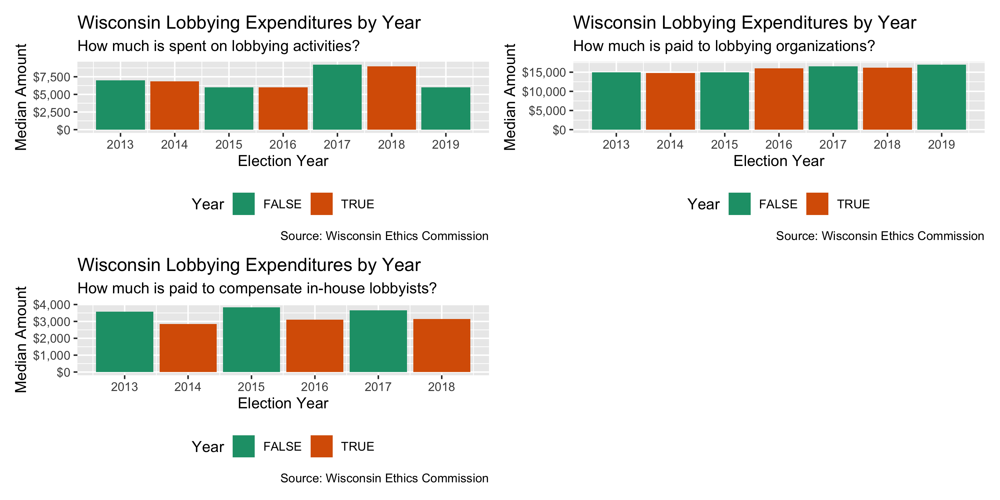
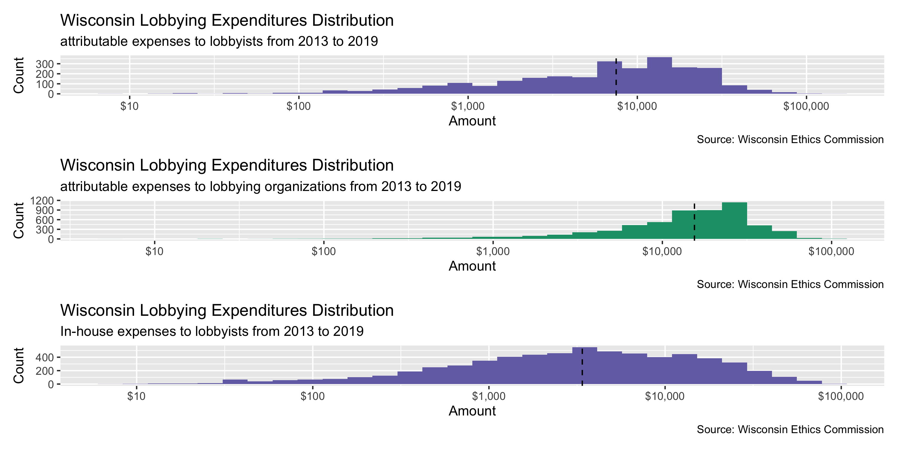

Wisconsin Lobbying Data Diary
================
Yanqi Xu
2019-12-09 14:52:57

-   [Project](#project)
-   [Objectives](#objectives)
-   [Packages](#packages)
-   [Data](#data)
-   [Import](#import)
-   [Explore](#explore)
-   [Wrangle](#wrangle)
-   [Join](#join)
-   [Conclude](#conclude)
-   [Export](#export)

Project
-------

The Accountability Project is an effort to cut across data silos and give journalists, policy professionals, activists, and the public at large a simple way to search across huge volumes of public data about people and organizations.

Our goal is to standardizing public data on a few key fields by thinking of each dataset row as a transaction. For each transaction there should be (at least) 3 variables:

1.  All **parties** to a transaction
2.  The **date** of the transaction
3.  The **amount** of money involved

Objectives
----------

This document describes the process used to complete the following objectives:

1.  How many records are in the database?
2.  Check for duplicates
3.  Check ranges
4.  Is there anything blank or missing?
5.  Check for consistency issues
6.  Create a five-digit ZIP Code called `ZIP5`
7.  Create a `YEAR` field from the transaction date
8.  Make sure there is data on both parties to a transaction

Packages
--------

The following packages are needed to collect, manipulate, visualize, analyze, and communicate these results. The `pacman` package will facilitate their installation and attachment.

The IRW's `campfin` package will also have to be installed from GitHub. This package contains functions custom made to help facilitate the processing of campaign finance data.

``` r
if (!require("pacman")) install.packages("pacman")
pacman::p_load_gh("irworkshop/campfin")
pacman::p_load(
  tidyverse, # data manipulation
  lubridate, # datetime strings
  magrittr, # pipe opperators
  janitor, # dataframe clean
  refinr, # cluster and merge
  patchwork, # position plots
  scales, # format strings
  knitr, # knit documents
  vroom, # read files fast
  glue, # combine strings
  here, # relative storage
  readxl, # read data frames from xls
  fs # search storage 
)
```

This document should be run as part of the `R_campfin` project, which lives as a sub-directory of the more general, language-agnostic [`irworkshop/accountability_datacleaning`](https://github.com/irworkshop/accountability_datacleaning "TAP repo") GitHub repository.

The `R_campfin` project uses the [RStudio projects](https://support.rstudio.com/hc/en-us/articles/200526207-Using-Projects "Rproj") feature and should be run as such. The project also uses the dynamic `here::here()` tool for file paths relative to *your* machine.

``` r
# where does this document knit?
here::here()
#> [1] "/Users/soc/accountability/accountability_datacleaning/R_campfin"
```

Data
----

The Accountability Project obtained the Wisconsin lobbying expenditures from the Wisconsin Ethics Commission from 2013 to 2019 through an open records request. The dataset is as current as Nov 6, 2019.

### About

### Variables

For the `reporting_period` column; periods are as follows:

P1: January-June odd numbered year of session

P2: July-December odd numbered year of session

P3: January-June even numbered year of session

P4: July-December even numbered year of session

For the `session` column; sessions are as follows:

2013REG: 2013-2014

2015REG: 2015-2016

2017REG: 2017-2018

2019REG: 2019-2020

Import
------

``` r
reg_dir <- here("wi", "lobbyists", "data", "raw", "registration")
exp_dir <- here("wi", "lobbyists", "data", "raw", "expends")
dir_create(c(reg_dir, exp_dir))
```

### Read

There are two excel spreadsheets for Wisconsin Lobbying Expenditures records obtained by the Accountability Project, namely, payments made directly to lobbyists, and payments made to lobbying firms.

``` r
wi_lobbyist <- read_xlsx(glue("{exp_dir}/WILobbyingExpense.xlsx"), 
                         sheet = 1, col_types = "text") %>% 
  clean_names() %>% 
  mutate_if(is_character, str_to_upper)
# Change "NULL" to NAs.

wi_lobbyist_13 <- read_xlsx(glue("{exp_dir}/wi_lobbying_expenses_2013.xlsx"), 
                         sheet = 1, col_types = "text") %>% 
  clean_names() %>% 
  mutate_if(is_character, str_to_upper)

wi_lobbyist <- wi_lobbyist %>% bind_rows(wi_lobbyist_13)

wi_lobbyist[,6:10] <- wi_lobbyist[,6:10] %>% na_if("NULL") %>% map_dfc(as.numeric)

wi_org <- read_xlsx(glue("{exp_dir}/WILobbyingExpense.xlsx"), 
                         sheet = 2, col_types = "text") %>% 
  clean_names() %>% 
  mutate_if(is_character, str_to_upper)

wi_org[,5:7] <- wi_org[,5:7] %>% map_dfc(as.numeric)

reg_dir <- here("wi", "lobbyists", "data", "processed", "registration")
wi_lobby_reg <- read_csv(glue("{reg_dir}/wi_lobbyists_reg.csv"))
```

Explore
-------

``` r
head(wi_org)
#> # A tibble: 6 x 7
#>   organization_na… principal_name session reporting_period payments_attrib… travel_reimburs…
#>   <chr>            <chr>          <chr>   <chr>                       <dbl>            <dbl>
#> 1 FOLEY & LARDNER… AMERICAN EXPR… 2019REG P2                              0               0 
#> 2 FOLEY & LARDNER… AMERICAN EXPR… 2019REG P1                          22950               0 
#> 3 PALADIN CONSULT… 211 WISCONSIN… 2013REG P1                           7000               0 
#> 4 PALADIN CONSULT… 211 WISCONSIN… 2013REG P1                           7000               0 
#> 5 HAMILTON CONSUL… 3M             2013REG P1                          25000               0 
#> 6 HAMILTON CONSUL… 3M             2013REG P2                          25000             207.
#> # … with 1 more variable: other_reimbursement <dbl>
tail(wi_org)
#> # A tibble: 6 x 7
#>   organization_na… principal_name session reporting_period payments_attrib… travel_reimburs…
#>   <chr>            <chr>          <chr>   <chr>                       <dbl>            <dbl>
#> 1 MICHAEL BEST ST… WYSOCKI PRODU… 2017REG P4                              0                0
#> 2 MICHAEL BEST ST… WYSOCKI PRODU… 2017REG P3                              0                0
#> 3 THE HAMILTON CO… WYSOCKI PRODU… 2017REG P3                           2500                0
#> 4 THE HAMILTON CO… WYSOCKI PRODU… 2017REG P2                           5500                0
#> 5 THE HAMILTON CO… WYSOCKI PRODU… 2017REG P1                              0                0
#> 6 HERRICK & KASDO… YWCA MADISON   2019REG P1                              0                0
#> # … with 1 more variable: other_reimbursement <dbl>
glimpse(sample_frac(wi_org))
#> Observations: 9,911
#> Variables: 7
#> $ organization_name                 <chr> "WHYTE HIRSCHBOECK DUDEK S.C.", "THE HAMILTON CONSULTI…
#> $ principal_name                    <chr> "DIRECTV GROUP, INC.", "WELLCARE HEALTH PLANS, INC.", …
#> $ session                           <chr> "2013REG", "2017REG", "2015REG", "2015REG", "2013REG",…
#> $ reporting_period                  <chr> "P1", "P4", "P2", "P3", "P3", "P3", "P1", "P2", "P4", …
#> $ payments_attributable_to_lobbying <dbl> 9000, 12000, 3200, 4150, 11100, 0, 0, 1000, 0, 0, 0, 1…
#> $ travel_reimbursement              <dbl> 0.00, 547.00, 0.00, 0.00, 0.00, 0.00, 0.00, 0.00, 0.00…
#> $ other_reimbursement               <dbl> 0.00, 695.64, 0.00, 0.00, 689.81, 0.00, 0.00, 0.00, 0.…

head(wi_lobbyist)
#> # A tibble: 6 x 10
#>   principal_name lobbyist_first_… lobbyist_last_n… session reporting_period payments_attrib…
#>   <chr>          <chr>            <chr>            <chr>   <chr>                       <dbl>
#> 1 AMERICAN EXPR… JOE              LEIBHAM          2019REG P1                              0
#> 2 AMERICAN EXPR… JENNIFER         MALCORE          2019REG P1                              0
#> 3 AMERICAN EXPR… JASON            CHILDRESS        2019REG P1                              0
#> 4 AMERICAN EXPR… JOE              LEIBHAM          2019REG P2                              0
#> 5 AMERICAN EXPR… JENNIFER         MALCORE          2019REG P2                              0
#> 6 AMERICAN EXPR… JASON            CHILDRESS        2019REG P2                              0
#> # … with 4 more variables: travel_reimbursement <dbl>, other_reimbursement <dbl>,
#> #   in_house_lobbyist_compensation <dbl>, in_house_lobbyist_reimbursement <dbl>
tail(wi_lobbyist)
#> # A tibble: 6 x 10
#>   principal_name lobbyist_first_… lobbyist_last_n… session reporting_period payments_attrib…
#>   <chr>          <chr>            <chr>            <chr>   <chr>                       <dbl>
#> 1 ST. JOSAPHAT … SUSAN            RABE             2013REG P4                             NA
#> 2 SAS INSTITUTE… JILL             DIDIER           2013REG P4                             NA
#> 3 LEGAL ACTION … VICKY            SELKOWE          2013REG P4                             NA
#> 4 BRISTOL-MYERS… JOHN             MARCHANT         2013REG P4                             NA
#> 5 WISCONSIN IND… AMY              HARRIMAN         2013REG P4                             NA
#> 6 INTOXIMETER, … THOMAS           HARRIS           2013REG P4                              0
#> # … with 4 more variables: travel_reimbursement <dbl>, other_reimbursement <dbl>,
#> #   in_house_lobbyist_compensation <dbl>, in_house_lobbyist_reimbursement <dbl>
glimpse(sample_frac(wi_lobbyist))
#> Observations: 33,485
#> Variables: 10
#> $ principal_name                    <chr> "AFLAC", "CITY OF MILWAUKEE", "INTERNATIONAL INTERIOR …
#> $ lobbyist_first_name               <chr> "PETER", "DANIELLE", "BUDDY", "STEVE", "WOODROW", "AND…
#> $ lobbyist_last_name                <chr> "CHRISTIANSON", "DECKER", "JULIUS", "LYONS", "WIEDENHO…
#> $ session                           <chr> "2013REG", "2017REG", "2017REG", "2017REG", "2017REG",…
#> $ reporting_period                  <chr> "P2", "P4", "P2", "P1", "P1", "P4", "P3", "P3", "P1", …
#> $ payments_attributable_to_lobbying <dbl> 0, NA, 0, 0, NA, 0, NA, 0, 0, 0, 0, 0, NA, 0, 0, 0, 0,…
#> $ travel_reimbursement              <dbl> 0.00, NA, 0.00, 0.00, NA, 0.00, NA, 0.00, 0.00, 190.86…
#> $ other_reimbursement               <dbl> 0.00, NA, 0.00, 0.00, NA, 0.00, NA, 0.00, 0.00, 230.42…
#> $ in_house_lobbyist_compensation    <dbl> NA, 10251.78, NA, NA, 5296.88, NA, 16699.38, NA, NA, N…
#> $ in_house_lobbyist_reimbursement   <dbl> NA, 825.45, NA, NA, 0.00, NA, 2163.38, NA, NA, NA, NA,…
```

### Missing

``` r
col_stats(wi_lobbyist, count_na)
#> # A tibble: 10 x 4
#>    col                               class     n     p
#>    <chr>                             <chr> <int> <dbl>
#>  1 principal_name                    <chr>     0 0    
#>  2 lobbyist_first_name               <chr>     0 0    
#>  3 lobbyist_last_name                <chr>     0 0    
#>  4 session                           <chr>     0 0    
#>  5 reporting_period                  <chr>     0 0    
#>  6 payments_attributable_to_lobbying <dbl>  7706 0.230
#>  7 travel_reimbursement              <dbl>  7706 0.230
#>  8 other_reimbursement               <dbl>  7706 0.230
#>  9 in_house_lobbyist_compensation    <dbl> 25706 0.768
#> 10 in_house_lobbyist_reimbursement   <dbl> 25706 0.768
col_stats(wi_org, count_na)
#> # A tibble: 7 x 4
#>   col                               class     n     p
#>   <chr>                             <chr> <int> <dbl>
#> 1 organization_name                 <chr>     0     0
#> 2 principal_name                    <chr>     0     0
#> 3 session                           <chr>     0     0
#> 4 reporting_period                  <chr>     0     0
#> 5 payments_attributable_to_lobbying <dbl>     0     0
#> 6 travel_reimbursement              <dbl>     0     0
#> 7 other_reimbursement               <dbl>     0     0
```

``` r
wi_org <- wi_org %>% flag_na()
wi_lobbyist <- wi_lobbyist %>% flag_na()
```

### Duplicates

``` r
wi_lobbyist <- wi_lobbyist %>% flag_dupes(dplyr::everything())
wi_org <- wi_org %>%  flag_dupes(dplyr::everything())
```

### Categorical

``` r
col_stats(wi_lobbyist, n_distinct)
#> # A tibble: 12 x 4
#>    col                               class     n         p
#>    <chr>                             <chr> <int>     <dbl>
#>  1 principal_name                    <chr>  1282 0.0383   
#>  2 lobbyist_first_name               <chr>   435 0.0130   
#>  3 lobbyist_last_name                <chr>   985 0.0294   
#>  4 session                           <chr>     4 0.000119 
#>  5 reporting_period                  <chr>     4 0.000119 
#>  6 payments_attributable_to_lobbying <dbl>  1062 0.0317   
#>  7 travel_reimbursement              <dbl>   353 0.0105   
#>  8 other_reimbursement               <dbl>   188 0.00561  
#>  9 in_house_lobbyist_compensation    <dbl>  4233 0.126    
#> 10 in_house_lobbyist_reimbursement   <dbl>  1927 0.0575   
#> 11 na_flag                           <lgl>     1 0.0000299
#> 12 dupe_flag                         <lgl>     2 0.0000597
col_stats(wi_org, n_distinct)
#> # A tibble: 9 x 4
#>   col                               class     n        p
#>   <chr>                             <chr> <int>    <dbl>
#> 1 organization_name                 <chr>   442 0.0446  
#> 2 principal_name                    <chr>  1158 0.117   
#> 3 session                           <chr>     4 0.000404
#> 4 reporting_period                  <chr>     4 0.000404
#> 5 payments_attributable_to_lobbying <dbl>  1355 0.137   
#> 6 travel_reimbursement              <dbl>   591 0.0596  
#> 7 other_reimbursement               <dbl>   626 0.0632  
#> 8 na_flag                           <lgl>     1 0.000101
#> 9 dupe_flag                         <lgl>     2 0.000202
```

``` r

wi_lobbyist <- wi_lobbyist %>% 
  mutate(attributable_expenses = payments_attributable_to_lobbying + travel_reimbursement + other_reimbursement,
         inhouse_expenses = in_house_lobbyist_compensation + in_house_lobbyist_reimbursement)

wi_org <- wi_org %>% 
  mutate(org_expenses = payments_attributable_to_lobbying + travel_reimbursement + other_reimbursement)

summary(wi_lobbyist$inhouse_expenses)
#>    Min. 1st Qu.  Median    Mean 3rd Qu.    Max.    NA's 
#>     0.0   253.2  2078.2  6447.0  7683.7 96759.6   25706
summary(wi_lobbyist$attributable_expenses)
#>    Min. 1st Qu.  Median    Mean 3rd Qu.    Max.    NA's 
#>       0       0       0    1208       0  150864    7706
```

#### Year

``` r
year_calculator <- function(rep_per){
  year_result = ifelse(test = rep_per > 2,yes = 1, no = 0)
  return(year_result)
}

wi_org <- wi_org %>% 
  mutate(year = as.numeric(str_sub(session, start = 1L, end = 4L)) + year_calculator(as.numeric(reporting_period %>% str_remove("^P"))))


wi_lobbyist <- wi_lobbyist %>% 
    mutate(year = as.numeric(str_sub(session, start = 1L, end = 4L)) + year_calculator(as.numeric(reporting_period %>% str_remove("^P"))))
```




### Continuous

#### Amounts

We'll examine expenses attributable to lobbying paid to lobbyists, expenses attributable to lobbying paid to organizations and expenses paid to in-house lobbyists individually.



Wrangle
-------

### Session ID

``` r
wi_org <- wi_org %>% mutate(session = session %>% str_replace("REG", " REGULAR SESSION"))
wi_lobbyist <- wi_lobbyist %>% mutate(session = session %>% str_replace("REG", " REGULAR SESSION"))
```

Join
----

Since neither of the expenditure tables has IDs or addresses to identify lobbyists, principals or lobbying organizations. We join them back to the registration dataset processed before.

``` r
wi_reg <- read_csv(file.path(here("wi","lobbyists","data","processed","registration"),"wi_lobbyists_reg.csv"))

wi_org <- wi_reg %>% select(principal, principal_mailing_address_norm, principal_mailing_city_clean, principal_mailing_state, principal_mailing_zip_norm, legislative_session, organization) %>% unique() %>% 
  right_join(wi_org, by = c("principal" = "principal_name", "organization" = "organization_name", "legislative_session" = "session")) 

wi_lobbyist <- wi_reg %>% 
  select(lobbyist_first_name, lobbyist_last_name, lobbyist_address_norm, lobbyist_city_clean, lobbyist_state, lobbyist_zip_norm, principal, principal_mailing_address_norm, principal_mailing_city_clean, principal_mailing_state, principal_mailing_zip_norm, legislative_session, organization) %>% unique() %>% 
  right_join(wi_lobbyist, by = c("principal" = "principal_name", "legislative_session" = "session", "lobbyist_first_name", "lobbyist_last_name")) 
```

Conclude
--------

1.  There are `nrow(wi_lobbyist)` records in the lobbyist database and `nrow(wi_org)` in the organization database.
2.  There are `sum(wi_lobbyist$dupe_flag)` duplicate records in the database and `nrow(wi_org)` duplicates in the organization database.
3.  The range and distribution of expenses-related fields seem reasonable.
4.  There are `sum(wi_lobbyist$na_flag)` records missing either receipient or
5.  The 4-digit `year` variable has been created based on the `session` and `reporting_period` columns.

Export
------

``` r
proc_dir <- here("wi", "lobbyists", "data", "processed","expends")
dir_create(proc_dir)
```

``` r
wi_org %>% 
  rename(principal_mailing_zip5 = principal_mailing_zip_norm) %>% 
  write_csv(
    path = glue("{proc_dir}/wi_org_exp_clean.csv"),
    na = ""
  )

wi_lobbyist %>% 
  rename(principal_mailing_zip5 = principal_mailing_zip_norm,
         lobbyist_zip5 = lobbyist_zip_norm) %>% 
  write_csv(
    path = glue("{proc_dir}/wi_lobbyists_exp_clean.csv"),
    na = ""
  )
```
