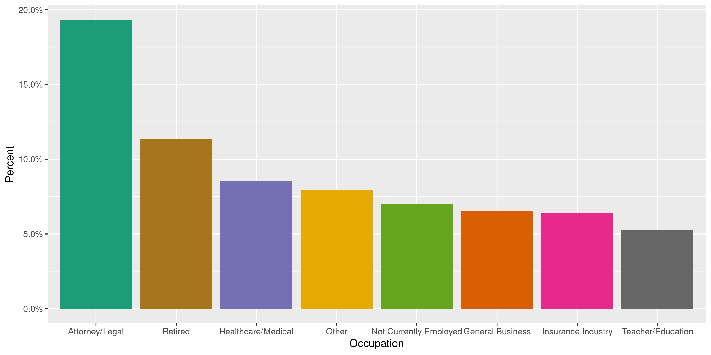
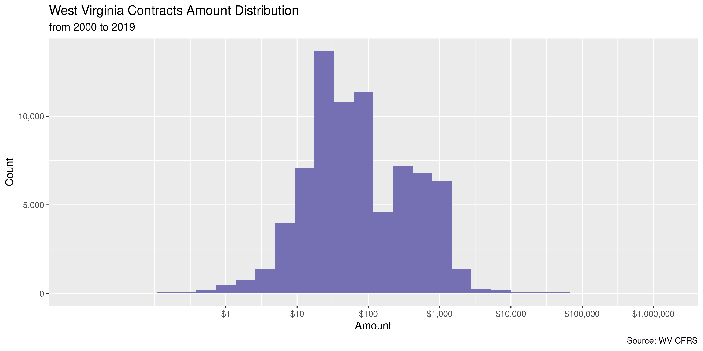
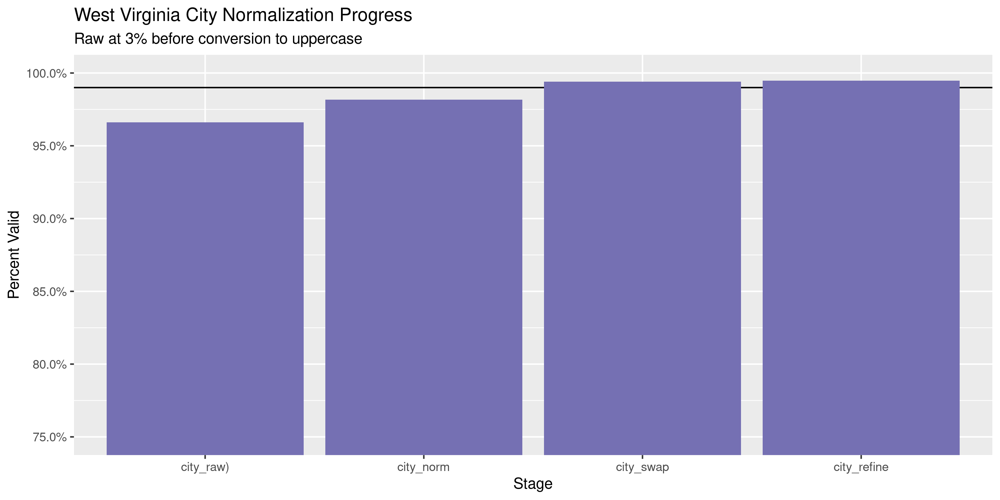
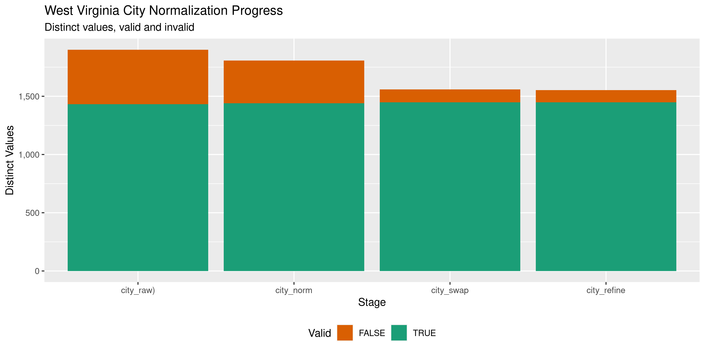

West Virginia Contracts
================
Kiernan Nicholls
2020-05-19 14:41:23

  - [Project](#project)
  - [Objectives](#objectives)
  - [Packages](#packages)
  - [Data](#data)
  - [Dictionary](#dictionary)
  - [Download](#download)
  - [Read](#read)
  - [Explore](#explore)
  - [Wrangle](#wrangle)
  - [Conclude](#conclude)
  - [Export](#export)

<!-- Place comments regarding knitting here -->

## Project

The Accountability Project is an effort to cut across data silos and
give journalists, policy professionals, activists, and the public at
large a simple way to search across huge volumes of public data about
people and organizations.

Our goal is to standardizing public data on a few key fields by thinking
of each dataset row as a transaction. For each transaction there should
be (at least) 3 variables:

1.  All **parties** to a transaction.
2.  The **date** of the transaction.
3.  The **amount** of money involved.

## Objectives

This document describes the process used to complete the following
objectives:

1.  How many records are in the database?
2.  Check for entirely duplicated records.
3.  Check ranges of continuous variables.
4.  Is there anything blank or missing?
5.  Check for consistency issues.
6.  Create a five-digit ZIP Code called `zip`.
7.  Create a `year` field from the transaction date.
8.  Make sure there is data on both parties to a transaction.

## Packages

The following packages are needed to collect, manipulate, visualize,
analyze, and communicate these results. The `pacman` package will
facilitate their installation and attachment.

The IRW’s `campfin` package will also have to be installed from GitHub.
This package contains functions custom made to help facilitate the
processing of campaign finance data.

``` r
if (!require("pacman")) install.packages("pacman")
pacman::p_load_gh("irworkshop/campfin")
pacman::p_load(
  tidyverse, # data manipulation
  lubridate, # datetime strings
  gluedown, # printing markdown
  magrittr, # pipe operators
  janitor, # clean data frames
  batman, # parse logicals
  refinr, # cluster and merge
  scales, # format strings
  knitr, # knit documents
  vroom, # read files fast
  rvest, # html scraping
  glue, # combine strings
  here, # relative paths
  httr, # http requests
  fs # local storage 
)
```

This document should be run as part of the `R_campfin` project, which
lives as a sub-directory of the more general, language-agnostic
[`irworkshop/accountability_datacleaning`](https://github.com/irworkshop/accountability_datacleaning)
GitHub repository.

The `R_campfin` project uses the [RStudio
projects](https://support.rstudio.com/hc/en-us/articles/200526207-Using-Projects)
feature and should be run as such. The project also uses the dynamic
`here::here()` tool for file paths relative to *your* machine.

``` r
# where does this document knit?
here::here()
#> [1] "/home/kiernan/Code/accountability_datacleaning/R_campfin"
```

## Data

Contributions data can be obtained in bulk from the West Virginia
Secretary of State [Campaign Finance Reporting System
(CFRS)](https://cfrs.wvsos.gov/index.html#/index). Each record contains
information on a contribution made to a candidate or committee. The CFRS
also provides a [record layout
PDF](https://cfrs.wvsos.gov/CFIS_APIService/Template/KeyDownloads/Contributions%20and%20Loans%20File%20Layout%20Key.pdf),
which we have converted to a text file.

## Dictionary

``` r
key_path <- here("wv", "contribs", "record_layout.csv")
(dict_md <- kable(read_csv(key_path)))
```

| Field Position | Field Name                          | Description                                                                                                                          |
| -------------: | :---------------------------------- | :----------------------------------------------------------------------------------------------------------------------------------- |
|              1 | `ORG ID`                            | This is the unique ID of the recipient candidate or committee.                                                                       |
|              2 | `RECEIPT AMOUNT`                    | Receipt Amount                                                                                                                       |
|              3 | `RECEIPT DATE`                      | Receipt Date                                                                                                                         |
|              4 | `LAST NAME`                         | Last Name of Receipt Source, if an individual person. If not an individual, the entity full name will be in LAST NAME field.         |
|              5 | `FIRST NAME`                        | Receipt Source First Name                                                                                                            |
|              6 | `MIDDLE NAME`                       | Receipt Source Middle Initial or Name if provided.                                                                                   |
|              7 | `SUFFIX`                            | Receipt Source Name Suffix                                                                                                           |
|              8 | `ADDRESS 1`                         | Receipt Source Street, PO Box, or other directional information                                                                      |
|              9 | `ADDRESS 2`                         | Receipt Source Suite/Apartment number, or other directional information                                                              |
|             10 | `CITY`                              | Receipt Source City                                                                                                                  |
|             11 | `STATE`                             | Receipt Source State                                                                                                                 |
|             12 | `ZIP`                               | Receipt Source Zip Code                                                                                                              |
|             13 | `Description`                       | NA                                                                                                                                   |
|             14 | `RECEIPT ID`                        | This is the Receipt internal ID. This ID is unique.                                                                                  |
|             15 | `FILED DATE`                        | Receipt Filed Date                                                                                                                   |
|             16 | `RECEIPT SOURCE TYPE`               | Type of entity that is the source of the Receipt.                                                                                    |
|             17 | `AMENDED`                           | Y/N indicator to show if an amendment was filed for this record.                                                                     |
|             18 | `RECEIPT TYPE`                      | This is the Receipt Type.                                                                                                            |
|             19 | `COMMITTEE TYPE`                    | The type of Committee.                                                                                                               |
|             20 | `COMMITTEE NAME`                    | This is the name of the recipient committee.                                                                                         |
|             21 | `CANDIDATE NAME`                    | This is the name of the recipient candidate.                                                                                         |
|             22 | `EMPLOYER`                          | Receipt Source’s employer displays in cases where this information is provided. Only used for Individual contributors.               |
|             23 | `OCCUPATION`                        | The Receipt Source’s occupation in cases where this information is provided. Only used for Individual contributors .                 |
|             24 | `OCCUPATION COMMENT`                | This is the receipt source’s occupation description if ‘Other’ is chosen for the occupation. Only used for Individual contributors . |
|             25 | `FORGIVEN LOAN`                     | NA                                                                                                                                   |
|             26 | `RELATED FUNDRAISER EVENT DATE`     | Date of fundraiser event, if the contribution was related to a fundraiser.                                                           |
|             27 | `RELATED FUNDRAISER EVENT TYPE`     | Type of fundraiser event, if the contribution was related to a fundraiser.                                                           |
|             28 | `RELATED FUNDRAISER PLACE OF EVENT` | Name of venue or location where the fundraiser event took place, if the contribution was related to a fundraiser.                    |
|             29 | `REPORT NAME`                       | Indicates Name of the Report                                                                                                         |
|             30 | `CONTRIBUTION TYPE`                 | Indicates Type of Contribution                                                                                                       |

``` r
write_lines(
  x = c("# West Virginia Contracts Data Dictionary\n", dict_md),
  path = here("wv", "contribs", "wv_contribs_dict.md"),
)
```

## Download

The files can be downloaded with an `httr::GET()` request to the CFRS
server.

``` r
raw_dir <- dir_create(here("wv", "contribs", "data", "raw"))
wv_api <- "https://cfrs.wvsos.gov/CFIS_APIService/api"
for (year in 2018:2020) {
  wv_get <- GET(
    url = str_c(wv_api, "DataDownload", "GetCSVDownloadReport", sep = "/"),
    write_disk(path(raw_dir, glue("CON_{year}.csv")), overwrite = TRUE),
    query = list(
      year = "2018",
      transactionType = "CON",
      reportFormat = "csv",
      fileName = glue("CON_{year}.csv")
    )
  )
}
```

``` r
raw_info <- as_tibble(dir_info(raw_dir))
raw_paths <- raw_info$path
raw_info %>% 
  select(path, size, modification_time) %>% 
  mutate(across(path, ~as_fs_path(basename(.))))
#> # A tibble: 3 x 3
#>   path                size modification_time  
#>   <fs::path>   <fs::bytes> <dttm>             
#> 1 CON_2018.csv       8.46M 2020-05-19 14:41:40
#> 2 CON_2019.csv       4.35M 2020-05-19 14:41:59
#> 3 CON_2020.csv       4.97M 2020-05-19 14:42:13
```

## Read

While character columns are wrapped in double-quotes (`"`), any
double-quotes *within* those columns are not escaped in any way. We will
have to use regular expressions to replace them with single-quotes
(`'`).

``` r
fix_paths <- path_temp(basename(raw_paths))
for (i in seq_along(raw_paths)) {
  read_file(raw_paths[i]) %>% 
    str_replace_all("(?<!,|^)\"(?!,|$)", "\'") %>% 
    str_replace_all("\"(?=Icing)", "\'") %>% 
    write_file(fix_paths[i])
}
```

The fixed text files can be read into a single data frame.

``` r
wvc <- map_df(
  .x = fix_paths,
  .f = read_delim,
  delim = ",",
  escape_backslash = FALSE, 
  escape_double = FALSE,
  col_types = cols(
    .default = col_character(),
    `Receipt Amount` = col_double(),
    `Receipt Date` = col_date("%m/%d/%Y %H:%M:%S %p"),
    `Filed Date` = col_datetime("%m/%d/%Y %H:%M:%S %p"),
    `Fundraiser Event Date` = col_datetime("%m/%d/%Y %H:%M:%S %p")
  )
)
```

Column names can be converted to snake case and simplified.

``` r
wvc <- wvc %>% 
  clean_names("snake") %>% 
  rename_all(str_remove, "receipt_") %>% 
  rename_all(str_remove, "fundraiser_") %>% 
  rename_all(str_remove, "_name") %>% 
  mutate(across(c(amended, occupation_comment), to_logical))
```

We can check whether the files were properly read by counting the number
of distinct values in a discrete variable like the `contribution_type`.

``` r
count(wvc, contribution_type)
#> # A tibble: 5 x 2
#>   contribution_type                       n
#>   <chr>                               <int>
#> 1 In-Kind                              1972
#> 2 Monetary                            73138
#> 3 Other Income                          990
#> 4 Receipt of Transfer of Excess Funds   365
#> 5 <NA>                                  656
```

## Explore

``` r
glimpse(wvc)
#> Rows: 77,121
#> Columns: 30
#> $ org_id             <chr> "11", "11", "11", "11", "11", "11", "11", "11", "11", "11", "11", "11…
#> $ amount             <dbl> 50, 100, 100, 100, 100, 100, 100, 100, 125, 150, 150, 150, 150, 150, …
#> $ date               <date> 2018-08-22, 2018-01-27, 2018-04-09, 2018-04-26, 2018-04-26, 2018-07-…
#> $ last               <chr> "Rice", "McKinney", "Community Bankers PAC", "Glasser", "Wallace", "B…
#> $ first              <chr> "Norma", "Douglas", NA, "Lewis", "R", "Gregory", "David", NA, "Chris"…
#> $ middle             <chr> "J.", "E.", NA, NA, "Austin", "K.", "C", NA, NA, NA, "A.", NA, NA, NA…
#> $ suffix             <chr> NA, NA, NA, NA, NA, NA, NA, NA, NA, NA, NA, NA, NA, NA, NA, NA, NA, "…
#> $ address1           <chr> "1195 North Street", "2092 Herns Mill Road", "101 N. Kanawha Street",…
#> $ address2           <chr> "Unit 331", NA, "Suite 201", NA, NA, NA, NA, "Suite 201", NA, NA, NA,…
#> $ city               <chr> "Westerville", "Lewisburg", "Beckley", NA, "Charleston", "Elkview", "…
#> $ state              <chr> "OH", "WV", "WV", "ME", "WV", "WV", "WV", "WV", "WV", "KY", "WV", "DC…
#> $ zip                <chr> "43081", "24901", "25801", NA, "25314", "25071", "26537", "25801", "2…
#> $ description        <chr> NA, NA, NA, NA, NA, NA, NA, NA, NA, NA, NA, NA, NA, NA, NA, NA, NA, N…
#> $ id                 <chr> "78838", "78853", "52615", "52532", "59575", "61197", "64173", "80279…
#> $ filed_date         <dttm> 2018-10-11 02:34:13, 2018-10-11 01:31:15, 2018-04-27 15:45:57, 2018-…
#> $ source_type        <chr> "Individual", "Individual", "Business or Organization", "Individual",…
#> $ amended            <lgl> FALSE, FALSE, FALSE, FALSE, FALSE, FALSE, FALSE, FALSE, FALSE, FALSE,…
#> $ type               <chr> "Contributions", "Contributions", "Contributions", "Contributions", "…
#> $ committee_type     <chr> "State Candidate", "State Candidate", "State Candidate", "State Candi…
#> $ committee          <chr> NA, NA, NA, NA, NA, NA, NA, NA, NA, NA, NA, NA, NA, NA, NA, NA, NA, N…
#> $ candidate          <chr> "Mark R. Maynard", "Mark R. Maynard", "Mark R. Maynard", "Mark R. May…
#> $ employer           <chr> "Unknown", NA, NA, NA, "Eye & Ear Clinic Physicians", NA, "State of W…
#> $ occupation         <chr> NA, NA, NA, NA, "Healthcare/Medical", NA, "Business Owner", NA, "Lobb…
#> $ occupation_comment <lgl> FALSE, FALSE, FALSE, FALSE, FALSE, FALSE, FALSE, FALSE, FALSE, FALSE,…
#> $ forgiven_loan      <chr> NA, NA, NA, NA, NA, NA, NA, NA, NA, NA, NA, NA, NA, NA, NA, NA, NA, N…
#> $ event_date         <dttm> NA, NA, NA, 2018-04-16 04:00:00, NA, NA, 2018-09-17 07:00:00, NA, NA…
#> $ event_type         <chr> NA, NA, NA, "Fundraiser", NA, NA, "Fundraiser", NA, NA, NA, NA, NA, N…
#> $ event_place        <chr> NA, NA, NA, "West Virginia Business and Industry Council", NA, NA, "S…
#> $ report             <chr> "General - First Report", "2018 Precandidate Annual Report", "Pre-Pri…
#> $ contribution_type  <chr> "Monetary", "Monetary", "Monetary", "Monetary", "Monetary", "Monetary…
tail(wvc)
#> # A tibble: 6 x 30
#>   org_id amount date       last  first middle suffix address1 address2 city  state zip  
#>   <chr>   <dbl> <date>     <chr> <chr> <chr>  <chr>  <chr>    <chr>    <chr> <chr> <chr>
#> 1 80639   2800  2020-03-25 Regan Chri… <NA>   <NA>   1358 Na… <NA>     Whee… WV    26003
#> 2 80639   2800  2020-03-30 Blass Scott <NA>   <NA>   17 A Pi… <NA>     Whee… WV    26003
#> 3 80817    181. 2020-03-28 Fry   Jason Jeffr… <NA>   P.O. Bo… <NA>     Wayne WV    25570
#> 4 80817    602. 2020-03-14 Fry   Jason Jeffr… <NA>   P.O. Bo… <NA>     Wayne WV    25570
#> 5 80817   1260  2020-01-13 Fry   Jason Jeffr… <NA>   P.O. Bo… <NA>     Wayne WV    25570
#> 6 80817   2054. 2020-03-26 Fry   Jason Jeffr… <NA>   P.O. Bo… <NA>     Wayne WV    25570
#> # … with 18 more variables: description <chr>, id <chr>, filed_date <dttm>, source_type <chr>,
#> #   amended <lgl>, type <chr>, committee_type <chr>, committee <chr>, candidate <chr>,
#> #   employer <chr>, occupation <chr>, occupation_comment <lgl>, forgiven_loan <chr>,
#> #   event_date <dttm>, event_type <chr>, event_place <chr>, report <chr>, contribution_type <chr>
```

### Missing

Columns range in their degree of missing values.

``` r
col_stats(wvc, count_na)
#> # A tibble: 30 x 4
#>    col                class      n       p
#>    <chr>              <chr>  <int>   <dbl>
#>  1 org_id             <chr>      0 0      
#>  2 amount             <dbl>      0 0      
#>  3 date               <date>     0 0      
#>  4 last               <chr>   1884 0.0244 
#>  5 first              <chr>  11027 0.143  
#>  6 middle             <chr>  66001 0.856  
#>  7 suffix             <chr>  75747 0.982  
#>  8 address1           <chr>  36822 0.477  
#>  9 address2           <chr>  75276 0.976  
#> 10 city               <chr>  36260 0.470  
#> 11 state              <chr>      0 0      
#> 12 zip                <chr>  36453 0.473  
#> 13 description        <chr>  74049 0.960  
#> 14 id                 <chr>      0 0      
#> 15 filed_date         <dttm>     0 0      
#> 16 source_type        <chr>      0 0      
#> 17 amended            <lgl>      0 0      
#> 18 type               <chr>      0 0      
#> 19 committee_type     <chr>      0 0      
#> 20 committee          <chr>  77121 1      
#> 21 candidate          <chr>  20688 0.268  
#> 22 employer           <chr>  48566 0.630  
#> 23 occupation         <chr>  51098 0.663  
#> 24 occupation_comment <lgl>      0 0      
#> 25 forgiven_loan      <chr>  77121 1      
#> 26 event_date         <dttm> 58955 0.764  
#> 27 event_type         <chr>  59118 0.767  
#> 28 event_place        <chr>  58955 0.764  
#> 29 report             <chr>      0 0      
#> 30 contribution_type  <chr>    656 0.00851
```

We should flag any record missing a key variable, those needed to
identify a transaction and all parties, with `campfin::flag_na()`.

First, we will create a single column combining all the contributor and
recipient names. This way we can avoid columns of one type or the other.

``` r
wvc <- wvc %>% 
  unite(
    first, middle, last, suffix,
    col = "contributor",
    sep = " ",
    na.rm = TRUE,
    remove = FALSE
  ) %>% 
  unite(
    committee, candidate,
    col = "recipient",
    sep = " ",
    na.rm = TRUE,
    remove = FALSE
  )
```

After combining these rows, we have no records missing key variables.

``` r
wvc <- wvc %>% flag_na(date, contributor, amount, recipient)
mean(wvc$na_flag)
#> [1] 0
```

### Duplicates

We can also flag records that are entirely duplicated across every row,
save for the supposedly unique `id`.

``` r
wvc <- flag_dupes(wvc, -id)
percent(mean(wvc$dupe_flag), 0.01)
#> [1] "0.99%"
```

``` r
wvc %>% 
  filter(dupe_flag) %>% 
  select(date, contributor, amount, recipient)
#> # A tibble: 762 x 4
#>    date       contributor        amount recipient  
#>    <date>     <chr>               <dbl> <chr>      
#>  1 2018-02-12 Hollis Ramsey           2 Lissa Lucas
#>  2 2018-02-12 Hollis Ramsey           2 Lissa Lucas
#>  3 2018-02-14 Carol Mukhopadhyay      2 Lissa Lucas
#>  4 2018-02-14 Carol Mukhopadhyay      2 Lissa Lucas
#>  5 2018-02-13 Kathy Carlise           3 Lissa Lucas
#>  6 2018-02-13 Kathy Carlise           3 Lissa Lucas
#>  7 2018-11-09 Ernest Allen            3 Lissa Lucas
#>  8 2018-11-09 Ernest Allen            3 Lissa Lucas
#>  9 2018-05-12 Daniel Goguen           5 Lissa Lucas
#> 10 2018-05-12 Daniel Goguen           5 Lissa Lucas
#> # … with 752 more rows
```

Now we can remove the combined name columns.

``` r
wvc <- select(wvc, -contributor, -recipient)
```

### Categorical

``` r
col_stats(wvc, n_distinct)
#> # A tibble: 32 x 4
#>    col                class      n         p
#>    <chr>              <chr>  <int>     <dbl>
#>  1 org_id             <chr>   1004 0.0130   
#>  2 amount             <dbl>   3838 0.0498   
#>  3 date               <date>  1117 0.0145   
#>  4 last               <chr>  18461 0.239    
#>  5 first              <chr>   5246 0.0680   
#>  6 middle             <chr>    597 0.00774  
#>  7 suffix             <chr>      8 0.000104 
#>  8 address1           <chr>  16473 0.214    
#>  9 address2           <chr>    481 0.00624  
#> 10 city               <chr>   2185 0.0283   
#> 11 state              <chr>     64 0.000830 
#> 12 zip                <chr>   2678 0.0347   
#> 13 description        <chr>   1533 0.0199   
#> 14 id                 <chr>  77120 1.00     
#> 15 filed_date         <dttm>  3972 0.0515   
#> 16 source_type        <chr>      6 0.0000778
#> 17 amended            <lgl>      1 0.0000130
#> 18 type               <chr>      4 0.0000519
#> 19 committee_type     <chr>      4 0.0000519
#> 20 committee          <chr>      1 0.0000130
#> 21 candidate          <chr>    615 0.00797  
#> 22 employer           <chr>   6030 0.0782   
#> 23 occupation         <chr>     34 0.000441 
#> 24 occupation_comment <lgl>      1 0.0000130
#> 25 forgiven_loan      <chr>      1 0.0000130
#> 26 event_date         <dttm>   498 0.00646  
#> 27 event_type         <chr>    228 0.00296  
#> 28 event_place        <chr>    688 0.00892  
#> 29 report             <chr>     53 0.000687 
#> 30 contribution_type  <chr>      5 0.0000648
#> 31 na_flag            <lgl>      1 0.0000130
#> 32 dupe_flag          <lgl>      2 0.0000259
```

<!-- --><!-- --><!-- --><!-- -->

### Amounts

The range of contribution amounts seems reasonable.

``` r
noquote(map_chr(summary(wvc$amount), dollar))
#>       Min.    1st Qu.     Median       Mean    3rd Qu.       Max. 
#>      $0.01     $20.20        $60    $477.13       $250 $1,000,000
sum(wvc$amount <= 0.01)
#> [1] 48
```

Here is the largest contribution of $1,000,000:

``` r
glimpse(wvc[which.max(wvc$amount), ])
#> Rows: 1
#> Columns: 32
#> $ org_id             <chr> "63832"
#> $ amount             <dbl> 1e+06
#> $ date               <date> 2020-03-30
#> $ last               <chr> "Neely"
#> $ first              <chr> "Richard"
#> $ middle             <chr> "Forlani"
#> $ suffix             <chr> NA
#> $ address1           <chr> "Neely & Callaghan, 159 Summers St."
#> $ address2           <chr> NA
#> $ city               <chr> "Charleston"
#> $ state              <chr> "WV"
#> $ zip                <chr> "25301"
#> $ description        <chr> NA
#> $ id                 <chr> "179213"
#> $ filed_date         <dttm> 2020-04-07 09:04:01
#> $ source_type        <chr> "Self"
#> $ amended            <lgl> FALSE
#> $ type               <chr> "Loan"
#> $ committee_type     <chr> "State Candidate"
#> $ committee          <chr> NA
#> $ candidate          <chr> "Richard Forlani Neely"
#> $ employer           <chr> NA
#> $ occupation         <chr> NA
#> $ occupation_comment <lgl> FALSE
#> $ forgiven_loan      <chr> NA
#> $ event_date         <dttm> NA
#> $ event_type         <chr> NA
#> $ event_place        <chr> NA
#> $ report             <chr> "2020 1st Quarter Report"
#> $ contribution_type  <chr> NA
#> $ na_flag            <lgl> FALSE
#> $ dupe_flag          <lgl> FALSE
```

<!-- -->

### Dates

We can add the calendar year from `date` with `lubridate::year()`

``` r
wvc <- mutate(wvc, year = year(date))
```

The range of dates is completely normal.

``` r
min(wvc$date)
#> [1] "2016-03-01"
sum(wvc$year < 2016)
#> [1] 0
max(wvc$date)
#> [1] "2020-04-24"
sum(wvc$date > today())
#> [1] 0
```

<!-- -->

## Wrangle

To improve the searchability of the database, we will perform some
consistent, confident string normalization. For geographic variables
like city names and ZIP codes, the corresponding `campfin::normal_*()`
functions are tailor made to facilitate this process.

### Address

For the street `addresss` variable, the `campfin::normal_address()`
function will force consistence case, remove punctuation, and abbreviate
official USPS suffixes.

``` r
wvc <- wvc %>% 
  unite(
    col = address_full,
    starts_with("address"),
    sep = " ",
    remove = FALSE,
    na.rm = TRUE
  ) %>% 
  mutate(
    address_norm = normal_address(
      address = address_full,
      abbs = usps_street,
      na_rep = TRUE
    )
  ) %>% 
  select(-address_full)
```

``` r
wvc %>% 
  select(contains("address")) %>% 
  distinct() %>% 
  sample_n(10)
#> # A tibble: 10 x 3
#>    address1                address2 address_norm       
#>    <chr>                   <chr>    <chr>              
#>  1 2200 Energy Drive       <NA>     2200 ENERGY DR     
#>  2 2033 Turk Hill Rd       <NA>     2033 TURK HL RD    
#>  3 15 Norwood Rd           <NA>     15 NORWOOD RD      
#>  4 PO Box 128              <NA>     PO BOX 128         
#>  5 1536 Bedford Road       <NA>     1536 BEDFORD RD    
#>  6 2255 Nadenbush Lane     <NA>     2255 NADENBUSH LN  
#>  7 113 Cyrus Pt            <NA>     113 CYRUS PT       
#>  8 3994 Pinnacle View Road <NA>     3994 PINNACLE VW RD
#>  9 319 Shawnee Circle      <NA>     319 SHAWNEE CIR    
#> 10 446 Locust Street       <NA>     446 LOCUST ST
```

### ZIP

For ZIP codes, the `campfin::normal_zip()` function will attempt to
create valid *five* digit codes by removing the ZIP+4 suffix and
returning leading zeroes dropped by other programs like Microsoft Excel.

``` r
wvc <- wvc %>% 
  mutate(
    zip_norm = normal_zip(
      zip = zip,
      na_rep = TRUE
    )
  )
```

``` r
progress_table(
  wvc$zip,
  wvc$zip_norm,
  compare = valid_zip
)
#> # A tibble: 2 x 6
#>   stage    prop_in n_distinct prop_na n_out n_diff
#>   <chr>      <dbl>      <dbl>   <dbl> <dbl>  <dbl>
#> 1 zip        0.968       2678   0.473  1290    525
#> 2 zip_norm   0.996       2290   0.473   176     96
```

### State

Valid two digit state abbreviations can be made using the
`campfin::normal_state()` function.

``` r
wvc <- wvc %>% 
  mutate(
    state_norm = normal_state(
      state = state,
      abbreviate = TRUE,
      na_rep = TRUE,
      valid = valid_state
    )
  )
```

``` r
wvc %>% 
  filter(state != state_norm) %>% 
  count(state, state_norm, sort = TRUE)
#> # A tibble: 15 x 3
#>    state state_norm     n
#>    <chr> <chr>      <int>
#>  1 wv    WV           343
#>  2 Wv    WV            46
#>  3 tx    TX            28
#>  4 dc    DC            25
#>  5 ca    CA            20
#>  6 ky    KY            13
#>  7 wV    WV            12
#>  8 ny    NY             7
#>  9 ma    MA             5
#> 10 mA    MA             4
#> 11 co    CO             2
#> 12 in    IN             2
#> 13 md    MD             2
#> 14 oh    OH             2
#> 15 il    IL             1
```

``` r
progress_table(
  wvc$state,
  wvc$state_norm,
  compare = valid_state
)
#> # A tibble: 2 x 6
#>   stage      prop_in n_distinct prop_na n_out n_diff
#>   <chr>        <dbl>      <dbl>   <dbl> <dbl>  <dbl>
#> 1 state        0.993         64       0   512     15
#> 2 state_norm   1             49       0     0      0
```

### City

Cities are the most difficult geographic variable to normalize, simply
due to the wide variety of valid cities and formats.

#### Normal

The `campfin::normal_city()` function is a good start, again converting
case, removing punctuation, but *expanding* USPS abbreviations. We can
also remove `invalid_city` values.

``` r
wvc <- wvc %>% 
  mutate(
    city_norm = normal_city(
      city = city, 
      abbs = usps_city,
      states = c("WV", "DC", "WEST VIRGINIA"),
      na = invalid_city,
      na_rep = TRUE
    )
  )
```

#### Swap

We can further improve normalization by comparing our normalized value
against the *expected* value for that record’s state abbreviation and
ZIP code. If the normalized value is either an abbreviation for or very
similar to the expected value, we can confidently swap those two.

``` r
wvc <- wvc %>% 
  rename(city_raw = city) %>% 
  left_join(
    y = zipcodes,
    by = c(
      "state_norm" = "state",
      "zip_norm" = "zip"
    )
  ) %>% 
  rename(city_match = city) %>% 
  mutate(
    match_abb = is_abbrev(city_norm, city_match),
    match_dist = str_dist(city_norm, city_match),
    city_swap = if_else(
      condition = !is.na(match_dist) & (match_abb | match_dist == 1),
      true = city_match,
      false = city_norm
    )
  ) %>% 
  select(
    -city_match,
    -match_dist,
    -match_abb
  )
```

#### Refine

The [OpenRefine](https://openrefine.org/) algorithms can be used to
group similar strings and replace the less common versions with their
most common counterpart. This can greatly reduce inconsistency, but with
low confidence; we will only keep any refined strings that have a valid
city/state/zip combination.

``` r
good_refine <- wvc %>% 
  mutate(
    city_refine = city_swap %>% 
      key_collision_merge() %>% 
      n_gram_merge(numgram = 1)
  ) %>% 
  filter(city_refine != city_swap) %>% 
  inner_join(
    y = zipcodes,
    by = c(
      "city_refine" = "city",
      "state_norm" = "state",
      "zip_norm" = "zip"
    )
  )
```

    #> # A tibble: 9 x 5
    #>   state_norm zip_norm city_swap       city_refine       n
    #>   <chr>      <chr>    <chr>           <chr>         <int>
    #> 1 WV         25303    SO CHARLESTON   CHARLESTON       14
    #> 2 WV         25309    SO CHARLESTON   CHARLESTON        3
    #> 3 WV         26416    PHILLIPI        PHILIPPI          3
    #> 4 CA         94118    SAN FRANSCISO   SAN FRANCISCO     2
    #> 5 WV         25301    EAST CHARLESTON CHARLESTON        2
    #> 6 WV         25311    EAST CHARLESTON CHARLESTON        2
    #> 7 NC         27102    WINSTOMSALEM    WINSTON SALEM     1
    #> 8 WV         25701    HUNGINTON       HUNTINGTON        1
    #> 9 WV         25826    CORRINE         CORINNE           1

Then we can join the refined values back to the database.

``` r
wvc <- wvc %>% 
  left_join(good_refine) %>% 
  mutate(city_refine = coalesce(city_refine, city_swap))
```

#### Progress

| stage        | prop\_in | n\_distinct | prop\_na | n\_out | n\_diff |
| :----------- | -------: | ----------: | -------: | -----: | ------: |
| city\_raw)   |    0.966 |        1900 |    0.470 |   1386 |     469 |
| city\_norm   |    0.982 |        1806 |    0.471 |    749 |     367 |
| city\_swap   |    0.994 |        1559 |    0.471 |    241 |     111 |
| city\_refine |    0.995 |        1552 |    0.471 |    216 |     105 |

You can see how the percentage of valid values increased with each
stage.

<!-- -->

More importantly, the number of distinct values decreased each stage. We
were able to confidently change many distinct invalid values to their
valid equivalent.

<!-- -->

## Conclude

Before exporting, we can remove the intermediary normalization columns
and rename all added variables with the `_clean` suffix.

``` r
wvc <- wvc %>% 
  select(
    -city_norm,
    -city_swap,
    city_clean = city_refine
  ) %>% 
  rename_all(~str_replace(., "_norm", "_clean")) %>% 
  rename_all(~str_remove(., "_raw"))
```

``` r
glimpse(sample_n(wvc, 20))
#> Rows: 20
#> Columns: 37
#> $ org_id             <chr> "209", "25799", "25799", "44887", "24", "1871", "221", "24", "728", "…
#> $ amount             <dbl> 250, 20, 10, 10, 6, 500, 500, 27, 250, 5, 150, 50, 70, 100, 1000, 53,…
#> $ date               <date> 2018-10-17, 2020-02-08, 2020-03-15, 2020-03-09, 2018-04-14, 2018-07-…
#> $ last               <chr> "Arch PAC", "Hansen", "Kengla", "Perry", "Rose", "Crane", "Marcum Law…
#> $ first              <chr> NA, "Evan", "Dorothy", "Susan", "Ragtop", "Charles", NA, "Wendy", "Ne…
#> $ middle             <chr> NA, NA, NA, NA, NA, "W", NA, NA, NA, NA, NA, NA, NA, NA, "J", NA, NA,…
#> $ suffix             <chr> NA, NA, NA, NA, NA, NA, NA, NA, NA, NA, NA, NA, NA, NA, NA, NA, NA, N…
#> $ address1           <chr> "One City Place Drive", NA, NA, NA, NA, "1022 Crestmont Road", "P. O.…
#> $ address2           <chr> NA, NA, NA, NA, NA, NA, NA, NA, NA, NA, NA, NA, NA, NA, NA, NA, NA, N…
#> $ city               <chr> "St. Louis", NA, NA, NA, NA, "Hurricane", "Williamson", NA, "Athens",…
#> $ state              <chr> "MO", "ME", "ME", "ME", "ME", "WV", "WV", "ME", "WV", "ME", "WV", "ME…
#> $ zip                <chr> "63141", NA, NA, NA, NA, "25526", "25661", NA, "24712", NA, "25311", …
#> $ description        <chr> NA, NA, NA, NA, NA, NA, NA, NA, NA, NA, NA, NA, NA, NA, NA, NA, NA, N…
#> $ id                 <chr> "86027", "204535", "206155", "185042", "52258", "67962", "52969", "42…
#> $ filed_date         <dttm> 2018-10-26 15:00:23, 2020-04-07 00:00:00, 2020-04-07 00:00:00, 2020-…
#> $ source_type        <chr> "Business or Organization", "Individual", "Individual", "Individual",…
#> $ amended            <lgl> FALSE, FALSE, FALSE, FALSE, FALSE, FALSE, FALSE, FALSE, FALSE, FALSE,…
#> $ type               <chr> "Contributions", "Contributions", "Contributions", "Contributions", "…
#> $ committee_type     <chr> "State Candidate", "State Candidate", "State Candidate", "State Candi…
#> $ committee          <chr> NA, NA, NA, NA, NA, NA, NA, NA, NA, NA, NA, NA, NA, NA, NA, NA, NA, N…
#> $ candidate          <chr> "Guy Ward", "Stephen N. Smith", "Stephen N. Smith", "Kayla Young", "L…
#> $ employer           <chr> NA, "Downstream Strategies", "Retired", NA, NA, "West Virginia Paving…
#> $ occupation         <chr> NA, NA, "Not Currently Employed", NA, NA, "Construction/Engineering",…
#> $ occupation_comment <lgl> FALSE, FALSE, FALSE, FALSE, FALSE, FALSE, FALSE, FALSE, FALSE, FALSE,…
#> $ forgiven_loan      <chr> NA, NA, NA, NA, NA, NA, NA, NA, NA, NA, NA, NA, NA, NA, NA, NA, NA, N…
#> $ event_date         <dttm> NA, NA, NA, NA, NA, NA, NA, NA, NA, NA, NA, NA, NA, NA, 2019-09-26 0…
#> $ event_type         <chr> NA, NA, NA, NA, NA, NA, NA, NA, NA, NA, NA, NA, NA, NA, "Fundraiser",…
#> $ event_place        <chr> NA, NA, NA, NA, NA, NA, NA, NA, NA, NA, NA, NA, NA, NA, "River City R…
#> $ report             <chr> "Pre-General Report", "2020 1st Quarter Report", "2020 1st Quarter Re…
#> $ contribution_type  <chr> "Monetary", "Monetary", "Monetary", "Monetary", "Monetary", "Monetary…
#> $ na_flag            <lgl> FALSE, FALSE, FALSE, FALSE, FALSE, FALSE, FALSE, FALSE, FALSE, FALSE,…
#> $ dupe_flag          <lgl> FALSE, FALSE, FALSE, FALSE, FALSE, FALSE, FALSE, FALSE, FALSE, FALSE,…
#> $ year               <dbl> 2018, 2020, 2020, 2020, 2018, 2018, 2018, 2018, 2018, 2020, 2018, 201…
#> $ address_clean      <chr> "ONE CITY PLACE DR", NA, NA, NA, NA, "1022 CRESTMONT RD", "PO BOX 253…
#> $ zip_clean          <chr> "63141", NA, NA, NA, NA, "25526", "25661", NA, "24712", NA, "25311", …
#> $ state_clean        <chr> "MO", "ME", "ME", "ME", "ME", "WV", "WV", "ME", "WV", "ME", "WV", "ME…
#> $ city_clean         <chr> "SAINT LOUIS", NA, NA, NA, NA, "HURRICANE", "WILLIAMSON", NA, "ATHENS…
```

1.  There are 77,121 records in the database.
2.  There are 762 duplicate records in the database.
3.  The range and distribution of `amount` and `date` seem reasonable.
4.  There are 0 records missing key variables.
5.  Consistency in geographic data has been improved with
    `campfin::normal_*()`.
6.  The 4-digit `year` variable has been created with
    `lubridate::year()`.

## Export

Now the file can be saved on disk for upload to the Accountability
server.

``` r
clean_dir <- dir_create(here("wv", "contribs", "data", "clean"))
clean_path <- path(clean_dir, "wv_contribs_clean.csv")
write_csv(wvc, clean_path, na = "")
file_size(clean_path)
#> 19.5M
mutate(file_encoding(clean_path), across(path, basename))
#> # A tibble: 1 x 3
#>   path                  mime            charset
#>   <chr>                 <chr>           <chr>  
#> 1 wv_contribs_clean.csv application/csv utf-8
```
