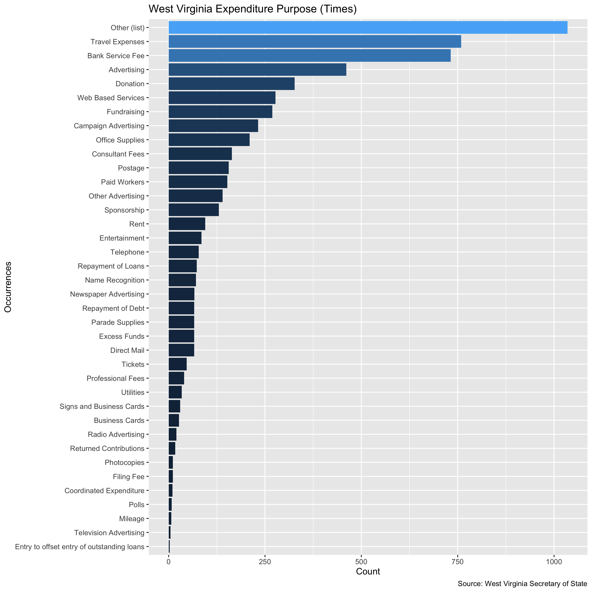
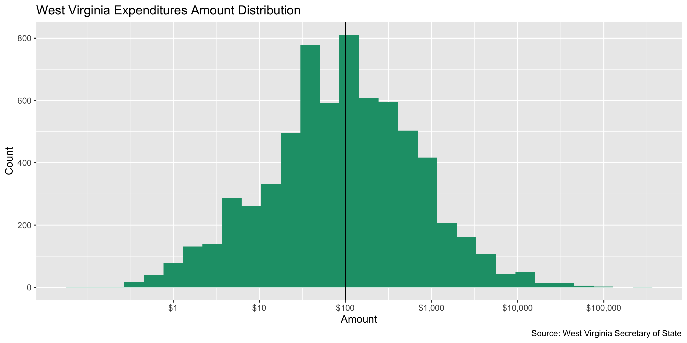
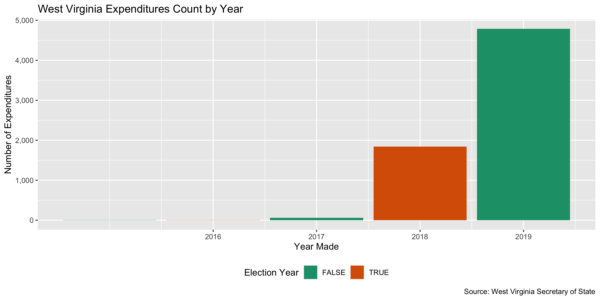
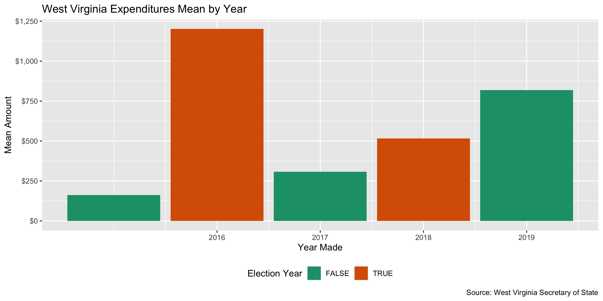
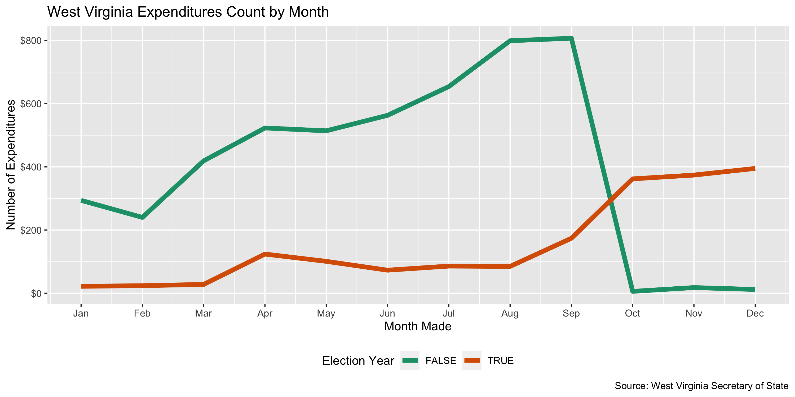
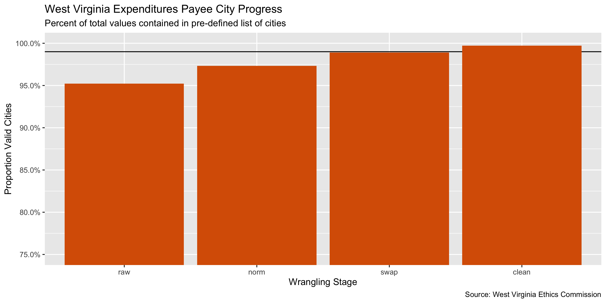
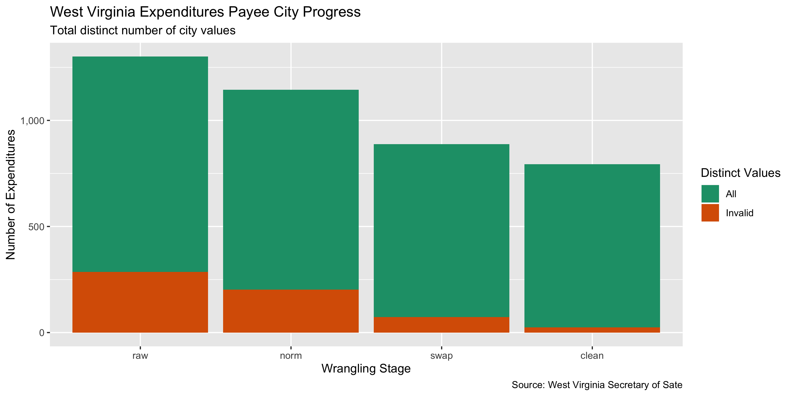

West Virginia Expenditures
================
Yanqi Xu
2023-01-26 21:35:37

- <a href="#project" id="toc-project">Project</a>
- <a href="#objectives" id="toc-objectives">Objectives</a>
- <a href="#packages" id="toc-packages">Packages</a>
- <a href="#data" id="toc-data">Data</a>
- <a href="#import" id="toc-import">Import</a>
- <a href="#explore" id="toc-explore">Explore</a>
- <a href="#wrangle" id="toc-wrangle">Wrangle</a>
- <a href="#conclude" id="toc-conclude">Conclude</a>
- <a href="#export" id="toc-export">Export</a>

<!-- Place comments regarding knitting here -->

## Project

The Accountability Project is an effort to cut across data silos and
give journalists, policy professionals, activists, and the public at
large a simple way to search across huge volumes of public data about
people and organizations.

Our goal is to standardizing public data on a few key fields by thinking
of each dataset row as a transaction. For each transaction there should
be (at least) 3 variables:

1.  All **parties** to a transaction
2.  The **date** of the transaction
3.  The **amount** of money involved

## Objectives

This document describes the process used to complete the following
objectives:

1.  How many records are in the database?
2.  Check for duplicates
3.  Check ranges
4.  Is there anything blank or missing?
5.  Check for consistency issues
6.  Create a five-digit ZIP Code called `ZIP5`
7.  Create a `YEAR` field from the transaction date
8.  Make sure there is data on both parties to a transaction

## Packages

The following packages are needed to collect, manipulate, visualize,
analyze, and communicate these results. The `pacman` package will
facilitate their installation and attachment.

The IRW’s `campfin` package will also have to be installed from GitHub.
This package contains functions custom made to help facilitate the
processing of campaign finance data.

``` r
if (!require("pacman")) install.packages("pacman")
pacman::p_load_current_gh("irworkshop/campfin")
pacman::p_load(
  stringdist, # levenshtein value
  RSelenium, # remote browser
  tidyverse, # data manipulation
  lubridate, # datetime strings
  tidytext, # text analysis
  magrittr, # pipe opperators
  janitor, # dataframe clean
  refinr, # cluster and merge
  scales, # format strings
  rvest, # scrape html pages
  knitr, # knit documents
  vroom, # read files fast
  glue, # combine strings
  here, # relative storage
  fs # search storage 
)
```

This document should be run as part of the `R_campfin` project, which
lives as a sub-directory of the more general, language-agnostic
[`irworkshop/accountability_datacleaning`](https://github.com/irworkshop/accountability_datacleaning "TAP repo")
GitHub repository.

The `R_campfin` project uses the [RStudio
projects](https://support.rstudio.com/hc/en-us/articles/200526207-Using-Projects "Rproj")
feature and should be run as such. The project also uses the dynamic
`here::here()` tool for file paths relative to *your* machine.

``` r
# where dfs this document knit?
here::here()
#> [1] "/Users/yanqixu/code/accountability_datacleaning"
```

## Data

Data is obtained from the [West Virginia Secretary of State’s Campaign
Finance Reporting System](https://cfrs.wvsos.gov/#/index).

West Virginia SOS’s instructions on data entry for filers: \>Enter each
expenditure during the reporting period during which the expense was
incurred, even if the campaign has not paid the bill, or has paid only a
portion of the bill. Paid bills If the expense is both incurred and paid
in the same reporting period, follow these steps: 1. Enter the date
payment was made and the amount of the expenditure. 2. Enter the name of
business or person to whom payment was made. 3. Enter an appropriate
description for the purpose. Unpaid bills If the expense is incurred in
the filing period but has not yet been paid, follow these steps: 1.
Enter the date expense was incurred and the amount owed. 2. Enter the
name of business or person to whom payment is owed and remains unpaid.
3. Enter the appropriate description of the purpose of the expense
incurred. Paying unpaid bills from previous reporting periods If the
expense was incurred in a previous filing period and listed as an unpaid
debt, and has now been paid, follow these steps: 1. List the name and
purpose the same way as an unpaid bill. 2. Enter the date the payment
was made and the amount of the payment.

For filing requirements about candidacy: \> The online Campaign Finance
Reporting System (CFRS) is mandatory for candidates and political action
committees required to file with the Secretary of State. Candidates for
the offices listed below are required to file reports electronically
utilizing CFRS: 1. Governor 2. Secretary of State 3. Attorney General 4.
Auditor 5. Treasurer 6. Commissioner of Agriculture 7. State Senate 8.
House of Delegates 9. Supreme Court of Appeals 10. Circuit and family
court judge

Their data can be downloaded as anual files on their [data download
page](https://cfrs.wvsos.gov/#/dataDownload). At the time of this
writing, the data available for expenditures are from 2018 to 2022. It
also comes with the \[Expenditures File Layout\]
[05](https://cfrs.wvsos.gov/CFIS_APIService/Template/KeyDownloads/Expenditures%20File%20Layout%20Key.pdf)

## Import

We can import each file into R as a single data frame to be explored,
wrangled, and exported as a single file to be indexed on the TAP
database.

### Download

We can select the year for expenditure data download. We can automate
this process with the RSelenium package.

``` r
raw_dir <- here("state","wv", "expends", "data", "raw")
dir_create(raw_dir)
```

``` r
# Use the url to access files
wv_exp_urls <- glue("https://cfrs.wvsos.gov/CFIS_APIService/api/DataDownload/GetCSVDownloadReport?year={2019:2022}&transactionType=EXP&reportFormat=csv&fileName=EXP_{2019:2022}.csv")

if (!all_files_new(raw_dir)) {
  for (url in wv_exp_urls) {
    download.file(
      url = url,
      destfile = glue("{raw_dir}/{str_sub(url,-12,-1)}")
    )
  }
}
```

### Read

We can read each file as a data frame into a list of data frames by
`read_delim`. Remember to pay attention to the date the files were last
modified. It gives us an idea of how current the data
was.`file.info(dir_ls(raw_dir, glob = "*.csv$"))$mtime`. This data is
extracted from the West Virginia Campaign Finance database as it existed
as of 2022-10-31 21:49:38 for EXP_2019.csv and 2022-10-31 21:50:00 for
EXP_2020.csv.

``` r
wv_names <- read_names(dir_ls(
    path = raw_dir,
    glob = "*.csv"
  )[1])

wv <-
  dir_ls(
    path = raw_dir,
    glob = "*.csv"
  ) %>%
 read_lines() %>% 
  str_replace_all("(?<=\\s)\"|\"(?=\")|\"(?=\\s)","'") %>% I() %>% 
    read_delim(delim = ",", escape_double = FALSE,
    skip = 1,
    col_names = wv_names,
      escape_backslash = TRUE,
    col_types = cols(
      .default = col_character(),
      `Expenditure Amount` = col_number(), 
      `Expenditure Date` = col_date("%m/%d/%Y %I:%M:%S %p"),
      `Filed Date` = col_date("%m/%d/%Y %I:%M:%S %p"))) %>% clean_names()
      # `Fundraiser Event Date` = col_date("%m/%d/%Y %I:%M:%S %p"))) 
wv <- wv %>% rename(expenditure_type = expenditure_type_18,
                    expenditure_type_1 = expenditure_type_28)
```

## Explore

``` r
head(wv)
#> # A tibble: 6 × 28
#>   org_id expenditure_…¹ expendit…² last_…³ first…⁴ middl…⁵ suffix addre…⁶ addre…⁷ city  state zip  
#>   <chr>           <dbl> <date>     <chr>   <chr>   <chr>   <chr>  <chr>   <chr>   <chr> <chr> <chr>
#> 1 11               2.59 2018-10-29 Arbys   " "     " "     " "    3604 R… " "     Beck… WV    25802
#> 2 11               5.62 2018-11-02 Cookout " "     " "     " "    1346 N… " "     Beck… WV    25801
#> 3 11               5.98 2018-11-05 Captai… " "     " "     " "    551 Bl… " "     Blue… WV    24701
#> 4 11               6.34 2018-10-26 Marath… " "     " "     " "    569 Rt… " "     Fort… WV    25514
#> 5 11               7.2  2018-10-26 McDona… " "     " "     " "    796 La… " "     Gill… WV    25621
#> 6 11               7.43 2018-10-22 Bramwe… " "     " "     " "    408 Si… " "     Free… WV    24724
#> # … with 16 more variables: explanation <chr>, expenditure_id <chr>, filed_date <date>,
#> #   purpose <chr>, amended <chr>, expenditure_type <chr>, committee_type <chr>,
#> #   committee_name <chr>, candidate_name <chr>, fundraiser_event_date <chr>,
#> #   fundraiser_event_type <chr>, fundraiser_event_place <chr>, support_or_oppose <chr>,
#> #   candidate <chr>, report_name <chr>, expenditure_type_1 <chr>, and abbreviated variable names
#> #   ¹​expenditure_amount, ²​expenditure_date, ³​last_name, ⁴​first_name, ⁵​middle_name, ⁶​address1,
#> #   ⁷​address2
tail(wv)
#> # A tibble: 6 × 28
#>   org_id expenditure_…¹ expendit…² last_…³ first…⁴ middl…⁵ suffix addre…⁶ addre…⁷ city  state zip  
#>   <chr>           <dbl> <date>     <chr>   <chr>   <chr>   <chr>  <chr>   <chr>   <chr> <chr> <chr>
#> 1 161243           225  2022-08-29 Camp S… " "     " "     " "    200 Ma… " "     Spen… WV    25276
#> 2 161243          1121. 2022-09-20 Roane … " "     " "     " "    200 Ho… " "     Spen… WV    25276
#> 3 162169            50  2022-08-01 Maynard "Angel… " "     " "    525 Bu… " "     HUNT… WV    25704
#> 4 162169           148. 2022-10-07 Bulldo… " "     " "     " "    1427 C… " "     Keno… WV    25530
#> 5 162169           203. 2022-08-03 Scaggs… " "     " "     " "    1035 A… " "     Hunt… WV    25704
#> 6 162169           500  2022-08-26 Grace … " "     " "     " "    196 Ce… " "     Fort… WV    25514
#> # … with 16 more variables: explanation <chr>, expenditure_id <chr>, filed_date <date>,
#> #   purpose <chr>, amended <chr>, expenditure_type <chr>, committee_type <chr>,
#> #   committee_name <chr>, candidate_name <chr>, fundraiser_event_date <chr>,
#> #   fundraiser_event_type <chr>, fundraiser_event_place <chr>, support_or_oppose <chr>,
#> #   candidate <chr>, report_name <chr>, expenditure_type_1 <chr>, and abbreviated variable names
#> #   ¹​expenditure_amount, ²​expenditure_date, ³​last_name, ⁴​first_name, ⁵​middle_name, ⁶​address1,
#> #   ⁷​address2
glimpse(sample_frac(wv))
#> Rows: 58,113
#> Columns: 28
#> $ org_id                 <chr> "2050", "44521", "17185", "132881", "112", "1891", "52588", "1967"…
#> $ expenditure_amount     <dbl> 11.00, 3000.00, 15.00, 600.00, 1000.00, 25.68, 97.69, 100.00, 1000…
#> $ expenditure_date       <date> 2021-09-13, 2020-10-11, 2022-09-30, 2022-02-18, 2020-08-05, 2021-…
#> $ last_name              <chr> "Fifth Third Bank", "The Riggs Corporation", "Amalgamated Bank", "…
#> $ first_name             <chr> " ", " ", " ", " ", " ", " ", " ", "Carl", " ", "Dianna", " ", " "…
#> $ middle_name            <chr> " ", " ", " ", " ", " ", " ", " ", "R.", " ", " ", " ", " ", " ", …
#> $ suffix                 <chr> " ", " ", " ", " ", " ", " ", " ", " ", " ", " ", " ", " ", " ", "…
#> $ address1               <chr> "21 E STATE STREET", "106 Capitol Street", "1825 K Street, NW", "2…
#> $ address2               <chr> " ", " ", " ", " ", " ", " ", " ", " ", " ", " ", " ", " ", " ", "…
#> $ city                   <chr> "COLUMBUS", "Charleston", "Washington", "Beckley", "Charleston", "…
#> $ state                  <chr> "OH", "WV", "WV", "WV", "WV", "CA", "CA", "WV", "WV", "WV", "CA", …
#> $ zip                    <chr> "43215", "25301", "20006", "25801", "25301", "94043", "94025", "26…
#> $ explanation            <chr> " ", " ", " ", " ", " ", " ", " ", " ", " ", " ", " ", " ", " ", "…
#> $ expenditure_id         <chr> "318328", "282652", "399573", "345165", "245386", "309564", "30532…
#> $ filed_date             <date> 2022-01-05, 2020-10-23, 2022-10-06, 2022-04-01, 2020-10-07, 2021-…
#> $ purpose                <chr> "Bank Service Fee", "Rent", "Bank Service Fee", "Tickets", "Donati…
#> $ amended                <chr> "N", "N", "N", "N", "N", "N", "N", "N", "N", "N", "N", "N", "N", "…
#> $ expenditure_type       <chr> "Expenditures", "Expenditures", "Expenditures", "Expenditures", "E…
#> $ committee_type         <chr> "State Political Action Committee", "State Candidate", "Independen…
#> $ committee_name         <chr> "SEIU District 1199 PAC", "Committee to Reelect Jim Justice", "Wes…
#> $ candidate_name         <chr> NA, "Justice, James C., II", NA, "Poling, Kase", "Miller, Rodney A…
#> $ fundraiser_event_date  <chr> NA, NA, NA, NA, NA, NA, NA, NA, NA, NA, NA, NA, NA, NA, NA, NA, NA…
#> $ fundraiser_event_type  <chr> NA, NA, NA, NA, NA, NA, NA, NA, NA, NA, NA, NA, NA, NA, NA, NA, NA…
#> $ fundraiser_event_place <chr> NA, NA, NA, NA, NA, NA, NA, NA, NA, NA, NA, NA, NA, NA, NA, NA, NA…
#> $ support_or_oppose      <chr> NA, NA, NA, NA, NA, NA, NA, NA, NA, NA, NA, NA, NA, NA, NA, NA, NA…
#> $ candidate              <chr> NA, NA, NA, NA, NA, NA, NA, NA, NA, NA, NA, NA, NA, NA, NA, NA, NA…
#> $ report_name            <chr> "2021 3rd Quarter Report", "2020 General Report", "2022 3rd Quarte…
#> $ expenditure_type_1     <chr> "Monetary", "Monetary", "Monetary", "Monetary", "Disbursement of E…
```

### Missing

``` r
col_stats(wv, count_na)
#> # A tibble: 28 × 4
#>    col                    class      n         p
#>    <chr>                  <chr>  <int>     <dbl>
#>  1 org_id                 <chr>      0 0        
#>  2 expenditure_amount     <dbl>      3 0.0000516
#>  3 expenditure_date       <date>     3 0.0000516
#>  4 last_name              <chr>    527 0.00907  
#>  5 first_name             <chr>      0 0        
#>  6 middle_name            <chr>      0 0        
#>  7 suffix                 <chr>      0 0        
#>  8 address1               <chr>     14 0.000241 
#>  9 address2               <chr>      0 0        
#> 10 city                   <chr>     13 0.000224 
#> 11 state                  <chr>      1 0.0000172
#> 12 zip                    <chr>      8 0.000138 
#> 13 explanation            <chr>      1 0.0000172
#> 14 expenditure_id         <chr>      1 0.0000172
#> 15 filed_date             <date>     4 0.0000688
#> 16 purpose                <chr>      0 0        
#> 17 amended                <chr>      1 0.0000172
#> 18 expenditure_type       <chr>      1 0.0000172
#> 19 committee_type         <chr>      1 0.0000172
#> 20 committee_name         <chr>    540 0.00929  
#> 21 candidate_name         <chr>  20490 0.353    
#> 22 fundraiser_event_date  <chr>  56519 0.973    
#> 23 fundraiser_event_type  <chr>  56660 0.975    
#> 24 fundraiser_event_place <chr>  56655 0.975    
#> 25 support_or_oppose      <chr>  55108 0.948    
#> 26 candidate              <chr>  55115 0.948    
#> 27 report_name            <chr>    143 0.00246  
#> 28 expenditure_type_1     <chr>   1930 0.0332
```

There are very few records missing one of the key values needed to
identify a transaction (who, what, when). The`last_name`,
`middle_name`,`first_name` and `suffix`variables are used to identify
individual payees, while non-individuals were identified in the
`last_name` column. We can flag any record with `campfin::flag_na()` to
create a new `na_flag` variable with value `TRUE` for any record missing
*any* of those key variables.

``` r
wv <- wv %>%  
  flag_na(
    last_name,
    committee_name,
    expenditure_date,
    expenditure_amount
  )

sum(wv$na_flag)
#> [1] 1061
```

### Previous update

We will eliminate rows whose ID appeared in the previous update.

``` r
wv_prev <- read_csv(here("state","wv","expends","data", "previous") %>% dir_ls())
nrow(wv)
#> [1] 58113
wve <- wv %>% filter(expenditure_id %out% wv_prev$expenditure_id)

nrow(wve)
#> [1] 53826
```

### Duplicates

We can use `campfin::flag_dupes()` to create a new `dupe_flag` variable
with with value `TRUE` for any duplicate row, after the first occurance.
variable.

``` r
wve <- flag_dupes(wve, dplyr::everything())
sum(wve$dupe_flag)
#> [1] 3
percent(mean(wve$dupe_flag))
#> [1] "0%"
```

### Categorical

``` r
col_stats(wve, n_distinct)
#> # A tibble: 30 × 4
#>    col                    class      n         p
#>    <chr>                  <chr>  <int>     <dbl>
#>  1 org_id                 <chr>   1230 0.0229   
#>  2 expenditure_amount     <dbl>  15496 0.288    
#>  3 expenditure_date       <date>  1424 0.0265   
#>  4 last_name              <chr>   9317 0.173    
#>  5 first_name             <chr>   1281 0.0238   
#>  6 middle_name            <chr>    204 0.00379  
#>  7 suffix                 <chr>      8 0.000149 
#>  8 address1               <chr>  10917 0.203    
#>  9 address2               <chr>    472 0.00877  
#> 10 city                   <chr>   1832 0.0340   
#> 11 state                  <chr>     61 0.00113  
#> 12 zip                    <chr>   1920 0.0357   
#> 13 explanation            <chr>     11 0.000204 
#> 14 expenditure_id         <chr>  53811 1.00     
#> 15 filed_date             <date>   482 0.00895  
#> 16 purpose                <chr>     45 0.000836 
#> 17 amended                <chr>      3 0.0000557
#> 18 expenditure_type       <chr>      9 0.000167 
#> 19 committee_type         <chr>      6 0.000111 
#> 20 committee_name         <chr>   1062 0.0197   
#> 21 candidate_name         <chr>    763 0.0142   
#> 22 fundraiser_event_date  <chr>    351 0.00652  
#> 23 fundraiser_event_type  <chr>    215 0.00399  
#> 24 fundraiser_event_place <chr>    437 0.00812  
#> 25 support_or_oppose      <chr>      6 0.000111 
#> 26 candidate              <chr>    418 0.00777  
#> 27 report_name            <chr>     58 0.00108  
#> 28 expenditure_type_1     <chr>     23 0.000427 
#> 29 na_flag                <lgl>      2 0.0000372
#> 30 dupe_flag              <lgl>      2 0.0000372
```

<!-- -->

### Continuous

For continuous variables, we should explore both the range and
distribution. This can be done with visually with
`ggplot2::geom_histogram()` and `ggplot2::geom_violin()`.

#### Amounts

``` r
summary(wve$expenditure_amount)
#>      Min.   1st Qu.    Median      Mean   3rd Qu.      Max.      NA's 
#>       0.0      29.0     139.8    1114.4     500.0 1000000.0         3
sum(wve$expenditure_amount <= 0, na.rm = TRUE)
#> [1] 0
sum(wve$expenditure_amount >= 100000, na.rm = TRUE)
#> [1] 59
```

<!-- -->

<!-- -->

of `amount` values are zero.

``` r
sum(wve$expenditure_amount < 0, na.rm = TRUE)
#> [1] 0
sum(wve$expenditure_amount == 0, na.rm = TRUE)
#> [1] 0
```

#### Dates

``` r

wve <- wve %>% mutate(expenditure_date = as.Date(expenditure_date,format = "%m/%d/%Y"))
wve <- wve %>% mutate(year = year(expenditure_date))
```

The range of expenditure dates seem reasonable.

``` r
count_na(wve$expenditure_date)
#> [1] 3
min(wve$expenditure_date, na.rm = TRUE)
#> [1] "2015-10-24"
max(wve$expenditure_date, na.rm = TRUE)
#> [1] "2022-10-23"
sum(wve$expenditure_date > today(), na.rm = TRUE)
#> [1] 0
```

``` r
count(wve, year)
#> # A tibble: 9 × 2
#>    year     n
#>   <dbl> <int>
#> 1  2015     3
#> 2  2016    29
#> 3  2017    50
#> 4  2018   198
#> 5  2019  5132
#> 6  2020 26357
#> 7  2021  4844
#> 8  2022 17210
#> 9    NA     3
```

<!-- -->

<!-- -->

<!-- -->

<!-- -->

## Wrangle

We should use the `campfin::normal_*()` functions to perform some basic,
high-confidence text normalization to improve the searchability of the
database.

### Address

First, we will normalize the street address by removing punctuation and
expanding abbreviations.

``` r
  wve <- wve %>% 
    unite( col = address_full,c("address1", "address2"), sep = ", ", remove = FALSE, na.rm = TRUE) %>% 
    mutate(address_norm = normal_address(
      address = address_full,
      abbs = usps_city,
      na_rep = TRUE
    ))
```

We can see how this improves consistency across the `address_1` and
`address_2` fields.

    #> # A tibble: 10 × 4
    #>    address_full               address1              address2    address_norm          
    #>    <chr>                      <chr>                 <chr>       <chr>                 
    #>  1 "95 Eddy Road, Suite 101"  95 Eddy Road          "Suite 101" 95 EDDY ROAD SUITE 101
    #>  2 "PO Box 5,  "              PO Box 5              " "         PO BOX 5              
    #>  3 "1617 W. King St.,  "      1617 W. King St.      " "         1617 W KING ST        
    #>  4 "1251 Earl Core Rd.,  "    1251 Earl Core Rd.    " "         1251 EARL CORE RD     
    #>  5 "90 BU Drive,  "           90 BU Drive           " "         90 BU DRIVE           
    #>  6 "2145 Eastern Avenue,  "   2145 Eastern Avenue   " "         2145 EASTERN AVENUE   
    #>  7 "319 South West Street,  " 319 South West Street " "         319 SOUTH WEST STREET 
    #>  8 "1 Saarinen Circle,  "     1 Saarinen Circle     " "         1 SAARINEN CIRCLE     
    #>  9 "510 Townsend St,  "       510 Townsend St       " "         510 TOWNSEND ST       
    #> 10 "300 Postal Plaza,  "      300 Postal Plaza      " "         300 POSTAL PLAZA

### ZIP

The `zip` address is already pretty good, with 90% of the values already
in our 95% comprehensive `valid_zip` list.

``` r
n_distinct(wve$zip)
#> [1] 1920
prop_in(wve$zip, valid_zip)
#> [1] 0.8970848
length(setdiff(wve$zip, valid_zip))
#> [1] 283
```

We can improve this further by lopping off the uncommon four-digit
extensions and removing common invalid codes like 00000 and 99999.

``` r
wve <- wve %>% 
  mutate(
    zip_norm = normal_zip(
      zip = zip,
      na_rep = TRUE
    )
  )
```

This brings our valid percentage to 99%.

``` r
n_distinct(wve$zip_norm)
#> [1] 1752
prop_in(wve$zip_norm, valid_zip)
#> [1] 0.9940838
length(setdiff(wve$zip_norm, valid_zip))
#> [1] 96
count_na(wve$zip_norm) - count_na(wve$zip)
#> [1] 3789
```

### State

The `state` variable is also very clean, already at 93%.

``` r
n_distinct(wve$state)
#> [1] 61
prop_in(wve$state, valid_state, na.rm = TRUE)
#> [1] 0.9298096
length(setdiff(wve$state, valid_state))
#> [1] 11
setdiff(wve$state, valid_state)
#>  [1] "wV"    "  "    "State" "wv"    "Wv"    "dc"    "ky"    NA      "ON"    "NB"    "BC"
```

``` r
wve$state <- toupper(wve$state)
```

“NL” and “ON” are overseas country or state shorthands which we can
keep.

``` r
n_distinct(wve$state)
#> [1] 56
prop_in(wve$state, valid_state)
#> [1] 0.9318346
```

### City

The `city` value is the hardest to normalize. We can use a four-step
system to functionally improve the searchablity of the database.

1.  **Normalize** the raw values with `campfin::normal_city()`
2.  **Match** the normal values with the *expected* value for that ZIP
    code
3.  **Swap** the normal values with the expected value if they are
    *very* similar
4.  **Second CIty Match** match the cities that start with the same
    letter and is reviewed manually

``` r
wve <- wve %>% rename(city_raw = city)
```

The raw `city` values are not very normal, with only 2% already in
`valid_city`, mostly due to case difference. If we simply convert to
uppcase that numbers increases to 87%. We will aim to get this number
over 99% using the other steps in the process.

``` r
n_distinct(wve$city_raw)
#> [1] 1832
prop_in(str_to_upper(wve$city_raw), valid_city, na.rm = TRUE)
#> [1] 0.8727259
length(setdiff(wve$city_raw, valid_city))
#> [1] 1663
count_na(wve$city_raw)
#> [1] 13
```

#### Normalize

``` r
wve <- wve %>% 
  mutate(
    city_norm = normal_city(
      city = city_raw, 
       abbs = usps_city,
       states = c(valid_state),
      na = invalid_city,
      na_rep = TRUE
    )
  )
```

This process brought us to 95% valid.

``` r
n_distinct(wve$city_norm)
#> [1] 1445
prop_in(wve$city_norm, valid_city, na.rm = TRUE)
#> [1] 0.9453181
length(setdiff(wve$city_norm, valid_city))
#> [1] 378
count_na(wve$city_norm)
#> [1] 3718
```

It also increased the proportion of `NA` values by 7%. These new `NA`
values were either a single (possibly repeating) character, or contained
in the `na_city` vector.

    #> # A tibble: 16 × 4
    #>    zip_norm state city_raw  city_norm
    #>    <chr>    <chr> <chr>     <chr>    
    #>  1 <NA>     "PA"  "Online"  <NA>     
    #>  2 25302    "WV"  "none"    <NA>     
    #>  3 26301    "WV"  "N/A"     <NA>     
    #>  4 25035    "WV"  "25035"   <NA>     
    #>  5 25303    "WV"  "n/a"     <NA>     
    #>  6 24946    "WV"  " "       <NA>     
    #>  7 25526    "WV"  "UNKNOWN" <NA>     
    #>  8 26588    "CA"  "Online"  <NA>     
    #>  9 <NA>     "WV"  "Unknown" <NA>     
    #> 10 24901    "WV"  "Unknown" <NA>     
    #> 11 25301    "WV"  "N/A"     <NA>     
    #> 12 <NA>     "WV"  "N/A"     <NA>     
    #> 13 <NA>     "  "  " "       <NA>     
    #> 14 <NA>     "WV"  "Online"  <NA>     
    #> 15 25701    "WV"  "H"       <NA>     
    #> 16 12345    "WV"  "Unknown" <NA>

#### Swap

Then, we will compare these normalized `city_norm` values to the
*expected* city value for that vendor’s ZIP code. If the [levenshtein
distance](https://en.wikipedia.org/wiki/Levenshtein_distance) is less
than 3, we can confidently swap these two values.

``` r
wve <- wve %>% 
  left_join(
    y = zipcodes,
    by = c(
      "state" = "state",
      "zip_norm" = "zip"
    )
  ) %>% 
  rename(city_match = city) %>% 
  mutate(
    match_dist = stringdist(city_norm, city_match),
city_swap = if_else(condition = is.na(city_match) == FALSE,
                        if_else(
      condition = match_dist <= 2,
      true = city_match,
      false = city_norm
    ),
      false = city_norm
  ))
```

This is a very fast way to increase the valid proportion to 96% and
reduce the number of distinct *invalid* values from 378 to only 157

``` r
n_distinct(wve$city_swap)
#> [1] 1230
prop_in(wve$city_swap, valid_city, na.rm = TRUE)
#> [1] 0.960625
length(setdiff(wve$city_swap, valid_city))
#> [1] 157
```

#### Second Match

``` r
wv_match_table <- wve %>% 
  filter(str_sub(wve$city_swap, 1,1) == str_sub(wve$city_match, 1,1)) %>% 
  filter(city_swap %out% valid_city)  %>% 
  mutate(string_dis = stringdist(city_raw, city_match)) %>% 
  select (expenditure_id, zip, state, city_raw, city_swap, city_match, string_dis) %>% 
  distinct() %>% 
  add_count(city_match) %>% 
  rename("sec_city_match" = "city_match")
```

We can revert `city_swap` back to the `city_match` values in the match
table resulting from misspellings.

``` r
wve<- wv_match_table %>% select(expenditure_id, sec_city_match) %>% right_join(wve, by = "expenditure_id")
```

This brings us to 98% valid values.

``` r
n_distinct(wve$sec_city_match)
#> [1] 31
prop_in(wve$sec_city_match, valid_city, na.rm = TRUE)
#> [1] 1
length(setdiff(wve$sec_city_match, valid_city))
#> [1] 1
```

#### Progress

We can make very few manual changes to capture the last few big invalid
values. Local city abbreviations (e.g., SPFD) often need to be changed
by hand.

``` r
wve <- wve %>% 
  mutate(
    city_clean = coalesce(sec_city_match, city_swap)) 


wve %>%
  filter(city_clean %out% valid_city) %>% 
  count(state, city_clean, sort = TRUE) %>% 
  drop_na(city_clean)
#> # A tibble: 105 × 3
#>    state city_clean                  n
#>    <chr> <chr>                   <int>
#>  1 CA    SAN FRANSICO               78
#>  2 CA    PLAYA VISTA                28
#>  3 MA    WEST SOMERVILLE            23
#>  4 CA    ALMADEN BOULEVARD SUITE    22
#>  5 WV    ONLINE ORDERED             22
#>  6 MA    SOMMERVILLE                18
#>  7 CA    MELO PARK                  17
#>  8 WA    NORTH SEATTLE              17
#>  9 WV    STONEWOOD                  17
#> 10 OH    MES TOWNSHIP               13
#> # … with 95 more rows
```

``` r
wve$city_clean <- wve$city_clean %>% 
      str_replace_all("^BARBOUSVILLE$", "BARBOURSVILLE") %>% 
      str_replace_all("^SAN\\sFRANSICO$", "SAN FRANCISCO") %>% 
      str_replace_all("^BUCHANNAN$", "BUCKHANNON") %>% 
      str_replace_all("^CHARSLETON$", "CHARLESTON") %>% 
      str_replace_all("^MOUNT\\sCLAIRE$", "MOUNT CLARE") %>% 
      str_replace_all("^SYMMONS\\sTOWNSHIP$|^MES\\sTOWNSHIP$", "SYMMES TOWNSHIP") %>% 
      str_replace_all("^GALLAGER$", "GALLAGHER") %>% 
      str_replace_all("^MES\\sTOWNSHIP$", "SYMMES TOWNSHIP") %>% 
      str_replace_all("^WEST\\sCOMERVILLE$|^SOMMERVILLE$|^SOMERVILEE$", "SOMERVILLE") %>% 
      str_replace_all("^CHARSLETON$", "CHARLESTON") %>% 
      str_replace_all("^OAH\\sHILL$", "OAK HILL") %>% 
      str_replace_all("^LICOLN$", "LINCOLN") %>% 
      str_replace_all("^GREENBAG ROAD$", "MORGANTOWN") %>% 
      str_replace_all("^FARILEA$", "FAIRLEA") %>% 
      str_replace_all("^\\| SOMERVILLE$", "SOMERVILLE") %>% 
      str_replace_all("WELLSSBURG", "WELLSBURG") %>% 
      str_replace_all("^MENTO\\sPARK$", "MENLO PARK") %>% 
      str_replace_all("^LEXENTON$", "LEXINGTON") %>% 
      str_replace_all("^LOISVILLE$", "LOUISVILLE") %>% 
      str_replace_all("^SHEPERDSTOEN$", "SHEPHERDSTOWN") %>% 
      str_replace_all("^CAMERSON$", "CAMERON") %>% 
      str_replace_all("AMAZON", "ONLINE PURCHASE") %>% 
      na_if("CITY")
      
  wve <- wve %>% mutate(city_clean = case_when( city_clean %in% c("WV","WEB BASED","A","PO BOX","ANYWHERE USA","VARIES","COUNTY") ~ NA_character_, TRUE ~ as.character(city_clean)))
  
```

By adding a dozen popular West Virginia cities to our `valid_city` list,
we can reach our 99% goal.

``` r
valid_city <- c(
  valid_city,
  "OVERLAND",
  "OVERLAND PARK",
  "RAYTOWN",
  "NORTH KANSAS CITY",
  "PRAIRIE VILLAGE",
  "UNIVERSITY CITY",
  "WEBSTER GROVES",
  "RICHMOND HEIGHTS",
  "LENEXA",
  "STE GENEVIEVE",
  "LEAWOOD",
  "DES PERES",
  "OLIVETTE",
  "TOWN AND COUNTRY",
  "AFFTON"
)
```

Still, our progress is significant without having to make a single
manual or unconfident change. The percent of valid cities increased from
89% to 99%. The number of total distinct city values decreased from
1,551 to 1,188. The number of distinct invalid city names decreased from
477 to only 96, a change of 80%.

| Normalization Stage | Percent Valid | Total Distinct | Unique Invalid |
|:--------------------|--------------:|---------------:|---------------:|
| raw                 |        0.8884 |           1551 |            477 |
| norm                |        0.9630 |           1445 |            365 |
| swap                |        0.9783 |           1230 |            144 |
| clean               |        0.9930 |           1188 |             96 |

<!-- -->

<!-- -->

## Conclude

1.  There are 53826 records in the database.
2.  There are 3 duplicate records in the database.
3.  The range and distribution of `amount` seems reasomable, and `date`
    has been cleaned by removing 0 values from the distance past or
    future.
4.  There are 862 records missing either recipient or date.
5.  Consistency in geographic data has been improved with
    `campfin::normal_*()`.
6.  The 5-digit `zip_norm` variable has been created with
    `campfin::normal_zip()`.
7.  The 4-digit `year_clean` variable has been created with
    `lubridate::year()`.

## Export

``` r
proc_dir <- here("state","wv", "expends", "data", "processed")
dir_create(proc_dir)
```

``` r
wve %>% 
  select(
    -city_norm,
    -city_match,
    -city_swap,
    -match_dist,
    -sec_city_match
  ) %>% 
  write_csv(
    path = glue("{proc_dir}/wv_expends_clean_20221031.csv"),
    na = ""
  )
```
