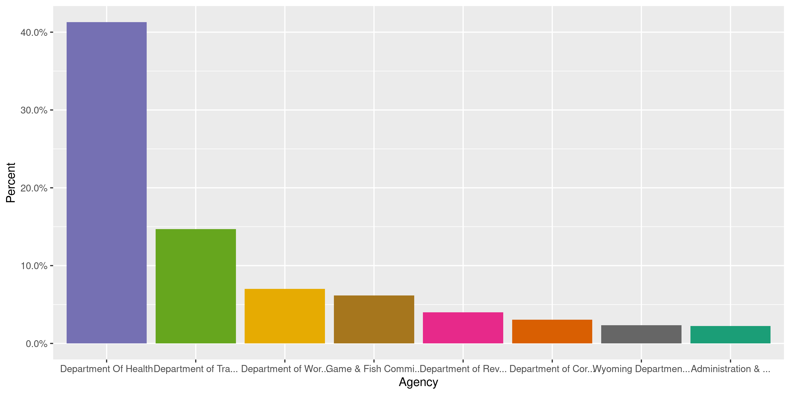
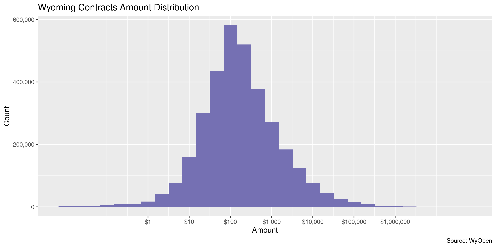
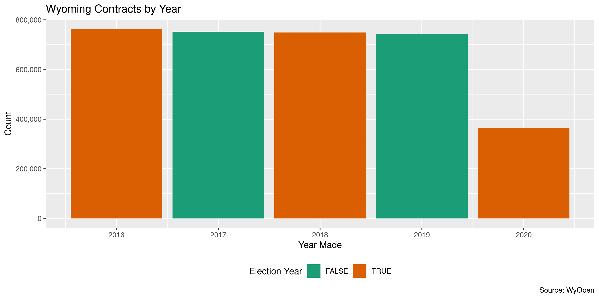

Wyoming Contracts
================
Kiernan Nicholls
2020-07-03 18:15:06

  - [Project](#project)
  - [Objectives](#objectives)
  - [Packages](#packages)
  - [Data](#data)
  - [Download](#download)
  - [Read](#read)
  - [Explore](#explore)
  - [Wrangle](#wrangle)
  - [Conclude](#conclude)
  - [Export](#export)
  - [Upload](#upload)
  - [Dictionary](#dictionary)

<!-- Place comments regarding knitting here -->

## Project

The Accountability Project is an effort to cut across data silos and
give journalists, policy professionals, activists, and the public at
large a simple way to search across huge volumes of public data about
people and organizations.

Our goal is to standardizing public data on a few key fields by thinking
of each dataset row as a transaction. For each transaction there should
be (at least) 3 variables:

1.  All **parties** to a transaction.
2.  The **date** of the transaction.
3.  The **amount** of money involved.

## Objectives

This document describes the process used to complete the following
objectives:

1.  How many records are in the database?
2.  Check for entirely duplicated records.
3.  Check ranges of continuous variables.
4.  Is there anything blank or missing?
5.  Check for consistency issues.
6.  Create a five-digit ZIP Code called `zip`.
7.  Create a `year` field from the transaction date.
8.  Make sure there is data on both parties to a transaction.

## Packages

The following packages are needed to collect, manipulate, visualize,
analyze, and communicate these results. The `pacman` package will
facilitate their installation and attachment.

The IRW’s `campfin` package will also have to be installed from GitHub.
This package contains functions custom made to help facilitate the
processing of campaign finance data.

``` r
if (!require("pacman")) install.packages("pacman")
pacman::p_load_gh("irworkshop/campfin")
pacman::p_load(
  tidyverse, # data manipulation
  lubridate, # datetime strings
  gluedown, # printing markdown
  magrittr, # pipe operators
  janitor, # clean data frames
  refinr, # cluster and merge
  scales, # format strings
  knitr, # knit documents
  vroom, # read files fast
  rvest, # html scraping
  glue, # combine strings
  here, # relative paths
  httr, # http requests
  fs # local storage 
)
```

This document should be run as part of the `R_campfin` project, which
lives as a sub-directory of the more general, language-agnostic
[`irworkshop/accountability_datacleaning`](https://github.com/irworkshop/accountability_datacleaning)
GitHub repository.

The `R_campfin` project uses the [RStudio
projects](https://support.rstudio.com/hc/en-us/articles/200526207-Using-Projects)
feature and should be run as such. The project also uses the dynamic
`here::here()` tool for file paths relative to *your* machine.

``` r
# where does this document knit?
here::here()
#> [1] "/home/kiernan/Code/accountability_datacleaning/R_campfin"
```

## Data

Wyoming vendor payments can be obtained from the [WyOpen
portal](http://www.wyopen.gov/), which is run by the [Wyoming State
Auditor’s Office](https://sao.wyo.gov/).

> #### Welcome
> 
> WyOpen gives you easy access to State of Wyoming expenditures, so you
> can see how our state spends money. This site includes payments made
> by the State of Wyoming through the Wyoming Online Financial System
> (WOLFS) to vendors for the purchase of goods and services.
> 
> Currently, this site includes expenditure data or expenditures made by
> the State of Wyoming between January 5th 2016 through July 2nd 2020.

> #### Checkbook Data
> 
> Quarterly updates will typically be available 30 days after quarter
> end. For example, data for January, February and March will be
> uploaded and made available by April 30th.

> #### Completeness
> 
> The data presented on this website does not include all State of
> Wyoming expenditures. Confidential or sensitive data protected by
> state or federal law has been excluded. Information excluded may
> include, but is not limited to: \* Transactions that qualify as “Aid
> to Individuals” (e.g., Medicaid, Medicare) \* Refunds associated with
> assistance programs \* Expenses related to confidential law
> enforcement activities \* Subsidized adoptions; and/or foster care
> payments \* Child support recoveries collections, distributions and
> refunds \* Victim compensation claims \* Personnel and disability
> payment claims

> #### Limitations
> 
> Individual agency expenditures may not align with the agency’s final
> appropriated budget due to the removal of confidential payments and/or
> timing of expenditures and encumbrances.

## Download

We can use the [WyOpen advance search
portal](http://www.wyopen.gov/search/advanced) functionality to return
all records between two dates and export them directly as a CSV text
file.

The earliest date for data is 01/05/2016 and the latest Date is
07/02/2020. However, if we just use those two dates we get search
results for 3,612,722 payment records but trying to export those results
as a CSV text file produces an error every time:

> The requested URL was rejected. Please consult with your
> administrator.

To circumvent this problem, we are going to use the `httr::POST()` and
`httr::GET()` functions to automate searches for every month and
download those monthly results locally.

``` r
raw_dir <- dir_create(here("wy", "contracts", "data", "raw"))
```

The process to download files comes in three steps:

1.  `POST()` the form with our `startdate` and `enddate`.
2.  Note the `cookies()` the WyOpen server gives from that `POST()`.
3.  `GET()` the CSV text file containing the returned form results.

We can create a vector of month starts between our earliest and latest
days.

``` r
month_starts <- seq(
  from = mdy("01/01/2016"), 
  to = today() - days(1), 
  by = "month"
)
```

Then we loop through these months, setting that beginning of the month
as the start date and the last day of the month as the end.

``` r
if (length(dir_ls(raw_dir)) == 0) {
  for (day in month_starts) {
    day <- as_date(day)
    # search between days in month
    month_post <- POST(
      url = "http://www.wyopen.gov/search/advancedsearch",
      body = list(
        startdate = format(day, "%m/%d/%Y"),
        enddate = format(day + months(1) - days(1), "%m/%d/%Y"),
        agencyid = "",
        objectid = "",
        subobjectid = "",
        vendorname = "",
        location = "",
        MySubmit = "Search"
      )
    )
    # convert cookies to named vector
    wy_cookies <- cookies(month_post)$value
    names(wy_cookies) <- cookies(month_post)$name
    # define file name by year and month
    file_name <- glue("SearchResults-{str_sub(day, end = 7)}.csv")
    # write results as CSV locally
    GET(
      url = "http://www.wyopen.gov/search/csv",
      write_disk(path(raw_dir, file_name)),
      set_cookies(wy_cookies)
    )
    message(day)
    Sys.sleep(10)
  }
}
```

``` r
raw_info <- dir_info(raw_dir)
as_tibble(raw_info) %>% 
  select(path, size, modification_time) %>% 
  mutate(across(path, path.abbrev))
#> # A tibble: 55 x 3
#>    path                                                     size modification_time  
#>    <chr>                                             <fs::bytes> <dttm>             
#>  1 ~/wy/contracts/data/raw/SearchResults-2016-01.csv        8.4M 2020-07-03 16:21:10
#>  2 ~/wy/contracts/data/raw/SearchResults-2016-02.csv       8.27M 2020-07-03 16:21:48
#>  3 ~/wy/contracts/data/raw/SearchResults-2016-03.csv       8.36M 2020-07-03 16:22:25
#>  4 ~/wy/contracts/data/raw/SearchResults-2016-04.csv       8.62M 2020-07-03 16:23:02
#>  5 ~/wy/contracts/data/raw/SearchResults-2016-05.csv       8.36M 2020-07-03 16:23:40
#>  6 ~/wy/contracts/data/raw/SearchResults-2016-06.csv       9.25M 2020-07-03 16:24:16
#>  7 ~/wy/contracts/data/raw/SearchResults-2016-07.csv       7.93M 2020-07-03 16:24:52
#>  8 ~/wy/contracts/data/raw/SearchResults-2016-08.csv       8.79M 2020-07-03 16:25:29
#>  9 ~/wy/contracts/data/raw/SearchResults-2016-09.csv       7.53M 2020-07-03 16:26:07
#> 10 ~/wy/contracts/data/raw/SearchResults-2016-10.csv       8.65M 2020-07-03 16:26:46
#> # … with 45 more rows
```

## Read

``` r
wyc <- vroom(
  file = raw_info$path,
  num_threads = 1,
  escape_double = FALSE,
  escape_backslash = FALSE,
  col_types = cols(
    .default = col_character(),
    doccreatedt = col_date(),
    lineamount = col_double()
  )
)
```

``` r
wyc <- wyc %>%
  rename(
    date = doccreatedt,
    amount = lineamount
  )
```

## Explore

``` r
glimpse(wyc)
#> Rows: 3,373,083
#> Columns: 8
#> $ id        <chr> "1278", "425", "539", "1114", "1115", "1116", "1117", "1118", "1119", "1143", …
#> $ agency    <chr> "Department of Transportation", "Department of Transportation", "Department of…
#> $ vendor    <chr> "RI-TEC INDUSTRIAL PRODUCTS", "HASTINGS INC", "TREA. TOWN OF AFTON", "LOWER VA…
#> $ object    <chr> "Supplies", "Mtr Veh&Airplane Sup", "Municipalities", "Utilities", "Utilities"…
#> $ subobject <chr> "Products - Dot Use Only", "Mtr Veh & Arpln Supplies-Wydot", "Sales-Use Tax", …
#> $ date      <date> 2016-01-05, 2016-01-05, 2016-01-05, 2016-01-05, 2016-01-05, 2016-01-05, 2016-…
#> $ state     <chr> "GA", "WY", "WY", "WY", "WY", "WY", "WY", "WY", "WY", "WY", "WY", "WY", "WY", …
#> $ amount    <dbl> 252.00, 5.98, 81889.03, 180.62, 158.62, 86.63, 71.65, 68.53, 38.16, 37.77, 36.…
tail(wyc)
#> # A tibble: 6 x 8
#>   id     agency       vendor               object          subobject        date       state amount
#>   <chr>  <chr>        <chr>                <chr>           <chr>            <date>     <chr>  <dbl>
#> 1 49751… Game & Fish… PACIFICORP           Utilities       Electricity      2020-07-02 OR     39.5 
#> 2 49765… Department … LIV In-Home Counsel… Client/Recipie… Pay-Medical Pro… 2020-07-02 WY    506.  
#> 3 49758… Department … Bighorn Pediatric D… Client/Recipie… Pay-Medical Pro… 2020-07-02 WY     97   
#> 4 49747… Department … MEMORIAL HOSPITAL O… Client/Recipie… Pay-Medical Pro… 2020-07-02 WY     64.0 
#> 5 49747… Department … TETON COUNTY HOSPIT… Client/Recipie… Pay-Medical Pro… 2020-07-02 WY     51.9 
#> 6 49747… Department … GILLETTE MEDICAL IM… Client/Recipie… Pay-Medical Pro… 2020-07-02 WI      6.09
```

### Missing

``` r
col_stats(wyc, count_na)
#> # A tibble: 8 x 4
#>   col       class      n         p
#>   <chr>     <chr>  <int>     <dbl>
#> 1 id        <chr>      0 0        
#> 2 agency    <chr>      0 0        
#> 3 vendor    <chr>      0 0        
#> 4 object    <chr>      0 0        
#> 5 subobject <chr>      0 0        
#> 6 date      <date>     0 0        
#> 7 state     <chr>     47 0.0000139
#> 8 amount    <dbl>      0 0
```

### Duplicates

``` r
d1 <- duplicated(wyc, fromLast = FALSE)
d2 <- duplicated(wyc, fromLast = TRUE)
wyc <- mutate(wyc, dupe_flag = d1 | d2)
sum(wyc$dupe_flag)
#> [1] 0
rm(d1, d2); flush_memory()
```

``` r
wyc %>% 
  filter(dupe_flag) %>% 
  select(date, agency, amount, vendor)
#> # A tibble: 0 x 4
#> # … with 4 variables: date <date>, agency <chr>, amount <dbl>, vendor <chr>
```

### Categorical

``` r
col_stats(wyc, n_distinct)
#> # A tibble: 9 x 4
#>   col       class        n           p
#>   <chr>     <chr>    <int>       <dbl>
#> 1 id        <chr>  3373083 1          
#> 2 agency    <chr>      111 0.0000329  
#> 3 vendor    <chr>    41926 0.0124     
#> 4 object    <chr>       93 0.0000276  
#> 5 subobject <chr>      631 0.000187   
#> 6 date      <date>     899 0.000267   
#> 7 state     <chr>       66 0.0000196  
#> 8 amount    <dbl>   448655 0.133      
#> 9 dupe_flag <lgl>        1 0.000000296
```

``` r
explore_plot(wyc, agency) + scale_x_truncate()
```

<!-- -->

### Amounts

``` r
summary(wyc$amount)
#>     Min.  1st Qu.   Median     Mean  3rd Qu.     Max. 
#> -2666746       42      142     5654      568 49327783
mean(wyc$amount <= 0)
#> [1] 0.02109554
```

``` r
glimpse(wyc[which.max(wyc$amount), ])
#> Rows: 1
#> Columns: 9
#> $ id        <chr> "936448"
#> $ agency    <chr> "University of Wyoming"
#> $ vendor    <chr> "UNIVERSITY OF WYOMING"
#> $ object    <chr> "Grants"
#> $ subobject <chr> "Grants"
#> $ date      <date> 2017-02-23
#> $ state     <chr> "WY"
#> $ amount    <dbl> 49327783
#> $ dupe_flag <lgl> FALSE
```

<!-- -->

### Dates

We can add the calendar year from `date` with `lubridate::year()`

``` r
wyc <- mutate(wyc, year = year(date))
```

``` r
min(wyc$date)
#> [1] "2016-01-05"
sum(wyc$year < 2000)
#> [1] 0
max(wyc$date)
#> [1] "2020-07-02"
sum(wyc$date > today())
#> [1] 0
```

<!-- -->

## Wrangle

``` r
prop_in(wyc$state, valid_state)
#> [1] 0.9110226
```

``` r
wyc <- mutate(wyc, agency_state = "WY", .after = agency)
```

## Conclude

Before exporting, we can remove the intermediary normalization columns
and rename all added variables with the `_clean` suffix.

``` r
glimpse(sample_n(wyc, 100))
#> Rows: 100
#> Columns: 11
#> $ id           <chr> "111938", "747613", "4113915", "2054790", "174062", "1105390", "3833162", "…
#> $ agency       <chr> "Department of Environmental Quality", "Department of Revenue & Taxation", …
#> $ agency_state <chr> "WY", "WY", "WY", "WY", "WY", "WY", "WY", "WY", "WY", "WY", "WY", "WY", "WY…
#> $ vendor       <chr> "TRIHYDRO CORPORATION", "SAZERAC CO INC", "CARETRUST IV", "CAMPBELL COUNTY …
#> $ object       <chr> "Environmental Serv. Other", "Purchase For Resale", "Client/Recipient Benef…
#> $ subobject    <chr> "Operations & Maintenance", "Purchase For Resale", "Payments For Products",…
#> $ date         <date> 2016-02-19, 2016-11-28, 2019-07-18, 2018-07-12, 2016-03-17, 2017-05-11, 20…
#> $ state        <chr> "WY", "KY", "AR", "WY", "MO", "TN", "MO", "UT", "IL", "WY", "UT", "WY", "WY…
#> $ amount       <dbl> 61.50, 105.10, 50.74, 136261.64, 178.90, 97.41, 150.65, 155.98, 664.40, 108…
#> $ dupe_flag    <lgl> FALSE, FALSE, FALSE, FALSE, FALSE, FALSE, FALSE, FALSE, FALSE, FALSE, FALSE…
#> $ year         <dbl> 2016, 2016, 2019, 2018, 2016, 2017, 2019, 2018, 2017, 2017, 2018, 2020, 201…
```

1.  There are 3,373,083 records in the database.
2.  There are 0 duplicate records in the database.
3.  The range and distribution of `amount` and `date` seem reasonable.
4.  There are 0 records missing key variables.
5.  Consistency in geographic data has been improved with
    `campfin::normal_*()`.
6.  The 4-digit `year` variable has been created with
    `lubridate::year()`.

## Export

Now the file can be saved on disk for upload to the Accountability
server.

``` r
clean_dir <- dir_create(here("wy", "contracts", "data", "clean"))
clean_path <- path(clean_dir, "wy_contracts_clean.csv")
write_csv(wyc, clean_path, na = "")
file_size(clean_path)
#> 437M
file_encoding(clean_path) %>% 
  mutate(across(path, path.abbrev))
#> # A tibble: 1 x 3
#>   path                                             mime            charset 
#>   <chr>                                            <chr>           <chr>   
#> 1 ~/wy/contracts/data/clean/wy_contracts_clean.csv application/csv us-ascii
```

## Upload

Using the [duckr](https://github.com/kiernann/duckr) R package, we can
wrap around the [duck](https://duck.sh/) command line tool to upload the
file to the IRW server.

``` r
# remotes::install_github("kiernann/duckr")
s3_dir <- "s3:/publicaccountability/csv/"
s3_path <- path(s3_dir, basename(clean_path))
if (require(duckr)) {
  duckr::duck_upload(clean_path, s3_path)
}
```

## Dictionary

The following table describes the variables in our final exported file:

| Column         | Type        | Definition                        |
| :------------- | :---------- | :-------------------------------- |
| `id`           | `character` | Unique transaction ID             |
| `agency`       | `character` | Spending agency name              |
| `agency_state` | `character` | Spending agency state             |
| `vendor`       | `character` | Recieving vendor                  |
| `object`       | `character` | Object purchased                  |
| `subobject`    | `character` | Purchase details                  |
| `date`         | `double`    | Date payment made                 |
| `state`        | `character` | Vendor state                      |
| `amount`       | `double`    | Payment amount                    |
| `dupe_flag`    | `logical`   | Flag indicatting duplicate record |
| `year`         | `double`    | Year made                         |
