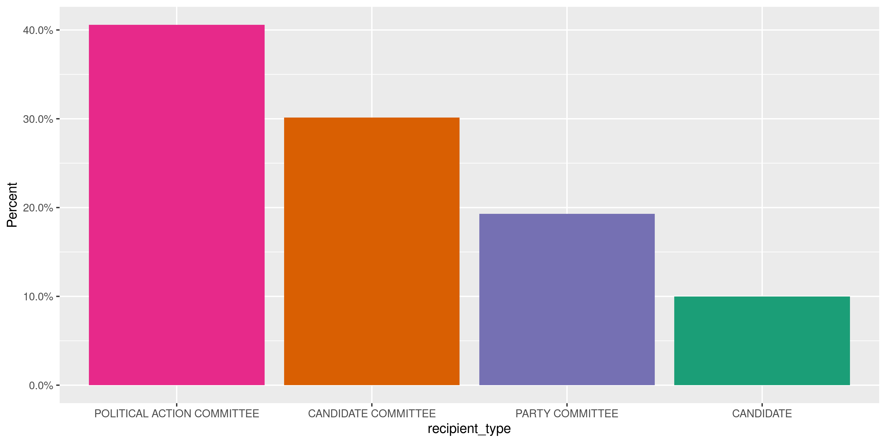
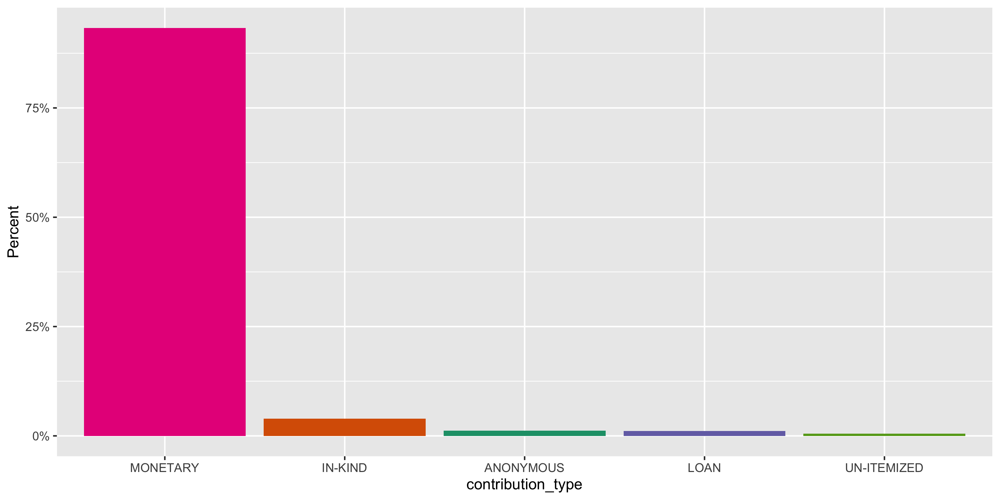
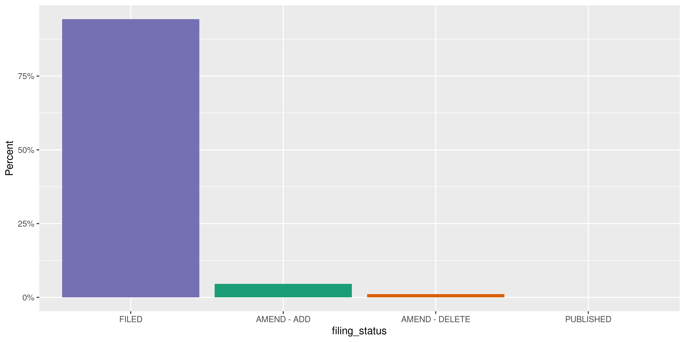
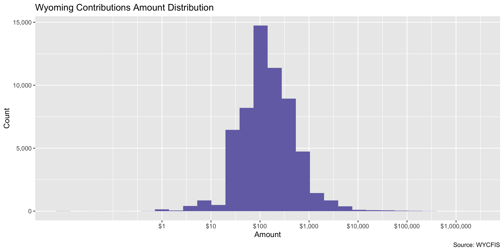
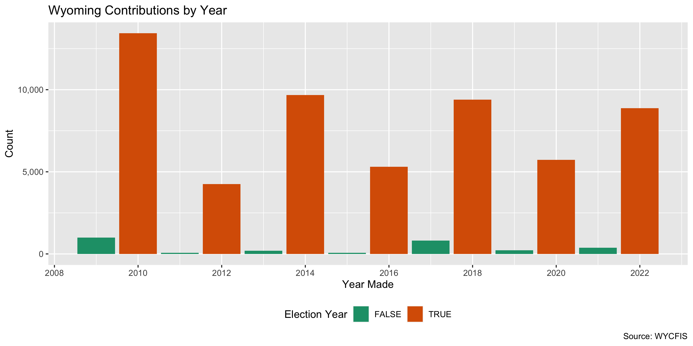
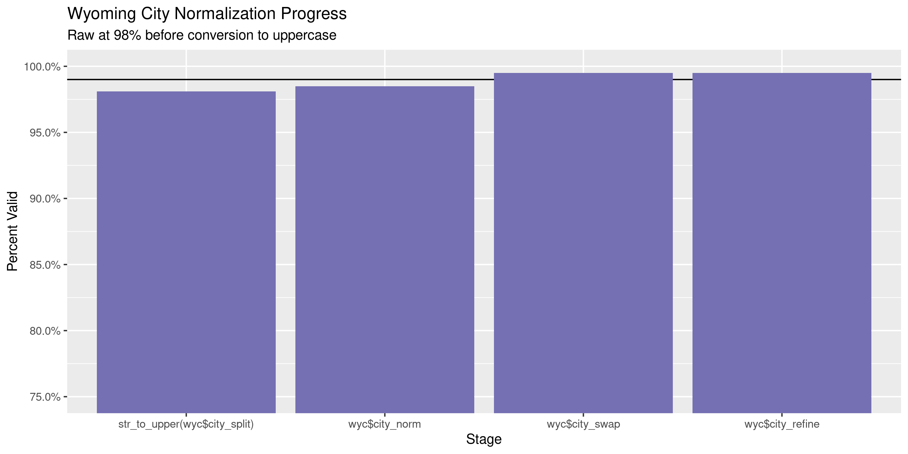
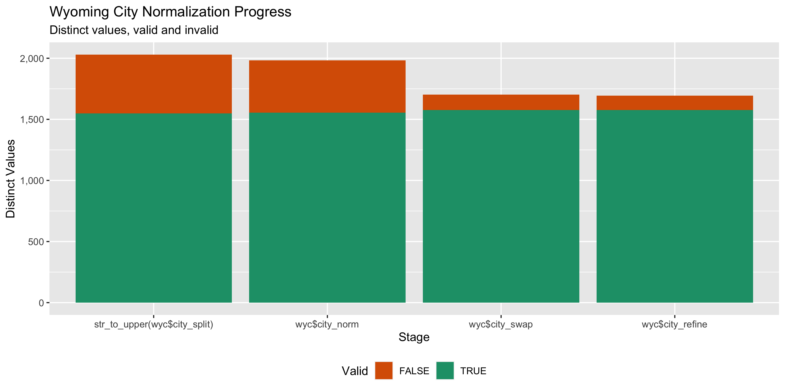

Wyoming Contributions
================
Kiernan Nicholls
Tue Oct 19 15:27:59 2021

-   [Project](#project)
-   [Objectives](#objectives)
-   [Packages](#packages)
-   [Source](#source)
-   [Download](#download)
-   [Read](#read)
-   [Explore](#explore)
-   [Separate](#separate)
    -   [Missing](#missing)
    -   [Duplicates](#duplicates)
    -   [Categorical](#categorical)
    -   [Amounts](#amounts)
    -   [Dates](#dates)
-   [Wrangle](#wrangle)
    -   [ZIP](#zip)
    -   [City](#city)
-   [Conclude](#conclude)
-   [Export](#export)
-   [Upload](#upload)
-   [Dictionary](#dictionary)

<!-- Place comments regarding knitting here -->

## Project

The Accountability Project is an effort to cut across data silos and
give journalists, policy professionals, activists, and the public at
large a simple way to search across huge volumes of public data about
people and organizations.

Our goal is to standardize public data on a few key fields by thinking
of each dataset row as a transaction. For each transaction there should
be (at least) 3 variables:

1.  All **parties** to a transaction.
2.  The **date** of the transaction.
3.  The **amount** of money involved.

## Objectives

This document describes the process used to complete the following
objectives:

1.  How many records are in the database?
2.  Check for entirely duplicated records.
3.  Check ranges of continuous variables.
4.  Is there anything blank or missing?
5.  Check for consistency issues.
6.  Create a five-digit ZIP Code called `zip`.
7.  Create a `year` field from the transaction date.
8.  Make sure there is data on both parties to a transaction.

## Packages

The following packages are needed to collect, manipulate, visualize,
analyze, and communicate these results. The `pacman` package will
facilitate their installation and attachment.

``` r
if (!require("pacman")) {
  install.packages("pacman")
}
pacman::p_load(
  tidyverse, # data manipulation
  lubridate, # datetime strings
  gluedown, # printing markdown
  janitor, # clean data frames
  campfin, # custom irw tools
  aws.s3, # aws cloud storage
  refinr, # cluster & merge
  scales, # format strings
  knitr, # knit documents
  vroom, # fast reading
  rvest, # scrape html
  glue, # code strings
  here, # project paths
  httr, # http requests
  fs # local storage 
)
```

This document should be run as part of the `R_campfin` project, which
lives as a sub-directory of the more general, language-agnostic
[`irworkshop/accountability_datacleaning`](https://github.com/irworkshop/accountability_datacleaning)
GitHub repository.

The `R_campfin` project uses the [RStudio
projects](https://support.rstudio.com/hc/en-us/articles/200526207-Using-Projects)
feature and should be run as such. The project also uses the dynamic
`here::here()` tool for file paths relative to *your* machine.

``` r
# where does this document knit?
here::i_am("wy/contribs/docs/wy_contribs_diary.Rmd")
```

## Source

Data is obtained from the Wyoming Secretary of State’s Campaign Finance
System (WYCIFS).

> Wyoming’s Campaign Finance Information System (WYCFIS) exists to
> provide a mechanism for online filing of campaign finance information
> and to provide full disclosure to the public. This website contains
> detailed financial records and related information that candidates,
> committees, organizations and parties are required by law to disclose.

## Download

Using the WYCIFS [contribution search
portal](https://www.wycampaignfinance.gov/WYCFWebApplication/GSF_SystemConfiguration/SearchContributions.aspx),
we can run an empty search and return all contributions from “All”
sources. Those search results need to be manually exported as the
`ExportContributions` file.

``` r
raw_dir <- dir_create(here("wy", "contribs", "data", "raw"))
raw_txt <- dir_ls(raw_dir, glob = "*.txt")
file_size(raw_txt)
#> 16.7M
```

## Read

``` r
wyc <- read_delim(
  file = raw_txt,
  delim = ",",
  escape_backslash = FALSE,
  escape_double = FALSE,
  col_types = cols(
    .default = col_character(),
    Date = col_date_mdy(),
    Amount = col_double()
  )
)
```

``` r
wyc <- clean_names(wyc, case = "snake")
```

## Explore

There are 124,996 rows of 8 columns. Each record represents a single
contribution from an individual or business to a political committee.

``` r
glimpse(wyc)
#> Rows: 124,996
#> Columns: 8
#> $ contributor_name  <chr> "RAY, ROBERT  (CHEYENNE)", "WYOMING INVESTOR NETWORK (LANDER)", NA, "HANLON, THEODORE  (CHEY…
#> $ recipient_name    <chr> "LARAMIE DEMOCRATIC PARTY CENTRAL COMMITTEE", "WOMEN FOR WYOMING PAC", "PROTECT OUR POLICE P…
#> $ recipient_type    <chr> "PARTY COMMITTEE", "POLITICAL ACTION COMMITTEE", "POLITICAL ACTION COMMITTEE", "PARTY COMMIT…
#> $ contribution_type <chr> "MONETARY", "MONETARY", "UN-ITEMIZED", "MONETARY", "MONETARY", "MONETARY", "MONETARY", "MONE…
#> $ date              <date> 2020-12-31, 2020-12-31, 2020-12-31, 2020-12-30, 2020-12-30, 2020-12-30, 2020-12-29, 2020-12…
#> $ filing_status     <chr> "AMEND - ADD", "AMEND - ADD", "FILED", "AMEND - ADD", "AMEND - ADD", "AMEND - ADD", "AMEND -…
#> $ amount            <dbl> 87.09, 230.00, 19035.00, 193.90, 10.00, 10.00, 10.00, 28.83, 20.00, 20.00, 20.00, 50.00, 1.0…
#> $ city_state_zip    <chr> "CHEYENNE, WY 82009", "LANDER, WY 82520", NA, "CHEYENNE, WY 82003", "LARAMIE, WY 82072", "LA…
tail(wyc)
#> # A tibble: 6 × 8
#>   contributor_name   recipient_name       recipient_type contribution_ty… date       filing_status amount city_state_zip
#>   <chr>              <chr>                <chr>          <chr>            <date>     <chr>          <dbl> <chr>         
#> 1 FRANK PEASLEY (DO… PLATTE REPUBLICAN P… PARTY COMMITT… MONETARY         2009-01-01 FILED           300  "DOUGLAS, WY …
#> 2 MATHEWSON, PAM  (… ALBANY DEMOCRATIC P… PARTY COMMITT… IN-KIND          2009-01-01 FILED            80  "LARAMIE, WY …
#> 3 MEASOM, FRAN  (JA… TETON DEMOCRATIC PA… PARTY COMMITT… MONETARY         2009-01-01 FILED            40  "JACKSON, WY …
#> 4 <NA>               BIG HORN DEMOCRATIC… PARTY COMMITT… UN-ITEMIZED      2009-01-01 FILED           566. "AA "         
#> 5 <NA>               FREMONT REPUBLICAN … PARTY COMMITT… UN-ITEMIZED      2009-01-01 FILED           370   <NA>         
#> 6 <NA>               PARK REPUBLICAN PAR… PARTY COMMITT… UN-ITEMIZED      2008-12-16 PUBLISHED       281.  <NA>
```

## Separate

``` r
wyc <- wyc %>% 
  extract(
    col = contributor_name,
    into = c("contributor_name", "contributor_city"),
    regex = "^(.*)\\s\\((.*)\\)$",
    remove = TRUE
  ) %>% 
  extract(
    col = "city_state_zip",
    into = c("city_split", "state_split", "zip_split"),
    regex = "^(.*), (.*) (.*)$",
    remove = FALSE
  ) %>% 
  mutate(across(where(is.character), str_squish)) %>% 
  mutate(across(where(is.character), na_if, ""))
```

### Missing

Columns vary in their degree of missing values.

``` r
col_stats(wyc, count_na)
#> # A tibble: 12 × 4
#>    col               class      n      p
#>    <chr>             <chr>  <int>  <dbl>
#>  1 contributor_name  <chr>   3330 0.0266
#>  2 contributor_city  <chr>   3336 0.0267
#>  3 recipient_name    <chr>      0 0     
#>  4 recipient_type    <chr>      0 0     
#>  5 contribution_type <chr>      0 0     
#>  6 date              <date>     0 0     
#>  7 filing_status     <chr>      0 0     
#>  8 amount            <dbl>      0 0     
#>  9 city_state_zip    <chr>   3167 0.0253
#> 10 city_split        <chr>   3349 0.0268
#> 11 state_split       <chr>   3263 0.0261
#> 12 zip_split         <chr>   3349 0.0268
```

We can flag any record missing a key variable needed to identify a
transaction.

``` r
key_vars <- c("date", "contributor_name", "amount", "recipient_name")
wyc <- flag_na(wyc, all_of(key_vars))
mean(wyc$na_flag)
#> [1] 0.02664085
sum(wyc$na_flag)
#> [1] 3330
```

``` r
wyc %>% 
  filter(na_flag) %>% 
  select(all_of(key_vars))
#> # A tibble: 3,330 × 4
#>    date       contributor_name   amount recipient_name                           
#>    <date>     <chr>               <dbl> <chr>                                    
#>  1 2020-12-31 <NA>             19035    PROTECT OUR POLICE PAC                   
#>  2 2020-12-22 <NA>               260    PARK REPUBLICAN PARTY CENTRAL COMMITTEE  
#>  3 2020-12-21 <NA>               164    REPUBLICAN                               
#>  4 2020-12-15 <NA>                47.5  MARSHALL BURT                            
#>  5 2020-12-14 <NA>                 5.44 MARSHALL BURT                            
#>  6 2020-12-01 <NA>                 9    REPUBLICAN                               
#>  7 2020-12-01 <NA>               205    REPUBLICAN                               
#>  8 2020-11-30 <NA>               296.   REPUBLICAN                               
#>  9 2020-11-24 <NA>                42    ALBANY REPUBLICAN PARTY CENTRAL COMMITTEE
#> 10 2020-11-23 <NA>                12    PARK REPUBLICAN PARTY CENTRAL COMMITTEE  
#> # … with 3,320 more rows
```

### Duplicates

We can also flag any record completely duplicated across every column.

``` r
wyc <- flag_dupes(wyc, everything())
mean(wyc$dupe_flag)
#> [1] 0.0374652
sum(wyc$dupe_flag)
#> [1] 4683
```

``` r
wyc %>% 
  filter(dupe_flag) %>% 
  select(all_of(key_vars)) %>% 
  arrange(date)
#> # A tibble: 4,683 × 4
#>    date       contributor_name    amount recipient_name                           
#>    <date>     <chr>                <dbl> <chr>                                    
#>  1 2009-01-01 ACTBLUE WYOMING       24.0 TETON DEMOCRATIC PARTY CENTRAL COMMITTEE 
#>  2 2009-01-01 ACTBLUE WYOMING       24.0 TETON DEMOCRATIC PARTY CENTRAL COMMITTEE 
#>  3 2009-10-07 LENZ, CLARK A         40   ALBANY REPUBLICAN PARTY CENTRAL COMMITTEE
#>  4 2009-10-07 LENZ, CLARK A         40   ALBANY REPUBLICAN PARTY CENTRAL COMMITTEE
#>  5 2009-10-07 STUTZ, SAMANTHASARA   20   ALBANY REPUBLICAN PARTY CENTRAL COMMITTEE
#>  6 2009-10-07 STUTZ, SAMANTHASARA   20   ALBANY REPUBLICAN PARTY CENTRAL COMMITTEE
#>  7 2009-11-15 THOMPSON, CODY       100   MICHELI FOR GOVERNOR                     
#>  8 2009-11-15 THOMPSON, CODY       100   MICHELI FOR GOVERNOR                     
#>  9 2009-11-21 BLUEMEL, IVAN         60   MICHELI FOR GOVERNOR                     
#> 10 2009-11-21 BLUEMEL, IVAN         60   MICHELI FOR GOVERNOR                     
#> # … with 4,673 more rows
```

### Categorical

``` r
col_stats(wyc, n_distinct)
#> # A tibble: 14 × 4
#>    col               class      n         p
#>    <chr>             <chr>  <int>     <dbl>
#>  1 contributor_name  <chr>  38923 0.311    
#>  2 contributor_city  <chr>   2434 0.0195   
#>  3 recipient_name    <chr>    794 0.00635  
#>  4 recipient_type    <chr>      4 0.0000320
#>  5 contribution_type <chr>      5 0.0000400
#>  6 date              <date>  3911 0.0313   
#>  7 filing_status     <chr>      4 0.0000320
#>  8 amount            <dbl>   4548 0.0364   
#>  9 city_state_zip    <chr>   5004 0.0400   
#> 10 city_split        <chr>   2427 0.0194   
#> 11 state_split       <chr>     55 0.000440 
#> 12 zip_split         <chr>   3425 0.0274   
#> 13 na_flag           <lgl>      2 0.0000160
#> 14 dupe_flag         <lgl>      2 0.0000160
```

<!-- --><!-- --><!-- -->

### Amounts

``` r
wyc$amount <- round(wyc$amount, digits = 2)
```

``` r
summary(wyc$amount)
#>      Min.   1st Qu.    Median      Mean   3rd Qu.      Max. 
#>       0.0      20.0      55.0     357.4     150.0 2177032.0
mean(wyc$amount <= 0)
#> [1] 0.0007440238
```

These are the records with the minimum and maximum amounts.

``` r
glimpse(wyc[c(which.max(wyc$amount), which.min(wyc$amount)), ])
#> Rows: 2
#> Columns: 14
#> $ contributor_name  <chr> "BAGBY, GEORGE", "ESPY, DIANA"
#> $ contributor_city  <chr> "RAWLINS", "RAWLINS"
#> $ recipient_name    <chr> "GEORGE BAGBY", "COMMITTEE TO ELECT KRISTI RACINES"
#> $ recipient_type    <chr> "CANDIDATE", "CANDIDATE COMMITTEE"
#> $ contribution_type <chr> "MONETARY", "MONETARY"
#> $ date              <date> 2012-08-08, 2018-07-19
#> $ filing_status     <chr> "FILED", "FILED"
#> $ amount            <dbl> 2177032, 0
#> $ city_state_zip    <chr> "RAWLINS, WY 82301", "RAWLINS, WY 82301"
#> $ city_split        <chr> "RAWLINS", "RAWLINS"
#> $ state_split       <chr> "WY", "WY"
#> $ zip_split         <chr> "82301", "82301"
#> $ na_flag           <lgl> FALSE, FALSE
#> $ dupe_flag         <lgl> FALSE, FALSE
```

<!-- -->

### Dates

We can add the calendar year from `date` with `lubridate::year()`

``` r
wyc <- mutate(wyc, year = year(date))
```

``` r
min(wyc$date)
#> [1] "2008-12-16"
sum(wyc$year < 2000)
#> [1] 0
max(wyc$date)
#> [1] "2020-12-31"
sum(wyc$date > today())
#> [1] 0
```

<!-- -->

## Wrangle

To improve the searchability of the database, we will perform some
consistent, confident string normalization. For geographic variables
like city names and ZIP codes, the corresponding `campfin::normal_*()`
functions are tailor made to facilitate this process.

### ZIP

``` r
wyc$zip_split <- na_rep(wyc$zip_split)
```

### City

Cities are the most difficult geographic variable to normalize, simply
due to the wide variety of valid cities and formats.

#### Normal

The `campfin::normal_city()` function is a good start, again converting
case, removing punctuation, but *expanding* USPS abbreviations. We can
also remove `invalid_city` values.

``` r
norm_city <- wyc %>% 
  distinct(city_split, state_split, zip_split) %>% 
  mutate(
    city_norm = normal_city(
      city = city_split, 
      abbs = usps_city,
      states = c("WY", "DC", "WYOMING"),
      na = invalid_city,
      na_rep = TRUE
    )
  )
```

#### Swap

We can further improve normalization by comparing our normalized value
against the *expected* value for that record’s state abbreviation and
ZIP code. If the normalized value is either an abbreviation for or very
similar to the expected value, we can confidently swap those two.

``` r
norm_city <- norm_city %>% 
  left_join(
    y = zipcodes,
    by = c(
      "state_split" = "state",
      "zip_split" = "zip"
    )
  ) %>% 
  rename(city_match = city) %>% 
  mutate(
    match_abb = is_abbrev(city_norm, city_match),
    match_dist = str_dist(city_norm, city_match),
    city_swap = if_else(
      condition = !is.na(match_dist) & (match_abb | match_dist == 1),
      true = city_match,
      false = city_norm
    )
  ) %>% 
  select(
    -city_match,
    -match_dist,
    -match_abb
  )
```

``` r
wyc <- left_join(
  x = wyc,
  y = norm_city,
  by = c(
    "city_split", 
    "state_split", 
    "zip_split"
  )
)
```

#### Refine

The [OpenRefine](https://openrefine.org/) algorithms can be used to
group similar strings and replace the less common versions with their
most common counterpart. This can greatly reduce inconsistency, but with
low confidence; we will only keep any refined strings that have a valid
city/state/zip combination.

``` r
good_refine <- wyc %>% 
  mutate(
    city_refine = city_swap %>% 
      key_collision_merge() %>% 
      n_gram_merge(numgram = 1)
  ) %>% 
  filter(city_refine != city_swap) %>% 
  inner_join(
    y = zipcodes,
    by = c(
      "city_refine" = "city",
      "state_split" = "state",
      "zip_split" = "zip"
    )
  )
```

    #> # A tibble: 12 × 5
    #>    state_split zip_split city_swap             city_refine          n
    #>    <chr>       <chr>     <chr>                 <chr>            <int>
    #>  1 WY          82720     HULLET                HULETT               2
    #>  2 IL          60074     PALENTINE             PALATINE             1
    #>  3 SD          57717     BELLE FROUCHE         BELLE FOURCHE        1
    #>  4 WI          54494     WISCONSIN RAPIDSAOIDS WISCONSIN RAPIDS     1
    #>  5 WY          82001     CHENEYHE              CHEYENNE             1
    #>  6 WY          82003     CHEYENNE//            CHEYENNE             1
    #>  7 WY          82009     CHEYYEN               CHEYENNE             1
    #>  8 WY          82433     MEETETSEE             MEETEETSE            1
    #>  9 WY          82514     FORT WASKAHIE         FORT WASHAKIE        1
    #> 10 WY          82633     OUGLASD               DOUGLAS              1
    #> 11 WY          82720     HULLETTE              HULETT               1
    #> 12 WY          82721     OORCROFTM             MOORCROFT            1

Then we can join the refined values back to the database.

``` r
wyc <- wyc %>% 
  left_join(good_refine, by = names(.)) %>% 
  mutate(city_refine = coalesce(city_refine, city_swap))
```

#### Progress

Our goal for normalization was to increase the proportion of city values
known to be valid and reduce the total distinct values by correcting
misspellings.

| stage                          | prop_in | n_distinct | prop_na | n_out | n_diff |
|:-------------------------------|--------:|-----------:|--------:|------:|-------:|
| `str_to_upper(wyc$city_split)` |   0.981 |       2427 |   0.027 |  2305 |    665 |
| `wyc$city_norm`                |   0.985 |       2360 |   0.027 |  1844 |    591 |
| `wyc$city_swap`                |   0.995 |       1949 |   0.027 |   624 |    166 |
| `wyc$city_refine`              |   0.995 |       1937 |   0.027 |   611 |    154 |

You can see how the percentage of valid values increased with each
stage.

<!-- -->

More importantly, the number of distinct values decreased each stage. We
were able to confidently change many distinct invalid values to their
valid equivalent.

<!-- -->

Before exporting, we can remove the intermediary normalization columns
and rename all added variables with the `_clean` suffix.

``` r
wyc <- wyc %>% 
  select(
    -city_split,
    -city_norm,
    -city_swap,
    city_clean = city_refine
  ) %>% 
  rename_all(~str_replace(., "_split", "_clean")) %>% 
  rename_all(~str_remove(., "_raw")) %>% 
  relocate(city_clean, state_clean, zip_clean, .after = year)
```

## Conclude

``` r
glimpse(sample_n(wyc, 50))
#> Rows: 50
#> Columns: 15
#> $ contributor_name  <chr> "SWINTZ, ROBERT E", "TROMBLE, VERN", "WOMACK, AMY", "LUZMOOR, GLORIA", "KIRVEN, LAWRENCE E",…
#> $ contributor_city  <chr> "JACKSON", "LANDER", "CASPER", "ROCK SPRINGS", "BUFFALO", "CASPER", "THERMOPOLIS", "CHEYENNE…
#> $ recipient_name    <chr> "WY REALTORS PAC", "REPUBLICAN WOMEN OF FREMONT COUNTY PAC", "REPUBLICAN", "WY EDUCATION ASS…
#> $ recipient_type    <chr> "POLITICAL ACTION COMMITTEE", "POLITICAL ACTION COMMITTEE", "PARTY COMMITTEE", "POLITICAL AC…
#> $ contribution_type <chr> "MONETARY", "MONETARY", "MONETARY", "MONETARY", "MONETARY", "MONETARY", "MONETARY", "MONETAR…
#> $ date              <date> 2010-08-23, 2019-03-31, 2017-07-05, 2016-08-31, 2014-08-07, 2018-07-05, 2018-05-03, 2014-05…
#> $ filing_status     <chr> "FILED", "FILED", "AMEND - ADD", "FILED", "FILED", "FILED", "AMEND - ADD", "FILED", "FILED",…
#> $ amount            <dbl> 20.0, 80.0, 200.0, 20.0, 50.0, 100.0, 40.0, 200.0, 25.0, 200.0, 180.0, 15.0, 61.0, 5.0, 10.0…
#> $ city_state_zip    <chr> "JACKSON, WY 83002", "LANDER, WY 82520", "CASPER, WY 82601", "ROCK SPRINGS, WY 82901", "BUFF…
#> $ na_flag           <lgl> FALSE, FALSE, FALSE, FALSE, FALSE, FALSE, FALSE, FALSE, FALSE, FALSE, FALSE, FALSE, FALSE, F…
#> $ dupe_flag         <lgl> TRUE, FALSE, FALSE, FALSE, FALSE, FALSE, FALSE, FALSE, FALSE, FALSE, FALSE, FALSE, FALSE, FA…
#> $ year              <dbl> 2010, 2019, 2017, 2016, 2014, 2018, 2018, 2014, 2016, 2010, 2017, 2019, 2012, 2015, 2015, 20…
#> $ city_clean        <chr> "JACKSON", "LANDER", "CASPER", "ROCK SPRINGS", "BUFFALO", "CASPER", "THERMOPOLIS", "CHEYENNE…
#> $ state_clean       <chr> "WY", "WY", "WY", "WY", "WY", "WY", "WY", "WY", "WY", "WY", "SD", "WY", "WY", "WY", "WY", "W…
#> $ zip_clean         <chr> "83002", "82520", "82601", "82901", "82834", "82601", "82443", "82003", "82447", "82009", "5…
```

1.  There are 124,996 records in the database.
2.  There are 4,683 duplicate records in the database.
3.  The range and distribution of `amount` and `date` seem reasonable.
4.  There are 3,330 records missing key variables.
5.  Consistency in geographic data has been improved with
    `campfin::normal_*()`.
6.  The 4-digit `year` variable has been created with
    `lubridate::year()`.

## Export

Now the file can be saved on disk for upload to the Accountability
server.

``` r
clean_dir <- dir_create(here("wy", "contribs", "data", "clean"))
clean_csv <- path(clean_dir, "wy_contribs_20081216-20201231.csv")
write_csv(wyc, clean_csv, na = "")
(clean_size <- file_size(clean_csv))
#> 19M
```

## Upload

We can use the `aws.s3::put_object()` to upload the text file to the IRW
server.

``` r
aws_csv <- path("csv", basename(clean_csv))
if (!object_exists(aws_csv, "publicaccountability")) {
  put_object(
    file = clean_csv,
    object = aws_csv, 
    bucket = "publicaccountability",
    acl = "public-read",
    show_progress = TRUE,
    multipart = TRUE
  )
}
aws_head <- head_object(aws_csv, "publicaccountability")
(aws_size <- as_fs_bytes(attr(aws_head, "content-length")))
unname(aws_size == clean_size)
```

## Dictionary

The following table describes the variables in our final exported file:

| Column              | Type        | Definition |
|:--------------------|:------------|:-----------|
| `contributor_name`  | `character` |            |
| `contributor_city`  | `character` |            |
| `recipient_name`    | `character` |            |
| `recipient_type`    | `character` |            |
| `contribution_type` | `character` |            |
| `date`              | `double`    |            |
| `filing_status`     | `character` |            |
| `amount`            | `double`    |            |
| `city_state_zip`    | `character` |            |
| `na_flag`           | `logical`   |            |
| `dupe_flag`         | `logical`   |            |
| `year`              | `double`    |            |
| `city_clean`        | `character` |            |
| `state_clean`       | `character` |            |
| `zip_clean`         | `character` |            |
