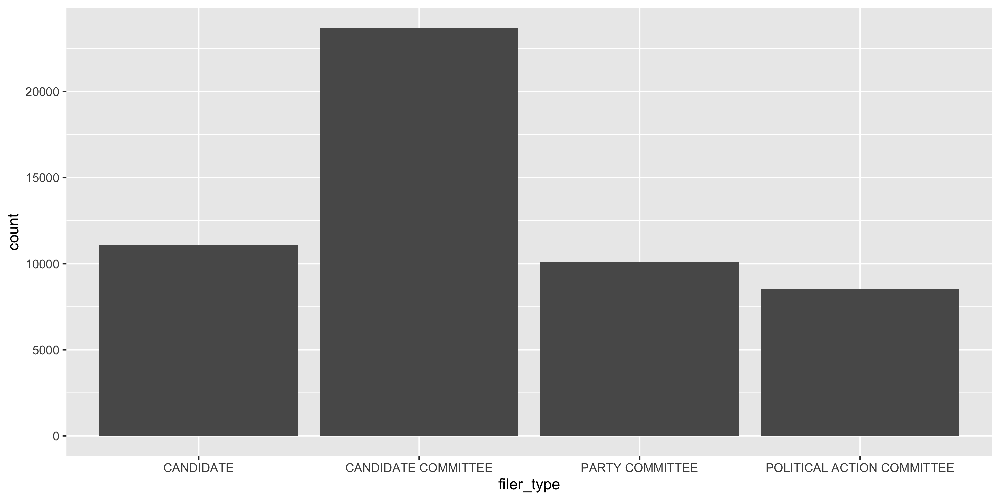
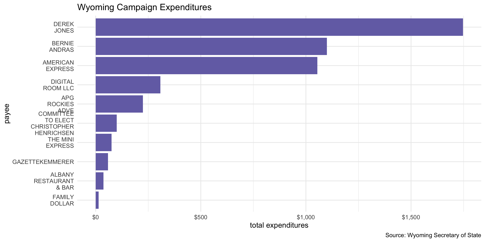
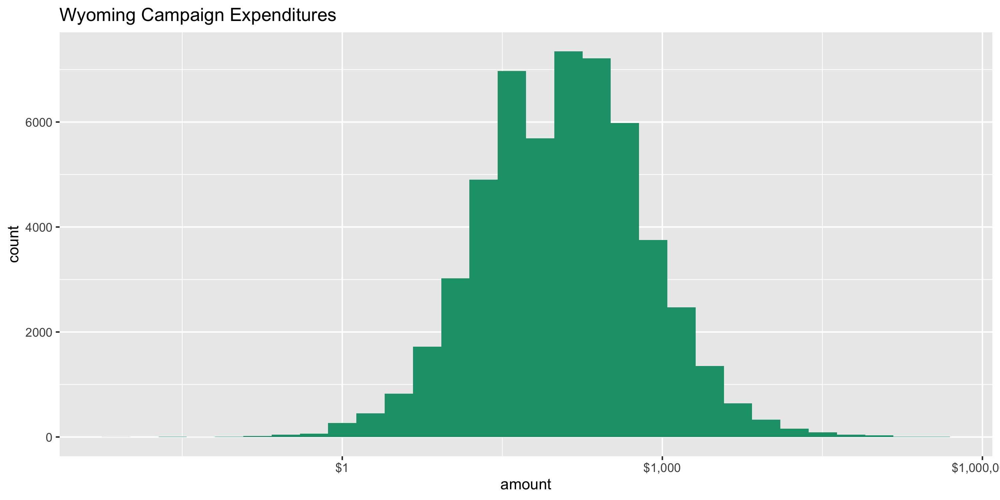
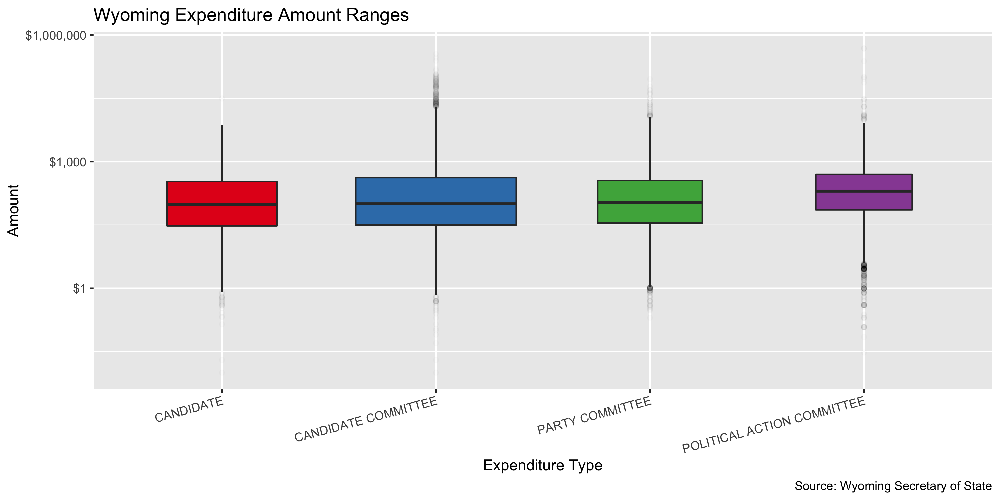
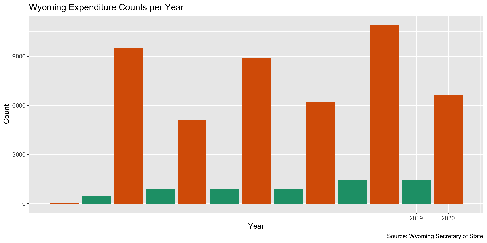
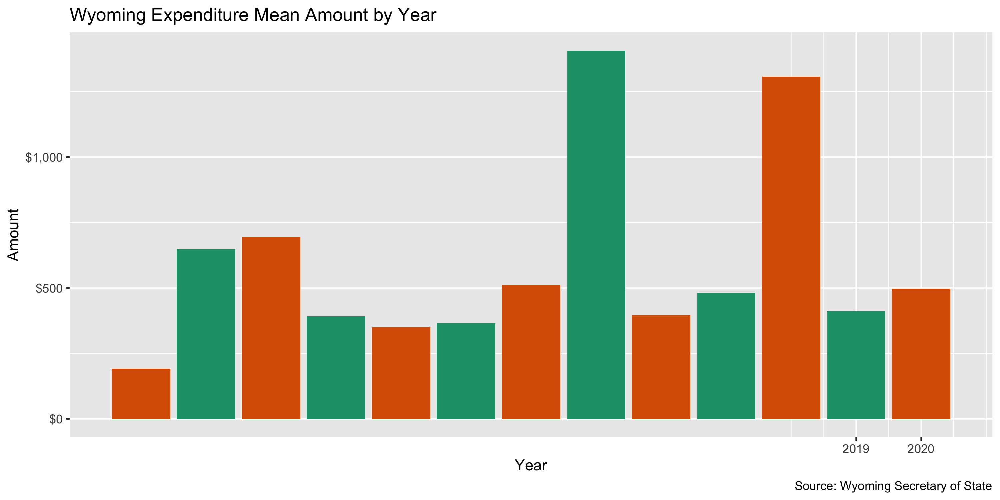
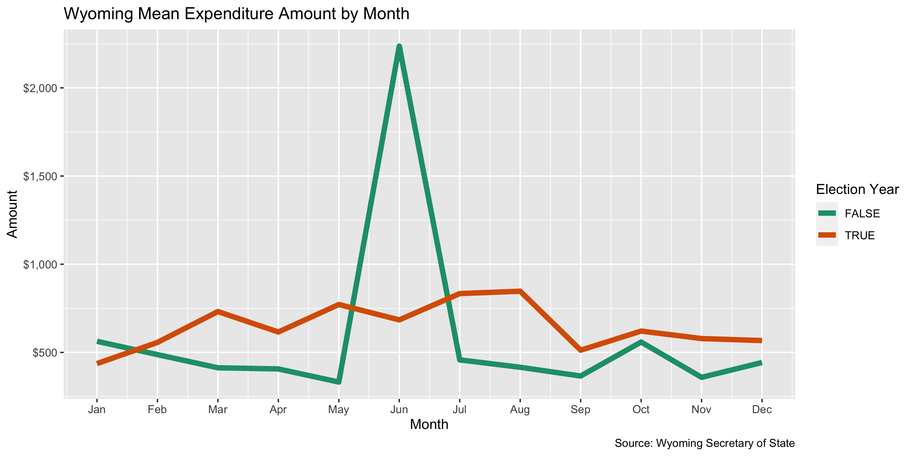

Wyoming Campaign Expenditures Data Diary
================
Yanqi Xu
2023-04-02 19:06:05

- <a href="#project" id="toc-project">Project</a>
- <a href="#objectives" id="toc-objectives">Objectives</a>
- <a href="#packages" id="toc-packages">Packages</a>
- <a href="#data" id="toc-data">Data</a>
- <a href="#import" id="toc-import">Import</a>
- <a href="#explore" id="toc-explore">Explore</a>
- <a href="#conclude" id="toc-conclude">Conclude</a>
- <a href="#export" id="toc-export">Export</a>
- <a href="#upload" id="toc-upload">Upload</a>
- <a href="#dictionary" id="toc-dictionary">Dictionary</a>

## Project

The Accountability Project is an effort to cut across data silos and
give journalists, policy professionals, activists, and the public at
large a simple way to search across huge volumes of public data about
people and organizations.

Our goal is to standardizing public data on a few key fields by thinking
of each dataset row as a transaction. For each transaction there should
be (at least) 3 variables:

1.  All **parties** to a transaction
2.  The **date** of the transaction
3.  The **amount** of money involved

## Objectives

This document describes the process used to complete the following
objectives:

1.  How many records are in the database?
2.  Check for duplicates
3.  Check ranges
4.  Is there anything blank or missing?
5.  Check for consistency issues
6.  Create a five-digit ZIP Code called `ZIP5`
7.  Create a `YEAR` field from the transaction date
8.  Make sure there is data on both parties to a transaction

## Packages

The following packages are needed to collect, manipulate, visualize,
analyze, and communicate these results. The `pacman` package will
facilitate their installation and attachment.

``` r
if (!require("pacman")) install.packages("pacman")
pacman::p_load_gh("irworkshop/campfin")
pacman::p_load(
  gluedown, # printing markdown
  stringdist, # levenshtein value
  tidyverse, # data manipulation
  lubridate, # datetime strings
  tidytext, # string analysis
  magrittr, # pipe opperators
  janitor, # dataframe clean
  zipcode, # clean & database
  refinr, # cluster and merge
  knitr, # knit documents
  glue, # combine strings
  scales, #format strings
  here, # relative storage
  fs, # search storage 
  rvest # scrape html
)
```

This document should be run as part of the `R_campfin` project, which
lives as a sub-directory of the more general, language-agnostic
[`irworkshop/accountability_datacleaning`](https://github.com/irworkshop/accountability_datacleaning "TAP repo")
GitHub repository.

The `R_campfin` project uses the [RStudio
projects](https://support.rstudio.com/hc/en-us/articles/200526207-Using-Projects "Rproj")
feature and should be run as such. The project also uses the dynamic
`here::here()` tool for file paths relative to *your* machine.

``` r
# where dfs this document knit?
here::here()
#> [1] "/Users/yanqixu/code/accountability_datacleaning"
```

## Data

The data comes from the Wyoming Secretary of State. [Link to the data
download](https://www.wycampaignfinance.gov/WYCFWebApplication/GSF_SystemConfiguration/SearchExpenditures.aspx "source").

### About

> Wyoming’s Campaign Finance Information System (WYCFIS) exists to
> provide a mechanism for online filing of campaign finance information
> and to provide full disclosure to the public. This website contains
> detailed financial records and related information that candidates,
> committees, organizations and parties are required by law to disclose.
> Wyoming requires all statewide candidates, candidate committees,
> political action committees, organizations and political parties to
> file electronically online using this system.

## Import

### Download

Download raw, **immutable** data file. Go to [the download
site](https://www.wycampaignfinance.gov/WYCFWebApplication/GSF_SystemConfiguration/SearchExpenditures.aspx),
leave the fields blank, go to “advanced setting,” click the “All” tab
and hit “Search” with the date range of Jan 1, 2008 to April 1, 2023.
After the table is populated, click “Export”.

Note that the date range probably corresponds to reporting date, and
there’s probably a lag. We can see the data only goes through the end of
2022, so the next update should start Jan 1, 2023.

``` r
# create a directory for the raw data
raw_dir <- dir_create(here("state","wy", "expends", "data", "raw"))
```

### Read

## Explore

There are `nrow(wye)` records of `length(wye)` variables in the full
database.

``` r
head(wye)
```

    #> # A tibble: 6 × 8
    #>   filer_type                 filer_name      payee        purpose date       city_…¹ filin…² amount
    #>   <chr>                      <chr>           <chr>        <chr>   <date>     <chr>   <chr>    <dbl>
    #> 1 POLITICAL ACTION COMMITTEE ACTBLUE WYOMING ACTBLUE TEC… IT SER… 2022-12-31 SOMERV… AMEND …   9.51
    #> 2 POLITICAL ACTION COMMITTEE ACTBLUE WYOMING ALBANY COUN… CANDID… 2022-12-31 LARAMI… AMEND …  38.4 
    #> 3 POLITICAL ACTION COMMITTEE ACTBLUE WYOMING LARAMIE COU… CANDID… 2022-12-31 CHEYEN… AMEND …  96.0 
    #> 4 POLITICAL ACTION COMMITTEE ACTBLUE WYOMING NATRONA COU… CANDID… 2022-12-31 CASPER… AMEND …   9.6 
    #> 5 POLITICAL ACTION COMMITTEE ACTBLUE WYOMING SWEETWATER … CANDID… 2022-12-31 ROCK S… AMEND …  48.0 
    #> 6 POLITICAL ACTION COMMITTEE ACTBLUE WYOMING TETON COUNT… CANDID… 2022-12-31 JACKSO… AMEND …  38.4 
    #> # … with abbreviated variable names ¹​city_state_zip, ²​filing_status

``` r
tail(wye)
```

    #> # A tibble: 6 × 8
    #>   filer_type          filer_name                    payee purpose date       city_…¹ filin…² amount
    #>   <chr>               <chr>                         <chr> <chr>   <date>     <chr>   <chr>    <dbl>
    #> 1 PARTY COMMITTEE     ALBANY DEMOCRATIC PARTY CENT… ROCK… UTILIT… 2008-12-02 "PORTL… PUBLIS…  178. 
    #> 2 PARTY COMMITTEE     ALBANY DEMOCRATIC PARTY CENT… POST… POSTAGE 2008-11-18 "LARAM… PUBLIS…   26.4
    #> 3 PARTY COMMITTEE     PARK REPUBLICAN PARTY CENTRA… KIMI… OTHER:… 2008-11-14 "82414… PUBLIS…   46.7
    #> 4 PARTY COMMITTEE     PARK REPUBLICAN PARTY CENTRA… KURT… FOOD A… 2008-11-14 "82414… PUBLIS…   94.6
    #> 5 PARTY COMMITTEE     PARK REPUBLICAN PARTY CENTRA… SHER… FOOD A… 2008-11-14 "82414… PUBLIS…   53.5
    #> 6 CANDIDATE COMMITTEE PARTNERS FOR MAXFIELD COMMIT… MAX … ENTERT… 2008-07-15 "CHEYE… PUBLIS…   14.0
    #> # … with abbreviated variable names ¹​city_state_zip, ²​filing_status

``` r
glimpse(wye)
```

    #> Rows: 67,094
    #> Columns: 8
    #> $ filer_type     <chr> "POLITICAL ACTION COMMITTEE", "POLITICAL ACTION COMMITTEE", "POLITICAL ACT…
    #> $ filer_name     <chr> "ACTBLUE WYOMING", "ACTBLUE WYOMING", "ACTBLUE WYOMING", "ACTBLUE WYOMING"…
    #> $ payee          <chr> "ACTBLUE TECHNICAL SERVICES", "ALBANY COUNTY DEMOCRATIC PARTY", "LARAMIE C…
    #> $ purpose        <chr> "IT SERVICES", "CANDIDATE/COMMITTEE CONTRIBUTION", "CANDIDATE/COMMITTEE CO…
    #> $ date           <date> 2022-12-31, 2022-12-31, 2022-12-31, 2022-12-31, 2022-12-31, 2022-12-31, 2…
    #> $ city_state_zip <chr> "SOMERVILLE, MA 02144", "LARAMIE, WY 82070", "CHEYENNE, WY 82003", "CASPER…
    #> $ filing_status  <chr> "AMEND - ADD", "AMEND - ADD", "AMEND - ADD", "AMEND - ADD", "AMEND - ADD",…
    #> $ amount         <dbl> 9.51, 38.41, 96.05, 9.60, 48.02, 38.41, 6277.19, 4.19, 535.54, 2069.59, 1.…

### Distinct

The variables range in their degree of distinctness.

``` r
wye %>% col_stats(n_distinct)
```

    #> # A tibble: 8 × 4
    #>   col            class      n         p
    #>   <chr>          <chr>  <int>     <dbl>
    #> 1 filer_type     <chr>      4 0.0000596
    #> 2 filer_name     <chr>    956 0.0142   
    #> 3 payee          <chr>  15326 0.228    
    #> 4 purpose        <chr>   2334 0.0348   
    #> 5 date           <date>  4502 0.0671   
    #> 6 city_state_zip <chr>   2165 0.0323   
    #> 7 filing_status  <chr>      4 0.0000596
    #> 8 amount         <dbl>  21042 0.314

We can explore the distribution of the least distinct values with
`ggplot2::geom_bar()`.

<!-- -->

Or, filter the data and explore the most frequent discrete data.

<!-- -->

### Missing

We will flag the entries with an empty `city_state_zip` column.

``` r
wye %>% col_stats(count_na)
```

    #> # A tibble: 8 × 4
    #>   col            class      n      p
    #>   <chr>          <chr>  <int>  <dbl>
    #> 1 filer_type     <chr>      0 0     
    #> 2 filer_name     <chr>      0 0     
    #> 3 payee          <chr>      0 0     
    #> 4 purpose        <chr>      0 0     
    #> 5 date           <date>     0 0     
    #> 6 city_state_zip <chr>   3902 0.0582
    #> 7 filing_status  <chr>      0 0     
    #> 8 amount         <dbl>      0 0

We will flag any records with missing values in the key variables used
to identify an expenditure. There are 0 columns in city_state_zip that
are NAs.

``` r
wye <- wye %>% flag_na(city_state_zip)
```

### Duplicates

There are no duplicates.

``` r
wy_dupes <- flag_dupes(wye)
```

### Ranges

#### Amounts

``` r
summary(wye$amount)
```

    #>     Min.  1st Qu.   Median     Mean  3rd Qu.     Max. 
    #>      0.0     34.0    107.7    687.9    403.4 482033.0

See how the campaign expenditures were distributed

``` r
wye %>% 
  ggplot(aes(x = amount)) + 
  geom_histogram(fill = dark2[1]) +
  scale_x_continuous(
    trans = "log10", labels = dollar) +
  labs(title = "Wyoming Campaign Expenditures ")
```

<!-- -->

Distribution of expenses by filer
<!-- -->

### Dates

The dates seem to be reasonable, with records dating back to 1.4075^{4}
till 1.5978^{4}, 1.7256^{4}, 1.7129041^{4}, 1.846^{4}, 1.9357^{4}

``` r
summary(wye$date)
```

    #>         Min.      1st Qu.       Median         Mean      3rd Qu.         Max. 
    #> "2008-07-15" "2013-09-30" "2017-03-31" "2016-11-24" "2020-07-17" "2022-12-31"

``` r
sum(wye$date > today())
```

    #> [1] 0

### Year

Add a `year` variable from `date` after `col_date()` using
`lubridate::year()`.

``` r
wye <- wye %>% mutate(year = year(date))
```

<!-- -->

<!-- -->

``` r
wye %>% 
  mutate(month = month(date)) %>% 
  mutate(on_year = is_even(year)) %>%
  group_by(on_year, month) %>% 
  summarize(mean = mean(amount)) %>% 
  ggplot(aes(month, mean)) +
  geom_line(aes(color = on_year), size = 2) +
  scale_y_continuous(labels = dollar) +
  scale_x_continuous(labels = month.abb, breaks = 1:12) +
  scale_color_brewer(
    type = "qual",
    palette = "Dark2"
  ) +
  labs(
    title = "Wyoming Mean Expenditure Amount by Month",
    caption = "Source: Wyoming Secretary of State",
    color = "Election Year",
    x = "Month",
    y = "Amount"
  )
```

<!-- --> \## Wrangle \### Indexing

``` r
wye <- tibble::rowid_to_column(wye, "id")
```

The lengths of city_state_zip column differ, and regular expressions can
be used to separate the components.

The original data the city, state, and ZIP all in one column. The
following code separates them.

### Zipcode

First, we’ll extract any numbers whose lengths range from 1 to 5 to
`zip`, whose proportion of valid zip is pretty high and doesn’t need
further normalization.

``` r
wye <- wye %>% 
  mutate(
    zip = city_state_zip %>% 
      str_extract("\\d{2,5}") %>% 
      normal_zip(na_rep = TRUE))
sample(wye$zip, 10)
```

    #>  [1] "82070" NA      "82801" "82435" "82701" NA      "52802" NA      NA      "82001"

``` r
prop_in(wye$zip, valid_zip, na.rm = T)
```

    #> [1] 0.9935982

### State

In this regex, state is considered to consist of two upper-case letters
following a space, or two upper-case letters with a trailing space at
the end.

``` r
wye <- wye %>% 
  mutate( state =
            trimws(str_extract(wye$city_state_zip, "\\s([A-Z]{2})\\s|^([A-Z]{2})\\s$")))
count_na(wye$state)
```

    #> [1] 3987

``` r
prop_in(wye$state, valid_state, na.rm = T)
```

    #> [1] 0.9998257

The states are mostly valid and don’t need to be cleaned.

### City

First, we can get a list of incorporated cities and towns in Wyoming.
The Wyoming State Archives provided the list in a web table. We use the
`rvest` package to scrape the names of Wyoming cities and towns.
<http://wyoarchives.state.wy.us/index.php/incorporated-cities>.

``` r
wyoming_cities_page <- read_html("http://wyoarchives.state.wy.us/index.php/incorporated-cities")

wy_city <- wyoming_cities_page %>%  html_nodes("tr") %>% 
  html_text()

wy_city <- str_match(wy_city[2:100],"(^\\D{2,})\\r")[,2]
wy_city <- toupper(wy_city[!is.na(wy_city)])
```

``` r
valid_city <- unique(c(wy_city,valid_city))
```

Cleaning city values is the most complicated. This process involves four
steps:

1.  Prepare raw city values by removing invalid data and reducing
    inconsistencies
2.  Match prepared city values with the *actual* city name of that
    record’s ZIP code
3.  swap prepared city values with the ZIP code match *if* only 1 edit
    is needed
4.  Refine swapped city values with key collision and n-gram
    fingerprints

#### Normalize

Find the cities before a comma first, if not, find the non-numeric
string.

``` r
wye <- wye %>% 
  mutate(
    city_raw = str_match(wye$city_state_zip,"(^\\D{3,}),")[,2]) 

wye <- wye %>% mutate(city_raw=ifelse(is.na(city_raw)==TRUE, 
               str_extract(city_state_zip, "[A-Z]{4,}"), paste(city_raw)))

wye$city_raw <- wye$city_raw %>% 
  str_replace("^ROCK$", "ROCK SPRING") 
```

``` r
count_na(wye$city_raw)
#> [1] 18914
n_distinct(wye$city_raw)
#> [1] 955
prop_in(wye$city_raw, valid_city, na.rm = TRUE)
#> [1] 0.9762557
sum(unique(wye$city_raw) %out% valid_city)
#> [1] 385
```

48180 cities were found.

``` r
wye <- wye %>% mutate(city_norm = normal_city(city_raw))
```

#### Swap

We can further improve normalization by comparing our normalized value
against the *expected* value for that record’s state abbreviation and
ZIP code. If the normalized value is either an abbreviation for or very
similar to the expected value, we can confidently swap those two.

``` r
wye <- wye%>% 
  left_join(
    y = zipcodes,
    by = c(
      "state" = "state",
      "zip" = "zip"
    )
  ) %>% 
  rename(city_match = city) %>% 
  mutate(
    match_abb = is_abbrev(city_norm, city_match),
    match_dist = str_dist(city_norm, city_match),
    city_swap = if_else(
      condition = !is.na(match_dist) & (match_abb | match_dist) == 1,
      true = city_match,
      false = city_norm
    )
  ) %>% 
  select(
    -city_match,
    -match_dist,
    -match_abb
  )
```

### Lookup

This process is manual lookup and correction

``` r
wye$city_swap <- wye$city_swap %>% 
  str_replace("^CAS$", "CASPER") %>% 
  str_replace("^CA$", "CASPER") %>% 
  str_replace("^RS$","ROCK SPRINGS") %>% 
  str_replace("^AF$", "AFTON") %>% 
  str_replace("^M$", "MOUNTAIN VIEW") %>% 
  str_replace("^GR$", "GREEN RIVER") %>% 
  na_if("WY") %>% 
  str_replace(" WYOMING","") %>% 
  str_replace("^SLC$", "SALT LAKE CITY") %>% 
  str_replace("^COD$", "CODY") 

n_distinct(wye$city_swap)
```

    #> [1] 675

#### Refine

The [OpenRefine](https://openrefine.org/) algorithms can be used to
group similar strings and replace the less common versions with their
most common counterpart. This can greatly reduce inconsistency, but with
low confidence; we will only keep any refined strings that have a valid
city/state/zip combination.

``` r
good_refine <- wye %>% 
  mutate(
    city_refine = city_swap %>% 
      key_collision_merge() %>% 
      n_gram_merge(numgram = 1)
  ) %>% 
  filter(city_refine != city_swap) %>% 
  inner_join(
    y = zipcodes,
    by = c(
      "city_refine" = "city",
      "state" = "state",
      "zip" = "zip"
    )
  )
```

    #> # A tibble: 0 × 5
    #> # … with 5 variables: state <chr>, zip <chr>, city_swap <chr>, city_refine <chr>, n <int>

Then we can join the refined values back to the database.

``` r
wye <- wye %>% 
  left_join(good_refine) %>% 
  mutate(city_refine = coalesce(city_refine, city_swap))
```

#### Progress

| stage                                                                     | prop_in | n_distinct | prop_na | n_out | n_diff |
|:--------------------------------------------------------------------------|--------:|-----------:|--------:|------:|-------:|
| str_to_upper(wye$city_raw) | 0.978| 955| 0.282| 1063| 368| |wye$city_norm |   0.982 |        896 |   0.282 |   862 |    306 |
| wye$city_swap | 0.997| 675| 0.282| 142| 69| |wye$city_refine              |   0.997 |        675 |   0.282 |   142 |     69 |

Manually change the city_refine fields due to
overcorrection/undercorrection.

``` r
wye$city_refine <- wye$city_refine %>% 
  str_replace("^RIO VISTA$", "LAGO VISTA") %>% 
  str_replace("^OGEN$", "OGDEN") %>%
  str_replace("^ANNIPOLIS$", "ANNAPOLIS") %>% 
  str_replace("^LAR$", "LARAMIE") %>%
  str_replace("^LARA$", "LARAMIE") %>%
  str_replace("^CHE$", "CHEYENNE") %>%
  str_replace("^COLO SPGS$", "COLORADO SPRINGS") %>%
  str_replace("^WASHNGTON$", "WASHINGTON") %>% 
  str_replace("^WASHINGTON DC$", "WASHINGTON") %>% 
  str_replace("^ST.\\s", "SAINT " ) %>% 
  str_replace("^PINE$", "PINEDALE")
```

This process reduces the number of distinct city value by 285

``` r
n_distinct(wye$city_raw)
#> [1] 955
n_distinct(wye$city_norm)
#> [1] 896
n_distinct(wye$city_swap)
#> [1] 675
n_distinct(wye$city_refine)
#> [1] 670
```

Each step of the cleaning process reduces the number of distinct city
values. There are 48180 entries of cities identified in the original
data matching the regex with 955 distinct values, after the swap and
refine processes, there are 48180 entries with 670 distinct values.

## Conclude

1.  There are 67094 records in the database
2.  There are 0 records with duplicate filer, recipient, date, *and*
    amount (flagged with `dupe_flag`)
3.  The ranges for dates and amounts are reasonable
4.  Consistency has been improved with `stringr` package and custom
    `normal_*()` functions.
5.  The five-digit `zip_clean` variable has been created with
    `zipcode::clean.zipcode()`
6.  The `year` variable has been created with `lubridate::year()`
7.  There are 0 records with missing `name` values and 0 records with
    missing `date` values (both flagged with the `na_flag`)

## Export

``` r
wye <- wye%>% 
  rename(city_clean = city_refine) %>% 
  select(
    -city_raw,
    -city_norm,
    -city_swap,
    -id
  )
```

``` r
clean_dir <- here("state","wy", "expends", "data", "processed")
clean_path <- glue("{clean_dir}/wy_expends_clean_20080101-20221231.csv")

dir_create(clean_dir)
wye %>% 
  write_csv(
    path = clean_path,
    na = ""
  )

file_size(clean_path)
```

    #> 9.34M

``` r
file_encoding(clean_path)
```

    #> # A tibble: 1 × 3
    #>   path                                                                                mime  charset
    #>   <fs::path>                                                                          <chr> <chr>  
    #> 1 …atacleaning/state/wy/expends/data/processed/wy_expends_clean_20080101-20221231.csv <NA>  <NA>

## Upload

Using the `aws.s3` package, we can upload the file to the IRW server.

``` r
s3_path <- path("csv", basename(clean_path))
put_object(
  file = clean_path,
  object = s3_path, 
  bucket = "publicaccountability",
  acl = "public-read",
  multipart = TRUE,
  show_progress = TRUE
)
as_fs_bytes(object_size(s3_path, "publicaccountability"))
```

## Dictionary

The following table describes the variables in our final exported file:

| Column           | Type        | Definition                             |
|:-----------------|:------------|:---------------------------------------|
| `filer_type`     | `character` | Type of filer                          |
| `filer_name`     | `character` | Name of filer                          |
| `payee`          | `character` | Payee name                             |
| `purpose`        | `character` | Expenditure purpose                    |
| `date`           | `double`    | Expenditure date                       |
| `city_state_zip` | `character` | Expenditure city, state and zip        |
| `filing_status`  | `character` | Filing status                          |
| `amount`         | `double`    | Expenditure amount                     |
| `na_flag`        | `logical`   | Flag for missing name, city or address |
| `year`           | `double`    | Calendar year of expenditure date      |
| `zip`            | `character` | 5-digit ZIP code                       |
| `state`          | `character` | 2-letter state abbreviation            |
| `city_clean`     | `character` | Normalized city name                   |
