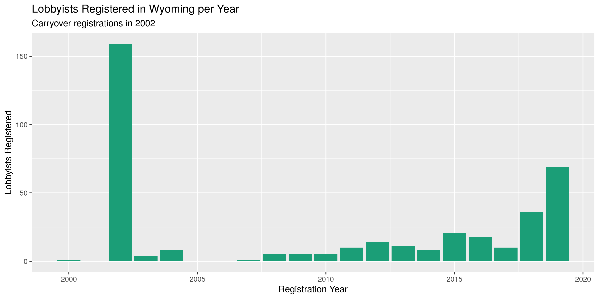

Wyoming Lobbyists
================
Kiernan Nicholls & Yanqi Xu
2023-08-05 11:50:42

- [Project](#project)
- [Objectives](#objectives)
- [Packages](#packages)
- [Data](#data)
- [Import](#import)
- [Explore](#explore)
- [Wrangle](#wrangle)
- [Export](#export)

<!-- Place comments regarding knitting here -->

## Project

The Accountability Project is an effort to cut across data silos and
give journalists, policy professionals, activists, and the public at
large a simple way to search across huge volumes of public data about
people and organizations.

Our goal is to standardizing public data on a few key fields by thinking
of each dataset row as a transaction. For each transaction there should
be (at least) 3 variables:

1.  All **parties** to a transaction
2.  The **date** of the transaction
3.  The **amount** of money involved

## Objectives

This document describes the process used to complete the following
objectives:

1.  How many records are in the database?
2.  Check for duplicates
3.  Check ranges
4.  Is there anything blank or missing?
5.  Check for consistency issues
6.  Create a five-digit ZIP Code called `ZIP5`
7.  Create a `YEAR` field from the transaction date
8.  Make sure there is data on both parties to a transaction

## Packages

The following packages are needed to collect, manipulate, visualize,
analyze, and communicate these results. The `pacman` package will
facilitate their installation and attachment.

The IRW’s `campfin` package will also have to be installed from GitHub.
This package contains functions custom made to help facilitate the
processing of campaign finance data.

``` r
if (!require("pacman")) install.packages("pacman")
pacman::p_load_gh("irworkshop/campfin")
pacman::p_load(
  tidyverse, # data manipulation
  lubridate, # datetime strings
  magrittr, # pipe opperators
  janitor, # dataframe clean
  refinr, # cluster and merge
  scales, # format strings
  knitr, # knit documents
  vroom, # read files fast
  httr, # http queries
  glue, # combine strings
  here, # relative storage
  fs # search storage 
)
```

This document should be run as part of the `R_campfin` project, which
lives as a sub-directory of the more general, language-agnostic
[`irworkshop/accountability_datacleaning`](https://github.com/irworkshop/accountability_datacleaning "TAP repo")
GitHub repository.

The `R_campfin` project uses the [RStudio
projects](https://support.rstudio.com/hc/en-us/articles/200526207-Using-Projects "Rproj")
feature and should be run as such. The project also uses the dynamic
`here::here()` tool for file paths relative to *your* machine.

``` r
# where does this document knit?
here::here()
#> [1] "/Users/yanqixu/code/accountability_datacleaning"
```

## Data

Data is obtained from the Wyoming Secretary of State’s office [Lobbying
Center](https://lobbyist.wyo.gov/Lobbyist/Default.aspx). From there, we
can download “a zip file containing the lobbyist data files for the
current period.” We’ll make a `httr::GET()` request on the file to
download write the raw ZIP archive to disk. The data was downloaded
August 4, 2023.

``` r
raw_dir <- here("state","wy", "lobby", "data", "raw")
dir_create(raw_dir)
```

``` r
lob_url <- "https://lobbyist.wyo.gov/Lobbyist/Download.aspx"
lob_head <- headers(HEAD(lob_url))
lob_file <- str_remove(lob_head[["content-disposition"]], "(.*);\\sfilename=")
lob_path <- str_c(raw_dir, lob_file, sep = "/")
if (!this_file_new(lob_path)) {
  GET(lob_url, write_disk(lob_path, overwrite = TRUE))
  unzip(lob_path, exdir = raw_dir)
}
```

## Import

The `schemaLobbyist.pdf` file outlines the relationship between the
three text files included in the ZIP archive. Using this guide, we can
add the principal organizations to each lobbyist.

First, we will use `vroom::vroom()` to read the data frame of lobbyists.

``` r
lobs <- vroom(
  .name_repair = make_clean_names,
  file = glue("{raw_dir}/LOBBYIST.txt"),
  delim = "|",
  col_types = cols(
    .default = col_character(),
    REGISTRATION_DATE = col_date_usa(),
    EXPIRATION_DATE = col_date_usa(),
    TERMINATED_DATE = col_date_usa()
  )
)

lobs <- lobs %>% 
  rename(
    lob_id = lobbyist_id,
    lob_num = lobbyist_num,
    lob_status = status_id,
    lob_reg = registration_date,
    lob_exp = expiration_date,
    lob_badge = name_on_badge,
    lob_first = first_name,
    lob_middle = middle_name,
    lob_last = last_name,
    zip = postal_code,
    lob_email = email,
    lob_term = terminated_date
  )

lobs <- lobs %>%
  mutate(lob_status = equals(lob_status, "Active")) %>% 
  rename(lob_active = lob_status)
```

Then, we will read the `LOBBYIST_ORGANIZATION_XREF.txt` file to get the
relational keys needed to add the information from
`LOBBYIST_ORGANIZATION.txt` to our lobbyists data frame.

``` r
xref <- vroom(
  .name_repair = make_clean_names,
  file = glue("{raw_dir}/LOBBYIST_ORGANIZATION_XREF.txt"),
  delim = "|",
  col_types = cols(
    .default = col_character()
  )
)

xref <- xref %>%
  remove_empty("cols") %>% 
  rename(
    xref_id = lobbyist_organization_xref_id,
    lob_id = lobbyist_id,
    org_id = lobbyist_organization_id
  )
```

``` r
orgs <- vroom(
  .name_repair = make_clean_names,
  file = glue("{raw_dir}/LOBBYIST_ORGANIZATION.txt"),
  delim = "|",
  col_types = cols(
    .default = col_character()
  )
)

orgs <- orgs %>% 
  rename(
    org_id = lobbyist_organization_id,
    org_num = lobbyist_organization_num,
    org_name = name,
    zip = postal_code
  ) %>% 
  mutate(phone = phone %>% str_remove("\\|$"))
```

Finally, we can use `dplyr::*_join()` to combine these three tables into
a single data frame with the full record of a lobbyist and a client
relationship.

``` r
wylr <- lobs %>% 
  left_join(xref, by = "lob_id") %>% 
  left_join(orgs, by = "org_id", suffix = c("_lob", "_org")) %>% 
  rename_prefix(suffix = c("_lob", "_org"))
```

## Explore

    #> # A tibble: 6 × 31
    #>   lob_id lob_num lob_active lob_reg lob_exp lob_b…¹ lob_f…² lob_m…³ lob_l…⁴ lob_a…⁵ lob_a…⁶ lob_a…⁷
    #>   <chr>  <chr>   <lgl>      <chr>   <chr>   <chr>   <chr>   <chr>   <chr>   <chr>   <chr>   <chr>  
    #> 1 1000   102122  TRUE       01/07/… 04/30/… Jody S… Jody    <NA>    Shields 822 We… <NA>    <NA>   
    #> 2 1004   102126  TRUE       01/08/… 04/30/… Peter … Peter   S.      Illoway 1653 M… <NA>    <NA>   
    #> 3 1004   102126  TRUE       01/08/… 04/30/… Peter … Peter   S.      Illoway 1653 M… <NA>    <NA>   
    #> 4 1004   102126  TRUE       01/08/… 04/30/… Peter … Peter   S.      Illoway 1653 M… <NA>    <NA>   
    #> 5 1004   102126  TRUE       01/08/… 04/30/… Peter … Peter   S.      Illoway 1653 M… <NA>    <NA>   
    #> 6 1046   102168  TRUE       01/24/… 04/30/… Steve … Stephen <NA>    Klein   Barr &… 1629 K… Ste. 3…
    #> # … with 19 more variables: lob_city <chr>, lob_state <chr>, lob_zip <chr>, lob_country <chr>,
    #> #   lob_phone <chr>, lob_email <chr>, lob_term <chr>, xref_id <chr>, org_id <chr>, org_num <chr>,
    #> #   org_name <chr>, org_addr1 <chr>, org_addr2 <chr>, org_addr3 <chr>, org_city <chr>,
    #> #   org_state <chr>, org_zip <chr>, org_country <chr>, org_phone <chr>, and abbreviated variable
    #> #   names ¹​lob_badge, ²​lob_first, ³​lob_middle, ⁴​lob_last, ⁵​lob_addr1, ⁶​lob_addr2, ⁷​lob_addr3
    #> # A tibble: 6 × 31
    #>   lob_id lob_num lob_active lob_reg lob_exp lob_b…¹ lob_f…² lob_m…³ lob_l…⁴ lob_a…⁵ lob_a…⁶ lob_a…⁷
    #>   <chr>  <chr>   <lgl>      <chr>   <chr>   <chr>   <chr>   <chr>   <chr>   <chr>   <chr>   <chr>  
    #> 1 886    102008  TRUE       10/27/… 04/30/… Jessie… Jessie  <NA>    Dafoe   PO Box… <NA>    <NA>   
    #> 2 892    102014  TRUE       01/11/… 04/30/… Chris … Chris   <NA>    Brown   919 Ra… <NA>    <NA>   
    #> 3 892    102014  TRUE       01/11/… 04/30/… Chris … Chris   <NA>    Brown   919 Ra… <NA>    <NA>   
    #> 4 963    102085  TRUE       03/02/… 04/30/… Donna … Donna   <NA>    Sheen   Wyomin… 710 E.… <NA>   
    #> 5 963    102085  TRUE       03/02/… 04/30/… Donna … Donna   <NA>    Sheen   Wyomin… 710 E.… <NA>   
    #> 6 976    102098  TRUE       09/04/… 04/30/… Michel… Michel… <NA>    Mack    325 7t… <NA>    <NA>   
    #> # … with 19 more variables: lob_city <chr>, lob_state <chr>, lob_zip <chr>, lob_country <chr>,
    #> #   lob_phone <chr>, lob_email <chr>, lob_term <chr>, xref_id <chr>, org_id <chr>, org_num <chr>,
    #> #   org_name <chr>, org_addr1 <chr>, org_addr2 <chr>, org_addr3 <chr>, org_city <chr>,
    #> #   org_state <chr>, org_zip <chr>, org_country <chr>, org_phone <chr>, and abbreviated variable
    #> #   names ¹​lob_badge, ²​lob_first, ³​lob_middle, ⁴​lob_last, ⁵​lob_addr1, ⁶​lob_addr2, ⁷​lob_addr3
    #> Rows: 360
    #> Columns: 31
    #> $ lob_id      <chr> "1000", "1004", "1004", "1004", "1004", "1046", "107", "107", "107", "107", "…
    #> $ lob_num     <chr> "102122", "102126", "102126", "102126", "102126", "102168", "101229", "101229…
    #> $ lob_active  <lgl> TRUE, TRUE, TRUE, TRUE, TRUE, TRUE, TRUE, TRUE, TRUE, TRUE, TRUE, TRUE, TRUE,…
    #> $ lob_reg     <chr> "01/07/2013", "01/08/2013", "01/08/2013", "01/08/2013", "01/08/2013", "01/24/…
    #> $ lob_exp     <chr> "04/30/2024", "04/30/2024", "04/30/2024", "04/30/2024", "04/30/2024", "04/30/…
    #> $ lob_badge   <chr> "Jody Shields", "Peter Illoway", "Peter Illoway", "Peter Illoway", "Peter Ill…
    #> $ lob_first   <chr> "Jody", "Peter", "Peter", "Peter", "Peter", "Stephen", "Sherlyn", "Sherlyn", …
    #> $ lob_middle  <chr> NA, "S.", "S.", "S.", "S.", NA, NA, NA, NA, NA, NA, NA, NA, NA, NA, NA, NA, N…
    #> $ lob_last    <chr> "Shields", "Illoway", "Illoway", "Illoway", "Illoway", "Klein", "Kaiser", "Ka…
    #> $ lob_addr1   <chr> "822 West 23rd Street, Unit A", "1653 Morningstar Rd.", "1653 Morningstar Rd.…
    #> $ lob_addr2   <chr> NA, NA, NA, NA, NA, "1629 K St NW", NA, NA, NA, NA, NA, NA, NA, NA, NA, NA, N…
    #> $ lob_addr3   <chr> NA, NA, NA, NA, NA, "Ste. 300", NA, NA, NA, NA, NA, NA, NA, NA, NA, NA, NA, N…
    #> $ lob_city    <chr> "Cheyenne", "Cheyenne", "Cheyenne", "Cheyenne", "Cheyenne", "Washington", "Ch…
    #> $ lob_state   <chr> "WY", "WY", "WY", "WY", "WY", "DC", "WY", "WY", "WY", "WY", "WY", "WY", "CO",…
    #> $ lob_zip     <chr> "82001", "82009", "82009", "82009", "82009", "20006", "82009", "82009", "8200…
    #> $ lob_country <chr> "USA", "USA", "USA", "USA", "USA", "USA", "USA", "USA", "USA", "USA", "USA", …
    #> $ lob_phone   <chr> "3077729050", "3076300359", "3076300359", "3076300359", "3076300359", "202804…
    #> $ lob_email   <chr> "jshields@wynonprofit.org", "peters1940@gmail.com", "peters1940@gmail.com", "…
    #> $ lob_term    <chr> NA, NA, NA, NA, NA, NA, NA, NA, NA, NA, NA, NA, NA, NA, NA, NA, NA, NA, NA, N…
    #> $ xref_id     <chr> "3626", "2496", "2498", "2499", "2500", "157", "2227", "2228", "2229", "2230"…
    #> $ org_id      <chr> "3626", "2496", "2498", "2499", "2500", "157", "2227", "2228", "2229", "2230"…
    #> $ org_num     <chr> "004763", "003633", "003635", "003636", "003637", "001294", "003364", "003365…
    #> $ org_name    <chr> "Wyoming Association of Nonprofit Organizations, d/b/a Wyoming Nonprofit Netw…
    #> $ org_addr1   <chr> "822 West 23rd Street, Unit A", "P O Box 1210", "8305 Otto Road", "1653 Morni…
    #> $ org_addr2   <chr> NA, NA, NA, NA, NA, "#274", NA, NA, NA, NA, NA, NA, NA, NA, NA, NA, NA, NA, N…
    #> $ org_addr3   <chr> NA, NA, NA, NA, NA, NA, NA, NA, NA, NA, NA, NA, NA, NA, NA, NA, NA, NA, NA, N…
    #> $ org_city    <chr> "Cheyenne", "Glenrock", "Cheyenne", "Cheyenne", "Laramie", "Cheyenne", "Caspe…
    #> $ org_state   <chr> "WY", "WY", "WY", "WY", "WY", "WY", "WY", "NC", "WY", "WY", "WY", "MT", "DC",…
    #> $ org_zip     <chr> "82001", "82637", "82007", "82009", "82070", "82001", "82601", "27101", "8293…
    #> $ org_country <chr> "USA", "USA", "USA", "USA", "USA", "USA", "USA", "USA", "USA", "USA", "USA", …
    #> $ org_phone   <chr> "", "3073586541", "3076372700", "3076352973", "", "3076327020", "3072591662",…

Most columns do not contain any missing information. Only 20 lobbyists
are missing either their phone number of email address. These variables
do not need to be flagged.

``` r
col_stats(wylr, count_na)
#> # A tibble: 31 × 4
#>    col         class     n       p
#>    <chr>       <chr> <int>   <dbl>
#>  1 lob_id      <chr>     0 0      
#>  2 lob_num     <chr>     0 0      
#>  3 lob_active  <lgl>     0 0      
#>  4 lob_reg     <chr>     0 0      
#>  5 lob_exp     <chr>     0 0      
#>  6 lob_badge   <chr>     0 0      
#>  7 lob_first   <chr>     0 0      
#>  8 lob_middle  <chr>   262 0.728  
#>  9 lob_last    <chr>     0 0      
#> 10 lob_addr1   <chr>     0 0      
#> 11 lob_addr2   <chr>   290 0.806  
#> 12 lob_addr3   <chr>   345 0.958  
#> 13 lob_city    <chr>     0 0      
#> 14 lob_state   <chr>     0 0      
#> 15 lob_zip     <chr>     0 0      
#> 16 lob_country <chr>     0 0      
#> 17 lob_phone   <chr>     8 0.0222 
#> 18 lob_email   <chr>    12 0.0333 
#> 19 lob_term    <chr>   355 0.986  
#> 20 xref_id     <chr>     1 0.00278
#> 21 org_id      <chr>     1 0.00278
#> 22 org_num     <chr>     1 0.00278
#> 23 org_name    <chr>     1 0.00278
#> 24 org_addr1   <chr>     1 0.00278
#> 25 org_addr2   <chr>   256 0.711  
#> 26 org_addr3   <chr>   359 0.997  
#> 27 org_city    <chr>     1 0.00278
#> 28 org_state   <chr>     1 0.00278
#> 29 org_zip     <chr>     1 0.00278
#> 30 org_country <chr>     1 0.00278
#> 31 org_phone   <chr>     1 0.00278
```

As you’d expect, some columns are more distinct than others. In our
original lobbyist and organization tables, the respect `*_id` variables
are 100% distinct, but lobbyists are repeated for every client
organization in our joined data frame.

``` r
col_stats(wylr, n_distinct)
#> # A tibble: 31 × 4
#>    col         class     n       p
#>    <chr>       <chr> <int>   <dbl>
#>  1 lob_id      <chr>   156 0.433  
#>  2 lob_num     <chr>   156 0.433  
#>  3 lob_active  <lgl>     2 0.00556
#>  4 lob_reg     <chr>   112 0.311  
#>  5 lob_exp     <chr>     3 0.00833
#>  6 lob_badge   <chr>   156 0.433  
#>  7 lob_first   <chr>   124 0.344  
#>  8 lob_middle  <chr>    31 0.0861 
#>  9 lob_last    <chr>   150 0.417  
#> 10 lob_addr1   <chr>   148 0.411  
#> 11 lob_addr2   <chr>    34 0.0944 
#> 12 lob_addr3   <chr>     4 0.0111 
#> 13 lob_city    <chr>    49 0.136  
#> 14 lob_state   <chr>    26 0.0722 
#> 15 lob_zip     <chr>    69 0.192  
#> 16 lob_country <chr>     1 0.00278
#> 17 lob_phone   <chr>   142 0.394  
#> 18 lob_email   <chr>   153 0.425  
#> 19 lob_term    <chr>     3 0.00833
#> 20 xref_id     <chr>   360 1      
#> 21 org_id      <chr>   360 1      
#> 22 org_num     <chr>   360 1      
#> 23 org_name    <chr>   309 0.858  
#> 24 org_addr1   <chr>   302 0.839  
#> 25 org_addr2   <chr>    75 0.208  
#> 26 org_addr3   <chr>     2 0.00556
#> 27 org_city    <chr>    96 0.267  
#> 28 org_state   <chr>    38 0.106  
#> 29 org_zip     <chr>   146 0.406  
#> 30 org_country <chr>     2 0.00556
#> 31 org_phone   <chr>   205 0.569
```

All but one of the lobbyists listed in the database have an “Active”
status. That lobbyist is the only one to have a termination date, as
we’d expect.

``` r
sum(!wylr$lob_active)
#> [1] 5
prop_na(wylr$lob_term)
#> [1] 0.9861111
prop_na(wylr$lob_term[wylr$lob_active])
#> [1] 1
```

## Wrangle

To improve the consistency and search ability of our accountability
database, we will perform some simple and **confident** manipulations to
the original data and create new, normalized variables.

### Year

First, we will add the year in which each lobbyist was registered.

``` r
wylr$lob_reg <- mdy(wylr$lob_reg)
wylr$lob_exp <- mdy(wylr$lob_exp)
wylr <- mutate(wylr, lob_year = year(lob_reg))
```

<!-- -->

### Phone

We can use `campfin::normal_phone()` to convert the numeric phone
numbers into an unambiguous character format. This prevents the column
from being read as a numeric variable.

``` r
wylr <- mutate_at(
  .tbl  = wylr,
  .vars = vars(ends_with("phone")),
  .funs = list(norm = normal_phone)
)
```

    #> # A tibble: 269 × 4
    #>    lob_phone  org_phone    lob_phone_norm org_phone_norm  
    #>    <chr>      <chr>        <chr>          <chr>           
    #>  1 3074136464 "3077333932" (307) 413-6464 "(307) 733-3932"
    #>  2 3077514488 "3077514488" (307) 751-4488 "(307) 751-4488"
    #>  3 3076401913 "3076401913" (307) 640-1913 "(307) 640-1913"
    #>  4 3036404267 ""           (303) 640-4267 ""              
    #>  5 3076311601 "4153896800" (307) 631-1601 "(415) 389-6800"
    #>  6 3072676218 "3074214094" (307) 267-6218 "(307) 421-4094"
    #>  7 3074325814 "3074325814" (307) 432-5814 "(307) 432-5814"
    #>  8 3076358761 "3076358761" (307) 635-8761 "(307) 635-8761"
    #>  9 3077784200 "3077332292" (307) 778-4200 "(307) 733-2292"
    #> 10 3076346484 ""           (307) 634-6484 ""              
    #> # … with 259 more rows

### Address

To normalize the street addresses, we will first `tidyr::unite()` each
address column into a single column and then pass that string to
`campfin::normal_address()`.

``` r
wylr <- wylr %>% 
  unite(
    starts_with("lob_addr"),
    col = "lob_addr_full",
    sep = " ",
    remove = FALSE,
    na.rm = TRUE
  ) %>% 
  mutate(
    lob_addr_norm = normal_address(
      address = lob_addr_full,
      abbs = usps_street
    )
  ) %>% 
  select(-ends_with("addr_full"))
```

``` r
wylr <- wylr %>% 
  unite(
    starts_with("org_addr"),
    col = "org_addr_full",
    sep = " ",
    remove = FALSE,
    na.rm = TRUE
  ) %>% 
  mutate(
    org_addr_norm = normal_address(
      address = org_addr_full,
      abbs = usps_street
    )
  ) %>% 
  select(-ends_with("addr_full"))
```

``` r
wylr %>% 
  select(starts_with("lob_addr")) %>% 
  distinct() %>% 
  sample_frac()
#> # A tibble: 149 × 4
#>    lob_addr1                   lob_addr2  lob_addr3 lob_addr_norm                
#>    <chr>                       <chr>      <chr>     <chr>                        
#>  1 P.O. Box 206                <NA>       <NA>      PO BOX 206                   
#>  2 419 S. 5th St.              Suite 1    <NA>      419 S 5TH ST SUITE 1         
#>  3 822 W. 23rd Street          <NA>       <NA>      822 W 23RD ST                
#>  4 410 West 3rd Avenue         <NA>       <NA>      410 WEST 3RD AVE             
#>  5 12811 NW Lorraine Drive     <NA>       <NA>      12811 NW LORRAINE DR         
#>  6 2776 S. Arlington Mill Dr   #803       <NA>      2776 S ARLINGTON MILL DR #803
#>  7 P.O. Box 4838               <NA>       <NA>      PO BOX 4838                  
#>  8 4000 House Ave.             <NA>       <NA>      4000 HOUSE AVE               
#>  9 7670 S Chester St 3rd Floor <NA>       <NA>      7670 S CHESTER ST 3RD FL     
#> 10 41 S. High Street           Suite 1800 <NA>      41 S HIGH STREET SUITE 1800  
#> # … with 139 more rows
```

### ZIP

Our database uses 5-digit ZIP codes, so we can pass the original postal
code variables to `campfin::normal_zip()` to trim the strings and try
and repair and broken formats.

``` r
wylr <- mutate_at(
  .tbl  = wylr,
  .vars = vars(ends_with("zip")),
  .funs = list(norm = normal_zip),
  na_rep = TRUE
)
```

    #> # A tibble: 13 × 4
    #>    lob_zip    org_zip    lob_zip_norm org_zip_norm
    #>    <chr>      <chr>      <chr>        <chr>       
    #>  1 82003-0085 82001      82003        82001       
    #>  2 82003-1347 20005      82003        20005       
    #>  3 82003-1347 83025      82003        83025       
    #>  4 82003-1347 80111      82003        80111       
    #>  5 82003-1347 84145      82003        84145       
    #>  6 82003-1347 20171      82003        20171       
    #>  7 82003-1347 84106      82003        84106       
    #>  8 82003-1347 63101      82003        63101       
    #>  9 82605-5068 82605-0568 82605        82605       
    #> 10 82003-1347 58503      82003        58503       
    #> 11 82003-1347 82003-1347 82003        82003       
    #> 12 82003-1347 75201      82003        75201       
    #> 13 82003-1347 84070      82003        84070

This makes out new ZIP variables very clean.

    #> # A tibble: 4 × 6
    #>   stage             prop_in n_distinct prop_na n_out n_diff
    #>   <chr>               <dbl>      <dbl>   <dbl> <dbl>  <dbl>
    #> 1 wylr$lob_zip        0.961         69 0          14      3
    #> 2 wylr$lob_zip_norm   1             67 0           0      0
    #> 3 wylr$org_zip        0.975        146 0.00278     9      9
    #> 4 wylr$org_zip_norm   0.997        140 0.00278     1      2

### State

This database contains a mix of full state names and 2-letter
abbreviations; we can pass these variables to `campfin::normal_state()`
to try and convert them all the abbreviations.

``` r
wylr <- mutate_at(
  .tbl  = wylr,
  .vars = vars(ends_with("state")),
  .funs = list(norm = normal_state),
  abbreviate = TRUE
)

wylr <- wylr %>% 
  mutate_at(
    .vars = vars(ends_with("state_norm")),
    .funs = str_replace, 
    "WY WY", "WY"
  )
```

    #> # A tibble: 69 × 4
    #>    lob_state    org_state lob_state_norm org_state_norm
    #>    <chr>        <chr>     <chr>          <chr>         
    #>  1 WY           FL        WY             FL            
    #>  2 WY           Utah      WY             UT            
    #>  3 WY           NE        WY             NE            
    #>  4 Colorado     CO        CO             CO            
    #>  5 WY           DC        WY             DC            
    #>  6 CO           MA        CO             MA            
    #>  7 MT - Montana DC        MT MT          DC            
    #>  8 NY           MA        NY             MA            
    #>  9 Utah         UT        UT             UT            
    #> 10 Wyoming      TN        WY             TN            
    #> # … with 59 more rows

    #> # A tibble: 4 × 6
    #>   stage               prop_in n_distinct prop_na n_out n_diff
    #>   <chr>                 <dbl>      <dbl>   <dbl> <dbl>  <dbl>
    #> 1 wylr$lob_state        0.947         26 0          19      8
    #> 2 wylr$lob_state_norm   0.997         19 0           1      1
    #> 3 wylr$org_state        0.916         38 0.00278    30      9
    #> 4 wylr$org_state_norm   1             31 0.00278     0      1

### City

The city values are typically the hardest to normalize due to the
variety of valid formats. Again, the `campfin::normal_city()` function
reduces inconsistencies and removes invalid values.

``` r
wylr <- mutate_at(
  .tbl  = wylr,
  .vars = vars(ends_with("city")),
  .funs = list(norm = normal_city),
  abbs = usps_city,
  na = invalid_city
)
```

Then, we can compare these normalized values to the *expected* values
for that record’s ZIP code. If the two values are similar, we can
confidently assume a typo was made and default to the expected value.

``` r
wylr <- wylr %>% 
  left_join(
    y = zipcodes,
    by = c(
      "org_state_norm" = "state",
      "org_zip_norm" = "zip"
    )
  ) %>% 
  rename(org_city_match = city) %>% 
  mutate(
    org_match_abb = is_abbrev(org_city_norm, org_city_match),
    org_match_dist = str_dist(org_city_norm, org_city_match),
    org_city_swap = if_else(
      condition = org_match_abb | org_match_dist == 1,
      true = org_city_match,
      false = org_city_norm
    )
  ) %>% 
  select(
    -org_city_match,
    -org_match_abb,
    -org_match_dist
  )
```

Our relatively few city values were already very clean, but this process
was able to make some quick and easy improvements.

    #> # A tibble: 5 × 6
    #>   stage                       prop_in n_distinct prop_na n_out n_diff
    #>   <chr>                         <dbl>      <dbl>   <dbl> <dbl>  <dbl>
    #> 1 str_to_upper(wylr$lob_city)   0.997         46 0           1      1
    #> 2 wylr$lob_city_norm            0.997         46 0           1      1
    #> 3 str_to_upper(wylr$org_city)   0.978         95 0.00278     8      7
    #> 4 wylr$org_city_norm            0.978         95 0.00278     8      7
    #> 5 wylr$org_city_swap            0.997         90 0.0111      1      2

Now we can remove the normalized city column in favor of our improved
compared value.

``` r
wylr <- wylr %>% 
  select(-org_city_norm) %>% 
  rename(org_city_norm = org_city_swap)
```

Even the few remaining values are actually valid and are just absent
from our list.

``` r
wylr %>% 
  filter(org_city_norm %out% valid_city) %>% 
  count(org_zip_norm, org_city_norm, sort = TRUE)
#> # A tibble: 6 × 3
#>   org_zip_norm org_city_norm         n
#>   <chr>        <chr>             <int>
#> 1 80111        GREENWOOD VILLAGE     4
#> 2 83120        <NA>                  2
#> 3 33408        JUNO BEACH            1
#> 4 75321        <NA>                  1
#> 5 82520        ETHETE                1
#> 6 <NA>         <NA>                  1
```

## Export

``` r
wylr <- wylr %>% 
  rename_with(~str_replace(., "_norm", "_clean"))
```

``` r
proc_dir <- here("state","wy", "lobby", "data", "processed")
dir_create(proc_dir)
```

``` r
write_csv(
  x = wylr,
  path = glue("{proc_dir}/wy_lobby_reg.csv"),
  na = ""
)
```
