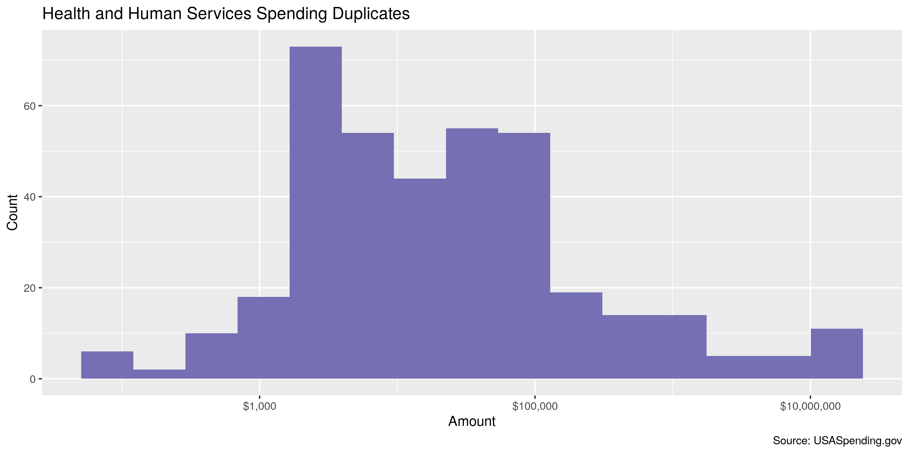
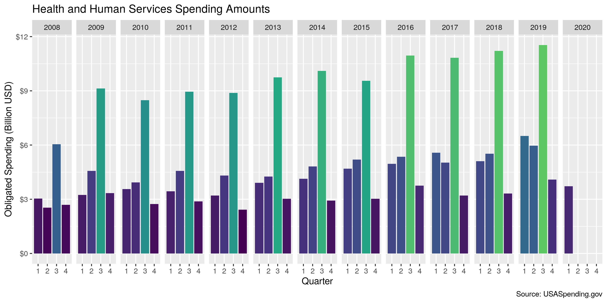

Health and Human Services Spending
================
Kiernan Nicholls
2020-03-16 11:42:47

  - [Project](#project)
  - [Objectives](#objectives)
  - [Packages](#packages)
  - [Data](#data)
  - [Download](#download)
  - [Layout](#layout)
  - [Read](#read)
  - [Explore](#explore)
  - [Missing](#missing)
  - [Duplicates](#duplicates)
  - [Amount](#amount)
  - [Wrangle](#wrangle)
  - [Conclude](#conclude)
  - [Export](#export)

<!-- Place comments regarding knitting here -->

## Project

The Accountability Project is an effort to cut across data silos and
give journalists, policy professionals, activists, and the public at
large a simple way to search across huge volumes of public data about
people and organizations.

Our goal is to standardizing public data on a few key fields by thinking
of each dataset row as a transaction. For each transaction there should
be (at least) 3 variables:

1.  All **parties** to a transaction.
2.  The **date** of the transaction.
3.  The **amount** of money involved.

## Objectives

This document describes the process used to complete the following
objectives:

1.  How many records are in the database?
2.  Check for entirely duplicated records.
3.  Check ranges of continuous variables.
4.  Is there anything blank or missing?
5.  Check for consistency issues.
6.  Create a five-digit ZIP Code called `zip`.
7.  Create a `year` field from the transaction date.
8.  Make sure there is data on both parties to a transaction.

## Packages

The following packages are needed to collect, manipulate, visualize,
analyze, and communicate these results. The `pacman` package will
facilitate their installation and attachment.

The IRW’s `campfin` package will also have to be installed from GitHub.
This package contains functions custom made to help facilitate the
processing of campaign finance data.

``` r
if (!require("pacman")) install.packages("pacman")
pacman::p_load_gh("irworkshop/campfin")
pacman::p_load(
  tidyverse, # data manipulation
  lubridate, # datetime strings
  magrittr, # pipe operators
  janitor, # dataframe clean
  refinr, # cluster and merge
  scales, # format strings
  readxl, # read excel
  knitr, # knit documents
  vroom, # read files fast
  glue, # combine strings
  here, # relative storage
  fs # search storage 
)
```

This document should be run as part of the `us_spending` project, which
lives as a sub-directory of the more general, language-agnostic
[`irworkshop/accountability_datacleaning`](https://github.com/irworkshop/accountability_datacleaning)
GitHub repository.

The `us_spending` project uses the [RStudio
projects](https://support.rstudio.com/hc/en-us/articles/200526207-Using-Projects)
feature and should be run as such. The project also uses the dynamic
`here::here()` tool for file paths relative to *your* machine.

``` r
# where does this document knit?
here::here()
#> [1] "/home/kiernan/Code/accountability_datacleaning/us_spending"
```

## Data

The data is obtained from the [USA Spending Award Data
Archive](https://www.usaspending.gov/#/download_center/award_data_archive).

> Welcome to the Award Data Archive, which features major agencies’
> award transaction data for full fiscal years. They’re a great way to
> get a view into broad spending trends and, best of all, the files are
> already prepared — you can access them instantaneously.

Data can be obtained from the archive as annual files for each agency.

## Download

If the zip archives have not been downloaded, we can do so now.

``` r
spend_url <- "https://files.usaspending.gov/award_data_archive/"
hhs_files <- glue("FY{2008:2020}_075_Contracts_Full_20200205.zip")
hhs_urls <- str_c(spend_url, hhs_files)
raw_dir <- dir_create(here("hhs", "data", "raw"))
hhs_paths <- path(raw_dir, hhs_files)
if (!all(file_exists(hhs_paths))) {
  download.file(hhs_urls, hhs_paths)
}
```

## Layout

The USA Spending website also provides a comprehensive data dictionary
which covers the many variables in this file.

``` r
dict_file <- file_temp(ext = "xlsx")
download.file(
  url = "https://files.usaspending.gov/docs/Data_Dictionary_Crosswalk.xlsx",
  destfile = dict_file
)
dict <- read_excel(
  path = dict_file, 
  range = "A2:L414",
  na = "N/A",
  .name_repair = make_clean_names
)

hhs_names <- names(read_csv(last(hhs_paths), n_max = 0))
# get cols from hhs data
mean(hhs_names %in% dict$award_element)
#> [1] 0.923913
dict <- dict %>% 
  filter(award_element %in% hhs_names) %>% 
  select(award_element, definition) %>% 
  mutate_at(vars(definition), str_replace_all, "\"", "\'") %>% 
  arrange(match(award_element, hhs_names))

dict %>% 
  head(10) %>% 
  mutate_at(vars(definition), str_trunc, 75) %>% 
  kable()
```

| award\_element                       | definition                                                                |
| :----------------------------------- | :------------------------------------------------------------------------ |
| award\_id\_piid                      | The unique identifier of the specific award being reported.               |
| modification\_number                 | The identifier of an action being reported that indicates the specific s… |
| transaction\_number                  | Tie Breaker for legal, unique transactions that would otherwise have the… |
| parent\_award\_agency\_id            | Identifier used to link agency in FPDS-NG to referenced IDV information.  |
| parent\_award\_agency\_name          | Name of the agency associated with the code in the Referenced IDV Agency… |
| parent\_award\_modification\_number  | When reporting orders under Indefinite Delivery Vehicles (IDV) such as a… |
| federal\_action\_obligation          | Amount of Federal government’s obligation, de-obligation, or liability f… |
| total\_dollars\_obligated            | This is a system generated element providing the sum of all the amounts … |
| base\_and\_exercised\_options\_value | The change (from this transaction only) to the current contract value (i… |
| current\_total\_value\_of\_award     | Total amount obligated to date on an award. For a contract, this amount … |

## Read

This archive file can be directly read as a data frame with
`vroom::vroom()`.

``` r
hhs <- vroom(
  file = hhs_paths,
  delim = ",",
  escape_backslash = FALSE,
  escape_double = FALSE,
  guess_max = 0,
  na = c("", "NA", "NAN", "*"),
  col_types = cols(
    .default = col_character(),
    action_date_fiscal_year = col_integer(),
    action_date = col_date(),
    federal_action_obligation = col_double()
  )
)
```

We can count a discrete categorical variable to ensure the file was read
properly. If there was an error reading one of the text files, the
columns will likely shift.

``` r
count(hhs, foreign_funding, sort = TRUE)
#> # A tibble: 4 x 2
#>   foreign_funding      n
#>   <chr>            <int>
#> 1 <NA>            583355
#> 2 X               439958
#> 3 B                 5484
#> 4 A                  149
```

Using the dictionary, we can select and rename only the 19 variables we
want.

``` r
hhs <- hhs %>% 
  select(
    key = contract_transaction_unique_key,
    id = award_id_piid,
    fy = action_date_fiscal_year,
    date = action_date,
    amount = federal_action_obligation,
    # agency_code = awarding_agency_code,
    agency = awarding_agency_name,
    # sub_code = awarding_sub_agency_code,
    sub_agency = awarding_sub_agency_name,
    # office_code = awarding_office_code,
    office = awarding_office_name,
    recipient = recipient_name,
    parent = recipient_parent_name,
    address1 = recipient_address_line_1,
    address2 = recipient_address_line_2,
    city = recipient_city_name,
    state = recipient_state_code,
    zip = recipient_zip_4_code,
    place = primary_place_of_performance_zip_4,
    type = award_type_code,
    desc = award_description
  )
```

## Explore

``` r
head(hhs)
#> # A tibble: 6 x 18
#>   key   id       fy date        amount agency sub_agency office recipient parent address1 address2
#>   <chr> <chr> <int> <date>       <dbl> <chr>  <chr>      <chr>  <chr>     <chr>  <chr>    <chr>   
#> 1 7529… HHSN…  2008 2008-09-30  1.95e5 DEPAR… NATIONAL … OD OM… TRIANGLE… TRIAN… 505 20T… <NA>    
#> 2 7529… HHSN…  2008 2008-09-30  1.19e3 DEPAR… NATIONAL … OD OM… TRIANGLE… TRIAN… 505 20T… <NA>    
#> 3 7530… HHSM…  2008 2008-09-30  2.98e5 DEPAR… CENTERS F… DEPT … GROUP HE… EMBLE… 441 9TH… <NA>    
#> 4 7530… HHSM…  2008 2008-09-30  1.00e3 DEPAR… CENTERS F… DEPT … QUALITY … VIRGI… 3001 CH… <NA>    
#> 5 7529… HHSN…  2008 2008-09-30  1.09e6 DEPAR… NATIONAL … NIDDK… CSR, INC. CSR  … 2107 WI… <NA>    
#> 6 7555… HHSP…  2008 2008-09-30 -1.86e5 DEPAR… OFFICE OF… DEPT … HEALTHCA… HEALT… 63 MIDD… <NA>    
#> # … with 6 more variables: city <chr>, state <chr>, zip <chr>, place <chr>, type <chr>, desc <chr>
tail(hhs)
#> # A tibble: 6 x 18
#>   key   id       fy date       amount agency sub_agency office recipient parent address1 address2
#>   <chr> <chr> <int> <date>      <dbl> <chr>  <chr>      <chr>  <chr>     <chr>  <chr>    <chr>   
#> 1 7529… HHSN…  2020 2019-10-01 1.84e4 DEPAR… NATIONAL … NATIO… PLANON C… PLANO… 45 BRAI… <NA>    
#> 2 7529… 75N9…  2020 2019-10-01 0.     DEPAR… NATIONAL … NATIO… SOFT COM… SOFT … 5400 TE… <NA>    
#> 3 7555… HHSP…  2020 2019-10-01 0.     DEPAR… OFFICE OF… PROGR… CW GOVER… CW GO… 4300 WI… <NA>    
#> 4 7570… HHSP…  2020 2019-10-01 5.80e6 DEPAR… OFFICE OF… PROGR… DELOITTE… DELOI… 1725 DU… <NA>    
#> 5 7526… HHSH…  2020 2019-10-01 1.03e3 DEPAR… HEALTH RE… HRSA … CELLCO P… VERIZ… ONE VER… <NA>    
#> 6 7529… HHSN…  2020 2019-10-01 1.68e4 DEPAR… NATIONAL … NATIO… ILLUMINA… ILLUM… 5200 IL… <NA>    
#> # … with 6 more variables: city <chr>, state <chr>, zip <chr>, place <chr>, type <chr>, desc <chr>
glimpse(sample_n(hhs, 20))
#> Observations: 20
#> Variables: 18
#> $ key        <chr> "7555_-NONE-_HHSP23320074107EC_6_-NONE-_0", "7529_7529_HHSN27100208_14_HHSN27…
#> $ id         <chr> "HHSP23320074107EC", "HHSN27100208", "HHSI247201600037W", "HHSN26300822", "HH…
#> $ fy         <int> 2009, 2014, 2016, 2014, 2018, 2013, 2010, 2015, 2012, 2011, 2015, 2012, 2016,…
#> $ date       <date> 2009-04-07, 2014-04-29, 2016-08-04, 2013-12-06, 2018-09-24, 2013-08-14, 2010…
#> $ amount     <dbl> 184003.17, 0.00, 81547.07, 5115.00, -134191.10, -3152.35, 20000.00, 60000.00,…
#> $ agency     <chr> "DEPARTMENT OF HEALTH AND HUMAN SERVICES (HHS)", "DEPARTMENT OF HEALTH AND HU…
#> $ sub_agency <chr> "OFFICE OF THE ASSISTANT SECRETARY FOR ADMINISTRATION (ASA)", "NATIONAL INSTI…
#> $ office     <chr> "DEPT OF HHS/OFF AST SEC HLTH EXPT NATL CNTR", "NIH, NIDA, OD OM OA OFC ACQUI…
#> $ recipient  <chr> "WV HEALTH INFORMATION NETWORK", "KELLY SERVICES, INC.", "NEW TECH SOLUTIONS,…
#> $ parent     <chr> "WV HEALTH INFORMATION NETWORK", "KELLY SERVICES, INC.", "NEW TECH SOLUTIONS …
#> $ address1   <chr> "100 DEE DRIVE", "999 W BIG BEAVER RD", "4179 BUSINESS CENTER DR", "2929 ARCH…
#> $ address2   <chr> NA, NA, NA, NA, NA, NA, NA, NA, NA, NA, NA, NA, NA, NA, NA, NA, NA, NA, NA, NA
#> $ city       <chr> "CHARLESTON", "TROY", "FREMONT", "PHILADELPHIA", "SAN DIEGO", "BILLINGS", "PA…
#> $ state      <chr> "WV", "MI", "CA", "PA", "CA", "MT", "MN", "OH", "FL", "UT", "PA", "MD", "PA",…
#> $ zip        <chr> "25311", "48084", "945386355", "191042857", "921303077", "591010124", "564704…
#> $ place      <chr> "253111600", "480844716", "860424000", "191042851", "850165319", "590430070",…
#> $ type       <chr> "D", "C", "C", "C", "C", "B", "B", "B", NA, "D", "B", "B", "D", "C", "D", "D"…
#> $ desc       <chr> "OTHER ADMINISTRATIVE SUPPORT SVCS", "IGF::OT::IGF - OTHER FUNCTIONS - PROGRA…
```

## Missing

There are only a handful of records missing one of the key variables we
need to identify a unique spending transaction.

``` r
col_stats(hhs, count_na)
#> # A tibble: 18 x 4
#>    col        class        n          p
#>    <chr>      <chr>    <int>      <dbl>
#>  1 key        <chr>        0 0         
#>  2 id         <chr>        0 0         
#>  3 fy         <int>        0 0         
#>  4 date       <date>       0 0         
#>  5 amount     <dbl>        0 0         
#>  6 agency     <chr>        0 0         
#>  7 sub_agency <chr>        0 0         
#>  8 office     <chr>        5 0.00000486
#>  9 recipient  <chr>      315 0.000306  
#> 10 parent     <chr>     2155 0.00209   
#> 11 address1   <chr>     1089 0.00106   
#> 12 address2   <chr>  1016058 0.987     
#> 13 city       <chr>      837 0.000813  
#> 14 state      <chr>    12020 0.0117    
#> 15 zip        <chr>     1895 0.00184   
#> 16 place      <chr>    85236 0.0828    
#> 17 type       <chr>    78955 0.0767    
#> 18 desc       <chr>     3527 0.00343
```

``` r
hhs <- hhs %>% flag_na(date, agency, amount, recipient)
sum(hhs$na_flag)
#> [1] 315
mean(hhs$na_flag)
#> [1] 0.0003061385
```

## Duplicates

There are a number of records that could potentially be duplicates of
one another. Much of them have an `amount` value of zero, so they might
not be true duplicates. We can flag them nonetheless.

``` r
hhs <- flag_dupes(hhs, -key)
sum(hhs$dupe_flag)
#> [1] 3246
```

``` r
hhs %>% 
  filter(dupe_flag) %>% 
  select(date, agency, amount, recipient)
#> # A tibble: 3,246 x 4
#>    date       agency                                       amount recipient                        
#>    <date>     <chr>                                         <dbl> <chr>                            
#>  1 2008-09-30 DEPARTMENT OF HEALTH AND HUMAN SERVICES (HH…      0 ADVERTISING IDEAS, INC           
#>  2 2008-09-30 DEPARTMENT OF HEALTH AND HUMAN SERVICES (HH…      0 UNIFIRST CORPORATION             
#>  3 2008-09-30 DEPARTMENT OF HEALTH AND HUMAN SERVICES (HH…      0 ADVERTISING IDEAS, INC           
#>  4 2008-09-30 DEPARTMENT OF HEALTH AND HUMAN SERVICES (HH…      0 EN POINTE TECHNOLOGIES INCORPORA…
#>  5 2008-09-30 DEPARTMENT OF HEALTH AND HUMAN SERVICES (HH…      0 MATHESON TRI-GAS, INC            
#>  6 2008-09-30 DEPARTMENT OF HEALTH AND HUMAN SERVICES (HH…      0 INX INC                          
#>  7 2008-09-30 DEPARTMENT OF HEALTH AND HUMAN SERVICES (HH…      0 EN POINTE TECHNOLOGIES INCORPORA…
#>  8 2008-09-30 DEPARTMENT OF HEALTH AND HUMAN SERVICES (HH…      0 INX INC                          
#>  9 2008-09-30 DEPARTMENT OF HEALTH AND HUMAN SERVICES (HH…      0 MATHESON TRI-GAS, INC            
#> 10 2008-09-30 DEPARTMENT OF HEALTH AND HUMAN SERVICES (HH…      0 UNIFIRST CORPORATION             
#> # … with 3,236 more rows
```

<!-- -->

## Amount

*Many* spending transactions have a value of zero.

``` r
summary(hhs$amount)
#>       Min.    1st Qu.     Median       Mean    3rd Qu.       Max. 
#> -309023311          0       5970     253511      31034  690144920
mean(hhs$amount <= 0)
#> [1] 0.3556008
```

<!-- -->

## Wrangle

We do not need to normaliza any of the geographic variable much. We can
trim the `zip` variable and that is it.

``` r
sample(hhs$address1, 6)
#> [1] "4025 HANCOCK ST. STE. 100"        "10813 S RIVER FRONT PKWY STE 135"
#> [3] "15 HAMPSHIRE ST"                  "180 N STETSON AVE FL 49"         
#> [5] "2303 LINDBERG ST"                 "6082 FRANCONIA RD STE C"
progress_table(hhs$state, compare = valid_state)
#> # A tibble: 1 x 6
#>   stage prop_in n_distinct prop_na n_out n_diff
#>   <chr>   <dbl>      <dbl>   <dbl> <dbl>  <dbl>
#> 1 state       1         57  0.0117     0      1
hhs <- mutate_at(hhs, vars(zip, place), normal_zip)
progress_table(hhs$zip, compare = valid_zip)
#> # A tibble: 1 x 6
#>   stage prop_in n_distinct prop_na n_out n_diff
#>   <chr>   <dbl>      <dbl>   <dbl> <dbl>  <dbl>
#> 1 zip     0.994       9732 0.00184  6522    711
progress_table(hhs$city, compare = c(valid_city, extra_city))
#> # A tibble: 1 x 6
#>   stage prop_in n_distinct  prop_na n_out n_diff
#>   <chr>   <dbl>      <dbl>    <dbl> <dbl>  <dbl>
#> 1 city    0.986       5173 0.000813 14675    789
```

## Conclude

1.  There are 1028946 records in the database.
2.  There are 3246 duplicate records in the database.
3.  The range and distribution of `amount` and `date` seem reasonable.
4.  There are 315 records missing either recipient or date.
5.  Consistency in goegraphic data has been improved with
    `campfin::normal_*()`.
6.  The 4-digit `year` variable has been created with
    `lubridate::year()`.

## Export

``` r
clean_dir <- dir_create(here("hhs", "spending", "data", "clean"))
```

``` r
write_csv(
  x = hhs,
  path = path(clean_dir, "hhs_contracts_clean.csv"),
  na = ""
)
```
