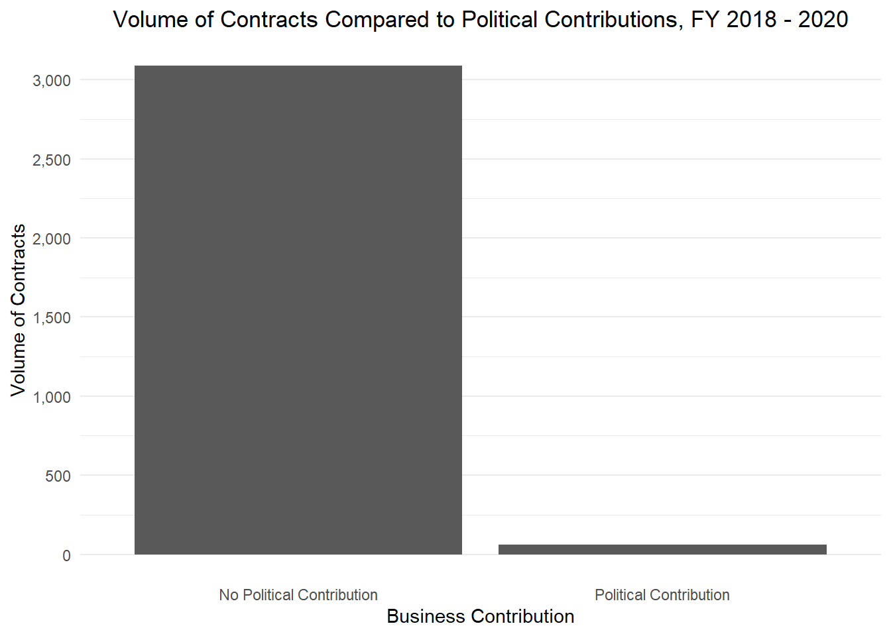
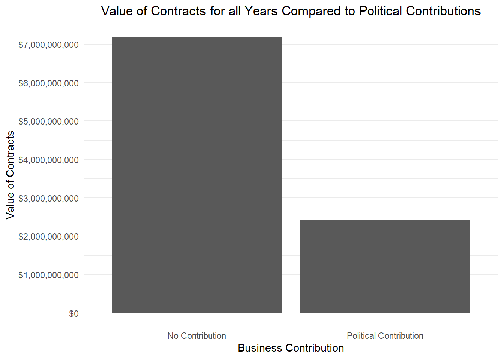
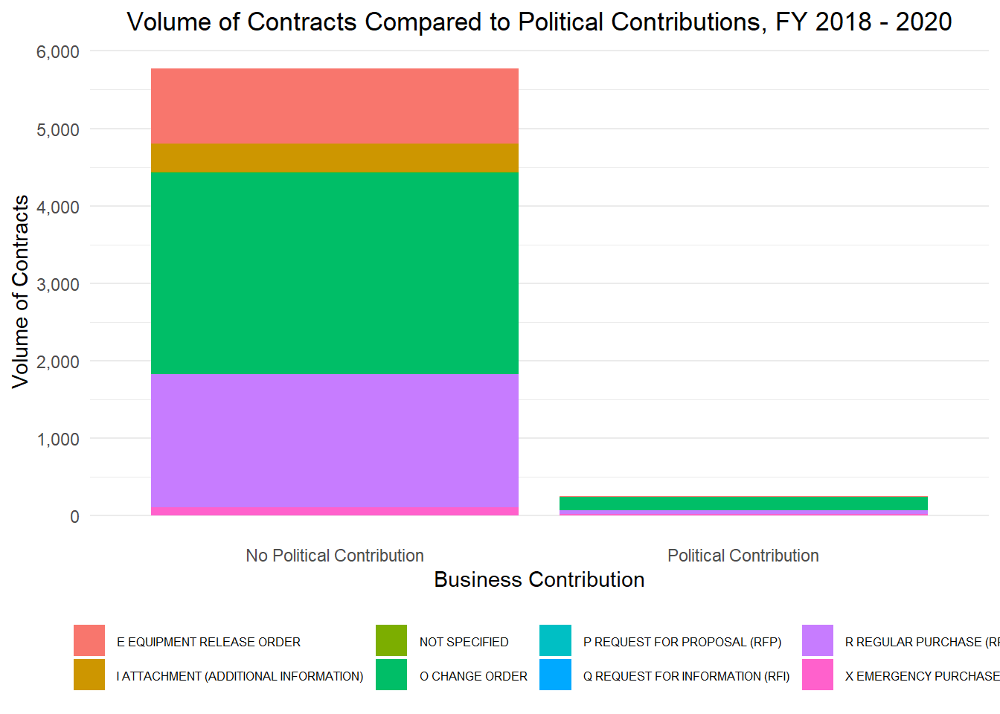
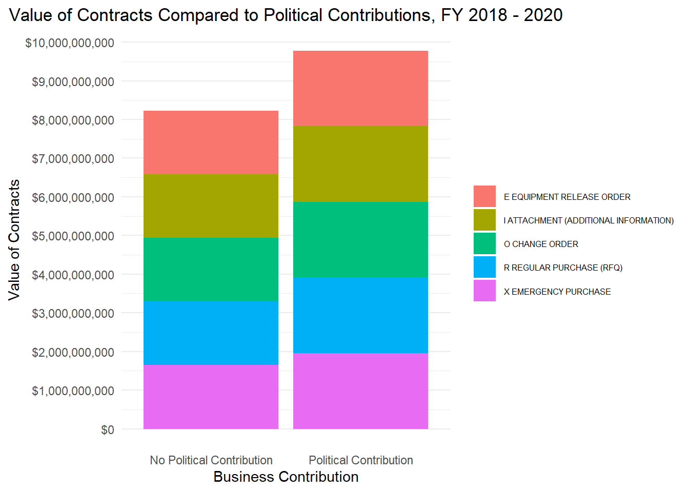
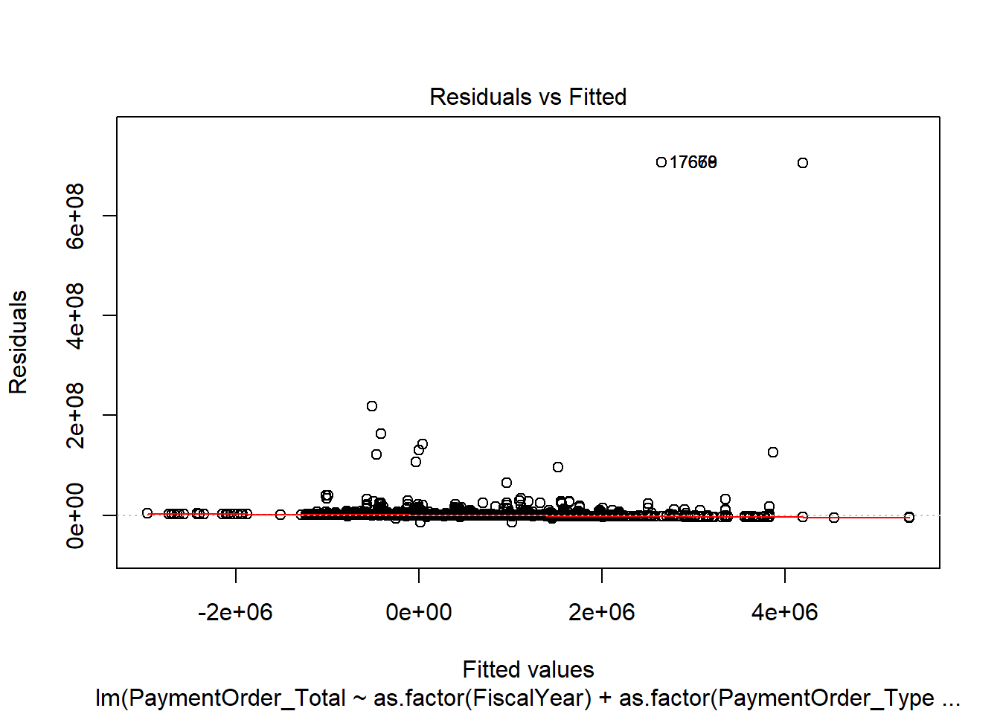
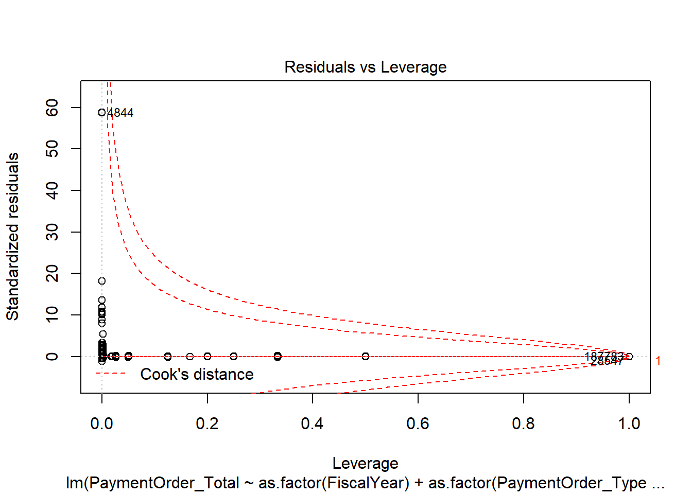

Merged Contributions Contracts Analysis
=======================================

#### Kevin Shrawder

#### 11/23/2020

## Project

The Accountability Project is an effort to cut across data silos and give journalists, policy professionals, activists, and the public at large a simple way to search across huge volumes of public data about people and organizations.

Our goal with the West Virginia contracts data is to explore how the state has been spending contracting funds.

## Objectives

This document will walk through the data exploration that was completed on the West Virginia contracts dataset.

## Software

This data is processed using the free, open-source statistical computing language R, which can be installed from CRAN \[[https://cran.r-project.org/](https://cran.r-project.org/)\] for various opperating systems. For example, R can be installed from the apt package repository on Ubuntu.

The following additional R packages are needed to collect, manipulate, visualize, analyze, and communicate these results. The `tidyverse` package will facilitate their installation and attachment.

    library(tidyverse)

## Data

The data used in this analysis are a combination of political contributions for the State of West Virginina from 2018 - 2020 and the West Virginia Contracts data. For information on how to process or obtain these files, see the other documetation on The Accountability Project Github Page ([https://github.com/irworkshop/accountability\_datacleaning](https://github.com/irworkshop/accountability_datacleaning)).

Read the data into R.

    matchedContribContracts <- read_csv('Contributions_Contracts_Matched.csv')
    contracts <- read_csv('WestVirginiaContracts_fy2006_fy2020.csv')

First, explore the overall volume of contracts in the data set for those with a political contribution and for those without.

    matchedContribContracts %>%
      select(PaymentOrder_Number, CampFinContribFlag) %>%
      distinct() %>%
      count(CampFinContribFlag) %>%
      mutate(CampFinContribFlag = ifelse(CampFinContribFlag == 0, 'No Political Contribution', 'Political Contribution')) %>%
      ggplot(aes(x = CampFinContribFlag, y = n)) + 
      geom_col() +
      theme_minimal() + 
      xlab('Business Contribution') + 
      ylab('Volume of Contracts') +
      ggtitle('Volume of Contracts for all Years Compared to Political Contributions') +
      scale_y_continuous(breaks = scales::pretty_breaks(8), labels = scales::comma) +
      theme(panel.grid.major.x = element_blank(),
            plot.title = element_text(hjust = .5))
            

From this chart, it appears that among all years those who contribute may not have connections to more contracts.

We will now also explore the volume of contracts connected to those with political contributions versus not limited to the fiscal years of 2018 - 2020 which roughly match the years of data present in the contributions data.

    matchedContribContracts %>%
      filter(FiscalYear > 2017) %>%
      select(PaymentOrder_Number, CampFinContribFlag) %>%
      distinct() %>%
      count(CampFinContribFlag) %>%
      mutate(CampFinContribFlag = ifelse(CampFinContribFlag == 0, 'No Political Contribution', 'Political Contribution')) %>%
      ggplot(aes(x = CampFinContribFlag, y = n)) + 
      geom_col() +
      theme_minimal() + 
      xlab('Business Contribution') + 
      ylab('Volume of Contracts') +
      ggtitle('Volume of Contracts Compared to Political Contributions, FY 2018 - 2020') +
      scale_y_continuous(breaks = scales::pretty_breaks(8), labels = scales::comma) +
      theme(panel.grid.major.x = element_blank(),
            plot.title = element_text(hjust = .5))

Again, it appears that those businesses making political contributions do not receive more contracts than those who do not, on the whole.

Another analysis conducted is to look at the amount of money contracts are worth. Here we compare the sum of all contract awards for Fiscal Year 2018 - Fiscal Year 2020 by those who have made political contributions and those who have not.

    matchedContribContracts %>%
      filter(FiscalYear > 2017) %>%
      select(PaymentOrder_Total, CampFinContribFlag) %>%
      mutate(Contribution = ifelse(CampFinContribFlag == 1, PaymentOrder_Total, 0),
             `No Contribution` = ifelse(CampFinContribFlag == 0, PaymentOrder_Total, 0),
             Contribution = sum(Contribution),
             `No Contribution` = sum(`No Contribution`)) %>%
      select(Contribution, `No Contribution`) %>%
      distinct() %>%
      gather(key = 'Contrib', value = 'Value') %>%
      mutate(Contrib = ifelse(Contrib == 'Contribution', 'Political Contribution', 'No Political Contribution')) %>%
      ggplot(aes(x = Contrib, y = Value)) + 
      geom_col() +
      theme_minimal() + 
      xlab('Business Contribution') + 
      ylab('Value of Contracts') +
      ggtitle('Value of Contracts Compared to Political Contributions, FY 2018 - 2020') +
      scale_y_continuous(breaks = scales::pretty_breaks(8), labels = scales::dollar) +
      theme(panel.grid.major.x = element_blank(),
            plot.title = element_text(hjust = .5))

It looks like the total value of contracts for businesses who did make political contributions is about $300,000.00 greater than business who did not. This is interesting since there was a very large disparity between the volume of contracts. It means that businesses who contributed to political campaigns may have an edge over those who didn’t in the dollar amount of the contracts.

It will be interesting to see if this trend exists throughout the whole years of the contracts data (despite the limitation that there are only three years of contracts available, the same companies could have contributed in years previous).

    matchedContribContracts %>%
      select(PaymentOrder_Total, CampFinContribFlag) %>%
      mutate(`Political Contribution` = ifelse(CampFinContribFlag == 1, PaymentOrder_Total, 0),
             `No Contribution` = ifelse(CampFinContribFlag == 0, PaymentOrder_Total, 0),
            `Political Contribution` = sum(`Political Contribution`),
             `No Contribution` = sum(`No Contribution`)) %>%
      select(`Political Contribution`, `No Contribution`) %>%
      distinct() %>%
      gather(key = 'Contrib', value = 'Value') %>%
      ggplot(aes(x = Contrib, y = Value)) + 
      geom_col() +
      theme_minimal() + 
      xlab('Business Contribution') + 
      ylab('Value of Contracts') +
      ggtitle('Value of Contracts for all Years Compared to Political Contributions') +
      scale_y_continuous(breaks = scales::pretty_breaks(8), labels = scales::dollar) +
      theme(panel.grid.major.x = element_blank(),
            plot.title = element_text(hjust = .5))

It looks like there may not be a trend here, however we would need the complete contributions data from 2006 - 2017 in order to confirm or deny this observation.

Now we’d like to examine the volume of contracts broken down by the contract description. This will help to determine if there is a specific category in which contracts are awarded more to those with political contributions than not.

    matchedContribContracts %>%
      filter(FiscalYear > 2017) %>%
      select(PaymentOrder_Number, CampFinContribFlag, PaymentOrder_Type) %>%
      count(CampFinContribFlag, PaymentOrder_Type) %>%
      mutate(CampFinContribFlag = ifelse(CampFinContribFlag == 0, 'No Political Contribution', 'Political Contribution')) %>%
      distinct() %>%
      mutate(PaymentOrder_Type = ifelse(is.na(PaymentOrder_Type), 'NOT SPECIFIED', PaymentOrder_Type)) %>%
      ggplot(aes(x = CampFinContribFlag, y = n, fill = PaymentOrder_Type)) + 
      geom_col() +
      theme_minimal() + 
      xlab('Business Contribution') + 
      ylab('Volume of Contracts') +
      ggtitle('Volume of Contracts Compared to Political Contributions, FY 2018 - 2020') +
      scale_y_continuous(breaks = scales::pretty_breaks(8), labels = scales::comma) +
      theme(panel.grid.major.x = element_blank(),
            plot.title = element_text(hjust = .5),
            legend.position = 'bottom',
            legend.text = element_text(size = 6),
            legend.title = element_blank())

Looking at the volume of contracts between those who have made a contribution and those who have not, we see that both categories are heavily made up of change orders. This is not surprising since we found a similar trend in the exploratory analysis of the contracts data.

However, since we found a different trend in the value of contracts between those who made contributions and those who didn’t, we will now also analyze that split up by the description of the contract.

    matchedContribContracts %>%
      filter(FiscalYear > 2017) %>%
      select(PaymentOrder_Total, CampFinContribFlag, PaymentOrder_Type) %>%
      filter(PaymentOrder_Total > 0) %>%
      mutate(Contribution = ifelse(CampFinContribFlag == 1, PaymentOrder_Total, 0),
             `No Contribution` = ifelse(CampFinContribFlag == 0, PaymentOrder_Total, 0),
             Contribution = sum(Contribution),
             `No Contribution` = sum(`No Contribution`)) %>%
      select(Contribution, `No Contribution`, PaymentOrder_Type) %>%
      distinct() %>%
      gather(-PaymentOrder_Type, key = 'Contrib', value = 'Value') %>%
      mutate(Contrib = ifelse(Contrib == 'Contribution', 'Political Contribution', 'No Political Contribution'),
             PaymentOrder_Type = ifelse(is.na(PaymentOrder_Type), 'NOT SPECIFIED', PaymentOrder_Type)) %>%
      ggplot(aes(x = Contrib, y = Value, fill = PaymentOrder_Type)) + 
      geom_col() +
      theme_minimal() + 
      xlab('Business Contribution') + 
      ylab('Value of Contracts') +
      ggtitle('Value of Contracts Compared to Political Contributions, FY 2018 - 2020') +
      scale_y_continuous(breaks = scales::pretty_breaks(8), labels = scales::dollar) +
      theme(panel.grid.major.x = element_blank(),
            plot.title = element_text(hjust = .5),
            legend.position = 'right',
            legend.text = element_text(size = 6),
            legend.title = element_blank())

Most of the categories of spending seem fairly similar. However, it appears that those who make political contributions do have more valuable emergency purchase contracts, as well as equipment release orders.

Simple comparison of means via a box plot to see if political contributions are significant.

    matchedContribContracts %>%
      select(FiscalYear, PaymentOrder_Total, CampFinContribFlag) %>%
      filter(FiscalYear > 2017) %>%
      select(-FiscalYear) %>%
      mutate(CampFinContribFlag = ifelse(CampFinContribFlag == 0, 'No Political Contribution', 'Political Contribution')) %>%
      filter(!is.na(PaymentOrder_Total)) %>%
      ggplot(aes(x = as.factor(CampFinContribFlag), y = PaymentOrder_Total)) + 
      geom_boxplot() + 
      theme_minimal() + 
      ggtitle('Box plot of Contract Amount by Political Contribution Identifier FY 2018 - 2020') +
      ylab('Contract Value (Dollars)') +
      scale_y_continuous(labels = scales::dollar) +
      theme(panel.grid.major.x = element_blank(),
            axis.title.x = element_blank(),
            plot.title = element_text(hjust = .5))

The box plots do not reveal much except for both groups have significant outliers which could be impacting the measurements. We will now perform a comparison of means using the t.tests to ensure that this is true.

    matchedContribContracts %>%
      select(FiscalYear, PaymentOrder_Total, CampFinContribFlag) %>%
      filter(FiscalYear > 2017) %>%
      select(-FiscalYear) %>%
      filter(!is.na(PaymentOrder_Total))->
      tTEST
    
    t.test(PaymentOrder_Total ~ CampFinContribFlag, data = tTEST)

    ## 
    ##  Welch Two Sample t-test
    ## 
    ## data:  PaymentOrder_Total by CampFinContribFlag
    ## t = -3.8634, df = 245.15, p-value = 0.0001432
    ## alternative hypothesis: true difference in means is not equal to 0
    ## 95 percent confidence interval:
    ##  -11576199  -3758220
    ## sample estimates:
    ## mean in group 0 mean in group 1 
    ##        284346.1       7951555.8

    wilcox.test(PaymentOrder_Total ~ CampFinContribFlag, data = tTEST)

    ## 
    ##  Wilcoxon rank sum test with continuity correction
    ## 
    ## data:  PaymentOrder_Total by CampFinContribFlag
    ## W = 771851, p-value = 0.01251
    ## alternative hypothesis: true location shift is not equal to 0

The t-test and the Wilcox test reveal those who contribute do, on average, get contracts valued worth more than those who do not contribute.

Now that this has been explored, further analysis is required to dig deeper into how a political contribution plays into the value of contracts received. A simple regression analysis with the dependent value of the contract amount should help suss out answers to these questions.

    add <- contracts %>%
      select(PaymentOrder_Number, DepartmentAbbreviation, FiscalYear, PaymentOrder_Type)
    
    regData <- left_join(matchedContribContracts, add, by = c("PaymentOrder_Number", "PaymentOrder_Type", "FiscalYear"))
    
    reg <- lm(PaymentOrder_Total ~ as.factor(FiscalYear) + as.factor(PaymentOrder_Type) + as.factor(CampFinContribFlag) + as.factor(DepartmentAbbreviation), data = regData)
    stepwise <- step(reg, direction = 'both')

    ## Start:  AIC=9038371
    ## PaymentOrder_Total ~ as.factor(FiscalYear) + as.factor(PaymentOrder_Type) + 
    ##     as.factor(CampFinContribFlag) + as.factor(DepartmentAbbreviation)
    ## 
    ##                                     Df  Sum of Sq        RSS     AIC
    ## <none>                                            3.9989e+19 9038371
    ## - as.factor(CampFinContribFlag)      1 7.3140e+15 3.9996e+19 9038419
    ## - as.factor(DepartmentAbbreviation) 37 1.8572e+16 4.0007e+19 9038425
    ## - as.factor(FiscalYear)             14 7.3290e+16 4.0062e+19 9038850
    ## - as.factor(PaymentOrder_Type)      12 8.4113e+16 4.0073e+19 9038929

    summary(stepwise)

    ## 
    ## Call:
    ## lm(formula = PaymentOrder_Total ~ as.factor(FiscalYear) + as.factor(PaymentOrder_Type) + 
    ##     as.factor(CampFinContribFlag) + as.factor(DepartmentAbbreviation), 
    ##     data = regData)
    ## 
    ## Residuals:
    ##       Min        1Q    Median        3Q       Max 
    ## -14707191   -206818      5300    119534 706404985 
    ## 
    ## Coefficients:
    ##                                                                   Estimate
    ## (Intercept)                                                       -1588034
    ## as.factor(FiscalYear)2007                                         -1543406
    ## as.factor(FiscalYear)2008                                         -2573445
    ## as.factor(FiscalYear)2009                                         -2336231
    ## as.factor(FiscalYear)2010                                         -2004607
    ## as.factor(FiscalYear)2011                                         -2567268
    ## as.factor(FiscalYear)2012                                         -2129920
    ## as.factor(FiscalYear)2013                                         -1990005
    ## as.factor(FiscalYear)2014                                         -2038251
    ## as.factor(FiscalYear)2015                                         -2018337
    ## as.factor(FiscalYear)2016                                         -1948757
    ## as.factor(FiscalYear)2017                                         -1985988
    ## as.factor(FiscalYear)2018                                         -1972037
    ## as.factor(FiscalYear)2019                                          -231517
    ## as.factor(FiscalYear)2020                                         -2000170
    ## as.factor(PaymentOrder_Type)B AGENCY CONTRACT                      4161479
    ## as.factor(PaymentOrder_Type)C STATEWIDE CONTRACT                   2483447
    ## as.factor(PaymentOrder_Type)D DIRECT PURCHASE                      1964680
    ## as.factor(PaymentOrder_Type)E EQUIPMENT RELEASE ORDER              1957865
    ## as.factor(PaymentOrder_Type)F CONSTRUCTION                         3344149
    ## as.factor(PaymentOrder_Type)I ATTACHMENT (ADDITIONAL INFORMATION)  2113525
    ## as.factor(PaymentOrder_Type)N NO AWARD                             2007561
    ## as.factor(PaymentOrder_Type)O CHANGE ORDER                         2388132
    ## as.factor(PaymentOrder_Type)P REQUEST FOR PROPOSAL (RFP)           1232792
    ## as.factor(PaymentOrder_Type)Q REQUEST FOR INFORMATION (RFI)        2547609
    ## as.factor(PaymentOrder_Type)R REGULAR PURCHASE (RFQ)               1939705
    ## as.factor(PaymentOrder_Type)X EMERGENCY PURCHASE                   2179506
    ## as.factor(CampFinContribFlag)1                                      517973
    ## as.factor(DepartmentAbbreviation)19                                -120906
    ## as.factor(DepartmentAbbreviation)2                                 1148659
    ## as.factor(DepartmentAbbreviation)20                                1654653
    ## as.factor(DepartmentAbbreviation)ADJ                                370418
    ## as.factor(DepartmentAbbreviation)B & C                             1667236
    ## as.factor(DepartmentAbbreviation)B&C                               1021179
    ## as.factor(DepartmentAbbreviation)B+C                               1638334
    ## as.factor(DepartmentAbbreviation)CCTC                              2089249
    ## as.factor(DepartmentAbbreviation)DAP                               1727865
    ## as.factor(DepartmentAbbreviation)DEO                               1812023
    ## as.factor(DepartmentAbbreviation)DEP                                381323
    ## as.factor(DepartmentAbbreviation)DHHR                              1186293
    ## as.factor(DepartmentAbbreviation)DHHS                              1773346
    ## as.factor(DepartmentAbbreviation)DHR                               -237214
    ## as.factor(DepartmentAbbreviation)DIT                               1767170
    ## as.factor(DepartmentAbbreviation)DNR                               1551434
    ## as.factor(DepartmentAbbreviation)DOA                               2779047
    ## as.factor(DepartmentAbbreviation)DOC                               1074439
    ## as.factor(DepartmentAbbreviation)DODC                              1648499
    ## as.factor(DepartmentAbbreviation)DOE                                984331
    ## as.factor(DepartmentAbbreviation)DOH                               1312499
    ## as.factor(DepartmentAbbreviation)DOR                               1252540
    ## as.factor(DepartmentAbbreviation)DOS                               1407051
    ## as.factor(DepartmentAbbreviation)DOT                               1618187
    ## as.factor(DepartmentAbbreviation)E & A                             1277837
    ## as.factor(DepartmentAbbreviation)E&A                               1105407
    ## as.factor(DepartmentAbbreviation)E&E                               1785652
    ## as.factor(DepartmentAbbreviation)ECO                               2327534
    ## as.factor(DepartmentAbbreviation)EDD                               1039170
    ## as.factor(DepartmentAbbreviation)ELJ                               1188522
    ## as.factor(DepartmentAbbreviation)G                                 1479116
    ## as.factor(DepartmentAbbreviation)GSD                               1655713
    ## as.factor(DepartmentAbbreviation)HEPC                              1007848
    ## as.factor(DepartmentAbbreviation)MAAPS                             -800098
    ## as.factor(DepartmentAbbreviation)MAPS                              1206180
    ## as.factor(DepartmentAbbreviation)PUR                               1725995
    ## as.factor(DepartmentAbbreviation)SWC                               1129663
    ##                                                                   Std. Error
    ## (Intercept)                                                         12013316
    ## as.factor(FiscalYear)2007                                             150284
    ## as.factor(FiscalYear)2008                                             154103
    ## as.factor(FiscalYear)2009                                             154751
    ## as.factor(FiscalYear)2010                                             153257
    ## as.factor(FiscalYear)2011                                             145338
    ## as.factor(FiscalYear)2012                                             154901
    ## as.factor(FiscalYear)2013                                             159776
    ## as.factor(FiscalYear)2014                                             184156
    ## as.factor(FiscalYear)2015                                             200132
    ## as.factor(FiscalYear)2016                                             177719
    ## as.factor(FiscalYear)2017                                             184002
    ## as.factor(FiscalYear)2018                                             211429
    ## as.factor(FiscalYear)2019                                             212398
    ## as.factor(FiscalYear)2020                                             213248
    ## as.factor(PaymentOrder_Type)B AGENCY CONTRACT                         212552
    ## as.factor(PaymentOrder_Type)C STATEWIDE CONTRACT                      212455
    ## as.factor(PaymentOrder_Type)D DIRECT PURCHASE                         544595
    ## as.factor(PaymentOrder_Type)E EQUIPMENT RELEASE ORDER                 272014
    ## as.factor(PaymentOrder_Type)F CONSTRUCTION                            522840
    ## as.factor(PaymentOrder_Type)I ATTACHMENT (ADDITIONAL INFORMATION)     260810
    ## as.factor(PaymentOrder_Type)N NO AWARD                                476872
    ## as.factor(PaymentOrder_Type)O CHANGE ORDER                            195989
    ## as.factor(PaymentOrder_Type)P REQUEST FOR PROPOSAL (RFP)             6939695
    ## as.factor(PaymentOrder_Type)Q REQUEST FOR INFORMATION (RFI)          2694683
    ## as.factor(PaymentOrder_Type)R REGULAR PURCHASE (RFQ)                  206791
    ## as.factor(PaymentOrder_Type)X EMERGENCY PURCHASE                      511029
    ## as.factor(CampFinContribFlag)1                                         72750
    ## as.factor(DepartmentAbbreviation)19                                 16989289
    ## as.factor(DepartmentAbbreviation)2                                  16987954
    ## as.factor(DepartmentAbbreviation)20                                 16989250
    ## as.factor(DepartmentAbbreviation)ADJ                                16988365
    ## as.factor(DepartmentAbbreviation)B & C                              13159496
    ## as.factor(DepartmentAbbreviation)B&C                                12022668
    ## as.factor(DepartmentAbbreviation)B+C                                16987781
    ## as.factor(DepartmentAbbreviation)CCTC                               14711917
    ## as.factor(DepartmentAbbreviation)DAP                                14713454
    ## as.factor(DepartmentAbbreviation)DEO                                16987793
    ## as.factor(DepartmentAbbreviation)DEP                                13430401
    ## as.factor(DepartmentAbbreviation)DHHR                               12012999
    ## as.factor(DepartmentAbbreviation)DHHS                               16987474
    ## as.factor(DepartmentAbbreviation)DHR                                16987515
    ## as.factor(DepartmentAbbreviation)DIT                                14712068
    ## as.factor(DepartmentAbbreviation)DNR                                13870640
    ## as.factor(DepartmentAbbreviation)DOA                                12013286
    ## as.factor(DepartmentAbbreviation)DOC                                12013798
    ## as.factor(DepartmentAbbreviation)DODC                               12975755
    ## as.factor(DepartmentAbbreviation)DOE                                12012902
    ## as.factor(DepartmentAbbreviation)DOH                                12121385
    ## as.factor(DepartmentAbbreviation)DOR                                12014860
    ## as.factor(DepartmentAbbreviation)DOS                                14712053
    ## as.factor(DepartmentAbbreviation)DOT                                12012230
    ## as.factor(DepartmentAbbreviation)E & A                              12741019
    ## as.factor(DepartmentAbbreviation)E&A                                12017523
    ## as.factor(DepartmentAbbreviation)E&E                                14711929
    ## as.factor(DepartmentAbbreviation)ECO                                16988747
    ## as.factor(DepartmentAbbreviation)EDD                                12017806
    ## as.factor(DepartmentAbbreviation)ELJ                                12014528
    ## as.factor(DepartmentAbbreviation)G                                  14713071
    ## as.factor(DepartmentAbbreviation)GSD                                16988953
    ## as.factor(DepartmentAbbreviation)HEPC                               12169663
    ## as.factor(DepartmentAbbreviation)MAAPS                              16988245
    ## as.factor(DepartmentAbbreviation)MAPS                               12013228
    ## as.factor(DepartmentAbbreviation)PUR                                16988123
    ## as.factor(DepartmentAbbreviation)SWC                                12012557
    ##                                                                   t value
    ## (Intercept)                                                        -0.132
    ## as.factor(FiscalYear)2007                                         -10.270
    ## as.factor(FiscalYear)2008                                         -16.700
    ## as.factor(FiscalYear)2009                                         -15.097
    ## as.factor(FiscalYear)2010                                         -13.080
    ## as.factor(FiscalYear)2011                                         -17.664
    ## as.factor(FiscalYear)2012                                         -13.750
    ## as.factor(FiscalYear)2013                                         -12.455
    ## as.factor(FiscalYear)2014                                         -11.068
    ## as.factor(FiscalYear)2015                                         -10.085
    ## as.factor(FiscalYear)2016                                         -10.965
    ## as.factor(FiscalYear)2017                                         -10.793
    ## as.factor(FiscalYear)2018                                          -9.327
    ## as.factor(FiscalYear)2019                                          -1.090
    ## as.factor(FiscalYear)2020                                          -9.380
    ## as.factor(PaymentOrder_Type)B AGENCY CONTRACT                      19.579
    ## as.factor(PaymentOrder_Type)C STATEWIDE CONTRACT                   11.689
    ## as.factor(PaymentOrder_Type)D DIRECT PURCHASE                       3.608
    ## as.factor(PaymentOrder_Type)E EQUIPMENT RELEASE ORDER               7.198
    ## as.factor(PaymentOrder_Type)F CONSTRUCTION                          6.396
    ## as.factor(PaymentOrder_Type)I ATTACHMENT (ADDITIONAL INFORMATION)   8.104
    ## as.factor(PaymentOrder_Type)N NO AWARD                              4.210
    ## as.factor(PaymentOrder_Type)O CHANGE ORDER                         12.185
    ## as.factor(PaymentOrder_Type)P REQUEST FOR PROPOSAL (RFP)            0.178
    ## as.factor(PaymentOrder_Type)Q REQUEST FOR INFORMATION (RFI)         0.945
    ## as.factor(PaymentOrder_Type)R REGULAR PURCHASE (RFQ)                9.380
    ## as.factor(PaymentOrder_Type)X EMERGENCY PURCHASE                    4.265
    ## as.factor(CampFinContribFlag)1                                      7.120
    ## as.factor(DepartmentAbbreviation)19                                -0.007
    ## as.factor(DepartmentAbbreviation)2                                  0.068
    ## as.factor(DepartmentAbbreviation)20                                 0.097
    ## as.factor(DepartmentAbbreviation)ADJ                                0.022
    ## as.factor(DepartmentAbbreviation)B & C                              0.127
    ## as.factor(DepartmentAbbreviation)B&C                                0.085
    ## as.factor(DepartmentAbbreviation)B+C                                0.096
    ## as.factor(DepartmentAbbreviation)CCTC                               0.142
    ## as.factor(DepartmentAbbreviation)DAP                                0.117
    ## as.factor(DepartmentAbbreviation)DEO                                0.107
    ## as.factor(DepartmentAbbreviation)DEP                                0.028
    ## as.factor(DepartmentAbbreviation)DHHR                               0.099
    ## as.factor(DepartmentAbbreviation)DHHS                               0.104
    ## as.factor(DepartmentAbbreviation)DHR                               -0.014
    ## as.factor(DepartmentAbbreviation)DIT                                0.120
    ## as.factor(DepartmentAbbreviation)DNR                                0.112
    ## as.factor(DepartmentAbbreviation)DOA                                0.231
    ## as.factor(DepartmentAbbreviation)DOC                                0.089
    ## as.factor(DepartmentAbbreviation)DODC                               0.127
    ## as.factor(DepartmentAbbreviation)DOE                                0.082
    ## as.factor(DepartmentAbbreviation)DOH                                0.108
    ## as.factor(DepartmentAbbreviation)DOR                                0.104
    ## as.factor(DepartmentAbbreviation)DOS                                0.096
    ## as.factor(DepartmentAbbreviation)DOT                                0.135
    ## as.factor(DepartmentAbbreviation)E & A                              0.100
    ## as.factor(DepartmentAbbreviation)E&A                                0.092
    ## as.factor(DepartmentAbbreviation)E&E                                0.121
    ## as.factor(DepartmentAbbreviation)ECO                                0.137
    ## as.factor(DepartmentAbbreviation)EDD                                0.086
    ## as.factor(DepartmentAbbreviation)ELJ                                0.099
    ## as.factor(DepartmentAbbreviation)G                                  0.101
    ## as.factor(DepartmentAbbreviation)GSD                                0.097
    ## as.factor(DepartmentAbbreviation)HEPC                               0.083
    ## as.factor(DepartmentAbbreviation)MAAPS                             -0.047
    ## as.factor(DepartmentAbbreviation)MAPS                               0.100
    ## as.factor(DepartmentAbbreviation)PUR                                0.102
    ## as.factor(DepartmentAbbreviation)SWC                                0.094
    ##                                                                   Pr(>|t|)    
    ## (Intercept)                                                       0.894835    
    ## as.factor(FiscalYear)2007                                          < 2e-16 ***
    ## as.factor(FiscalYear)2008                                          < 2e-16 ***
    ## as.factor(FiscalYear)2009                                          < 2e-16 ***
    ## as.factor(FiscalYear)2010                                          < 2e-16 ***
    ## as.factor(FiscalYear)2011                                          < 2e-16 ***
    ## as.factor(FiscalYear)2012                                          < 2e-16 ***
    ## as.factor(FiscalYear)2013                                          < 2e-16 ***
    ## as.factor(FiscalYear)2014                                          < 2e-16 ***
    ## as.factor(FiscalYear)2015                                          < 2e-16 ***
    ## as.factor(FiscalYear)2016                                          < 2e-16 ***
    ## as.factor(FiscalYear)2017                                          < 2e-16 ***
    ## as.factor(FiscalYear)2018                                          < 2e-16 ***
    ## as.factor(FiscalYear)2019                                         0.275708    
    ## as.factor(FiscalYear)2020                                          < 2e-16 ***
    ## as.factor(PaymentOrder_Type)B AGENCY CONTRACT                      < 2e-16 ***
    ## as.factor(PaymentOrder_Type)C STATEWIDE CONTRACT                   < 2e-16 ***
    ## as.factor(PaymentOrder_Type)D DIRECT PURCHASE                     0.000309 ***
    ## as.factor(PaymentOrder_Type)E EQUIPMENT RELEASE ORDER             6.14e-13 ***
    ## as.factor(PaymentOrder_Type)F CONSTRUCTION                        1.60e-10 ***
    ## as.factor(PaymentOrder_Type)I ATTACHMENT (ADDITIONAL INFORMATION) 5.35e-16 ***
    ## as.factor(PaymentOrder_Type)N NO AWARD                            2.56e-05 ***
    ## as.factor(PaymentOrder_Type)O CHANGE ORDER                         < 2e-16 ***
    ## as.factor(PaymentOrder_Type)P REQUEST FOR PROPOSAL (RFP)          0.859003    
    ## as.factor(PaymentOrder_Type)Q REQUEST FOR INFORMATION (RFI)       0.344445    
    ## as.factor(PaymentOrder_Type)R REGULAR PURCHASE (RFQ)               < 2e-16 ***
    ## as.factor(PaymentOrder_Type)X EMERGENCY PURCHASE                  2.00e-05 ***
    ## as.factor(CampFinContribFlag)1                                    1.08e-12 ***
    ## as.factor(DepartmentAbbreviation)19                               0.994322    
    ## as.factor(DepartmentAbbreviation)2                                0.946091    
    ## as.factor(DepartmentAbbreviation)20                               0.922414    
    ## as.factor(DepartmentAbbreviation)ADJ                              0.982604    
    ## as.factor(DepartmentAbbreviation)B & C                            0.899182    
    ## as.factor(DepartmentAbbreviation)B&C                              0.932311    
    ## as.factor(DepartmentAbbreviation)B+C                              0.923170    
    ## as.factor(DepartmentAbbreviation)CCTC                             0.887072    
    ## as.factor(DepartmentAbbreviation)DAP                              0.906516    
    ## as.factor(DepartmentAbbreviation)DEO                              0.915054    
    ## as.factor(DepartmentAbbreviation)DEP                              0.977349    
    ## as.factor(DepartmentAbbreviation)DHHR                             0.921336    
    ## as.factor(DepartmentAbbreviation)DHHS                             0.916859    
    ## as.factor(DepartmentAbbreviation)DHR                              0.988859    
    ## as.factor(DepartmentAbbreviation)DIT                              0.904391    
    ## as.factor(DepartmentAbbreviation)DNR                              0.910942    
    ## as.factor(DepartmentAbbreviation)DOA                              0.817058    
    ## as.factor(DepartmentAbbreviation)DOC                              0.928737    
    ## as.factor(DepartmentAbbreviation)DODC                             0.898905    
    ## as.factor(DepartmentAbbreviation)DOE                              0.934695    
    ## as.factor(DepartmentAbbreviation)DOH                              0.913774    
    ## as.factor(DepartmentAbbreviation)DOR                              0.916972    
    ## as.factor(DepartmentAbbreviation)DOS                              0.923807    
    ## as.factor(DepartmentAbbreviation)DOT                              0.892840    
    ## as.factor(DepartmentAbbreviation)E & A                            0.920112    
    ## as.factor(DepartmentAbbreviation)E&A                              0.926712    
    ## as.factor(DepartmentAbbreviation)E&E                              0.903395    
    ## as.factor(DepartmentAbbreviation)ECO                              0.891027    
    ## as.factor(DepartmentAbbreviation)EDD                              0.931094    
    ## as.factor(DepartmentAbbreviation)ELJ                              0.921199    
    ## as.factor(DepartmentAbbreviation)G                                0.919923    
    ## as.factor(DepartmentAbbreviation)GSD                              0.922363    
    ## as.factor(DepartmentAbbreviation)HEPC                             0.933998    
    ## as.factor(DepartmentAbbreviation)MAAPS                            0.962436    
    ## as.factor(DepartmentAbbreviation)MAPS                             0.920023    
    ## as.factor(DepartmentAbbreviation)PUR                              0.919074    
    ## as.factor(DepartmentAbbreviation)SWC                              0.925077    
    ## ---
    ## Signif. codes:  0 '***' 0.001 '**' 0.01 '*' 0.05 '.' 0.1 ' ' 1
    ## 
    ## Residual standard error: 12010000 on 277160 degrees of freedom
    ##   (43 observations deleted due to missingness)
    ## Multiple R-squared:  0.005275,   Adjusted R-squared:  0.005045 
    ## F-statistic: 22.97 on 64 and 277160 DF,  p-value: < 2.2e-16

The regression output provides an overview of the results which indicate the political contribution does in fact have an impact on the value of the contract received. The model is significant, though it has an extremely low prediction value. Also interesting is that the type of entry has an impact, as well as the fiscal year. The fiscal year finding is not surprising as we saw in the original exploratory analysis the vast variation between both the volume and value of contracts in the different years. From a little bit of research, this variation is natural as the priorities of the state vary from year to year.

We should also look at the plots to verify there are no issues with the underlying assumptions.

    plot(stepwise)

There do appear to be some issues with the underlying assumptions. However, the finding of a significant positive impact on the amount of contracts based on the political contributions, fiscal year and the type of contract.

## Conclusion

It was found that those who contribute politically, on average, have contracts worth more value than those who do not despite the disparity between the volume of contracts. This could indicate that those who contribute politically are more likely to receive contracts, but further analysis would be needed to verify that. This calls to attention some of the limitations, namely that this is not an exhaustive data set. There are other divisions that also manage their own contracting which may not be included in this data. Additionally, the data was hand prepared and obtained via a freedom of information act so the data entry across the over 40,000 records could have flaws that were not detected.
